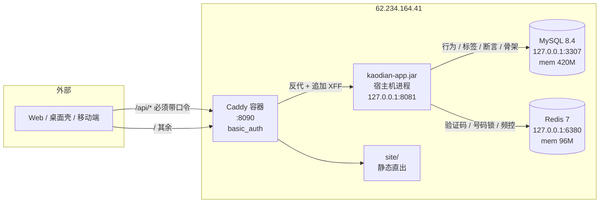

## 测试环境:MySQL + Redis + 对外联调

本目录是 `62.234.164.41` 那套测试环境的全部配置。落地于 KUBI-112,基线 `origin/v1` @ `411b97a`。

**不是**生产部署方案:没有 TLS、没有备份、没有端点级鉴权、只有一份口令。它是一套让三端能连上同一份数据的联调环境。

---

## 一、这套环境长什么样



三件事各自落在哪:

| 关注点 | 落点 | 为什么 |
|---|---|---|
| 谁能连进来 | `Caddyfile` 的 `basic_auth` | `/api/v1/syllabus/*` 的 archive/delete/rename/order **可写且无身份认证**,裸暴露 = 任何人 curl 一下就能悄悄归档掉考点 |
| 后端还绑不绑回环 | **绑,`server.address=127.0.0.1` 一个字没改** | 唯一入口是同机 Caddy。这条保证由内核给,不用去验证 docker 的网络隔离 |
| 数据库能不能从外面连 | 不能,只发布到 `127.0.0.1` | 多发布一个 3306 就等于把上面那道门白装了 |

---

## 二、复现:从零把这套环境搭起来

前置:目标机能 ssh、装了 docker + docker compose。下面每一步都在**本机仓库根目录**执行,`REMOTE` 换成你的目标机。

```bash
REMOTE=ubuntu@62.234.164.41

# ① 传配置(注意 schema.sql 的相对路径 —— compose 直接挂仓库里那一份,不复制第二份)
ssh $REMOTE 'mkdir -p ~/kaodian/deploy ~/kaodian/server/db ~/kaodian/deploy/site'
rsync -a --exclude='.env' --exclude='*.jar' deploy/ $REMOTE:~/kaodian/deploy/
rsync -a server/db/ $REMOTE:~/kaodian/server/db/

# ② 填口令。三个口令现生成,不要用模板里的示例值
ssh $REMOTE 'cd ~/kaodian/deploy && cp .env.example .env && chmod 600 .env'
ssh $REMOTE 'docker run --rm caddy:2-alpine caddy hash-password --plaintext "你的联调口令"'
#   把输出的 bcrypt 串填进 .env 的 KAODIAN_TEST_PASS_HASH
#   🔴 值一律用单引号包起来:JDBC 连接串里有 &,不加引号时 app.sh 那句 `. ./.env` 会把它截断
#   🔴 bcrypt 里的 $ 保持单个,不要写成 $$ —— 它走 caddy 服务的 env_file 原样传进容器,不经 compose 插值

# ③ 起三个容器
ssh $REMOTE 'cd ~/kaodian/deploy && docker compose up -d && docker compose ps'

# ④ 建表。🔴 代码不建表,这一步必须人来跑
ssh $REMOTE 'cd ~/kaodian/deploy && set -a; . ./.env; set +a;
  docker exec -i kaodian-mysql mysql -uroot -p"$MYSQL_ROOT_PASSWORD" kaodian < ~/kaodian/server/db/schema.sql'

# ⑤ 目标机装 JRE 21(后端跑在宿主机上,不在容器里)
ssh $REMOTE 'sudo apt-get update -qq && sudo apt-get install -y openjdk-21-jre-headless'

# ⑥ 本机打包 + 传 jar + 起服务
./server/build.sh -B -ntp -DskipTests package
scp server/kaodian-app/target/kaodian-app-0.0.1-SNAPSHOT.jar $REMOTE:~/kaodian/deploy/kaodian-app.jar
ssh $REMOTE 'cd ~/kaodian/deploy && ./app.sh start'

# ⑦ 整条链路跑一遍:拍照 → 出文字 → 挂考点 → 覆盖度变了
ssh $REMOTE 'cd ~/kaodian/deploy && ./smoke.sh'
```

`./app.sh {start|stop|status|logs}` 管后端进程。它只杀自己 pid 文件里那个 PID ——
这台机器上还跑着 Multica 平台,**永远不要按进程名杀 java / multica**。

### 表结构改了怎么办

🔴 **不许原地改 `schema.sql` 里已有的 `CREATE TABLE`。** 线上库已经按那一份建过了,原地改的那一版谁也跑不到,
而看文件的人会以为它跑到了。追加一段带日期与议题号的 `ALTER` 到文件末尾,然后:

```bash
ssh $REMOTE 'cd ~/kaodian/deploy && set -a; . ./.env; set +a;
  docker exec -i kaodian-mysql mysql -uroot -p"$MYSQL_ROOT_PASSWORD" kaodian < ~/kaodian/server/db/schema.sql'
```

`CREATE TABLE IF NOT EXISTS` 让整份脚本可以重复跑,已存在的表跳过、新追加的 `ALTER` 生效。

---

## 三、三端要填的联调地址

```
协议 + 域名/IP + 端口   http://62.234.164.41:8090
路径前缀               /api/v1
认证                   HTTP Basic(用户名 kaodian,口令另行给出)
```

⚠️ **今天这个地址从公网还打不通**:`62.234.164.41` 的云安全组只放行了 22 / 3000 / 8080 / 8411,
8090 不在里面(实测 8080 回 404、8090 无响应;机器本地 `curl 127.0.0.1:8090` 一切正常)。
安全组是云控制台的事,机器上改不了。**需要有权限的人加一条:放行 TCP 8090。**
在那之前三端用 SSH 本地转发,地址形状与将来完全一致,只是主机名换成 `127.0.0.1`:

```bash
ssh -fN -L 8090:127.0.0.1:8090 ubuntu@62.234.164.41
# → http://127.0.0.1:8090/api/v1
```

### 浏览器端怎么接

**推荐同源,不要跨域。** dev server 把 `/api` 代理过去,页面与接口同一个 origin,
`ApiCorsConfig` 与 `allowed-origins` 一个字不用动(`壳技术方案` §62 的口径就是「跨域是部署形态的事」)。

```ts
// vite.config.ts
server: {
  proxy: {
    '/api': {
      target: 'http://127.0.0.1:8090',      // 或放行后的 http://62.234.164.41:8090
      changeOrigin: true,
      headers: { Authorization: 'Basic ' + btoa('kaodian:口令') },
    },
  },
}
```

真要直连跨域,把来源填进 `.env` 的 `KAODIAN_CORS_ORIGINS`(逗号分隔)重启后端即可。
`Caddyfile` 已经放行了 `OPTIONS` 预检 —— 预检不带凭证,挡住它的表现会是「跨域失败」而根因在鉴权。

---

## 四、这套环境的安全边界:说清楚它挡什么、不挡什么

| | |
|---|---|
| ✅ 挡住 | 匿名 curl 打任何 `/api/*`,包括那 13 个无认证的 syllabus 写端点 |
| ✅ 挡住 | 从公网连 MySQL / Redis(只发布到回环) |
| ✅ 挡住 | 伪造 `X-Forwarded-For` 绕过「单 IP 20/日」——Caddy 追加的真实地址在最右,`ClientIp` 取最右(实测:伪造 `1.2.3.4` 后 Redis 里仍只有真实 IP 那一个桶) |
| ❌ **不挡** | **拿到口令的人对全部数据是管理员。** 端点级鉴权(`B0-4`:过滤器 + 七行白名单)本轮没做 —— 除 10 个端点外,全站仍然不校验 token |
| ❌ 不挡 | 明文 HTTP。没有 TLS,口令在链路上是 base64 不是密文。**只在可信网络里用** |
| ❌ 不挡 | 同一份口令所有人共用,没有按人区分,撤销 = 换口令 |

这三条 ❌ 是「联调环境」与「生产」的差别本身,不是遗漏。要变成生产,先做 `B0-4`。

---

## 五、这一轮迁了什么、没迁什么

| 数据 | 落点 | 说明 |
|---|---|---|
| 行为层 `touch` | **MySQL** | 幂等落在 `uk_touch_client_token` 唯一索引上 |
| 标签层 `record_tag` | **MySQL** | 主标签不占行,由 `effectiveTagsOf` 现推 |
| 断言层 `user_assertion` | **MySQL** | `node_code` 即主键 |
| 骨架层 `syllabus_*` | **MySQL** | 名字唯一性走 `name_key` 列(MySQL 的 collation 不做 NFKC) |
| 验证码 / 号码锁 / 短信频控 | **Redis** | 判据是「重启归零会不会送出东西」——频控计数器归零 = 白送一遍额度,而短信真花钱 |
| 账号 / 令牌 / 手机号密文 / 注册流水 | **仍是文件** | ⚪ 见下 |
| agent 的 run / message / tool_call / trace_event | **仍是文件,而且不该进库** | 🔴 见下 |

⚪ **账号与令牌为什么没迁。** 它们在单实例下是正确的(`AuthJsonFile` 全量重写 + 原子 rename),
而这一轮的触发条件是「公网可达」,不是「第二个实例」。迁移本身不难,难的是三处必须原子的写
(`create` 跨三个 store、`merge`、`rekeyPhones`)和一处需要额外查询才能拿到 `ownerUserId` 的唯一键冲突 ——
把它塞进这一轮,等于让一个已经动了四张表的改动再多担一份账号数据的风险。
**它必须在起第二个实例之前迁完**:`R-70` 写着文件存储的前提消失时是无声的。

🔴 **agent 的运行记录为什么不进库,而且以后也不该进。**
`MessagePart.TextPart#text` / `ToolCallPart#arguments` / `ToolResultPart#result` / `ToolCall#result` /
`TraceEvent#detail` 五个字段**没有任何长度上限**。要建表就得给它们 `TEXT` —— 那就是「能装下题干的列」,
正是 R-01 说的「连预留位都不留」。而且 `com.kaodian.server.agent.*` 不在 `NoStemFieldTest` 的扫描包里:
它今天是全仓唯一一处红线测试盲区。对话历史是整个仓库最容易长出「内容」的地方,它继续落
`~/.kaodian/agent` 的 ndjson。

---

## 六、内存:为什么每个容器都有硬上限

这台机器 3.7G,跑着 Multica 平台 + Penpot 共十个容器,**可用只剩约 1.5G**。

| 进程 | 上限 | 实测占用 |
|---|---|---|
| MySQL | `mem_limit: 420m` | ~136M |
| Redis | `mem_limit: 96m` | ~9M |
| Caddy | `mem_limit: 64m` | ~10M |
| jar | `-Xmx256m` + Metaspace 128m | — |

不设上限时 MySQL 会按**机器总内存**去算缓冲区,然后把平台一起拖死。
`--performance-schema=OFF` 单独省下约 200M,代价是事后查不了慢查询 ——
这是个还没有第一个真实用户的测试环境,这笔买卖划算。

Redis 用 `--maxmemory-policy noeviction` 而**不是** `allkeys-lru`:被淘汰掉一个频控计数器
等于给那个号码免费重发一遍当日额度。宁可写失败(看得见)也不要静默淘汰(看不见)。

---

## 七、踩过的三个坑(都会静默失败,写下来省下一次)

1. **`.env` 里的值不加引号** → JDBC 连接串里的 `&` 被 shell 当成「后台执行」,`KAODIAN_DB_URL` 变成空串,
   应用悄悄退回默认的 3306 端口,表现是 `Connection refused`,而 `cat .env` 一切正常。
2. **compose 的 `.env` 不会注入进容器** → `Caddyfile` 里的 `{$KAODIAN_TEST_USER}` 解析成空串,
   `basic_auth` 拿到一张空名单,于是**带不带口令一律 401**。它 fail-closed 所以不漏放行,
   但表现是「口令永远不对」。修法是给 caddy 服务加 `env_file: - .env`。
3. **MySQL 8.4 的 `caching_sha2_password`** → 明文通道首次认证要取服务端 RSA 公钥,驱动默认拒绝取,
   报 `Public Key Retrieval is not allowed`。连接串加 `allowPublicKeyRetrieval=true`,
   而它能加的前提是这条连接从不离开回环。**哪天数据库要跨机访问,先改 `sslMode=REQUIRED`**,
   不要只把这个参数留在那儿 —— 那时候它就真的是个洞。
