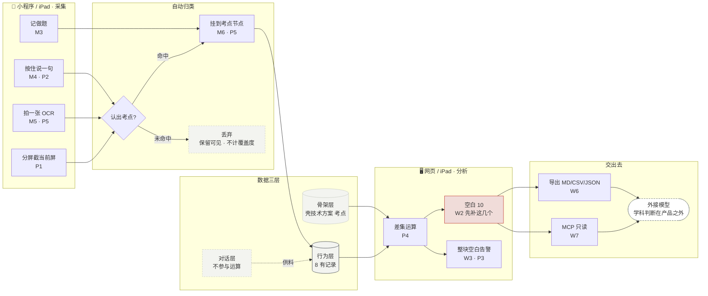

# 考点答题卡 · 完整设计稿

> 面向公考/考研备考人群的跨来源学习记录工具,三端共 20 屏。
> 设计语言承自 `kaodian-demo.html`,示例状态与 demo **逐格一致**。
>
> **这份稿子跑在 `docs/实施路径` 关卡 0 前面** —— 阶段 0 原文是「不做界面,不做账号,不做数据库设计」。
> 用途仅限:① 阶段 0 自用采集工具的界面参考(**只取 M4 / M5 / P2**);② 阶段 2 接触真实用户时的沟通物料。
> **它不构成开工许可。**

---

## 文件

| 文件 | 内容 | 规格 |
|---|---|---|
| `index.html` | 封面 · 三端分工 · 约束追溯表 · 刻意不做清单 · 设计语言 | 入口,从这里看 |
| `miniprogram.html` | 微信小程序采集端 M1–M8 | 375×812 |
| `pad.html` | iPad 核心场景端 P1–P5 | 1194×834 横屏 / 834×1112 竖屏 |
| `desktop.html` | 网页端分析端 W1–W7 | 1440 宽 |
| `tokens.css` | 设计令牌 + 答题卡涂格 + 设备外框 | 三份 HTML 共用 |

---

## 设计语言

承自 demo:**纸、墨、印章红、宋体标题、2px 直角**。

没有蓝色主色,没有 emoji 图标,没有阴影,没有大圆角,没有侧边栏后台骨架。
网页端排版取自报纸:报头、栏目条、通栏、分隔线。

### 签名视觉:答题卡涂格

考点不用标签或进度条表示,用**涂格** —— 每个备考的人都盯着这种卡看过几百个小时。

| 状态 | 涂法 | 权重 |
|---|---|---|
| 未触达 | 虚线空心 | 1.0 |
| 仅接触 | 半涂(石墨) | 0.6 |
| 久未复习 | 半涂(雾) | 0.4 |
| 练过但弱 | 实心印章红 | 0.8 |
| 练过且稳 | 实心石墨 | 0 |
| 已掌握(自述) | 实心石墨 · 半透明 | 0 |

圈里的数字是练过的题数。「先补这几个」的排序 = **频次 × 状态权重**。

### 色板

| 令牌 | 值 | 用途 |
|---|---|---|
| `--paper` | `#E9EBE5` | 底纸 |
| `--ink` | `#14171A` | 正文 / 实心 |
| `--graphite` | `#3A4046` | 次级 / 练过且稳 |
| `--seal` | `#C0332B` | **全稿唯一强调色** |
| `--mist` | `#8C948F` | 弱文字 / 久未复习 |
| `--line` | `#C9CDC4` | 描边 |
| `--wechat` | `#07C160` | 仅微信授权按钮 |

**一条反常规的决定:印章红同时用于「练过但弱」和「整块空白」。**
常规仪表盘里这两件事一个是警告一个是缺失,颜色该分开;但在这里它们是同一类信息 ——
**该回头看的地方**。盲区不是错误状态,是这个产品唯一的输出。

**没有绿色代表「好」。**

---

## 主链路

**核心公式:`盲区 = 骨架层 − 行为层`。** 对话层不参与运算,只负责留住用户与给行为层供料。

---

## 三端分工

**小程序只做采集入口,不做分析。** 因此 `docs/决策记录` §2.4「小程序在 iPad 复盘场景上体验是残的」
这一判断依然成立,**§7 决策记录无需修改**。

| 端 | 角色 | 屏 | 承担 | 不承担 |
|---|---|---|---|---|
| 微信小程序 | 采集端 | M1–M8 | 语音、拍照、记做题、确认、看流水 | 盲区诊断(只有入口,跳网页端) |
| iPad | 核心场景端 | P1–P5 | 分屏采集 + 复盘,两者都做 | — |
| 网页端 | 分析端 | W1–W7 | 骨架、差集、空白清单、导出、接口 | 采集(可用,非设计重心) |

---

## 屏幕清单

### 微信小程序 · 采集端(375×812)

| ID | 屏 | 落地的约束 |
|---|---|---|
| M1 | 登录 · 微信授权 + 手机号 | 图片留存承诺写在**勾选同意那一行**,不埋进隐私政策 |
| M2 | 手机号登录 · 验证码 | 手机号是跨端账号锚点;导航栏空出 87×32 给微信胶囊 |
| M3 | 首页 · 覆盖度 + 记一笔 | 来源是**一等字段**,摆在录入按钮之上 |
| M4 | 按住说一句 · 录制中 | 认出的考点直接用涂格显示当前状态;音频不留存 |
| M5 | 拍一张 · OCR 提取 | **原图 7 天删除倒计时** + 立即删除 + 写明理由 |
| M6 | 认出什么 · 宁缺毋滥 | 未匹配项**默认不勾选**;主按钮是「记下这 3 个」 |
| M7 | 记录 · 跨来源流水 | 被丢弃的记录**保留可见但置灰**,不计覆盖度 |
| M8 | 我的 · 边界与出口 | 「有没有、几次、多久前」原样放进界面 |

### iPad · 核心场景端

| ID | 屏 | 落地的约束 |
|---|---|---|
| P1 | Split View 分屏采集(横屏) | §2.4 点名的第一场景;底部**每次采集后立刻回一次空白反馈** |
| P2 | Slide Over 语音浮层(横屏) | 更轻的第二档 —— 摩擦是关卡 0 唯一的判据 |
| P3 | 答题卡 + 详情 · 触控双栏(横屏) | 44pt 下限;四统计字段常驻(触控无 hover) |
| P4 | 周日复盘 · 通栏(横屏) | 「最久没碰」只排时间,**不做遗忘曲线** |
| P5 | 纸质笔记拍照(竖屏) | 图片红线最完整的一次表达;把「倍数与比较」从 0/3 推到 3/3 |

### 网页端 · 分析端(1440 宽)

| ID | 屏 | 落地的约束 |
|---|---|---|
| W1 | 登录 · 扫码 + 手机号 | 左栏不放营销图,放一张真的答题卡 |
| W2 | 答题卡 · 落地页就是那张卡 | 北极星是主动查看盲区的人数 —— 第一屏就是整张卡 |
| W3 | 考点导图 · 整块空白 | 冷枝**连接线变印章红** + 一行警告(§2.5 树的全部收益) |
| W4 | 考点详情 · 四统计字段 | 正确率是用户自己填的数,**不是产品判出来的** |
| W5 | 来源分布 + 记录流水 | 流水表**没有「内容」列,连预留位都没有** |
| W6 | 问 AI 时带上的东西 + 导出 | 把「不做教研」变成功能,不是免责声明 |
| W7 | MCP / CLI 只读接入 | 令牌前缀 `kd_ro_`;**刻意的欠设计**,两成精力占两成篇幅 |

---

## 刻意不做

画了就违约:

- 得分 / 排名 / 判题 —— 触碰 §2.2 能力边界
- 知识点讲解 / 解题思路 —— §2.2 不做教研
- 课程内容 / 课件库 / 讲义 —— §2.2 不碰内容
- 原图云相册 / 笔记分享 / 社区 —— §2.3 红线,改不回来
- 艾宾浩斯复习提醒 —— 需判断掌握程度
- 连续打卡 / 学习时长 / 徽章 —— 会把注意力从缺口引开
- MCP 写入 / 代采集接口 —— §2.6 开放的是读不是写
- 第二个科目 / 第二套骨架 —— §5.4 对 2-3 人是灾难

---

## 示例数据

**与 `kaodian-demo.html` 的示例状态逐格一致。** 频次为占位数字,不代表真实统计。

骨架层取 `docs/实施路径` §1.1 推荐的起步模块:**公考 · 资料分析,18 个考点**。

| 题型 | 有记录 / 总数 |
|---|---|
| 增长类 | 4 / 7 |
| 比重与平均 | 2 / 4 |
| **倍数与比较** | **0 / 3 · 整块空白** |
| **效应类** | **0 / 2 · 整块空白** |
| 速算与读材料 | 2 / 2 |
| 合计 | **8 / 18 · 空白 10 · 44%** |

状态分布:练过且稳 3、练过但弱 2、久未复习 2、仅接触 1、未触达 10。

先补这几个(频次 × 状态权重):

| # | 考点 | 状态 | 分 |
|---|---|---|---|
| 01 | 增长量计算 | 练过但弱 8 道对 4 道 | 8 × 0.8 = 6.4 |
| 02 | 平均数计算 | 未触达 | 6 × 1.0 = 6.0 |
| 03 | 截位直除 | 练过但弱 6 道对 2 道 | 7 × 0.8 = 5.6 |
| 04 | 现期量计算 | 未触达 | 5 × 1.0 = 5.0 |
| 05 | 年均增长率 | 未触达 | 5 × 1.0 = 5.0 |

两组整块空白是刻意保留的:`docs/决策记录` §2.5 说树相对扁平列表的关键收益就是
「能表达整块题型都没碰过」,没有这种情形,树形结构在稿子里无法自证。

**合规:** 考点标签自行命名,不沿用任何机构的既有体系与措辞(`docs/实施路径` §1.2)。

---

## 仍然未被这份稿子关闭的问题

设计稿能表达约束,不能替代验证。以下来自 `docs/决策记录` §5,**保持未解决状态**:

1. **冷启动的第一千人** —— 换了四个方向都没解决过,画多少屏都换不来
2. **录入完整度决定诊断质量** —— demo 的引导问卷第三问「哪些你已经学过」是目前最好的缓解,但没有根除
3. **自驱力用户是最挑剔的一批** —— 不是在填空白,是在抢
4. **考点骨架冷启动是最重的一块** —— 18 个考点的统计字段在稿子里是示意值,真做要逐题打标
5. **生成式 AI 服务备案要求** —— `docs/实施路径` 阶段 0 阻塞项,**动手前必须查清**,本稿无法关闭

---

## 关卡 0 没有变

> 两周内平均每天 ≥3 条,且「懒得记」次数持续下降 → 通过
> 记录量逐周衰减,或「懒得记」占多数 → **停。采集摩擦没解决,整个产品的地基不成立**

这是全路径最重要也最便宜的一个关卡。**它只能靠自己用两周得到。**
