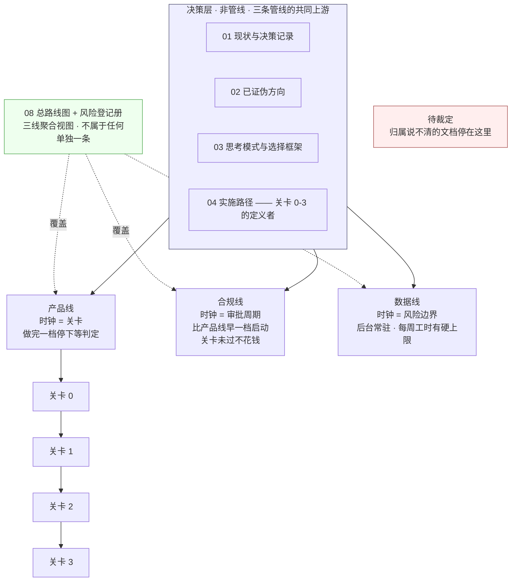

# 文档规范与目录

> 这份文档回答两个问题:**每一份文档属于哪条管线、服务哪个关卡**,以及 **同一件事该由谁定义、怎么看出哪份是最新的**。
>
> **它不产生任何新结论。** `01`–`04` 的判据、`08` 的风险登记册、各契约文档的字段,本文一个字都不改。
> 发现的冲突与空洞一律登记在 §2.4「待裁定」,**不自行裁定、不硬塞进某条管线**。
>
> **基线:`origin/v1` @ `afab5a7`,fetch 于 2026-08-31T05:20Z**(方案 B 分目录那一轮)。双向核对干净。
> `22`–`27` 登记那一轮基线为 `3253cb0`;导航层那一轮为 `14eedf4`;首版为 `04a0054`。
>
> **2026-08-31:`docs/` 已按方案 B 分目录**(裁定人 chenyj)。目录树在 [`INDEX.md`](INDEX.md) §零,
> 选目录的规则在 §3.2。**编号一个都没变** —— 目录是收纳,编号才是身份(§3.1)。
>
> **它对最近那个关卡的贡献是零。** 关卡 0 要的是「自用两周、每天记两个数」,整理目录一个数都不产生。
> 这句留在最前面,是因为本文正好属于 `03` §盲区二 点名的那类工作:进展可量化、做起来舒服、不需要面对任何一个真实用户。
>
> **状态:活跃。** 每新增、移动、冻结一份文档,§二 的表与 [`INDEX.md`](INDEX.md) 必须同一次改动内更新;不更新即视为该文档不存在(§六)。

---

## 零、本文的唯一职责

现在的乱**不是格式乱**。逐份读下来,格式其实相当统一:每份都有 `>` 头注、都有 as-of 日期、都有「与既有文档的关系」一节。

乱在三个地方:

| 症状 | 具体表现 | 现在 |
|---|---|---|
| **同一件事有多处说法** | 文档清单曾同时存在于 `CLAUDE.md`「The fifteen documents」两张表里和读者的记忆里,而主干实际有 16 份、分支上还有 3 份 | ✅ 两张表已撤,`CLAUDE.md` 只留指针 |
| **看不出哪份是最新的** | `CLAUDE.md` 曾写「`R-01`…`R-87`」,`08` 实际已到 `R-105`;写「Fifteen documents」,实际 16 份 | ✅ 数量与风险号一律不在 `CLAUDE.md` 里复述 |
| **看不出一份文档属于哪儿** | `14` 自称「不构成一条新的线」,`15` 被描述为「长在三条线之外」,`16` 的阶段归属自带 ⚪ 未决 —— 三份文档,三种无处安放 | §2.1 每份填一个归属,填不出的进 §2.4 |

**2026-08-30 第二轮补的是第四个症状:主次、先后、深浅、产品/技术看不出来。** 那不是属性问题,是**读法**问题 ——
22 份文档在 `docs/` 下平级并列、编号即写作顺序、没有任何入口,审计里 22 份全是孤儿。解法是 [`INDEX.md`](INDEX.md),不是往本文里再加列。

**分工写死,两边不重叠:**

| 文件 | 管什么 | 什么时候改 |
|---|---|---|
| `00`(本文) | 文档的**属性与规则**:管线 / 关卡 / 层 / 状态 / 过期判定 / 编号台账 / 唯一真源 / 🔴 红线 / 待裁定 / 待执行 | 新增、移动、冻结、改号、裁定 |
| [`INDEX.md`](INDEX.md) | 文档的**读法**:先读哪份、读到多深、产品还是技术、按关卡的先后 | 同上 —— **同一次改动里两边都要改** |

本文只解决这些。**它是清单与规则,不是内容。** 任何想在这里写下新判断的冲动,都说明写错了地方。

---

## 一、管线:目录按什么分

### 1.1 三条管线,时钟各不相同

管线划分**不是新发明的**,它就是 `05` §总原则 与 `07` §一 已经定死的三条轨。目录照它分,不照角色分 —— 角色会变,时钟不会。



**四个格子,只有三个是管线。**

| 格子 | 是管线吗 | 时钟 | 判定标准 |
|---|---|---|---|
| 产品线 | 是 | 关卡 | 这份文档不写,某个关卡就判不了 |
| 合规线 | 是 | 审批周期 | 这份文档的动作有外部审批等待期 |
| 数据线 | 是 | 风险边界 | 这份文档管的是「抓什么 / 不抓什么 / 怎么隔离」 |
| 决策层 | **否** | 无 | 三条管线共同的上游。改它会同时改三条线 |
| 待裁定 | **否** | 无 | 上面四条都套不上。**停在这里,不硬塞** |

### 1.2 归属规则:一份文档只有一个归属

一份文档在 §二 的表里**只能出现一次,只能填一个管线**。理由:归属决定的是「谁的时钟推动它更新」,两个时钟等于没有时钟。

跨线的内容用 **关联管线** 一列标注,关联不改变归属:

- `05` 归属产品线(块一受关卡管辖),块二上线准备关联合规线
- `09` 归属数据线(识别链路是数据侧选型),§五 合规结论关联合规线
- `11` 归属产品线(关卡 2 后的产品能力),§六 支付合规关联合规线

**判断归属时问的是:这份文档过期了,是哪条线先撞墙。**

### 1.3 「服务哪个关卡」可以取「无」,而且这是最重要的一列

`04` 定义了关卡 0/1/2/3,判据 pass/fail 由人判。目录里每份文档必须标出它服务哪个关卡。

**「无」是合法值,不是填表偷懒。** 已有三份文档自己写下了这句话:

- `14` §七 自带上限 `R-71`,承认它不面对任何真实用户
- `15`(分支版壳技术方案)§零:「它不服务于任何关卡」
- `19` 头注:「这份文档对最近那个关卡的贡献是零」

这一列存在的唯一目的,是让「无」能被数出来。数出来的结果见 §2.5。

---

## 二、目录

### 2.1 主干文档(`origin/v1`,2026-08-30 八条 `KUBI-*` 分支全部并入后)

**本表不写文件路径。** 一份文档在哪个子目录,看 [`INDEX.md`](INDEX.md) §零 那棵树;
本表只写属性。理由见 §3.1 最后一条:**路径会随目录调整失效,编号不会** —— 两处各管一件事,不重叠。

| 编号 | 文档 | 管线 | 关联管线 | 服务关卡 | 层 | 状态 | 过期判定依据 |
|---|---|---|---|---|---|---|---|
| — | [`INDEX.md`](INDEX.md) 文档索引 | — 元文档 | — | 无 | 元 | 活跃 | 新增/移动任一文档;某文档的关卡归属变化 |
| `00` | 文档规范与目录 | — 元文档 | — | 无 | 元 | 活跃 | 新增/移动/冻结任一文档 |
| `01` | 项目现状与决策记录 | 决策层 | 三线全覆盖 | 全部 | 决策 | 活跃 | §7 决策日志某行的「何时改变」条件命中 |
| `02` | 已证伪方向与调研结论 | 决策层 | — | 无 | 决策 | 冻结 | 新调研推翻某个方向的死因 |
| `03` | 思考模式与选择框架 | 决策层 | — | 无 | 方法 | 冻结 | 新增一条盲区或判断规则 |
| `04` | 实施路径 | 决策层 | 三线全覆盖 | **定义 0-3** | 决策 | 冻结 | 关卡判据变更 —— **只能由人裁定** |
| `05` | 执行清单 | 产品线 | 合规线(块二) | 0-3 | 执行 | 活跃 | 2026-08 监管与平台规则调研过期;带 `⚠待确认` 项动手前复核 |
| `06` | 阶段 0 至关卡 2 详细排期 | 产品线 | — | 0-2 | 执行 | 活跃 | 排期偏移,或 §二 打标工时测算被实测推翻 |
| `07` | 数据线:骨架原料的获取与隔离 | 数据线 | — | 无 | 执行 | 活跃 | §七 待确认项闭合;§六 冲突声明的判据(第二个科目是否已人工校正命名)命中 |
| `08` | 总路线图 · 脑图与父子待办 | **三线聚合** | 三线全覆盖 | 0-2 | 执行 | 活跃 | 新增/关闭任一 `R-xx` |
| `09` | 识别链路选型 | 数据线 | 合规线(§五) | 无 | 契约 | as-of 2026-08 | 价格变动;`Exp` 实验模型下线;§六 本机实测(2026-08-25)环境变更 |
| `10` | 技术架构与接口契约 | 产品线 | — | 1-2 | 契约 | 活跃 · **有已被推翻章节** | §4.3/§4.4 已被 `19` 推翻(原文保留 + 就地指针) |
| `11` | 商业化与额度设计 | 产品线 | 合规线(§六) | **关卡 2 后** | 契约 | 冻结待触发 | 2026-08 支付合规调研过期(§6.5 自评「取证状态比 `09` 弱一档」) |
| `12` | 基础数据:抓取范围与渠道 | 数据线 | — | 无 | 契约 | as-of 2026-08-25 | robots 实测过期;黑名单/白名单渠道状态变更 |
| `13` | 后端系统设计与组件接入 | 产品线 | — | **阶段 1 起** | 契约 | 活跃 | §三 版本矩阵 as-of 2026-08-26,构件更新即过期;§八 字段自述「一律是草案」 |
| `14` | 自动化交付工作流 | 产品线 · 支撑设施 | — | **无** | 执行 | 活跃 | Multica 版本更新;§一 数据 as-of 2026-08-27 |
| `15` | Agent 框架与能力边界 | **待裁定 · 见 §2.4-③** | — | **无** | 契约 | 活跃 | §四 第三道防线补齐或仍缺 |
| `16` | 产品路线图与用户共创 | 产品线 · 对外 | — | **待裁定 · 见 §2.4-④** | 契约 | 活跃 | 自带 ⚪ `R-94` |
| `17` | Multica 操作备忘 | — 支撑设施(仅查阅) | — | **无** | 执行 | 活跃 | `multica` 版本更新;实测于 2026-08-30 / `v0.4.34`,ID 表或坑的复现方式变化 |
| `18` | 壳技术方案:Tauri 2 包现有 Web 工程 | 产品线 | — | **无** | 契约 | 活跃 | 反代九条任一被实现绕过;`R-108`…`R-112` 任一关闭 |
| `19` | 多端选型与端矩阵 | 产品线 | — | **无** | 契约 | **已冻结** | 某一端的触发条件命中(每条选型自带);§4.6 路由契约变更 |
| `20` | 产品模块地图与产品逻辑 | — 元文档(仅指针) | 三线全覆盖 | **无** | 元 | 活跃 | 模块增删;某模块的关卡归属变化 |
| `21` | 原图存储:判据层与存储层 | 产品线 | — | **无** | 契约 | 活跃 | `R-105`/`R-106`/`R-107` 任一关闭;缓存层实现改形 |
| `22` | [产品模块脑图](product/22-产品模块脑图.md) | — 元文档(仅指针) | 三线全覆盖 | **无** | 元 | 活跃 | 模块增删;某模块的关卡归属变化 —— 与 `20` §三 同一次改动内更新 |
| `23` | [模块 A · 骨架层](product/23-模块A-骨架层.md) | 产品线 | 数据线 | **关卡 1** | 契约 | 活跃 | 冷启动四步任一步形态变化;`R-12`/`R-13` 任一命中 |
| `24` | [模块 B · 采集层](product/24-模块B-采集层.md) | 产品线 | 合规线(原图) | **关卡 0** | 契约 | 活跃 | 入口增删;「记录动作永不失败」的任一失败落点变化 |
| `25` | [模块 C · 打标层](product/25-模块C-打标层.md) | 产品线 | 数据线 | **关卡 1** | 契约 | 活跃 | 管线段数增删;两种失败形态被合并或拆分 |
| `26` | [模块 D · 差集层](product/26-模块D-差集层.md) | 产品线 | — | **关卡 1** | 契约 | 活跃 | 三条计算规则任一变化;反向断言被定义 |
| `27` | [模块 E · 出口层](product/27-模块E-出口层.md) | 产品线 | 合规线(导出) | **关卡 1 起** | 契约 | 活跃 | 出口增删;`E-1` 契约缺口被补上 |
| `28` | [模块 F · 账号与端](product/28-模块F-账号与端.md) | 产品线 | 合规线(注销/删除时点) | **关卡 2** | 契约 | 活跃 | 登录通道增删;合并策略变化;任一端的关卡归属被裁定 |
| `29` | [模块 G · 商业化](product/29-模块G-商业化.md) | 产品线 | 合规线(支付) | **关卡 2 后** | 契约 | **冻结待触发** | 与 `11` 同档:`11` 的口径变化,或 `R-37`/`R-48` 任一关闭 |

> **`22`–`29` 是 2026-08-30 起在 `20` 之下开的一层,2026-08-31 补齐。** `20` 仍是唯一的模块 × 关卡对照表,
> `22` 是脑图(markmap,可折叠),`23`–`29` 写「模块自己怎么运转」(A–G 七组各一份)。
> **H 与 X 没有单独文件,而且不该有**:`16` 本身就是 H 这一组的产品文档;X 不是模块是负空间,
> 逐条落在每份模块文档的 §五。再各写一份就是第二处说法(§3.1)。逐组落点写在 `20` §九。

**层的取值**:决策(定方向与判据)/ 方法(定怎么想)/ 执行(定做什么、什么时候做)/ 契约(定长什么样)/ 元(定文档本身的规则)。

### 2.2 分支未并主干的文档

**已清空(2026-08-30):八条 `KUBI-*` 分支全部并入 `v1`,分支引已删。** 本节保留是因为它随时会再有内容 ——
新文档仍然按 §3.2 先落在 `KUBI-<n>-<简述>` 分支上。

| 位置 | 文档 | 管线 | 服务关卡 | 状态 | 阻塞 |
|---|---|---|---|---|---|
| — | — | — | — | 当前无 | — |

> 那一轮并入解掉的撞号记在这里,因为它们正是「分支各写各的」必然产生的东西,而且**三次都是同一个成因:
> 分支基线早于主干,写它的时候那个号还空着**。
>
> | 撞的东西 | 怎么解 |
> |---|---|
> | `15` 壳技术方案 vs 主干 Agent 框架 | 壳改 `18`(此前已由人执行) |
> | `17` 原图存储 vs 主干 Multica 操作备忘 | 原图存储改 `21` |
> | `R-72`…`R-76` 五条壳风险 vs 主干上早已另有所属的同号 | 壳的五条改 `R-108`…`R-112` |
>
> ⚠️ **其中 `R-74` 那一行在三方合并里没有产生冲突标记,是静默重号。** 只看 git 报的冲突会漏掉它 ——
> **这是 §3.1「`R-xx` 唯一收口在 `08` §四」那条规则的代价**:收口在一份文件里,分支就必然在同一段行尾
> 各自追加,而追加与追加之间 git 看不出矛盾。**下次并分支,先对一遍号,别等 git 报。**

### 2.3 编号台账

编号在**主干上分配**,一个号只属于一份文档,已弃用的号不回收。

| 号 | 归属 | 说明 |
|---|---|---|
| `00` | 文档规范与目录 | 本文。`00` 永久保留给元文档 |
| `01`–`14` | 见 §2.1 | 无冲突 |
| `15` | Agent 框架与能力边界 | ✅ 冲突已解:`KUBI-62` 的壳技术方案改号 `18`,主干 `15` 保号 |
| `16` | 产品路线图与用户共创(主干) | 无冲突 |
| `17` | Multica 操作备忘 | 主干先占号(`53096ec`);`KUBI-63` 的原图存储因此改号 `21` |
| `18` | 壳技术方案:Tauri 2 包现有 Web 工程 | ✅ 空洞已填:由 `KUBI-62` 的 `15` 改号而来,不是新写的文档 |
| `19` | 多端选型与端矩阵 | 已并入主干 · 自述已冻结 |
| `20` | 产品模块地图与产品逻辑 | 已并入主干 |
| `21` | 原图存储:判据层与存储层 | 由 `KUBI-63` 的 `17` 改号而来 |
| `22` | 产品模块脑图 | 2026-08-30 领号。markmap 格式,`20` §二 原来那张 Mermaid `mindmap` 移出来的 |
| `23`–`27` | 模块 A–E 展开文档 | 2026-08-30 一次领五个号,**按模块字母顺序对应号顺序**(A=23 … E=27),不打乱 |
| `28`–`29` | 模块 F–G 展开文档 | 2026-08-31 领号,**接着字母顺序**(F=28,G=29)。**H 与 X 不领号** —— H 用 `16`,X 不成文(`20` §九) |
| `30`+ | 未分配 | 下一份新文档取 `30` |

> **上一版在这里预言过一次,结果反了,值得留着:** 原文写「F/G/H/X 将来若要补文档,拿不到连号」。
> 实际上 `28`–`29` 正好接上,因为**中间没有别人领号**。预言错的方向不重要,那条规则仍然成立 ——
> **编号是分配顺序,不是分类顺序**,下一次就未必接得上。想按模块字母查文档,查 `20` §九,不要查号段。

### 2.4 待裁定

**以下各项我不裁定。** 每一项都需要人拍板或需要另一条议题的所有者执行,写在这里是为了它们不再靠记忆传递。

**① ② ⑤ 已于 2026-08-30 闭合、⑥ 的方案 B 已于 2026-08-31 裁定**,原文一律保留在下面并标注结果 —— 按 §4.3「标记,不删除」。**待裁定现存三项:③ ④,以及 ⑥ 里未批的方案 A。**

**① 主干是 `main` 还是 `v1`** ✅ **已裁定(2026-08-30,chenyj):主干一律用 `v1`。**

| 事实 | 值 |
|---|---|
| `origin/HEAD` 指向 | `main` |
| `origin/main` | `2231ca7`,单次提交,只有 `docs/01`–`04` |
| `origin/v1` | `04a0054`,全部代码 + 16 份文档 |
| `main` 落后 `v1` | 14 份文档、6,567 行,以及 `server/` `web/` `scripts/` 全部 |
| 所有 `KUBI-*` 分支的分叉点 | `v1`,无一例外 |

本文原按**事实上的主干 `v1`** 建立基线,并把「是把 `main` 快进到 `v1`,还是把 `origin/HEAD` 改指 `v1`」留给人裁定。

**裁定结果(2026-08-30,chenyj):主干一律用 `v1`。** 落到三处,不再有歧义:

| 场景 | 现在的唯一写法 |
|---|---|
| 开新分支 | 从 `origin/v1` 开 `KUBI-<议题号>-<简述>`,**不直接在 `v1` 上提交** |
| PR 目标分支 | `v1` |
| 基线声明 | `基线:origin/v1 @ <SHA7>,fetch 于 <时间>` |

**裁定选的是「`origin/HEAD` 改指 `v1`」这一支,不是「把 `main` 快进到 `v1`」** —— 裁定的原话是「主干都用 v1 分支」,
它指定的是**哪条分支是主干**,没有说要动 `main`。**`main` 保持原样,不快进、不删除**(§4.3 标记不删除同一条)。

**剩下一个执行动作,不是裁定:`origin/HEAD` 仍指向 `main`。** 在它改指 `v1` 之前,任何人 clone 下来默认仍落在
只有 `docs/01`–`04` 的那条分支上。这个动作需要仓库管理员在 GitHub 仓库设置里改默认分支(或用 `gh repo edit
--default-branch v1`),**不是文档能改的,也不是本议题能代劳的**。已在 §2.6 登记为待执行。

**② `docs/15` 编号冲突** —— ✅ **已解(2026-08-30)**:壳技术方案改号 `18` 并入 `v1`,主干 `15` 保号,`08` / `10` / `shell/` 里指向壳方案的引用全部跟改。⚠️ 同批发现并解掉的还有第二处撞号:`17`(原图存储 → `21`),以及风险号 `R-72`…`R-76`(壳的五条 → `R-108`…`R-112`)。成因与本条完全相同,见 §2.2 那张表。

**③ `15-Agent 框架与能力边界` 的管线归属** —— `CLAUDE.md` 自述它「长在三条线之外」;它服务的关卡是「无」;`08` `R-85` 已把 agent 登记为「文档化失败模式的最新实例」。**它是产品线的一部分,还是一条本不该开的第四条线,需要人裁定。** 在裁定前它停在待裁定,不塞进产品线。

**④ `16` 的阶段归属** —— 文档自己带着 ⚪ `R-94`「阶段归属:未决」。归属产品线是清楚的,**服务哪个关卡未决**,原样保留。

**⑤ `docs/18` 空洞** —— ✅ **已解(2026-08-30)**:两者都不是。`18` 是留给壳技术方案的号(`KUBI-71` §P0 先行分配),改号落位后空洞不再存在。

**⑥ 文档重组:方案 A 改名 / 方案 B 分目录** —— 2026-08-30 由项目经理提出,他**推荐 A、不推荐 B**,理由是
「跨文档引用 357 处按编号、18 处按路径,分目录不增加信息却让编号台账与目录路径两处维护同一件事」。

**✅ 方案 B 已裁定(2026-08-31,chenyj):分目录,已执行。** 目录树见 [`INDEX.md`](INDEX.md) §零,
选目录规则见 §3.2。**原反对意见按 §4.3 原样留在上面,并记下它命中的那一半:**

| 他担心的 | 实际发生的 |
|---|---|
| 「编号台账与目录路径两处维护同一件事」 | **确实存在,已用规则挡掉**:§2.1 不写路径、目录不写管线、正文引用一律写编号(§3.1 新增那条)。代价是这条规则得有人守 |
| 「收益只在 `ls` 的时候」 | 属实。目录本身不产生新信息,**它省的是 `ls` 与 IDE 文件树里的一眼** |
| —— | **他没预见的一条**:分目录**掐断了 `.githooks/pre-commit` 里按 `^docs/0[1-4]-` 写死的决策层闸门**,已同批改掉并写进 §3.2 末尾 |

**⚠️ 方案 A(去掉 5 份文件名里的空格与全角冒号)未批,未执行**,登记在 §2.6 `E7`。
`audit_docs.py` 报的 7 条死链/孤儿因此仍在 —— 那是脚本对 `%20`/空格的判定,**不是链接真的坏**
(本轮实测 161 条 Markdown 链接零死链)。

### 2.6 待执行(已裁定,只差动手)

| # | 动作 | 谁做 | 依据 |
|---|---|---|---|
| E1 | 把 `origin/HEAD` / GitHub 默认分支从 `main` 改为 `v1` | **仓库管理员(我做不了:要改 GitHub 仓库设置,不是 git 操作)** | §2.4-① 裁定 |
| E2 | 已开在别的分支上的活,确认它接的是 `v1` 再动手,**不擅自改基** | 各分支所有者 | §2.4-① 裁定 |
| E3 | ✅ **已做(2026-08-30)**:八条 `KUBI-*` 分支全部并入 `v1`,分支引已删 | — | 本次合流 |
| E4 | 壳补 `[lib]` 目标 + 把 `local_server` 按 hyper 供移动端复用,才能编出 iOS / Android | 壳的所有者 | `19` §规划 P2;当前 `shell/` **只有桌面** |
| E5 | ✅ **已做(2026-08-30)**:`main` 快进到 `v1`,两条分支现在指同一个提交 | — | 见下方「关于 `main`」 |
| E6 | **文档侧红线扫描**:代码侧已有 `NoStemFieldTest`,文档侧没有对应的机器断言,§五 现在靠 §六 第 6 条人工执行 | 待派工程项 | §五 §执行状态 |
| E7 | **方案 A · 文件名规范化未批**:`07` `12` `17` `18` `21` 五份文件名里仍有空格或全角冒号,`doc-management` 的 `audit_docs.py` 因此仍报 7 条死链/孤儿(**是脚本对 `%20`/空格的判定,不是链接真的坏**)。分目录已把这些文件搬了一次,**再搬一次改名的成本与这次相同** | 等人裁定 | 2026-08-30 项目经理方案 A |

**关于 `main`(2026-08-30)**

`main` 曾经是 `v1` 的**严格祖先** —— `origin/v1..origin/main` 为空,合并基就是 `main` 自己。
所以「把 `main` 合并进 `v1`」在 git 上是一次 `Already up to date`,**一个字节都不会进来**;
`main` 上唯一 `v1` 没有的文件是 `.DS_Store`,那正是不该进来的东西。方向只能反过来:把 `main` 快进到 `v1`。

已快进(E5)。**但这只是一次性的:再往 `v1` 推一次,`main` 又落后了。**
真正一劳永逸的是 E1 —— 改 GitHub 默认分支。在那之前:

- ⚠️ **不要往 `main` 提交任何东西。** 它现在是 `v1` 的镜像,不是第二条主干。
  `v1` 是唯一主干(§2.4-①),分支照旧从 `origin/v1` 开。
- **`main` 落后了不算事故**,不需要有人定期去同步它;它存在的唯一理由是
  `origin/HEAD` 还指着它,E1 做完之后它就没有存在理由了。

### 2.5 目录建成后第一眼看到的东西

按 §1.3 数「服务关卡 = 无」的文档:

**口径只有一条,不再分档**:数 `01`–`29` 全部 29 份,不做「元文档豁免」;本文与 `INDEX.md`
不在这个号段内,单独说明(两份也都是「无」)。行数用
`find docs -name '*.md' -not -path '*/research/*' | xargs wc -l`。

⚠️ **这一版把口径收成了一条。** 上一版拆成「12 份 / 另 `17` / 共 13 份」,而 `INDEX.md` §五 按
另一种分组数出 11 份 —— **同一个概念两处三个数**,正是 §3.1 要治的病。现在:**份数与行数唯一收口在本节**,
`INDEX` §五 只列名单、不给数。

| 口径 | 数值 |
|---|---|
| 文档总数(`01`–`29`) | **29 份 / 10,993 行** |
| 服务关卡为「无」 | **13 份**:`02` `03` `07` `09` `12` `14` `15` `17` `18` `19` `20` `21` `22` |
| 这 13 份的行数合计 | **4,470 行 —— 占 `01`–`29` 行数的 40.7%** |
| 另计两份元文档 | `00`(本文)与 `INDEX.md`,服务关卡同为「无」,不进上表 |
| `04` 定义的关卡 0 的全部输入 | `P0-6` / `1.1.4` —— **两个每日数字,当前仍为空** |

> 本文自身也是「无」,已在头注写明,不计入上表。
>
> **2026-08-30 更新:** `20`(`KUBI-72` 第二步)并入上表。它自评服务关卡为「无」,并在自己的头注里写明了这一点 —— **这一列继续照常工作,包括对新增的文档。**
>
> **2026-08-30 二次更新(`22`–`27` 并入):** 比例从 42.7% 降到 40.1%,**但这不是一次改善,别这么读。**
> 分母变大了 —— 新进来的 `23`–`27` 五份(818 行)确实全部服务关卡 0/1,`22` 仍是「无」。
> **真正该看的是最后一行:`1.1.4` 那两个数今天仍然为空。** 写了 979 行模块文档,那两个数一格没动;
> 这一批的作者(产品经理)已在每一份的头注里写明「本文对关卡 0 的贡献是零」。
> **一个能靠新增文档变好看的比例,本身就要小心** —— 它和 `R-49` 防的是同一种形状:
> 归档能让覆盖率从 44% 变 100%,新增服务关卡的文档能让这个百分比降下去,两者都不需要真的推进任何东西。
>
> **2026-08-31 三次更新(方案 B 分目录):** 42.3%。**这个数几乎没动,而这一次是对的** ——
> 分目录只搬文件不增删内容,分子分母都没变;`42.2% → 42.3%` 那 0.1 个点来自口径统一(见本节开头)
> 与几行修订,不是任何一格推进了。**分目录对关卡 0 的贡献同样是零。**
>
> ⚠️ **2026-08-31 四次更新(`28` `29` 补齐):`42.3% → 40.7%`。这一次又是分母变大,别读成改善。**
> 新进来的两份(472 行)确实都服务关卡 2 / 关卡 2 后,所以分子不动、分母变大,比例就降。
> **这是本节两个月里第二次出现同一种形状** —— `40.1% → 42.3% → 40.7%` 三个数之间,
> **没有一次是因为某一份「不服务关卡」的文档变得服务某个关卡了。**
> 该看的仍然是最后一行:`1.1.4` 那两个数今天还是空的。

**这一格是本次梳理唯一称得上是发现的东西**,而且它不是新问题:`03` §盲区二 与 `08` §六 已经把它写成了本项目的失败模式。目录只是第一次让它可数。

**这不是「文档写多了」的意思。** 每份文档都各自论证了自己为什么该存在,其中几份还自带上限声明。目录的作用是让「四成文档不产生任何关卡数据」这件事**不再需要靠回忆才能想起来**。

---

## 三、唯一真源

### 3.1 一件事只在一份文档里定义

| 规则 | 具体 |
|---|---|
| **定义只有一处** | 一个结论、一个判据、一张表、一个字段,只在它归属的那份文档里定义 |
| **其他文档只能引用** | 写 `` 见 `10` §5.2 ``,**不复述内容**。复述就是第二处说法,而且一定会先过期 |
| **表格与数字不得跨文档复制** | 需要同一张表的两个地方,一个定义、一个指针 |
| **`R-xx` 唯一收口在 `08` §四** | 新风险一律进 `08`,不建临时清单。`11` §九、`12` §八、`13` §九、`16` §七 的「新增风险登记」都是**待并入 `08` 的暂存区**,并入后应改为指针 |
| **文档清单唯一收口在本文 §二** | `CLAUDE.md` 与任何其他地方不得再列第二份清单,只能指向这里 |
| **跨文档引用写编号,不写路径** | 正文里写 `` 见 `13` §6.9 ``,**不写 `docs/technical/13-…`**。2026-08-30 数过:全仓跨文档引用 **357 处按纯编号、只有 18 处按路径**;2026-08-31 分目录时,正是那 18 处(加上 `INDEX` / `CLAUDE.md` 里的链接)必须逐条改,纯编号那 357 处一处没动。**编号是身份,路径是收纳位置** —— 只有 Markdown 链接才写路径 |

### 3.2 位置规则:一份文档在哪儿,是有规矩的

| 状态 | 位置 | 目录里怎么标 |
|---|---|---|
| 已冻结 / 已被引用 | `origin/v1` 的 `docs/<子目录>/`(主干 = `v1`,§2.4-① 已裁定) | §2.1 |
| 在研,归属某个议题 | `KUBI-<n>-<简述>` 分支的 `docs/<子目录>/` | §2.2,必须写明分支名 + SHA7 |
| 已推翻但仍被引用 | **留在原处**,就地加指针,不删 | §2.1 状态列标「有已被推翻章节」 |
| 作废 | 编号在 §2.3 标「作废」,文件不删 | §2.3 |

**选哪个子目录(2026-08-31 方案 B):判据是「谁来读」,不是「属于哪条管线」。**

| 子目录 | 收什么 | 判据 |
|---|---|---|
| `docs/`(根) | 只有两份:`INDEX.md` 与本文 | 它描述这棵树,不属于树上任何一枝 |
| `decisions/` | 定方向与判据、以及被证伪的方向 | 改它会同时改三条管线 |
| `execution/` | 做什么、什么时候做、风险登记册 | 读者在排期或判关卡 |
| `product/` | 产品模块、脑图、模块展开、商业化、对外 | 读者在讨论「做什么、给谁」 |
| `technical/` | 架构契约、后端详设、端与壳、Agent 边界 | 读者在写代码或定契约 |
| `data/` | 抓什么 / 不抓什么 / 怎么隔离 / 识别链路 | 读者在碰数据线 |
| `ops/` | 交付流水线与操作备忘 | 读者在跑流程,不在做产品 |

**目录第一级只能承载一个维度,这里放的是「读者」。**「管线归属」在 §2.1 的表里,两处不重叠 ——
§2.1 不写路径,目录不写管线。填不出目录时,**放进最接近的那一个并在 §2.4 登记**,不要新开第七个目录。

⚠️ **搬目录会静默掐断按路径写死的守卫。** 这次分目录时 `.githooks/pre-commit` 里那条
`^docs/0[1-4]-` 决策层闸门,若不跟着改成 `^docs/decisions/0[1-4]-`,**会一声不响地放行所有决策层改动**
—— 与 `14` §9.4 记的 `core.quotepath` 那次是同一种失效形状(看起来一直在正常放行)。
**以后再动目录,先 `grep -rn 'docs/' .githooks scripts` 一遍。**

**分支上的文档超过一个关卡周期未并入主干,视为过期**(§4.2 第三条)—— 因为主干读者读不到它,而它可能已经推翻了主干的结论。`19` 现在就是这个状态。

### 3.3 冲突规则:下游记录更正,上游就地加指针

这条规则**已经在跑,本文只是把它写死**:

- **不静默改写上游。** `05` 头注:「04 的关卡判据在这里一个字都不改」;`13` 头注:「`09` 的选型结论与 `10` 的技术栈表在这里一个字都不改」
- **被推翻的数字留在原地加注**,不删。`04` §成本 保留了被推翻的 ¥2,000 原估 + 指针
- **冲突必须显式登记**,写在下游文档的 §零「与既有文档的关系」里,逐条点名。`13` §0.2/§0.3、`14` §0.2/§0.3、`19` §零 都是这个形状
- **谁推翻谁写。** 推翻方负责在被推翻方就地加指针,不留给下一个人发现

---

## 四、过期判定

「看不出哪份是最新的」是本次要解决的第二个症状。判定必须机械,不靠读者感觉。

### 4.1 每份文档的头注必须能回答三个问题

现有文档大多已经做到,本节只是把它变成必须项:

| 必须有 | 形式 | 已有范例 |
|---|---|---|
| **这份文档是什么、不是什么** | `>` 头注第一段 | `10`:「它是选型记录,不是开工许可」 |
| **as-of 日期或基线** | `>` 头注中一行,格式 `基线:origin/<分支> @ <SHA7>,fetch 于 <时间>` 或 `调研数据截至 <日期>` | `17` §零、`19` 头注、`05` 头注 |
| **状态** | `活跃` / `冻结` / `冻结待触发` / `as-of <日期>` / `待裁定` | `19`:「状态:已冻结,无开放项」 |

### 4.2 三条过期触发条件

| # | 触发 | 判定动作 |
|---|---|---|
| 1 | **带 as-of 的调研数据超过 90 天**,或文档自带的 `⚠待确认` 项动手前未复核 | 标 `⚠ 过期待复核` + 日期 |
| 2 | **上游被引章节变了** —— 引用方的 `见 X §Y` 指向的章节内容改动 | 引用方标过期;由改动上游的那次改动负责扫描并标注 |
| 3 | **文档自带的「何时改变」条件命中**,或分支文档超过一个关卡周期未并主干 | 标过期;分支未并的另标阻塞 |

### 4.3 过期后的动作:标记,不删除

```
> ⚠ 过期待复核(2026-XX-XX):§X 的价格数据 as-of 2026-08,已超 90 天。
> 复核前不得据此下单或写进代码。最新结论见 `NN` §Y。
```

**不删原文、不改数字。** 理由与 §3.3 同一条 —— 被推翻的记录本身是资产,`02` 整份文档就是靠这个成立的。

---

## 五、🔴 红线:文档不得出现能承载题干的模板字段

**这条写死在规范里,不是提醒。** 它是 `07` §二 / `R-01` 的文档侧延伸:线上库里不存在能装下题干的字段,连预留位都不留 —— **文档里同样不留**,因为文档是代码的上游,模板里留了位,早晚有人照着建出来。

**禁止出现在任何文档中的东西:**

| 禁止 | 包括但不限于 |
|---|---|
| 能承载题干/选项/答案/解析的**字段名** | 出现在 ER 图、建表语句、接口签名、DTO 示例中的任何此类列 |
| 上述字段的**示例值** | 哪怕写的是 `"示例"` `"xxx"` `"TODO"` |
| 上述字段的**占位与预留** | 「预留」「暂不启用」「后续扩展」一律不算例外 |
| **附录里的样例题面** | 真题片段、机构讲义片段、任何长度的题目正文 |
| 机构课程内容 | 只允许记来源名称与时间(`01` §2、CLAUDE.md 硬约束「不碰内容」) |

**允许且必须保留的**:上面这张表本身,以及各文档中以否定形式写下的合规说明(「不建 prompt 列」「不建答案列」)。`14` §9.10 已经记过这个教训 —— **黑名单不能命中本仓库自己的合规注释**,那些注释按定义包含被禁的词。

**执行状态**:代码侧已有 `NoStemFieldTest` 机器断言。**文档侧目前没有对应扫描,这是一个缺口**,登记为待派工程项 **§2.6 `E6`**,不在本议题内实现。在扫描落地前,这条靠 §六 第 6 条人工执行。

> 这句原来写的是「§六 第 5 条」。§六 后来插进过新条目,整体下移,那个序号**指到了「登记冲突」上** ——
> 一条正确的引用被上游重排悄悄改错。这正是 §4.2 触发条件 2 说的那种过期(上游被引章节变了),
> 也说明**按序号引用章节比按标题引用脆**:能写「§2.6 `E6`」就不要写「§六 第 N 条」。

---

## 六、新增 / 移动 / 冻结一份文档时要做的事

0. **先选子目录**(§3.2 那张表):判据是「谁来读」。选不出就放进最接近的一个并在 §2.4 登记,**不新开目录**
1. **在 §2.1 或 §2.2 加一行**,填满全部列。填不出「管线」或「服务关卡」→ 放进 §2.4 待裁定,**不要猜一个填上**
2. **同一次改动里把 [`INDEX.md`](INDEX.md) 也改了** —— §零 目录树、§一 路线表、§二 分层(**含各档的份数与行数,重算,别只加文件**)、§四 产品/技术、§五 关卡序,该进哪几格就进哪几格。**漏一边就是「同一件事有多处说法」的下一个实例**
3. **在 §2.3 领一个号**,取当前最大号 +1,不复用作废号
4. **写头注三件套**(§4.1):是什么/不是什么、基线或 as-of、状态
5. **登记冲突**(§3.3):新文档若推翻了既有结论,在自己的 §零 逐条点名,并去被推翻方就地加指针
6. **自查 §五 红线**:通读一遍,确认没有任何字段/示例/占位/附录能承载题干
7. **分支纪律**:分支名 `KUBI-<议题号>-<简述>`;头注写「基线:`origin/v1` @ `<SHA7>`,fetch 于 `<时间>`」;一组改动过闸即推远端
8. **新风险进 `08` §四**,领一个 `R-xx`,不建临时清单
9. **搬目录或改文件名时,另外 `grep -rn 'docs/' .githooks scripts shell web design`** —— 按路径写死的守卫与说明不会自己跟着改,而它们失效时是静默的(§3.2 末尾)

**§二 的表与文档的实际状态不一致时,以文档实际状态为准,并立刻改表。** 目录是索引,不是事实来源 —— 这一条是为了目录本身不变成第 N 处说法。

---

## 七、这份规范最容易被用错的方式

| 用错的方式 | 为什么是错的 |
|---|---|
| **把它当进度** | 目录建完不等于任何一格推进了。自检仍只看 `08` §六那一条:`1.1.4` 那张表有没有在填 |
| **拿 §2.5 那个「四成」去砍文档** | 那一格是让事实可数,不是删除许可。每份文档各自论证过为什么存在,砍掉是另一个决定,需要人裁定 |
| **把 §2.4 待裁定当 TODO 自行清掉** | 那五项每一项都需要人拍板或需要另一条议题的所有者执行。自行裁定 = 用一处新说法覆盖一处老说法,正是本文要治的病 |
| **为了让目录整齐而给文档硬找管线归属** | 「说不清就停在待裁定」是规则,不是妥协。硬塞进去之后,那份文档就再也不会被重新审视 |
| **在这里写新结论** | 本文只有清单与规则。任何新判断都属于它归属的那份文档,写在这里就是第二处说法 |
