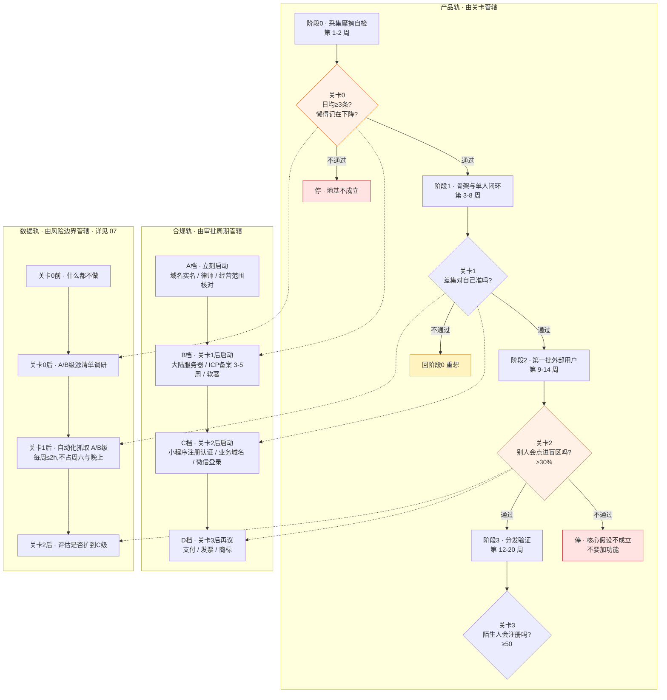
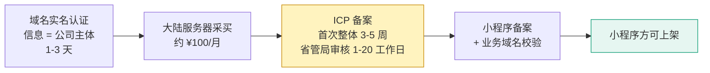

# 执行清单

> 这份文档是 `04-实施路径.md` 的**执行层**,不是它的替代品。
>
> 04 定的是「什么时候该问什么问题」,05 定的是「为了能问出这个问题,手上要做完哪些事」。
> **04 的关卡判据在这里一个字都不改。**
>
> 分两块:**产品开发**受关卡管辖,做完一档等判据;**上线准备**受行政周期管辖,有些必须提前并行启动,否则会在关卡通过后干等审核。
>
> 调研数据截至 2026 年 8 月,监管与平台规则会变。带 `⚠待确认` 的项动手前必须复核。

---

## 总原则:三条轨道,不同的时钟

产品轨的节拍器是**关卡**,合规轨的节拍器是**审批周期**,数据轨的节拍器是**风险边界**(详见 `07-数据线`)。**把它们串成一条线是错的**——串起来会出现两种典型浪费:关卡还没过就先注册公司备案上小程序(白花钱、白暴露身份),或者关卡过了才开始备案(干等 15-45 个工作日)。

**一句话读法:合规轨永远比产品轨早一档启动,但永远不越过关卡去做花钱的事;数据轨永远在后台跑,永远不许挤占产品轨的时段。**

> **数据轨的硬约束(07 §五):每周 ≤2 小时,只能来自周日复盘时段的溢出,不得挤占周六(写代码)或工作日晚上(打标)。**
> 03 §盲区二 点名的失败模式是「注意力流向能动手做的部分」——**抓数据是这个模式的完美载体:有进展感、可量化、完全不需要面对真实用户。**

---

# 块一 · 产品开发

## P0 · 阶段 0:采集摩擦自检(第 1-2 周)

**04 的原文是「不做界面,不做账号,不做数据库设计」。这一档的产出物是两个数字,不是一个产品。**

| ID | 事项 | 判据 |
|---|---|---|
| `P0-1` | 语音 → 文字 → 落地:一段录音进去,一行文字出来 | 能跑通即可,存本地文件夹 |
| `P0-2` | 拍照 → OCR → 落地:一张图进去,一段文字出来 | 同上 |
| `P0-3` | 选定外接模型与单价,记录每次调用的 token 与费用 | 为后面的成本控制留基线。选型见 `09`,**但阶段 0 仍用本地,不上云** |
| `P0-4` | **原图处理逻辑第一天就写死**:OCR 完成后本地缓存,设过期删除 | 01 §2.3 红线,后面改不回来。**→ 2026-08-29 改判:到期转归档保留,不删;原文未改,契约见 `16`** |
| `P0-5` | 自己用两周,一边学任何东西一边记 | 学什么不重要 |
| `P0-6` | **每天记两个数**:今天记了几条 / 今天有几次「本来该记但懒得记」 | 这两个数就是关卡 0 的全部输入 |

- [ ] `P0-1` 语音链路跑通
- [ ] `P0-2` 拍照 OCR 链路跑通
- [ ] `P0-3` 模型选型 + 成本基线
- [ ] `P0-4` 原图过期删除逻辑写死(**改判后为:到期转归档写死**,见 `16`)
- [ ] `P0-5` 连续自用 14 天
- [ ] `P0-6` 每日两个数字的记录表

> **关卡 0 · 全路径最重要也最便宜的一关**
> 通过:两周内平均每天 ≥3 条,且「懒得记」次数持续下降
> 不通过:**停。** 不要优化采集方式再试一遍——第二次你会不自觉地努力配合。

---

## P1 · 阶段 1:骨架与单人闭环(第 3-8 周)

**目标只有一个:差集能被算出来,并且对你自己是准的。**

### P1.1 骨架冷启动(全路径最重的体力活)

模块选定:**公考 · 资料分析**(04 §1.1 推荐:题型收敛、考点少、标注准确率最高)。**只做一个。**

- [ ] `P1-1` 收集近五年公开真题
- [ ] `P1-2` 模型初步聚类题干 → **人工校正分类命名**
- [ ] `P1-3` 逐题打考点标签
- [ ] `P1-4` 汇总四个统计字段:出现次数 / 出现省份 / 最近年份 / 每卷题量
- [ ] `P1-5` **留存推导过程记录**——考点标签自行命名,不沿用任何机构既有体系与措辞(04 §1.2 合规要求)

> 如果做到一半发现工作量失控,**那本身就是信息**:说明规模化到多模块不可行,需要重新想,而不是加班做完。

### P1.2 打通闭环

- [ ] `P1-6` 采集 → 自动打标 → 挂考点树 → 算差集 → 出 Top 5 缺口
- [ ] `P1-7` 打标匹配不上就丢弃,不硬归类(01 §2.2 宁缺毋滥)
- [ ] `P1-8` **模型只做闭集分类,不生成标签** —— 输入 = 内容 + 自己的考点树候选,输出 = 节点 ID 或「不匹配」(选型依据见 `09` §四)

> **`P1-8` 同时挡住两条线。** 放开让模型自由生成考点标签,一是会编造不存在的考点、污染覆盖度(01 §2.2),二是模型训练数据里全是机构的标准表述,大概率原样吐出「机构既有体系与措辞」(04 §1.2)。**闭集分类一次解决两个。**
- [ ] `P1-8` 数据导出:Markdown / CSV / JSON
- [ ] `P1-9` 继续自己用,数据变多后看诊断是否符合自我认知

### P1.3 界面(只做必需的)

设计稿已完成三个方向候选,**待选定后再实现**。这一档只实现自己用得上的部分:

- [ ] `P1-10` 移动端采集页(语音 / 拍照 / 标签确认)
- [ ] `P1-11` 桌面端考点树 + 盲区清单
- [ ] `P1-12` 其余屏一律不做

> **关卡 1**
> 通过:差集结果符合自我认知,误判可接受
> 不通过:打标准确率或采集完整度不够 → 回阶段 0 重想

---

## P2 · 阶段 2:第一批外部用户(第 9-14 周)

**这是整个项目第一次接触真实用户。前面所有事都只是为了让这一步有东西可测。**

### P2.1 让别人能用

- [ ] `P2-1` 账号体系:手机号 + 验证码(**此时不做微信登录**,见 L-C 档)
- [ ] `P2-2` 移动端做成 Web(PWA),**不做小程序**——小程序需要大陆主体,会把行政流程拖进关键路径
- [ ] `P2-3` 跨设备同步与可靠存储
- [ ] `P2-4` 隐私说明页 + 用户协议(律师过一遍)

### P2.2 找 10 个人

- [ ] `P2-5` 正在备考的人,不是机构、不是老师;完全免费
- [ ] `P2-6` **不要找朋友里「会给面子」的那种**

### P2.3 只看三个数

| 指标 | 通过线 | 证明什么 |
|---|---|---|
| 注册后 7 日内产生 ≥5 条行为事件的比例 | >40% | 录入摩擦对别人是否可接受 |
| **看到缺口清单后点进去的比例** | **>30%** | **盲区诊断是否真的被在意** |
| 第 14 天回访率 | >25% | 是否形成粘性 |

- [ ] `P2-7` 埋点:只埋这三个指标 + 北极星(主动查看盲区的人数)
- [ ] `P2-8` 单独一张表记录每个用户提的**第一个问题**
- [ ] `P2-9` 记录谁在哪里卡住
- [ ] `P2-10` 留意有没有人主动问「这能不能导出」「这数据准吗」

> **关卡 2**
> 三个都过 → 进阶段 3
> **只有第二个不过 → 核心价值主张不成立,回头重想,不要加功能**
> 前两个过、回访不过 → 留存问题,可继续但要重新设计回访触发

---

## P3 · 阶段 3:分发验证(第 12-20 周,与阶段 2 重叠)

**这是从第一轮到现在唯一没被解决过的问题(01 §5.1),必须单独作为一个阶段验证。**

- [ ] `P3-1` 写「我怎么从五年真题里建了一套考点树」
- [ ] `P3-2` 写「为什么我的错题本要开放 MCP」
- [ ] `P3-3` 写「我用两周记录自己的学习,发现了什么」
- [ ] `P3-4` 发布渠道:知乎 + 小红书优先,抖音次之
- [ ] `P3-5` MCP / CLI 只读接口 + 技术社区投放
- [ ] `P3-6` **不做**:真人出镜、日更、人设、蹭热点

**只看一个数:通过内容渠道来的、你完全不认识的注册用户数。** 不是阅读量,不是点赞,不是收藏。

> **关卡 3**
> 累计 ≥50 个陌生注册且有持续性 → 通过
> 阅读量还行但注册寥寥 → 内容与产品断链,重新设计转化路径
> 连阅读量都起不来 → **最坏情况,重新评估整个方向**

---

## P4+ · 阶段 4/5:不细化

**关卡 3 之后再规划。** 到那时你会知道用户从哪来、为什么留、卡在哪儿,这些都会改变定价与付费点设计。

现在只需记住要回答的问题:
- 阶段 4:在有免费替代品(OneNote、Obsidian、AI 直接问)的前提下,有没有人肯为骨架和采集掏钱?
- 阶段 5:收入是否稳定、获客是否不依赖你的时间、现金储备是否足够。

---

# 块二 · 上线准备

## L0 · 主体已就位 · 只需核对四件事

**主体已有,公司已搞定 —— 注册、身份暴露、亲属代持这些决策全部作废,不再讨论。**

但主体存在 ≠ 主体可用。下面四项每一项都会在后面卡住你,**现在花十分钟核对,比在小程序类目审核被驳回时再回头省得多**:

| 核对项 | 不核对会怎样 |
|---|---|
| 经营范围是否含「软件开发」「信息技术服务」 | 小程序类目审核要求**类目与主体经营范围一致**。不含则需先办经营范围增项,又是一轮等待 |
| 经营范围是否含「教育培训」类表述 | 若含,类目审核可能被引向教育类 —— 调研显示教育行业约 **60% 需办学许可或备案**。本产品 01 §2.2 明确不做教研,**别沾这个类目** |
| 主体类型:有限公司 / 个体工商户 | 决定小程序认证费(企业 ¥300/年 vs 个体工商户 ¥30/次)与是否必须对公账户 |
| 是否已有对公账户 | 微信支付需要(D 档);个体工商户可绑法人个人卡绕过 |

- [ ] `L0-1` 拉一份最新营业执照,核对经营范围
- [ ] `L0-2` 若缺「软件开发 / 信息技术服务」→ 办经营范围增项(线上约 3-5 个工作日)
- [ ] `L0-3` 确认主体类型与对公账户状态
- [ ] `L0-4` 确认现劳动合同中保密与职务成果条款的边界(竞业协议已确认为**无**)

---

## L-A 档 · 立刻启动(长周期,不受关卡影响)

**这一档现在就做,因为它们要么零成本、要么等待时间本身就是风险。**

### 域名

- [ ] `L-A1` 注册 `.com` 主域名(建议同时拿 `.cn` 防抢注)
- [ ] `L-A2` **用公司主体信息做域名实名认证** —— 域名实名、ICP 备案主体、小程序主体**三者必须一致**。现在用错信息,备案时整条重来
- [ ] `L-A3` 注册商选**国内**(阿里云/腾讯云)—— 主体已有,不再需要境外规避,而备案要求域名在有资质的国内注册商处

> 域名注册即时生效,实名认证 1-3 天。**先占住名字,几十块的事。**

### 法律与合规(最长周期项)

- [ ] `L-A4` **⚠待确认 · 生成式 AI:确认走「登记」而非「备案」**
  - 调研结论:备案针对**自研或微调模型**;登记针对**直接调用已备案模型 API、不做再训练或微调**的服务方
  - 本产品全部外接模型、不训不调 → 应落在**登记**
  - 触发前提是「具有舆论属性或社会动员能力」——本产品无社交、不发布内容、不分享、MCP 只读,**大概率不触发**
  - **但这条必须由律师书面确认一次,不能靠推理关闭**(01 §5.5 待查项)
- [ ] `L-A5` 律师咨询一次(预算 ¥3,000),一次性问完:
  - 生成式 AI 登记/备案的适用性
  - 用户协议 + 隐私政策(重点:图片本地缓存与过期删除的表述)
  - 「考点标签自行命名」的著作权边界与推导过程留证要求
  - **从受保护的汇编作品(试卷)中提取统计事实并商用,边界在哪**(07 §七)
  - **推导留证格式**(只存题目标识、不存题干)是否足以自证
  - 在职期间做副业的职务成果风险
- [ ] `L-A6` 起草隐私政策与用户协议初稿(阶段 2 上线前定稿)

### 基础设施(阶段 0-2 用)

- [ ] `L-A7` 境外服务器(Vercel / Fly.io / 轻量云,¥60-100/月),**不备案**
- [ ] `L-A8` 对象存储:仅存 OCR 文本与标签,**原图不进云**(01 §2.3 红线)
- [ ] `L-A8b` 🔴 **禁用模型厂商的图片暂存接口**(如 DeepSeek Files API)—— 它把图存在平台侧供 `file_id` 复用,与 01 §2.3 正面冲突。**必须走 base64 内联,图片过一次即弃**(`09` §四坑二)

> `L-A8b` 容易踩,因为这类接口通常免费,看起来像白送的优化。
- [ ] `L-A9` 代码仓库、账号、支付方式与公司体系**零交集**(01 §3 设备隔离)

---

## L-B 档 · 关卡 1 通过后启动

**这一档的内容变了。** 主体已有,注册环节不存在;**现在这一档唯一的内容是启动备案链路** —— 因为它有 3-5 周的纯等待,而小程序 100% 依赖它。

### 备案链路是串行的,不能并行

**每一环都以前一环完成为前提。整条链路从零开始约 4-6 周。**

- [ ] `L-B1` 采买大陆服务器(阿里云 / 腾讯云 —— 备案必须通过接入商提交)
- [ ] `L-B2` 提交 ICP 备案 —— **首次备案整体 3-5 周**,省管局审核 1-20 个工作日
- [ ] `L-B3` 备案短信核验需 **24 小时内完成**,逾期自动驳回、整个申请作废
- [ ] `L-B4` **避开 3-4 月与 9-10 月的备案高峰**
- [ ] `L-B5` 申请软件著作权(自办 30-60 天,加急 15 天需付费)—— 部分小程序类目审核需要

### 为什么是关卡 1 之后,不是现在

关卡 1 = 差集对你自己是准的。**在此之前产品可能整个作废**,备案是给一个还没被证明的东西办手续。
而关卡 1 到关卡 2 结束(第 8-14 周)有 6 周,正好覆盖备案的 3-5 周 —— **备案在这段窗口里跑完,就永远不会出现在关键路径上。**

> **注意:阶段 0-2 完全不需要备案。** 阶段 0 无界面、阶段 1 自用、阶段 2 的 10 个人用 Web(`P2-2`)。
> 备案是为**阶段 3 的小程序**提前铺的路,不是为当下。

---

## L-C 档 · 关卡 2 通过后启动

**关卡 2 = 陌生人真的会点进盲区。到这一步才值得把采集端铺到微信生态里。**

前提:`L-B` 的备案链路此时应已跑完或接近完成。

- [ ] `L-C1` 注册小程序(需大陆主体 —— **已有,1-2 天即可**)
- [ ] `L-C2` 认证:按 `L0-3` 的主体类型 —— 企业 ¥300/年 / 个体工商户 ¥30/次(截至 2026-04 优惠价)
- [ ] `L-C3` 类目选**工具 / 效率**,**不选教育**(理由见 `L0` 核对表)
- [ ] `L-C4` 在微信公众平台提交**业务域名校验**,域名主体必须与小程序主体一致
- [ ] `L-C5` 配置服务器域名 + HTTPS(小程序强制要求)
- [ ] `L-C6` 小程序定位遵守 01 §2.4 结论:**只做采集入口,不做盲区分析** —— 分析跳转网页端
- [ ] `L-C7` 微信授权登录 + 与手机号账号打通(**两端必须同账号**,否则差集会把手机上记过的算成盲区)
- [ ] `L-C8` **界面上做生成式 AI 公示位** —— 已上线应用须在显著位置或产品详情页公示所用生成式 AI 服务,**注明模型名称、备案号或上线编号**。这是界面需求不是文档条款,三端设计稿都要有(`09` §五)
- [ ] `L-C9` 完成**地方网信办登记**(调用已备案模型、不微调 → 登记而非备案)。阶段 0-2 不触发,正式上线触发

> **是否把 Web 也迁回大陆?** 只有当阶段 3 出现真实的「境外访问太慢」反馈时才做。
> 备案已完成的情况下迁移成本很低,但没必要为了整齐而迁 —— 没有用户抱怨就不是问题。

---

## L-D 档 · 关卡 3 通过后再议

**不细化。** 关卡 3 之后才知道用户从哪来、愿不愿付钱,这些都会改变下面每一项的做法。

- 微信支付 / 支付宝开通(需对公账户 + 类目匹配)
- 发票与税务(个体工商户核定征收 vs 查账征收)
- 商标注册(第 9 类 / 第 42 类,9-12 个月)
- 等保测评(仅当用户量与数据敏感度触线时)

---

# 三、成本(到关卡 3)

**主体已有 → 注册相关成本归零。** 新增的是大陆服务器(备案必需)。

| 项目 | 金额 | 何时花 |
|---|---|---|
| 域名(.com + .cn,首年) | ~¥150 | 立刻 |
| 律师咨询(协议 + AI 登记 + 职务成果) | ~¥3,000 | 立刻 |
| 境外服务器(阶段 0-2,5 个月) | ~¥400 | 立刻 |
| 语音识别 / OCR / LLM 调用 | **~¥100**(原估 ¥2,000) | 阶段 0 起 |
| ~~主体注册~~ | ~~¥0-500~~ **已有,归零** | — |
| 大陆服务器(备案用,4 个月) | ~¥400 | 关卡 1 后 |
| 软件著作权(加急) | ¥0-800 | 关卡 1 后 |
| 小程序认证 | ¥30-300 | 关卡 2 后 |
| **合计** | **约 ¥4,080-4,950** | |

比上一版**再降约 ¥1,900**:省掉注册费、增加大陆服务器,以及**识别成本被高估了一个数量级以上**——`09` §三 实测,关卡 3 之前识别调用是两位数,1,000 用户时也只有约 ¥510/月。

> 单价便宜不等于成本可以不管。真正会失控的是**重复调用与无上限的 prompt**,由 `08` §1.2.5.3 管住,`P0-3` 的基线记录照旧。

---

# 四、风险与待确认

| 项 | 状态 | 处理 |
|---|---|---|
| 生成式 AI 登记 vs 备案 | ⚠待律师确认(已缩小) | `L-A4` `L-A5`。`09` §五 把它从「可能卡死方向」缩到「大概率走登记」,**但未关闭** |
| 视觉模型是实验版本,无稳定性承诺 | ⚠已识别 | `09` §四坑三:识别调用走接口层抽象,留切换点 |
| ~~在职期间工商登记的身份暴露~~ | **已作废** —— 主体已有 | — |
| 经营范围可能不含「软件开发」 | ⚠待核对 | `L0-1` `L0-2`,不含则需增项 |
| 经营范围若含「教育培训」 | ⚠待核对 | `L0-1`,可能被引向需办学许可的类目 |
| 冷启动的第一千人 | **仍未解决**(01 §5.1) | 只有阶段 3 能回答,清单不能替代 |
| 录入完整度决定诊断质量 | **仍未解决**(01 §5.2) | 语音+拍照缓解但未根除 |
| 骨架冷启动工作量可能失控 | 已识别(01 §5.4) | `P1` 中途失控即为信息,不加班硬做 |
| ~~Token 成本吃掉订阅费~~ | **降级为低风险** | `09` §三:1,000 用户时约 ¥510/月。仍按 `P0-3` 记基线,失控点是重复调用不是单价 |
| 小程序平台规则变动 | 会变 | `L-C` 档执行前复核一次 |
| gknote.cn(名为「公考笔记」) | 未确认内容 | 关卡 2 前查一次 |
| **真题原文若进入线上库** | **红线** | 07 §二:线上库不存在能装下题干的字段 |
| **抓取代码若具备登录/绕过能力** | **红线** | 07 §三 `D-4`:不是不用,是不写 |
| 军队文职涉军信息合规 | ⚠️ 未评估 | 07 §四:单独评估,不要顺手带上 |
| 数据轨挤占产品轨工时 | 高发 | 07 §五:每周 ≤2h,自检「数据线进展 > 产品轨」即跑偏 |

---

# 五、这份清单最容易被用错的方式

03 §盲区二 记录的失败模式是:**注意力单向流向能动手做的部分,而不是最不确定的部分。**

这份清单本身就是那种诱惑——块二有 30 多个可勾选的行政项,每一项都清晰、可完成、有即时成就感,**而且全都不需要面对任何一个真实用户**。

**判断自己有没有跑偏,只看一件事:块一的 `P0-6`(每天两个数字)有没有在记。**

如果块二勾掉了十项、数据轨抓了三万条,而 `P0-6` 是空的,那就是老毛病犯了。

**块二和数据轨都能给出可量化的进展,而且都不需要面对任何一个真实用户 —— 这正是它们危险的地方。**

**产品不是变量,需求才是。**
