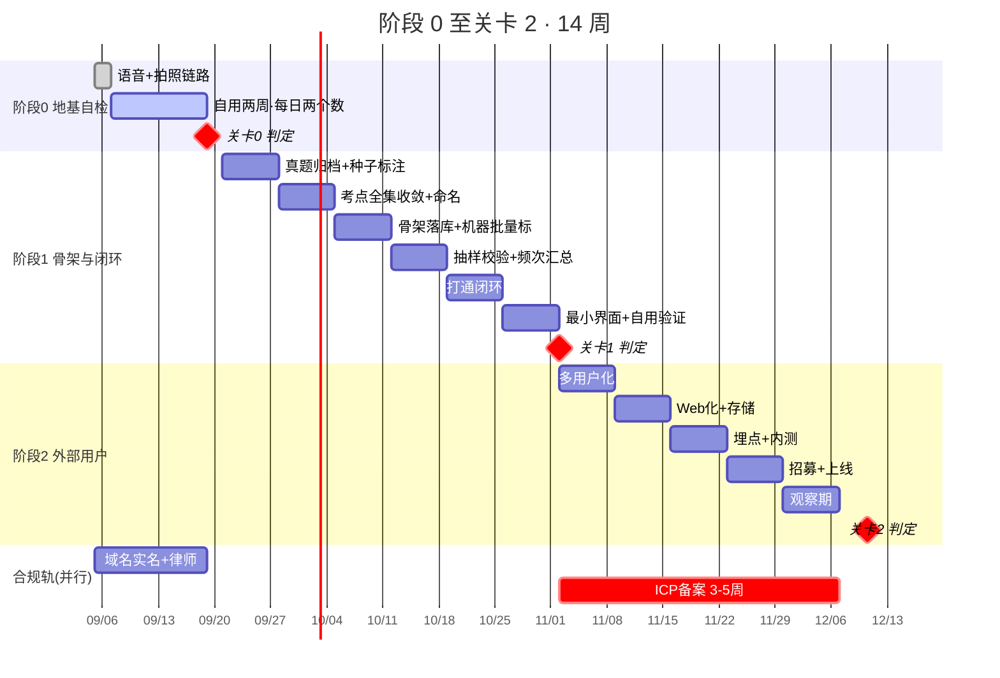

# 阶段 0 至关卡 2 · 详细排期

> `05-执行清单.md` 回答「要做哪些事」,这份文档回答「**哪一周、用哪一段时间、做到什么程度算完**」。
>
> **只细化到关卡 2。** 阶段 3 之后不排期 —— 04 的原话是「上一次在验证之前写了 12 个月的详细路线,整个方向随后被证伪,全部作废」。关卡 2 会改变它之后的一切。
>
> 全文按 04 的前提:**在职,每周 11-15 小时。**

---

## 一、工时总账

04 §时间与成本 定的每周节奏,是这份排期唯一的资源约束:

| 时段 | 时长 | 任务类型 | 14 周合计 |
|---|---|---|---|
| 工作日晚上 × 3 | 各 1-1.5h(计 3.75h/周) | **碎片化**:打标、录数据、回消息 | 52.5h |
| 周六 | 5-6h(计 5.5h/周) | **需连续注意力**:写代码、建骨架 | 77h |
| 周日 | 2-3h(计 2.5h/周) | 复盘、指标更新 | 35h |
| **合计** | **11.75h/周** | | **164.5h** |

**排期纪律(04 原文):真题打标可以碎片化,写代码不行。把打标全部塞进工作日晚上。**

这条纪律在下面每一周的排期里都被严格执行 —— **周六格子里永远没有打标,晚上格子里永远没有写代码。**

| 阶段 | 周次 | 碎片(晚) | 连续(六) | 复盘(日) | 小计 |
|---|---|---|---|---|---|
| 阶段 0 | 1-2 | 7.5h | 11h | 5h | 23.5h |
| 阶段 1 | 3-8 | 22.5h | 33h | 15h | 70.5h |
| 阶段 2 | 9-14 | 22.5h | 33h | 15h | 70.5h |
| **合计** | **14 周** | **52.5h** | **77h** | **35h** | **164.5h** |

---

## 二、关键测算:打标工作量(决定阶段 1 是否成立)

**这是全路径最重的一块体力活(01 §5.4),必须先算清楚再动手。**

### 真题体量

| 来源 | 套数 |
|---|---|
| 国考(副省级 + 地市级)× 5 年 | 10 |
| 省考联考(去重后)× 5 年 | 20 |
| 单独命题省(苏/浙/鲁/粤等)× 5 年 | 35 |
| **合计** | **65 套 × 20 题 = 1,300 题** |

### 三个方案的工时对比

碎片时间预算 = 3.75h/周 × 6 周 = **22.5h**

| 方案 | 做法 | 工时 | 判断 |
|---|---|---|---|
| A | 人工从零逐题标(60s/题) | **21.7h** | ❌ **余量 0.8h,等于没有余量。任何延误即失控** |
| B | 模型预标 + 人工全量校验(30s/题) | 10.8h | ✅ 余量 11.7h |
| **C** | **种子收敛 + 分层抽样校验** | **6.7h** | ✅ **余量 15.8h,采用** |

### 方案 C 的做法

**关键洞察:考点全集会先于题量收敛。** 资料分析题型收敛(这正是 04 §1.1 选它的理由),不需要标完 1,300 题才知道有哪些考点。

| 步骤 | 内容 | 量 | 工时 |
|---|---|---|---|
| C1 | **种子标注** —— 人工逐题标,直到**连续 50 题不出现新考点** | 预计 300 题 | 5.0h |
| C2 | 冻结考点全集 v1,写进骨架表 | — | 计入周六 |
| C3 | **机器批量标** 剩余题目 | 1,000 题 | 机器时间 |
| C4 | **分层抽样校验** —— 每 100 题抽 10 题人工核 | 100 题 | 1.7h |
| C5 | 抽检准确率 <85% → 修 prompt 重跑 C3 | — | 计入余量 |
| | **人工合计** | | **6.7h** |

**收敛判据要写进脚本,不能靠感觉。** 每标 10 题输出一次「累计考点数」,曲线走平即停。

> **如果种子标到 500 题仍在出新考点** —— 说明资料分析的考点收敛性不如预期,**这本身就是信息**(04 §1.2 原话)。
> 此时不要加班标完,而是回头问:是不是分类粒度定得太细了?(01 §2.5 已定**不做第四层**)

---

## 三、阶段 0 · 逐日排期(第 1-2 周)

**这个阶段不做产品。产出物是两个数字。**
04 原文:**不做界面,不做账号,不做数据库设计。**

### 第 1 周

| 日 | 时段 | 任务 | 完成判据 |
|---|---|---|---|
| **周六** | 5.5h | `P0-1` 语音链路:录音 → 文字 → 落地文件 | 说一句话,本地出现一个 `.md`,内容是这句话 |
| | | `P0-3a` 记录首次调用耗时与费用 | 有一行基线数字 |
| **周日** | 2.5h | `P0-2` 拍照链路:图 → OCR → 文字 → 落地 | 拍一页笔记,本地出现文字 |
| | | `P0-4` **原图到期处置写死** | 存图时即写入过期时间戳,到期自动**归档**(2026-08-29 由「删除」改)。**这条第一天不定后面改不回来(01 §2.3)** |
| | | 建 `P0-6` 记录表(两列:记了几条 / 懒得记几次) | 表存在 |
| **周一–周五** | 各 1.25h | **开始自用。** 一边学任何东西一边记 | 每天睡前填两个数 |

**周一到周五的 1.25h 不是"开发时间",是"生活时间"。** 阶段 0 的重点是用,不是建。这段时间用来:记录、当天出问题就地改、填两个数。

### 第 2 周

| 日 | 时段 | 任务 | 完成判据 |
|---|---|---|---|
| **周六** | 5.5h | **只修阻碍"记"的摩擦点,不加任何功能** | 改动清单里每一条都能回答"它降低了哪一次懒得记" |
| **周日** | 2.5h | 第一周复盘:画两个数字的 14 天趋势 | 有一张折线 |
| **周一–周五** | 各 1.25h | 继续用 | 每天两个数 |
| **第 14 天** | — | **关卡 0 判定** | 见下 |

### `P0-6` 记录表的格式(照抄即可)

```
日期        记了几条    懒得记几次    懒得记的场景(可空)
2026-09-01     4           2         听课中途,不想中断
2026-09-02     3           1         走路时
```

**只要这四列。不要加"心情""效率分""标签"。** 多一列就多一个不填的理由。

### 技术选型(阶段 0 只求跑通,不求最终)

| 环节 | 阶段 0 选择 | 理由 | 阶段 1/2 起(选型依据见 `09`) |
|---|---|---|---|
| 语音识别 | **本地开源模型**(Apple Silicon 可跑) | 零调用成本、零网络依赖,专注测摩擦 | 换**专用 ASR**(腾讯云一句话识别),免费额度 5,000 次/月覆盖到关卡 3 |
| 图像识别 | **系统原生 OCR**(macOS/iOS 中文识别可用) | 同上 | 换**多模态大模型一步到位**(图 → 文字+考点),比「云 OCR + LLM 打标」便宜 29-95 倍且少一环 |
| 存储 | **本地文件夹 + 纯文本** | 04 原文「存到哪儿无所谓」 | 阶段 1 再上库 |
| 打标 | **阶段 0 不做打标** | 骨架还不存在,没有可挂的树 | 阶段 1,**闭集分类不是自由生成**(`P1-8`) |

> **阶段 0 的本地选择没有因为 `09` 的调研而改变,理由反而更强了:** 多模态的全部优势在打标那一步,而这张表里写着阶段 0 不做打标 —— **阶段 0 用不上。**
>
> **本机现状(2026-08-25 实测):** M2 Max 跑得动 mlx-whisper,但 mlx-whisper 与 pyobjc Vision **都未安装**——上面的「本地模型」目前是计划不是现成能力。`/usr/bin/shortcuts` 存在,macOS 26.6.1 下调系统 Vision OCR 零依赖,`P0-2` 拍照链路走这条最省事。

> **设备隔离(01 §3):** 代码、账号、API key、数据与公司体系零交集。用开源工具本身没问题,但账号和密钥必须是独立的一套。

### 关卡 0

| 判据 | 结果 |
|---|---|
| 两周内平均每天 ≥3 条,且「懒得记」次数持续下降 | 通过 → 阶段 1 |
| 记录量逐周衰减,或「懒得记」占多数 | **停。采集摩擦没解决,整个产品的地基不成立** |

**不通过时不要优化采集方式再试一遍。** 试一次就够了 —— 第二次你会因为想让它成功而不自觉地努力配合。

---

## 四、阶段 1 · 逐周排期(第 3-8 周)

**目标只有一个:差集能被算出来,并且对你自己是准的。**

### 第 3 周 · 真题归档 + 种子标注启动

| 时段 | 任务 | 完成判据 |
|---|---|---|
| 周六 5.5h | `P1-1` 收集近五年公开真题,统一归档格式 | 65 套卷可程序读取 |
| | 写种子标注的最小工具(能翻题、打标、记累计考点数) | 能连续标 20 题不卡 |
| 晚 ×3 = 3.75h | `C1` 种子标注 ~120 题 | 累计考点数曲线有了前 12 个点 |
| 周日 2.5h | 看曲线斜率,估收敛点 | 有一个"预计还需 N 题"的估计 |

### 第 4 周 · 考点全集收敛 + 命名

| 时段 | 任务 | 完成判据 |
|---|---|---|
| 周六 5.5h | `P1-2` 模型初步聚类题干 → **人工校正分类命名** | 模块→题型→考点 三层结构成形,**不做第四层** |
| | `P1-5` **留存推导过程记录** | 每个考点名有来源题号,可回溯 |
| 晚 ×3 = 3.75h | `C1` 种子标注续 ~90 题,至**连续 50 题无新考点** | 收敛判据达成 |
| 周日 2.5h | 冻结考点全集 v1 | 一张确定的考点表 |

> **合规红线(04 §1.2):考点标签自行命名,不沿用任何机构的既有体系与措辞。** 命名时对照检查一遍。

### 第 5 周 · 骨架落库 + 机器批量标

| 时段 | 任务 | 完成判据 |
|---|---|---|
| 周六 5.5h | 数据结构落库(见 §六) | 骨架层可查询 |
| | 写批量打标脚本 | 能跑 100 题 |
| 晚 ×3 = 3.75h | `C3` 机器批量标 1,000 题(机器跑,人只看进度) | 全量有标 |
| 周日 2.5h | 抽 20 题肉眼扫一遍,看有没有系统性错误 | 无明显偏差再进下一步 |

### 第 6 周 · 抽样校验 + 频次汇总

| 时段 | 任务 | 完成判据 |
|---|---|---|
| 周六 5.5h | `P1-4` 四个统计字段汇总管线 | 每个考点挂上:出现次数 / 出现省份 / 最近年份 / 每卷题量 |
| 晚 ×3 = 3.75h | `C4` 分层抽样校验 100 题 | 有准确率数字 |
| 周日 2.5h | 准确率 <85% → 修 prompt,安排重跑 | 准确率达标或有明确修复计划 |

### 第 7 周 · 打通闭环

| 时段 | 任务 | 完成判据 |
|---|---|---|
| 周六 5.5h | `P1-6` 采集 → 自动打标 → 挂树 → 算差集 → 出 Top 5 | 用一条真实语音记录,能看到 Top 5 变化 |
| | `P1-7` **匹配不上就丢弃**(01 §2.2 宁缺毋滥) | 丢弃项可见但不计入覆盖度 |
| 晚 ×3 = 3.75h | 把阶段 0 的两周历史记录导入,回填行为层 | 有真实的行为层数据 |
| 周日 2.5h | 看差集结果,记下第一批"这个判错了"的例子 | 有一张误判清单 |

### 第 8 周 · 最小界面 + 自用验证

| 时段 | 任务 | 完成判据 |
|---|---|---|
| 周六 5.5h | `P1-10` 移动采集页 + `P1-11` 桌面考点树/盲区清单 | **只这两屏,其余一律不做(`P1-12`)** |
| | `P1-8` 导出 Markdown / CSV / JSON | 能导出 |
| 晚 ×3 = 3.75h | `P1-9` 继续自用,累积误判样本 | 误判清单够长到能判断 |
| 周日 2.5h | **关卡 1 判定** | 见下 |

> **界面依赖设计方向选定。** 三个候选方向(极客暗色 / 便当格 / 实体答题卡)须在**第 7 周结束前**定,否则第 8 周会卡住。

### 关卡 1

| 判据 | 结果 |
|---|---|
| 差集结果符合你的自我认知,误判可接受 | 通过 → 阶段 2 |
| 频繁把你学过的判成「未触达」 | 打标准确率或采集完整度不够,**回阶段 0 重想** |

---

## 五、阶段 2 · 逐周排期(第 9-14 周)

**项目第一次接触真实用户。前面所有事都只是为了让这一步有东西可测。**

### 第 9 周 · 多用户化

| 时段 | 任务 |
|---|---|
| 周六 5.5h | `P2-1` 手机号 + 验证码账号体系(**此时不做微信登录**) |
| 晚 ×3 | `L-B1` 大陆服务器采买 → **`L-B2` 提交 ICP 备案(首次 3-5 周,现在启动才不会卡关卡 3)** |
| 周日 2.5h | `L-B3` 盯备案短信核验(**24h 内必须完成,逾期整个作废**) |

### 第 10 周 · Web 化 + 存储

| 时段 | 任务 |
|---|---|
| 周六 5.5h | `P2-2` 移动端做成 Web/PWA(**不做小程序** —— 小程序依赖备案,会把行政流程拖进关键路径) |
| | `P2-3` 跨设备同步与可靠存储 |
| 晚 ×3 | `P2-4` 隐私说明 + 用户协议(用 `L-A5` 律师稿) |
| 周日 2.5h | 自测:换一台设备能不能看到同一份数据 |

### 第 11 周 · 埋点 + 内测

| 时段 | 任务 |
|---|---|
| 周六 5.5h | `P2-7` 埋点 —— **只埋三个指标 + 北极星(主动查看盲区的人数)** |
| 晚 ×3 | 自己当外部用户走一遍完整注册→记录→看盲区 |
| 周日 2.5h | 修阻断性 bug,**不加功能** |

### 第 12 周 · 招募 + 上线

| 时段 | 任务 |
|---|---|
| 周六 5.5h | 上线,发出邀请 |
| 晚 ×3 | `P2-5` 找 10 个正在备考的人;`P2-6` **不要找会给面子的朋友** |
| 周日 2.5h | 建 `P2-8` 第一个问题记录表 |

### 第 13 周 · 观察期

| 时段 | 任务 |
|---|---|
| 周六 5.5h | 只修阻断性问题 |
| 晚 ×3 | `P2-8` 逐个记录每人提的**第一个问题**;`P2-9` 记录卡点 |
| 周日 2.5h | `P2-10` 留意有没有人主动问「能导出吗」「数据准吗」 |

### 第 14 周 · 关卡 2 判定

**14 天回访率要等第一批用户注册满 14 天,判定点可能顺延到第 15-16 周。这是数据要求,不是拖延。**

| 指标 | 通过线 | 证明什么 |
|---|---|---|
| 注册后 7 日内产生 ≥5 条行为事件的比例 | >40% | 录入摩擦对别人是否可接受 |
| **看到缺口清单后点进去的比例** | **>30%** | **盲区诊断是否真的被在意** |
| 第 14 天回访率 | >25% | 是否形成粘性 |

| 结果 | 动作 |
|---|---|
| 三个都过 | 进阶段 3 |
| **只有第二个不过** | **核心价值主张不成立,回头重想,不要加功能** |
| 前两个过、回访不过 | 留存问题,可继续,但要重新设计回访触发 |

---

## 六、数据结构(第 5 周落库用)

```
考点 skill_point
  id            考点唯一标识
  模块 / 题型 / 名称        三层,不做第四层(01 §2.5)
  stat_出现次数              近五年
  stat_出现省份[]
  stat_最近年份
  stat_每卷题量
  推导来源题号[]             合规留证(04 §1.2)

记录 record
  id / 时间戳
  来源名称                   粉笔 / B站 / 纸质笔记 …… 只存名称
  采集方式                   voice | photo | text
  抽取文本                   ASR/OCR 的产物
  原图本地路径 + 过期戳 + 归档戳   到期自动【归档】,不进云(01 §2.3;2026-08-29 由「删」改)
  挂载考点[]                 含置信度
  丢弃标记                   宁缺毋滥的产物,可见但不计覆盖度

覆盖 coverage(派生,不手工维护)
  考点id / 触达次数 / 最近触达时间 / 来源集合[]
```

**表里没有「内容」字段 —— 这不是省略,是 01 §2.2「不碰内容」的结构化表达。**
连预留位都不要留,留了早晚会有人往里写。

---

## 七、甘特总览



**注意合规轨那一条:ICP 备案从关卡 1 通过后启动,35 天,正好在关卡 2 判定前后跑完。**
它全程不在关键路径上 —— 这是排期的目的,不是巧合。

---

## 八、为什么排到这里为止

阶段 3 的分发验证不排期,不是漏了。

04 的原话:**「上一次在验证之前写了 12 个月的详细路线(GEO 方向),包含成本预算、周节奏、词表和话术 —— 整个方向随后被证伪,全部作废。」**

关卡 2 只有两种结果,它们通向完全不同的第 15 周:
- **通过** → 你知道了盲区诊断真的被在意,阶段 3 才有意义
- **不通过(第二个指标)** → 核心价值主张不成立,**这份排期后面的所有内容立即作废**

**给一个还没被验证的假设排 20 周的期,是在给自己制造"我又想清楚了一层"的满足感(03 开篇原话)。**

---

## 九、这份排期最容易失效的三个地方

| 风险 | 早期信号 | 处理 |
|---|---|---|
| **种子标注不收敛** | 标到 500 题仍在出新考点 | 分类粒度太细,回头看是不是变相做了第四层 |
| **周六被碎片任务侵占** | 某周六在打标 | 违反 04 排期纪律。打标必须回到晚上,周六只写代码 |
| **关卡数据在临界线上** | 「31% 差一点,再调调产品」 | **04 点名的最容易犯的错。产品不是变量,需求才是。同一个关卡调三次还不过,就是不过** |

**单周投入连续 4 周超 20 小时 → 强制减速。主业出问题会毁掉整个计划(04 止损线)。**
