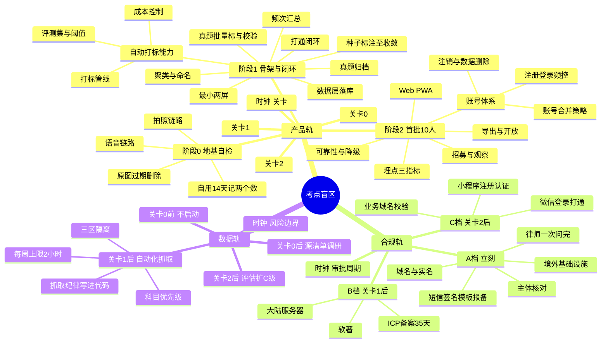

# 总路线图 · 脑图与父子待办

> 三条线的**可执行待办树**。父节点 = 阶段/主题,子节点 = 可勾选的具体动作。
>
> **父节点不单独勾选 —— 所有子节点完成,父节点才算完成。**
>
> `05` 清单 · `06` 排期 · `07` 数据线,均为本树的展开说明。风险统一收在 §四,树上只挂引用标记。
>
> **只展开到关卡 2。** 关卡 2 会改变它之后的一切。

---

## 一、脑图总览

---

## 二、待办树

### 标记约定

| 标记 | 含义 |
|---|---|
| `🚦` | **关卡节点。阻塞。** 不通过则其后所有节点作废 |
| `⛔` | 被阻塞,前置未完成不可开始 |
| `⏱周六` | 需连续注意力(写代码/建骨架) |
| `⏱晚` | 碎片化(打标/录数据) |
| `⏱周日` | 复盘/指标 |
| `📅W3` | 第 3 周 |
| `🔴R-04` | 挂接风险登记册条目,见 §四 |

**排期纪律(04 原文):周六格子里永远没有打标,晚上格子里永远没有写代码。**

---

## 1 产品轨 `时钟 = 关卡`

- [ ] **1.1 阶段 0 · 地基自检** `📅W1-2` `23.5h`
  - [ ] **1.1.1 语音链路** `P0-1` `⏱周六` `📅W1` `🤖AI`
    - [ ] 1.1.1.1 选定 ASR 方案(阶段 0 用本地;阶段 2 起换**专用 ASR**,免费额度覆盖到关卡 3 —— `09` §一)
    - [ ] 1.1.1.2 录音 → 文字 跑通
    - [ ] 1.1.1.3 落地为纯文本文件(存哪儿无所谓)
    - [ ] 1.1.1.4 **单条时长上限**(建议 60s)—— 超时自动切,避免长音频拖慢反馈
    - [ ] 1.1.1.5 **ASR 失败的兜底**:提示重录,**不留存音频**(与原图红线同构)
    - [ ] 1.1.1.6 记录调用耗时与费用基线 `P0-3` `🟡R-20`
  - [ ] **1.1.2 拍照链路** `P0-2` `⏱周日` `📅W1` `🤖AI`
    - [ ] 1.1.2.1 选定 OCR 方案(阶段 0 系统原生优先;阶段 1 起换**多模态大模型一步出文字+考点**,不走「云 OCR + LLM」两步 —— `09` §一)
    - [ ] 1.1.2.2 图 → 文字 跑通
    - [ ] 1.1.2.3 支持连拍多图合并为一条记录(听课连续截图场景)
    - [ ] 1.1.2.4 **手写体识别质量实测** —— 纸质笔记是 §2.3 明列场景,识别不了就等于这条路不通
    - [ ] 1.1.2.5 落地为纯文本文件
  - [ ] **1.1.2b 离线队列** `⏱周六` **直接打在采集摩擦上**
    - [ ] 1.1.2b.1 无网时本地排队,不阻塞记录动作
    - [ ] 1.1.2b.2 联网后自动补处理
    - [ ] 1.1.2b.3 队列状态可见(有几条待处理)
    > 听课、地铁、自习室都可能没网。**如果没网就记不了,「懒得记」的次数会直接虚高,关卡 0 会误判。**
  - [ ] **1.1.3 原图过期删除写死** `P0-4` `🔴R-04` **第一天不定就改不回来**
    - [ ] 1.1.3.1 存图即写入过期时间戳
    - [ ] 1.1.3.2 到期自动删除
    - [ ] 1.1.3.3 验证:改系统时间实测删除生效
  - [ ] **1.1.4 建立记录表** `P0-6` **这是关卡 0 的全部输入**
    - [ ] 1.1.4.1 四列:日期 / 记了几条 / 懒得记几次 / 场景
    - [ ] 1.1.4.2 **不加第五列**(心情、效率分、标签一律不加)
  - [ ] **1.1.5 自用 14 天** `P0-5`
    - [ ] 1.1.5.1 第 1 周每日填表
    - [ ] 1.1.5.2 `⏱周六` `📅W2` 只修阻碍「记」的摩擦点,不加功能
    - [ ] 1.1.5.3 第 2 周每日填表
    - [ ] 1.1.5.4 `⏱周日` 画 14 天趋势折线
  - [ ] **1.1.6 设备隔离核对** `🔴R-08`
    - [ ] 1.1.6.1 独立账号
    - [ ] 1.1.6.2 独立 API key
    - [ ] 1.1.6.3 独立代码仓库与支付方式

- [ ] 🚦 **关卡 0** `📅第14天` — 日均 ≥3 条 **且**「懒得记」持续下降
  > 不通过 = **停,地基不成立。不要优化采集方式再试一遍** —— 第二次你会不自觉地努力配合

- [ ] **1.2 阶段 1 · 骨架与单人闭环** `📅W3-8` `70.5h` `⛔关卡0`
  - [ ] **1.2.1 真题归档** `P1-1` `⏱周六` `📅W3`
    - [ ] 1.2.1.1 确定收录范围(国考10 + 联考20 + 单独命题35 = 65 套)
    - [ ] 1.2.1.2 统一归档格式
    - [ ] 1.2.1.3 校验可程序读取
  - [ ] **1.2.2 种子标注至收敛** `C1` `⏱晚` `📅W3-4` `6.7h方案C`
    - [ ] 1.2.2.1 写最小标注工具(翻题 / 打标 / 输出累计考点数)
    - [ ] 1.2.2.2 标注 ~300 题
    - [ ] 1.2.2.3 **收敛判据写进脚本**:连续 50 题无新考点即停 `🟠R-13`
    - [ ] 1.2.2.4 若标到 500 题仍出新考点 → 检查是否变相做了第四层
  - [ ] **1.2.3 聚类与命名** `P1-2` `⏱周六` `📅W4`
    - [ ] 1.2.3.1 模型初步聚类题干
    - [ ] 1.2.3.2 **人工校正分类命名** `🔴R-07` 不沿用任何机构既有体系与措辞
    - [ ] 1.2.3.3 三层定型:模块 → 题型 → 考点,**不做第四层**
    - [ ] 1.2.3.4 留推导过程记录:只存题目标识,不存题干 `P1-5` `⚪R-26`
    - [ ] 1.2.3.5 冻结考点全集 v1
  - [ ] **1.2.4 数据层落库** `⏱周六` `📅W5`
    - [ ] 1.2.4.1 建表 —— **不存在能装下题干/内容的字段** `🔴R-01` `🔴R-06` 连预留位都不留
    - [ ] 1.2.4.2 骨架层:考点树 + 四统计字段 + 题目标识留证
    - [ ] 1.2.4.3 行为层:记录表(时间/来源名称/采集方式/抽取文本/挂载考点+置信度/丢弃标记)
    - [ ] 1.2.4.4 覆盖层:**派生表,不手工维护**(考点id/触达次数/最近触达/来源集合)
    - [ ] 1.2.4.5 原图元数据:本地路径 + 过期时间戳,**云端无副本** `🔴R-04`

  - [ ] **1.2.5 自动打标能力** `🤖AI` `⏱周六` `📅W5-6` **关卡 1 的成败在这里**
    - [ ] **1.2.5.1 打标管线**
      - [ ] 1.2.5.1.1 输入规范化(ASR/OCR 文本清洗、去口语填充词)
      - [ ] 1.2.5.1.2 候选召回(先缩小到 5-10 个候选考点,不要全量塞给模型)
      - [ ] 1.2.5.1.3 判定:模型输出 `考点 + 置信度`
      - [ ] 1.2.5.1.3b 🔴 **闭集约束:输出必须是候选里的节点 ID 或「不匹配」,不许自由生成标签** `R-07` `P1-8`
      - [ ] 1.2.5.1.4 **阈值裁决:低于阈值即丢弃**(宁缺毋滥的技术实现)`P1-7`
      - [ ] 1.2.5.1.5 兜底:未匹配项可见但不计覆盖度,支持**手动挂载**
      - [ ] 1.2.5.1.6 **禁止项自检:模型输出里不得含讲解、对错判断、学习建议** `🔴R-05`
    - [ ] **1.2.5.2 评测集** ⚠️ **没有它就说不出「准确率 85%」这句话**
      - [ ] 1.2.5.2.1 从阶段 0 的真实采集里抽 100-200 条,人工标注 ground truth
      - [ ] 1.2.5.2.2 定义指标:准确率(标对的/标了的)、召回率(标了的/该标的)、丢弃率
      - [ ] 1.2.5.2.3 **阈值扫描**:跑一遍 0.5→0.95,看准确率与丢弃率的交换曲线
      - [ ] 1.2.5.2.4 定阈值 —— **宁缺毋滥 = 宁可丢弃率高,不可准确率低**
      - [ ] 1.2.5.2.5 评测集版本化,后续改 prompt 都跑同一套
    - [ ] **1.2.5.3 成本控制** `🟡R-20`
      - [ ] 1.2.5.3.1 单条采集的 token 预算上限
      - [ ] 1.2.5.3.2 相同文本去重,不重复调用
      - [ ] 1.2.5.3.3 候选召回用便宜手段(关键词/向量),判定才用大模型
      - [ ] 1.2.5.3.4 记录每日调用量与成本,对照订阅价测算毛利
      - [ ] 1.2.5.3.5 考点树 prompt 走**缓存命中**(内容固定,缓存价约为未命中的 1/30)
      - [ ] 1.2.5.3.6 🔴 **禁用模型厂商的图片暂存接口**(如 Files API)—— 平台侧留存图片,与 `R-04` 正面冲突。**base64 内联,过一次即弃**

  - [ ] **1.2.6 真题批量标与校验** `C3` `C4` `⏱晚` `📅W5-6`
    - [ ] 1.2.6.1 机器批量标剩余 1,000 题
    - [ ] 1.2.6.2 每 100 题抽 10 题人工核
    - [ ] 1.2.6.3 准确率 <85% → 修 prompt 重跑 1.2.6.1
  - [ ] **1.2.7 频次汇总** `P1-4` `⏱周六` `📅W6`
    - [ ] 1.2.7.1 近五年出现次数
    - [ ] 1.2.7.2 出现过的省份
    - [ ] 1.2.7.3 最近一次出现年份
    - [ ] 1.2.7.4 平均每套卷题量
  - [ ] **1.2.8 打通闭环** `P1-6` `⏱周六` `📅W7`
    - [ ] 1.2.8.1 采集 → 自动打标
    - [ ] 1.2.8.2 挂到考点树
    - [ ] 1.2.8.3 算差集
    - [ ] 1.2.8.4 出 Top 5 缺口
    - [ ] 1.2.8.5 **宁缺毋滥**:匹配不上即丢弃,可见但不计覆盖度 `P1-7`
    - [ ] 1.2.8.6 回填阶段 0 的两周历史记录
  - [ ] **1.2.9 最小界面** `⏱周六` `📅W8` `⛔⚪R-29 设计方向须在W7末前定`
    - [ ] 1.2.9.1 移动采集页 `P1-10`
    - [ ] 1.2.9.2 桌面考点树 + 盲区清单 `P1-11`
    - [ ] 1.2.9.3 导出 Markdown / CSV / JSON `P1-8`
    - [ ] 1.2.9.4 **其余屏一律不做** `P1-12`
  - [ ] **1.2.10 自用验证** `P1-9` `⏱晚`
    - [ ] 1.2.10.1 累积误判清单

- [ ] 🚦 **关卡 1** `📅W8末` — 差集符合自我认知,误判可接受
  > 不通过 = 打标准确率或采集完整度不够,**回阶段 0 重想**

- [ ] **1.3 阶段 2 · 首批 10 个真实用户** `📅W9-14` `70.5h` `⛔关卡1`
  - [ ] **1.3.1 账号体系** `P2-1` `⏱周六` `📅W9` `⛔2.1.5 短信签名模板报备`
    - [ ] **1.3.1.1 注册登录**
      - [ ] 1.3.1.1.1 手机号 + 短信验证码(**此时不做微信登录**,它依赖小程序与备案)
      - [ ] 1.3.1.1.2 验证码有效期与单次使用
      - [ ] 1.3.1.1.3 **频控与防刷**:单号/单IP 发送上限,滑块或行为验证
      - [ ] 1.3.1.1.4 会话与 token 续期,多设备并存
    - [ ] **1.3.1.2 账号唯一性与合并** ⚠️ **差集的正确性直接依赖这里**
      - [ ] 1.3.1.2.1 以手机号为唯一锚点
      - [ ] 1.3.1.2.2 预留微信 openid/unionid 字段,为阶段 3 打通留位
      - [ ] 1.3.1.2.3 **合并策略先想清楚再上线** —— 同一人两端若各建一个账号,行为层被拆成两半,**盲区会凭空多出来**
    - [ ] **1.3.1.3 注销与数据删除**(个人信息保护法要求)
      - [ ] 1.3.1.3.1 提供账号注销入口
      - [ ] 1.3.1.3.2 注销即删除行为层与本地缓存
      - [ ] 1.3.1.3.3 **注销前提示先导出**(数据是用户的)
  - [ ] **1.3.2 Web / PWA 化** `P2-2` `⏱周六` `📅W10`
    - [ ] 1.3.2.1 **不做小程序** —— 小程序依赖备案,会把行政流程拖进关键路径
  - [ ] **1.3.3 跨设备同步与可靠存储** `P2-3`
    - [ ] 1.3.3.1 自测:换设备能看到同一份数据
  - [ ] **1.3.4 协议与隐私** `P2-4` `⏱晚` — 用律师稿定稿
  - [ ] **1.3.5 埋点** `P2-7` `⏱周六` `📅W11` — **只埋这四个**
    - [ ] 1.3.5.1 注册后 7 日内 ≥5 条行为事件的比例
    - [ ] 1.3.5.2 **看到缺口清单后点进去的比例** ← 最关键
    - [ ] 1.3.5.3 第 14 天回访率
    - [ ] 1.3.5.4 **北极星:主动查看盲区的人数**
  - [ ] **1.3.6 导出与开放** `P2-x` `⏱周六`
    - [ ] 1.3.6.1 Markdown / CSV / JSON 三格式,无删减无水印不限次数
    - [ ] 1.3.6.2 导出内容**只含来源名称、时间、考点标签与统计**,不含机构内容 `🔴R-06`
  - [ ] **1.3.7 可靠性与降级** `⏱周六`
    - [ ] 1.3.7.1 ASR/OCR 服务不可用时:排队重试,**记录动作本身永不失败**
    - [ ] 1.3.7.2 打标服务不可用时:记录先落地,标签异步补
    - [ ] 1.3.7.3 关键路径埋错误率,超阈值告警
  - [ ] **1.3.8 内测自检** `⏱晚` — 自己当外部用户走一遍完整流程
  - [ ] **1.3.9 招募 10 人** `P2-5` `📅W12`
    - [ ] 1.3.9.1 正在备考的人,不是机构不是老师,完全免费
    - [ ] 1.3.9.2 **不要找朋友里会给面子的那种** `P2-6`
  - [ ] **1.3.10 观察期** `📅W13`
    - [ ] 1.3.10.1 单独一张表记录每人提的**第一个问题** `P2-8`
    - [ ] 1.3.10.2 记录谁在哪里卡住 `P2-9`
    - [ ] 1.3.10.3 留意有没有人主动问「能导出吗」「数据准吗」 `P2-10`
    - [ ] 1.3.10.4 **只修阻断性问题,不加功能**

- [ ] 🚦 **关卡 2** `📅W14-16` — ①>40% ②**>30%** ③>25%
  > 判定可能顺延至 W15-16(14 日回访需等首批用户满 14 天),**这是数据要求不是延期**
  > ②不通过 = **核心价值主张不成立,回头重想,不要加功能**

- [ ] **1.4 阶段 3+ · 只列节点,不排期** — 关卡 2 之后再展开
  - [ ] 1.4.1 微信授权登录与手机号账号打通 `⛔2.3 小程序` `⛔1.3.1.2 合并策略`
  - [ ] 1.4.2 MCP / CLI **只读**接口 `🔴 只读,不开放写入与采集`
    - [ ] 1.4.2.1 令牌前缀 `ro_`,把只读写进凭证本身
    - [ ] 1.4.2.2 **投入不超过总精力两成**(01 §2.6:营销资产,不是收入来源)
  - [ ] 1.4.3 内容分发(工程记录式文章)

---

## 2 合规轨 `时钟 = 审批周期`

- [ ] **2.1 A 档 · 立刻启动**
  - [ ] **2.1.1 域名**
    - [ ] 2.1.1.1 注册 `.com` 主域名
    - [ ] 2.1.1.2 注册 `.cn` 防抢注
    - [ ] 2.1.1.3 **用公司主体信息做实名认证** —— 域名实名 / 备案主体 / 小程序主体三者必须一致
    - [ ] 2.1.1.4 注册商选国内(备案要求)
  - [ ] **2.1.2 主体核对** `⚪R-28` **十分钟的事,现在就能做**
    - [ ] 2.1.2.1 拉一份最新营业执照
    - [ ] 2.1.2.2 核对经营范围含「软件开发 / 信息技术服务」 `🟠R-15`
    - [ ] 2.1.2.3 核对经营范围**是否含「教育培训」** `🟠R-16` 含则可能被引向需办学许可的类目
    - [ ] 2.1.2.4 确认主体类型(定认证费 ¥300/年 vs ¥30/次)
    - [ ] 2.1.2.5 确认对公账户状态
    - [ ] 2.1.2.6 若缺「软件开发」→ 办经营范围增项(约 3-5 工作日)
  - [ ] **2.1.3 律师一次问完** `~¥3,000`
    - [ ] 2.1.3.1 生成式 AI 走**登记**而非备案 `⚪R-24` **动手前必须闭环**
    - [ ] 2.1.3.2 从汇编作品提取统计事实并商用的边界 `⚪R-25`
    - [ ] 2.1.3.3 推导留证格式是否足以自证 `⚪R-26`
    - [ ] 2.1.3.4 用户协议 + 隐私政策(重点:图片本地缓存与过期删除表述)
    - [ ] 2.1.3.5 在职期间做副业的职务成果风险
  - [ ] **2.1.5 短信服务开通** ⚠️ **长周期项,阶段 2 的账号体系卡在这里**
    - [ ] 2.1.5.1 开通短信服务(阿里云 / 腾讯云)
    - [ ] 2.1.5.2 **短信签名报备**(需主体资质,1-3 工作日)
    - [ ] 2.1.5.3 **验证码模板报备**(1-3 工作日)
    - [ ] 2.1.5.4 充值与用量告警
    > 主体已有,所以这一项**现在就能办**。别等到第 9 周写登录时才发现签名还没批。
  - [ ] **2.1.4 基础设施**
    - [ ] 2.1.4.1 境外服务器(阶段 0-2 用,不备案)
    - [ ] 2.1.4.2 对象存储 —— **原图不进云** `🔴R-04`
    - [ ] 2.1.4.3 代码/账号/密钥与公司体系零交集 `🔴R-08`

- [ ] **2.2 B 档 · 关卡 1 后启动** `⛔关卡1`
  - [ ] 2.2.1 大陆服务器采买(备案须通过接入商)
  - [ ] **2.2.2 ICP 备案** `首次3-5周`
    - [ ] 2.2.2.1 提交备案
    - [ ] 2.2.2.2 **短信核验 24h 内完成**,逾期整个申请作废 `🟡R-21`
    - [ ] 2.2.2.3 避开 3-4 月与 9-10 月高峰
  - [ ] 2.2.3 软件著作权申请(自办 30-60 天 / 加急 15 天)

- [ ] **2.3 C 档 · 关卡 2 后启动** `⛔关卡2` `⛔2.2.2备案完成`
  - [ ] 2.3.1 注册小程序(主体已有,1-2 天)
  - [ ] 2.3.2 认证(按 2.1.2.4 的主体类型)
  - [ ] 2.3.3 **类目选「工具 / 效率」,不选教育** `🟠R-16`
  - [ ] 2.3.4 业务域名校验(域名主体须与小程序主体一致)
  - [ ] 2.3.5 服务器域名 + HTTPS 配置
  - [ ] 2.3.6 **小程序只做采集入口,不做盲区分析** —— 分析跳网页端
  - [ ] 2.3.7 微信授权登录与手机号账号打通(两端必须同账号)
  - [ ] 2.3.8 **界面上做生成式 AI 公示位** —— 显著位置或产品详情页注明模型名称、备案号或上线编号。**是界面需求不是文档条款**,三端设计稿都要有 `⚪R-24`
  - [ ] 2.3.9 完成**地方网信办登记**(调用已备案模型不微调 → 登记而非备案)。阶段 0-2 不触发 `⚪R-24`

- [ ] **2.4 D 档 · 关卡 3 后再议** — 支付 / 发票 / 商标,不细化

---

## 3 数据轨 `时钟 = 风险边界`

- [ ] **3.1 关卡 0 前 · 不启动** — 关卡 0 都没过,项目可能整个不成立

- [x] **3.2 源清单调研** — 纯整理,不写代码。**产出 = `12-基础数据：抓取范围与渠道.md`**
  ⚠️ **这一步提前于关卡 0 完成了**(2026-08-25,`07 §五` 原定关卡 0 后启动)。属 `R-45` 描述的那种「不需要面对真实用户的可量化进展」,记录在此不粉饰
  - [x] 3.2.1 A 级源清单 —— 结论:**可用源只剩 1 篇**(2026 国考大纲 HTML),其余全部判不可用
  - [x] 3.2.2 B 级源清单 —— 结论:**官方大纲撑不起资料分析的第二层**,任何一年任何一省都不提供 `12 §一`
  - [x] 3.2.3 逐站 robots.txt 实测 —— 见 `12 §4.4`。**没有 robots ≠ 允许;换域取件不产生合规性** `R-44`
  - [ ] 3.2.4 ⚪ 补查五类未检索渠道(学术论文 / 官方期刊 / 学科公有骨架 / Wayback / 规章库)`12 §7.3`

- [ ] **3.3 关卡 1 后 · 自动化抓取 A/B 级** `⛔关卡1`
  - [ ] **3.3.1 抓取纪律写进代码,不靠自觉**
    - [ ] 3.3.1.1 读并遵守 robots.txt,不可配置为忽略 `D-1`
    - [ ] 3.3.1.2 单站 ≤1 req/2s,并发 =1,夜间跑 `D-2`
    - [ ] 3.3.1.3 真实 UA + 可联系方式,不伪装不轮换指纹 `D-3`
    - [ ] 3.3.1.4 **代码中不存在登录 / cookie 注入 / 验证码识别 / 指纹伪造能力** `D-4` `🔴R-02` **不是不用,是不写**
    - [ ] 3.3.1.4b **禁令扩展**:不得有 **JS 挑战求解(含 headless 浏览器执行挑战脚本)**、不得对黑名单域发起任何请求(**含 robots.txt 探测**)`🔴R-37` `🟠R-39` `12 §6.1`
    - [ ] 3.3.1.5 遇 403/429 立即停止该站,不重试不换 IP `D-5`
    - [ ] 3.3.1.6 抓取日志留存,用于将来自证合规 `D-6`
  - [ ] **3.3.2 三区隔离**
    - [ ] 3.3.2.1 离线加工区:真题原文只存在这里,不对外联网
    - [ ] 3.3.2.2 产出物只有考点树 + 四统计字段 + 题目标识留证
    - [ ] 3.3.2.3 **线上库不存在能装下题干的字段** `🔴R-01` 连预留位都不留
  - [ ] **3.3.3 科目优先级** ⚠️ **本表已被 `12 §三` 大幅收窄,以 `12` 为准**
    - [ ] 3.3.3.1 公考 —— 本期唯一在范围内的体系。**只抓 1 篇 2026 国考大纲,人工另存**
    - [ ] 3.3.3.2 ~~考研~~ —— **不进本期范围**。2023 年起大纲只以纸质出版物发行,无官方免费网络全文;商业媒体转载的 `.docx` 是在售出版物正文,判不可用
    - [ ] 3.3.3.3 ~~事业单位~~ —— **不进本期范围**。大纲扉页明令禁止营利性使用 `R-40`,且 canonical 版本存疑(57 页五类版 vs 39 页三类版并存)
    - [ ] 3.3.3.4 ~~军队文职~~ —— **整条不做,连纯公告也不抓** `🔴R-36`。`R-27` 由此关闭:结论是不做,不是待评估
  - [ ] **3.3.4 工时上限** `🟠R-11`
    - [ ] 3.3.4.1 **每周 ≤2 小时**,只能来自周日复盘时段的溢出
    - [ ] 3.3.4.2 **不得挤占周六(写代码)或工作日晚上(打标)**
    - [ ] 3.3.4.3 自检:某周数据线进展 > 产品轨 → 那一周跑偏了
  - [ ] **3.3.5 越界判据** `🟠R-12`
    - [ ] 3.3.5.1 **有没有为第二个科目做过「人工校正命名」** —— 一旦开始就是在做第二个模块,不是积累原料

- [ ] **3.4 关卡 2 后 · 评估是否扩到 C 级** `⛔关卡2`

---

## 三、关键依赖

| 被阻塞项 | 前置 | 说明 |
|---|---|---|
| `2.3` 小程序全档 | `2.2.2` ICP 备案完成 | 小程序须绑定已备案域名 |
| `2.2.2` ICP 备案 | `2.1.1.3` 域名实名(公司主体) | 主体不一致要整条重来 |
| `1.2.9` 最小界面 | `⚪R-29` 设计方向三选一 | **W7 末前必须定**,否则 W8 空转 |
| `1.2.5` 机器批量标 | `1.2.3.5` 冻结考点全集 | 没有全集无法批量标 |
| `1.2.8.6` 回填历史 | `1.1.5` 自用 14 天 | 阶段 0 的记录就是首批行为层数据 |
| `1.3.1` 账号体系 | `2.1.5` 短信签名模板报备 | 签名/模板未批,验证码发不出去。**现在就能办** |
| `1.2.5.2.4` 定阈值 | `1.2.5.2.1` 评测集 | 没有 ground truth 就没有阈值依据,只能拍脑袋 |
| `1.4.1` 微信登录 | `1.3.1.2` 合并策略 | 策略没想清楚就打通,行为层会被拆成两半 |
| 数据轨全部 | 对应关卡 | 关卡 0 前一条都不抓 |

---

## 三b、AI 能力索引

树是按阶段组织的,但 AI 能力横跨多个阶段。这张表把它拉平,方便端到端看:

| 能力 | 用在哪 | 阶段 0 | 阶段 1 | 阶段 2 | 节点 |
|---|---|---|---|---|---|
| **ASR 语音转文字** | 采集 | 本地模型跑通 | — | 换**专用 ASR** + 降级 | `1.1.1` `1.3.7.1` |
| **图像 → 文字 + 考点** | 采集 | 系统原生 OCR 跑通 | — | 换**多模态一步到位** + 降级 | `1.1.2` `1.3.7.1` |
| **自动打标(考点识别)** | **核心** | 不做(无骨架可挂) | **管线+评测集+阈值** | 稳定性与成本 | `1.2.5` |
| **真题聚类** | 骨架冷启动 | — | 模型初聚类 → 人工校正命名 | — | `1.2.3` |
| **真题批量打标** | 骨架冷启动 | — | 1,000 题机器标 + 抽检 | — | `1.2.6` |
| **上下文组装** | 导出/MCP | — | — | 导出格式 | `1.3.6` `1.4.2` |

### AI 的能力边界(每一条都是硬约束)

| 做 | 不做 |
|---|---|
| 把语音/图片转成文字 | 判断这段内容对不对 `🔴R-05` |
| 把文字映射到考点 + 给置信度 | 讲解这个考点 `🔴R-05` |
| 低于阈值就丢弃 | 硬凑一个最接近的考点 `P1-7` |
| **从候选里选一个节点 ID** | **自由生成考点标签** `🔴R-07` `1.2.5.1.3b` |
| 聚类真题给出考点候选 | 直接采用模型给的命名 `🔴R-07` 必须人工校正 |
| 组装上下文交给外接模型 | 自己产出学科内容 |

**`1.2.5.1.6` 是这条边界的技术实现:打标管线的输出做自检,含讲解、对错判断、学习建议的一律拦掉。**
不是靠 prompt 里写一句「不要讲解」,是在输出侧检。

---

## 四、风险登记册

### 🔴 红线 · 触碰即终止或违法

| ID | 风险 | 挂接节点 | 防线 |
|---|---|---|---|
| `R-01` | 真题原文进入线上库 | `1.2.4.1` `3.3.2.3` | 线上库不存在能装下题干的字段 |
| `R-02` | 抓取代码具备登录/绕过能力 | `3.3.1.4` | **不是不用,是不写** |
| `R-03` | 抓取粉笔/中公/华图登录后内容 | `3.2` `3.3` | 三重红线:刑法285 + 劳动合同 + 不正当竞争 |
| `R-04` | 原图长期云端存储或共享 | `1.1.3` `2.1.4.2` `1.2.5.3.6` | 存图即写过期戳 + **禁用厂商 Files API**。**第一天不定就改不回来** |
| `R-05` | 产品判断「对不对」 | 全局 | 只做「有没有、几次、多久前」 |
| `R-06` | 存储机构课程内容 | `1.2.4.1` | 只记来源名称与时间 |
| `R-07` | 沿用机构既有考点体系或措辞 | `1.2.3.2` | 自行命名 + 留推导过程 |
| `R-08` | 用公司非公开材料/设备/上班时间 | `1.1.6` `2.1.4.3` | 全套独立 |
| `R-36` | **涉军栏目触发全站监管** —— 开「军队文职」模块即构成军政〔2025〕26号 第二十八条(三) 的「网站平台军事栏目」，本办法适用于**整个产品** | `3.3.3.4` `12 §八` | 军队文职整条不进范围，`81rc.81.cn` 全域黑名单（**含纯公告**）。产品名/模块名不得出现「军队/部队/全军/解放军/武警/八一/国防」。第六条与第二十三条对 2–3 人业务是**能力不足**不是流程延迟 |
| `R-37` | **渲染型 / headless 抓取实质等同绕过挑战** | `3.3.1.4` `12 §六` | `R-02` 适用范围扩展：禁令含 headless 执行 JS 挑战。需 WAF 放行或 JS 渲染的域一律仅限人工浏览器另存 |

### 🟠 高危 · 会导致方向作废或重大返工

| ID | 风险 | 挂接节点 | 早期信号 / 处理 |
|---|---|---|---|
| `R-09` | **冷启动的第一千人仍未解决** | 阶段 3 | 换四个方向都没解决过。**只有阶段 3 能回答** |
| `R-10` | 关卡数据临界线上于是微调产品 | 所有 🚦 | 「31%,再调调」= 04 点名最容易犯的错。**同一关卡调三次不过就是不过** |
| `R-11` | 数据轨挤占产品轨工时 | `3.3.4` | 某周数据线进展 > 产品轨 |
| `R-12` | 为第二科目做「人工校正命名」 | `3.3.5` | 开始给考研考点起名 |
| `R-13` | 种子标注不收敛 | `1.2.2.3` | 标到 500 题仍出新考点 → 粒度太细 |
| `R-14` | 周六被碎片任务侵占 | 全局 | 某个周六在打标 → 打标回晚上 |
| `R-15` | 经营范围不含软件开发 | `2.1.2.2` | 类目卡住,需办增项 |
| `R-16` | 经营范围含教育培训 | `2.1.2.3` `2.3.3` | 约 60% 教育类目需办学许可 |
| `R-17` | 连续 4 周超 20 小时 | 全局 | **强制减速。主业出问题会毁掉整个计划** |
| `R-38` | **招录数据诱捕** —— 最规整、最好抓、最好看、且零真实用户 | `3.2` `12 §三` | 硬判据：**它不能被写成 `syllabus_node` 的属性，所以它不进这个项目** |
| `R-39` | **对已判死机构站的持续探测** —— 读 robots 也在对方日志留痕 | `3.2.3` `12 §四` | 写进代码级黑名单常量。「读了 robots 确认允许」在竞业语境下**无任何抗辩价值**；粉笔 robots 写的是 `Allow: /`，那正是将来重开话题的诱因 |
| `R-40` | **官方大纲亦带使用限制** —— 事业单位大纲扉页明文禁止「以营利为目的使用」 | `3.2.2` `12 §一` | 每引入一份新大纲先查扉页声明。**不推定「政务公开 = 可自由使用」** |
| `R-41` | **回忆版真题内容权威性无解** → 误差不可测量，污染覆盖度指标 | `1.2.3` `12 §五` | 与获取合法性**拆开记**：买书解决前者，后者无解。UI 是否标注数据来源等级是产品决策 |
| `R-42` | **留证题号不可核验、跨源不一致** → `07 §二` 留证设计落空 | `1.2.3.4` `12 §五` | 改用 ISBN + 印次 + 页码 + 本机编号；**留废稿而非成品**；并入 `R-26` 问律师 |
| `R-45` | **行为层零调研** —— 公式右侧一次都没被查过，而它才是关卡 0/2 的判据所在 | 全局 | 下一次调研的题目换成行为层，不是再多一份 PDF |
| `R-46` | **黑名单靠人工清洗,无机械校验** —— `R-02`/`R-37` 的保护力取决于记得跑那条 grep | `3.3.1` `12 §B.9` | **已决(2026-08-26):不建 CI 脚本,人工清洗。** 基线实测干净(`pom.xml`/`package.json`/`package-lock.json` 三处零命中)。⚠️ 人工清洗的固有局限:**间接依赖看不见** —— docling→playwright、crawlee→impit、crawl4ai→playwright-stealth 在直接依赖清单里一个字都不出现,**所以每次必须带上锁文件一起 grep**。**何时改变:一旦离线脚本真的装了第一个 Python 包,人工清洗即失效**(Python 侧无锁文件,传递依赖不可见),那时再补机械校验。**`14` §0.2 已按本条执行 —— 自动化交付流水线不含抓取黑名单 CI，本条未被重开** |
| `R-49` | **归档可无声刷高覆盖率** —— 把 10 个空白考点全归档,44% 立刻变 100%,而用户一道题没多做。这是产品里**唯一一个不用真学就能让唯一那个数上升的操作** | `1.2.3` `13 §1.4` | 三条同时做且**都不做成开关**:归档计数常驻状态栏 + 导出带完整归档清单 + 归档区永远可见可找回。界面见 `notetool-ui-a` D21 |
| `R-50` | **`spring-ai-alibaba` 无 Spring Boot 4 正式版** —— GA 线止于 1.1.2.3(对齐 Boot 3.5.x);2.0 线只有里程碑 `2.0.0-M1.1`,**实测在类加载期失败**(`DashScopeChatModel` → `NoClassDefFoundError: ToolExecutionEligibilityPredicate`,该类在 spring-ai 2.0.0-M1 存在、2.0.1 GA 已移除)。且其 starter 打包缺陷:注册 10 个自动装配类,jar 里只有 9 个 | `1.2.5` `13 §三` | 走 `spring-ai 2.0.1 GA` + **OpenAI 兼容端点**,一个客户端靠 `base-url` 同时覆盖 DeepSeek 与百炼。**何时改变:`spring-ai-alibaba` 出对齐 2.x GA 的正式版,且其 BOM 真正托管 `starter-dashscope`** |
| `R-55` | **「注册即登录」让关卡 3 的判据算不出来** —— 判据是「累计 50 个陌生注册」,而界面上根本没有「注册」这个动作,登录成功数里混着老用户 | `1.3.5` `13 §1.7` | 服务端在 `建账号` 那条分支单独打点,**不能只统计登录成功次数**。这不是产品需求,是判据能不能被算出来的问题 |
| `R-75` | **两条原图红线只靠「记得检查」维持** —— `R-04` 的「禁用厂商文件暂存」与「不落日志」在框架层没有结构约束:`byte[]` 签名挡得住「传 fileId 进来」,**挡不住实现类内部自己上传一次再拿 URL**;也没有任何结构能阻止一行 `log.debug(request)`。而 `R-04` 恰恰是写着「第一天不定,后面改不回来」的那条 —— **强度与后果不匹配** | `1.2.5` `13 §7.1` | 三条加固手段(出站请求白名单 / 构建期禁止上传端点标记与 `log.*(request)` / 日志脱敏过滤器)**均未实施**。在其中任何一条落地之前,这两行是纪律不是形态。`03` §盲区二 同构:只靠「记得 grep」维持的红线,在赶工那一周最先失效 |

### 🟡 关注 · 有缓解方案

| ID | 风险 | 缓解 |
|---|---|---|
| `R-18` | 录入完整度决定诊断质量 | 界面明写局限;「我已掌握」不计入覆盖度 |
| `R-19` | 自驱力用户最挑剔 | 手里已有 Notion/Obsidian,靠骨架打 |
| `R-20` | ~~Token 成本吃掉订阅费~~ **已降级** | `09` §三:1,000 用户约 ¥510/月。**失控点是重复调用不是单价**,仍记基线 |
| `R-35` | 视觉模型是实验版本,无稳定性承诺与下线时间表 | 识别调用走接口层抽象留切换点。闭集分类输入输出简单,换厂商只改一个 client |
| `R-21` | 备案短信核验 24h 逾期作废 | `2.2.2.2` 提交后专人盯 |
| `R-22` | 小程序平台规则变动 | `2.3` 执行前复核一次 |
| `R-23` | 骨架冷启动工作量失控 | 方案 C:6.7h vs 人工 21.7h。中途失控即为信息 |
| `R-31` | **打标准确率不达标** → 关卡 1 直接不过 | `1.2.5.2` 评测集先行;宁可丢弃率高不可准确率低 |
| `R-32` | 无网时记不了 → 「懒得记」虚高,**关卡 0 误判** | `1.1.2b` 离线队列,记录动作永不失败 |
| `R-33` | 两端账号未打通 → 行为层被拆两半,**盲区凭空多出来** | `1.3.1.2` 合并策略上线前想清楚 |
| `R-34` | 短信签名/模板未报备 → 第 9 周登录写不了 | `2.1.5` **现在就能办** |
| `R-47` | **框架自带 HTTP 客户端与六类禁令的边界** —— `spring-boot-starter-webmvc` 已把 `RestTemplate`/`WebClient` 放进 `server/` 依赖树且不可移除 | **已裁定**(`12 §B.5`)：框架固有能力不计入六类,**但禁止用于向被抓取站点发起请求**。不写死这条,黑名单口径当场自相矛盾 |
| `R-48` | **「文档 OCR」与「验证码 OCR」未区分** → 不区分等于自我否决产品本体(`09` 识别链路) | **已裁定**(`12 §B.6`)：判据不是「是不是 OCR」,是**「输入是否为人机验证图像」**。`ddddocr`/打码 SDK 命中;tesseract/PaddleOCR/多模态识别不命中 |
| `R-51` | **spring-ai 的 OpenAI starter 会自动装配全套模型**(image / speech / embedding / transcription),等于给能力边界开后门 —— 一个装配好的 `OpenAiImageModel` 意味着「让模型画个图」随时可用 | `spring.autoconfigure.exclude` 显式排除;上线前看一遍自动装配报告。**实测:不给 api-key 时上下文在 `OpenAiAudioSpeechModel` 直接启动失败** |
| `R-52` | **百炼临时文件存储与已禁用的 Files API 等价** —— 返回 `oss://dashscope-instant/...`(48h 有效),容易被当成「不是 Files API 所以能用」 | `R-04` 适用范围**显式扩展到所有厂商的文件暂存**,不限于 DeepSeek。代码中不出现 `X-DashScope-OssResourceResolve` |
| `R-56` | **退出登录会清掉本地离线队列** —— 「记录动作永不失败」被从背后捅穿:记录不是丢在采集时,是丢在一次正常的退出登录里 | `1.3.1` `13 §1.9`:「退出这台」检测到有未上传记录时先拦一次,提示先上传。界面见 `notetool-ui-a` D26 |
| `R-57` | **滑块若放在校验之前而非发送之前,防刷等于失效** —— 短信费在「发送」那一步就已经花掉了,拦在校验前只是拦住了登录,没拦住花钱 | `13 §1.8` 四道闸的顺序写死:滑块 → 单号频控 → 单 IP 频控 → **发送(开始花钱)**。顺序本身就是这条防线,`10` §6.1 只列了约束没写顺序 |
| `R-58` | **微信三条入口(小程序 / 公众号 H5 / 网站扫码)是三个不同的应用,appid 不通用** —— 用错的表现是 `errcode 40029 invalid code`,而那句话字面指向 code,排查会先走错方向 | `13 §6.1` 三条入口在枚举里分开不合并;缺配置时的报错直接点名是哪一条。**三条全开 = 三笔 ¥300 认证费 + 三次审核**,而 `10` §7.2 已定微信整体在关卡 2 后 |
| `R-59` | 🔴 **手机号密钥变更 = 全部老用户静默登不回原账号** —— 换一把密钥,同一个号算出的 `identifier` 就变了,每次登录都走「查不到 → 建号」分支。**接口全部 200、日志一条没有**,老用户各自多出一个空账号,记录留在再也查不到的旧账号上,而 `SignupLedger` 上多出一批假注册(**关卡 3 判据的数据源**) | **已落防线**(`13 §6.9` / `PhoneKeyGuard`):密钥指纹与账号数据**同一次原子落盘**,启动期比对。关键是一条不对称 —— **只丢 HMAC 可自动换钥、零损失**(AES 密文仍能解出明文,而这是最常见的一种);AES 也丢则**拒绝启动**。留了 `accept-key-loss` 这条出路,因为**没有出路的守卫会被撞上它的人在半夜关掉**;用它会记下确切孤儿条数,关卡 3 的累计注册数据此需人工扣减。**密钥文件属于「数据」不属于「配置」,备份数据目录时必须一起备份** |
| `R-60` | **微信手机号快速验证是按次外部账单**(0.03 元/次成功调用,每小程序 1000 次体验额度),而它体验最好、最容易被无限量开着 | `13 §6.4` 与短信同一条(`11` §3.2):**不进额度,但必须被频控与滑块管住**。对它计费等于对注册计费 |
| `R-61` | **微信授权不校验 `state` 可被 CSRF 绑号** —— 攻击者把属于自己的 code 塞给已登录受害者的浏览器,自己的微信被绑到受害者账号上,此后可直接登入 | `13 §6.2` 服务端生成、服务端记住、服务端校验,10 分钟一次性。**前端自己生成的 state 服务端无从验证,等于没有** |
| `R-62` | **`X-Forwarded-For` 客户端可伪造** —— 信任它而前面没有反代,「单 IP 20/日」这道闸永远不触发;而很多示例代码取的是**最左**那一个,恰好是攻击者写的那个 | `13 §6.6` 默认不信任;打开后取**最右**(逐跳追加)。线上有同机 Caddy 反代时才置 `true` |
| `R-63` | **本项目已绑定开放平台,此路不会发生;防御代码保留** —— 它防的不只是「当初没绑」,还有「哪天被解绑或配错应用」。原文:**unionid 从无到有会把同一个人拆成两个账号** —— `10` §7.1 那张表假设了 unionid 从第一天就有。实际上拿不到 unionid 的原因是应用没绑微信开放平台,而那是一次**会在某天被补上**的控制台配置:补上之前用 openid 建了账号 A,补上之后同一个人再登录 → 查 unionid 查不到 → 建账号 B。**用户同一个微信、同一个入口、什么都没做错,记录被拆成两半** —— 是我们自己造出来的 `R-33` | `13 §6.4`:unionid 查不到时**按 openid 再查一次**,查到即补一行 unionid identity 而不是建新号;每次微信登录幂等补齐 unionid + openid 两行。已经分裂的情况登进 unionid 那个并返回一次性 `splitMergeToken`,**绝不自动合并**(`10` §7.1 的红线) |
| `R-64` | **微信「换手机号」那一步 0.03 元/次,而频控不能按手机号做** —— 手机号要花完那笔钱才知道,按它限流等于限流发生在花钱之后 | `13 §6.4`:频控键用 **openid**(免费的 `wx.login` 那一步就能拿到),顺序写死为 换 openid → 频控 → 换手机号。与 `13 §1.8` 短信四道闸同构:**拦要拦在花钱那一步之前**。键上加 `wxphone:` 前缀,与短信的计数空间相互独立 |
| `R-65` | 🔴 **ICP 备案是三条微信入口的共同前置,不只是小程序的** —— `10` §7.2 的理由链是「微信登录依赖小程序、小程序依赖 ICP 备案」,照它推容易得出「绕开小程序、先上公众号 H5 就能提前接微信」。**实测(2026-08):公众号的网页授权域名同样要求已 ICP 备案**,新备案域名还需 24 小时后才可配置 | `13 §6.1`。**结论不变**(微信仍在关卡 2 后),但真正的那道门是**备案**而不是小程序 —— 这一条改的是理由,不是判据。`10` §7.2 已就地加指针,**原文一个字没改** |
| `R-66` | ~~**「有一个公众号」不等于「H5 登录可用」**~~ **已确认不适用(2026-08):本项目的公众号是已认证服务号,H5 网页授权可用。** 原文保留如下 ——  —— 微信网页授权**只有已认证的服务号**有;订阅号、未认证服务号都没有这个能力 | `13 §6.1`:启用 `official_h5` 入口前先确认公众号类型。若是订阅号,这条入口**根本不存在**,`2.3` 的入口规划要据此重排 |
| `R-67` | **已确认已绑定(2026-08),unionid 从第一天就有 —— `require-unionid=true` 这个默认值据此确认为对的。** 原文保留:**「有开放平台账号」不等于「unionid 可用」** —— unionid 唯一性的前提是各应用绑到**同一个**开放平台账号。没绑时代码会静默降级用 openid 建号,攒出一批要靠 `R-63` 自愈的账号 | `13 §6.3`:`kaodian.auth.wechat.require-unionid` **默认 true** —— 拿不到 unionid 直接回 `503 WECHAT_UNIONID_MISSING` 并点名要去绑什么,**不降级**。⚪ 出路仍留着(置 `false`),理由与 `accept-key-loss` 同一条:没有出路的守卫会被撞上它的人在半夜关掉 |
| `R-68` | **微信换手机号(0.03 元/次)那条路只有频控,没有滑块** —— 与短信的四道闸不完全同构 | `13 §6.4`。**有意的差异,不是遗漏**:拿到有效 `phoneCode` 需要真人在微信内主动点授权,门槛与短信不是一个量级。若这条路的账单异常增长,补小程序版验证码(`DescribeCaptchaMiniResult`)。**登记差异,不假装等强度** |
| `R-69` | **建号跨三个文件不原子** —— 账号 / 注册流水 / 令牌各一个 store,`create` 成功后崩溃会少记一笔关卡 3 的注册 | `13 §6.4`。阶段性取舍:`app_user + user_identity` 已合在同一次原子写(那是「建了账号却登不进去」的那一格),流水偏差只影响统计不影响可用性。换 JDBC 时合成一个事务 |
| `R-70` | 🔴 **文件存储 + `synchronized` 只在单 JVM 单实例下成立** —— 多实例时各进程各持一份内存快照、全量重写互相覆盖,**频控、令牌、账号唯一性全部失效**。这条来自 2026-08 的外部代码审阅 | **不是「以后优化」,是「现在不能横向扩容」**。单实例是当前形态的<b>前提条件</b>而非缺省选择;真要多实例,先换 JDBC(`1.2.4`)。已在 `13 §6.4` 写明 |
| `R-71` | **自动化交付流水线挤占产品轨** —— 它进展可量化、做起来上瘾、且不需要面对任何一个真实用户，与合规轨、数据轨是同一个失败模式；`10` §4.4 已就「写构建流程」点过一次名 | 全局 `14` | **硬上限**：`P0-6` 那张表为空期间 ≤ **2 个周六 + 每周 1 小时维护**，工时只出周六格子，不占晚上（打标）与周日（复盘）。跑偏判据与 `R-11` 同构：**任一周流水线提交数 > 产品轨提交数，该周即为跑偏**。**何时改变：关卡 1 通过，且同时有 ≥3 个开发 agent 改同一个仓库** —— 一个人写代码收益有限，三个 agent 并行时它才从「整洁」变成「必需」。⛔ 不含抓取黑名单 CI：那条已由 `R-46` 判为人工清洗，本条不重开 |
| `R-72` | 🔴 **`NaN` 置信度穿过阈值** —— `RecognitionResult.of(code, Double.NaN)` 返回 `matched()==true`。范围校验 `confidence<0.0 \|\| confidence>1.0` 与阈值裁决 `confidence<MIN_CONFIDENCE` 对 `NaN` 全部为 false,**两道一起放行**。这是宁缺毋滥的反向缺口:不是低于线被放行,是根本没在线上却被当成过了线,而 `NaN` 恰恰最该被当成「不知道」。触发路径不空想:`Double.parseDouble("NaN")`、`0.0/0.0`、缺字段时的默认计算 | `1.2.5` `14 §9.10` | **已修(2026-08-27)**:构造器加 `Double.isNaN` 拒收。2026-08-27 由 `ClosedSetTaggingTest` 实测发现,先钉住现状(agent 无裁决权)后由人裁定修法。闭集那道管不着 —— code 确实在候选集里,只能在阈值层堵。**选拒收而不是在 `of()` 里当 0.0 处理**:后者会把「置信度算不出来」压成「什么都没认出来」,而这个 record 的全部设计就是要把这两种失败模式分开。「记录动作永不失败」兑现在更上一层(`08 §1.3.7.1` 先落地后异步补),不靠在类型层把坏值悄悄洗成好值。用例已从「钉住现状」改成「钉住红线」。`±Infinity` 原本就正常拒收,单独钉住 |
| `R-73` | 🟠 **登录链路有两个无上限、且会落盘的自由文本字段** —— `deviceLabel`(`SmsVerifyRequest`/`WeChatLoginRequest`/`WeChatPhoneLoginRequest`/`SessionDto`)与 `referrer`(三个登录请求体):用户可写、无 `@Size`、`TokenService#issue` 不截断,被 `FileTokenStore` / `FileSignupLedger` **原样写进 `tokens.json` / `signups.json`**。`R-01` 在记录链路上是严实的(`CreateRecordRequest` 三道锁),在登录链路上不是 | `1.3.1` `14 §9.7` | 2026-08-27 由 `NoStemFieldTest` 扫出,列在白名单的 `KNOWN_GAP` 一档并**明确不接受新增**。收口只需给这几个 DTO 加 `@Size` 再删掉对应白名单行。`AccountDto#nickname` 同档:今天恒为 null,等有了改昵称的接口这行要么加上限要么就该红 |

### ⚪ 待确认 · 需外部输入

| ID | 事项 | 谁来关 | 何时 |
|---|---|---|---|
| `R-24` | 生成式 AI 走登记而非备案 | 律师 | `2.1.3.1` **动手前必须闭环**。`09` §五已缩小到「大概率登记」并落出 `2.3.8` 公示位,**但未关闭** |
| `R-25` | 统计事实提取的商用边界 | 律师 | `2.1.3.2` |
| `R-26` | 留证格式是否足以自证 | 律师 | `2.1.3.3` |
| ~~`R-27`~~ | ~~军队文职涉军合规~~ | — | **已关闭 → 升级为 `🔴R-36`**。结论是**不做**,不是待评估 |
| `R-28` | 经营范围实际内容 | 你 | `2.1.2` **十分钟,现在就能做** |
| `R-29` | ~~设计方向三选一~~ **已定(2026-08)** | 你 | 选定**风格 A「极客暗色 · 命令条驱动」**,已铺满三端 55 屏(`notetool-ui-a`:D1–D24 / M1–M14 / H1–H17)。`1.2.9` 不再被它阻塞 |
| `R-30` | gknote.cn 是什么 | 你 | 关卡 2 前查一次 |
| ~~`R-43`~~ | ~~关卡 2 需要几层树~~ | — | **已关闭(2026-08-25,你定)：三层做满,第三层不推迟。** `01 §2.5` 的三层不变。⚠️ 代价已知并接受：第三层无任何官方来源,只能从真题人工归纳,阶段 1 的骨架冷启动是六个模块里最重的一档(`12 §2.2`)。**何时改变:若阶段 1 中途第三层归纳工作量失控(`R-23`),退回两层是唯一的减法** |
| `R-44` | **政务站《版权声明》层未查** | 你 | robots 什么都没证明。唯一没查的那一层恰是决定性的那一层。入档前逐站读取并留证 |
| `R-53` | `qwen3-asr` 在 OpenAI 兼容模式走 `chat/completions` 而非 `/audio/transcriptions`,**Spring AI 的 `AudioTranscriptionModel` 对不上** | 你 | `13 §5.2` **本条来自文档检索,未实测**。真要走这条路前先 curl 打一次确认端点形态 |
| `R-54` | **退款之后额度与权益怎么算,全文档集没有任何一处写过** —— 而 `notetool-ui-a` D18 里已经画了一笔「用了 2 天后退款」的已退款订单。那 2 天用掉的 AI 调用是真实外部账单,退款退的是 ¥9.90,成本收不回来 | 律师(`L-A5`) | `13 §1.11` 列了 A/B/C 三种写法:A 会让 `used > granted`(覆盖率之外**第二个会算出负数的地方**),技术上倾向 B。**但退款规则属于用户协议,架构不自行定**,与「注销后的删除时点」同批留到律师稿。**现在就能定死且与政策无关的两条:退款幂等、额度不许为负** |
| `R-74` | **五态里的「弱」是不是产品替用户下判断** —— 输入数是用户自填的正确率,但 **0.6 这个阈值是产品定的,「弱」这个词也是产品选的**,并涂成全树唯一告警色。仓库自己已经知道:`derive.ts:33` 写着「偏小的正确率会把『稳』显示成『弱』—— **那是产品最没资格说的一句话**」,`StatusBar` 在记录不全时就降级显示「—」。同处待判的还有 `BlindSpotSide.tsx:53` 的「生疏度」——由「多久前」换算,在边界内,但它是产品自造的唯一一个「X 度」词 | **你** | 2026-08-27 能力边界扫描时浮出。**这是产品判断题不是扫描题**:放进灰名单要么整棵树报红,要么得写一条横跨十几个文件的豁免,两种都会让断言失效,所以扫描器**没有**收它。区分只有你能定:是「产品替用户下判断」,还是「把用户自己的数分个档」 |

---

## 五、成本

| 项目 | 金额 | 时点 |
|---|---|---|
| 域名(.com + .cn 首年) | ~¥150 | 现在 |
| 律师一次问完 | ~¥3,000 | 现在 |
| 境外服务器(阶段 0-2) | ~¥400 | 现在 |
| 语音 / 图像 / LLM 调用 | **~¥100**(原估 ¥2,000) | 阶段 0 起 |
| 大陆服务器(备案用) | ~¥400 | 关卡 1 后 |
| 软著(加急) | ¥0-800 | 关卡 1 后 |
| 小程序认证 | ¥30-300 | 关卡 2 后 |
| **合计** | **约 ¥4,080-4,950** | |

主体已有,注册成本归零。识别调用被高估一个数量级以上(`09` §三),再降约 ¥1,900。

---

## 六、唯一的自检

三条线里有两条能给出漂亮的可量化进展 —— 合规轨能勾掉几十个行政项,数据轨能抓到三万条 —— **而它们都不需要面对任何一个真实用户。**

03 §盲区二 记录的失败模式正是:**注意力单向流向能动手做的部分,而不是最不确定的部分。**

**自检只看一个节点:`1.1.4` 那张表有没有在填。**

如果 `2.x` 勾了十几项、`3.x` 抓了三万条,而 `1.1.4` 是空的 —— 老毛病犯了。

**产品不是变量,需求才是。**
