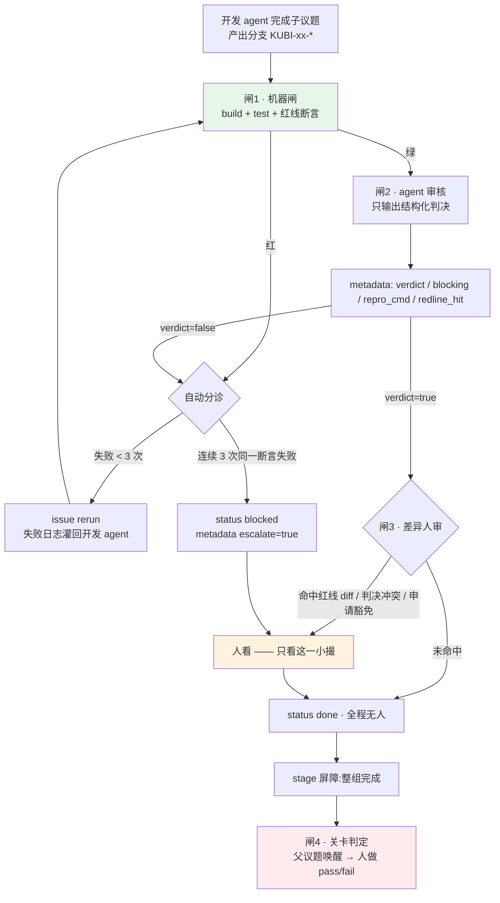
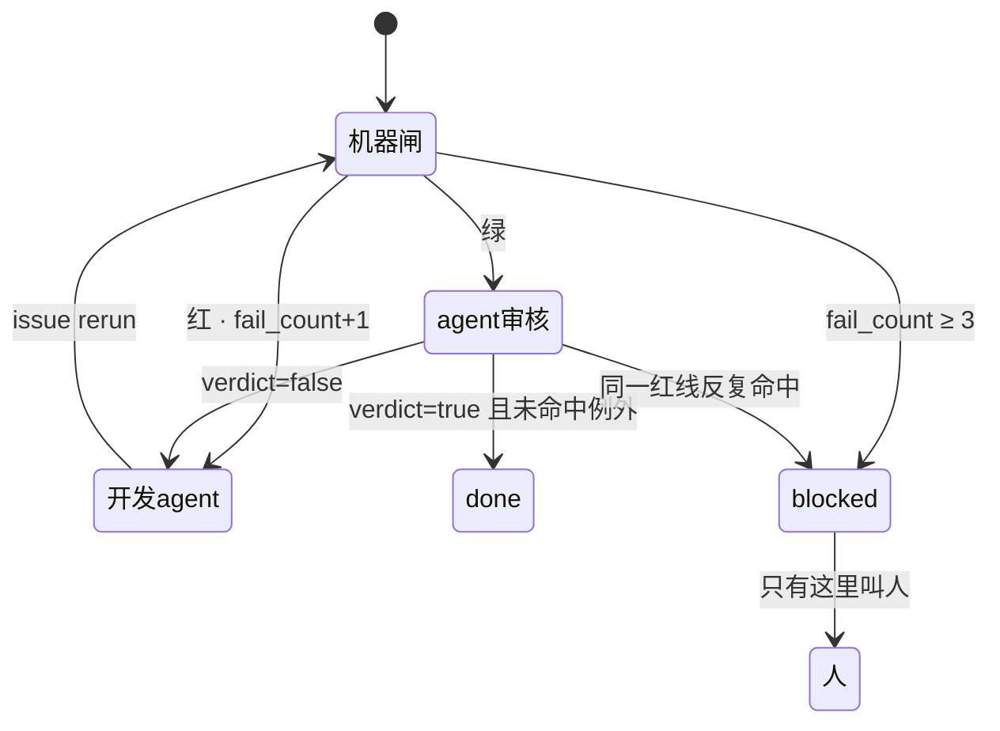

# 自动化交付工作流 · 基于 Multica

> 这份文档回答一个问题:**在 Multica 上,哪些人工审核与测试可以被机械替代,哪些不能。**
>
> 它是 `08` 第 1 条线(产品轨)的**支撑设施**,不是第四条线。它不改 `01`–`04` 的任何判据,也不改 `08` §四的任何一条防线。
>
> **§零 登记与既有文档的三处冲突,包括一条本文不重开的已决事项(`R-46`)。**
>
> **§一 的全部数字来自 2026-08-27 对 `kubicc` 工作空间与本仓库的实跑**,命令写在表里,可复现。Multica 版本会更新,带 `⚠` 的项动手前复核一次。
>
> **本文自带上限,见 §七 `R-71`。** 这件事天然属于 `03` §盲区二 点名的那类工作:进展可量化、做起来上瘾、且完全不需要面对任何一个真实用户。没有上限它一定会膨胀。

---

## 零、这份文档与既有文档的关系

### 0.1 归属:执行层。它服务于产品轨,不构成一条新的线

`08` 只有三条线,时钟分别是关卡、审批周期、风险边界。**本文描述的东西不是第四条线,它没有自己的时钟** —— 它的全部存在意义是让产品轨那条线上的交付动作少占用人的注意力。

因此它也不进 `05` 的两个 block,不占 `06` 的周六格子(见 §七 的工时口径)。

### 0.2 冲突一:`R-46` 已决「不建 CI 脚本」—— 本文不重开 🔴

| | 内容 | 时间 |
|---|---|---|
| `12` §B.9 | 建议落 `scripts/compliance/blacklist.py`,由 CI 逐行 grep 六类禁止能力,命中即构建失败 | 2026-08-25 |
| `R-46`(`08` §四 / `12` §八) | **已决:不建 CI 脚本,人工清洗。** 基线实测干净,`何时改变` = 离线脚本装第一个 Python 包时 | 2026-08-26 |

后者是更晚的决定,且带了明确的重开条件。**本文按 `R-46` 执行:抓取黑名单一条 CI 都不建。**

这意味着 §四 A 表里 `R-02` / `R-37` 那两行是**空的**,不是漏了。它们的重开条件不在本文手里:

> **何时改变:数据轨的离线脚本装上第一个 Python 包。** 在那之前数据轨一条都不抓(`3.1` 占位议题),所以这个条件当前**尚未接近**。

### 0.3 冲突二:`10` §4.4 已经警告过「写构建流程」这件事

> 原文:「壳工程怎么搭、**CI 怎么出双包**、签名怎么配,这里一律不展开……写构建流程就是 `03` §盲区二 的标准动作——一件能立刻动手、有完成感、且完全不需要面对真实用户的事。」

**这条警告成立,本文接受它。** 处理方式不是反驳,是设上限并登记为风险(§七)。`10` §4.4 那一行不改。

两者的区别只在一点:`10` 说的是**多端打包流水线**(触发条件未满足),本文说的是**红线的执行装置**(触发条件已满足 —— `server/` 里已经有 174 个源文件、5,605 行测试,红线已经有东西可以违反了)。

### 0.4 上游依据:`12` §B.7 第 3 条

> 原文:「**承诺要么可执行、要么会腐烂**」—— 它把「不发原文」做成 `scripts/strip-srctext.mjs` 一条命令 + CI 核对。**本项目的图像留存、闭集打标同样应该是可执行开关而非文档里的一句话。**

本文是这句话的展开。范围严格限制在它点名的那两类(图像留存、闭集打标)及其同构项,**不含抓取黑名单**(见 0.2)。

---

## 一、现状:瓶颈不是 agent 数量

### 1.1 实测(2026-08-27)

| 项 | 实测值 | 取数命令 |
|---|---|---|
| kubicc agent | 8 个(3 开发 / 2 审核 / 2 测试 + Mika) | `multica --workspace-id 903c14c4 agent list` |
| kubicc 议题 | 60 条 · **`in_review` 38** / `backlog` 10 / `blocked` 6 / `todo` 3 / `in_progress` 3 | `multica ... issue list --limit 500` |
| kubicc autopilot | **0** | `multica ... autopilot list` |
| kubicc repo 注册 | **空** | `multica ... repo list` |
| squad | 3 个(开发组 / 审核组 / 测试组),已编入成员 | `multica ... squad list` |
| 代码 | `server/` + `web/` 共 **174 个源文件全部未进 git**,origin 停在 `2231ca7` | `git status --porcelain` |
| 后端测试 | 5,605 行,`ApiContractTest` 614 行 | `find server/src/test -name '*.java' \| xargs wc -l` |
| 前端测试 | **0**,`package.json` 无 `test` 脚本 | `cat web/package.json` |
| runtime | 全部 `local` 模式,绑在两台 MacBook 上 | `multica ... runtime list` |

### 1.2 诊断

`multica-provision.sh` 把组织结构建得很完整,但它只解决了「活怎么分」,**没解决「活怎么收」**。38 条堆在 `in_review` 就是证据 —— 唯一的出口是人。

看 `KUBI-56`(文档合规巡检)的实际轨迹:

```
02:17 created → 02:18 in_progress → 02:23 comment「审核结论:不通过…」→ 02:23 in_review
```

审核 agent 干得没问题。问题是它的产出是**一段散文**,而散文必须由人读一遍才知道它对不对。

> **减少人审核,不等于让 agent 审 agent;等于把判据从散文变成可执行断言。**

agent 只应该负责「断言够不够、有没有漏」,不应该负责「这次通没通过」。让 agent 做后者,只是把人审核从「审代码」平移成「审审核意见」,一条都没减。

---

## 二、Multica 上真正能承重的五个原语

CLI 全部子命令过一遍,能用来搭交付流水线的就这五个,其余是外围。

| 原语 | 命令 | 在本项目里承担什么 |
|---|---|---|
| **autopilot** | `autopilot create --mode create_issue\|run_only` + `trigger-add --kind schedule\|webhook` | 事件驱动的唯一入口:CI 失败分诊、夜间巡检、关卡体检 |
| **stage 有序屏障** | `issue create --stage N` | **已经在用**。一个 stage 全部完成才唤醒父议题 = 天然的关卡判定点 |
| **squad + leader** | `squad activity <issue> action\|no_action\|failed --reason` | 分诊路由,且裁决进时间线(可审计) |
| **metadata / property / label** | `issue metadata set --key verdict --value false` | ⭐ 最被低估的一个。把 agent 结论落成**机器可读字段** |
| **skill** | `skill create` + `agent skills set` | 把审核清单从 instructions 里抽出来,可版本化、可复用 |

### 2.1 GitHub 集成 ⚠

PR 通过分支名 / 标题里的 `KUBI-xx` 自动关联到议题;Multica 读回 PR 状态、check runs、CI 结果、冲突状态。

两条必须知道的限制:

1. **它只读** —— 官方文档原文:「never pushes commits, comments, or status checks」。所以「CI 结果回写 Multica」这件事**不能指望集成自动完成**,得由 CI 自己调 CLI(见 §四 B)。
2. **自托管需要管理员建 GitHub App** 并配 `GITHUB_APP_ID` / `GITHUB_WEBHOOK_SECRET` / `GITHUB_APP_PRIVATE_KEY`。本项目的 Multica server 是自托管(`multica auth status` 显示 `http://62.234.164.41:8080`),**这一步没做之前,PR 关联不存在**。

### 2.2 webhook 触发:先验证,不要架在上面 ⚠

`autopilot trigger-add --kind webhook` 在 CLI 里存在,官方文档也描述了 payload(≤256 KiB)、`Idempotency-Key`、GitHub/GitLab provider 过滤。但上游仓库有 issue 提到 webhook / api 类触发在部分版本上**未接线**。

**结论:webhook 是加速项,不是承重墙。** 承重墙是 CI 直接调 `multica` CLI —— 这条今天就能跑,不依赖任何未验证的能力。

### 2.3 runtime 全是 local,这会影响 cron 的写法 ⚠

两台 MacBook 的 daemon 在线才有算力。官方文档的行为差异:

| 模式 | runtime 离线时 |
|---|---|
| `create_issue` | **排队**,等 runtime 上线再跑 |
| `run_only` | **直接跳过**,静默丢失 |

所以夜间巡检必须用 `create_issue`。用 `run_only` 写 `0 2 * * *`,合盖睡觉那晚就什么都没发生,而且不会有任何痕迹。

---

## 三、目标形态:四道闸,人只站在第四道



四道闸的分工是刻意的:

| 闸 | 谁在跑 | 有无裁决权 |
|---|---|---|
| 1 机器闸 | CI | 有,且是唯一自动改状态的地方 |
| 2 agent 审核 | 审核 / 测试 agent | **无**。只能写 metadata,不能把状态改成 `done` |
| 3 差异人审 | 你 | 有,但只处理例外 |
| 4 关卡 | 你 | 有。**这里不自动化** |

**闸 4 不自动化的理由是 `R-10`**:自动化系统面对临界数据的本能反应是重试与微调,而 `04` 点名的错误正是「31%,再调调」。同一关卡失败三次即为失败 —— 这条判据必须由不想通过的那个人来执行。

---

## 四、要真正减掉人审核,得做的三件事

### A. 把红线变成可执行断言(全部工作量的约 70%)

`08` §四的 🔴 条目现在只存在于 agent 的 instructions 里 —— 那是**劝阻**,不是**闸门**。逐条转化:

| 红线 | 可执行断言形态 | 落在哪 | 状态 |
|---|---|---|---|
| `R-01` 线上库无题干字段 | 反射扫描全部 DTO / 实体字段,长度无上限的 `String` 必须进白名单;外加一份 schema 快照 diff | server 测试 | ✅ 建议做 |
| `R-04` 原图不上云(**含所有厂商暂存**,`R-52`) | ① 出站 HTTP host 白名单测试,厂商图片暂存端点必须不在其中;② 原图 TTL 到期删除的注入时钟测试;③ 断言代码中不出现 `X-DashScope-OssResourceResolve` | server 测试 | ✅ 建议做 |
| `R-05` 不判断「对不对」/ 能力边界 | 前端全量文案黑名单扫描:正确率、得分、排名、讲解、学习建议、艾宾浩斯、打卡、徽章 | web CI | ✅ 建议做 · **性价比最高** |
| `R-07` + 闭集打标 | 打标响应用 JSON Schema 强校验(只能是候选 id 或 `no_match`)+ 一组**诱导性用例**(提示模型造新标签),造出新文本即红 | server 测试 | ✅ 建议做 |
| 宁缺毋滥 | 阈值扫描,断言「宁可丢弃率高不可准确率低」这个取向真的被阈值实现了 | server 测试 | 🕒 阶段 1,打标存在之后 |
| `R-51` 自动装配全套模型 | 启动期断言 `OpenAiImageModel` / `OpenAiAudioSpeechModel` 等不在上下文中 | server 测试 | ✅ 建议做 |
| `R-49` 归档刷高覆盖率 | 断言归档计数常驻、导出含完整归档清单;覆盖度计算的归档口径测试 | server 测试 | 🕒 阶段 1 |
| 决策层不被覆盖 | `docs/01`–`04` 内容 hash 守卫,改动须带显式 `ALLOW-DECISION-EDIT` 才通过 | 本地 hook | ✅ 建议做 |
| ~~`R-02` 抓取代码具备登录/绕过能力~~ | ~~依赖树与源码 grep~~ | — | ⛔ **不做。`R-46` 已决人工清洗**,重开条件见 §0.2 |
| ~~`R-37` 渲染型抓取~~ | 同上 | — | ⛔ 同上 |

两条观察:

1. **`ApiContractTest` 已经是正确范式。** 它里面那句「领域层钉的是算得对不对,契约层钉的是吐出去的还是不是同一个数」,正是把一条口头约定钉成两处独立断言。红线要的是同一种写法,**把它复制过去即可,不需要新框架**。
2. **`web` 零测试是当前最大的窟窿。** 「UI审核」agent 现在只能用散文审「AI 味」和「能力边界泄露」,因为没有任何东西可以被跑。文案黑名单扫描半小时能写完,直接把一整类人审核变成红绿灯 —— 这是全表里投入产出比最高的一条。

> ⚠️ 一条容易被忽略的边界:**断言只能覆盖「能力边界泄露」的文案层,覆盖不了「AI 味」的骨架层。** `08` 里 UI 审核的首要项是骨架级同质化(左菜单 + 面包屑 + 表格),那是审美判断,机器判不了。**这一项永远留给人**,不要试图给它写断言。

### B. agent 产出必须结构化,否则视为未完成

给全部审核 / 测试 agent 的 instructions 追加一段**收尾协议**:

```bash
multica issue metadata set <issue> --key verdict        --value false
multica issue metadata set <issue> --key blocking_count --value 3
multica issue metadata set <issue> --key repro_cmd      --value '"./server/build.sh -q test -Dtest=RedLineTest"'
multica issue metadata set <issue> --key redline_hit    --value '"R-04"'
multica issue status <issue> in_review --no-start
```

| key | 类型 | 含义 |
|---|---|---|
| `verdict` | bool | 通过与否。**唯一被分诊读取的字段** |
| `blocking_count` | number | 阻塞问题条数 |
| `repro_cmd` | string | 可复现命令。**没有它的判决一律打回** |
| `redline_hit` | string | 命中的 `R-xx`,无则省略 |
| `escalate` | bool | 需要人介入 |

配套建两个 workspace property:`闸门`(select:机器闸 / agent闸 / 关卡)、`红线命中`(multi_select:`R-01`…)。

**日常动作从「读 38 段散文」变成「扫一列布尔值」。** 而「无 `repro_cmd` 即打回」这一条规则本身就能干掉大半噪音 —— **不可复现的审核意见没有价值**,这与 `08` 对深度测试 agent 的要求(输出可复现的失败用例)是同一条。

### C. 自动分诊:让 rerun 成为默认路径



实现是一个 `create_issue` 模式的 autopilot,cron 每 10 分钟,assignee 给一个「调度 agent」。它做的事全部是确定性的:拉 `issue list` → 读 metadata → `rerun` / `status blocked` / `squad activity`。

**它不做判断,只做路由。** 判断权在闸 1 的断言和闸 2 的 metadata 里。这条边界一旦松掉,分诊 agent 就会开始「觉得这个应该能过」,四道闸立刻塌成一道。

---

## 五、落地顺序

按当前实测状态排,不是按理想顺序排。

| 步 | 动作 | 成本 | 前置 |
|---|---|---|---|
| **0** | `git add server web scripts` 提交推送;kubicc 里 `repo add git@github.com:chenyuanjin/kubic.git`;建 property / label;**把 38 条 `in_review` 一次性分诊掉** | 30 分钟 | 无 |
| **1** | CI 跑通 server 测试 + web build/lint;红线断言第一批 **3 条**(文案黑名单、`R-01` 字段扫描、`R-51` 装配断言);CI 末尾调 `multica issue metadata set` 回写 | 一个周六 | 步 0 |
| **2** | 三个 autopilot:① CI 失败分诊(每 10 分钟)② 夜间全量红线巡检(`create_issue`,`0 2 * * *`)③ 关卡数据周体检(周日) | 2 小时 | 步 1 |
| **3** | 「UI 去 AI 味清单」「文档合规清单」做成 skill,`agent skills set` 挂上去,从 instructions 里删掉 | 2 小时 | 步 1 |

**步 2、步 3 建议压到关卡 1 之后**,理由见 §七。步 0 和步 1 现在就该做,因为它们同时是 `13` 那些红线的唯一执行装置。

### 5.1 两个会让人白干的落地细节

1. **CI 环境必须复刻 `build.sh` 的隔离校验。** `build.sh` 现在挡的是本机 `~/.m2/settings.xml` 指向公司私服(`10` §1.3)。CI 上没有那个文件,**于是那道校验在 CI 上是空的** —— 必须把公共镜像白名单那段一起搬过去,否则隔离红线只在你的笔记本上成立。
2. **CI 回写需要 `MULTICA_TOKEN` 能打到 `62.234.164.41:8080`。** 先验证连通性(GitHub Actions 出口能否访问该端口)。打不通就退回本地 runner 或 git hook,效果相同。另外 `multica-provision.sh` 已经踩过一次 token 继承坑 —— **CI 用独立 token,不要复用 task token**。

---

## 六、四个不要自动化掉的地方

| 项 | 理由 |
|---|---|
| **关卡 pass/fail** | `R-10`。自动化的本能是重试,判据要的正好相反 |
| **任何红线豁免** | `@SuppressWarnings` 式绕过必须人签字,且在 diff 里高亮。`R-67` 记过同一件事:**没有出路的守卫会被撞上它的人在半夜关掉**,所以出路必须存在 —— 但用掉出路这件事本身必须留痕 |
| **合规轨的花钱动作** | 时钟是审批周期,不是 CI |
| **`P0-6` 那两个数字** | 关卡 0 的全部输入,是你自己产生的数据,agent 替不了 |
| **UI 骨架层的「AI 味」判断** | §四 A 的边界说明:审美判断没有断言形态 |

---

## 七、上限与自检 🟠

登记为 **`R-71`**(`08` §四已同步)。

这套东西**正好是 `08` §六 警告的那种工作**:进展可量化、做起来上瘾、且不需要面对任何一个真实用户。它和合规轨、数据轨是同一个失败模式,`10` §4.4 也已经就「写构建流程」点过一次名。

**上限(硬):**

| 口径 | 值 |
|---|---|
| 总投入 | `P0-6` 那张表为空期间,**≤ 2 个周六 + 每周 1 小时维护** |
| 工时来源 | 周六格子。**不占晚上(那是打标),不占周日(那是复盘)** |
| 跑偏判据 | 任一周本流水线的提交数 > 产品轨的提交数,该周即为跑偏 —— 与 `R-11` 对数据轨的判据同构 |

**何时放开:** 关卡 1 通过,**且**同时有 ≥ 3 个开发 agent 在改同一个仓库。

理由很直接:**一个人写代码,交付流水线的收益有限;三个 agent 并行改同一个仓库时,它才从「整洁」变成「必需」。** 现在真正的下一个阻塞点是关卡 0 的两个数字,不是交付效率。

> `08` §六 的自检在这里原样适用:如果本文的步 2、步 3 都做完了,而 `1.1.4` 那张表还是空的 —— 老毛病又犯了一次,而且这次犯得更隐蔽,因为它看起来像是在写产品代码。

---

## 八、待确认 ⚪

| 项 | 谁来关 | 备注 |
|---|---|---|
| Multica webhook 触发在自托管 `62.234.164.41` 上是否真的接线 | 你 | 建一个测试 autopilot + `trigger-add --kind webhook`,curl 打一次即知。**5 分钟。** 未验证前一切设计走 CLI 回写 |
| GitHub App 是否要为自托管 Multica 建 | 你 | 不建则 PR ↔ 议题关联不存在,闸 1 的结果只能靠 CLI 回写。**关卡 1 前不值得建** |
| GitHub Actions 出口能否访问 `62.234.164.41:8080` | 你 | 决定 CI 回写走云端还是本地 runner |
| CI 是否构成 `R-08`「不用公司设备/网络」的新交集面 | 你 | GitHub Actions 是公共云,依赖走公共镜像白名单(`build.sh` 已有校验逻辑,需搬运)。**直觉上不构成,但没书面确认过 —— 这是推理不是结论** |
