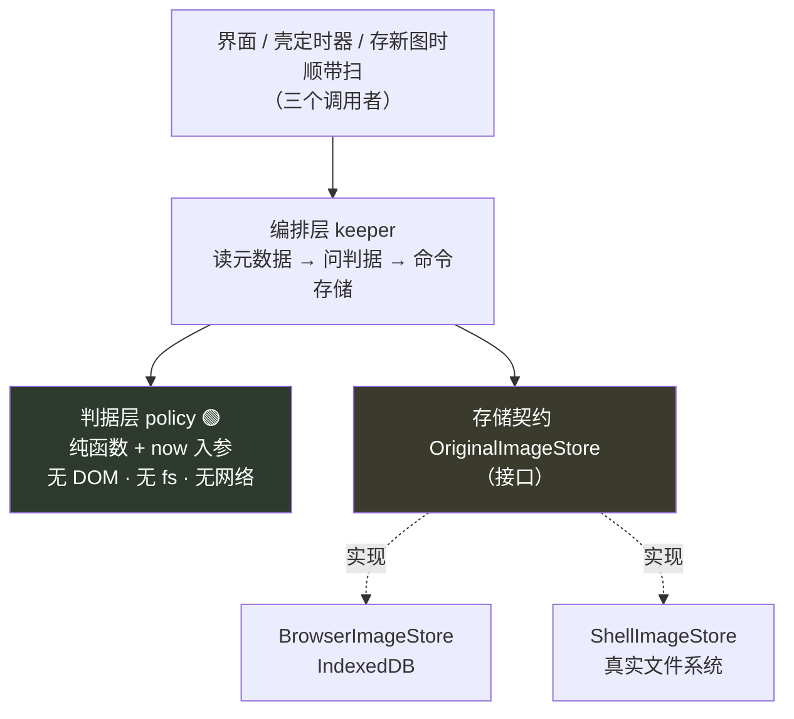
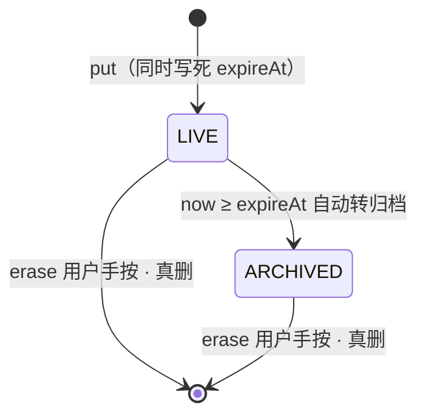

# 原图存储：判据层与存储层

> 这份文档只回答一个问题：**原图的字节放在哪，谁决定它什么时候转归档。**
>
> **它是契约，不是开工许可。** 落地批次见 §六，其中没有一批属于当前最近的那个关卡 —— `04` 的关卡 0 要的是「自用两周、每天记两个数」，本文一个数都不产生。`03` §盲区二 记着这个项目自己的失败模式：注意力流向能做的部分，不是最不确定的部分。**存储正是「能做」的那一侧。**
>
> **第一句必须先说的事实：这条链路现在一行代码都没有。** 见 §零。因此本文谈的「迁移」今天是一次空跑 —— 这不是缺陷，这是本文现在写的全部理由。
>
> 与 `15`（壳技术方案，`KUBI-62`）的分工：构建链、工程目录、三端差异隔离由 `15` 定；本文只对「判据层不碰 IO」「依赖单向」「存储实现的注入点唯一」这三条负责，**具体落点以 `15` 的构建链方案为准**。

---

## 零、先说三件事实，否则后面每一节都会被误读

### 0.1 原图存储在代码里不存在，存量为零

`v1` 分支实测（2026-08-29）：

| 查的东西 | 命令 | 结果 |
|---|---|---|
| 浏览器本地库调用 | `grep -rn "indexedDB\|localStorage\|caches\|navigator.storage" web/src` | **零命中** |
| 拍照入口 | `web/src/features/CommandPalette.tsx:147` | 标着 `未接入`，`disabled` |
| 服务端图片端点 | `grep -rn "image" server/.../api/RecordController.java` | **零命中**（`CaptureService.captureFromPhoto` 有，但没有任何 controller 通到它） |

**议题原文说的「当前原图存在浏览器的本地数据库里」，在代码里不成立。** 一张图都还没落过盘。

这件事的分量不在「谁说错了」，而在：**存量为零的窗口是这条链路最便宜的一刻，而它现在开着。** 契约在第一张图落进 IndexedDB 之前定，成本是零；落进去之后再定，成本是一次带用户数据的迁移。`08` `1.1.3` 写着「第一天不定就改不回来」——**今天就是那个第一天。**

### 0.2 「到期转归档」是一次改判，与文档集正面冲突

`KUBI-61` / `63` / `68` 三处（2026-08-29，项目所有者）写的是：**到期是转归档，不是删除；归档后字节仍在本机、仍然读得出来。**

`08` `1.1.3.2` 写的是：**到期自动删除。**

本文按改判写。**冲突不消化在这里** —— 仍写着「删」的位置逐条列在 §七。其中 `01` §2.3 属于决策层，本文只加指针、不改原文（`05` 原文：「04 的关卡判据在这里一个字都不改」；`R-65` 是同一手法的先例）。

⚠ **一句必须自己点破的话：** 红线原文是「原图只做本地缓存或**短期留存**」。「不上云、不共享」那半句改判没有碰，**但「短期留存」那半句被架空了** —— 归档保留意味着字节在本机长期存在。项目所有者已在 `KUBI-61` 明确写下「红线不变：原图只在用户自己的机器上」，即把红线读作「不出本机」而非「不久留」。**这是一次红线释义的收窄，需要 `01` §2.3 落一次笔。** 见 §七，已登记为 `R-73`。

### 0.3 壳试水期间 `web/` 一行不改

`KUBI-61` 硬约束。本文的实现因此**不能全批落在壳试水里**，批次见 §六。

---

## 一、每节最早落地阶段

**这张表的作用和 `10` §零 一样：防止本文被当成待办清单。**

| 节 | 内容 | 最早落地阶段 |
|---|---|---|
| §二 §三 §四 | 分层与两个接口契约 | **现在**（冻结签名，不写实现） |
| §五 | 两形态共存 | 壳线 `KUBI-65` 之后 |
| §六 | 落地批次 | 见该节 |
| §七 | 文档同步 | **现在** |
| §八 §九 | 不做什么 / 自检断言 | 全程 |

**只有 §三 §四 §七 是现在就有约束力的。其余是「将来如果建，这么建」。**

---

## 二、切法：三层，依赖单向

议题原文：「判据层（纯逻辑、可测）与存储层（碰真实 IO）必须继续分开，这一层分离是现有实现刻意做的，不要合并。」

现有实现指的是 server 侧那条已经生效的纪律 —— `CaptureService`（规则，注入 `Clock`）/ `TouchStore`（存储契约）/ `FileTouchStore`（真实 IO）。本文照抄这个形状，不发明新的。



| 层 | 认识什么 | 不认识什么 | server 侧的同构物 |
|---|---|---|---|
| 判据层 | 元数据 + 一个 `now` | 存储、DOM、壳、配额 | 比 `CaptureService` 更纯的那一半 |
| 编排层 | 判据层 + 存储契约 | 具体是哪个实现 | `CaptureService` |
| 存储层 | 字节与元数据怎么落 | 留存期、到期规则 | `TouchStore` / `FileTouchStore` |

**箭头单向，且用构建强制：** 判据层所在的包不得依赖 web / shell / server 任何一侧；两个存储实现依赖接口，接口不依赖实现。这与身份约束里的「模块依赖图无环」是同一条，靠的是包边界不是自觉。

**为什么编排层要单独存在，而不是并进判据层：** 「先落归档标记还是先动字节」这个顺序本身有对错（见 §四 的幂等语义），它既不是纯逻辑也不是 IO。放进判据层会把 `now` 之外的东西带进纯函数，放进存储层会让两个实现各写一遍同一段顺序 —— 那就是「为壳单独分叉一套逻辑」的起点。

---

## 三、判据层契约 🔴

```ts
// 无 DOM · 无 fs · 无网络 · 无 Date.now()
export type ImageState = 'LIVE' | 'ARCHIVED'          // 🔴 只有两个，没有 DELETED

export interface ImageMeta {
  readonly id: string
  readonly state: ImageState
  readonly capturedAt: number        // epoch ms
  readonly expireAt: number          // 🔴 put 那一刻算完并写死
  readonly archivedAt: number | null // 转归档的时刻；LIVE 时为 null
  readonly bytes: number             // 字节数，用于配额陈述；不是内容
}

export type RetentionAction =
  | { readonly kind: 'KEEP' }
  | { readonly kind: 'ARCHIVE'; readonly at: number }  // 🔴 没有 DELETE 分支

/** 单条判据。纯函数：同样的入参永远同样的出参。 */
export function decide(meta: ImageMeta, now: number): RetentionAction

/** 一次扫描要动哪几条。只吃元数据，不吃字节。 */
export function due(metas: readonly ImageMeta[], now: number): readonly string[]
```

### 三条结构性约束，都是类型层面的，不靠自觉

| # | 约束 | 为什么 |
|---|---|---|
| 1 | **`RetentionAction` 没有 `DELETE` 分支** | 删除只有一条路：用户手按。它不是到期判据的输出。写不出来，就不会有人在赶工时顺手加上「归档满 N 天后自动清理」——那正是把改判偷偷改回去的形状 |
| 2 | **`expireAt` 是入参，不是算出来的** | 判据层里没有「留多久」这个配置。留多久是 `put` 那一刻的产品决定，之后任何路径都不能改它。**接口上没有 `extendExpiry` / `touch` 这类方法，也永远不会有** —— 有了它，一次重试就能把留存期无限延长 |
| 3 | **`now` 是入参，层里没有 `Date.now()`** | 与 server 侧注入 `Clock` 同一条理由：`08` `1.1.3.3` 要的「改系统时间实测验证」在有注入时钟时是一次单元测试，没有时是一次手工操作 |

### 状态机



**没有 `ARCHIVED → LIVE`。** 取消归档等于延长留存期，而留存期在 `put` 那一刻就写死了。

### 🔴 归档在物理上什么都不做 —— 这正是这条议题存在的原因

转归档只改一个状态位，字节一个都不动。所以：

- **壳形态**：归档段占的是磁盘，磁盘没有配额，问题消失。
- **浏览器形态**：归档段只增不减，**必然撞上浏览器配额**。撞上那天，新图存不进来。

把这句话写清楚，是为了不让人误以为「实现了归档」就解决了配额。**归档不解决配额，换存储才解决配额。** 浏览器形态下配额撞墙时怎么办，见 §四 的降级条款。

---

## 四、存储层契约 🔴

```ts
export interface OriginalImageStore {
  /** 存一张。幂等：同 id 重复 put 返回既有 meta，不覆盖 expireAt、不覆盖字节。 */
  put(id: string, bytes: Uint8Array, mime: string, expireAt: number): Promise<ImageMeta>

  /** 读字节。归档后仍读得出（归档不是删）。不存在返回 null，不抛。 */
  read(id: string): Promise<Uint8Array | null>

  /** 只回元数据，永不回字节 —— 一次扫描不该把几百兆读进内存。 */
  list(): Promise<readonly ImageMeta[]>

  /** 转归档。幂等：已归档时原样返回，不覆盖 archivedAt。 */
  archive(id: string, at: number): Promise<ImageMeta>

  /** 🔴 用户手按的真删。幂等：不存在也算成功。 */
  erase(id: string): Promise<void>

  /** 形态差异的唯一出口，见 §五。 */
  capacity(): Promise<Capacity>
}

export interface Capacity {
  readonly usedBytes: number
  /** 🔴 浏览器形态是一个数；壳形态是 null（没有配额这回事）。 */
  readonly limitBytes: number | null
}
```

### 🔴 签名里没有 URL / bucket / fileId 的位置

与 `13` §七 守 `R-04` 用的是同一手法：**不是靠注释写「别传上去」，是让「传上去」这件事在类型上写不出来。** `put` 的入参是 `Uint8Array`，`migrate`（§六）的两个入参都是 store。整条链路上没有任何一个函数能接受一个地址。

### 幂等语义（这一段是契约，不是实现细节）

| 方法 | 重复调用 | 为什么必须这样 |
|---|---|---|
| `put` | 返回既有 meta，**不刷新 `expireAt`** | 刷新一次，一个反复重试的网络就能把留存期延到无限 |
| `archive` | 返回既有 meta，**不刷新 `archivedAt`** | 刷新一次，「多久前」就被一次重扫重置了。「多久前」是这个产品仅有的三个维度之一 |
| `erase` | 不存在也算成功 | 删除是用户按下去的动作，它不该因为「已经没了」而报错 |
| `read` | 不存在返回 `null` | 缺字节是正常状态（见下面的自愈），不是异常 |

### 错误码

| 码 | 何时 | 界面该说的下一步 |
|---|---|---|
| `IMG_STORE_UNAVAILABLE` | 存储层起不来：隐私模式禁用了本地库 / 壳的目录没权限 | 「这张图没能留在本机」。**记录照样落地** |
| `IMG_QUOTA_EXCEEDED` | `put` 时配额不够（只可能出现在浏览器形态） | 同上，外加一行事实陈述：已用多少 / 上限多少 |
| `IMG_BYTES_MISSING` | 元数据在、字节没了（壳形态特有，见下） | 列出来，不静默抹掉条目 |

**不设 `IMG_NOT_FOUND`** —— `read` 回 `null`，`archive` / `erase` 幂等，没有一处需要它。

### 🔴 降级条款：原图存不下 ≠ 这一笔记不了

`08` `1.3.7.1` 的铁律是「识别服务不可用时，记录动作本身永不失败」，`CaptureService` 里那条分支顺序就是它。**本地留存必须适用同一条：**

> 图片进内存 → 送识别 → 记录落地。**本地留存是这条线之外的一个附加承诺，它失败时记录照样落地。**

所以配额撞墙的后果是「这张图没留在本机」，不是「这一笔没记上」。这一条决定了浏览器形态在撞墙之后仍然可用 —— 它退化，但不停摆。

同时，**不能反过来假装存下了**。`KUBI-64` 列的三处不可弱化的交互里有「用户同意留存原图的那一刻」；同意了却没存下，必须说出来。**具体怎么说交给 `KUBI-64`，本文只钉死「必须说」。**

### 元数据与字节的原子性：两个形态不一样，这是唯一的实现层差异

| | 浏览器 | 壳 |
|---|---|---|
| 字节 | IndexedDB | `originals/<id>.bin` |
| 元数据 | 同一个 IndexedDB 事务 | `originals/index.json`，先写 `.tmp` 再原子 rename（与 `FileTouchStore` 同构） |
| 能不能一起原子写 | ✅ 能 | ❌ **不能** |

壳形态因此有一个浏览器没有的失败模式，处理方式写死在这里：

- **启动时对账一次**，以文件系统为准。
- index 里有、文件没了 → 标 `IMG_BYTES_MISSING`，**不静默删条目**（条目消失等于把一次丢失伪装成从没发生过）。
- 文件在、index 里没有 → 孤儿文件，列出来，**不自动删**。壳形态没有配额压力，留着的代价是磁盘；自动删的代价是「在用户没按的时候删了东西」。**后者更贵。**

---

## 五、两种形态如何共存，且不分叉

议题原文：「不要为壳单独分叉一套逻辑。」落成四条可检查的形态：

### 5.1 判据层只有一份，两端连编译产物都是同一份

壳带来的**不是一套新逻辑，是一个新的调用者** —— 现有两条触发（界面启动扫一遍、存新图顺带扫）之外多一条后台定时器（`KUBI-68`）。三个调用者调同一个 `due()`。**这就是「不分叉」的验证点：如果 `KUBI-68` 需要写第二套到期规则，说明这一层切错了。**

### 5.2 🔴 存储实现的注入点唯一且有名字

全工程只有一处解析形态：

```ts
export function resolveImageStore(): OriginalImageStore
```

任何别处出现 `new BrowserImageStore(` / `new ShellImageStore(` 都是破坏，可 grep（§九）。这与身份约束里「接大模型的注入点必须可数且各有其名」是同一条纪律 —— 多一个没人知道的注入点，形态一致性就少一道防线。

界面只认接口，不认形态。**界面上不出现「你在壳里」这件事**，与 `KUBI-64` 的默认答案（原生能力默认不用）一致。

### 5.3 一份共用的契约测试，两个实现各跑一遍

幂等语义、错误码、`archive` 后仍读得出 —— 写成一组与实现无关的用例，两个实现分别注入进去跑。**这是保证「不分叉」的机械手段。** 只写一句「两边行为要一致」，两边就会在第三个月不一致。

### 5.4 允许存在的形态差异只有一个：`capacity().limitBytes`

浏览器是一个数，壳是 `null`。界面据此决定要不要显示配额事实。**这是一个数据差异，不是一个代码分叉** —— 没有任何 `if (isShell)` 因此而存在。

### 5.5 🔴 壳侧的目录选择本身就是一条红线的实现

| 目录 | 结论 |
|---|---|
| `~/Documents` `~/Desktop` | ❌ **绝对不行**。macOS 的 iCloud「桌面与文稿」同步默认可开，开着就等于**原图自动上云** |
| `~/Pictures` | ❌ 同上，且会进照片图库与各类相册同步 |
| 应用数据目录（macOS `~/Library/Application Support/<app>/originals/`） | ✅ 不在任何系统级同步范围内 |

**这条和 `10` §8.1 第 5 条（Nginx 的 `client_body_temp` 会把请求体落盘）是同一类破口：它不在你写的代码里，不会报错，也不会出现在任何 review 里。** 一个默认开着的系统开关就能把「绝不上云」变成一句空话。

配套两条：

- **Tauri capability 白名单只开这一个目录**，不开通用文件系统权限。壳暴露给前端的 command 只有 `OriginalImageStore` 那几个方法，没有通用读写文件的口子。
- **文件名不含任何内容线索**：`<id>.bin`，`id` 是随机的。目录被人翻到时，看不出这是什么科目的什么题。

### 5.6 服务端零改动

本设计**不新增任何服务端接口**，`server/` 一行不改。识别链路仍按 `10` §八：字节内联 base64、只在内存里过一次、不落盘、不进日志。

本地留存与服务端识别是**两条独立的路**：识别失败不影响留存，留存失败不影响识别。两者唯一的耦合，是同一份内存里的字节被用了两次。

---

## 六、迁移路径

### 6.1 今天的答案：存量为零，迁移器是一次空跑

见 §0.1。**这不是把问题推走，恰恰相反** —— 契约现在定，是因为第一张图落地之后就不再有零成本的窗口。

### 6.2 契约

```ts
/** 🔴 两个入参都是 store。签名里没有 URL 的位置 —— 迁移绝不经过网络。 */
export function migrate(from: OriginalImageStore, to: OriginalImageStore): Promise<MigrationReport>

export interface MigrationReport {
  readonly moved: number
  readonly skipped: number                    // 目标侧已有同 id
  readonly failed: readonly { id: string; code: string }[]
}
```

| 规则 | 说明 |
|---|---|
| **方向单向**：浏览器 → 壳 | 反向不提供。把已经出了配额的东西塞回配额里，没有任何一种用户处境需要它 |
| **逐条搬，不批量** | `put` 到目标 → 读回校验字节长度 → `erase` 源。任何一步失败，这一条留在源侧并进 `failed` |
| 🔴 **`expireAt` / `capturedAt` / `archivedAt` 原样保留** | 与 `TouchStore.reassign` 同一条纪律：**搬家不重置时间戳**。重置一次，「多久前」就错了，而它是这个产品仅有的三个维度之一。已归档的搬过去还是已归档 |
| **可中断可续跑** | 崩在 `put` 与 `erase` 之间时，最坏是一条图两边都在；下一轮按 id 幂等跳过（计入 `skipped`）。**宁可重复一条，不可丢失一条** |
| **不合并、不去重、不重新压缩、不重跑识别** | 搬运就只是搬运 |
| **失败不静默** | `failed` 里的条目留在浏览器侧，报告要能被界面读出来 |

### 6.3 时机

搬的时机与告知方式属于交互，**交给 `KUBI-64`**。本文只给两条约束：

- 不搬的后果是配额撞墙，所以**不能做成一个用户可能永远不点的按钮**。
- 图的落点从浏览器沙箱变成一个可见的目录，是用户该知道的事实。**这不是一次重新征求同意**（字节没有离开他的机器），但也**不能一声不吭**。

### 6.4 落地批次 —— 哪一批都不在关卡 0 里

| 批 | 内容 | 何时 | 谁 |
|---|---|---|---|
| **A** | 本文 + §三 §四 两个签名冻结。**不写代码** | 现在 | 本议题 |
| **B** | 无 DOM 依赖的共享包落地（判据层 + 契约 + 契约测试） | 随 `15` 的构建链一起。**壳试水期内 `web/` 一行不改，所以它不能单独进 `web/`** | `KUBI-62` 的方案定落点 |
| **C** | 浏览器实现 + 存图即写过期戳 | 产品线 `1.1.3` | 产品轨 |
| **D** | 壳实现 + 后台定时器 | 壳线 `KUBI-68` | 壳线 |
| **E** | 迁移器 | C 真的产生了存量之后。**在此之前它是空跑，先写等于先写一个没有输入的东西** | — |

> 🔴 **给 `KUBI-68` 接手人的一句话：后台定时器的前置是 C 或 D 至少落一个。** 现在没有任何原图，定时器没有可处理的对象 —— 它会是一个每小时准时扫出零条的循环。这不是「先做好等着」，是做完了无法验证。

---

## 七、文档同步清单：仍写着「删」的位置

改判见 §0.2。下表逐条列出冲突位置与处理方式。**处理方式一律是加指针，不改原文**（`R-65` 的先例：「`10` §7.2 已就地加指针，原文一个字没改」）。

| 位置 | 原文要点 | 处理 |
|---|---|---|
| `01` §2.3 | 「原图只做本地缓存或**短期留存**」 | 🔴 **决策层，本文不动。需项目所有者落一次笔** —— 把红线释义收窄为「不出本机」。已登记 `R-73` |
| `08` `1.1.3` / `1.1.3.2` | 「原图过期删除写死」/「到期自动删除」 | ✅ 已就地加指针 |
| `08` `1.2.4.5` | 「原图元数据：本地路径 + 过期时间戳」 | 仍成立（元数据字段没变），不动 |
| `06` L90 / L291 | `P0-4`「到期自动删」 | ✅ 已就地加指针 |
| `05` L89 / L96 | `P0-4`「设过期删除」 | ✅ 已就地加指针 |
| `10` §八 / §8.2 | 链路图与元数据表 | ✅ §8.2 表格已就地加指针 |
| `14` L173 | `R-04` 的第 ② 条断言：「原图 **TTL 到期删除**的注入时钟测试」 | 🔴 **这条断言按现状会把改判判成违规。** ✅ 已就地加指针，断言本身改成「到期**转归档**的注入时钟测试」 |
| `05` L255 / `08` `2.1.3.4` | 隐私政策里「图片本地缓存与过期删除的表述」 | 🔴 **对外表述必须跟着改** —— 写着「到期删除」而实际长期保留，是一次对用户的错误陈述。留给合规轨，本文只登记 |

**`07` §二 那张表（「本地短期缓存，到期删」）属于数据轨的类比行，不单独加指针** —— 它引的是 `01` §2.3，`01` 落笔后自动成立。

---

## 八、不做什么

| 不做 | 为什么 |
|---|---|
| **不新增任何服务端接口** | `server/` 零改动。本地留存是本机的事，服务端关于图片知道的全部信息仍是一个枚举值（`10` §8.2） |
| **不做缩略图、不做图片浏览页** | 一个能翻的图库就是一个盗版课件浏览器。归档段可以被统计（几张、多少字节），不能被浏览 |
| **不把原图放进导出** | 导出仍只有 Markdown / CSV / JSON。**导出是「共享」最自然的入口**，`R-04` 的「任何形式的共享」包含它 |
| **不做跨设备同步、不做备份** | 红线原文。§5.5 的目录选择是它的物理落点 |
| **不压缩、不转码、不重跑识别** | 留存就只是留存 |
| **不做「归档满 N 天自动清理」** | 那是把改判偷偷改回去。§三 约束 1 已让它写不出来 |
| **配额提示只陈述事实** | 「已用 480 MB / 上限约 500 MB」。**不出现催促、不出现建议**（`01` §2.2 能力边界） |

---

## 九、自检（可执行的断言）

与 `13` §七 那张表同一形态：每条对应一个物理形态，不是一句承诺。

| 约束 | 怎么验证它还在 |
|---|---|
| 🔴 原图不上云 | 存储与迁移的方法签名里没有 URL / bucket / fileId 型参数；`grep -rn "fileId\|imageUrl\|ossUrl\|upload" <共享包> <web> <shell>` 零命中 |
| 🔴 到期只归档，不删 | `RetentionAction` 联合类型里没有 `DELETE` 分支 |
| 🔴 留存期不可延长 | `OriginalImageStore` 上没有 `extendExpiry` / `touch`；`put` 的重复调用测试断言 `expireAt` 不变 |
| 🔴 判据层不碰 IO | 判据层所在文件里 `grep -n "Date.now\|indexedDB\|fetch\|fs\|invoke"` 零命中 |
| 🔴 不分叉 | 全工程 `resolveImageStore()` 只有一处；契约测试两个实现各跑一遍且用例文件只有一份 |
| 🔴 壳目录不在同步范围 | 壳的目录常量指向应用数据目录；capability 白名单只有这一个目录 |
| 🔴 搬家不重置时间 | 迁移测试断言 `expireAt` / `capturedAt` / `archivedAt` 三个字段前后逐字相等 |
| ⬜ 记录永不失败 | 存储抛 `IMG_QUOTA_EXCEEDED` / `IMG_STORE_UNAVAILABLE` 时，采集路径仍返回「已记录」 |
| ⬜ 到期判据可回放 | 注入固定时钟，跨过 `expireAt` 前后各断言一次（替代 `08` `1.1.3.3` 的「改系统时间实测」） |

---

## 十、新增风险

两条已登记进 `08` §四：

- **`R-72`** —— 浏览器形态下归档段只增不减，必然撞配额。
- **`R-73`** —— 「到期转归档」架空了 `01` §2.3 的「短期留存」半句，`01` 尚未落笔。

---

## 十一、最后一次自检

**这份文档写完不构成任何进度。** `04` 的关卡 0 判据是「自用两周、每天记两个数」，本文一个数都不产生 —— `KUBI-61` 原文已经诚实写过这一条，本文不替它找关卡理由。

真正现在就有约束力的，只有三样：**§三 §四 的两个签名**（因为存量为零的窗口现在开着）、**§七 的文档同步**（因为不同步就会有人照着「到期删除」实现）、**§0.2 那次红线释义**（因为它需要项目所有者落笔，而不是被一次实现默默确立）。

其余每一节，都是「将来如果建，这么建」。
