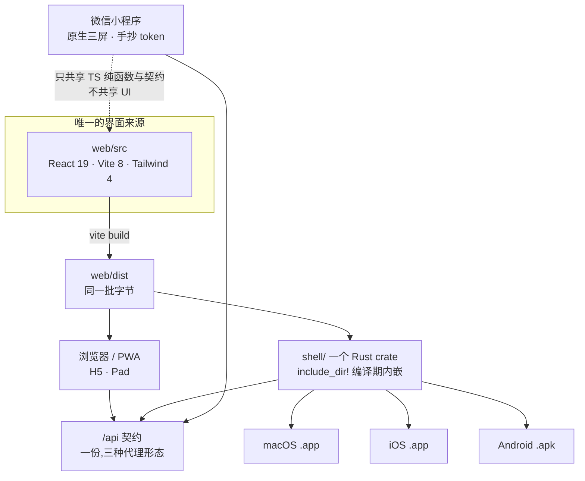
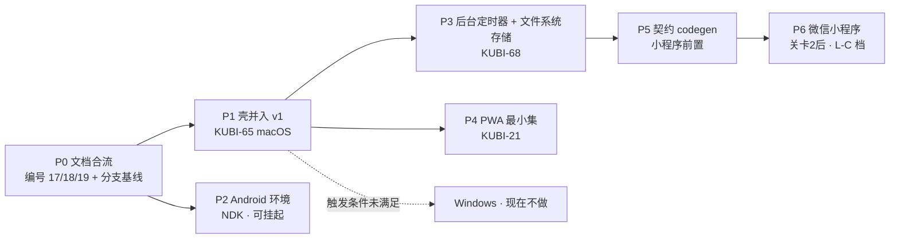

# 多端选型与端矩阵

> **这份文档定的是「哪个端用什么技术」,不定「什么时候做」。** 排期仍在 `05` / `08`,本文一件都不重排。
>
> **基线:`origin/v1` @ `04a0054`,fetch 于 2026-08-30。** 壳侧事实取自 `KUBI-65` / `KUBI-66` / `KUBI-67`
> 三条已推分支的实测记录(基线 `339e8b8`),设计侧事实取自 `KUBI-64` 的人审裁定。
>
> **它推翻的不是 `10` §四 的判断,是那份判断的输入。** `10` §四 写于壳试水之前,当时「桌面壳不做」
> 和「小程序用 Taro 4」都成立;现在有了三端实测和五份设计稿,输入变了,结论跟着变。
> 被推翻的两条在 §零 逐条点名,`10` 原文一个字不改,只就地加指针。
>
> **最后一句先放在最前面:这份文档对最近那个关卡的贡献是零。** 关卡 0 要的是「自用两周、每天记两个数」
> 那两个数字,选型一个数都不产生。写选型比写代码更容易让人觉得自己在推进,所以这句要留在这里。

---

## 零、这份文档改了什么

| 出处 | 原结论 | 现结论 | 改的是什么 |
|---|---|---|---|
| `10` §4.2 | 前端选 React + Vite + TS + Tailwind | **不变,冻结** | 无。实测活着,`web/` 已经在这条路上跑了一整轮 |
| `10` §4.4 | 桌面壳「先不做」,PWA 安装顶上 | **做,Tauri 2,macOS 先行** | 触发条件已满足 —— 但满足它的不是 §4.4 押的那三条(全局热键 / 监听截图目录 / 悬浮窗),是**后台定时器**和**存储配额**。这两条 §4.4 一条都没列(`KUBI-62` / `KUBI-64` 已判) |
| `10` §4.3 | 微信小程序用 Taro 4,复用逻辑层 | **改用原生小程序 + 手抄 token** | 见 §3.6。Taro 的价值是复用 React 组件,而 `L-C6` 已经把小程序限定成三屏且**明确不复用 UI** —— 剩下的那点复用不值一条构建链 |
| `10` §4.3 | 三端(H5 / 桌面 / 小程序) | **六个形态,其中四个是端** | 设计侧已经出到五份稿(`h5` / `pad` / `app` / `desktop` / `miniprogram`),而「端」这个词在五份稿之间不是一个口径。§一 先把口径统一 |

> **一处必须承认的事实:** `10` §四 的调研数据是 2026-08 口径的**公开资料对照**,不是实测。
> 本文里凡是标 ✅ 实测的,都能给出命令与输出(见 §十);没标的就是判断,判断可以被下一次实测推翻。

---

## 一、先统一「端」的口径

**一个形态要成为「端」,判据只有一条:它需要一条自己的构建链或一次自己的分发。** 光是长得不一样不算。

| 形态 | 是端吗 | 载体 | 选型 | 现状 | 最早触发条件 |
|---|---|---|---|---|---|
| **Web / H5** | ✅ 端 | 浏览器 | React 19 + Vite 8 + TS + Tailwind 4 | ✅ 已在跑(`web/`) | 已在跑 |
| **Pad / iPad** | ❌ **不是端** | 同上 | 就是 H5 的一组断点 | ✅ 已有窄屏分支(`MobileTabs.tsx`) | 无。设计稿 `pad.html` 落成 Tailwind 断点,**不新建工程** |
| **桌面(macOS)** | ✅ 端 | Tauri 2 + 系统 WebView | 同一份 `web/dist`,壳是 Rust | ✅ 实测可装可开(`KUBI-65`) | 已开工 |
| **桌面(Windows)** | ⚪ 待定 | 同上 | 同上 | 未验 | 见 §3.3.2,**触发条件未满足,现在不做** |
| **桌面(Linux)** | ❌ 不做 | — | — | — | 无触发条件。用户数为零的端不建构建链 |
| **iOS** | ✅ 端 | Tauri 2 iOS | 同一 crate 同一 dist | ✅ 模拟器跑通(`KUBI-66`) | 真机/上架卡在主体决策,见 §七 |
| **Android** | ✅ 端 | Tauri 2 Android | 同上 | ⚠️ 代码侧已验,环境卡住(`KUBI-67`) | 见 §3.5 |
| **微信小程序** | ✅ 端 | 微信原生 | 原生小程序 + 手抄 token | 未开工 | **关卡 2 后**(`05` `L-C` 档),不提前 |

**「Pad 不是端」这条要说清楚,因为它省掉的成本最大。** iPad 上的核心场景(边看网课边截图)发生在 Safari 里,
iPadOS 的 Safari 就是桌面级 WebKit;等 iOS 包存在之后,同一个包在 iPad 上直接可跑。
**为 Pad 单开一份工程,买到的只有一组断点。**

---

## 二、总原则:一份产物,N 个壳



三条硬约束,它们不是偏好,是这套结构成立的前提:

| # | 约束 | 由谁强制 | 违反的样子 |
|---|---|---|---|
| 1 | **界面只有一份来源。** 所有端看到的 UI 都是 `web/dist` 那批字节 | `shell/build.sh` 步骤 ③:跑完构建后 `git status --porcelain -- web server` 必须为空,否则拒绝构建 | 「顺便在壳里改一下这个按钮」 |
| 2 | **平台差异只允许出现在两处**:`shell/src/platform/` 与 Tailwind 断点 | `build.sh` 构建期 `grep` 拦 `cfg(target_os)` 越界,不靠自觉 | 业务代码里出现 `if (isShell)` |
| 3 | **原生能力必须可数且各有其名。** 每引入一个,就多一处「浏览器里和壳里不一样」 | 人审。清单在 §3.3.3,加一条要过一次人审 | 悄悄引一个 tauri 插件 |

### 2.1 为什么跨端 UI 框架全部否掉

| 方案 | 否掉的**决定性**理由(不是打分,是一条硬伤) |
|---|---|
| **Electron** | 150MB 包体 + 第二套 Chromium 运行时。而壳唯一要买的两样东西(后台定时器、真实文件系统)Tauri 已经给了 |
| **React Native** | 它换掉的正是唯一一件已经做对了的事 —— 那套暗色密集 UI 是自己写的源码(`web/src/ui/primitives.tsx`),RN 上等于**重写一遍**,而且从此有两份视觉真相 |
| **Flutter** | 同上,且更彻底:自绘引擎意味着 Web 端要么也换、要么永远两套。**换掉一个在跑的东西,得有比「更统一」更硬的理由** |
| **uni-app** | `10` §4.2 已写:要迁就小程序的能力交集,而这个产品的视觉主张恰好在交集之外 |
| **Taro 4** | 见 §3.6。它的价值在复用 React 组件,而小程序**明确不复用 UI** |
| **Capacitor** | 与 Tauri 同类。但 Tauri 已经有三端实测(macOS 可装、iOS 可开、Android 可编),**换回未验的方案要付重新验证的成本,而收益是零** |

> **一条方法论:选型跟着形态走。** `10` §4.1 拒绝 Angular + ng-zorro 用的是同一句话 ——
> 那套栈在数据密集后台是对的,在这里是反的。**同一句话这次用来拒绝 RN 和 Flutter:**
> 它们在「多端原生体验优先」的形态里是对的,而这个产品的形态是「一个人维护、视觉即差异化、
> 端的作用是拿到浏览器拿不到的两样本地能力」。

---

## 三、逐端选型

### 3.1 Web / H5 —— 主形态,栈冻结

| 层 | 选型 | 版本(以 `web/package.json` 为准) | 备注 |
|---|---|---|---|
| 框架 | React | `^19.2` | — |
| 构建 | Vite | `^8.2` | 产物为**根绝对路径** `/assets/*`,`base` 不用改 —— 这是壳「零改动内嵌」能成立的支柱 |
| 语言 | TypeScript | `~6.0` | 开了 `erasableSyntaxOnly`,**不能用 TS enum** |
| 样式 | Tailwind | `^4.3` | 通过 `@tailwindcss/vite`,无 PostCSS 配置 |
| 数据 | TanStack Query | `^5.102` | — |
| 命令条 | cmdk | `^1.1` | `10` §4.2 说的「引一个库而不是自己写 fuzzy + 键盘导航 + 焦点管理」 |
| Lint | oxlint | `^1.79` | — |
| 组件库 | **无** | — | 见下面第 1 条 |
| 路由 | **无** | — | 见下面第 2 条 |

三处与 `10` §4.2 的**实际偏离**,本文正式裁定,不再当作待办挂着:

**1 · Radix 没引,实际是自写 `primitives.tsx` —— 保持不引。**
`10` §4.2 推荐的是「shadcn 式复制源码进仓库,不当依赖」,而现在连复制都没发生,是直接写的。
**这是同一条原则走得更远的版本,不是偏离。** 触发条件写清楚:当出现**第二个**需要焦点陷阱与
无障碍键盘语义的控件(模态对话框、下拉菜单)时,按 shadcn 方式复制那**一个**原语的源码进仓库 ——
仍然不引包。理由:引包买到的是一堆用不上的原语,和一次跟组件库主张的长期搏斗。

**2 · 没有路由,继续不引。** 这条比看起来重要:
`web/src` 没有路由 ⇒ 静态服务**不需要 SPA fallback** ⇒ 壳里显式没有 fallback ⇒
`/api/*` 永不回退到 `index.html`。而「找不到就回 index.html」这条默认行为,
恰好是 `client.ts` 点名的那个故障(前端会拿到 `Unexpected token '<'`)。
**引一个路由库,等于要在三处(vite dev / Caddy / 壳)同时补 fallback,并同时把那个故障请回来。**
真需要把状态放进 URL 时:用 query string + `history.replaceState`,不引路由库。

**3 · PWA 只做最小集,不引 workbox。** `KUBI-21` 的范围本文收窄为:
`manifest.webmanifest` + 图标 + 「可安装」+ 一个**只预缓存 app shell** 的极简 Service Worker。

- 🔴 **SW 永不缓存 `/api/*`。** 缓存响应就是造出第二份数据真相,而这个产品唯一的产出是覆盖度 —— 覆盖度有两份就等于没有。
- 🔴 **SW 永不缓存原图字节。** Cache Storage 是又一个能装下字节的地方,而红线的原话是「只存在他自己的机器上」。多一个存字节的地方,就多一处要证明它没上云。
- 不引 `vite-plugin-pwa` 全家桶:它默认接管的东西远多于这里需要的,而每一项默认行为都要单独证明它没踩上面两条。

### 3.2 Pad —— 不是端

设计稿 `pad.html` 的产出物是**一组 Tailwind 断点**,落在 `web/src` 里,不新建任何工程。
`MobileTabs.tsx` 已经在做窄屏的两栏切换(而且它的默认落点是「盲区」,理由是北极星指标 —— 那条判断保留)。
iPad 的中间宽度目前落在哪个断点上没有人验过,这是 `KUBI-64` 清单里的活,不是选型问题。

### 3.3 桌面 —— Tauri 2,方案已冻结

#### 3.3.1 macOS(先行,已实测)

栈:**Rust + Tauri 2 + 系统 WebView(WKWebView)**,`web/dist` 由 `include_dir!` 编译期内嵌,
壳内起一个**只绑回环**的静态服务 + `/api` 反代,窗口指向 `http://127.0.0.1:17840`。

已实测(`KUBI-65`,不是声明):可打包成 `考点盲区.app`(ad-hoc 签名,arm64),双击可开,
反代到 `:8080` 拿到真数据;`web` / `server` 两个目录的 diff 为空,而且这条是构建期的闸,不是事后核对。

选型里三个不显眼但要记住的决定:

| 决定 | 理由 |
|---|---|
| 反代用 **hyper**,不用 axum / reqwest | 🔴 `R-74`:请求体必须**流式转发不落盘**。hyper 的 `Incoming` body 可原样交给上游连接,中间没有 `Vec<u8>`。图片走 base64 内联,6 张必然超过任何默认缓冲。**壳读不到请求体一个字节,所以它结构上不可能把原图落盘** |
| 回环段**一律明文 HTTP**,不做本地 TLS | 本地 TLS 只有两种实现:让用户信任一张自签根证书,或把私钥打进安装包 —— 两种都是安全倒退;而它要挡的那个威胁(同机进程)TLS 本来也挡不住 |
| 端口 **17840 固定**,被占用时**拒绝启动**而不是自动换 | 🔴 `R-73`:端口即 origin。换一次端口,浏览器侧按原地址存下来的东西**全部读不回来且不报错** —— 看起来就像东西自己没了 |

#### 3.3.2 Windows —— 现在不做,触发条件写死

**触发条件(两条**同时**满足才动):** ① 出现至少一个真实的 Windows 用户;② 代码签名证书这笔年费已经有主体可挂(见 §七)。

在此之前不做的理由不是技术:Tauri 在 Windows 上走 WebView2,代码侧大概率能编 ——
**但没验过,而没验过的东西不写进选型表当结论。** 真要动时,第一件事是把 §十 那张自检表在 Windows 上重跑一遍。

⚪ 一个已知的未验点先记着:WebView2 的运行时分发(evergreen vs 固定版本)会影响包体与安装体验,这是 Windows 独有的一次决策。

#### 3.3.3 原生能力清单 —— 可数、各有其名

这张表是 §二 约束 3 的落点。**加一行要过一次人审,不是随手加。**

| 能力 | 判 | 依据 |
|---|---|---|
| 后台定时器(到期转留存区) | ✅ **用** | 壳试水的主体收益。`shell::scheduler` 是唯一具名注入点,🔴 **不得发起任何网络请求** |
| 真实文件系统(原图存储) | ✅ **用** | 配额问题随之消失。目录见 §4.2 |
| 托盘 / 菜单栏图标 | ✅ **用,但不显示任何数据** | `KUBI-64` 人审裁定:红线禁的是「提醒」,不是「进程可见性」。**五条不许有**:数字、角标、未触达数量、悬停气泡、图标随状态变化 |
| 全局热键 ⌥空格 记一笔 | ✅ **用** | 边看网课边截图时,「先切一次窗口」本身就是让人放弃记的那个动作。唤起的就是已有的采集屏,**不新增界面** |
| 自定义菜单栏 | ❌ 否 | 只留系统最小集,**「编辑」必须留**(没有它 macOS 部分输入场景 ⌘C/⌘V 失效) |
| 原生通知 | ❌ **零条** | 到期是转留存区不是删除,字节仍在本机。不是损失事件,通知就失去唯一可能的正当理由 |
| 监听截图目录自动入队 | ❌ 否,**压线** | 它意味着产品在用户没按任何键的情况下读了他的截图目录,**绕过「同意留存的那一刻」** |
| 崩溃上报 / 遥测 / 云同步 SDK | ❌ **永不** | 由 `shell/build.sh` 的依赖黑名单在**构建期**拦,同时扫 `Cargo.toml` 与 `Cargo.lock` |
| tauri 插件(任意) | ❌ 默认否 | 每引一个,就多一处浏览器与壳不一致的地方。要引先回到这张表 |

### 3.4 iOS —— Tauri 2 iOS,同一 crate

已实测(`KUBI-66`):模拟器上**能构建、能装、能打开首页**,界面与浏览器里是同一份产物。

三处必须跟着选型一起记住的事实:

1. **装配在 `lib.rs` 不在 `main.rs`。** Tauri 2 的移动端产物是被 Xcode 链接的库,入口是 `run()` —— 写在 `main.rs` 里 iOS 上一行都不执行。
2. **需要 `Info.ios.plist` 注入 `NSAllowsLocalNetworking`**,否则白屏(窗口是明文 HTTP,ATS 默认全拒)。**不用 `NSAllowsArbitraryLoads`** —— 那会把公网明文一起放开,等于拆掉 TLS 边界。实测 Tauri 2.11 不读 tauri 目录下的 `Info.plist`,注入由 `build.sh` 自己做。
3. **上游默认「不接」。** 移动端本轮不接后端;前端已有的「后端不可达 → 整屏离线示例数据 + 红字标原因」是跑通的行为,而且它诚实标着自己是示例数据。

🔴 **这一端最大的未验风险,而且它不是选型能解决的:App Store 审核 4.2(最小功能)对「壳套 WebView」一向严格。**
说清楚两件事:① 这个风险**换成 RN / Flutter 也不会消失**,除非把 UI 整个重写成原生 —— 那是推翻 §二 而不是绕过它;
② 真正能降低它的,是壳里那几样浏览器拿不到的本地能力(后台定时器、文件系统、全局热键)确实存在并且被用上。
**所以处置是:上架不是本轮目标;真去上架时,把「壳独有能力」当作提审材料的主体,而不是事后补。**

### 3.5 Android —— Tauri 2 Android,卡在环境不是卡在方案

已实测(`KUBI-67`):同一份 `src/` 不改一个字,`cargo check --target aarch64-linux-android` **exit 0**;
回环服务与反代契约在「不接后端」形态下跑过一遍;明文**只**对 `127.0.0.1` 开
(不是 `usesCleartextTraffic="true"` 那种对全网开的口子)。

卡住的是 NDK:`cargo tauri android init` 要 `NDK_HOME`,而本机下载速率 22–75 KB/s,
要下 NDK r26d(darwin)**944 MB** + emulator ≈380 MB + 系统镜像 ≈1.5 GB,
按这个速率是十几个小时,且 `sdkmanager` 被打断**不续传**。

**这是环境问题不是方案问题 —— 两者别混,混了下一个人会去重开方案。** 处置按顺序试,第一条成了就停:

1. 换一次网络环境重下(最便宜,不需要任何决策);
2. 用**官方镜像的断点续传下载器**(`curl -C -` 直接拉 NDK zip,绕开不续传的 `sdkmanager`);
3. 若两条都不成,Android 这一端**挂起**,不影响其余五个形态 —— 依赖图上它是叶子。

🔴 **不做的事:换一个「更好装」的跨端框架来绕开 NDK。** 装 NDK 是一次性成本,换框架是永久成本。

### 3.6 微信小程序 —— 原生,推翻 `10` §4.3 的 Taro 4

**先说范围:关卡 2 之前一行不写**(`05` `L-C` 档,且主体认证链没走完)。这里定的是「真做时用什么」。

`10` §4.3 选 Taro 4 的理由是「React 语法,复用逻辑层」。但同一节里已经写了
**「小程序不复用 UI 是有意的」** —— `L-C6` 把小程序限定成三屏:一屏录音、一屏拍照、一个历史列表。

于是 Taro 买到的东西只剩「复用逻辑层」,而**逻辑层本来就不需要 Taro**:
`web/src/lib/rawImageCache.ts` 今天已经是**形态无关**的 —— 没有 `indexedDB`、没有 `window`、没有 `Blob`,
只认一个五方法的后端接口和一个注入的时钟。**这样的 TS 纯函数,原生小程序直接编译进去就能用。**

| | Taro 4 | **原生小程序 ✅** |
|---|---|---|
| 三屏 UI | 写一遍 | 写一遍(**一样**) |
| 逻辑层复用 | ✅ | ✅(纯 TS,无 DOM 依赖) |
| 设计 token | 跨端构建管线 | 手抄一份(三屏,面积极小) |
| 构建链 | **第二条,要长期维护与升版** | 微信开发者工具自带 |
| 故障面 | Taro 的跨端抽象 + 小程序本身 | 只有小程序本身 |

🔴 **一条必须在选型层面就解掉的红线冲突(需产品落笔,我不自行放宽):**

桌面稿现在写「本机留 14 天 · 到期转入留存区」,`miniprogram.html` 还写着「识别完就删 / 本机留 24 小时」。
**同一件事在五端有两种说法,必有一边是假的。** 而小程序沙盒里,「原图只存在你自己的机器上、留 14 天」
在物理上不成立:本地存储上限约 10MB,图片临时文件由微信管理与清理,产品说了不算。

**我的建议(不是结论):小程序端不承接原图留存 —— 只做文字与录音采集,不做拍照;
界面上不出现「原图只存在这台设备」这句话。** 理由:一句在这个端上兑现不了的承诺,
比少一个功能贵得多。真要保留拍照,那就必须明说「这张图会被微信管理,我们保证不了它待多久」,
而这句话本身会削弱其余四端那条承诺的可信度。**两条路选哪条由产品定。**

---

## 四、横切选型(不属于某一个端,但每个端都受它管)

### 4.1 契约层:手写 `types.ts` 保留,codegen 有触发条件

**现状:** `web/src/api/types.ts` 是手写的,逐字段对着 `server/.../api/dto/` 的 record 抄,文件头写明了理由。
`server` 侧**没有** springdoc / OpenAPI 生成,仓库里也**没有** `shared/` 包 —— 这与 `10` §2.3
写的「`server` 出 `openapi.json` → 生成 `shared/` 里的 TS 类型」不一致。**本文把这条不一致解掉,而不是留着。**

**裁定:现在保持手写,不引 codegen。触发条件是「第三个消费者出现」。**

- 今天契约的消费者是**两个但共用一份**:浏览器与壳看到的是同一批字节,同一份 `types.ts`。手写的漂移风险是一处。
- 小程序是**第三个消费者,而且是另一份代码**。那一天起,同一个契约有两份手抄本,漂移就从「可能」变成「必然」。
- 所以 codegen 不是「早晚要做的好事」,它是**小程序开工的前置条件**,记在 §六 的 P5 入口上。

### 4.2 存储层:一份判据,N 个后端实现

`KUBI-63` 已定的形状不重复,只记选型层要守的三条:

1. 🔴 **壳带来的是存储后端的第二个实现,不是第二套逻辑。** 反面判据:**如果后台定时器需要写第二套到期规则,说明这一层切错了,回来改这一层,不要在壳里补。**
2. 🔴 **目录选择本身就是红线的物理落点。** macOS 上**不得**落在 `~/Documents` / `~/Desktop` —— iCloud「桌面与文稿」同步默认可开,开着就等于原图自动上云。落应用数据目录,Tauri capability 白名单只开这一个目录。iOS / Android 落应用私有目录,同理。
3. **浏览器端有配额上限、壳端没有** —— 这是允许存在的**唯一**一处形态差异,它是一个数,不是一个分支。没有任何 `if (isShell)` 因此而存在。

### 4.3 工具链隔离:三条链,三道闸

`10` §一 的隔离红线只写了 Maven 和 npm,而 **Rust 是这个项目的第三条工具链**(`R-75`)。
`~/.cargo/config.toml` 里一行 `replace-with` 就能让依赖静默走公司私服 —— 在公司网络里不会报错。

| 工具链 | 闸 | 位置 |
|---|---|---|
| Maven | 私服检查 | `server/build.sh` |
| npm | `.npmrc` 就地读(**不能用 `npm --prefix`**,npm 读的是当前工作目录的 `.npmrc`) | `web/`,由 `shell/build.sh` 步骤 ② `cd` 进去调用 |
| **Cargo** | 🔴 **待补**:`~/.cargo/config.toml` 的 `replace-with` 检查 + 依赖黑名单(模型 SDK / 遥测 / 云存储,同时扫 `Cargo.toml` 与 `Cargo.lock`) | `shell/build.sh` 步骤 ① |

**构建只走项目自带脚本。** 三条链各有入口,壳的唯一入口是 `shell/build.sh`,它**调用** web 自己的 `npm run build`,
不复制它的命令;`beforeBuildCommand` 显式留空并写明原因 —— 留着它,下一个人会顺手填上,那就多出一条绕过隔离校验的构建路径。

### 4.4 版本冻结表

| 工具链 | 版本 | 谁受影响 |
|---|---|---|
| Node | 与 `web/package-lock.json` 一致(`vite 8` / `tsc 6` 的要求为准) | 全部端 |
| Rust | ≥ 1.80(`shell/Cargo.toml` `rust-version`) | 桌面 / iOS / Android |
| Tauri | 2.x(`config-json5` feature) | 同上 |
| JDK | 21(LTS) | 后端,本文不展开 |
| Xcode | 能出 iOS 模拟器包即可;真机与上架另说 | iOS |
| Android NDK | r26d | Android |

### 4.5 面向用户的字符串:一处词表,三处消费

能力边界扫描的词表在 `web/scripts/capability-boundary-scan.mjs`,**壳侧不复制它,是现读**。
理由值得记:壳这边存一份副本,「改词表」就从一件所有人都会看见的事,变成一件只有壳的人知道的事。
读不出来时**报错退出**,不静默降级成「零命中,通过」。

小程序真开工时,它是第三个消费者 —— 同一条规矩:**现读,不抄。**

---

## 五、六端一致性:同一句话不能有两个版本

这张表是 `KUBI-64` 那条冲突的选型层落点。**列的是能力,不是文案;文案照着能力写,不反过来。**

| 承诺 | H5 / Pad | 桌面 | iOS / Android | 小程序 |
|---|---|---|---|---|
| 原图只在本机 | ✅ | ✅ | ✅ | ⚠️ **微信沙盒管理,产品说了不算** |
| 留存期倒计时真的在走 | ❌ **只在你打开时推进** | ✅ 真的在走 | ⚠️ 取决于后台定时器能不能在移动端跑(未验) | ❌ |
| 存储配额上限 | ⚠️ 有,会撞墙 | ✅ 无 | ⚠️ 未验 | ⚠️ 约 10MB |
| 到期不依赖你打开 | ❌ | ✅ | ⚠️ 未验 | ❌ |
| 立即删除是真删 | ✅ | ✅(**直接删,不进废纸篓**) | ✅ | ⚠️ 同第一行 |

两条跟着这张表走的硬规矩:

- 🔴 **壳里可以说「到点就处理,不用你打开」,浏览器里不许用同一句话。** 这条对用户是变好的,不许为了统一而抹平。
- 🔴 **移动端脚手架阶段,不得出现「能看到但按不动」的承诺。** 显示着「原图只存在这台设备」却没实现存储的首页,是在说假话 —— 要么屏蔽入口,要么标「脚手架 · 未实现」。

**需要产品落笔的两处**(我不自行放宽):① 小程序端的原图处置(§3.6);② 「留存区」这个词与留存期 14 天,五端要一致 —— 「归档」已被考点占用(归档会让覆盖率上升),原图侧再叫归档,用户会以为原图到期影响覆盖率。

---

## 六、规划 —— 顺序与触发条件,不排期

**本轮可以一行代码都不写。** 下面每一批都写了入口条件;条件不满足就不开工,不用替它找理由。



| 批次 | 内容 | 入口条件 | 出口判据 |
|---|---|---|---|
| **P0** | 文档合流与编号分配 | 无,**现在就能做且必须先做** | 见 §6.1 |
| **P1** | 壳并入 `v1`(macOS) | P0 完成 | `shell/build.sh` 三道自检全绿;`web` / `server` diff 为空 |
| **P2** | Android 环境(NDK) | 无(可与 P1 并行,失败可挂起) | `cargo tauri android init` 成功 |
| **P3** | 后台定时器 + 文件系统存储 | P1 完成 **且** `KUBI-63` 契约冻结 | 关掉窗口后到期仍被处理;定时器零网络行为(可测) |
| **P4** | PWA 最小集 | P1 完成(避免与壳的静态服务规则打架) | 可安装;SW 不缓存 `/api`、不缓存原图字节 |
| **P5** | 契约 codegen | **小程序立项**(第三个消费者出现) | 前端不再手写接口类型 |
| **P6** | 微信小程序 | 关卡 2 通过 **且** 主体链走完 **且** §3.6 那条红线由产品落笔 | `L-C6`:只做采集入口,分析跳网页端 |

### 6.1 P0 是当前最大的技术债,先说清楚它

三件事,都不需要写代码:

1. 🔴 **`KUBI-62` 那个分支的基线过时了。** 它的分叉点是 `1accbba`,而 `origin/v1` 已经走到 `04a0054`。
   直接合并会**抹掉 v1 上已有而那个分支没有的东西** —— 四模块拆分、agent 运行时、`LoginGate`、`rawImageCache`,
   以及 `web/scripts/capability-boundary-scan.mjs`(壳的第三道自检本身)。
   **处置:不合并那个分支,把那份文档 cherry-pick / 重写到新基线上。**
2. 🔴 **文档编号三方撞号。** `KUBI-62` 的壳技术方案自称 `docs/15`,而 `v1` 的 15 是《Agent 框架与能力边界》、
   16 是《产品路线图与用户共创》;`KUBI-63` 已经把 17 用掉了。**本文分配:**

   | 号 | 文档 | 出处 |
   |---|---|---|
   | 17 | 原图存储:判据层与存储层 | `KUBI-63`,已推,**不动** |
   | 18 | 壳技术方案:Tauri 2 包现有 Web 工程 | `KUBI-62`,合流时由 15 改到 18 |
   | 19 | **多端选型与端矩阵** | 本文 |

3. **`10` §4.3 / §4.4 加就地指针**,指向本文。**原文一个字不改** —— 推翻的是判断的输入,不是判断本身;
   改掉原文,下一个人就看不到当初是怎么判断的了(`R-65` 的先例)。

---

## 七、钱与不可逆的东西

| 项 | 金额 | 什么时候必须付 | 现在的处置 |
|---|---|---|---|
| Apple Developer Program | $99/年 | iOS 装**真机**或上架;macOS 出**非 ad-hoc** 签名包 | **不付**。macOS 走 ad-hoc 自签自用,iOS 只上模拟器,Android 用 debug keystore —— **本轮一分钱不花** |
| Windows 代码签名证书 | 年费 | Windows 分发 | 不适用(Windows 不做) |
| 域名 / ICP / 小程序主体 | 见 `05` `L-A`/`L-B`/`L-C` | 小程序与备案 | 见下 |

🔴 **一旦注册开发者账号,主体就定死了。** 合规线有一条串行依赖:
**域名实名主体 = ICP 备案主体 = 小程序主体 = 签名主体**,四者必须同一,错一个整条重来。
**建议在 `KUBI-32`(营业执照与经营范围核对)出结论前不要注册 Apple 开发者账号** ——
否则可能提前把主体锁在错的一边,而这一步不可逆。

---

## 八、本文新增的风险(编号待并入 `08` §四时统一分配)

| 等级 | 风险 | 落点 |
|---|---|---|
| 🔴 | **Cargo 是第三条工具链,而隔离闸只写了 Maven 与 npm。** 一行 `replace-with` 就让依赖静默走私服,不报错 | §4.3,补进 `shell/build.sh` |
| 🔴 | **App Store 4.2 最小功能条款**对壳套 WebView 的审核风险。换框架不能消除它 | §3.4,上架前的第一个证伪点 |
| 🔴 | **小程序沙盒兑现不了「原图只在本机 · 留 14 天」**,而稿子上已经写着 | §3.6,需产品落笔 |
| 🟠 | **移动端后台定时器能不能真跑,未验。** iOS 后台执行受系统调度限制,「到点就处理」这句话在移动端可能不成立 | §五 那张表里三个 ⚠️,`KUBI-68` 移动端部分 |
| 🟠 | **PWA 的 Service Worker 是又一个能装下字节的地方** | §3.1 第 3 条,两条禁令 |
| 🟠 | **`KUBI-62` 分支基线落后 20 个提交**,直接合并会抹掉 v1 上已有的东西 | §6.1 |
| ⚪ | **iPad 中间宽度落在哪个断点上没人验过** | §3.2 |

---

## 九、不做清单(写下来是为了以后不用重新讨论)

Electron · React Native · Flutter · uni-app · Taro · Capacitor · Linux 桌面 · iPad 独立工程 ·
前端路由库 · UI 组件库(引包形式)· `vite-plugin-pwa` 全家桶 · Service Worker 缓存 `/api` ·
任何 tauri 插件(默认)· 任何模型 SDK 进壳 · 任何遥测 / 崩溃上报 / 云同步 SDK ·
`withGlobalTauri`(壳内 IPC 契约)· 本地 TLS · 自动换端口 · SPA fallback

---

## 十、怎么证明这份文档没有被悄悄违反

全部可复现,不需要读代码:

```bash
# 1 · 界面只有一份来源:壳构建完,web 与 server 的 diff 必须为空
cd shell && ./build.sh --check

# 2 · 平台差异只在 platform/ 里(build.sh 已在构建期强制,这里是人工复核)
grep -rn "cfg(target_os" shell/src --include=*.rs | grep -v "shell/src/platform/"   # 期望零命中

# 3 · 前端不知道自己在哪儿跑:源码里没有硬编码地址
grep -rn "http://\|https://\|localhost" web/src                                     # 期望零命中

# 4 · 没有路由 ⇒ 不需要 SPA fallback
grep -rn "react-router\|createBrowserRouter" web/src web/package.json               # 期望零命中

# 5 · 契约只有一份手抄本(第三份出现时,§4.1 的 codegen 触发条件到期)
ls web/src/api/types.ts                                                             # 期望只有这一处

# 6 · 能力边界词表只有一处,壳是现读不是复制
grep -rn "capability-boundary-scan" shell/scripts                                    # 期望指向 web/scripts
```

---

## 十一、这份文档的诚实声明

**它对最近那个关卡的贡献是零。** 关卡 0 的判据没有变:`P0-6` 那张两列记录表有没有在填。
六端选型冻结不产生任何一个数字,它是后续阶段的前置准备。

**它真正省下的东西只有一样:让「换个框架试试」这个念头以后不再需要重新讨论一遍。**
每一条「不做」都写了触发条件 —— 条件到了就回来改这份文档,条件没到就不要再开这个话题。
