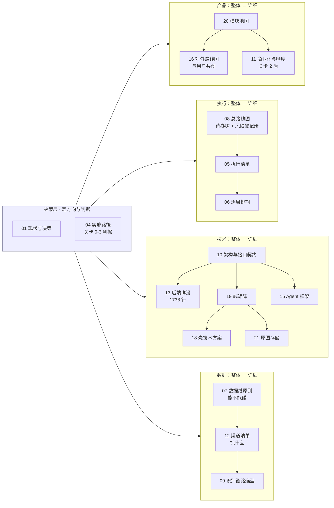

[← CLAUDE.md](../CLAUDE.md)

# 文档索引

> **这份文件回答「先读哪份、读到多深」。** 每份文档属于哪条管线、服务哪个关卡、什么时候算过期，
> 唯一真源是 [`00-文档规范与目录.md`](00-文档规范与目录.md) §二 —— **本文不复述那张表**，只给阅读路径与分层。
>
> 分工写死：`00` 管**文档的属性与规则**（管线 / 关卡 / 状态 / 过期 / 编号台账 / 红线），
> 本文管**文档的读法**（先后 / 主次 / 深浅 / 产品还是技术）。两边都要改的场景只有一个：新增或移动一份文档。

---

## 一、按你要干什么，只读一条路线

**没有一条路线要求读完全部 22 份。** 全读一遍是 15,000 行，等于什么都没读。

| 你要干什么 | 路线 | 行数 |
|---|---|---|
| **搞懂这是什么** | [`01` 现状与决策](01-项目现状与决策记录.md) → [`20` 产品模块地图](20-产品模块地图与产品逻辑.md) → [`04` 实施路径](04-实施路径.md) | ~780 |
| **判关卡 / 排期 / 看进度** | [`04`](04-实施路径.md) → [`05` 执行清单](05-执行清单.md) → [`06` 详细排期](06-阶段0至关卡2详细排期.md) → [`08` 总路线图 + 风险登记册](08-总路线图.md) | ~1,600 |
| **写后端代码** | `CLAUDE.md` 红线表 → [`10` 架构与接口契约](10-技术架构与接口契约.md) → [`13` 后端详设](13-后端系统设计与组件接入.md) | ~2,720 |
| **写客户端 / 壳** | [`19` 端矩阵](19-多端选型与端矩阵.md) → [`18` 壳技术方案](18-壳技术方案：Tauri%202%20包现有%20Web%20工程.md) → [`21` 原图存储](21-原图存储：判据层与存储层.md) | ~1,600 |
| **碰数据 / 抓取** | [`07` 数据线原则](07-数据线：骨架原料的获取与隔离.md) → [`12` 渠道清单](12-基础数据：抓取范围与渠道.md) → [`09` 识别链路选型](09-识别链路选型.md) | ~1,200 |
| **跑交付流程 / 提 PR** | [`17` Multica 操作备忘](17-Multica%20操作备忘.md)（查阅）→ 需要知道为什么才读 [`14` 自动化交付工作流](14-自动化交付工作流.md) | ~220 起 |
| **新增 / 移动 / 改一份文档** | [`00` 文档规范与目录](00-文档规范与目录.md) §六 动作清单 | ~370 |
| **提一个新方向之前** | [`02` 已证伪方向](02-已证伪方向与调研结论.md) → [`03` 思考模式与选择框架](03-思考模式与选择框架.md) | ~350 |

---

## 二、主次：三层，不是二十二份平级

编号 `01`–`21` 是**写作顺序**，不是阅读顺序，也不代表重要性。真正的分层是这三档：

### L0 · 必读（4 份，~1,100 行）

不读这四份，后面每一份都会读歪。

| 文档 | 一句话 | 什么时候必须重读 |
|---|---|---|
| [`01` 项目现状与决策记录](01-项目现状与决策记录.md) | 做的是什么、为什么是这个位置、什么被定死了 | 任何「我们是不是该做 X」的讨论之前 |
| [`04` 实施路径](04-实施路径.md) | 关卡 0–3 的判据与止损线。**判据 pass/fail 由人判，不是可调目标** | 排期、优先级、「下一步做什么」之前 |
| [`20` 产品模块地图与产品逻辑](20-产品模块地图与产品逻辑.md) | 产品由哪些模块组成、每个模块归哪个关卡（Mermaid 脑图） | 讨论功能之前 |
| [`00` 文档规范与目录](00-文档规范与目录.md) | 文档本身的规则：唯一真源、过期判定、编号、🔴 题干字段红线 | 动任何 `.md` 之前 |

### L1 · 主干（按你干哪一行读，~3,900 行）

`05` `06` `07` `08` `09` `10` `12` `16` `19` —— 见 §一 的路线表，不要顺号读。

### L2 · 详设与查阅（只在真要动那一块时打开，~4,900 行）

`11` `13` `14` `15` `17` `18` `21` —— 其中 [`13`](13-后端系统设计与组件接入.md) 单份 1,738 行，是全仓最大的一份，
**它是 `10` 的下一层**，不要当入门读物。

**反面材料**（`02` `03`）不属于任何一档，它们在你**要提新方向或做判断时**读，平时不读。

---

## 三、整体 → 详细：下钻链

**每条链左边是「定什么」，右边是「长什么样」。左边没定的，右边不该有。**

**跨在所有链之上的两份**：[`14`](14-自动化交付工作流.md)（交付流水线的**为什么**）与 [`17`](17-Multica%20操作备忘.md)（同一件事的**怎么操作**）。要动手查 `17`，要改流程才读 `14`。

---

## 四、产品 / 技术：分开看

同一个编号段里混着两类文档，是「产品技术混乱」的直接来源。按读者分：

| | 产品侧 · 定「做什么、给谁、值不值」 | 技术侧 · 定「怎么建、长什么样」 |
|---|---|---|
| **整体** | [`01`](01-项目现状与决策记录.md) 现状与决策 · [`20`](20-产品模块地图与产品逻辑.md) 模块地图 | [`10`](10-技术架构与接口契约.md) 架构与接口契约 |
| **展开** | [`16`](16-产品路线图与用户共创.md) 对外路线图 · [`11`](11-商业化与额度设计.md) 商业化与额度 | [`13`](13-后端系统设计与组件接入.md) 后端详设 · [`19`](19-多端选型与端矩阵.md) 端矩阵 · [`15`](15-Agent框架与能力边界.md) Agent 框架 |
| **专项** | — | [`18`](18-壳技术方案：Tauri%202%20包现有%20Web%20工程.md) 壳 · [`21`](21-原图存储：判据层与存储层.md) 原图存储 · [`09`](09-识别链路选型.md) 识别选型 |
| **两侧都要读** | [`04`](04-实施路径.md) 关卡判据 · [`05`](05-执行清单.md) 清单 · [`06`](06-阶段0至关卡2详细排期.md) 排期 · [`08`](08-总路线图.md) 待办树与风险 · [`07`](07-数据线：骨架原料的获取与隔离.md) 数据线 · [`12`](12-基础数据：抓取范围与渠道.md) 渠道 | ← 同左 |
| **元文档 / 工程基建** | [`00`](00-文档规范与目录.md) 文档规范 · 本文 · [`14`](14-自动化交付工作流.md) · [`17`](17-Multica%20操作备忘.md) | ← 同左 |
| **反面材料** | [`02`](02-已证伪方向与调研结论.md) 已证伪方向 · [`03`](03-思考模式与选择框架.md) 思考框架 | ← 同左 |

---

## 五、先后：按关卡排，不按编号排

关卡由人判，pass/fail。**当前停在关卡 0，它没过之前，右边几列的文档读了也不产生进度。**

| 关卡 | 状态 | 服务它的文档 |
|---|---|---|
| **关卡 0** 采集摩擦自检 | **当前 · 未过** | [`04`](04-实施路径.md) §关卡0 · [`05`](05-执行清单.md) P0 · [`06`](06-阶段0至关卡2详细排期.md) §三 |
| 关卡 1 骨架与单人闭环 | 未开始 | [`05`](05-执行清单.md) P1 · [`06`](06-阶段0至关卡2详细排期.md) §四 · [`10`](10-技术架构与接口契约.md) · [`13`](13-后端系统设计与组件接入.md) |
| 关卡 2 第一批外部用户 | 未开始 | [`05`](05-执行清单.md) P2 · [`06`](06-阶段0至关卡2详细排期.md) §五 · [`16`](16-产品路线图与用户共创.md) |
| 关卡 2 之后 | 冻结待触发 | [`11`](11-商业化与额度设计.md) |
| 关卡 3 分发验证 | 未开始 | [`05`](05-执行清单.md) P3 |
| **不服务任何关卡** | — | `02` `03` `07` `09` `12` `14` `15` `17` `18` `19` `21`（+ `00` `20` 本文 = 元文档） |

> **关卡 0 的全部输入是两个每日数字**（`05` `P0-6` / `08` `1.1.4`）。最后一列那 11 份文档写得再好，
> 这两个数不动一格。这句不是删除许可 —— 砍不砍是人的裁定；写在这里只是让它可数。
> 出处：[`03`](03-思考模式与选择框架.md) §盲区二、[`08`](08-总路线图.md) §六。

---

## 六、全量清单与属性

**不在本文。** 每份文档的管线归属、服务关卡、层、状态、过期判定依据、编号台账、待裁定项、
待执行项（E1–E4），全部在 [`00-文档规范与目录.md`](00-文档规范与目录.md) §二。

新增或移动文档：走 [`00` §六](00-文档规范与目录.md) 的动作清单，**同一次改动里 `00` §二 与本文 §二/§四 都要更新**，
漏一边就是「同一件事有多处说法」的下一个实例。

其他目录：`research/`（HTML 调研原件，非文档，不进索引）。
