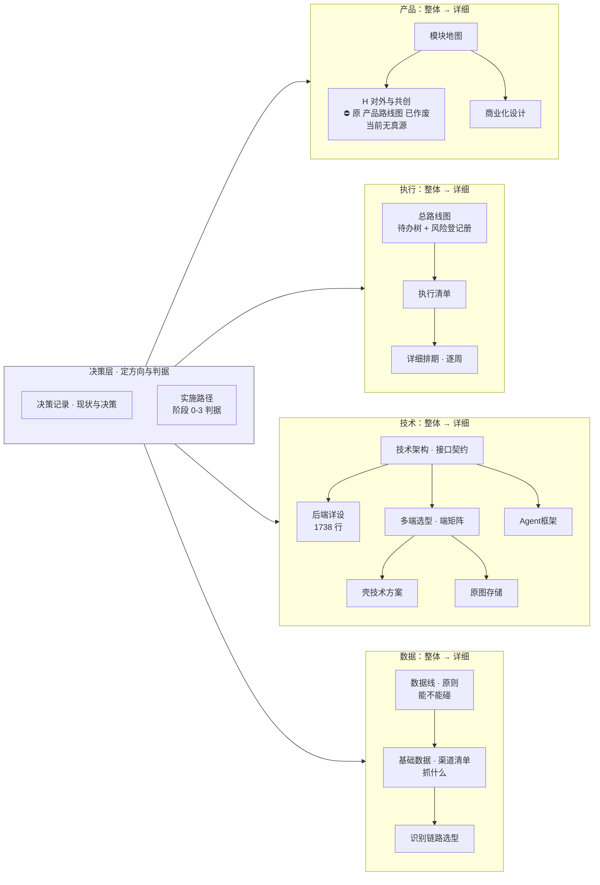

[← CLAUDE.md](../CLAUDE.md)

# 文档索引

> **这份文件回答「先读哪份、读到多深」。** 每份文档属于哪条管线、什么时候算过期，
> 唯一真源是 [`文档规范与目录`](文档规范与目录.md) §二 —— **本文不复述那张表**，只给阅读路径与分层。
>
> 分工写死：`文档规范与目录` 管**文档的属性与规则**（管线 / 状态 / 过期 / 红线），
> 本文管**文档的读法**（先后 / 主次 / 深浅 / 产品还是技术）。两边都要改的场景只有一个：新增或移动一份文档。
>
> **2026-08-31：`docs/` 按方案 B 分了目录**（裁定人 chenyj）。目录树见 §零，规则在
> [`文档规范与目录`](文档规范与目录.md)。**目录只是收纳，不是身份** —— 跨文档引用一律写文档标题 + 链接（`` 见 [`后端系统设计与组件接入`](technical/后端系统设计与组件接入.md) §6.9 ``），不另起简称。
>
> **2026-08-31 同日第二批（裁定人 chenyj）**：文件名去掉空格与全角冒号；新开 `misc/` 杂项目录、`Agent 框架与能力边界` 移入；
> **`产品路线图与用户共创` 已作废**，退出全部阅读路线（`文档规范与目录` §2.4-④）。**H 这一组现在没有展开文档，也没有别的文档接手。**
>
> 🔴 **2026-08-31 同日第三批（裁定人 chenyj）：文件名不再带编号，每个子目录的主文档叫 `INDEX.md`。**
> 规则与理由在 [`文档规范与目录`](文档规范与目录.md)，旧号 → 现在的文件对照表在 §2.3。
> **本文 §零 那棵树因此变了形状：读一个目录，先读它的 `INDEX.md`，那就是这条线的主文档。**

---

## 零、物理目录：七个子目录 + 两份留在根

**每个子目录的第一份是它的 `INDEX.md`，那就是这条线的主文档；其余是细节。**

```
docs/
├── INDEX.md                          入口 · 读法（本文）
├── 文档规范与目录.md                    台账 · 属性与规则
├── decisions/                        决策层 —— 三条管线的共同上游
│   ├── INDEX.md                        项目现状与决策记录
│   ├── 实施路径.md                       阶段 0-3 的判据
│   ├── 已证伪方向与调研结论.md
│   └── 思考模式与选择框架.md
├── execution/                        做什么、什么时候做、风险登记册
│   ├── INDEX.md                        总路线图 · 待办树 + 风险登记册
│   ├── 执行清单.md
│   └── 阶段0至阶段2详细排期.md
├── product/                          产品线 · 模块地图与展开
│   ├── INDEX.md                        产品总纲 · L0
│   ├── 产品模块脑图.md                    markmap 格式，可折叠
│   ├── 商业化与额度设计.md
│   ├── modules/                        模块 A–G 各一份 —— 「为什么这么设计」（本层不设 INDEX，清单在上一层 §三/§九）
│   └── specs/                          用户侧功能规格 —— 「屏幕长什么样、点下去发生什么」
│       ├── INDEX.md                      总纲：屏幕地图 + 全局交互约定 + 错误码映射
│       ├── 登录与账号.md · 记一次学习.md · 看盲区.md
│       ├── 打标与未分类.md · 导出与问AI.md
│       └── 额度与购买.md · 设置与原图.md
├── technical/                        技术契约与详设
│   ├── INDEX.md                        技术架构与接口契约
│   ├── 后端系统设计与组件接入.md
│   ├── 壳技术方案-Tauri2包现有Web工程.md
│   ├── 多端选型与端矩阵.md
│   └── 原图存储-判据层与存储层.md
├── data/                             数据线 · 抓什么 / 不抓什么 / 怎么隔离
│   ├── INDEX.md                        数据线：骨架原料的获取与隔离
│   ├── 骨架数据采集流水线.md               ← 纯后端线，没有任何用户界面
│   ├── 识别链路选型.md
│   └── 基础数据-抓取范围与渠道.md
├── ops/                              交付流水线与操作备忘
│   ├── INDEX.md                        自动化交付工作流（为什么）
│   └── Multica操作备忘.md                （怎么操作）
├── misc/                             杂项 —— 六条读者判据都套不上的，加上作废不删的
│   ├── Agent框架与能力边界.md
│   └── 产品路线图与用户共创-已作废.md      ⛔ 已作废，不得据此动手
└── research/                         外部调研原件（2026-08-31 起是 .md，此前是 HTML）
    ├── 2026-08-30-九端跨平台选型手册.md
    ├── 2026-08-30-小程序与H5多端框架现状.md
    └── 2026-09-01-移动应用开发者账号申请与上架合规手册.md
```

### `research/`：是原件，不是本项目的文档

它记录的是**外部世界在某一天是什么样**，不记录本项目的任何结论。所以它
**不进 [`文档规范与目录`](文档规范与目录.md) §2.1 台账、不进任何阅读路线、不进份数与行数口径**
（计数命令一直带着 `-not -path '*/research/*'`）。要看端与栈的结论读 [`多端选型与端矩阵`](technical/多端选型与端矩阵.md)，不要读这里。

| 原件 | as-of | 它是谁的输入 |
|---|---|---|
| [九端跨平台选型手册](research/2026-08-30-九端跨平台选型手册.md) | 2026-08-30 | `多端选型与端矩阵` |
| [小程序与H5多端框架现状](research/2026-08-30-小程序与H5多端框架现状.md) | 2026-08-30 | `多端选型与端矩阵` · `壳技术方案：Tauri 2 包现有 Web 工程` |
| [移动应用开发者账号申请与上架合规手册](research/2026-09-01-移动应用开发者账号申请与上架合规手册.md) | 2026-09-01 | 合规线（`KUBI-30` 轨下 `2.1.x` 各议题）· `多端选型与端矩阵`（各端上架前置） |

⚠️ **上面这张表不是导航，是可达性。** `audit_docs.py` 要求 `docs/` 下每一份 `.md` 都能从某个索引到达 ——
**转成 `.md` 的那一刻它们就落进了这条规则**，不挂就是孤儿。
「`research/` 不进索引」这句话从此只对**阅读路线**成立，对**可达性**不成立。
**换格式会改变一份文件受哪些规则管** —— 这是这次转换唯一称得上发现的东西。

**文件名用 `YYYY-MM-DD-<简述>.md`**（`doc-management` skill 原则 6）：原件的 as-of 日期是它最重要的属性 ——
这个赛道的版本号三个月就全部作废，日期摆在文件名最前面，过期与否不用打开就知道，而且字母序＝时间序。

⚠️ **`misc/` 没有 `INDEX.md`，而且不该有** —— 它按定义没有主文档。
`product/modules/` 有：[`模块地图`](product/modules/INDEX.md) 是它的主文档，九个域目录下各还有一份域索引。
**子目录不自动配 `INDEX.md`，只有主文档存在时才配。**

⛔ **`misc/` 不是待办清单，也不是垃圾桶。** 进它要过两道闸（`文档规范与目录` §3.2）：进得来必须在 `文档规范与目录` §2.4 或 §2.3 有登记；
里面的**活跃**文档不是永久居民，读者判据一清楚就搬回去。**当前只有两份：`Agent 框架与能力边界`（活跃，归属产品线）与 `产品路线图与用户共创`（已作废）。**

**两份留在 `docs/` 根**：本文是入口，`文档规范与目录` 是台账 —— 它们描述这棵树，不属于树上任何一枝。

⚠️ **子目录是按「读者」分的，不是按管线分的。** 一份文档属于哪条管线（产品线 / 合规线 / 数据线 / 决策层），
唯一真源仍是 [`文档规范与目录`](文档规范与目录.md) 那张表 —— 目录第一级只能承载一个维度，
放的是「谁来读」。两处不重叠：目录不写管线，`文档规范与目录` 不写路径。

---

## 一、按你要干什么，只读一条路线

**没有一条路线要求读完全部 30 份。** 全读一遍是 11,796 行（`find docs -name '*.md' -not -path '*/research/*' | xargs wc -l` 减去作废的 `产品路线图与用户共创`），等于什么都没读。
**这里数的是活跃文档**；磁盘上是 31 个文件 / 12,015 行（另有 `research/` 两份原件 1,047 行，不进这个口径），多出来的那一份是作废但按 `文档规范与目录` §4.3 不删的 `产品路线图与用户共创`。份数与行数的唯一真源仍在 [`文档规范与目录`](文档规范与目录.md)。

| 你要干什么 | 路线 | 行数 |
|---|---|---|
| **搞懂这是什么** | 🔴 [`产品总纲`](product/INDEX.md)（先读这份，五句话说清产品是什么）→ [`用户价值与主流程`](product/用户价值与主流程.md) → [`项目现状与决策记录`](decisions/INDEX.md) → [`实施路径`](decisions/实施路径.md) | ~1,100 |
| **搞懂某个模块怎么运转** | [`模块地图`](product/modules/INDEX.md) §三 找到那个能力单元 → 它所在域的索引 → 该单元文档。跨模块的不变量与状态名在 `模块地图` §四 §五 | ~185/份 |
| **判阶段 / 排期 / 看进度** | [`实施路径`](decisions/实施路径.md) → [`执行清单`](execution/执行清单.md) → [`阶段 0 至阶段 2 · 详细排期`](execution/阶段0至阶段2详细排期.md) → [`总路线图 · 脑图与父子待办`](execution/INDEX.md)（待办树 + 风险登记册） | ~1,600 |
| **做 UI 设计 / 写前端** | [`用户侧功能规格 · 总纲`](product/specs/INDEX.md) §一 屏幕地图 + §二 全局约定 → 对应那一份逐屏规格 | ~230 + 一份 |
| **做骨架数据 / 抓取流水线** | [`数据线 · 骨架原料的获取与隔离`](data/INDEX.md) → [`骨架数据采集流水线`](data/骨架数据采集流水线.md) | ~340 |
| **写后端代码** | `CLAUDE.md` 红线表 → [`技术架构与接口契约`](technical/INDEX.md) → [`后端系统设计与组件接入`](technical/后端系统设计与组件接入.md) | ~2,720 |
| **写客户端 / 壳** | [`多端选型与端矩阵`](technical/多端选型与端矩阵.md) → [`壳技术方案：Tauri 2 包现有 Web 工程`](technical/壳技术方案-Tauri2包现有Web工程.md) → [`原图存储：判据层与存储层`](technical/原图存储-判据层与存储层.md) | ~1,600 |
| **碰数据 / 抓取** | [`数据线 · 骨架原料的获取与隔离`](data/INDEX.md) → [`基础数据 · 抓取范围与渠道`](data/基础数据-抓取范围与渠道.md) → [`识别链路选型 · ASR 与图像识别`](data/识别链路选型.md) | ~1,200 |
| **跑交付流程 / 提 PR** | [`Multica 操作备忘`](ops/Multica操作备忘.md)（查阅）→ 需要知道为什么才读 [`自动化交付工作流 · 基于 Multica`](ops/INDEX.md) | ~220 起 |
| **新增 / 移动 / 改一份文档** | [`文档规范与目录`](文档规范与目录.md) §六 动作清单 | ~370 |
| **提一个新方向之前** | [`已证伪方向与调研结论`](decisions/已证伪方向与调研结论.md) → [`思考模式与选择框架`](decisions/思考模式与选择框架.md) | ~350 |

---

## 二、主次：三层，不是三十一份平级

**文档不再有编号**（2026-08-31 裁定，`文档规范与目录` §3.1）。目录是收纳，标题是身份，两者都不代表重要性。
真正的分层是这三档：

### L0 · 必读（4 格 / 5 份，~1,660 行）

`产品总纲` 是唯一的入口：它用五句白话说清这个产品是什么、给用户什么。不读这几份，后面每一份都会读歪。

| 文档 | 一句话 | 什么时候必须重读 |
|---|---|---|
| [`项目现状与决策记录`](decisions/INDEX.md) | 做的是什么、为什么是这个位置、什么被定死了 | 任何「我们是不是该做 X」的讨论之前 |
| [`实施路径`](decisions/实施路径.md) | 阶段 0–3 的判据与止损线。**判据 pass/fail 由人判，不是可调目标** | 排期、优先级、「下一步做什么」之前 |
| 🔴 [`产品总纲`](product/INDEX.md) | **这个产品是什么、给谁、他为什么要用** —— 五句白话，加边界五句。整套文档的唯一入口 | 讨论任何功能之前 |
| [`用户价值与主流程`](product/用户价值与主流程.md) | 用户是谁、卡在哪、从头到尾怎么走（旅程 `J0`–`J6`）。**一个模块填不出节点号就不该有文档** | 判断一个功能该不该做之前 |
| [`文档规范与目录`](文档规范与目录.md) | 文档本身的规则：唯一真源、过期判定、命名规则、🔴 题干字段红线 | 动任何 `.md` 之前 |

### L1 · 主干（15 份，~5,501 行；按你干哪一行读）

`执行清单` `阶段 0 至阶段 2 · 详细排期` `数据线 · 骨架原料的获取与隔离` `总路线图 · 脑图与父子待办` `识别链路选型 · ASR 与图像识别` `技术架构与接口契约` `基础数据 · 抓取范围与渠道` `多端选型与端矩阵`（8 份，~4,190 行）—— 见 §一 的路线表，不要按目录顺序读。
⛔ **`产品路线图与用户共创` 2026-08-31 起不在这一档，也不在任何一档** —— 它已作废（`文档规范与目录` §2.4-④）。

**模块层的能力单元文档**（`M0`–`M8` 九个域、51 份，各 80–250 行）也在这一档：
**按模块读，不按目录顺序读** —— 你在改哪个模块就只读那一份，每份都自带「状态 + 转移条件 + 失败落点 + 交互示意 + 边界」。

### L2 · 详设与查阅（7 份，~4,031 行；只在真要动那一块时打开）

`商业化与额度设计` `后端系统设计与组件接入` `自动化交付工作流 · 基于 Multica` `Agent 框架与能力边界` `Multica 操作备忘` `壳技术方案：Tauri 2 包现有 Web 工程` `原图存储：判据层与存储层` —— 其中 [`后端系统设计与组件接入`](technical/后端系统设计与组件接入.md) 单份 1,738 行，是全仓最大的一份，
**它是 `技术架构与接口契约` 的下一层**，不要当入门读物。

**反面材料**（`已证伪方向与调研结论` `思考模式与选择框架`，~350 行）不属于任何一档，它们在你**要提新方向或做判断时**读，平时不读。

> 三档 + 反面材料 + 本文 = **30 份活跃 / 11,796 行**（1,660 + 5,501 + 4,031 + 349 + 255），与 §一 的总数对得上。**这些行数在增删文档时同一次改动内重算**
> （`find docs -name '*.md' -not -path '*/research/*' | xargs wc -l`）
>
> ⚠️ **2026-08-31 作废 `产品路线图与用户共创` 时，L1 从 16 份变 15 份 —— 这是「重算」第一次因为减而不是因为加触发。**
> 作废一份文档和新增一份一样要改这里，漏改的后果也一样：三档加起来对不上 §一 的总数。

---

## 三、整体 → 详细：下钻链

**每条链左边是「定什么」，右边是「长什么样」。左边没定的，右边不该有。**



**跨在所有链之上的两份**：[`自动化交付工作流 · 基于 Multica`](ops/INDEX.md)（交付流水线的**为什么**）与 [`Multica 操作备忘`](ops/Multica操作备忘.md)（同一件事的**怎么操作**）。要动手查 `Multica 操作备忘`，要改流程才读 `自动化交付工作流 · 基于 Multica`。

---

## 四、产品 / 技术：分开看

同一个编号段里混着两类文档，是「产品技术混乱」的直接来源。按读者分：

| | 产品侧 · 定「做什么、给谁、值不值」 | 技术侧 · 定「怎么建、长什么样」 |
|---|---|---|
| **整体** | [`项目现状与决策记录`](decisions/INDEX.md) 现状与决策 · [`产品总纲`](product/INDEX.md) 模块地图 · [`产品模块脑图`](product/产品模块脑图.md) 脑图 | [`技术架构与接口契约`](technical/INDEX.md) 架构与接口契约 |
| **展开** | [`用户侧功能规格`](product/specs/INDEX.md) 七份逐屏规格 · [`模块地图`](product/modules/INDEX.md) 的九个域 模块 A–G 展开 · [`商业化与额度设计`](product/商业化与额度设计.md) 商业化与额度 · ⛔ **H 组无展开文档**（原 [`产品路线图与用户共创`](misc/产品路线图与用户共创-已作废.md) 已作废） | [`后端系统设计与组件接入`](technical/后端系统设计与组件接入.md) 后端详设 · [`多端选型与端矩阵`](technical/多端选型与端矩阵.md) 端矩阵 · [`Agent 框架与能力边界`](misc/Agent框架与能力边界.md) Agent 框架（收纳在 `misc/`） |
| **专项** | — | [`壳技术方案：Tauri 2 包现有 Web 工程`](technical/壳技术方案-Tauri2包现有Web工程.md) 壳 · [`原图存储：判据层与存储层`](technical/原图存储-判据层与存储层.md) 原图存储 · [`识别链路选型 · ASR 与图像识别`](data/识别链路选型.md) 识别选型 |
| **两侧都要读** | [`实施路径`](decisions/实施路径.md) 阶段验收判据 · [`执行清单`](execution/执行清单.md) 清单 · [`阶段 0 至阶段 2 · 详细排期`](execution/阶段0至阶段2详细排期.md) 排期 · [`总路线图 · 脑图与父子待办`](execution/INDEX.md) 待办树与风险 · [`数据线 · 骨架原料的获取与隔离`](data/INDEX.md) 数据线 · [`基础数据 · 抓取范围与渠道`](data/基础数据-抓取范围与渠道.md) 渠道 | ← 同左 |
| **元文档 / 工程基建** | [`文档规范与目录`](文档规范与目录.md) 文档规范 · 本文 · [`自动化交付工作流 · 基于 Multica`](ops/INDEX.md) · [`Multica 操作备忘`](ops/Multica操作备忘.md) | ← 同左 |
| **反面材料** | [`已证伪方向与调研结论`](decisions/已证伪方向与调研结论.md) 已证伪方向 · [`思考模式与选择框架`](decisions/思考模式与选择框架.md) 思考框架 | ← 同左 |

---

## 五、全量清单与属性

**不在本文。** 每份文档的管线归属、层、状态、过期判定依据、旧编号对照、
待裁定项、待执行项（`E1`–`E7`），全部在 [`文档规范与目录`](文档规范与目录.md) §二。
**2026-08-31 起 `文档规范与目录` §2.4 待裁定与 §2.6 待执行都已清空，只剩 `E6`（文档侧红线扫描）一条开着。**

新增或移动文档：走 [`文档规范与目录`](文档规范与目录.md) 的动作清单，**同一次改动里 `文档规范与目录` §二 与本文 §二/§四 都要更新**，
漏一边就是「同一件事有多处说法」的下一个实例。

**能力单元文档的特例**：它们只在 `模块地图` §三 与各域索引 §四 里被挂载，**不另建第二张清单**。
新增一份能力单元文档要改三处：`文档规范与目录` §2.1 加行、`模块地图` §三 与所属域索引 §四 加指针、本文 §零/§一/§二/§四/§五（全量清单）。**文件落在 `product/modules/M<n>-<域名>/`，域索引与 `modules/INDEX.md` 都是 `INDEX.md`。**
**作废一份也一样要走这三处** —— 动作清单在 [`文档规范与目录`](文档规范与目录.md)。

**新文档放哪个子目录**：规则在 [`文档规范与目录`](文档规范与目录.md)，判据是「谁来读」，不是「属于哪条管线」。

其他目录：`misc/`（杂项，两道闸见 `文档规范与目录` §3.2）· `research/`（外部调研原件，非本项目文档，不进阅读路线；规则与两份原件的链接见 §零）。
