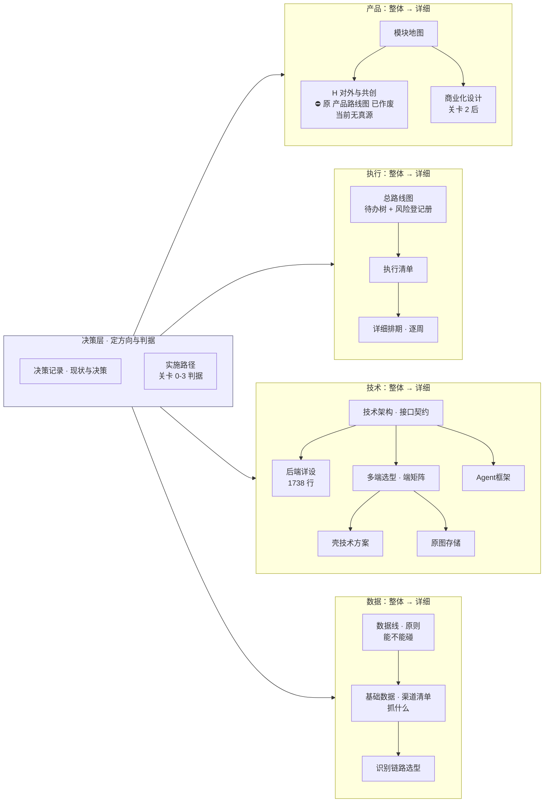

[← CLAUDE.md](../CLAUDE.md)

# 文档索引

> **这份文件回答「先读哪份、读到多深」。** 每份文档属于哪条管线、服务哪个关卡、什么时候算过期，
> 唯一真源是 [`文档规范`](文档规范与目录.md) §二 —— **本文不复述那张表**，只给阅读路径与分层。
>
> 分工写死：`文档规范` 管**文档的属性与规则**（管线 / 关卡 / 状态 / 过期 / 简称台账 / 红线），
> 本文管**文档的读法**（先后 / 主次 / 深浅 / 产品还是技术）。两边都要改的场景只有一个：新增或移动一份文档。
>
> **2026-08-31：`docs/` 按方案 B 分了目录**（裁定人 chenyj）。目录树见 §零，规则在
> [`文档规范` §3.2](文档规范与目录.md)。**目录只是收纳，不是身份** —— 跨文档引用一律写简称（`` 见 `后端详设` §6.9 ``），不写路径。
>
> **2026-08-31 同日第二批（裁定人 chenyj）**：文件名去掉空格与全角冒号；新开 `misc/` 杂项目录、`Agent框架` 移入；
> **`产品路线图` 已作废**，退出全部阅读路线（`文档规范` §2.4-④）。**H 这一组现在没有展开文档，也没有别的文档接手。**
>
> 🔴 **2026-08-31 同日第三批（裁定人 chenyj）：文件名不再带编号，每个子目录的主文档叫 `INDEX.md`。**
> 规则与理由在 [`文档规范` §3.2.1](文档规范与目录.md)，旧号 → 简称对照表在 §2.3。
> **本文 §零 那棵树因此变了形状：读一个目录，先读它的 `INDEX.md`，那就是这条线的主文档。**

---

## 零、物理目录：七个子目录 + 两份留在根

**每个子目录的第一份是它的 `INDEX.md`，那就是这条线的主文档；其余是细节。**

```
docs/
├── INDEX.md                          入口 · 读法（本文）
├── 文档规范与目录.md                    台账 · 属性与规则
├── decisions/                        决策层 —— 三条管线的共同上游
│   ├── INDEX.md                        项目现状与决策记录
│   ├── 实施路径.md                       关卡 0-3 的判据
│   ├── 已证伪方向与调研结论.md
│   └── 思考模式与选择框架.md
├── execution/                        做什么、什么时候做、风险登记册
│   ├── INDEX.md                        总路线图 · 待办树 + 风险登记册
│   ├── 执行清单.md
│   └── 阶段0至关卡2详细排期.md
├── product/                          产品线 · 模块地图与展开
│   ├── INDEX.md                        产品模块地图与产品逻辑
│   ├── 产品模块脑图.md                    markmap 格式，可折叠
│   ├── 商业化与额度设计.md
│   └── modules/                        模块 A–G 各一份（本层不设 INDEX，清单在上一层 §三/§九）
├── technical/                        技术契约与详设
│   ├── INDEX.md                        技术架构与接口契约
│   ├── 后端系统设计与组件接入.md
│   ├── 壳技术方案-Tauri2包现有Web工程.md
│   ├── 多端选型与端矩阵.md
│   └── 原图存储-判据层与存储层.md
├── data/                             数据线 · 抓什么 / 不抓什么 / 怎么隔离
│   ├── INDEX.md                        数据线：骨架原料的获取与隔离
│   ├── 识别链路选型.md
│   └── 基础数据-抓取范围与渠道.md
├── ops/                              交付流水线与操作备忘
│   ├── INDEX.md                        自动化交付工作流（为什么）
│   └── Multica操作备忘.md                （怎么操作）
├── misc/                             杂项 —— 六条读者判据都套不上的，加上作废不删的
│   ├── Agent框架与能力边界.md
│   └── 产品路线图与用户共创-已作废.md      ⛔ 已作废，不得据此动手
└── research/                         HTML 调研原件，不进索引
```

⚠️ **`misc/` 与 `product/modules/` 都没有 `INDEX.md`，而且不该有。**
`misc/` 按定义没有主文档；`modules/` 的唯一清单在 [`模块地图`](product/INDEX.md) §三/§九，
在这一层再放一份就是第二处说法（`文档规范` §3.1）。**子目录不自动配 `INDEX.md`，只有主文档存在时才配。**

⛔ **`misc/` 不是待办清单，也不是垃圾桶。** 进它要过两道闸（`文档规范` §3.2）：进得来必须在 `文档规范` §2.4 或 §2.3 有登记；
里面的**活跃**文档不是永久居民，读者判据一清楚就搬回去。**当前只有两份：`Agent框架`（活跃，归属产品线）与 `产品路线图`（已作废）。**

**两份留在 `docs/` 根**：本文是入口，`文档规范` 是台账 —— 它们描述这棵树，不属于树上任何一枝。

⚠️ **子目录是按「读者」分的，不是按管线分的。** 一份文档属于哪条管线（产品线 / 合规线 / 数据线 / 决策层），
唯一真源仍是 [`文档规范` §2.1](文档规范与目录.md) 那张表 —— 目录第一级只能承载一个维度，
放的是「谁来读」。两处不重叠：目录不写管线，`文档规范` 不写路径。

---

## 一、按你要干什么，只读一条路线

**没有一条路线要求读完全部 30 份。** 全读一遍是 ~11,750 行（`find docs -name '*.md' -not -path '*/research/*' | xargs wc -l` 减去作废的 `产品路线图`），等于什么都没读。
**这里数的是活跃文档**；磁盘上是 31 个文件 / 11,969 行，多出来的那一份是作废但按 `文档规范` §4.3 不删的 `产品路线图`。份数与行数的唯一真源仍在 [`文档规范` §2.5](文档规范与目录.md)。

| 你要干什么 | 路线 | 行数 |
|---|---|---|
| **搞懂这是什么** | [`决策记录`](decisions/INDEX.md) → [`产品脑图`](product/产品模块脑图.md) → [`模块地图`](product/INDEX.md) → [`实施路径`](decisions/实施路径.md) | ~940 |
| **搞懂某个模块怎么运转** | [`产品脑图`](product/产品模块脑图.md) 找到它挂在哪一组 → 该组的展开文档 [`模块A`](product/modules/模块A-骨架层.md)–[`模块G`](product/modules/模块G-商业化.md)（A–G 各一份）。**H 组当前没有展开文档**（原来那份 `产品路线图` 已作废），**X 不单独成文** —— 逐组落点见 `模块地图` §九 | ~185/份 |
| **判关卡 / 排期 / 看进度** | [`实施路径`](decisions/实施路径.md) → [`执行清单`](execution/执行清单.md) → [`详细排期`](execution/阶段0至关卡2详细排期.md) → [`总路线图`](execution/INDEX.md)（待办树 + 风险登记册） | ~1,600 |
| **写后端代码** | `CLAUDE.md` 红线表 → [`技术架构`](technical/INDEX.md) → [`后端详设`](technical/后端系统设计与组件接入.md) | ~2,720 |
| **写客户端 / 壳** | [`多端选型`](technical/多端选型与端矩阵.md) → [`壳技术方案`](technical/壳技术方案-Tauri2包现有Web工程.md) → [`原图存储`](technical/原图存储-判据层与存储层.md) | ~1,600 |
| **碰数据 / 抓取** | [`数据线`](data/INDEX.md) → [`基础数据`](data/基础数据-抓取范围与渠道.md) → [`识别链路`](data/识别链路选型.md) | ~1,200 |
| **跑交付流程 / 提 PR** | [`Multica备忘`](ops/Multica操作备忘.md)（查阅）→ 需要知道为什么才读 [`交付工作流`](ops/INDEX.md) | ~220 起 |
| **新增 / 移动 / 改一份文档** | [`文档规范`](文档规范与目录.md) §六 动作清单 | ~370 |
| **提一个新方向之前** | [`已证伪方向`](decisions/已证伪方向与调研结论.md) → [`思考模式`](decisions/思考模式与选择框架.md) | ~350 |

---

## 二、主次：三层，不是三十一份平级

**文档不再有编号**（2026-08-31 裁定，`文档规范` §3.1）。目录是收纳，简称是身份，两者都不代表重要性。
真正的分层是这三档：

### L0 · 必读（4 格 / 5 份，~1,640 行）

`模块地图` 与 `产品脑图` 是同一格（地图 + 脑图）。不读这几份，后面每一份都会读歪。

| 文档 | 一句话 | 什么时候必须重读 |
|---|---|---|
| [`决策记录`](decisions/INDEX.md) 项目现状与决策记录 | 做的是什么、为什么是这个位置、什么被定死了 | 任何「我们是不是该做 X」的讨论之前 |
| [`实施路径`](decisions/实施路径.md) | 关卡 0–3 的判据与止损线。**判据 pass/fail 由人判，不是可调目标** | 排期、优先级、「下一步做什么」之前 |
| [`模块地图`](product/INDEX.md) 产品模块地图与产品逻辑 + [`产品脑图`](product/产品模块脑图.md) | 产品由哪些模块组成、每个模块归哪个关卡。脑图在 `产品脑图`（markmap 格式，可折叠；不装工具打开是可读大纲） | 讨论功能之前 |
| [`文档规范`](文档规范与目录.md) | 文档本身的规则：唯一真源、过期判定、简称与命名、🔴 题干字段红线 | 动任何 `.md` 之前 |

### L1 · 主干（15 份，~5,500 行；按你干哪一行读）

`执行清单` `详细排期` `数据线` `总路线图` `识别链路` `技术架构` `基础数据` `多端选型`（8 份，~4,190 行）—— 见 §一 的路线表，不要按目录顺序读。
⛔ **`产品路线图` 2026-08-31 起不在这一档，也不在任何一档** —— 它已作废（`文档规范` §2.4-④）。

**模块展开文档 `模块A`–`模块G`**（A 骨架层 / B 采集层 / C 打标层 / D 差集层 / E 出口层 / F 账号与端 / G 商业化，7 份 ~1,310 行）也在这一档：
**按模块读，不按目录顺序读** —— 你在改哪个模块就只读那一份，每份都自带「状态 + 转移条件 + 失败落点 + 交互示意 + 边界」。
其中 [`模块B`](product/modules/模块B-采集层.md) 是唯一整个服务**关卡 0** 的一份，也就是当前唯一有效的工作面。

### L2 · 详设与查阅（7 份，~4,030 行；只在真要动那一块时打开）

`商业化设计` `后端详设` `交付工作流` `Agent框架` `Multica备忘` `壳技术方案` `原图存储` —— 其中 [`后端详设`](technical/后端系统设计与组件接入.md) 单份 1,738 行，是全仓最大的一份，
**它是 `技术架构` 的下一层**，不要当入门读物。

**反面材料**（`已证伪方向` `思考模式`，~350 行）不属于任何一档，它们在你**要提新方向或做判断时**读，平时不读。

> 三档 + 反面材料 + 本文 = **30 份活跃 / ~11,750 行**（1,640 + 5,500 + 4,030 + 349 + 236），与 §一 的总数对得上。**这些行数在增删文档时同一次改动内重算**
> （`find docs -name '*.md' -not -path '*/research/*' | xargs wc -l`）—— 上一版就是塞进了 `模块A`–`模块E` 却没改 L1 那个数。
>
> ⚠️ **2026-08-31 作废 `产品路线图` 时，L1 从 16 份变 15 份 —— 这是「重算」第一次因为减而不是因为加触发。**
> 作废一份文档和新增一份一样要改这里，漏改的后果也一样：三档加起来对不上 §一 的总数。

---

## 三、整体 → 详细：下钻链

**每条链左边是「定什么」，右边是「长什么样」。左边没定的，右边不该有。**



**跨在所有链之上的两份**：[`交付工作流`](ops/INDEX.md)（交付流水线的**为什么**）与 [`Multica备忘`](ops/Multica操作备忘.md)（同一件事的**怎么操作**）。要动手查 `Multica备忘`，要改流程才读 `交付工作流`。

---

## 四、产品 / 技术：分开看

同一个编号段里混着两类文档，是「产品技术混乱」的直接来源。按读者分：

| | 产品侧 · 定「做什么、给谁、值不值」 | 技术侧 · 定「怎么建、长什么样」 |
|---|---|---|
| **整体** | [`决策记录`](decisions/INDEX.md) 现状与决策 · [`模块地图`](product/INDEX.md) 模块地图 · [`产品脑图`](product/产品模块脑图.md) 脑图 | [`技术架构`](technical/INDEX.md) 架构与接口契约 |
| **展开** | [`模块A`](product/modules/模块A-骨架层.md)–[`模块G`](product/modules/模块G-商业化.md) 模块 A–G 展开 · [`商业化设计`](product/商业化与额度设计.md) 商业化与额度 · ⛔ **H 组无展开文档**（原 [`产品路线图`](misc/产品路线图与用户共创-已作废.md) 已作废） | [`后端详设`](technical/后端系统设计与组件接入.md) 后端详设 · [`多端选型`](technical/多端选型与端矩阵.md) 端矩阵 · [`Agent框架`](misc/Agent框架与能力边界.md) Agent 框架（收纳在 `misc/`） |
| **专项** | — | [`壳技术方案`](technical/壳技术方案-Tauri2包现有Web工程.md) 壳 · [`原图存储`](technical/原图存储-判据层与存储层.md) 原图存储 · [`识别链路`](data/识别链路选型.md) 识别选型 |
| **两侧都要读** | [`实施路径`](decisions/实施路径.md) 关卡判据 · [`执行清单`](execution/执行清单.md) 清单 · [`详细排期`](execution/阶段0至关卡2详细排期.md) 排期 · [`总路线图`](execution/INDEX.md) 待办树与风险 · [`数据线`](data/INDEX.md) 数据线 · [`基础数据`](data/基础数据-抓取范围与渠道.md) 渠道 | ← 同左 |
| **元文档 / 工程基建** | [`文档规范`](文档规范与目录.md) 文档规范 · 本文 · [`交付工作流`](ops/INDEX.md) · [`Multica备忘`](ops/Multica操作备忘.md) | ← 同左 |
| **反面材料** | [`已证伪方向`](decisions/已证伪方向与调研结论.md) 已证伪方向 · [`思考模式`](decisions/思考模式与选择框架.md) 思考框架 | ← 同左 |

---

## 五、先后：按关卡排，不按编号排

关卡由人判，pass/fail。**当前停在关卡 0，它没过之前，右边几列的文档读了也不产生进度。**

| 关卡 | 状态 | 服务它的文档 |
|---|---|---|
| **关卡 0** 采集摩擦自检 | **当前 · 未过** | [`实施路径`](decisions/实施路径.md) §关卡0（判据）· [`总路线图`](execution/INDEX.md) `1.1.4`（**两个每日数字，关卡 0 的全部输入**）· [`执行清单`](execution/执行清单.md) P0 · [`详细排期`](execution/阶段0至关卡2详细排期.md) §三 · [`模块B`](product/modules/模块B-采集层.md) |
| 关卡 1 骨架与单人闭环 | 未开始 | [`执行清单`](execution/执行清单.md) P1 · [`详细排期`](execution/阶段0至关卡2详细排期.md) §四 · [`技术架构`](technical/INDEX.md) · [`后端详设`](technical/后端系统设计与组件接入.md) · [`模块A`](product/modules/模块A-骨架层.md) [`模块C`](product/modules/模块C-打标层.md) [`模块D`](product/modules/模块D-差集层.md) [`模块E`](product/modules/模块E-出口层.md) |
| 关卡 2 第一批外部用户 | 未开始 | [`执行清单`](execution/执行清单.md) P2 · [`详细排期`](execution/阶段0至关卡2详细排期.md) §五 · [`模块F`](product/modules/模块F-账号与端.md)　⛔ 原来还有一份 `产品路线图`，已作废 |
| 关卡 2 之后 | 冻结待触发 | [`商业化设计`](product/商业化与额度设计.md) · [`模块G`](product/modules/模块G-商业化.md) |
| 关卡 3 分发验证 | 未开始 | [`执行清单`](execution/执行清单.md) P3 |
| **不服务任何关卡** | — | `已证伪方向` `思考模式` `数据线` `识别链路` `基础数据` `交付工作流` `Agent框架` `Multica备忘` `壳技术方案` `多端选型` `模块地图` `原图存储` `产品脑图`（另 `文档规范` 与本文两份元文档不进这张表，同样是「无」） |

> **份数与行数唯一收口在 [`文档规范` §2.5](文档规范与目录.md)**，本文只列名单不给第二个数 ——
> 上一版这里数 11 份、`文档规范` 数 12/13 份，同一个概念两处口径打架，正是「同一件事有多处说法」的实例。
>
> **关卡 0 的全部输入是两个每日数字**（`执行清单` `P0-6` / `总路线图` `1.1.4`）。最后一列那些文档写得再好，
> 这两个数不动一格。这句不是删除许可 —— 砍不砍是人的裁定；写在这里只是让它可数。
> 出处：[`思考模式`](decisions/思考模式与选择框架.md) §盲区二、[`总路线图`](execution/INDEX.md) §六。

---

## 六、全量清单与属性

**不在本文。** 每份文档的管线归属、服务关卡、层、状态、过期判定依据、简称台账（含旧编号对照）、
待裁定项、待执行项（`E1`–`E7`），全部在 [`文档规范`](文档规范与目录.md) §二。
**2026-08-31 起 `文档规范` §2.4 待裁定与 §2.6 待执行都已清空，只剩 `E6`（文档侧红线扫描）一条开着。**

新增或移动文档：走 [`文档规范` §六](文档规范与目录.md) 的动作清单，**同一次改动里 `文档规范` §二 与本文 §二/§四 都要更新**，
漏一边就是「同一件事有多处说法」的下一个实例。

**模块展开文档（`模块A`–`模块G`）的特例**：它们只在 `模块地图` §三/§九 与 `产品脑图` 里被挂载，**不另建第二张模块清单**。
新增一份模块文档要改三处：`文档规范` §2.1 加行 + §2.3 登记简称、`模块地图` §三/§九 加指针、本文 §零/§一/§二/§四/§五。**文件落在 `product/modules/`，那一层不设 `INDEX.md`**（清单在 `模块地图`，见 §零）。
**作废一份也一样要走这三处** —— 动作清单在 [`文档规范` §六 第 10 条](文档规范与目录.md)。

**新文档放哪个子目录**：规则在 [`文档规范` §3.2](文档规范与目录.md)，判据是「谁来读」，不是「属于哪条管线」。

其他目录：`misc/`（杂项，两道闸见 `文档规范` §3.2）· `research/`（HTML 调研原件，非文档，不进索引）。
