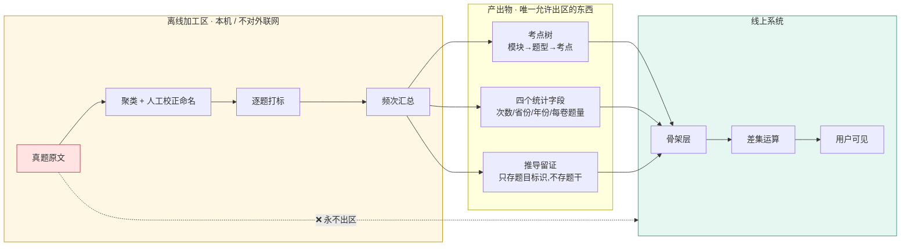

# 数据线 · 骨架原料的获取与隔离

> 第三条线。与产品轨(阶段管辖)、合规轨(审批周期管辖)并列,由**风险边界**管辖。
>
> 目标:积累 公考 / 事业单位 / 考研 / 军队文职 的**考点树与考情统计**。
>
> **核心判断:真题是原料,不是库存。** 网站上不留真题 —— 这不是保守,是这条线能否长期存在的前提。

---

## 一、这条线为什么必须单独立

前两条线的时钟分别是阶段和审批周期。这一条的时钟是**风险边界**:做对了它几乎零成本长期积累,做错了一次就能终结整个项目。

它和产品轨的关系必须先说清楚 —— 见 §六「与只做一个模块的关系」,**那一节比本文其余部分都重要。**

---

## 二、核心原则:加工厂,不是仓库

### 你已经做对过一次

决策记录 §2.3 对图片画的红线是:

> 图片 OCR 抽取文字和考点标签后,**原图只做本地缓存或短期留存,不做长期云端存储和任何形式的共享**。否则产品会成为盗版课件的托管方。

**真题之于骨架层,等同于原图之于行为层。** 完全同构,应当适用完全相同的逻辑:

| | 原料 | 加工 | 产出 | 原料去向 |
|---|---|---|---|---|
| 行为层 | 拍摄的原图 | OCR | 文字 + 考点标签 | 本地短期缓存,到期删 |
| **骨架层** | **真题原文** | **聚类 + 打标 + 频次汇总** | **考点树 + 四个统计字段** | **离线区,不上线** |

### 法律上为什么这个切分成立

| 对象 | 法律性质 | 结论 |
|---|---|---|
| 试卷 / 大批量题目集合 | **汇编作品** —— 判例认定「考卷系大量试题的集合,表现了汇编人独特的选择和编排材料的方法」,汇编人就该结构享有著作权 | 存原文 = 侵权风险 |
| 「某考点近五年出现 23 次」「出现过 14 个省份」 | **事实**。汇编著作权保护的是**选择与编排**,不延伸到底层事实 | 存统计 = 风险低 |
| 自行命名的考点标签 | 自己的表达,前提是**不沿用机构既有体系与措辞**(实施路径 §1.2) | 需留推导过程 |

**这就是产品早已定下的四个统计字段(决策记录 §2.5)在法律上的意义** —— 它们不只是产品选择,还恰好是那条把风险挡在外面的线。

### 三区隔离



**唯一的硬性技术约束:线上数据库里不存在能装下题干的字段。** 和 决策记录 §2.2「不碰内容」一样 —— 连预留位都不要留,留了早晚有人往里写。

### 推导留证怎么做(一个看似矛盾的点)

实施路径 §1.2 要求「留下推导过程记录」以自证考点标签是自行命名的。但留证要引用题目,岂不是又要存真题?

**不用。留证只需要题目标识,不需要题干:**

```
考点「间隔增长率」的推导来源:
  2023-国考-地市级-Q112
  2024-江苏-A类-Q98
  2025-山东-Q105
  ...
```

**能自证推导链,不含任何受保护的表达。** 需要核验时回离线区按标识调原文。

---

## 三、数据源分级(可抓 / 不可抓)

爬虫的刑事红线很清晰:**绕过或突破反爬技术措施、伪造或盗用平台设置的获取措施(实名认证、账号密码登录、内部权限),可能构成《刑法》285 条非法获取计算机信息系统数据罪。**

| 级 | 来源 | 内容 | 判断 |
|---|---|---|---|
| **A** | 各省人事考试网、研招网、军队人才网、事业单位主管部门官网 | 招考公告、考试大纲、题型说明、报考数据 | ✅ **公开政务信息,首选** |
| **B** | 政府/官方发布的考试大纲与说明 | 考查范围、题型结构 | ✅ **考点树的最佳原料** |
| **C** | 第三方免费公开页(无需登录即可访问) | 零散真题、考情分析 | ⚠️ 尊重 robots、严格频控、不得高频 |
| **D** | 机构题库(粉笔 / 中公 / 华图 登录后内容) | 题库、解析、课程 | ❌ **绝对不碰** |
| **E** | 网盘 / 付费资源盗版合集 | 真题打包 | ❌ **绝对不碰** |

### D 级为什么是绝对红线(不是"谨慎"是"不碰")

对**你个人**而言,粉笔是三重红线叠加:

1. **刑事** —— 需登录 = 技术保护措施,绕过即触碰《刑法》285 条
2. **劳动合同** —— 决策记录 §3「不用公司非公开材料、设备、上班时间」
3. **不正当竞争** —— 调研明确:即使抓的是公开数据,**用抓来的竞品数据做不正当竞争仍要担责**

已证伪方向 §二 已经因为「粉笔自己就有职位库,在职期间做这个方向踩穿合规红线」否掉过公考选岗方向。**同一条逻辑,同样适用。**

### 抓取纪律(写进代码,不靠自觉)

- [ ] `D-1` 读并遵守 `robots.txt`,不可配置为忽略
- [ ] `D-2` 全局频控:单站 ≤1 req/2s,并发 =1,夜间跑
- [ ] `D-3` 真实 UA + 可联系方式,不伪装、不轮换指纹
- [ ] `D-4` **代码中不存在任何登录、cookie 注入、验证码识别、指纹伪造能力** —— 不是不用,是不写
- [ ] `D-5` 遇 403/429 立即停止该站并记录,**不重试、不换 IP**
- [ ] `D-6` 抓取日志留存(时间、URL、状态码),用于将来自证合规

> `D-4` 是这条线的技术保险丝。**只要代码里没有突破能力,就不可能在半夜脑子一热用上。**

---

## 四、四个科目的优先级

| 序 | 科目 | 大纲公开性 | 真题可得性 | 风险 | 建议 |
|---|---|---|---|---|---|
| 1 | **公考** | 高(各省公告+大纲) | 中 | 低 | **已在做**(阶段 1 资料分析) |
| 2 | **考研** | **最高** —— 决策记录 §5.4 原话「大纲公开稳定」 | 中 | 低 | 第二个,**只做公共课**(数学/英语/政治) |
| 3 | **事业单位** | 中(各地分散) | 低(分散、非标) | 中 | 第三个,先只抓公告与大纲 |
| 4 | **军队文职** | 低 | 低 | **高** | **最后,或不做** —— 见下 |

### 军队文职单独说明

涉军信息有额外的保密与合规敏感度,且真题的流出渠道往往不正规。

**建议:只抓军队人才网的公开招考公告与大纲(A 级),真题一律不碰。** 如果将来要做这条线,先做一次专门的合规评估,不要顺手带上。

> 考研专业课同理:决策记录 §5.4 已定「考研只做公共课,专业课让用户自建分支」。**这条线不为专业课积累任何东西。**

---

## 五、排期与工时纪律

### 启动时点

| 阶段 | 数据线做什么 |
|---|---|
| 阶段 0(第 1-2 周) | **什么都不做。** 阶段 0 都没过,项目可能整个不成立 |
| 阶段 0 通过后 | 开始 **A/B 级源清单调研**(纯整理,不写代码) |
| 阶段 1 通过后 | 启动自动化抓取,**只抓 A/B 级** |
| 阶段 2 通过后 | 评估是否扩到 C 级 |

### 工时上限(硬约束)

**每周 ≤2 小时,且只能来自周日复盘时段的溢出。**

**不得挤占周六(写代码)或工作日晚上(打标)。** 这两个时段在 06 的排期里已被占满,数据线一旦侵入,阶段 1 立刻超期。

### 为什么必须给它设上限

思考模式 §盲区二 记录的失败模式是:**注意力单向流向能动手做的部分,而不是最不确定的部分。**

**数据抓取是这个失败模式的完美载体:**
- 有明确进展感(今天又抓了 3,000 条)
- 可量化、可炫耀
- 技术上有意思
- **完全不需要面对任何一个真实用户**

而项目当前最不确定的事,仍然是 决策记录 §5.1 那一条:**冷启动的第一千人从哪来 —— 换了四个方向都没被解决过。**

**自检:如果某一周数据线的进展比产品轨大,那一周就是跑偏的。**

---

## 六、与「只做一个模块」的关系(冲突声明)

**这一节必须读完。**

决策记录 §5.4 与 实施路径 §1.1 的原话是:

> **只做一个。两套骨架同时冷启动,对一个人是灾难。**
> 先做一个,验证通过再做第二个。

积累四个科目的考点树,**表面上直接违反这条**。调和它的唯一方式是把两件事分开:

| | 积累(本文档) | 上线(受 §5.4 管辖) |
|---|---|---|
| 对象 | 原料与统计 | 产品模块 |
| 消耗 | 自动化,人工趋零 | 大量人工:命名校正、打标、界面、支持 |
| 时点 | 阶段 1 后持续后台 | **第一个模块跑通并验证之后** |
| 用户可见 | 否 | 是 |

**边界只有一句话:数据线可以为四个科目积累原料,但产品在阶段 2 之前只能有一个模块、一个科目。**

**判断有没有越界,看一件事:有没有为第二个科目做过「人工校正命名」。** 那是骨架冷启动最重的一步(决策记录 §5.4),一旦开始就是在做第二个模块,不是在积累原料。

---

## 七、待确认

| 项 | 状态 | 处理 |
|---|---|---|
| 统计事实的可用性边界 | ⚠️ 待律师确认 | 并入 `L-A5` 一次问完:从受保护的汇编作品中提取统计事实并商用,边界在哪 |
| 考点标签「自行命名」的判定标准 | ⚠️ 待律师确认 | 同上。留证格式请律师过一眼 |
| 军队文职涉军信息合规 | ⚠️ 未评估 | 做之前单独评估,**不要顺手带上** |
| C 级源的 robots 与服务条款 | 逐站确认 | 每接入一个源前读一次 ToS |

---

## 八、一句话总结

**网站上不留真题,只留从真题里读出来的事实。**

这条线的全部价值在于:**在位者结构上不能做跨机构聚合(决策记录 §一),而你能 —— 前提是你自己别先变成一个盗版题库。**
