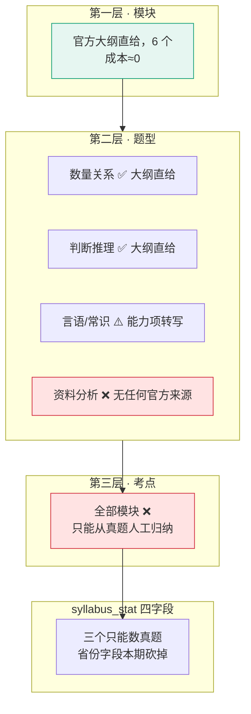

# 基础数据 · 抓取范围与渠道

> `数据线 · 骨架原料的获取与隔离` 定的是**能不能碰**（A–E 五级原则），这份文档定的是**具体碰哪几个网址、抓几年、哪些明确不碰**。
>
> 产出形状已被 `技术架构 §5.2` 与 `server/src/main/resources/seed/` 定死，本文不重新设计表，只回答**原料从哪来**。
>
> **不含抓取系统设计。** 本期结论是抓取量小到不需要系统 —— 见 §六。
>
> 调研 as-of **2026-08-25**，所有 URL 于当日实访；未实访的逐条标注。

---

## 零、这份文档补的是哪个洞

`阶段 0 至阶段 2 · 详细排期` 第 3 周只有一行字：

> 周六 5.5h ｜ `P1-1` 收集近五年公开真题，统一归档格式 ｜ **65 套卷可程序读取**

**这 65 套卷从哪来，`实施路径` / `阶段 0 至阶段 2 · 详细排期` / `数据线 · 骨架原料的获取与隔离` / `总路线图 · 脑图与父子待办` 四份文档里没有任何一处写过。** `数据线 · 骨架原料的获取与隔离` 定了原则但没有一个网址；`阶段 0 至阶段 2 · 详细排期` 直接假设真题已在手上。整条阶段 1 的排期建立在一个没有来源的前提上。

本文回答这个问题，答案不好看。

> ⚠️ **一句必须写在最前面的话：这份调研本身提前于阶段 0 完成了。**
> `数据线 §五` 原定「阶段 0 通过后才开始 A/B 级源清单调研」，而阶段 0 尚未开始。
> 这属于 `思考模式 §盲区二` 点名的那种「可量化、有成就感、且完全不需要面对任何一个真实用户」的进展。
> **记录在此，不粉饰。** 它不改变阶段 0 的判据，也不构成动手抓取的授权 —— 见 §七。

---

## 一、三条会改结论的实测发现

**这一节请先读完再看后面的清单，因为它们决定了清单该有多短。**

### 1.1 🔴 官方大纲撑不起资料分析的题型层

2026 年度国考公共科目笔试考试大纲，关于资料分析的**全部内容**：

> （六）资料分析。主要测查报考者对文字、数字、图表等统计性资料的综合理解与分析加工能力。

一句话，40 字，零题型。同一份大纲里作为对照：

| 模块 | 大纲原文 | 能否落出第二层 |
|---|---|---|
| 数量关系 | 「常用题型有数字推理和数学运算两种」 | ✅ 2 个节点，白送 |
| 判断推理 | 「常用题型有图形推理、定义判断、类比推理、逻辑判断四种」 | ✅ 4 个节点，白送 |
| 言语理解与表达 | 列了 7 条能力项 | ⚠️ 可转写 |
| 常识判断 | 列了经济/文化/社会/生态/法律/科技 6 个领域 | ⚠️ 勉强 |
| 政治理论 | 一句话 | ❌ |
| **资料分析** | **一句话** | ❌ |

**横向比对**（各省 2026 年度大纲全文实测）：江苏一句话无题型；广东一句话无题型；浙江一句话无题型且整份大纲无一道例题；**山东、四川根本不发布考试大纲**。

**纵向比对**：2015 版到 2026 版，这句话实质未变，2026 版还更短（删掉了「这部分内容通常由统计性的图表、数字及文字材料构成」半句）。

**结论：资料分析的第二层和第三层都没有任何官方来源。** 市面通行的「增长率 / 比重 / 平均数 / 倍数 / 年均增长量」那套划分，是培训机构的教研产物，取用即同时违反 `R-07`（不沿用机构体系与措辞）与红线「不做教研」。

> **一个刺眼的例外：全国唯一给出资料分析题型划分的官方文件，恰好是唯一明令禁止使用的那一份。**
> 军队文职公共科目考试大纲第八章原文：「常见题型包括孤立语段、多段语段、统计图、流程图、综合图、混合图文等。」
> 而该 PDF 每页页脚（经 grep 确认出现 16 次）：「本大纲内容版权归中央军委政治工作部所有　未经书面协议授权不得违法转载或使用」，且 PDF 以 128 位加密、权限位关闭了内容复制。
> **这是事实纠正，不是采用建议。** 该来源的裁定见 §四 与 `R-36`。

### 1.2 🔴 公考真题官方零发布，市面 100% 是回忆版

国家公务员局考后不发布试题、不发布标准答案、不允许查卷。任何年份都没有。市面上全部「国考真题」都是**考生回忆版**，由机构组织人员回忆、整理、审校。

补一条正面事实：试题的国家秘密属性是「绝密★启用前」，**考试启用后自动解密**，所以往年真题不涉及保密法风险 —— 风险纯在著作权，不在刑事保密。

直接后果 —— `syllabus_stat` 四个字段的可得性：

| 字段 | 官方来源 | 结论 |
|---|---|---|
| 近五年出现次数 | 无 | 只能数真题 |
| 最近一次出现年份 | 无 | 只能数真题 |
| 平均每套卷题量 | 无（大纲原文声明题量浮动、不承诺） | 只能数真题 |
| 出现过的省份 | 无 | **本期直接砍掉**，见 §二 |

### 1.3 🟠 官方大纲本身也可能带使用限制

这是本次调研的意外发现，过去只把「不沿用措辞」的约束加在机构身上。

人社部人事考试中心编《事业单位公开招聘分类考试公共科目笔试考试大纲（2026 年版）》，封面「版权所有 盗版必究」，扉页【郑重声明】原文：

> 本大纲仅供各级人力资源社会保障部门组织实施事业单位公开招聘分类考试和应试人员备考使用。未经许可，任何其他组织和个人不得进行印刷出版、转载、修改，**不得以营利为目的使用**。

本产品是商业产品，「以营利为目的使用」字面直接命中。国考大纲与北京大纲的公开文本经全文检索「版权/声明/转载/营利/许可」**无命中**，但不能推定其他省份都没有。

**新规则：每引入一份新大纲，先检查扉页声明。** 登记为 `R-40`。

---

## 二、基础数据的定义（先收窄，再谈抓取）

你提的三件事映射到已有的三张表，不新增表：

| 你说的 | 落到哪 | 原料 |
|---|---|---|
| 考点树 | `syllabus_node`（模块→题型→考点，三层，`level ≤ 3` 有 CHECK 约束） | 大纲给第一层，第二层部分给，第三层无 |
| 考情 | `syllabus_stat` 四字段 + 树根一个静态属性 | 只能从真题反推 |
| 历年真题 | **不落库**。只落 `syllabus_evidence` 的题目标识 | 离线加工原料 |

### 2.1 「考情」的收窄定义

「考情」是这三个词里唯一没有明确指称的一个。**模糊词的危险不在于做不出来，而在于它能无限吸纳工作量而不触发任何阶段验收** —— 每加一类「考情」都能被论证为有用，但没有一类会被阶段验收为通过。

**判据（也是这次收窄的全部依据）：不能被写成某个 `syllabus_node` 的属性的，就不叫考情。**

| 候选含义 | 裁定 |
|---|---|
| (a) 题型结构与分值分布 | **已经在 `syllabus_stat` 里了**。「平均每套卷题量」在模块层做一次 `GROUP BY`，就是「每年多少道资料分析」。差的是聚合口径不是字段 |
| (b) 考点频次分布 | **就是四个统计字段本身** |
| (c) 难度趋势 | 🔴 **整条砍掉，不留字段。** 官方零发布，且给考点标「难」就是在判断对不对，违反能力边界 |
| (c') 题型变化 | 保留，但它是 `syllabus_node` 的 `valid_from_year` / `valid_to_year` 两个属性，不是新表 |
| (d) 报考人数/竞争比/分数线 | 🔴 **一条都不抓。** 见 §三 |

唯一新增的东西：`syllabus_root.exam_structure`，一个静态 JSON，**只装官方大纲白纸黑字写了的内容** —— 科目名、考试时限、满分、官方部分划分与官方顺序、大纲版本年份、大纲出处 URL。约 3–5 条记录，人工录入，一年更新一次。

### 2.2 三层树的实际可得性



**产品选定的第一个模块「行测·资料分析」，恰好是六个模块里官方原料最薄的一个。**

如果当初选它的理由是「这个模块结构最清晰、建树最容易」，那个前提在**官方原料层面不成立** —— 清晰度来自机构的教研共识，而机构的教研共识正好是红线禁止取用的东西。

这不构成「不能做资料分析」的结论，但它意味着资料分析的骨架冷启动成本在六个模块里是最高的那一档，不是最低的那一档。**这条属于 `项目现状与决策记录` 的决策层，本文只记录，不改。**

### 2.3 两条必须改的字段口径

**其一：统计单位不是「省份」，是「卷种」。** 国考 2026 年度公共科目分 3 类卷（省级以上综合管理类 / 市地级以下综合管理类 / 行政执法类），浙江分 A/B/C/D 四卷，江苏分 A/B/C 三类。同一年同一省实际是多张不同的卷，按省份计数会把 3 次算成 1 次 —— **统计从第一天起就是错的**。单位应为 `(年份, 考试, 卷种)` 三元组。

**其二：`province_codes` 字段本期直接不要。** 只做国考的话它没有意义；而它一旦要真填，就必须采购 20 余省的真题书 —— 那正好撞穿范围红线。

> **一条比越界判据更早的预警信号：当有人提出要给「出现过的省份」填上真实数据时，范围已经在越线了。**

---

## 三、抓取范围（本期）

### 3.1 抓什么

| 项 | 量 | 获取方式 | 用途 |
|---|---|---|---|
| 2026 年度国考公共科目笔试考试大纲全文 | **1 篇 HTML** | 人工浏览器另存 | 第一层模块名（6 个）+ 数量关系/判断推理的第二层 |

**就这一篇。**

原调研建议抓 30–40 篇（国考往年 5 篇 + 省考 5 省 × 5 年 ≈ 25 篇），这条建议与它自己的实测结论自相矛盾：

- 江苏/浙江/广东的资料分析全部是一句话、零题型 → 省考大纲对第一个模块的信息增量**精确等于零**
- 2015 版与 2026 版措辞实质等同 → 往年大纲的信息增量**也是零**

在每周 ≤2 小时的预算下（`数据线 §五`），这 30 篇要吃掉整整一个月的数据线时间，换回零。

### 3.2 明确不抓（每条都有判据，不是「暂缓」）

| 不抓 | 判据 |
|---|---|
| **全部报考数据**（职位表、报名人数、竞争比、面试名单、分数线） | 它们定义在「职位」上，与「考点」之间**不存在任何连接键**。没有一条能被写成 `syllabus_node` 的属性，也就进不了 `盲区 = 骨架层 − 行为层` 这个减法。`R-38` |
| 往年国考大纲（2021–2025） | 措辞十年未变，信息增量为零 |
| 省考大纲（苏浙粤鲁川） | 对资料分析零贡献，且江苏已明示不欢迎自动化访问 |
| 事业单位全线 | 不是本期科目；且大纲扉页明令禁止营利性使用；且 canonical 版本存疑（57 页五类版 vs 39 页三类版并存） |
| 考研全线 | 不是本期科目；且 2023 年起大纲只以纸质出版物发行，无官方免费网络全文 |
| 军队文职全线 | 见 `R-36`，**连纯公告也不抓** |
| 难度/难度趋势/分值 | 官方零发布 + 违反能力边界 |
| 任何机构站点（含读 robots） | `R-39` |

> **报考数据这一条要单独说。** 它同时具备四个诱人属性：数据最规整（xls，字段现成）、最容易抓（明文 HTML 无 WAF）、最容易做出可视化（竞争比排行、分数线折线图，截图好看）、**且完全不需要面对任何一个真实用户**。
>
> 这正是 `思考模式 §盲区二` 与 `总路线图 §六` 点名的失败模式。所以判据不能是「要不要克制」，必须是硬的：**它不能被写成 `syllabus_node` 的属性，所以它不进这个项目。**

### 3.3 量级

| | 原调研建议 | 本文裁定 |
|---|---|---|
| 联网抓取 | 30–40 篇 | **1 篇** |
| 需要爬虫吗 | 「curl + pdftotext 即可」 | **不需要任何代码** |
| 工时 | 一天 | **10 分钟** |

---

## 四、渠道清单

### 4.1 ✅ 可用（人工获取，不写任何自动化）

| 渠道 | URL | 主办 | 实测 |
|---|---|---|---|
| 2026 年度国考公共科目大纲 | `bm.scs.gov.cn` 专题站 · 招考公告栏 | 国家公务员局 | HTML 正文，无 PDF 无附件。**该域挂在 TencentEdgeOne 后面，返回 JS 挑战页**，curl / WebFetch 全部拿不到内容；真实浏览器正常 |
| 中国政府网官方转载 | `www.gov.cn` 联播·部门 | 中国政府网 | 可直读，作为交叉校对源。采用前与原件逐字比对并留 hash |

**处置：人工用日常浏览器打开、另存 HTML、记来源 URL + 时间戳 + 文本 hash。完事。**

### 4.2 ⛔ 不可用（写进代码级黑名单常量，不是靠自觉）

| 类别 | 域 | 判据 |
|---|---|---|
| 需 JS 挑战 / WAF 放行 / JS 渲染才能取到内容 | `www.scs.gov.cn`、`bm.scs.gov.cn`、`jshrss.jiangsu.gov.cn`、`yz.chsi.com.cn`、`yankao.neea.edu.cn`、`gwy.zjks.gov.cn` | **仅限人工浏览器另存。代码库中不得存在针对这些域的任何自动化访问代码，明确包含 headless 与渲染型抓取** `R-37` |
| 后端接口需鉴权 | `bm.scs.gov.cn` 的 `POST /pp/gkweb/business/download/queryDownloadList`（实测 401） | 页面上人工点击合法，程序化调接口不合法 |
| 涉军 | `81rc.81.cn` 全域（含 `_attachment` 路径） | `R-36`。**含纯政务公告在内，一条不抓** |
| 机构 | `fenbi.com`、`huatu.com`、`offcn.com`、`koolearn.com`、`ludengkaoyan.com`、`chinakaoyan.com`、`birdmath.cn` 等 | 红线 D 级。**停止一切访问，包括读 robots** `R-39` |
| 商业媒体转载的在售出版物正文 | `kaoyan.eol.cn` / `img.eol.cn` | 中国教育在线转载的考研大纲 `.docx` 是出版社独家授权、带 CIP 与「版权所有 侵权必究」、定价 29–42 元的正式出版物全文。与整本扫描 PDF 在权利链上无实质区别，只是格式体面 |
| 真题原文托管页 | 高校研究生院「历年真题」栏目等 | **`contentTypes` 含真题原文的渠道一律不得给 A/B 级，无论托管方是不是官方** |

### 4.3 三条评级规则（原调研在这里系统性偏松，必须写死）

1. **`needsLogin = true` 的渠道，评级强制为不可用。** 不存在「A 级但要登录」这种状态。
2. **`mapsToField` 为空 / 自述零贡献的渠道，一律标「不抓」。** A 级在清单语义里就是抓取诱因。
3. **分级收敛为二值：可用 / 不可用。** 删除「谨慎使用」「备选」「有条件可用」「注意频控」这类中间态措辞 —— 确需条件的，把条件写成硬约束（「仅人工、单次、不留存」），不写成形容词。

> 「用标准浏览器渲染」这个说法尤其危险：用 headless 浏览器执行 EdgeOne / WAF 的挑战脚本、取得 cookie 后重载，**实质仍是通过了机器人挑战，只是把 solver 外包给了浏览器引擎**。这与 `R-02`「不是不用，是不写」直接冲突。

### 4.4 robots 实测记录（as-of 2026-08-25，经两个独立网络环境交叉复现）

| 域 | robots.txt |
|---|---|
| `www.scs.gov.cn` | 404 |
| `bm.scs.gov.cn` | **403**（读不到） |
| `jshrss.jiangsu.gov.cn` | 200，逐条 `Disallow: /` 了 GPTBot / Googlebot / Bingbot / ia_archiver 等 **15 个具名爬虫，无 `User-agent: *` 兜底段** |
| `www.jszzb.gov.cn` | 200 但内容是 HTML 页，非有效指令 |
| `dtdjzx.gov.cn` | 404（对象存储 NoSuchKey） |
| `scpta.com.cn` | 404 |
| `gdzz.gov.cn` | 404 |
| `81rc.81.cn` | 无 |
| `yz.chsi.com.cn` / `moe.gov.cn` | 404 / 页面不存在 |

**两条读法上的纪律：**

- **没有 robots.txt ≠ 允许抓取，只是无声明。** 不要因为 robots 缺失就扩大抓取范围。
- **换域取件不产生合规性。** 江苏人社厅明示 Disallow 15 个爬虫后，改到省委组织部站去抓同一份、同一发布主体（江苏省公务员局）的大纲，只是规避明示意图。**江苏两域一并只允许人工获取。**

### 4.5 🔴 唯一没查的那一层，恰恰是决定性的那一层

六路调研全部只做到 `robots.txt`，**没有任何一路读过政务站点的《网站声明 / 版权声明 / 使用条款》页面**。而多数政务站页脚都有「版权所有 未经许可不得转载/摘编/建立镜像」类声明（军队人才网体系已实证有）。

**《政府信息公开条例》意义上的「公开」不等于授权商业再利用。robots 什么都没证明。**

规则：任一政务源进入归档前，必须逐站读取并留证其版权声明页，与 robots 结论一并记录。登记为 `R-44`。

---

## 五、真题原料：把两个问题拆开

`数据线 §二` 已定「真题是原料不是库存」。本节回答原料从哪来，答案有两半，**过去被混为一谈**。

### 5.1 获取合法性：买正版书解决了

| 环节 | 裁定 |
|---|---|
| 获取 | 自购正版纸质书，取得复制件所有权。不触刑法 285 条（无侵入、无绕过）、不触 2025 修订《反不正当竞争法》第 13 条（构成要件是「以欺诈、胁迫、避开或者破坏技术管理措施等不正当方式获取」，买书一个要件都不沾） |
| 使用/输出 | 输出物是考点名（自行归纳）+ 统计数字 + 题目标识，属事实与思想，不受著作权法保护 |
| 复制 | ⚠️ **唯一有瑕疵的一步** |

**最强的抗辩是「不构成实质性替代」**：用户拿到「逻辑填空 近五年出现 47 次」之后**仍然必须去买书 / 上课才能学**。参照 (2016) 沪 73 民终 242 号（大众点评诉百度，二审判赔 300 万 + 合理开支 23 万）确立的「实质性替代」标准。

> **这意味着一条产品红线：永远不要为了体验去加一个「看看原题」按钮。那一按就把抗辩按没了。**

### 5.2 内容权威性：无解，只能作为被接受的误差

**买书解决的是获取环节，完全不解决内容权威性。** 书里的内容同样是回忆版 —— 来源不可验证、版本间有差异、无官方校正基准。

而 `syllabus_stat` 的统计量会原样继承这个误差，**且误差不可测量**。覆盖度指标正是「宁缺毋滥」这条红线要保护的东西。

**这是产品决策，不是数据轨能吸收的**：UI 上要不要标注数据来源等级？登记为 `R-41`。

### 5.3 🔴 一条被推翻的路径：机构编印的真题汇编 + 整本 OCR

原调研把它判为「有条件可用」。合规审查改判**不可用**，理由成立：

1. 市面公考真题汇编绝大多数由粉笔 / 中公 / 华图编印 → 整本 OCR 入库＝把机构的题目选编与编排成果搬进产品，**直接命中红线 D 级，叠加在职竞业与不正当竞争风险**
2. 产出的题号只能沿用机构编号 → 等于引用机构数据
3. 原调研自己写着「个人学习研究例外在商业主体内部站不住」 —— **承认风险不等于化解风险**

### 5.4 不做 OCR 流水线

第一个模块只有资料分析一科，近五年的量级是 **100–300 题**。人工阅读后手写归纳完全做得来。

**「复制」这个受控行为是自己给自己加上的。** 删掉 OCR 流水线，就从源头消灭了复制动作，同时也消灭了 `数据线 §七` 里那条待律师确认。

若将来量级真的大到需要批量处理，**再单独做一次合规评估，不要顺手带上**。

### 5.5 ⚠️ 留证格式失效了

`数据线 §二` 的留证设计是「只存题目标识，如 `2023-国考-地市级-Q112`」。本次调研推翻了它的前提：

**官方从不公布试卷，题号由出版社或机构自行编排、跨版本不一致。** 所以这个标识：

- **不可核验** —— 没有权威原文可回查
- **不可跨源比对** —— 换一本书题号就变

留证的目的（自证考点标签是自行归纳的）因此落空。

**建议改为**：`来源出版物 ISBN + 印次 + 页码 + 本机归档编号`，并明确它**只在本机自用、不具备对外自证效力**。

更根本的一层：当第二/三层只能从同一批真题归纳时，**归纳结果与机构体系高度重合是数学上必然的**（都在描述同一批题）。留证只能自证「我看过这些题」，不能自证「我没抄机构体系」。

**能证明过程的是废稿，不是成品。** 建议留证增加中间产物：初步聚类结果、废弃的候选命名、归纳当日时间戳。

并入 `R-42`，与 `R-26` 一起问律师。

---

## 六、一次性脚本的形态（你要求不做系统设计，这里也确实不需要）

**本期结论：抓取量是 1 篇 HTML，不写任何代码。**

以下约定为将来量级上去时预备，**现在不实现**。

### 6.1 六条硬性禁令（写成常量，不是写在注释里）

```
禁止出现在代码库中的能力（R-02 的完整清单）：
  1. 登录 / cookie 注入 / 会话保持
  2. 验证码识别
  3. UA 伪装、指纹伪造、IP 轮换
  4. JS 挑战求解（含 headless 浏览器执行挑战脚本）   ← 本次新增
  5. 对黑名单域的任何请求（含 robots.txt 探测）      ← 本次新增
  6. 重试 / 换 IP（遇 403/429 立即停止该站并记录）
```

**不是不用，是不写。**

### 6.2 落盘约定

```
data/                     # 全部在 .gitignore 内，永不进仓库
  raw/                    # 原始另存件
    2026-国考-大纲.html
    2026-国考-大纲.meta.json   # {url, fetched_at, sha256, method:"manual-browser"}
  offline/                # 🔴 离线加工区。真题原料只存在这里
    ...                   # 本机加密盘，加工完即销毁
  out/                    # 唯一允许出区的东西
    syllabus-ziliao.json  # 与 server/src/main/resources/seed/ 同构
```

`out/` 的格式**已经存在**，直接对齐 `server/src/main/resources/seed/syllabus-ziliao.json`，不另设计。

### 6.3 一次性脚本的判据

**如果一个脚本需要跑第二次，它就不该是脚本，该是人工。** 本期全部动作都是一次性的：另存一篇 HTML、读一遍、手写归纳。

---

## 七、这次调研没做的事（诚实登记，不粉饰）

### 7.1 🔴 六路调研 100% 在骨架层，行为层零调研

公式 `盲区 = 骨架层 − 行为层` 两侧都是集合。这次把全部时间花在减号左边，右边一次都没查过：

**用户现在的学习痕迹到底长什么样？** 手机里、本子上的痕迹能不能被拍照/语音变成一条带模块名的记录？

而右边才是**阶段 0 和阶段 2 的判据所在**，也是「跨源聚合」这个立身主张的唯一落地面。**骨架层可以慢慢建，行为层拿不到就整个产品不成立。**

这次调研本身就是 `思考模式 §盲区二` 的完整复现：产出大量可量化、可炫耀的进展，**六路加起来改变不了阶段 0 的任何一个数字**。登记为 `R-45`。

### 7.2 ✅ 一个被问过并已回答的问题：阶段 2 需要几层树？

调研曾提出：既然第三层无合规原料，而阶段 2 的判据只是「看到缺口清单后点进去的比例 > 30%」，那么一棵只有两层（模块→题型）的树够不够？若够，第三层 + 四个统计字段可整体推迟到阶段 2 之后。

**已决（2026-08-25）：三层做满，第三层不推迟。** `决策记录 §2.5` 的三层不变，`R-43` 关闭。

代价是已知且被接受的，写在这里免得将来当成意外：

| 代价 | 出处 |
|---|---|
| 第三层**无任何官方来源**，只能从真题人工归纳 | §1.1 |
| 资料分析的骨架冷启动是六个模块里**最重的一档**，不是最轻的 | §2.2 |
| 归纳所依赖的真题**官方不公布**，只有回忆版，误差不可测量 | §1.2 / §5.2 |

> **何时改变**：若阶段 1 中途第三层归纳工作量失控（`R-23`），**退回两层是唯一的减法** —— 不是加班，不是降标准，是砍层。

### 7.3 五类完全没被检索的渠道

| 没查的 | 为什么它可能推翻已有结论 |
|---|---|
| **学位论文与学术期刊**对考点分布的统计研究 | 第三方、已发表可引用、**措辞非机构** —— 同时缓解「资料分析第二/三层无官方原料」与「不得沿用机构措辞」两个死结 |
| **官方期刊《中国考试》**（教育部教育考试院主办）、《考试分析》系列 | 常刊载命题组的试卷评价、难度系数与区分度分析。若存在，「难度官方零发布」这条否定结论就是错的 |
| **学科公有骨架** —— 马工程统编教材目录、教育部课程教学基本要求 | 既非官方大纲原文、也非机构教研产物，是最干净的第二/三层来源 |
| **网页存档站** Wayback / 国家图书馆互联网信息保存 | 「官方零归档」整节论证是在没试过存档站的前提下作出的 |
| **法规规章数据库** `flk.npc.gov.cn` + 依申请公开 + 省厅咨询信箱 | 约十条「这是推理不是书面确认」正是靠这三样关掉的 |

**所有否定性结论必须标注检索范围。「找不到」不等于「不存在」。**

### 7.4 两条被交叉验证纠正的记录

| 原结论 | 纠正 |
|---|---|
| 江苏人社厅部署知道创宇 WAF，curl 吃拦截页 | **证伪。** 独立环境三次 curl 全部 HTTP 200 正常 HTML。真正的限制是 robots 对 15 个具名爬虫的 Disallow。**理由要换，处置结论（人工获取）可保留** |
| 军队文职大纲「资料分析连常见题型这句都更简略」 | **错。** 第八章完整列了 6 个题型。见 §1.1 |

### 7.5 未能独立核实的法律引用

以下三个试题类著作权判例支撑着「整套试卷 = 汇编作品」这个相当强的结论，**本次核验未能触及，引用前须单独核一遍**：2015 学科网诉猿题库、2016 猿题库诉学科网、菁优网诉豆丁网深圳中院再审。

已核实无误的是 (2016) 沪 73 民终 242 号（大众点评诉百度）。**正因为同一份清单里可核的那条是对的，另外三条更需要单独核，不能因相邻条目正确而推定。**

---

## 八、新增风险（并入 `总路线图 §四`）

| ID | 级 | 风险 | 防线 |
|---|---|---|---|
| `R-36` | 🔴 | **涉军栏目触发全站监管** —— 产品里开「军队文职」模块即构成《互联网军事信息传播管理办法》(军政〔2025〕26号) 第二十八条(三) 所称「网站平台军事栏目」，本办法适用于**整个产品**而非仅该模块 | 军队文职整条不进范围，`81rc.81.cn` 全域黑名单（含纯公告）。产品名与模块名不得出现「军队/部队/全军/解放军/武警/八一/国防」字样。第六条（专职审核人员）与第二十三条（军地培训）对 2–3 人业务是**能力不足**，不是流程延迟 |
| `R-37` | 🔴 | **渲染型 / headless 抓取实质等同绕过挑战** | `R-02` 的适用范围扩展：禁令含 headless 浏览器执行 JS 挑战。凡需 WAF 放行或 JS 渲染的域，一律仅限人工浏览器另存 |
| `R-38` | 🟠 | **招录数据诱捕** —— 最规整、最好抓、最好看、且零真实用户 | 硬判据：**它不能被写成 `syllabus_node` 的属性，所以它不进这个项目** |
| `R-39` | 🟠 | **对已判死机构站的持续探测** —— 读 robots 也在对方日志留痕，而「读了 robots 确认允许」在竞业语境下无任何抗辩价值 | 写进代码级黑名单常量。粉笔 robots 写的是 `Allow: /`，这恰恰是将来最容易被拿来重开话题的诱因 |
| `R-40` | 🟠 | **官方大纲亦带使用限制** —— 事业单位大纲扉页明文禁止「以营利为目的使用」 | 每引入一份新大纲先查扉页声明。不推定「政务公开 = 可自由使用」 |
| `R-41` | 🟠 | **回忆版内容权威性无解** → 误差不可测量，污染覆盖度指标 | 与获取合法性拆开记。UI 是否标注数据来源等级，是产品决策 |
| `R-42` | 🟠 | **留证题号不可核验、跨源不一致** → `数据线 §二` 留证设计落空 | 改用 ISBN + 印次 + 页码 + 本机编号；留存废稿而非成品；并入 `R-26` 问律师 |
| `R-43` | ⚪ | **阶段 2 需要几层树，从未被问过** | 若两层够，第三层整体推迟到阶段 2 后。**需 `项目现状与决策记录` 层面决策** |
| `R-44` | ⚪ | **政务站《版权声明》层未查** —— 唯一没查的那一层恰是决定性的那一层 | 入档前逐站读取并留证版权声明页 |
| `R-45` | 🟠 | **行为层零调研** —— 公式右侧一次都没被查过 | 下一次调研的题目换成行为层，不是再多一份 PDF |
| `R-46` | 🟠 | **黑名单靠人工清洗，无机械校验** | **已决（2026-08-26）：不建 CI，人工 grep。** 基线三处零命中。⚠️ **每次必须带上锁文件**——间接依赖在直接清单里看不见。**何时改变：离线脚本装第一个 Python 包时**（`§B.9`） |
| `R-47` | 🟡 | 框架自带 HTTP 客户端与六类禁令的边界 | **已裁定**：不计入六类，但禁止用于向被抓取站点发起请求（`§B.5`） |
| `R-48` | 🟡 | 「文档 OCR」与「验证码 OCR」未区分 | **已裁定**：判据是「输入是否为人机验证图像」（`§B.6`） |

---

## 九、待确认

| 项 | 谁来关 | 备注 |
|---|---|---|
| 三个试题著作权判例的案号与裁判要旨 | 你 / 律师 | 1 小时可核 |
| 学术论文 + 官方期刊 + 学科公有骨架三类渠道 | 你 | 各 1 小时，**可能直接改写 §1.1 的否定结论** |
| Wayback 是否有往年大纲归档 | 你 | 5 分钟。价值是修方法论，不是扩范围 |
| 大纲的著作权定性（是否属《著作权法》第五条不适用范围） | 律师 | 并入 `L-A5` |
| 本机 OCR 是否构成合理使用 | 律师 | **§5.4 建议不做 OCR，若采纳则此项自动消失** |
| 回忆版真题的权利归属链 | 律师 | 无判例。对本项目**偏有利**（原告资格存疑），但不能作为主动依据 |
| 阶段 2 需要几层树 | **你** | `R-43`，最省时间的一个决定 |

---

## 十、一句话总结

**本期基础数据的全部抓取工作是：人工另存一篇国考大纲 HTML，十分钟。**

其余全部是「不抓」及其判据。

这份清单最有价值的部分不是那一篇能抓的，是那三十几篇**已经查清楚了、不用再去查、也不用再重开话题**的不能抓的。

---

# 附录 A · 渠道全表

> 全部 **56 个独立域名 / 81 个渠道条目**，2026-08-25 实访。
>
> **列在这里不等于可抓。** 绝大多数条目的存在意义是「已核实、结论是不抓、不用再查」。
>
> ⛔ 段落**只记域名，不记深链** —— 深链本身会变成将来的操作指引（合规审查的原话）。

## A.1 ✅ 本期在范围内

| 渠道 | 域名 / 入口 | 主办 | 用途 |
|---|---|---|---|
| 国考 2026 公共科目大纲 | `bm.scs.gov.cn/kl2026` | 中央公务员主管部门 | **本期唯一原料**。第一层 6 个模块名 + 数量关系/判断推理第二层 |
| 中国政府网转载 | `www.gov.cn/lianbo/bumen/` | 国务院办公厅 | 交叉校对源。EdgeOne 挡住原站时的**合规替代发布源**（不是「绕开反爬」） |
| 地方政务转载（交叉校对） | `www.forestry.gov.cn`、`www.hhjp.gov.cn`、`www.beijing.gov.cn` | 各转载单位 | ⚠️ 政务转载**不保证与原件一致**（陕西那份已实证被删改），每份须与另一独立官方源逐字比对 |

**处置：人工浏览器另存 → 记 URL + 时间戳 + 文本 hash → 完事。不写代码。**

## A.2 🟡 已核实 · 本期不抓（结论已定，不用重查）

### 公考 · 省考

| 省 | 域名 | 结论 |
|---|---|---|
| 江苏 | `jshrss.jiangsu.gov.cn` / `www.jszzb.gov.cn` | 有大纲（PDF + HTML 两版）。⚠️ **robots 逐条 Disallow 15 个具名爬虫，两域一并只允许人工**。换到组织部站取同一份文件不产生合规性 |
| 浙江 | `gwy.zjks.gov.cn` | 有大纲，但**整份无一道例题**，六部分各一句话。主站 `www.zjks.gov.cn` 实测 502 |
| 广东 | `www.gdzz.gov.cn` | 有大纲，在 zip 附件里。`rsks.gd.gov.cn` / `hrss.gd.gov.cn` 实测不可达 |
| 山东 | `www.dtdjzx.gov.cn`（灯塔-党建在线）、`hrss.shandong.gov.cn` | 🔴 **不发布考试大纲**。全页无「大纲」二字，相关下载栏只有职位表 |
| 四川 | `www.scpta.com.cn` | 🔴 **不发布考试大纲**。公告全文无「大纲」二字，只有职位表和报考指南 |
| 国考门户 | `www.scs.gov.cn` | 已退化为两个链接的跳转页。挂 TencentEdgeOne，返回 987 字节 JS 挑战 |

**共同结论：省考大纲对资料分析的信息增量精确等于零**（全部一句话、零题型）。

### 考研（不进本期范围）

| 渠道 | 域名 | 结论 |
|---|---|---|
| 研招网 | `yz.chsi.com.cn` | 无历年真题栏目 |
| 教育部教育考试院 | `www.neea.edu.cn` / `yankao.neea.edu.cn` | 🔴 大纲栏目**停更 4 年**，最新条目 2021-11-30。正文放的是书封面图、CIP 版权页图、目录图，**不是正文** |
| 教育部门户 | `www.moe.gov.cn` | 招生工作管理规定。确认公共课**全国统考一张卷，无省份维度** |

**2023 年起考研大纲只以纸质出版物发行，无官方免费网络全文。** 出版社在高教社与人教社之间切换过（2022 届=高教社，2025/2026 届=人教社），确切切换届次未确认 —— **任何写死出版社的元数据字段都会过期**。

### 事业单位（不进本期范围）

| 渠道 | 域名 | 结论 |
|---|---|---|
| 中国人事考试网 | `www.cpta.com.cn` | 🔴 **零事业单位栏目**。大纲**没有任何国家级发布网址** |
| 中国公共招聘网 | `job.mohrss.gov.cn` | 只有 139 条、全是中央部委所属单位，**不是全国汇总** |
| 大纲镜像（57 页五类版） | `kjt.hubei.gov.cn`、`rsj.hd.gov.cn`、`rst.hunan.gov.cn` | 全是省级/市级镜像。`R-40`：扉页明令禁止「以营利为目的使用」 |
| ⚠️ 陷阱源（39 页三类版） | `www.shaanxi.gov.cn` | **同名文件存在两个版本**，正文一字不差但砍掉两类。CreationDate 相差近两月。**版本歧义未解决，禁止入库** |
| 省级发布位置样本 | `rst.hubei.gov.cn`、`hrss.yn.gov.cn`、`gkzp.renshenet.org.cn`、`rsj.sh.gov.cn`、`rsj.beijing.gov.cn`、`rsj.gz.gov.cn` | 每省一个平台，域名各异（黑龙江的甚至不是 `.gov.cn`）。**官方从不公布哪些省参加联考** |

### 军队文职 —— ⛔ 见 A.3，`81rc.81.cn` 全域不抓

## A.3 ⛔ 黑名单（写进代码级常量，不是靠自觉）

| 类别 | 域名 | 判据 |
|---|---|---|
| **涉军** | `81rc.81.cn` 全域 | `🔴R-36`。**含纯政务公告在内一条不抓**。大纲 PDF 页脚 16 处「未经书面协议授权不得违法转载或使用」，且加密关闭复制权限位 |
| **机构** | `www.fenbi.com`、`www.offcn.com`、`m.hlj.huatu.com`、`m.jzg.huatu.com`、`kaoyan.koolearn.com`、`kaoyan.wendu.com`、`www.ludengkaoyan.com`、`www.wenzhibang.com`、`www.chinakaoyan.com`、`download.chinakaoyan.com` | `🟠R-39` **停止一切访问，包括读 robots**。粉笔 robots 写的是 `Allow: /` —— 那正是将来最容易被拿来重开话题的诱因 |
| **盗版 / 资源站** | `www.birdmath.cn`、`kaoyanzhenti.shop` | 在售出版物的盗版扫描件、网盘合集 |
| **商业媒体转载的出版物正文** | `kaoyan.eol.cn`、`img.eol.cn` | 中国教育在线转载的考研大纲 `.docx` 是出版社独家授权、带 CIP 与「版权所有 侵权必究」的在售出版物全文。**与整本扫描 PDF 在权利链上无实质区别，只是格式体面** |
| **真题原文托管** | `www.csust.edu.cn` 等高校研究生院「历年真题」栏 | **`contentTypes` 含真题原文的渠道一律不得给 A/B 级，无论托管方是不是官方** |
| **需 JS 挑战 / WAF 放行** | `www.scs.gov.cn`、`bm.scs.gov.cn`、`jshrss.jiangsu.gov.cn`、`yz.chsi.com.cn`、`yankao.neea.edu.cn`、`gwy.zjks.gov.cn` | `🔴R-37` **仅限人工浏览器另存。代码库中不得存在针对这些域的任何自动化访问代码，明确包含 headless 与渲染型抓取** |
| **需鉴权的后端接口** | `bm.scs.gov.cn` 的 `POST /pp/gkweb/business/download/queryDownloadList`（实测 401） | 页面上人工点击合法，程序化调接口不合法 |

## A.4 📖 法律依据源（不是抓取渠道，是引用出处）

| 文件 | 出处 | 用于 |
|---|---|---|
| 两高《关于办理组织考试作弊等刑事案件适用法律若干问题的解释》法释〔2019〕13号 | `www.spp.gov.cn` | 第一条确认适用于「中央和地方公务员录用考试」 |
| 《互联网军事信息传播管理办法》军政〔2025〕26号 | `www.cac.gov.cn` | `R-36` 的依据。**五章三十条**（原调研误记为二十八条） |
| 《关于进一步做好事业单位公开招聘工作的通知》人社部发〔2024〕57号 | `www.gov.cn` | 联考是「**可以**分层级统一组织」= 制度上自愿参加 |
| 政府信息公开条例相关解读 | `www.moj.gov.cn` | 试卷属内部管理/过程性信息，**依申请公开拿不到** |

## A.5 五类完全没被检索的渠道（`基础数据 §7.3`）（续见下）

`www.nlc.cn`（国家图书馆）与 `www.ywcbs.com`（《高考试题分析》，高考方向的官方授权含原题出版物）在调研中被顺带碰到但未展开。此外这五类**一次都没检索过**：学术论文的考点分布统计、官方期刊《中国考试》、学科公有骨架（马工程目录 / 教学基本要求）、Wayback 存档、法规规章数据库 `flk.npc.gov.cn`。

**其中前两类可能直接改写 §1.1 的否定结论，各 1 小时。**

---

# 附录 B · 开源工具选型

> 调研 as-of **2026-08-25**，五路并行 + 一路合规收口，逐库拉取 `pyproject.toml` / `go.mod` / 锁文件做能力审计。
>
> 承重结论（`pymupdf_layout` 拉 onnxruntime、`markitdown` base 依赖 `requests`、`pdfplumber`/`markdownify` 全树无 HTTP）已在本机独立复核 PyPI 元数据确认。

## B.1 选型标准是反的

**不是选能力最强的，是选能力最窄的。**

`R-02` 原文「不是不用，是不写」的保护力来自一件事：**要做那件事必须新增可举证的代码，所以不写就等于做不到。** 一旦某个库把能力做成了配置项，这条保护就失效了——举证时对方只需要跑一次 `pip show` / `mvn dependency:tree`，你剩下的全部抗辩都要靠自证心理状态。

### 🔴 唯一有效的抗辩：它不在锁文件里

以下抗辩形式**全部无效**，且在本次调研里被逐条驳回过：

| 无效抗辩 | 出现在 |
|---|---|
| 「已装但不调用」 | readability-lxml |
| 「默认关闭 / opt-in」 | Goldziher html-to-markdown、requests |
| 「独立 venv、断网跑一次、环境即弃」 | MinerU |
| 「只走本地文件入口，网络代码路径永不执行」 | docling、readability-lxml |
| 「subprocess 调用，不进 requirements」 | pandoc |
| 「脚本里禁止出现那五个 flag」 | curl / wget |
| 「必须显式禁用并写进约束」 | marker |

**唯一边缘豁免：操作系统自带的外部二进制**，需同时满足三条——① 是发行版标配、不由本仓安装或 vendor；② 调用脚本中不出现黑名单 flag；③ **其默认行为本身不含绕过语义**。

第③条正好划出一条清晰的线：**`curl` 留下（默认不重试），`wget` 出局（手册原文 "The default is to retry 20 times"，默认行为即重试，不需要任何人写代码）。**

> 归档那一路推荐了 `wget --warc`，合规收口按第③条否掉了它。**冲突记录在此，采纳后者。**

## B.2 最小依赖清单

### 运行时新增依赖：**0**

**`server/pom.xml` 与 `web/package.json` 一行不动。** 这是本清单里最重要的一行。

实测基线：`server/` 现有依赖只有 `spring-boot-starter-{webmvc,validation,json}` + lombok；`web/` 只有 react / react-dom / @tanstack/react-query / cmdk + vite。**六类禁止能力当前零命中，依赖树是干净的。本次选型的唯一实质任务不是选型，是别把它弄脏。**

### 离线脚本（`scripts/`，不进任何产物、不进任何构建）：三个纯本地解析库

| 包 | 版本 | 许可 | 全部传递依赖（已复核） | 用途 |
|---|---|---|---|---|
| `pdfplumber` | 0.11.10 | MIT | `pdfminer.six` → charset-normalizer / cryptography / Pillow；`pypdfium2`（无依赖） | PDF → 文本 / 字符几何 / 表格 |
| `markdownify` | 1.2.3 | MIT | `beautifulsoup4` → soupsieve / typing-extensions；`six` | 选中的 DOM 子树 → Markdown |
| `beautifulsoup4` | 4.15 | MIT | （由上带入） | 正文范围界定（手写 CSS 选择器） |

**全树无 HTTP 客户端、无浏览器、无 JS 运行时、无 OCR、无 AI 推理栈、无重试原语。**

**标准库即可**：`hashlib.sha256` + `json` + `pathlib` 写 `manifest.jsonl`。不引入任何第三方哈希或存证库。

**外部二进制**（受 B.1 三条豁免约束，不进任何锁文件）：`openssl ts`、`curl`（仅用于时间戳 POST）、可选 `pdftotext -layout` 做交叉校验。**不含 wget。**

### 正文抽取为什么不用现成的库

本期只有 1 篇人工另存的 HTML。用 `beautifulsoup4` 写 20 行 CMS 选择器（`.article-content` / `#zoom` / `.TRS_Editor` 这类 TRS/南方数媒系模板类名）+ `markdownify`，**准确率比通用启发式更高、可解释、且能力面为零**。

## B.3 三个「口碑最好」的候选被推翻

这是本次选型最有价值的部分——**最流行的三个恰好都不能用，而且原因各不相同。**

### `trafilatura`（★6.7k，业界公认质量最高的中文正文抽取器）

五类中命中四类，全部实证于 `trafilatura/downloads.py`：

| 类 | 证据 |
|---|---|
| 1 cookie 注入 | `_determine_headers()` 执行 `headers["Cookie"] = mycookie` |
| 3 UA 轮换 | `settings.cfg` 有 `USER_AGENTS` 多行配置，`headers["User-Agent"] = random.choice(myagents)` |
| 3 代理 | `SOCKSProxyManager` + `curl.setopt(pycurl.PRE_PROXY, PROXY_URL)` 双通道 |
| 5 重试绕 429 | `Retry(status_forcelist=FORCE_STATUS)`，**FORCE_STATUS 第一项就是 429**，另含 520–530 等 Cloudflare 系状态码 |

本机复核确认 base 依赖含 `urllib3`，extras 含 `urllib3[socks]` 与 `pycurl`。

> **按「能力最窄」的反向标准，全网口碑最好的中文正文抽取器恰恰是最不能进依赖树的那一个。** 它把四件事全做成了一等配置项、写进 `settings.cfg`——出现在 `pip freeze` 里就是完整的证据链。

⚠️ 禁用清单那一路曾把 `trafilatura` 判为「推荐」（因为它不是绕过工具），文档抽取那一路给出了源码级反证。**合规收口采纳后者。**

### `microsoft/markitdown`（★176k）

本机复核：**base 依赖直接含 `requests`**（不是 extras，是 base）。禁用清单那一路的「推荐」不成立。

### `pymupdf4llm`（原本是唯一能自动还原标题层级的方案）

它曾是最强候选——README 的特性表里 `Header detection`、`TOC-driven headers`、`Layout analysis`、`Table detection`、`Header / footer removal` 全中，直接决定能不能自动切出「模块→题型」两层。

**但本机复核 1.28.2 版发现论据已失效：**

```
pymupdf4llm 1.28.2
  ├── pymupdf 1.28.2            (AGPL-3.0)
  ├── pymupdf_layout 1.28.2     (AGPL-3.0)
  │     ├── onnxruntime         ← ONNX 推理栈
  │     ├── numpy
  │     └── networkx
  ├── tabulate
  └── psutil
```

「依赖是零、能力面最窄」已不成立：现在是一个**带 ONNX 推理栈的包**，且 AGPL 面从 1 个包扩到 2 个包。若被 `server/`（Spring 网络服务）以任何方式调用，AGPL §13 会触发向用户提供源码的义务。

**裁定：降为备选，默认不装。**

**那标题层级怎么办？** 用 `pdfplumber` 的 `char["size"]` 直方图 + 中文序号正则写 30 行规则：

```
第[一二三四五六七八九十]+部分     →  第一层
^[一二三四五六七八九十]+、        →  第二层
^（[一二三四五六七八九十]+）      →  第三层
^\d+\.
```

政务大纲的序号体系极其规整，这条路准确率不低于启发式，且**规则可读、可复核、可解释**——符合「宁缺毋滥」。何况这一层本来就要过 `数据线 · 骨架原料的获取与隔离` 的「人工校正命名」，自动化收益低于新增一个 AGPL + ONNX 依赖的审计成本。

## B.4 headless 浏览器裸用算不算违规

**算。理由不是 stealth，是「零代码可得」。**

其余五类能力都必须写代码才能获得：注入 cookie 要写、伪造 UA 要写、轮换代理要写、调打码 API 要写、重试 429 要写。

**headless 把这个前提打掉了**：一旦它在依赖树里，通过 Cloudflare / EdgeOne / 瑞数的 JS 挑战**不需要写任何一行代码**——`goto(url)` 之后等一会儿，挑战自己就跑完了，clearance cookie 自己就拿到了。第 4 类能力在 headless 存在时是**默认附赠、无法从代码上被证否**的。

「我们只是拿它渲染」在举证层面不可验证，与「我们只是没开那个开关」等价。

两条旁证：① 一旦 headless 进树，距离 stealth 只差一个包，而本轮实证的三个中文项目（`fenbi-crawler`、`policy_crawling`、mokao 扩展）**全都走完了这条路，没有一个停在裸用**；② headless 会自动执行站点下发的**任意** JS 包括风控探针，即使无意也会向对方回传一份伪造的人机证明——**行为已经发生，不取决于意图**。

### 可操作判据（一条，可机械执行）

> **执行目标站点 JavaScript 的主体是谁？——人自己的日常浏览器 = 合规；仓库依赖树里的任何运行时 = 违规。**

这条判据顺带解释了：为什么 **SingleFile 浏览器扩展可以，而 `single-file-cli` 不可以**；也解释了 `browsertrix-crawler` 出局的真正原因不是 puppeteer，是它连 puppeteer 都不需要就已经具备第 4 类。

渲染保真度的需求由**人手动「另存为 → 网页，完整」**承担——**人不是依赖，不进锁文件。**

## B.5 🔴 Java 侧：五路全都没查，而这是本仓最现实的污染路径

前五路清一色在查 Python 生态。**但 `server/` 是 Java Maven 工程**——Java 工程要做 HTML 解析，默认反射就是加 `jsoup`：

```java
Jsoup.connect(url).userAgent(...).cookie(...).header(...)   // 第 1、3 类字面命中，jar 内一等 API
```

其余同类：`htmlunit`（内置 Rhino JS 引擎 = 第 4 类）、`Selenium Java`、`Playwright for Java`、`crawler4j`、`webmagic`（国产框架，自带 UA/代理）、`httpclient5`（`DefaultHttpRequestRetryStrategy` 默认重试 + CookieStore）、`okhttp`（CookieJar/Authenticator/proxy）。

**结论：`server/` 不引入任何 HTML/PDF 解析库，全部留在离线 Python 脚本里。**

若 Java 侧确实需要解析 PDF，只有 `pdfbox`（Apache-2.0，纯本地）可考虑——**但本期不需要。**

### ⚠️ 一个必须书面裁定的口径漏洞

`spring-boot-starter-webmvc` 已经把通用 HTTP 客户端（`RestTemplate` / `WebClient`）放进了 `server/` 依赖树，**且不可移除**。

**必须明文写下：Web 框架自带的通用 HTTP 客户端不计入六类，除非用于向被抓取站点发起请求。** 否则黑名单口径当场自相矛盾，后续每次选型都要重吵一遍。登记为 `R-47`。

## B.6 OCR 口径裁定

本项目产品本体就要做图像识别（`识别链路选型 · ASR 与图像识别` 识别链路），**若不区分就等于自我否决**。

> **判据不是「是不是 OCR」，是「输入是否为人机验证图像」。**

| | 判定 |
|---|---|
| 以验证码数据集训练、或 API 契约是「返回验证码答案」（`ddddocr`、`muggle-ocr`、2captcha 系、`solve_captcha()`） | 🔴 第 2 类命中 |
| 通用文档 / 截图 OCR（tesseract、PaddleOCR、RapidOCR、`识别链路选型 · ASR 与图像识别` 选型的多模态识别） | ✅ 不命中 |

登记为 `R-48`。

## B.7 中文考试类开源资产：一个能用的都没有

**这不是没搜到，是搜到之后逐个实访排除的。** 存量资产恰好落在三个互斥的坑里，每个坑撞一条红线：

| 坑 | 代表 | 撞哪条 |
|---|---|---|
| 真题原文 dump | `AdministrativeAptitudeTest`（590★，1.6GB PDF） | 🔴 `R-01` 真题原文 |
| 机构教材转录的考点体系 | `kuriv/civil-service-exam`（997★，已 archived）、`zhangxiangliang/civil-service-exam`（962★） | 🔴 `R-07` 沿用机构体系 |
| 机构题库爬虫 | `fenbi-crawler`、`dduutt/fenbi`、mokao 扩展 | 🔴 五类禁止能力 |

> 中间那两个加起来 1,959 星，**是社区里最像「现成考点树」的东西，也是最不能碰的东西**。`zhangxiangliang` 的 README 自己写着「参考了《中公…综合基础知识》」；`kuriv` 的叶子节点实访确认全是 PNG 思维导图截图、机器不可读、无来源声明。

### 唯一值得读的：`qiuyiwu1989-star/k12-knowledge-substrate`

**读它，不取它**（ODbL share-alike，禁止引用其 ID 空间与数据）。它是唯一一个把骨架原料限定在**官方文件（教育部课标）而非机构教材**的仓库，四处可直接平移：

1. 「官方大纲 → 自编码 ID + 自己改写的表述 + 页码溯源」这条链路，与本项目 `数据线 §二` 的留证设计同构
2. 🔴 **它公开记录了自己曾把 8,945 处课标原文误发到公网，事后 `git filter-repo` 改写 36 个提交清除** —— 这是 `R-01`「线上 schema 不得有能容纳题干的字段」失守后的**真实成本样本**，比任何推演都有说服力。建议摘进 `数据线 · 骨架原料的获取与隔离`
3. **「承诺要么可执行、要么会腐烂」** —— 它把「不发原文」做成 `scripts/strip-srctext.mjs` 一条命令 + CI 核对。本项目的图像留存、闭集打标同样应该是**可执行开关而非文档里的一句话**
4. 只读 MCP 的三条设计约束，与本项目「MCP 只读、never write or capture」完全同构

## B.8 归档留证：零第三方依赖

一年几十个文件，WARC 那套工业级方案过重。最小可行流程：

```bash
# ① 人工用日常浏览器「另存为 → 网页，完整」
# ② 算哈希
shasum -a 256 归档件
# ③ 同目录写 meta.json：source_url / fetched_at(ISO8601 +08:00) / sha256 /
#    method("人工浏览器另存") / operator / page_title / site_name / notes
# ④ git commit —— 提交哈希链证明此后未被回溯改动
# ⑤ RFC3161 可信时间戳（已实测通过，免费、无需账号、即时返回）
openssl ts -query -data meta.json -sha256 -cert -no_nonce -out meta.tsq
curl -s -H "Content-Type: application/timestamp-query" \
     --data-binary @meta.tsq https://tsa.wotrus.com -o meta.tsr
```

实测 WoTrus（中国 CA，Policy OID `1.2.156.150570.2.3.1`）与 DigiCert 均返回 `Status: Granted`，令牌内 imprint 与 `sha256sum` 逐字节一致。

**一个 20 行的 shell 脚本，不产生任何依赖树。**

## B.9 黑名单常量

建议落到 `scripts/compliance/blacklist.py`，由 CI 对 `server/pom.xml`、`web/package-lock.json`、`scripts/requirements*.txt`、`Dockerfile`、`docker-compose.yml` **逐行 grep，命中即构建失败**。

| 组 | 代表条目（完整清单见脚本） |
|---|---|
| `JS_RUNTIME`（第 4 类载体） | playwright / puppeteer / selenium / pyppeteer / nodriver / zendriver / **DrissionPage** / chromedp / go-rod / scrapy-playwright / **js2py / PyExecJS / py-mini-racer / vm2 / jsdom** / crawl4ai / browser-use / htmlunit / rhino |
| `FINGERPRINT_UA_PROXY`（第 3 类） | curl_cffi / curl-impersonate / tls-client / utls / requests-go / primp / impit / camoufox / browserforge / playwright-stealth / puppeteer-extra-plugin-stealth / undetected-chromedriver / fake-useragent / scrapy-rotating-proxies / proxy_pool / **PySocks / socksio（即 `requests[socks]`、`httpx[socks]` 两个 extra 本身）** / socks-proxy-agent / **kdl / chaojiying / ttshitu**（国内厂商 SDK） |
| `CAPTCHA`（第 2 类） | **ddddocr / muggle-ocr / dddd_trainer / captcha_trainer** / 2captcha-python / python-anticaptcha / capsolver-python / capmonstercloudclient / deathbycaptcha |
| `CHALLENGE_BYPASS`（1/4/5 复合） | cloudscraper / cfscrape / FlareSolverr / Byparr / CF-Clearance-Scraper / hrequests / scrapling |
| `CRAWLER_FRAMEWORK` | scrapy / crawlee / spider-rs / katana / colly / requests-html / pyspider / **trafilatura** / newspaper3k / wpull / browsertrix-crawler / archivebox / single-file-cli / obelisk / httrack / crawler4j / **webmagic** |
| `NOT_NEEDED_HTTP` | requests / urllib3 / httpx / got / node-fetch / **tough-cookie** / **org.jsoup:jsoup** / httpclient5 / okhttp / org.apache.tika |
| `HEAVY_PARSER` | docling / docling-slim / mineru / marker-pdf / nougat-ocr |
| `FORBIDDEN_FLAGS`（对脚本逐行 grep） | `-A` `--user-agent` `-x` `--proxy` `-b` `--cookie` `-c` `--cookie-jar` `--load-cookies` `--retry` `--tries` `--random-wait` `-H 'Cookie` `--use_llm` `impersonate=` |

**`NOT_NEEDED_HTTP` 的例外（书面裁定，`R-47`）**：`spring-boot-starter-webmvc` 自带的 `RestTemplate` / `WebClient` 属框架固有能力，不计入本清单，但**禁止用于向被抓取站点发起请求**。

### 🔴 CI 最容易被忽略、也最重要的一条

**必须扫锁文件与 `Dockerfile` / `docker-compose.yml`，不能只扫直接依赖。** 以下四条全部是间接引入：

```
docling            →  playwright        (extra: format-html-render / all)
newspaper4k[all]   →  cloudscraper
crawlee            →  impit
crawl4ai           →  playwright-stealth + patchright
```

而 `FlareSolverr`、`curl-impersonate` 则常以 **sidecar 或二进制形式绕过所有语言的依赖清单**。

> **这份 CI 规则本身就是最好的答辩材料**：它把「我们没有这个能力」从一句主观陈述，变成一条每次提交都在自动执行、且有历史记录的机械校验。

## B.10 一句话

**运行时新增依赖 0 个，离线脚本 3 个纯本地解析库，全树无 HTTP 客户端。**

选型的产出不是一份推荐清单，是一条能被机械验证的断言：**依赖树本身就能证明这个项目没有绕过反爬的能力。**
