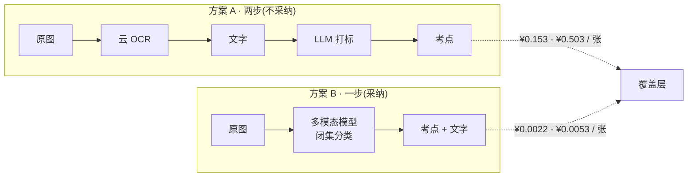

# 识别链路选型 · ASR 与图像识别

> 这份文档只回答一个问题:**采集端的语音和图片,交给谁处理。**
>
> 它是 `详细排期` 技术选型表和 `总路线图` §三b AI 能力索引的**依据层**——那两处只写结论,推导和价格在这里。
>
> **调研数据截至 2026 年 8 月,价格与模型可用性会过时。** 带 `⚠` 的项动手前必须复核。
> 尤其:本文推荐的视觉模型是**实验版本**,官方未承诺稳定性与下线时间表,见 §五。

---

## 一、结论

| 环节 | 结论 | 一句话理由 |
|---|---|---|
| **语音 → 文字** | 专用 ASR(腾讯云一句话识别) | 免费额度覆盖到关卡 3,且视觉模型不吃音频 |
| **图片 → 文字 + 考点** | **多模态大模型一步到位** | 比「OCR + LLM 打标」两步便宜 29-95 倍,且**少一个环节** |

**图片这条的关键不在便宜,在于少一步。** OCR 只产出文字,产品要的是**考点标签**,所以两步方案必然是 `图 → OCR → 文字 → LLM → 标签`。多模态把中间那次往返消掉了,顺带让 决策记录 §2.3 的原图红线更好守——原图只经过一个服务。

---

## 二、价格(2026 年 8 月)

### 多模态:`deepseek-v4-flash-vision-exp`

2026-08-21 上线,计费与 `deepseek-v4-flash` 一致。**一张图最多占 384 tokens,与原图尺寸无关**——2000×2000 与 5000×5000 消耗相同。

| | 高峰 | 低谷(半价) |
|---|---|---|
| 输入 · 缓存未命中 | $0.44/M | $0.22/M |
| 输入 · 缓存命中 | $0.014/M | $0.007/M |
| 输出 | $1.32/M | $0.66/M |

低谷时段为 UTC 周一至周五 01:00-04:00 与 06:00-10:00。

### 专用服务:腾讯云

| 服务 | 免费额度 | 后付费单价 |
|---|---|---|
| 一句话识别 | **5,000 次/月** | ¥3.2/千次(低档) |
| 录音文件识别 | 10 小时/月 | ¥1.75/小时 |
| 通用印刷体 OCR | 1,000 次/月 | ¥0.15/次(月<1万) |
| 通用文字识别高精度版 | 同上共享 | ¥0.50/次(月<1万) |

### 单张图片对比

按**最贵口径**估算:高峰时段、不用缓存、prompt 1,000 tokens、输出 100 tokens,汇率 ~7.1。

| 方案 | 单张成本 | 倍数 |
|---|---|---|
| **多模态一步** | **¥0.0053** | 1× |
| 通用印刷体 OCR + LLM 打标 | ¥0.153 | **29×** |
| 高精度版 OCR + LLM 打标 | ¥0.503 | **95×** |

考点树 prompt 是固定的,做缓存命中后多模态可压到 **¥0.0022/张**,差距拉到 70-229 倍。

**真实对比是那个 95 倍**:试题截图多栏排版带公式,通用印刷体版大概率不够用。

---

## 三、规模测算

假设活跃用户每天 3 条记录,其中语音 2 条、图片 1 张。

| 规模 | 语音/月 | 图片/月 | 语音成本 | 图片成本 | 合计 |
|---|---|---|---|---|---|
| 自用(阶段 0-1) | 90 次 | 45 张 | **¥0** | ¥0.24 | **≈¥0** |
| 10 用户(阶段 2) | 600 次 | 300 张 | **¥0** | ¥1.6 | **≈¥2/月** |
| 100 用户 | 9,000 次 | 4,500 张 | ¥12.8 | ¥23.9 | **≈¥37/月** |
| 1,000 用户 | 90,000 次 | 45,000 张 | ~¥272 | ~¥239 | **≈¥510/月** |

**结论:识别成本在可预见规模内都是几百元/月量级,不构成商业模型的约束。**

04 预算表里「语音识别 / OCR / LLM 调用 ~¥2,000」是**高估了一个数量级以上**——关卡 3 之前实际是两位数。已在 `执行清单` §三 与 `总路线图` §五 更正。

> 这不等于成本可以不管。真正会失控的不是单价,是**重复调用与无上限的 prompt**,由 `总路线图` §1.2.5.3 的四条约束管住。`P0-3` 的基线记录照旧。

---

## 四、三个必须先设计掉的坑

### 坑一:模型是分类器,不是标签生成器 🔴

**这条最重要。** 让多模态自由生成考点标签会同时踩两条线:

| 线 | 怎么踩上的 |
|---|---|
| 决策记录 §2.2 **宁缺毋滥** | OCR 出错是漏字,LLM 出错是**编造一个不存在的考点**。而错标会让覆盖度失真,那个指标就是整个产品 |
| 实施路径 §1.2 **标签自行命名** | 模型训练数据里全是机构的标准表述,放开生成大概率原样吐出「机构既有体系与措辞」 |

解法是同一个:**输入 = 图 + 自己的考点树候选,输出 = 树里的节点 ID 或「不匹配」。** 闭集分类,不许自由发挥。

这与 `总路线图` §1.2.5.1.2「候选召回,先缩小到 5-10 个候选考点」的设计一致,本文只是把**闭集**这个约束显式化:候选召回不只是省钱手段,更是**合规与准确性的实现方式**。顺带,输出只剩一个 ID,成本再降。

### 坑二:禁止使用 DeepSeek Files API 🔴

Files API 与视觉模型同期上线,功能是把图片传到平台存下、后续用 `file_id` 复用。**它与 决策记录 §2.3 的原图红线正面冲突**——那条线写的是原图只做本地缓存、不做长期云端存储,而且「这条第一天不定,后面改不回来」。

**必须走 base64 内联**,让图片过一次即弃。

这个坑容易踩,因为 Files API 是免费的,看起来像白送的优化。已登记为 `总路线图` 风险登记册红线项。

### 坑三:`Exp` 是实验模型 ⚠

官方明确标注实验性,但**未给出任何稳定性承诺、下线时间表或迁移说明**。

缓解:识别调用**必须走接口层抽象,保留一个切换点**。闭集分类的输入输出很简单(图 + 候选 → ID),换 Qwen-VL / 混元 vision / 通义 qwen-vl-ocr 的成本只是改一个 client。

备选参考(2026-08):Qwen3-Omni-Flash 图像 ¥3.3/M tokens;qwen-vl-ocr ¥0.006/千 tokens;腾讯混元开源 HunyuanOCR(1B,可自部署)。

---

## 五、合规:选型不改变结论

| 问题 | 结论 |
|---|---|
| 通过 API 调用**已备案模型**、不微调 | 由**地方网信办登记**,非国家网信办备案 |
| 纯内部使用、不向公众提供 | **目前不需要登记** → 阶段 0/1(自用)与阶段 2(10 人测试)不触发 |
| 触发点 | 关卡 2 之后正式上线时 |
| 一旦微调模型 | 升级为完整备案。**我们不微调** |

截至 2026-06-30,累计 988 款服务完成备案、598 款应用完成登记。

**腾讯云与 DeepSeek 在合规上等价**,只要所用模型已备案。

> **一个直觉误区值得说破:用 OCR 替代多模态并不能规避生成式 AI 登记。** 因为打标那一步照样要调 LLM(决策记录 §2.2 学科判断外包给外部模型),触发点绕不开。所以合规不构成选型差异,选型可以纯看技术与成本。

### 新增的产品义务

已上线的生成式 AI 应用须在**显著位置或产品详情页公示**所使用的生成式 AI 服务,**注明模型名称、备案号或上线编号**。

这是一个具体的界面需求,不是文档条款——设计稿里必须有这么一处。已登记为 `执行清单` `L-C` 档条目。

`L-A4` 的律师确认项**照旧未关闭**,本文只是把它从「可能卡死方向」缩小到「大概率走登记,需书面闭环一次」。

---

## 六、阶段 0 不改

`详细排期` 定的阶段 0 用本地 whisper + 系统原生 OCR,理由是「零调用成本、零网络依赖,专注测摩擦」。

**这个理由现在更强了。** 因为 `详细排期` 同一张表里写着「阶段 0 不做打标」,而多模态的全部优势恰恰在打标那一步——**阶段 0 用不上。**

本文该改的是**阶段 1/2 起的选型**,不是阶段 0。

> 思考模式 §盲区二:别让一次成本调研变成提前动手的理由。**关卡 0 的判据没有变**——还是那两周、那两个数字。

### 本机现状(2026-08-25 实测)

| 项 | 状态 |
|---|---|
| 芯片 | Apple M2 Max,mlx-whisper 跑得动 |
| mlx-whisper / faster-whisper | **未安装** |
| pyobjc Vision | **未安装** |
| `/usr/bin/shortcuts` | 存在,macOS 26.6.1 可零依赖调起 Vision OCR |

**`详细排期` 里的「本地模型」目前是计划不是现成能力。** 阶段 0 的拍照链路走 `shortcuts` 调系统 OCR 最省事。

---

## 七、来源

价格与监管数据均为 2026 年 8 月抓取,会过时:

- DeepSeek API 定价 / Vision 文档 — `api-docs.deepseek.com`
- 腾讯云文字识别计费概述 — `cloud.tencent.com/document/product/866/17619`
- 腾讯云文字识别免费额度 — `cloud.tencent.com/document/product/866/35945`
- 腾讯云语音识别计费概述 — `cloud.tencent.com/document/product/1093/35686`
- 网信办生成式人工智能服务已备案信息公告 — `cac.gov.cn`
- 阿里云百炼模型价格 — `help.aliyun.com/zh/model-studio/model-pricing`
