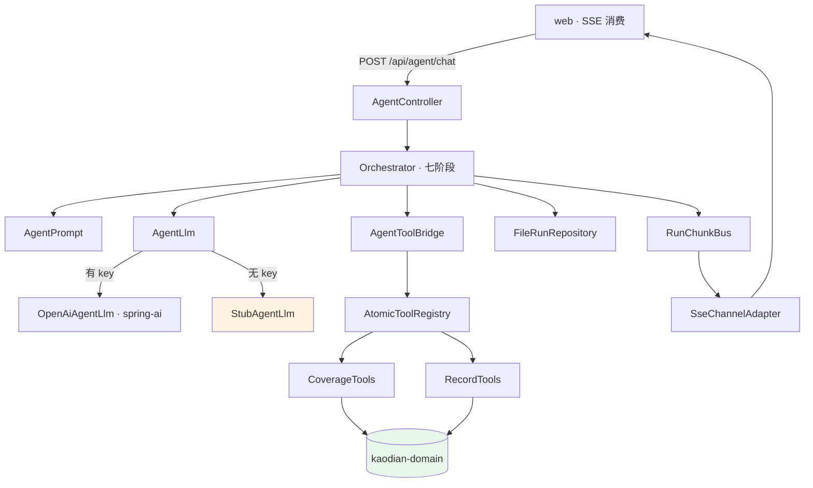

# Agent 框架与能力边界

> 这份文档补的是 `R-90`:`kaodian-agent` 已经存在(31 个类),而十四份文档里**零命中**。
>
> **简版。** 只记「它是什么形状、边界靠什么守、哪些位置刻意留空」,不展开实现——实现细节在代码注释里,那里写得比这里细。
>
> **本文只依据本仓库代码写成。** 形状参考了工作项目的架构文档写法,内容不引用任何公司材料(`R-08`「全套独立」)。
>
> ⚪ **阶段归属未定,见 §五。** 这是本文最该被质疑的一点:它今天服务过的真实用户数是 **0**。
>
> **2026-08-31 · 收纳位置已裁定(chenyj):本文移入 `docs/misc/`。**
> 裁定的是**它放哪儿**,不是它属于哪条管线 —— 两者是两个维度(`00` §3.2)。
> `docs/misc/` 收的就是「三条管线的读者判据都套不上」的文档,**它不是待办清单,也不是垃圾桶**:
> 进 `misc/` 必须在 `00` §2.4 或 §2.3 有一条对应登记(`00` §3.2)。
> **管线归属另有已存在的裁定**:`08` `R-90` 末尾「2026-08-29 定:归入产品轨(线 1)」——
> 那一句在本轮之前从未同步进 `00` §2.1,它本身就是「同一件事两处说法」的一个实例,已一并改掉。

---

## 一、它有多小,以及为什么

`Orchestrator` 的类注释自己说清了:

> truman-ai 的同名类是 3584 行。这里是三百来行,少掉的那些是:意图识别与 policy 路由、模型降级与故障转移、上下文压缩、澄清提问、敏感词门、灰度、运营指标上报、dossier……
> 那些东西每一件都解决了一个它那边**真实发生过**的问题。而这个 agent 到今天为止**一个真实用户都没有服务过** —— 提前把它们搬进来,搬进来的是形状不是判断力。

**一个能编排七个阶段却没人用的 agent,正是 `03` §盲区二 说的那种「能做的部分」。**

所以只保留骨架:七个阶段的位置都在、每个阶段该落的轨迹都落,但每个阶段里面只做今天真正需要做的事。要加东西时,位置是现成的。

---

## 二、系统形态

## 三、模块职责

| 包 | 职责 | 关键点 |
|---|---|---|
| `orchestrator` | 七阶段主控 | 三百来行。位置留着,内容不预先填 |
| `prompt` | 系统提示词 | **它只是请求模型别做某事**,不是防线(见 §四) |
| `llm` | 模型调用与工具桥 | `AgentLlm` 是接口;无 key 时 `StubAgentLlm` 生效,上下文照样起得来 |
| `tool/spi` | 工具契约与注册表 | `ToolLevel` 三级让「这一轮有没有副作用」成为程序能回答的问题 |
| `tool/impl` | 具体工具 | 全部只读,见 §五 |
| `channel` | SSE 出口 | `SseEmitter` 而非 `Flux` —— 为一个端点引 webflux,代价是两套线程模型并存 |
| `entity` | 运行态模型 | `AgentRun` / `AgentMessage` / `ToolCall` / `TraceEvent` |
| `storage` | run 落盘 | 文件实现,与行为层同一形态 |

**依赖方向**:`kaodian-agent` 只依赖 `kaodian-domain`。它看不见 `auth`,也看不见 `app` —— 由 pom 强制,不靠自觉(`10` §2.3 加注)。

## 四、能力边界:三道防线,今天有两道 🔴

`13` §1.3 对打标链路的原话是:**「不是靠 prompt 里写一句『不要讲解』,是在输出侧检」**。

| 防线 | 打标链路 | 对话面 |
|---|---|---|
| **数据面**(拿不到就做不到) | 候选只有 code 与名称,没有讲解例题 | ✅ **判断对错所需要的数据(题干、标准答案、解析)一个工具都拿不到** |
| **提示词** | 有 | ✅ 有,且 `AgentPrompt` 自陈它「只是请求模型别做某事,模型可以不听」 |
| **输出侧自检** | ✅ `enforceClosedSet` + 阈值裁决,都在接口层静态方法上 | ❌ **缺席** —— `R-91` |

> **数据面那道是结构性的,提示词那道不是。** 两道的分工必须说清,否则下一个人会以为改一句提示词就能放开边界(改不了)。
>
> 缺的那道难点是真的:打标的输出是闭集里的一个 code(可判),对话的输出是自由文本。可用的现成材料是 `web/scripts/capability-boundary-scan.mjs` 的硬/灰名单——它已经在扫前端文案。**是补一道流式输出的词表闸,还是书面承认这条面只靠数据面守,需要人定(`R-91`)。**

## 五、工具:三级分类,EFFECT 刻意为零

| 工具 | 级别 | 给出什么 |
|---|---|---|
| `coverage_summary` | READ | 覆盖率概览 |
| `blindspot_list` | READ | 盲区清单 |
| `node_detail` | READ | 考点详情 |
| `recent_records` | READ | 最近记录 |
| `study_cadence` | READ | 学习节奏 |
| `time_now` | COMPUTE | 当前时间 |

**`EFFECT` 一个都没有,而且这是刻意的**(`ToolLevel` 注释原文):能力边界只答「有没有、几次、多久前」;**模型误判一次,用户的覆盖率数据就被改了,而覆盖率是这个产品唯一的那个数**。

枚举值先留着,是因为 `AgentToolBridge` 里那道「EFFECT 需要显式放行」的门要有东西可挡。**何时改变:第一个写工具出现时,加它的人同时要回答「模型改错了怎么回滚」。**

## 六、运行态

`RunState`:`PENDING` → `RUNNING` → `SUCCEEDED` / `FAILED` / `TOOL_LOOP_LIMIT`
`OrchestratorPhase`:`RECEIVE` → `ADMIT` → `BOOT` → `PLAN` → `ACT` → `CONCLUDE` → `EMIT`

🔴 **`done` 帧一定要发出去。** 成功、失败、上游断流三条路径都必须走到 —— 前端靠它关掉 loading,而漏发只在出错时表现出来(界面永远转圈),出错路径恰恰是平时测不到的那条。

---

## 七、未决

| 项 | 内容 |
|---|---|
| `R-90` | **阶段归属未定。** `04`/`08` 的三条线里没有它的位置。它不是产品轨的关卡项,也不是合规轨或数据轨。**要么给它一个阶段,要么承认它是超出排期的一次探索** |
| `R-91` | 输出侧自检缺席(见 §四) |
| `R-92` | `/api/agent/chat` **无鉴权、无频控、无额度**,而它每次调用产生真实外部账单。`R-20`:「失控点是重复调用不是单价」。额度(`ai_ask`)标着关卡 2 后,所以「没额度」与阶段一致 —— **但「没额度」和「没频控」是两件事** |

> **自检:这一节比前六节重要。** 前六节描述的是一个已经写好的东西;这一节问的是它该不该在这个阶段存在。`08` §六 的判据没有变——**看 `1.1.4` 那张表有没有在填**。
