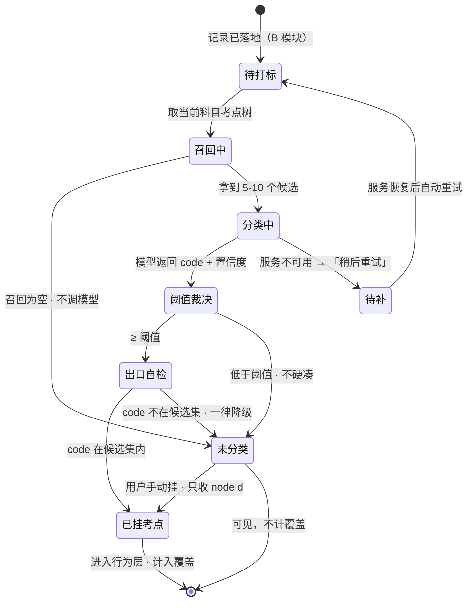

[← 文档索引](../INDEX.md) ｜ [脑图](22-产品模块脑图.md) ｜ [模块地图](20-产品模块地图与产品逻辑.md)

# 模块 C · 打标层

> **这份文档回答一件事：一条记录怎么变成「碰过某个考点」，以及在哪几种情况下它故意不变。**
> 四段管线里**有三段的作用是丢掉** —— 这不是保守，是「宁可丢弃率高，不可准确率低」的技术形态。
>
> **不是**模型选型与价格（在 [`09`](../data/09-识别链路选型.md)）、**不是**后端时序与接口层写法（在 [`13`](../technical/13-后端系统设计与组件接入.md) §1.3 / [`10`](../technical/10-技术架构与接口契约.md) §6.3）、
> **不是**界面稿（在设计侧）。本文写到「状态 + 转移条件 + 失败落点」为止，
> **不定阈值取多少**（在 `13`）、**不定返回结构**（在 `10`）。冲突时一律以被引文档为准。
>
> **基线：`origin/v1` @ `3253cb0`，fetch 于 2026-08-30T15:30Z。**
> **状态：活跃。** 管线段数增删、或两种失败形态被合并/拆分，本文同一次改动内更新。
>
> **本文对关卡 0 的贡献是零。** 本模块整个服务关卡 1。

---

## 一、在减法的哪一端

**减数的成形。** B 采集层收到的是「用户碰了点什么」，本模块决定它算不算「碰过某个考点」。

**唯一的产出是覆盖度，所以归错比漏掉贵得多** —— 归错会让覆盖度失真，而覆盖度失真的话，这个产品就没有指标了（`01` §2.2 / `13` §1.3）。本模块的每一段设计都从这句话推出来。

---

## 二、详细产品逻辑

### 2.1 四段管线，三段在丢弃

| 段 | 做什么 | 丢在哪 | 为什么这一段存在 |
|---|---|---|---|
| ① **候选召回** | 关键词/规则，把整棵树缩到 5–10 个候选 | **召回为空 → 直接未分类，不调模型** | 便宜手段先做，但这不是省钱技巧 —— **没有候选就没有「集」可闭** |
| ② **闭集分类** | 把字节 + 候选 code 列表交给模型，要一个 code | — | 🔴 模型只能**选**，不能**写** |
| ③ **阈值裁决** | 低于阈值 → NO_MATCH | **丢** | **不硬凑最接近的考点** |
| ④ **出口自检** | code 不在候选集里 → 一律降级 NO_MATCH | **丢** | 不是靠 prompt 写一句，**是在输出侧检** |

**①③④ 三段都在丢东西。** 只有②在产出。

⚠️ **③④ 写在接口层，不写在实现类里**（`13` §1.3）。产品侧要知道这件事的原因只有一个：**换厂商换的是实现类，换不掉这条线** —— 所以「换个更准的模型就能放宽阈值」这个提案在结构上就不成立。

### 2.2 三个终态，不是两个

| 终态 | 怎么来的 | 计不计覆盖 | 用户能做什么 |
|---|---|---|---|
| **已挂考点** | 命中候选里的 code 且 ≥ 阈值 | **计** | — |
| **未分类** | 召回为空 / NO_MATCH / 低于阈值 / 出口自检拦下 | **不计** | 自己从树里挑 |
| **待补** | 识别服务不可用 | **不计** | 等自动重试，也可手动挂 |

🔴 **「未分类」和「待补」必须是两句不同的话。** `server/` 已经用两种返回形态钉死了（`13` §1.5）：

| 情况 | 界面该说的话 |
|---|---|
| 模型看了，说不匹配 | **「自己从树里挑一个」** |
| 模型压根没看成 | **「稍后重试」** |

**混成一个返回值，界面上就只能说一句含糊的话。** 这一条是产品要求，不是技术偏好 —— 含糊的话会让用户以为是自己记错了，然后不再手动挂，减数就少了一块。

### 2.3 手动挂载：唯一的人工出口

未分类不是终点，是**等用户自己挑**。

🔴 **从树里选，不能新建。** 接口只收 `nodeId`，不收 `name`（`10` §6.3）。这是 `R-07` 在接口层的实现 —— **只要 API 上没有传入自由文本标签的通道，自由生成的考点就进不了库，无论模型输出什么。**

### 2.4 待补队列：记录已经在了

服务不可用时进队列，恢复后自动重试。**队列存在的前提是 B 采集层那条线：记录早就落地了**，队列里排的是「还没打上标」，不是「还没记下来」。

### 2.5 一条不该被优化掉的东西：未分类率

**未分类率高不是故障。** 它是「宁可丢弃率高」这条纪律正在生效的直接证据。

⚠️ 但它也可能是召回策略太窄。**两者在数据上长得一样**，而现在没有任何东西能把它们分开 —— 登记在 §六。

---

## 三、简要交互示意

**界面上只有两个地方与本模块直接相关：**

1. **未分类区** —— 可见、可挑、挑的时候只能从树里选（没有「新建标签」入口，**不是禁用，是不画**）
2. **待补提示** —— 与未分类分开呈现，用的是「稍后重试」那句话

**本模块没有第三个界面。** 阈值、候选数、置信度这些都不呈现给用户 —— 呈现了就是在请用户替产品做判断，而用户没有判断的依据。

---

## 四、前端行为意图 × 后端契约意图

| 子模块 | 前端行为意图 | 后端契约意图 | 真源 |
|---|---|---|---|
| 触发分类 | 不阻塞用户，结果异步呈现 | 🔴 **请求体不接受调用方指定标签文本**；候选由服务端召回 | `10` §6.3 |
| 两种失败 | **「模型说不匹配」与「模型没看成」必须是两句不同的话** | 两种返回形态，不合并成一个值 | `13` §1.5 |
| 手动挂载 | 从树里挑，**不能新建标签** | 只收 `nodeId`，不收 `name` | `10` §6.3 🔴 `R-07` |
| 确认 / 丢弃 | 用户可丢弃一个自动标签 | 丢弃置标志位，**可见但不计覆盖**；不改「来源」字段 | `10` §6.3 |
| 未分类区 | 可见、常驻、可挑 | 不计入行为层 | `13` §1.4 |
| 待补队列 | 条数可见 | 恢复后自动重试 | `13` §1.3 |
| 未分类率呈现 | **空** —— 呈不呈现给维护者，没定过 | **空** | §六 C-1 |

---

## 五、这个模块碰到的边界

| 边界 | 落在本模块上是什么形态 | 真源 |
|---|---|---|
| 🔴 **不生成标签文本** | 模型只能从候选里选 id 或返回不匹配；接口不收 `name`；界面没有「新建标签」入口 | `R-07` · `10` §6.3 |
| 🔴 **匹配不上就丢弃** | 阈值裁决 + 出口自检两道，都往「丢」的方向降级 | `01` §2.2 · `13` §1.3 |
| 🔴 **原图不落盘** | 图片在实现类内部 base64 内联，**不落盘、不进对象存储、不打进任何级别的日志** | `R-04` `R-52` · `09` §四 |
| ⛔ **不判断对不对** | 打标只回答「这条记录碰的是哪个考点」，不回答「答得对不对」 | `R-05` |
| ⛔ **不做学科教研** | 模型在这里只做归类，不做讲解、不做难度评估 | `01` §2.2 |

---

## 六、服务哪个关卡 · 缺口登记

**服务关卡 1。** `08` 编号 `1.2.5`；手动挂载与未分类兜底 `1.2.5.1.5`。

关卡 1 的判据是**差集结果符合自我认知**（`04` §关卡1）。本模块是那个判据最容易失守的地方：**频繁把学过的判成「未触达」→ 打标准确率或采集完整度不够 → 回阶段 0 重想**，而不是调阈值。

### 缺口

| # | 缺什么 | 形状 | 谁定 |
|---|---|---|---|
| C-1 | **「未分类率高」的两种成因分不开** | 纪律生效（模型该丢就丢）与召回太窄（本该命中却没召回）在数据上长得一样。这不是功能待办，**是判据本身的一个已知盲点** —— 与 `20` §七-② 同一类 | **登记，不裁定**。分开它需要一个抽样人工复核的动作，那是关卡 1 的事 |
| C-2 | **未分类记录的老化没定过** | 一条未分类记录挂三个月没人挑，它算什么？现在它永远停在那里 | 产品；关卡 1 之前不必定 |

**两条都只登记。** 按 `04`/`08` 只详化到下一个关卡的纪律，现在展开它们就是把注意力从关卡 0 那两个数上挪走。
