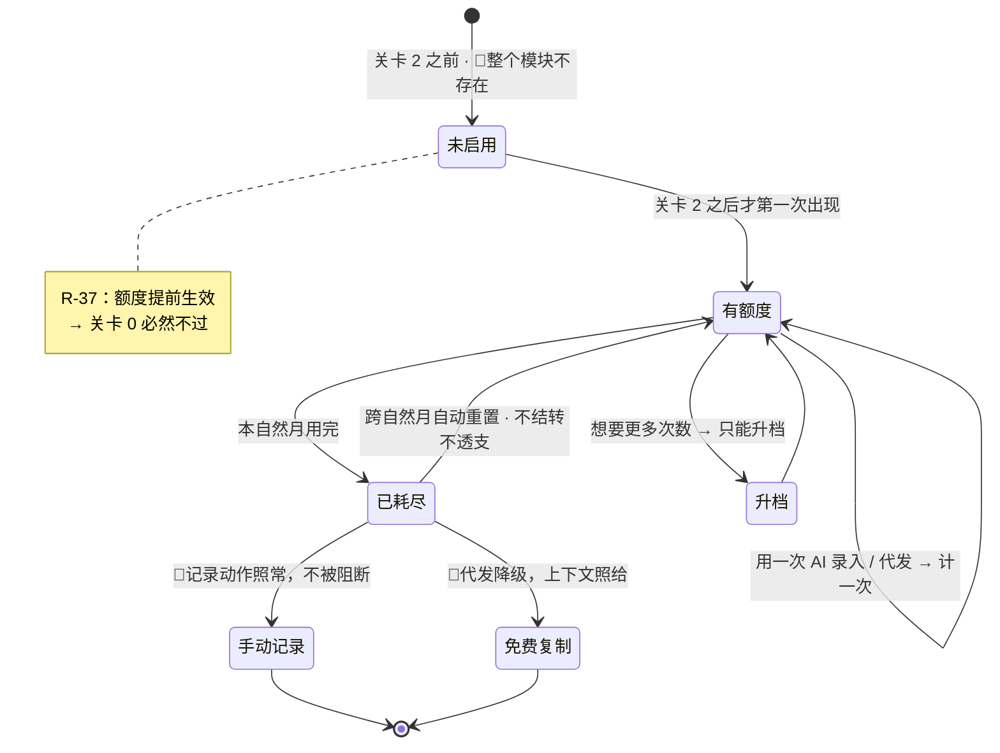
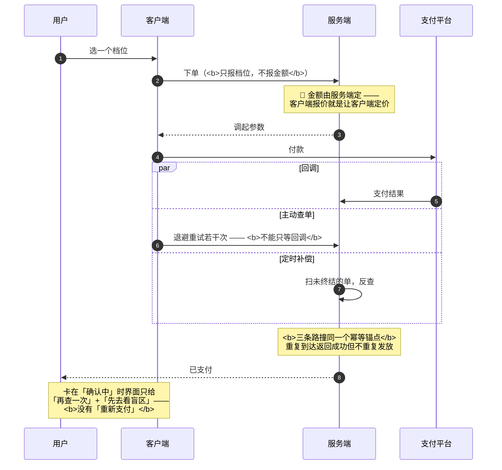

[← 文档索引](../INDEX.md) ｜ [脑图](22-产品模块脑图.md) ｜ [模块地图](20-产品模块地图与产品逻辑.md)

# 模块 G · 商业化

> **这份文档回答一件事：钱这一格在产品里长什么样，以及它在哪几个地方结构上不许出现。**
> 它不在减法的任何一端 —— 它只给**会产生按次外部账单的那两个动作**装一个计数器，
> 而产品全部的差异化（骨架、覆盖、盲区、导出）边际成本近似为零，**所以那些永远免费**。
>
> **不是**定价与单位经济测算（在 [`11`](11-商业化与额度设计.md)，含额度表、毛利、敏感度、支付合规）、
> **不是**订单与扣减的后端时序（在 [`13`](../technical/13-后端系统设计与组件接入.md) §1.10 §1.11）、**不是**接口契约（在 [`10`](../technical/10-技术架构与接口契约.md) §6.6 §6.7）、
> **不是**界面稿（在设计侧）。本文写到「状态 + 转移条件 + 失败落点」为止，
> **不定字段、不定接口、不写任何一个价格或额度数字** —— 那些数字只有 `11` 一处，本文只给指针。
>
> **基线：`origin/v1` @ `afab5a7`，fetch 于 2026-08-31T05:20Z。**
> **状态：冻结待触发。** 与 `11` 同一档 —— 关卡 2 之前本模块的正确状态是**不存在**（§2.6）。
>
> ⚠️ **本文服务关卡 2 之后，不服务关卡 0。** 写它不产生 `1.1.4` 那两个每日数字，一个都不产生。
> 而且 `11` §十 已经点名：**商业化文档是「注意力流向能动手做的部分」的顶级高发区**，
> 因为它给的是一种**已经在赚钱的错觉**。这句留在最前面。

---

## 一、在减法的哪一端

**支撑，而且是唯一一个「做得越少越对」的模块。**

计费的判据只有一条，和「用户觉得值不值钱」无关：**这个动作每执行一次，我方会不会收到一张按次的外部账单。**

| | 结果 |
|---|---|
| 会（AI 录入、AI 代发） | 进额度，**并入现有两维，不新开第三维** |
| 不会（骨架树、覆盖度、盲区清单、导出、MCP、手动记录） | **永久免费** |

**代价要认：产品最有价值的部分永远免费，收费的是最没有差异化的部分 —— 调 API 谁都会**（`11` §3.3 原话）。
这个代价被接受的理由只有一条：**北极星是主动查看盲区的人数，商业模型服从指标，不能反过来。**

---

## 二、详细产品逻辑

### 2.1 额度的状态与转移

| 状态 | 含义 | 用户看得见吗 |
|---|---|---|
| **未启用** | 关卡 2 之前 —— **本模块整体不存在**（§2.6） | 是，因为界面上一格都没有 |
| **有额度** | 本自然月还剩 | 是 |
| **已耗尽** | 本自然月用完 | 是 —— **但记录动作照常** |
| **已重置** | 跨自然月自动回满 | 是 |

三条口径的**形状**（数字在 `11` §一，本文不复述）：

- 按**自然月**重置，不按购买日滚动
- **不结转、不透支、不卖单次加油包** —— 加油包会是第三个计费维度，而只允许两个
- **耗尽不影响记录动作** —— 降级为手动记录

🔴 **最后一条是硬约束不是体验优化。** 「记录动作本身永不失败」不因商业化而改：
额度管的是「用得越多花得越多的能力」，不是准入。**一个记录工具因为没钱就记不下来，它就不是记录工具了。**

### 2.2 两条永不上锁 🔴

| 永不上锁 | 上锁的后果 |
|---|---|
| **盲区诊断** | 北极星从「有多少人想看」变成「有多少人肯为看付钱」——**关卡 2 的判据会混进支付转化率，从此无法被测量** |
| **导出** | `01` §2.2 写下的开放性承诺变成空话。「不限次数」四个字里**没有留下任何插入计费的位置** |

**这两条是不可逆决策，不是产品偏好。** 与原图红线同构：**上锁容易，解锁不可能** ——
一个从第一天就收费的能力后来免费叫「降价」，但**在它收费的那段时间里北极星已经被记错了，那段数据不可重建。
关卡 2 只能过一次。**（`11` §2.3）

> 顺带一条它撑起来的产品动作：订单卡在「确认中」时，界面给的是「再查一次」和「先去看盲区」——
> **后者能成立，正是因为盲区诊断永不上锁**（`13` §1.10）。红线在这里不是限制，是可用的降级出口。

### 2.3 一个例外，它划出规则的适用面

**短信验证码是按次外部账单、也是用户主动触发的，但它不进额度** —— 因为对它计费等于对注册计费。
它由频控与人机校验管住，**不由额度管住**：频控解决薅羊毛，额度解决成本分摊，**两者不能互相替代**（`11` §3.2）。

### 2.4 订单：三个状态，「确认中」不能就近归类

| 状态 | 转移条件 |
|---|---|
| **待支付** | 下单；同一档位再次下单**复用不新建** |
| **确认中** | 已付款、结果未终结 —— **独立的一态** |
| **已支付** | 回调 / 主动查单 / 定时补偿，**谁先到算谁** |
| **已关闭** | 超时未支付 |
| **已退款** | 见 §2.5，**规则未定** |

**「确认中」就近归到失败，比归到成功更糟**：归到成功是没收到钱却发了权益，
**归到失败是用户明明扣了款、界面说没付上，他会再付一次 —— 那是产品主动诱导重复付款**（`13` §1.10）。

**所以界面上不给「重新支付」按钮。** 这是本模块唯一一条「靠不给按钮来兑现」的产品要求。

### 2.5 退款：界面已画，后端从未定义 ⚪

订单列表里已经画着一笔「用了两天后退款」的已退款订单，而**「退款之后额度和权益怎么算」全文档集无处定义**。

`13` §1.11 给了三种写法与各自后果，并指出**规则属于用户协议、架构定不了**，待律师稿。

**但产品要补的那半格，律师稿替不了：**

> 三种写法里，「按已用比例扣退款金额」这一种**必须在支付页事先讲清楚，否则是事后改规则**。
> **「支付页上写什么」是产品的事**，不是律师稿的事，也不是架构的事。

**本文不裁定选哪一种**，只登记这半格是空的 —— 见 §六 G-1。

### 2.6 本模块在关卡 2 之前的正确状态是「不存在」🔴

这是全文最要紧的一段，而且它是一条**风险**不是一条设计：

> **免费档的额度折合日均约一次，而关卡 0 的判据是日均若干条。
> 额度只要在关卡 2 之前生效，关卡 0 必然不通过 —— 不是因为地基不成立，是因为额度把它卡住了。**（`R-37`）

而**一个被自己污染的关卡，和一个通不过的关卡，在决策上无法区分**。所以：

- 阶段 0-2 **不实现任何额度计数**，不画任何支付或额度界面
- 首批外部用户**完全免费**

**本模块最正确的执行动作，是在关卡 2 之前一行都不落地。**

### 2.7 失败落点

| 哪一环出问题 | 落到哪 | 用户看到什么 |
|---|---|---|
| 额度耗尽 | **降级为手动记录**，不阻断 | 少了自动打标，可手动挂考点 |
| AI 代发额度耗尽 | 降级为**免费复制路径** | 上下文照给，自己粘出去问 —— **这条路径永不移除** |
| 代发调用失败 | **不扣次数** | 可重试 |
| 支付回调没到 | 主动查单 / 定时补偿兜底 | 「再查一次」+「先去看盲区」，**没有「重新支付」** |
| 回调金额对不上 | 拒绝并告警，**不发放** | 停在确认中 |
| 退款发生 | **未定义** ⚪ | 未定义 —— 见 §2.5 |

---

## 三、简要交互示意

**图里有两条线不能动**：`已耗尽 → 手动记录` 与 `已耗尽 → 免费复制`。
它们都不是降级体验，是**不许上锁的那部分在额度耗尽时的具体形态**。

订单那一段跨前后端，值得单独看 —— **三条路指向同一次发放**：

---

## 四、前端行为意图 × 后端契约意图

| 子模块 | 前端行为意图 | 后端契约意图 | 真源 |
|---|---|---|---|
| 额度 | 耗尽时降级为手动记录，**不阻断记录动作** | 扣减**没有独立端点**，只发生在 AI 端点内部；**失败不扣** | `10` §6.7 🔴 |
| 额度展示 | 把额度换算成**用量**呈现，不只呈现次数 | 服务端返回剩余量 | `11` §一 · `R-48` |
| 档位与定价 | 档位与额度由服务端返回，**前端不硬编码** | 下单只收档位码，**金额由服务端定** | `10` §6.6 🔴 |
| 盲区诊断 | 🔴 **不存在付费入口** | 无计费挂钩 | `11` §2.1 🔴 |
| 导出 | 🔴 **不限次数、无水印、无删减** | 无计费挂钩 | `11` §2.2 🔴 |
| AI 代发 | 额度用尽降级为免费复制；**回答区标注来源模型** | 代发端点内部扣减；**答案不落库** | `11` §五 · §六 G-2 |
| 订单 · 确认中 | **不给「重新支付」**，给「再查一次」+「先去看盲区」 | 三路幂等，重复到达不重复发放 | `13` §1.10 |
| 续费 | 把「不自动扣费、到期就停」**写在购买页当卖点**，不藏进协议 | 续费是延长到期时间，不新建 | `11` §6.3 |
| **退款** | 订单列表里**已经画了已退款订单** | **空** ⚪ | **§六 G-1** |

---

## 五、这个模块碰到的边界

| 边界 | 落在本模块上是什么形态 | 真源 |
|---|---|---|
| 🔴 **盲区诊断永不上锁** | 结构上不存在付费入口。上锁会污染关卡 2 判据，而**判据被污染的结果不是数字变差，是数字变得没有意义** | `11` §2.1 |
| 🔴 **导出永不上锁** | 无删减、无水印、不限次数 —— 字面意思 | `11` §2.2 |
| 🔴 **不引导至外部支付** | 小程序自带完整支付路径；**不做分端差价** —— 差价本身就是一条指向外部支付的箭头 | `R-36` · `11` §6.2 |
| 🔴 **不做教研** | 代发只组装上下文 + 代调 + 原样透出，**不摘要、不评分、不加工**；答案不进覆盖度 | `11` §5.2 |
| 🔴 **不存内容** | 代发的答案不落库 —— 库里**没有字段能装下一段答案** | `11` §5.4 · `R-06` |
| ⛔ **不做积分 / 打卡 / 徽章** | 会员权益里不出现任何以打开次数为奖励对象的东西 | `10` §十 |

---

## 六、服务哪个关卡 · 缺口登记

**服务关卡 2 之后。** 支付**通道**最早能存在的时点在关卡 2 之后（依赖小程序，小程序依赖备案）；
**付费验证本身在关卡 3 之后**（`04` 阶段 4 / `05` `L-D` 档 / `08` §2.4）。
**阶段 0-2 一个支付界面都不需要，首批外部用户完全免费。**

### 缺口

| # | 缺什么 | 形状 | 谁定 |
|---|---|---|---|
| G-1 | **退款：支付页上写什么** ⚪ | 后端三种写法待律师稿，但其中一种**必须事先在支付页讲清**，否则是事后改规则。这半格律师稿替不了 | **产品** —— 但**关卡 3 之前不必定**，且我**不裁定选哪一种写法** |
| G-2 | **代发的免费/付费两条路径都没有接口契约行** 🔴 | 与 `27` §六 `E-1` 是**同一个缺口**，不是第二个 —— 它挂在 E 出口层，本模块只是它的计费侧 | 技术同事补契约。**本文不重复登记，只指过去** |
| G-3 | **只有一个付费档 → 没有价格锚点** | `R-48` 已登记。缓解只有一条且很弱：**购买页用「用量」当锚点顶替「价格」锚点** | 产品可执行这一条缓解；**加不加第二档要等真实用量分布，不是现在猜** |

### 一句必须留在最后的话

`11` §十 已经写过，本文照抄不改：**这里面没有一个数字来自真实用户。**
价格是猜的，额度是猜的，毛利率是从这些猜的数字里算出来的，
连「有人肯掏钱」这个前提本身都还没被验证过。

**本文把这些猜测整理成了状态图，整理不会让它们变成事实。**
自检仍只有一条：`1.1.4` 那张表有没有在填。**关卡 0 都还没过。**
