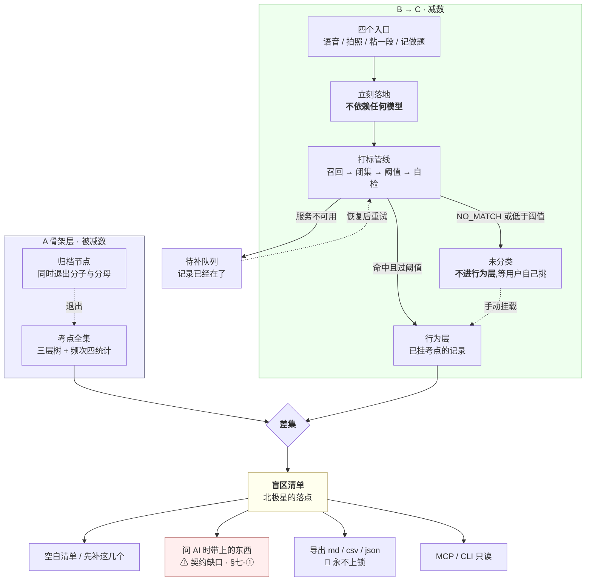

# 产品模块地图与产品逻辑

> **这份文档回答一件事:这个产品由哪些模块组成,每个模块在「减法」的哪一端,以及它服务哪一个阶段。**
>
> **它不是接口契约**(在 `技术架构与接口契约` / `后端系统设计与组件接入`)、**不是排期**(在 `执行清单` / `阶段 0 至阶段 2 · 详细排期` / `总路线图 · 脑图与父子待办`)、**不是界面稿**(在设计侧)、
> **不是新的产品决策**。本文一个字段、一个数字、一条判据都不定义 —— 每一格都是**指针**。
> 与被引文档冲突时,**一律以被引文档为准**,并回来改本文(§八)。
>
> **基线:`origin/v1` @ `afab5a7`,fetch 于 2026-08-31T05:20Z。** 双向核对干净(上一版基线 `3253cb0`)。
> 目录归属与编号按 `文档规范与目录` §六 的动作清单办:§2.1 已加行、§2.3 已领号 `产品模块地图与产品逻辑`。
> **2026-08-31 本文随方案 B 移入 `docs/product/`,编号不变**(`文档规范与目录` §3.2)。
>
> **状态:活跃。** 产品模块增删、或某个模块的阶段归属被人裁定,本文同一次改动内更新。
>
> **2026-08-30 分层,2026-08-31 补齐:本文之下开了一层。** 脑图移到 [`产品模块脑图`](产品模块脑图.md)(markmap 格式,可折叠);
> **A–G 七组各有一份展开文档** [`模块 A · 骨架层`](modules/模块A-骨架层.md)–[`模块 G · 商业化`](modules/模块G-商业化.md)。
> **本文仍然是那张地图**,只回答「有哪些模块、各归哪个阶段」;「模块自己怎么运转」在各模块文档里。
> **H 组当前没有展开文档,X 不单独成文** —— [`产品路线图与用户共创`](../misc/产品路线图与用户共创-已作废.md) 已于 2026-08-31 作废(裁定人 chenyj),逐组落点与理由在 §九。
>
> **这份文档对阶段 0的贡献是零。** 阶段 0 要的是「自用两周、每天记两个数」(`实施路径` §阶段0 / `总路线图 · 脑图与父子待办` `1.1.4`),
> 画模块图一个数都不产生。这句留在最前面,因为画产品全景图正是 `思考模式与选择框架` §盲区二 点名的那类工作 ——
> 进展可量化、做起来舒服、不需要面对任何一个真实用户。

---

## 零、与既有文档的关系

**本文不推翻任何章节,不登记任何新结论。** 三条自我约束:

| 约束 | 具体 |
|---|---|
| **只画结构,不定内容** | 模块名从既有文档里取,不发明。任何一格想写下新判断,都说明写错了地方(`文档规范与目录` §七) |
| **不复述数字与字段** | 额度数字在 `商业化与额度设计` §一、字段在 `技术架构与接口契约` §5.2 与 `后端系统设计与组件接入` §八、阶段验收判据在 `实施路径`。本文只给「见 X §Y」 |
| **阶段归属取自 `总路线图 · 脑图与父子待办` 待办树的编号** | 不自行判定一个模块属于哪个阶段。`总路线图 · 脑图与父子待办` 里挂在 `1.1.x` 的就是阶段 0,挂在 `1.4.x` 的就是阶段 2 后 |

§七 登记的三个缺口**不裁定**,原样交出去。

---

## 一、一句话产品逻辑:这是一个减法

**盲区 = 骨架层 − 行为层。**(定义在 `后端系统设计与组件接入` §1.4,本文不改)

整个产品只有两件事:**把被减数维护好**(考点全集),**把减数收全**(用户实际碰过的)。
剩下的每一个模块,要么在减法的左端,要么在右端,要么是把差值送出去的出口。

**判断任何一个模块该不该存在,先问它在这个减法的哪一端。** 答不上来的,进 §七 待裁定,不硬塞进某个模块。

**唯一的产出是覆盖度,所以宁可丢弃率高,不可准确率低**(`项目现状与决策记录` §2.2 / `后端系统设计与组件接入` §1.3)—— 归错会让覆盖度失真,
而覆盖度失真的话,这个产品就没有指标了。

---

## 二、产品模块脑图

**脑图不在本文,在 [`产品模块脑图`](产品模块脑图.md)。**

移出去的理由是可数的:原来这里是一张 Mermaid `mindmap`,61 个节点已经贴着它的上限 ——
**它不可折叠、节点一多必然重叠、且没有布局控制**,而模块拆细之后只会更多。
`产品模块脑图` 用 markmap 格式:**源文件就是一份 Markdown 缩进列表**,不装任何东西打开是可读的大纲,
用 markmap 打开是可折叠可缩放的脑图。**图坏了内容不跟着坏。**

两种图各管一件事,这条边界写死,免得本文又长回一张什么都塞的大图:

| 图 | 只回答 | 放在哪 |
|---|---|---|
| **脑图**(markmap) | 有什么、挂在谁下面 | [`产品模块脑图`](产品模块脑图.md) |
| **流程图**(Mermaid) | 怎么走、在哪失败 | 各模块文档 [`模块 A · 骨架层`](modules/模块A-骨架层.md)–[`模块 G · 商业化`](modules/模块G-商业化.md) 的 §三,以及本文 §四 |

**`X` 不是一个功能模块,是这张图的负空间。** 它不属于任何阶段,它约束所有阶段 —— 展开见 §六。

---

## 三、模块 × 阶段:每一格都要能填,填不出就停在待裁定

`实施路径` 定义阶段 0/1/2/3,判据 pass/fail **由人判**。下表的阶段归属**取自 `总路线图 · 脑图与父子待办` 待办树的编号**,不自行判定。

**本文之下这一层一共八份:** 脑图 [`产品模块脑图` 产品模块脑图](产品模块脑图.md)(markmap,只答「有什么、挂在谁下面」),
加 **A–G 七组各一份展开文档**,写「模块自己怎么运转」:
[`模块 A · 骨架层` A 骨架层](modules/模块A-骨架层.md) · [`模块 B · 采集层` B 采集层](modules/模块B-采集层.md) · [`模块 C · 打标层` C 打标层](modules/模块C-打标层.md) · [`模块 D · 差集层` D 差集层](modules/模块D-差集层.md) · [`模块 E · 出口层` E 出口层](modules/模块E-出口层.md) · [`模块 F · 账号与端` F 账号与端](modules/模块F-账号与端.md) · [`模块 G · 商业化` G 商业化](modules/模块G-商业化.md)。
**H 组当前没有展开文档**([`产品路线图与用户共创`](../misc/产品路线图与用户共创-已作废.md) 已作废)**,X 不单独成文,理由在 §九。**
下表不变,它仍然是唯一的模块 × 阶段对照表。

| 模块 | 在减法的哪一端 | 服务阶段 | `总路线图 · 脑图与父子待办` 编号 | 真源 |
|---|---|---|---|---|
| **A 骨架层** | 被减数 | **阶段 1** | `1.2.1`–`1.2.3` `1.2.7` | `实施路径` §1.2、`基础数据 · 抓取范围与渠道`(原料来源) |
| A · 节点归档 | 被减数 | 阶段 1 | `R-49` | `后端系统设计与组件接入` §1.4 |
| **B 采集层 · 四入口** | 减数入口 | **阶段 0** | `1.1.1` `1.1.2` | `后端系统设计与组件接入` §1.2 |
| B · 离线队列 | 减数入口 | 阶段 0 | `1.1.2b` | `总路线图 · 脑图与父子待办` `1.1.2b` |
| B · 原图留存与到期归档 | 减数入口 | 阶段 0 | `1.1.3` 🔴`R-04` | `技术架构与接口契约` §八、`原图存储：判据层与存储层` |
| B · 记录动作永不失败 | 减数入口 | 阶段 0 起 全程 | `1.3.7.1` | `后端系统设计与组件接入` §1.1 §1.5 |
| **C 打标层** | 减数成形 | **阶段 1** | `1.2.5` | `后端系统设计与组件接入` §1.3、`识别链路选型 · ASR 与图像识别` 坑一 |
| C · 手动挂载与未分类兜底 | 减数成形 | 阶段 1 | `1.2.5.1.5` | `技术架构与接口契约` §6.3 |
| **D 差集层 · 覆盖度与盲区** | 减法本身 | **阶段 1** | `1.2.8` | `后端系统设计与组件接入` §1.4 |
| D · 正向断言 我已掌握 | 减法本身 | 阶段 2 | `技术架构与接口契约` §6.4 | `技术架构与接口契约` §6.4 |
| D · **反向断言 我卡住了** | 减法本身 | **阶段 2 后 · 未排期** | `1.4.5` | 缺口,见 §七-② |
| **E 出口 · 盲区清单与 Top N** | 出口 | **阶段 1** | `1.2.8.4` | `技术架构与接口契约` §6.4 |
| E · 导出 三格式 | 出口 | 阶段 2 | `1.3.6` 🔴 | `商业化与额度设计` §2.2 |
| E · **问 AI 时带上的东西** | 出口 | **说不清** | 未收录 | 缺口,见 §七-① |
| E · AI 代发提问 | 出口 | 阶段 2 后 | `商业化与额度设计` §五 | 缺口,见 §七-① |
| E · MCP / CLI 只读 | 出口 | 阶段 2 后 | `1.4.2` | `技术架构与接口契约` §6.5 |
| **F 账号体系** | 支撑 | **阶段 2** | `1.3.1` | `后端系统设计与组件接入` §1.6–§1.10 |
| F · 微信授权与打通 | 支撑 | 阶段 2 后 | `1.4.1` | `后端系统设计与组件接入` §6.1 |
| F · 端矩阵 · Web/H5 | 支撑 | **阶段 2** | `1.3.2` | `多端选型与端矩阵`(分支) |
| F · 端矩阵 · 桌面 / iOS / Android | 支撑 | **无** | 不在 `总路线图 · 脑图与父子待办` 产品轨 | `多端选型与端矩阵` §一,自述贡献为零 |
| F · 端矩阵 · 微信小程序 | 支撑 | 阶段 2 后 | `执行清单` `L-C` 档 | `多端选型与端矩阵` §3.6 |
| **G 商业化** | 支撑 | **阶段 2 后** | `商业化与额度设计` §零 | `商业化与额度设计` §一 §二 |
| G · 退款 | 支撑 | **说不清** | 未定义 | 缺口,见 §七-③ |
| **H 对外路线图与共创** | 支撑 | **无 —— 真源已作废,不是「待定」** | 无 | ⛔ 原真源 `产品路线图与用户共创` 已作废(2026-08-31),**这一组当前没有真源**。重建时另领新简称,不改那份作废文档(`文档规范与目录` §六 第 10 条) |
| **X 边界层** | — | **无 · 约束全部** | 见 §六 | `项目现状与决策记录` §2、CLAUDE.md |

### 3.1 这张表填完之后第一眼看到的东西

`文档规范与目录` §2.5 已经按**文档**口径数过一次「服务阶段为无」的量,那个数字是项目经理的,本文不复述。
本文换一个口径 —— 按**模块**数:

| 口径 | 值 |
|---|---|
| 表里的模块行 | **24**(另有 `X 边界层` 一行,它不是模块是负空间,不进这个口径) |
| 服务阶段 **0 / 1** 的(阶段 0 尚未通过,这是当前唯一有效的工作面) | **10** |
| 服务阶段 2 及之后的 | **10** |
| **服务阶段「无」或「说不清」或「待裁定」的** | **4**:桌面/iOS/Android 端、问 AI 带上的东西、退款、对外路线图 |

> ⚠️ **上一版这里写的是「23 行 / 10 / 9 / 4」,三个分项加起来自洽,但与上面那张表对不上** ——
> 表里实际是 24 个模块行(`X` 另计),阶段 2 及之后是 10 行不是 9 行。
> **一组内部自洽的数字不等于它数对了东西**,而自洽正是它一直没被发现的原因。数它的命令写在这里,下次别用眼睛数:
> `awk '/^\| 模块 \|/,/^### 3.1/' docs/product/INDEX.md | grep -c '^| '`

**这四格里,「端矩阵 · 桌面 / iOS / Android」是唯一一格已经有实测产出的。**
`多端选型与端矩阵` §一 记着 macOS 实测可装可开、iOS 模拟器跑通、Android 代码侧已验 —— 三个端,而 `总路线图 · 脑图与父子待办` 产品轨里
阶段 2 之前只要一个 Web/PWA(`1.3.2`),`1.3.2.1` 甚至明写「不做小程序,行政流程不进关键路径」。

**这不是「端做多了」的意思,砍不砍是人的裁定,不是我的。** 我只把它放在这张表里,因为按我的标尺 ——
**它是否让「主动查看盲区的人数」上升** —— 一个端在阶段 0 没过之前多装一台机器,这个数不动。
`多端选型与端矩阵` 自己已经把这句话写在头注里了,本文只是让它在模块口径上也可数。

---

## 四、产品主逻辑流

三条线,一条主干两条分支。**主干上任何一步失败,记录都必须已经落地了。**

**这张图里有两条线不能动:**

1. **`W` 在 `TAG` 之前** —— 识别、转写、打标全部在落地之后。任何把识别放到写入之前的重构,都是在拆掉
   「记录动作本身永不失败」(`后端系统设计与组件接入` §1.1 原话)。
2. **`UNC` 不进 `BEH`** —— 记了但没认出来 ≠ 碰过这个考点。计进去就是拿记录数冒充覆盖(`后端系统设计与组件接入` §1.4)。

---

## 五、每个模块的两端:前端行为意图 × 后端契约意图

**这一节的存在理由:不留「这块后端看着办」的缺口。** 每一行都是**意图**,不是契约本身 ——
契约的真源在 `技术架构与接口契约` §六 与 `后端系统设计与组件接入`,这里只声明「两边各自该管什么」,以及**哪一格是空的**。

| 模块 | 前端行为意图 | 后端契约意图 | 契约真源 |
|---|---|---|---|
| B 四入口 | 按下即完成,不等识别结果;状态可见 | 一次写入返回标识;请求体里**没有**指向已上传文件的引用 | `技术架构与接口契约` §6.2、`后端系统设计与组件接入` §1.2 |
| B 离线队列 | 无网时本地排队,队列条数可见 | 按客户端幂等键去重,批量补传有条数上限 | `技术架构与接口契约` §6.2 |
| B 原图 | 本机留存,到期转归档;不提供任何分享入口 | 内联一次即弃,服务端全程不落盘;库里只有一个枚举值 | `技术架构与接口契约` §八 🔴 |
| C 打标 | 「模型说不匹配」与「模型没看成」必须是两句不同的话 | 两种返回形态,不合并成一个值 | `后端系统设计与组件接入` §1.5 |
| C 手动挂载 | 从树里挑,**不能新建标签** | 只收节点 id,不收标签文本 | `技术架构与接口契约` §6.3 🔴`R-07` |
| D 覆盖度 | 归档计数常驻可见,归档区永远可找回 | 未分类不计分子;归档同时退分子与分母 | `后端系统设计与组件接入` §1.4 `R-49` |
| D 正向断言 | 「我已掌握」独立于覆盖度呈现 | 只收节点 id | `技术架构与接口契约` §6.4 |
| D **反向断言** | 「我卡住了」—— 界面意图已登记 | **空** | **缺口 §七-②** |
| E 盲区清单 | 点进去这个动作本身就是北极星,埋点只埋它 | 排除已断言节点,按频次排序 | `技术架构与接口契约` §6.4、`总路线图 · 脑图与父子待办` `1.3.5` |
| E 导出 | 无删减、无水印、不限次数,注销前主动提示先导出 | 三格式;内容只含来源名称、时间、考点标签与统计 | `商业化与额度设计` §2.2 🔴 |
| E **问 AI** | 免费复制路径永不移除;回答区标注来源模型 | **空**(行为写在 `商业化与额度设计` §五,端点没有) | **缺口 §七-①** |
| E MCP 只读 | 在 Web 界面手动签发只读令牌 | 四道锁冗余,只读写进凭证本身 | `技术架构与接口契约` §6.5 |
| F 账号合并 | 合并前给预览,不可逆动作要二次确认 | 预览只读无副作用;确认需一次性令牌 | `技术架构与接口契约` §6.1 |
| F 注销 | 响应里必须带导出入口提示 | 删除时点**未决**,待律师稿定 | `技术架构与接口契约` §6.1 ⚠ |
| G 额度 | 耗尽时降级为手动记录,不阻断记录动作 | 扣减**没有独立端点**,只发生在 AI 端点内部,失败不扣 | `技术架构与接口契约` §6.7 🔴 |
| G 定价 | 档位与额度由服务端返回,**前端不硬编码** | 下单只收档位码,金额由服务端定 | `技术架构与接口契约` §6.6 |
| G **退款** | 订单列表里**已经画了已退款订单** | **空** | **缺口 §七-③** |
| H 路线图 | ⛔ **原形态随 `产品路线图与用户共创` 作废,当前无产品结论** | 无 | 已作废,见 §九 |
| H 反馈流 | ⛔ **原形态随 `产品路线图与用户共创` 作废,当前无产品结论** | 无 | 已作废,见 §九 |

---

## 六、边界层:脑图的负空间

**这一节和 §二 那张图同等重要。** 产品的形状一半由它做什么决定,一半由它**结构上做不到什么**决定。

| 边界 | 落到产品上是什么形态 | 真源 |
|---|---|---|
| **永不判断「对不对」** | 界面与输出中不出现正确率、得分、排名、讲解、学习建议、复习提醒、连续打卡、成就徽章 | `项目现状与决策记录` §2.2、🔴`R-05` |
| **不做学科教研** | 学科判断一律外包给外接模型;产品只做上下文组装与原样透出,不摘要不评分不加工 | `商业化与额度设计` §5.2 |
| **不存题干与机构内容** | **库里不存在能装下题干的字段,连预留位都不留**;只记来源名称与时间 | 🔴`R-01` `R-06`、`技术架构与接口契约` §5.1 |
| **不生成标签文本** | 自动打标只能从候选集里选一个 id 或返回不匹配 | 🔴`R-07`、`技术架构与接口契约` §6.3 |
| **匹配不上就丢弃** | 未分类可见但不计覆盖度。**宁可丢弃率高,不可准确率低** | `后端系统设计与组件接入` §1.3 |
| **原图不上云不共享** | 到期转本机归档;不做任何形式的图片分享或外链 | 🔴`R-04`、`技术架构与接口契约` §8.1 |
| **盲区诊断与导出永不上锁** | 两条不可逆决策,不是产品偏好 | 🔴 `商业化与额度设计` §二 |
| **不做积分 / 成长体系 / 签到打卡** | 它奖励的是打开次数,而北极星是主动查看盲区的人数 —— **用一个更容易涨的指标代理一个更难涨的指标,是把指标本身换掉** | `技术架构与接口契约` §十 |
| **提案数与投票数不进任何看板** | 同上一条同构。⚠️ 原真源 `产品路线图与用户共创` §五 已随 `产品路线图与用户共创` 作废;**这条边界本身不随它作废** —— 它是上一行那条的同一形状,真源改指 `技术架构与接口契约` §十 | `技术架构与接口契约` §十 · `项目现状与决策记录` §2.2 |

**最后三条是同一条。** 注册数、日活、使用时长、打开次数、提案数 —— 每一个都能靠别的手段做高,
而且做高了**不会让任何一个人多看一次自己的盲区**。

---

## 七、三个缺口:前端有行为、后端无契约

**以下三项我不裁定。** 每一项都是**同一种形状**:界面侧已经有了明确意图(甚至已经画进稿子),
而后端契约里没有对应的位置。按我的边界,产品可以指出缺口,**契约由技术同事定**。

### ① 「问 AI 时带上的东西」两条路径都没有接口契约 🔴 最要紧的一条

| 事实 | 出处 |
|---|---|
| 免费复制路径 `D8`/`H8` **已经存在**,但决策层与 `技术架构与接口契约` 都未收录 | `商业化与额度设计` §5.3 原话 |
| 付费代发的**行为**写在 `商业化与额度设计` §五 | `商业化与额度设计` §5.1 |
| `技术架构与接口契约` §6.7.1 提到「**代发端点**」的内部扣减时机 | `技术架构与接口契约` §6.7.1 |
| `技术架构与接口契约` §六 的契约表里**没有任何一行**是这两条路径 | 通读 §6.1–§6.7 |

**为什么这一条排第一:它接在北极星指标的正下游。** 阶段 2 的第二个判据是「看到缺口清单后点进去的比例」
(`实施路径` §2.2「第二个指标最关键」),而用户点进去之后,产品给他的**下一个动作**就是这个 ——
把上下文复制出去问模型。这条路径没有契约,意味着**北极星落点之后的第一步是靠记忆传递的**。

**需要谁做什么:** 技术同事补 `技术架构与接口契约` §六 的契约行(免费组装 + 付费代发各一行),
并明确「组装上下文是零边际成本、不计费」(`商业化与额度设计` §三 已给规则)在端点层怎么体现。

### ② 「我卡住了」反向断言:契约缺席

`技术架构与接口契约` §6.4 的断言端点**只有正向**(「我已掌握」),`后端系统设计与组件接入` §1.1 的全景图里也没有它。
`总路线图 · 脑图与父子待办` `1.4.5` 已经把它登记为待办,并写了它的诊断价值高于正向 ——
**因为「碰过但没通过」这一类,在 `盲区 = 骨架层 − 行为层` 里现在完全不可见:碰过就算覆盖。**

**这不是要现在做。** `总路线图 · 脑图与父子待办` `1.4.5` 挂在「阶段 3+,只列节点不排期」,现在动它就是 `R-85` 的又一个实例。
登记在这里的原因只有一个:**它是差集定义本身的一个已知盲点**,不是一个功能待办。

### ③ 退款:界面已画,后端从未定义 ⚪

`后端系统设计与组件接入` §1.11 自己登记了这个缺口:`notetool-ui-a` D18 的订单列表里已经有一笔已退款订单,
而「退款之后额度和权益怎么算」全文档集无处定义。`后端系统设计与组件接入` 给了 A/B/C 三种写法与各自后果,
并指出**规则属于用户协议,架构定不了,待 `L-A5` 律师稿**。

**产品侧要补的那一半,律师稿替不了:** `后端系统设计与组件接入` 的写法 C(按已用比例扣退款金额)**必须在支付页事先讲清楚,
否则是事后改规则**。「支付页上写什么」是产品的事,不是律师稿的事,也不是架构的事。
本文只登记这半格是空的,**不裁定选 A / B / C**。

---

## 八、这份文档最容易被用错的方式

| 用错的方式 | 为什么是错的 |
|---|---|
| **拿它当产品设计** | 它只有模块名与归属。每个模块具体长什么样,在设计稿与 `技术架构与接口契约` / `后端系统设计与组件接入` 的契约里。**这里写得越细,就越会变成第二处说法** |
| **拿 §三 那四格去砍端或砍模块** | 与 `文档规范与目录` §七 同一条:那一格是让事实可数,不是删除许可。砍不砍是人的裁定 |
| **把 §七 的三个缺口当 TODO 自己补上** | 缺口的形状是「前端有行为、后端无契约」。产品自己去补契约,补出来的就是第二份契约。**指出缺口是产品的活,定契约不是** |
| **把它当进度** | 画完模块图不等于任何一格推进了。自检仍只看 `总路线图 · 脑图与父子待办` §六那一条:`1.1.4` 那张表有没有在填 |
| **在这里写新的产品判断** | 本文只有结构与指针。任何新判断都属于它归属的那份文档 |

**最后一条,和 `实施路径` 与 `技术架构与接口契约` 的结尾同一句:产品不是变量,需求才是。**

---

## 九、九个模块组各自的展开文档在哪

**A–G 七组各有一份展开文档;H 与 X 没有单独的文件,而且不该有。** 逐组给落点:

| 组 | 展开文档 | 说明 |
|---|---|---|
| **A 骨架层** | [`模块 A · 骨架层`](modules/模块A-骨架层.md) | |
| **B 采集层** | [`模块 B · 采集层`](modules/模块B-采集层.md) | 唯一整个服务阶段 0 的一份 |
| **C 打标层** | [`模块 C · 打标层`](modules/模块C-打标层.md) | |
| **D 差集层** | [`模块 D · 差集层`](modules/模块D-差集层.md) | |
| **E 出口层** | [`模块 E · 出口层`](modules/模块E-出口层.md) | 北极星落点在这一组 |
| **F 账号与端** | [`模块 F · 账号与端`](modules/模块F-账号与端.md) | 2026-08-31 补 |
| **G 商业化** | [`模块 G · 商业化`](modules/模块G-商业化.md) | 2026-08-31 补;定价与测算仍只在 `商业化与额度设计` |
| **H 对外与共创** | ⛔ **当前没有** | [`产品路线图与用户共创`](../misc/产品路线图与用户共创-已作废.md) 曾是这一组的展开文档,**2026-08-31 作废**(裁定人 chenyj)。**不立刻补写一份顶上** —— 这一组的形态取决于产品模块与流程完善之后的结论,现在补就是给还没定的东西写第二版。补的时候另领新号,不改 `产品路线图与用户共创`(`文档规范与目录` §2.3) |
| **X 边界层** | **不单独成文** | 它不是模块,是负空间。展开在本文 §六 与 `CLAUDE.md` 红线表;**逐条落地在每份模块文档的 §五** |

### 9.1 X 为什么不该有自己的文件

**边界不该集中在一份「边界文档」里等人去读。** 它已经分散落在每一份模块文档的 §五
(「这个模块碰到的边界」)——**落在正在写那个模块的人正在看的那一页上**,那才是它起作用的位置。

而红线一旦有了第四处说法(`CLAUDE.md` 红线表 / `文档规范与目录` §五 / 本文 §六 已经是三处指针关系),
**最先过期的一定是最不常被读的那一处**,而红线过期的代价与别的条目不同。

### 9.2 F 与 G 上一版被拒绝写,那条理由是双标,已作废

上一版这里写的是:「F 服务阶段 2、G 阶段 2 后,`实施路径`/`总路线图 · 脑图与父子待办` 只详化到下一个阶段,现在展开就是 `思考模式与选择框架` §盲区二」。

**一次外部审计(2026-08-31)判定这条理由双标,判得对**:`模块 D · 差集层` §2.3 展开了挂在「阶段 3+ 只列节点不排期」的
反向断言,`模块 E · 出口层` 展开了导出、MCP、AI 代发 —— **全部是阶段 2 及之后的内容**。
同一套纪律只用来挡 F/G,没用来挡 D/E。

**统一后的规则,现在对九组一视同仁:**

> **模块文档只把「真源里已经定过的东西」展开成「状态 + 转移条件 + 失败落点」,不论它服务哪个阶段;
> 它不排期、不新定义任何东西。**

**这条规则不放宽 `思考模式与选择框架` §盲区二。** 它挡的仍然是那件事:
**展开一件已经定死的事不会让它提前发生 —— 会让它提前发生的是排期,而排期不在这里,在 `执行清单` / `阶段 0 至阶段 2 · 详细排期` / `总路线图 · 脑图与父子待办`。**
判据是可查的:一份模块文档里如果出现了「什么时候做」,那就是越界了。

**代价也说清楚:七份模块文档没有一份服务阶段 0**(除 `模块 B · 采集层`),
**这一批文档对阶段 0 的贡献仍然是零**,每一份的头注都写着这句。

