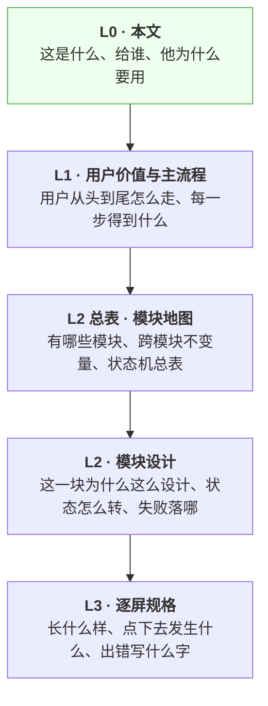

# 考点盲区 · 产品总纲

> **基线**：`origin/v1` @ `73041df`，fetch 于 2026-09-02。
> **状态：活跃。** 产品定位、用户价值、边界五句任何一处变化，本文同一次改动内更新。
> **过期判定**：下面那五句话与 `设置与原图` §二「这个产品不做什么」不再逐字同源，即为过期。

---

## 一、这是什么

你在粉笔刷了题，在中公上了课，在自己买的书上做了笔记 —— 这些记录散在三四个地方，
**没有一处能告诉你：整张考点表里，还有哪些你从来没碰过。**

考点盲区就做这一件事。你每次学完随手记一笔（说一句话、拍张图、粘段文字），它替你对到考点表上；
然后把**你一次都没碰过的考点**列出来给你。

它不判断你答得对不对，不给分数、不给排名、不给讲解 —— 那些是你的老师和你自己接的 AI 该干的事。
它只回答三件事：**这个考点你碰过没有、碰过几次、最近一次多久前。**

你拿到的是一份能直接带走的盲区清单：复制给任何一个 AI 让它给你讲，或者导出成文件 ——
**永远免费、不限次数、不加水印。**

一句话：**它是你所有学习记录的并集，减去之后剩下的那个差集。**

---

## 二、为什么是这个形状

### 2.1 一个减法

```
盲区  =  考点全集（被减数）  −  你实际碰过的（减数）
```

整个产品只有三件事：**把被减数维护好**、**把减数收全**、**把差值端出去**。

任何一个功能，先问它在这个减法的哪一端。答不上来的，就是还不该做 —— 这条判据贯穿全部下钻文档。

### 2.2 为什么别人做不了

粉笔、中公、华图都能告诉你「在我这儿你学了什么」，
但**它们结构上无法汇总你在竞品那里的记录** —— 这是这个产品全部的立足点，不是一句营销话。

代价也很清楚：既然要跨来源，就不能依赖任何一家的内容。所以这个产品**只记来源名称与时间**，
不存任何机构的课程内容，也不做学科教研。学科判断一律外包给用户自己接的模型。

### 2.3 唯一那个数

**主动查看盲区的人数。**

不是注册数、不是日活、不是使用时长 —— 这三个数都能靠别的手段做高，而且做高了不会让任何一个人
多看一次自己的盲区。任何提案的唯一标尺是：**它是否让主动查看盲区的人数上升。**

---

## 三、用户拿到的三样东西

| # | 拿到什么 | 什么时候拿到 |
|---|---|---|
| **一** | **一笔就记完的动作** —— 说一句话、拍张图、粘段文字、或者直接勾一个考点。按下即完成，不等识别结果 | 每次学完，几秒钟 |
| **二** | **一份「你还没碰过」的清单** —— 按这个考点在真题里出现的频次排序，越靠前越值得先补 | 记满一阵之后，随时打开 |
| **三** | **把清单带走的能力** —— 复制给任何 AI，或导出成文件。**这两条永不上锁**，不因为没付费而删减、加水印或限次 | 任何时候 |

第三样是承诺，不是功能。它一旦上锁，前两样就都不成立了 ——
一个记录工具如果扣着你的记录，你不会把第二个月的学习也记进来。

---

## 四、这个产品明确不做的五件事

**这五句是用户能读到的原文**，逐字同源于 `设置与原图` §二，由 `scripts/boundary-copy-check.py` 守着，
改一个字就会红。不是「暂时不做」，是**结构上做不到**：

1. **不判断对错** —— 只回答有没有、几次、多久前。界面与导出文件里永远不会出现正确率、得分、排名、掌握度、讲解、学习建议、复习提醒、连续打卡、成就徽章。
2. **不做学科教研** —— 学科判断外包给你自己接的模型。这条边界是其他所有优势的来源。
3. **不存题干与机构内容** —— 数据库里不存在能装下题干的字段，连预留位都不留。只记来源名称与时间。
4. **不替你编考点** —— 自动打标只能从给定候选里选一个，或者告诉你「没对上」。永远不生成标签文本；对不上就丢弃，不硬归类。
5. **原图不上云** —— 你拍的图只存在你自己的机器上，到期转归档保留，不上传、不同步、不共享。

第四条的代价要说清楚：**宁可丢弃率高，不可准确率低。** 归错会让覆盖度失真，
而覆盖度是这个产品唯一的产出 —— 它失真了，这个产品就没有指标了。

---

## 五、这份文档往下怎么走

**四层，只许从上往下读，也只许从上往下引用。**



| 层 | 文档 | 打开它当你要 |
|---|---|---|
| **L1** | [用户价值与主流程](用户价值与主流程.md) | 搞清楚一个功能服务于用户旅程的哪一步 |
| **L2 总表** | [模块地图](modules/INDEX.md) | 找某个能力归哪个模块，或查跨模块的不变量与状态名 |
| **L2** | [模块设计](modules/INDEX.md) 下钻 | 动某一块之前，先看它为什么是现在这样 |
| **L3** | [逐屏规格](specs/INDEX.md) | 已经要动手画界面或写代码 |

**这一层不属于用户侧的两棵树**（本轮只有占位，不设计）：
- [数据采集](../data/INDEX.md) —— 考点全集怎么来的。用户看不到它的过程，只看到它的结果。
- [运营后台](../ops-console/INDEX.md) —— 维护者一侧的动作。目前全部悬空，占位文件里逐条列着。

**技术契约、排期、决策记录不在这条线上**：契约在 [`技术架构与接口契约`](../technical/INDEX.md)，
排期在 [`执行清单`](../execution/执行清单.md)，判据在 [`实施路径`](../decisions/实施路径.md)。
本层出现的端点名一律是引用，不是定义。

---

## 六、这份文档不产生任何一个关卡数字

关卡要的是「自用两周、每天记两个数」（`实施路径` §阶段0）。写总纲一个数都不产生。

这句留在最后，是因为写产品总纲正是 `思考模式与选择框架` §盲区二 点名的那类工作：
**进展可量化、做起来舒服、不需要面对任何一个真实用户。**
它值得写的唯一理由是：在它之前，这套文档里没有一句话讲得清这个产品是干什么的。
