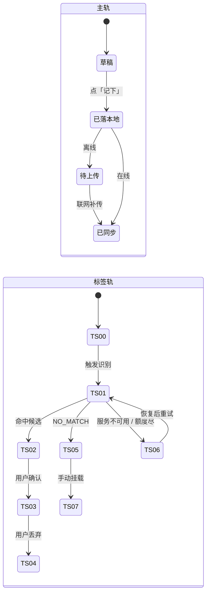

# 模块地图 · 九个域、五十一个能力单元

> **基线**：`origin/v1` @ `73041df`，fetch 于 2026-09-02。
> **状态：活跃。** 能力单元增删、跨模块不变量变化、状态名变化，本文同一次改动内更新。
> **过期判定**：§四 的状态名与 `打标与未分类` §4.1 / `记一次学习` §六 不一致，即为过期。
>
> **上一层**：[用户价值与主流程](../用户价值与主流程.md) ｜ **下一层**：各域目录下的能力单元文档
> 本文不写单个模块的内部细节，只写**清单、跨模块不变量、状态机总表**。
>
> **同层共享输入**：[线框与交互规格约定](线框与交互规格约定.md) —— 单元文档 `线框` / `交互规格`
> 两节的记号表、必答五项、红线自查清单。它不定产品口径，只定这两节的写法。

---

## 一、切分单位：一个能力单元 = 一条可被单独推翻的决策链

**这一层不按「产品域」切，按「能力单元」切。**

按域切没有天然边界，写多写少全凭手感：`specs/` 十二份规格里共有 **500 个三级标题**，
每一个都是一条可以被单独推翻的决策。把它们摊到九个域上，平均每个域压着 55 条 —— 一份文档装不下，
装下了也没人能在里面找到某一条。

能力单元有边界。判据三条，缺一条就说明还没切干净：

| # | 判据 | 反例 |
|---|---|---|
| 1 | **它是用户能独立完成的一件事，或一条能被单独推翻的决策链** | 「记录」不是 —— 推翻语音时长上限不影响拍照张数上限 |
| 2 | **它有明确的入口、结束状态和失败落点** | 「账号体系」不是 —— 它没有结束状态 |
| 3 | **一份文档承载 3–6 个决策，写完 80–250 行** | 超过 250 行就地再拆，不许往下压 |

按这三条切下来：**9 个域、51 个能力单元**。域只做索引，**设计写在能力单元里**。

⚠️ **51 份里有一份不满足判据 1，而且是有意的**：`U7.7` 退款是**缺口登记**，不是已裁定的决策链。
缺口的形状需要一份文档说清楚，否则它会以「⚪ 待定」的形式散在四处。它在本表 §三 标着 ⚪。

### 1.1 单元之间怎么引用

**目的是不让 51 份长成一张网。** 三条，可机器查：

| # | 规则 | 判据 |
|---|---|---|
| 1 | **跨域不许直指。** 要指别的域的单元，一律写成 `` 见 `模块地图` §三 登记的 `U?.?` `` —— 经这一层中转 | 单元文档里出现不带 `模块地图 §三` 前缀的**跨域**单元编号 = 违规 |
| 2 | **域内只许 spoke → hub。** 每个域可以有一个基础单元（hub），本域其他单元可以直接引用它；hub 在域索引 §四 标着 | 例：M1 的 hub 是 `U1.1`，另外六份都依赖它。禁止把 `U1.1` 的内容复制进那六份 —— 那才是第二处说法 |
| 3 | **禁止双向。** hub 不许回指 spoke，两个单元不许互指 | 任意两份单元互相出现对方编号 = 环，必须断一边 |

**为什么不干脆禁掉所有单元间引用**：`U1.1`「记录动作永不失败」是 M1 六个入口共同的前提。
禁掉引用的唯一后果是把它复制六遍 —— 那正是这次要拆掉的东西。**辐条指向轮毂不是网，轮毂之间互指才是。**

---

## 二、九个域

| 域 | 服务旅程节点 | 在减法的哪一端 | 单元数 | 对应规格 |
|---|---|---|---|---|
| [**M0 首次使用与权限**](M0-首次使用与权限/INDEX.md) | `J0` `J2` | 前置 | 4 | `首次使用与权限申请` |
| [**M1 记录**](M1-记录/INDEX.md) | `J2` | **收减数** | 7 | `记一次学习` |
| [**M2 打标与未分类**](M2-打标与未分类/INDEX.md) | `J3` `J4` | **减数成形** | 5 | `打标与未分类` |
| [**M3 盲区与覆盖度**](M3-盲区与覆盖度/INDEX.md) | `J5` | **减法本身** | 6 | `看盲区` |
| [**M4 出口**](M4-出口/INDEX.md) | `J6` | **端出差值** | 7 | `导出与问AI` |
| [**M5 账号**](M5-账号/INDEX.md) | `J1` | 支撑 | 6 | `登录与账号` |
| [**M6 端与形态**](M6-端与形态/INDEX.md) | 全部 | 支撑 | 4 | `无障碍与多端适配` |
| [**M7 商业化**](M7-商业化/INDEX.md) | `J3` `J6` | 支撑 | 7 | `额度与购买` |
| [**M8 边界的用户可见落点**](M8-边界/INDEX.md) | `J0` `J6` | 负空间 | 5 | `设置与原图` |

**骨架层（被减数怎么维护）不在这张表里。** 它没有终端用户界面，整条线在 [数据采集](../../data/INDEX.md)。
用户侧只保留一条：**归档节点在盲区里必须还翻得到**，落在 `U3.5`。

---

## 三、五十一个能力单元

### M0 首次使用与权限（4）

| 单元 | 管什么 | 关键决策 |
|---|---|---|
| `U0.1` 首启产品说明屏 | 登录前那一屏说什么 | 边界三句逐字同源；🔴 **不可跳过**（`M0-G1` 已于 2026-09-03 裁定，`设置与原图` §3.3 已改齐，不再有矛盾） |
| `U0.2` 权限申请时机与话术 | 麦克风 / 相机 / 相册 什么时候要 | **用时才要**，不在首启一次性要完 |
| `U0.3` 权限被拒后的降级路径 | 拒了之后还能不能记 | 四个入口里至少有一个不需要任何权限 |
| `U0.4` 隐私与合规的用户可见部分 | 用户读得到的那一份 | 待 `FG-4` 法务口径，产品不裁定 |

### M1 记录（7）

| 单元 | 管什么 | 关键决策 |
|---|---|---|
| `U1.1` 记录动作永不失败 | 整个域的命门 | 落地先于识别；允许失败的清单是穷举的，不在表上的都不许失败 |
| `U1.2` 语音记一笔 | 说一句话 | 时长上限、静音处理、录到一半退出 |
| `U1.3` 拍照记一笔 | 拍张图 | 单次张数上限、HEIC、原图去向（→ `U8.3`） |
| `U1.4` 粘一段 | 粘贴文字 | 长度上限、剪贴板权限、来源名称怎么填 |
| `U1.5` 记做题 | 用户已自选考点 | **不走打标**，直接已确认。模型全挂时的保底路径 |
| `U1.6` 离线队列与自动补传 | 没网的时候 | 队列条数可见、幂等去重、联网自动补传不需要点任何按钮 |
| `U1.7` 时间线回看与删记录 | 记完之后 | 为什么没有筛选与搜索；删除的完整路径与可逆性 |

### M2 打标与未分类（5）

| 单元 | 管什么 | 关键决策 |
|---|---|---|
| `U2.1` 四段管线 | 召回 → 闭集 → 阈值 → 自检 | 三段的作用是丢掉；召回为空直接未分类，不调模型 |
| `U2.2` 标签状态机 | `TS-00`–`TS-09` | 状态名真源（见 §四）；哪些态计覆盖度 |
| `U2.3` 未分类的四种成因 | 四种成因四句不同的话 | 「模型说不匹配」与「模型没看成」必须是两句话 |
| `U2.4` 手动挂载 | 从树里挑 | **不能新建标签**；只收 id 不收文本 |
| `U2.5` 待补队列与重试 | 服务恢复之后 | 自动重试、退避、用户不需要知道它存在 |

### M3 盲区与覆盖度（6）

| 单元 | 管什么 | 关键决策 |
|---|---|---|
| `U3.1` 覆盖度口径 | 分子分母怎么算 | 三条计算规则；未分类不计分子；三个数守恒 |
| `U3.2` 盲区总览 | 🌟 北极星落点 | 三种空态文案完全不同；重算中不显示旧数字 |
| `U3.3` 先补这几个 | 排序与筛选 | 按真题频次排；排除已断言；为什么这个标题不叫别的 |
| `U3.4` 考点详情 | 单个考点 | 只答有没有 / 几次 / 多久前；这一屏上没有的东西 |
| `U3.5` 按章看全部与归档区 | 骨架树 | 折叠规则、超大树降级、**归档节点永远可找回** |
| `U3.6` 断言 | 我已掌握 / 我卡住了 | 正向已有契约；**反向是差集定义本身的盲点**，只登记不裁定 |

### M4 出口（7）

| 单元 | 管什么 | 关键决策 |
|---|---|---|
| `U4.1` 四条出口的性质 | 四条出口共用哪句话 | 出口 × 前置条件矩阵；哪两条永不上锁 |
| `U4.2` 导出文件三格式 | md / csv / json | 无删减 无水印 不限次数；分块与进度 |
| `U4.3` 导出字段清单 | 文件里有什么 | 🔴 为什么记录正文不进导出；导出后前端自检 |
| `U4.4` 复制给 AI | 免费路径 | **永不移除**；零边际成本不计费 |
| `U4.5` 问 AI 的文本模板 | 带出去的那段文字 | 🔴 逐槽位核过：模板里没有任何位置能放题目内容 |
| `U4.6` AI 代发提问 | 付费路径 | 额度为 0 时主入口必须是免费兜底；模型返回越界内容怎么办 |
| `U4.7` 只读令牌 | MCP / CLI | 四道锁冗余；只展示一次；签发前逐条列出它能读到什么 |

### M5 账号（6）

| 单元 | 管什么 | 关键决策 |
|---|---|---|
| `U5.1` 登录门与没有本机模式 | 未登录看得到什么 | 门上**没有「继续用」这个出口**（2026-09-02 裁定） |
| `U5.2` 手机号验证码登录 | 主通道 | 发码频次、失败次数、注册即登录 |
| `U5.3` 微信授权登录 | 副通道 | 微信**不是**跨端锚点 |
| `U5.4` 账号合并 | 两个通道撞上 | 预览只读；确认不可逆；**用哪个通道登录就登进哪个账号**，不替用户选 |
| `U5.5` 注销与把数据带走 | 删账号 | 响应必须带导出入口提示；删除时点待律师稿 |
| `U5.6` 退出登录 | 只是登出 | 🔴 **不碰原图**；未上传的先拦一次 |

### M6 端与形态（4）

| 单元 | 管什么 | 关键决策 |
|---|---|---|
| `U6.1` 端的清单与各自定位 | 有哪几个端 | 小程序只做采集入口 |
| `U6.2` 屏 × 端能力矩阵 | 哪一屏在哪个端有 | 缺失格子的降级路径 |
| `U6.3` 响应式与跨端一致性 | 布局与文案 | 面向用户的字符串一处词表、多处消费 |
| `U6.4` 无障碍下限 | 焦点、朗读、对比度 | 颜色不作为唯一信息载体 |

### M7 商业化（7）

| 单元 | 管什么 | 关键决策 |
|---|---|---|
| `U7.1` 额度口径与三个呈现位置 | 额度是什么 | 🔴 **只计外部模型调用**；自然月重置、不结转不透支 |
| `U7.2` 额度受限态 | 用完了会怎样 | 🔴 **记录动作不受影响**；盲区与导出永不上锁 |
| `U7.3` 档位与购买 | 买什么 | 单档；档位与额度由服务端返回，前端不硬编码 |
| `U7.4` 支付流程 | 怎么付 | 订单幂等；「确认中」这一态怎么呈现 |
| `U7.5` Apple 内购 | iOS 的特殊规格 | 与其他端的价格一致性 |
| `U7.6` 订单状态机与历史 | 买完之后 | 四态；发票与自动续费管理 |
| `U7.7` 退款 | ⚪ 缺口 | 界面已画、后端从未定义；**支付页事先讲清楚**是产品的事，不是律师稿的事 |

### M8 边界的用户可见落点（5）

| 单元 | 管什么 | 关键决策 |
|---|---|---|
| `U8.1` 「这个产品不做什么」这一页 | 边界给用户看 | 五句逐字同源，`boundary-copy-check.py` 守着 |
| `U8.2` 设置屏与数据管理 | 设置里有什么 | 数据管理条目逐条；清空的影响面 |
| `U8.3` 原图在哪、什么时候消失 | 🔴 原图去向 | 到期**转归档不是删除**；界面上永远不出现「自动删除」 |
| `U8.4` 原图管理屏 | 用户自己管 | 没有任何分享入口；清掉是永久毁掉，动手前说清一次 |
| `U8.5` 全局交互约定的边界形态 | 四态 / 三种反馈 / 文案红线 | **没有第四种反馈形态** —— 小红点、气泡引导、未读计数都是提醒机制的变体 |

---

## 四、状态机总表：状态名在这里定死，模块文档不许自造

**这是九个域共享的输入。** 一条记录的状态在 M1、M2、M3、M4 四个域里都要出现，
所以状态名住在这一层；模块文档向下引用它，不各自起一套。

### 4.1 两条轨

一条记录有两条轨并行：**主轨决定「这条记录在不在」，标签轨决定「它身上挂没挂考点」。**

**分界在「已落本地」**：落本地之前，一切失败都不影响「这条记录在不在」。

### 4.2 主轨四态

| 状态 | 触发 | 计覆盖度 |
|---|---|---|
| 草稿 | 采集进行中，未点「记下」 | 不计（记录还没产生） |
| 已落本地 | 点「记下」，本机写入成功 | 不计 |
| 待上传 | 离线，进本地队列 | 不计 |
| 已同步 | 服务端返回记录标识 | 由标签轨决定 |

### 4.3 标签轨十态 —— 真源是 `打标与未分类` §4.1，本表是转录

| 码 | 状态名 | 徽标文字 | 计覆盖度 |
|---|---|---|---|
| `TS-00` | 待打标 | 无徽标 | 否 |
| `TS-01` | 正在认 | 「正在认」 | 否 |
| `TS-02` | 待确认 | 「看一下?」 | 否 |
| `TS-03` | 已确认 | 「已对上」 | ✅ **是** |
| `TS-04` | 已丢弃 | 「丢掉了」 | 否（可见但不计） |
| `TS-05` | 没对上 | 「没对上」 | 否 |
| `TS-06` | 待补 | 「稍后再认」 | 否 |
| `TS-07` | 手动挂载 | 「已对上」 | ✅ **是** |
| `TS-08` | 确认待补传 | 「已对上 · 等联网」 | ✅ **是** |
| `TS-09` | 挂载失效 | 「考点已归档」 | 否 |

**三条不许违反的约定**：
1. `TS-03` 与 `TS-07` 徽标完全一样 —— **来源不是状态**，用户不需要知道是谁挂的
2. 状态名在所有尺寸形态里**逐字相同**，不做「未匹配」这类同义变体
3. 任何形态都**不显示置信度**。空间够不是显示它的理由 —— 显示了就是请用户替产品做判断，而用户没有判断依据

🔴 **「记做题」不经过标签轨**：考点是用户自己选的，`已同步` 之后直接 `TS-03`。

---

## 五、六条跨模块不变量

**这些结论跨两个以上模块，所以它们住在这一层。** 模块文档**向下引用**它们，不各自复述一遍 ——
复述就是第二处说法，而最先过期的一定是最不常被读的那一处。

| # | 不变量 | 谁受它约束 | 违反它会怎样 |
|---|---|---|---|
| `I-1` | **记录先落地，识别在后。** 断网、模型超时、密钥没配、额度用尽，都不许让「记一笔」失败 | M1 M2 M7 | 整个产品作废 —— 这是唯一不许失败的一步 |
| `I-2` | **未分类不进行为层。** 记了但没对上 ≠ 碰过这个考点 | M2 M3 | 拿记录条数冒充覆盖度，唯一的产出被做假 |
| `I-3` | **闭集打标。** 接口只收节点 id，不收标签文本；模型只能从候选里选一个或返回「无匹配」 | M2 M3 | 同时打开两个口子：幻觉考点，和机构措辞被抄进来 |
| `I-4` | **额度只碰外部模型调用。** 不阻断记录，不锁盲区，不锁导出，不锁免费复制 | M1 M3 M4 M7 | 关卡数字被付费墙污染，验收结果不可信 |
| `I-5` | **原图内联一次即弃。** 服务端全程不落盘、不入日志、不经厂商暂存 | M1 M8 | 红线命中。机器可查 |
| `I-6` | **归档节点同时退分子与分母，且永远可找回。** 归档计数常驻可见 | M2 M3 M4 | 覆盖度会随归档虚涨，用户看到一个自己没做过任何事就变好的数 |

---

## 六、模块 → 屏幕

| 域 | 屏 |
|---|---|
| M0 | `S-LOGIN` 的说明段 + 各屏首次权限申请 |
| M1 | `S-HOME` `S-REC` `S-TL` |
| M2 | `S-TAG` + 卡片内三种尺寸形态 |
| M3 | `S-BLIND` `S-NODE` + 骨架树 |
| M4 | `S-EXP` + `S-NODE` 上的单考点带走 |
| M5 | `S-LOGIN` `S-ACC` `S-MERGE` |
| M6 | 全部十三屏 × 四端 |
| M7 | `S-BILL` + 各屏受限态 |
| M8 | `S-SET` `S-RAW` |

---

## 七、这一层写到哪一步

> **只把「真源里已经定过的东西」展开成「决策 + 状态 + 转移条件 + 失败落点 + 前后端契约意图」。
> 不排期、不新定义任何东西、不写界面原文。**

判据可查：一份能力单元文档里出现了「什么时候做」，就是越界（排期在 `执行清单`）；
出现了用户看到的原样文案，也是越界（那在 `specs/`）。

**这五十一份文档一个关卡数字都不产生。** 它们值得写的唯一理由是：
一条边界如果有三处说法，最先过期的一定是最不常被读的那一处，而红线过期的代价与别的条目不同。
