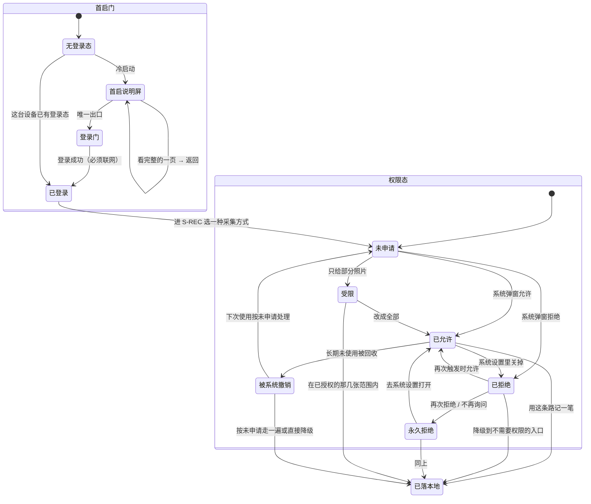

# M0 · 首次使用与权限

> **基线**：`origin/v1` @ `73041df`，fetch 于 2026-09-02。
> **状态：活跃。** 首启路径增删一步、权限全表增删一行、`FG-4` 拿到法务口径，本文同一次改动内更新。
> **上一层**：[模块地图](../INDEX.md)

---

## 一、这一域在减法的哪一端

**两端都不在。** 它既不维护被减数（考点全集在数据采集那条线上），也不产生减数（减数由 M1 收）。
它是**让另外两件事能发生的前置**：让人在登录之前先读懂这是什么（`J0`），
让人在需要麦克风或相机的那一刻能继续往下走（`J2` 的采集前置）。

**不在两端不等于不影响减法。** 这一域一旦做错，影响的是减数的**采集率**而不是采集内容：
首启多拦一道、权限被拒之后没有落点，掉的都是「本来会记的那一笔」。所以这一域的判据全部是否定式的
——「不许拦住」「不许禁用」「不许把用户堵死」，而不是「要引导用户完成什么」。

一条推论要写清楚：**这一域的任何一个提案都不能用「让用户先看懂产品」当理由把步骤加长。**
说明屏、权限说明卡片各只出现一次，它们的存在理由是消除疑虑，不是教学。

---

## 二、它服务于主流程的哪一步

`J0` 与 `J2`。回指 `用户价值与主流程` §四 那张表里 M0 那一行。

| 节点 | 这一域在这一步做什么 | 这一步失败会怎样 |
|---|---|---|
| **`J0` 头一次打开** | 在登录之前把三件用户会担心的事说清（不判对错、不存题目内容、原图不上云），并把人交给登录门 | 用户不知道自己在装什么；这一步是登录动作的全部前置 |
| **`J2` 记一笔** | 在采集方式真正要用到系统能力的那一刻申请权限；被拒之后把人接到一条不需要权限的路上 | 减数漏采 —— 记录动作失败一次，用户不会记第二个月（`用户价值与主流程` §1.3） |

**`J1` 登录本身不在这一域。** 这一域只负责「说明屏的唯一出口是登录门」这条衔接，
登录的流程、错误码、协议勾选的交互都在 `登录与账号` §二。

---

## 三、它服务于哪一个关卡

**阶段 0：自己用两周，每天记两个数**（`实施路径` §阶段 0 的验收）。判据是人给的 pass/fail：
两周内平均每天 ≥3 条且「懒得记」持续下降为通过；记录量逐周衰减或「懒得记」占多数就停。

**这一域贡献的是那两个数的分母，不是分子。** 分母是「打开之后有没有真的记下来」——
首屏多一步、权限多弹一次、被拒之后没有落点，掉的都是同一个数（`首次使用与权限申请` §六）。

两件事要说明白：

1. **登录门是明知会掉一部分人也要收的一道。** 不登录就没有记录，没有记录就没有盲区可减
   （2026-09-02 裁定，`首次使用与权限申请` §零 前提 1）。这一道掉的人不算这一域做坏了。
2. **这一域一个关卡数字都不产生。** 它唯一的量化承诺是过程指标：登录之后 2 次点击、0 个系统弹窗落下第一条记录，
   到「可交互」为止 0 次网络请求（`首次使用与权限申请` §1.2 / §1.6.3）。
   这两个数达标不代表关卡通过 —— 关卡要的是有人真的记了两周。

---

## 四、能力单元清单与下钻

| 单元 | 管什么 | 关键决策 |
|---|---|---|
| [`U0.1` 首启产品说明屏](U0.1-首启产品说明屏.md) | 登录前那一屏说什么、能不能跳过 | 三句逐字同源于边界全文页，`scripts/boundary-copy-check.py` 守着；✅ **是不可跳过的首启第一屏**（2026-09-03 裁定 `M0-G1`，§七） |
| [`U0.2` 权限申请时机与话术](U0.2-权限申请时机与话术.md) | 麦克风 / 相机 / 相册什么时候要、要之前说什么 | **用时才要**，时机精确到某一次点击；不申请的权限在界面上一个字都不提 |
| [`U0.3` 权限被拒后的降级路径](U0.3-权限被拒后的降级路径.md) | 拒了之后还能不能记 | 四个入口里**「写」（粘一段 / 手写）不需要任何权限**，它是全部降级路径的共同终点 |
| [`U0.4` 隐私与合规的用户可见部分](U0.4-隐私与合规的用户可见部分.md) | 用户读得到的那一份 | 说什么、在哪说、要不要勾；`FG-4` 待法务口径，产品不裁定 |

**三处跨单元共享的东西写在这里，单元文档里不各自复述一遍：**

- **共同终点**：`U0.2` 的每一条申请流程、`U0.3` 的每一条降级路径，终点都是「记录落本机」这一态（`I-1`）。
- **共同禁令**：任何权限状态下入口都不禁用；「去系统设置」永远是次要位置的第二个按钮。
- **共同真源**：用户可读的边界全文只有一份（`设置与原图` §二），`U0.1` 与 `U0.4` 都只是它的消费者。

---

## 五、域级状态机

**这一域自己没有记录状态。** 图里的记录态取自 L2 总表 §四 的主轨（`已落本地`），
权限六态取自 `首次使用与权限申请` §2.7 —— **本域不新造任何状态名**。

🔴 **权限态没有一条通向「记不成」。** 六个态各自的出口都能落到 `已落本地`——
这张图是否画得出这样一条边，就是这一域是否成立的判据。

---

## 六、前端行为意图 × 后端契约意图

| 场景 | 前端行为意图 | 后端契约意图 |
|---|---|---|
| 首启说明屏渲染 | 无登录态时首帧即这一屏；不可关闭、不可跳过、无返回；在任何网络往返之前完成渲染 | **不参与，且不许参与。** 三句是构建期打进包里的静态串 —— 接口下发意味着边界能被服务端悄悄改（`设置与原图` §3.1 对边界全文页的明写，说明屏与它同源） |
| 边界全文页 | 说明屏与 `S-SET` 都能进；离线可读；页上无可点元素 | **零端点、无登录要求。** 不做灰度、不按端下发不同版本 |
| 登录门衔接 | 说明屏唯一出口；深链在无登录态时一律落回说明屏，不给目标屏预览 | 契约在 `登录与账号` §二。本域只提一条要求：**未登录时任何 route id 都不返回业务数据**，包括只读预览 |
| 权限申请 | 时机精确到某一次点击；申请前先由产品自己的界面说清用途；查权限状态不触发系统弹窗 | **无运行期端点。** 这一域的后端面是**构建期清单**：iOS 用途描述键 / Android manifest / 小程序 `scope` 必须与权限全表的允许集一一对等，多一条即打回（`首次使用与权限申请` `FT-P09` `FT-P10` `FT-P18`） |
| 权限被拒后降级 | 落到不需要权限的入口，入口不禁用 | **服务端不需要知道用户拒了什么**，也不为此改变写入语义 —— 降级路径与正常路径落的是同一条记录（`I-1`） |
| 冷启动 | 到「可交互」为止不发任何请求；0–400ms 不画骨架，超 3s 转错误态 | **不得要求任何启动期拉取**：不下发配置、不下发公告、不要求校验登录态。要不要留这条口子登记在 `FG-6` |
| 协议同意 | 必勾且默认不勾，未勾不发请求；版本变了要重新勾一次 | 协议版本号与正文地址由服务端给，端点 🚧 待技术定稿（`登录与账号` §十四）。**拉不到时不许当作已同意** |
| 隐私与商店声明 | 界面上不出现任何未申请权限的字眼 | 声明清单的内容取自权限全表，由产品填、壳侧构建期注入；本域不新增任何服务端行为 |

---

## 七、这一域碰到的边界 + 缺口登记

**边界在这一域的形态**（真源在 `产品总纲` §四 与 `设置与原图` §二，这里只写它在这一域怎么落地）：

| 边界 | 在这一域的形态 |
|---|---|
| 不判断对错 | 首次可见的全部文案只有计数、时间、动作三类；`FT-E09` 用禁用词表通读一遍 |
| 不存题干 | 首启文案与全部权限说明里没有任何一处能容纳题目内容，也没有诱导抄题的示例或占位（`FT-E10`） |
| 原图不上云 | 「图只存在这台设备上」必须在系统弹窗**之前**由产品自有说明给足；相册写入权限**永不申请**，因为系统相册默认开着云同步（`I-5`） |
| 不做提醒 | 通知权限根本不申请，Android 连声明都不写；界面上连「我们不打扰你」这种反向自夸也禁掉 |
| 没有第四种反馈形态 | 说明屏不是浮层、不是蒙层引导、不是第十四屏；没有小红点、气泡、未读计数 |

**缺口登记 —— 只登记，不裁定：**

| # | 缺口 | 缺的是哪一半 | 该谁定 |
|---|---|---|---|
| `M0-G1` | ~~首启要不要展示那三句，两份规格结论相反~~ | ✅ **已裁定（2026-09-03，产品）：展示，形态是登录前的一屏、不是弹窗。** `设置与原图` §3.3 / §3.1 / `A-27` 已改齐 | 裁定全文与理由见 `U0.1` §五 |
| ✅ `M0-G2` | 去设置引导里按钮的排列顺序 —— **已裁定（2026-09-02，产品）：去设置永远排最后一个** | 已闭合，真源与三张流程图已改齐；主次那一半未动（全是次按钮） | 详见 `U0.2` §五 与 §6.3 ※9，理由在 `首次使用与权限申请` §2.3 ⚠️ |
| `FG-4` | 「首次运行必须明示同意」在登录形态下由登录门的必勾协议满足够不够 | 缺的是**法务口径**，产品的理解不是结论 | ⚠️ **法务**，产品不裁定。详见 `U0.4` §五 |
| `FG-5` | 要不要年龄门槛、放在哪一步 | 依赖 `FG-4` 的合规结论与商店未成年人问卷口径 | 合规轨 + 人裁定 |
| `FG-1` | Tauri 2 在 iOS / Android 上怎么接相机、麦克风、照片选择器 | 缺的是**实测**：两处代码都还没有 | 技术。复现：真机打开 `S-REC` 语音模式点「开始录」，看有没有系统弹窗 |
| `FG-2` | 桌面壳里的媒体权限走哪一层、拒绝后网页层拿到什么错误 | 缺的是实测；它决定「去设置」跳系统设置的哪一页 | 技术 |
| `FG-6` | 首启要不要拉一次远程配置 | 现在写死「不拉」。它不挡任何事，登记是为了让下一次「顺手加个启动请求」的提议先回到这一行 | 产品 + 技术，触发时再议 |
| `FG-8` | 存储不可写时那一条记录只活在内存里 | 缺的是一个不依赖本机存储的落点；现状是界面已明说，不是悄悄丢 | 技术 |
| `FG-7` 残留 | 2026-09-02 之前已装旧版本、设备上已有数据的用户，登录时这批数据怎么办 | `FG-7` 主体已随裁定作废，残留这一格没人接 | 已上报待拍板 |
