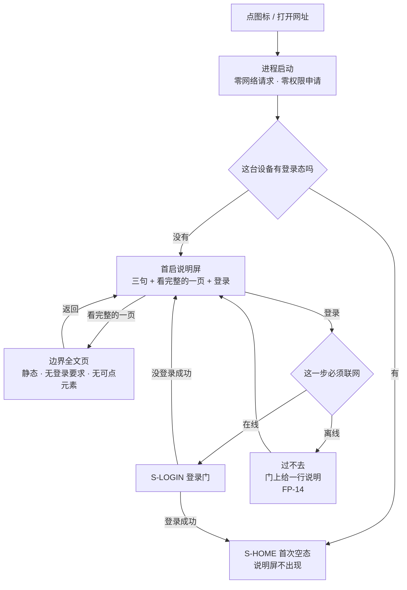

# U0.1 · 首启产品说明屏

> **基线**：`origin/v1` @ `73041df`，fetch 于 2026-09-02。
> **状态：活跃。** 说明屏的出现 / 消失条件变化、三句的同源链条变化、`M0-G1` 被裁定，本文同一次改动内更新。
> **上一层**：[M0 · 首次使用与权限](INDEX.md)

---

## 一、这个子能力是什么、不是什么

**是**：这台设备没有登录态时看到的那一屏。它只说三件用户会担心的事——不判断对错、不存题目内容、
原图只在这台设备上——外加两个出口：看边界全文、去登录。

**不是**这五样，逐条写死，因为每一样都有人会想加：

| 不是什么 | 为什么 |
|---|---|
| 不是第十四屏 | 它没有第二个入口、不被任何路由引用、一台设备上只出现到登录成功为止。「十三屏，一屏不多」这条约束仍然成立，处置是**不给它新屏号**（`首次使用与权限申请` §1.3.3） |
| 不是引导页 | 一页，不轮播、不分步、没有翻页点、没有「跳过」 |
| 不是弹窗或蒙层 | 反馈形态只有 Toast / 页内提示 / 浮层三种。它是一屏，不是第四种形态 |
| 不是边界的真源 | 真源是 `设置与原图` §二 那一页的五句；这一屏取它的前三句逐字复制，上面改了就跟着改，不单独改 |
| 不是营销页 | 它说的全是产品**不做**什么。一句「我们帮你更高效地学习」都不许有 |

**它必须说清哪三件事**（原文在 `设置与原图` §二，这一层不复写）：产品只回答有没有 / 几次 / 多久前；
库里没有能装题目内容的地方；拍的图只在这台设备上、不上传不同步不备份。

---

## 二、详细产品逻辑

### 2.1 出现、消失、重看

| 决策 | 结论 | 为什么 |
|---|---|---|
| 出现条件 | 这台设备没有登录态 | 到得了 `S-HOME` 的人一定已经登录，没有可提示的对象 |
| 消失条件 | **登录成功。** 不因为读过、关过、记过而消失 | 它是门不是提示。杀进程重开仍然是这一屏（`FT-09`） |
| 能不能跳过 | 🔴 **不可关闭、不可跳过、没有返回**；系统返回键在这一屏上不响应 | 唯一往下走的出口是底部的登录入口 |
| 界面上解不解释「为什么不能跳过」 | **不解释**，也不出任何拦截浮层（`FP-02`） | 一句解释会把这一屏变成一次谈判 |
| 重新看 | `S-SET` 的边界全文页；这一屏上的「看完整的一页」在登录之前也能点开那一页（静态、无登录要求） | 见 `设置与原图` §3.1 |
| 深链进来 | 无登录态时一律落到这一屏，登录成功后再落目标屏；**不给目标屏的预览态** | 预览态等于把「未登录也能看点什么」从后门放回来（`FP-26`） |
| 字号放到最大 | 整屏纵向滚动，**三句一句不减、一字不改**；底部登录入口固定可见 | 不为窄屏另写一版短句（`FP-25`） |
| 小程序端 | 删掉原图那一句，该端只剩两句 | 那个端没有原图，这句话没有主语 |

### 2.2 它在首启路径上的位置

**失败落点只有一个：离线。** 无登录态 + 离线时人停在这一屏，点登录也过不去（`FP-14`）。
这一格没有可丢的记录——登录之前不产生数据——所以它不违反「记录动作永不失败」。

### 2.3 三句从哪来，谁守着

链条只有一条方向，不许反向改：

| 层 | 是什么 | 什么时候改 |
|---|---|---|
| `项目现状与决策记录` §2 | 决策真源 | 改边界才改 |
| 边界全文页（`设置与原图` §二） | 文案真源，用户可读的完整五句 | 决策改了就改 |
| 首启说明屏 | **不是真源**，逐字复制前三句，不重写、不缩写、不换说法 | 上面改了跟着改，不单独改 |

🔴 **这一屏上不许出现边界全文页没有的句子。** 加一句就是产品对自己的边界有了第二种说法，
而边界只要有两种说法，以后每次「这算不算越界」的讨论都要先花时间确认按哪一份说。

**判据可跑**：`python3 scripts/boundary-copy-check.py`。它校验四处同源——说明屏三句逐字等于全文页前三句、
拍照同意点的承诺句逐字等于第三条、首次使用的相机自有说明逐字消费同一句承诺。不等就退出码 1。
系统弹窗的用途描述是**唯一豁免逐字同源的一类**（长度不由产品决定），脚本不校验它。

---

## 三、前端行为意图 × 后端契约意图

| 场景 | 前端行为意图 | 后端契约意图 |
|---|---|---|
| 渲染这一屏 | 首帧即这一屏，在任何网络往返之前完成；底部登录入口点下去 300ms 内进得了登录门 | **不参与。** 三句是构建期打进包里的静态串，🔴 不许由任何接口下发——接口下发意味着边界能被服务端悄悄改 |
| 判断要不要出这一屏 | 只读本机登录态，**不向服务器求证** | 冷启动不提供、也不要求「校验登录态 / 静默续期」这类请求（`首次使用与权限申请` §1.6.3） |
| 「看完整的一页」 | 端内打开边界全文页，返回即回这一屏 | 该页零端点、无登录要求、离线可读；**不做灰度、不按端下发不同版本**（小程序少一句是构建期差异，不是下发差异） |
| 「登录」 | 唯一出口；离线时给一行说明，不假装成功 | 登录契约在 `登录与账号` §二。本域只要求：未登录时任何 route id 不返回业务数据 |
| 深链 | 无登录态时丢弃目标屏渲染，只保留目标地址，登录成功后再落过去 | 服务端不为未登录请求返回任何可预览内容 |
| 三句的一致性 | 前端不拼接、不截断、不按屏宽换短句 | 无契约面。一致性由构建期脚本保证，不是运行期校验 |

---

## 四、边界与红线在这里的具体形态

| 红线 | 在这一屏上的形态 |
|---|---|
| **边界只有一种说法** | 三句逐字同源，机器守着；改一个字就红 |
| **没有第四种反馈形态** | 它是一屏不是浮层；没有「我知道了」按钮、没有蒙层、没有气泡、没有轮播 |
| **不判断对错** | 屏上没有任何百分比、进度、评价性文字 |
| **不存题干** | 三句里没有任何一处能容纳题目内容，也没有示例或占位 |
| **原图不上云** | 第三句就是那条承诺；小程序端删掉它而不是改写它——没有主语的承诺是假承诺 |
| **不做提醒** | 屏上不提通知、不提推送，连「我们不打扰你」这种反向自夸也不许（`首次使用与权限申请` §2.2.4） |

---

## 五、缺口登记

### `M0-G1` 🔴 首启要不要展示这三句 —— 两份规格结论相反，互相都没改对方

**这是缺口，不是本文能定的事。** 两边的理由都完整，缺的是一次裁定。原样摆出来：

**一边：`首次使用与权限申请` §1.3.3 定成不可跳过的第一屏。**

- `docs/product/specs/首次使用与权限申请.md:158-159`：
  > **结论(2026-09-02 用户裁定「没有本地模式」后改写):有这个说明,而且它是首启的第一屏 ——
  > 用户在登录之前先读到这三句,底部按钮是登录入口,不给跳过。**
- 同文件 `:170`：
  > | **可关闭** | 🔴 **不可关闭、不可跳过、没有返回**。唯一往下走的出口是底部的「登录」 |
- 同文件 `:203-204`（真源关系表里给它定的身份）：
  > | 首启说明屏 | **不是真源。** 它取上面那一页的前三句,**逐字复制,不重写、不缩写、不换说法** | 上面改了就跟着改,不单独改 |
- **它的理由**：2026-09-02 裁定「没有本地模式」后登录变成入口，登录之前必须有一处把三件担心的事说清；
  做成一屏而不是弹窗，是为了不新增第四种反馈形态、也不新增第十四屏。

**另一边：`设置与原图` §3.3 判「不展示」。**

- `docs/product/specs/设置与原图.md:238-240`：
  > ### 3.3 首次使用时要不要展示一次
  >
  > **不展示。** 判据与结论:
- 同文件 `:244`（否决首启展示那一行）：
  > | 首启全屏展示一次,要点「我知道了」 | ❌ | ① 它是一个**必须被点掉的弹窗**,而总纲 §2.2 的浮层只用在
  > 「必须二选一」上,这里没有二选一;② 第一次打开产品的人还没有任何数据,这五条对他全是抽象的;
  > ③ 「我知道了」会被无脑点掉,而被点掉的声明等于没说 |
- 同文件 `:245`（它采用的方案）：
  > | 首启不展示,但在**第一次拍照的同意点**里出现相关的那一条 | ✅ **采用** | 原图那条(第三条)在用户第一次
  > 真的要存一张图时出现,**那一刻它是具体的**。 |
- **它的理由**：边界不靠反复提醒建立，靠产品行为本身；抽象的声明会被无脑点掉。

**两处旁证说明这不是措辞差异，是结论差异：**

1. `设置与原图.md:216`（§3.1 第二入口）：
   > 🔴 **没有。** 不在首页放、不在空态放、不在记录流程里放。**边界不靠反复提醒建立,靠产品行为本身。**
   而说明屏上的「看完整的一页」在登录之前就能打开那一页，这正是一个第二入口。
2. `设置与原图.md:1303`（验收用例 `A-27`，仍在生效）：
   > | `A-27` | 全新安装,第一次打开 | 走完首启 | 🔴 **不出现任何全屏边界声明弹窗**;这一页只能从 `S-SET` 进 |

**为什么两边没有互相改对方**：`设置与原图.md:1396` 那条 2026-09-02 的变更记录逐节列了改动范围，
末尾写着「**未动**:§二 边界五条原文、§三……」——§三 正是 §3.3 所在的那一节。
也就是说裁定改写了首启路径，但没有回头改这一节；而 `首次使用与权限申请` §1.3.3 改写时也没有标注它推翻了 §3.3。

**需要裁的是什么**（三选一，本文不选）：① 说明屏留着，`设置与原图` §3.3 与 `A-27` 跟着改；
② 说明屏撤掉，三句改由拍照同意点承担，`首次使用与权限申请` §1.1 / §1.3.3 / `FT-08`–`FT-11` 跟着改；
③ 两者都留但重新定义边界（例如说明屏留三句、全文页仍只从设置进），这需要重写「第二入口没有」那条红线。

⚠️ L2 总表 §三 在这一行上标着「本轮定掉」。**本文不定**——缺口只登记不裁定，且关卡与红线级的取舍由人给 pass/fail。

**复现**：`python3 scripts/boundary-copy-check.py`（现在是绿的，它只校验逐字同源，**不校验展不展示**，
所以这处矛盾脚本发现不了）；再读上面两处原文对照。

### 其余两条

| # | 缺口 | 缺的是哪一半 | 该谁定 |
|---|---|---|---|
| `FG-4` | 未登录时不做任何同意动作，在境内合规口径上成不成立 | 缺法务口径。若结论是「首次运行必须有一次明示同意」，这一屏就要多一次同意动作 | ⚠️ 法务，产品不裁定 |
| `FG-6` | 首启要不要拉一次远程配置 | 现在写死不拉（拉了会把离线首启变成首启失败）。不挡任何事，登记是为了让下一次提议先回到这一行 | 产品 + 技术，触发时再议 |
