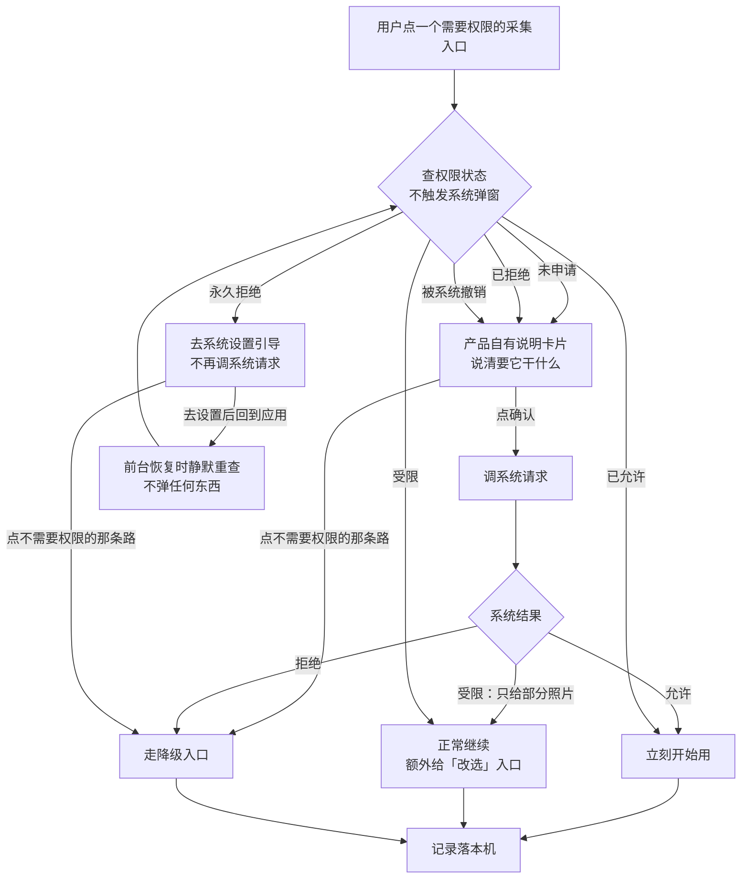

# U0.2 · 权限申请时机与话术

> **基线**：`origin/v1` @ `73041df`，fetch 于 2026-09-02。
> **状态：活跃。** 新增或删除一个权限、改一个权限的申请时机、`FG-1` / `FG-2` 有实测结论，本文同一次改动内更新。
> **上一层**：[M0 · 首次使用与权限](INDEX.md)

---

## 一、这个子能力是什么、不是什么

**是**：每一个系统权限在**哪一刻**被申请，以及申请之前产品自己要把哪件事说清。

**不是**：

- **不是拒绝之后走哪条路** —— 那是这一域的另一件事，分工见域索引 §四。
- **不是端的技术实现** —— 各端的授权 API、WebView 委托、`scope` 名字在 `多端选型与端矩阵`。
- **不是上屏文案** —— 每一段文字的原文在 `首次使用与权限申请` §2.2。这一层只写**它必须说清哪件事**。

一句话概括这一单元的全部立场：**用时才要，要之前先用产品自己的界面说清为什么，要不到也不禁用入口。**

---

## 二、详细产品逻辑

### 2.1 三条原则，逐条有判据

| # | 原则 | 判据 |
|---|---|---|
| 1 | **不在冷启动一次性索要全部权限。** 每个权限在它真正被用到的那一刻申请 | 首次冷启动到「可交互」之间，权限申请数为 0（`FT-04`）；申请时机精确到用户的哪一次点击 |
| 2 | **系统弹窗之前，先由产品自己的界面说清用途。** 系统弹窗那一行由系统排版，长了会被截断，承诺不能只活在一个可能被截断的地方 | 点采集入口只出产品自有说明、**不调系统请求**；点说明卡片上的确认按钮才调（`FT-P01` / `FT-P02`） |
| 3 | **不申请的权限，界面上一个字都不提。** 包括「我们不申请通知权限」这种反向自夸 | 全文检索界面文案，没有一句提到推送、提醒、通知开关（`FT-R3-04`） |

原则 2 的直接后果：**查权限状态这个动作本身不许触发系统弹窗**。产品要能在不惊动系统的前提下知道该出说明卡片还是直接用。

### 2.2 三段文字，各说各的一件事

| 段 | 谁显示 | 它必须说清哪件事 | 什么时候出现 |
|---|---|---|---|
| **产品自有说明** | 产品自己的页内卡片（不是浮层） | 要这个权限干什么、拿到的东西去了哪里；相机那一条必须把「图只存在这台设备上」说完整 | 系统弹窗**之前**，只出一次 |
| **系统弹窗用途描述** | 系统 | 一行话说清用途。用户在那一刻只会读一行 | 用户在说明卡片上点了确认之后 |
| **去系统设置引导** | 产品 | 先给一条不需要权限的路，再给去系统设置这个次要出口 | 只在永久拒绝之后 |

⚠️ **系统弹窗用途描述是唯一豁免逐字同源的一类** —— 它的长度不由产品决定。
豁免的代价已经付过：承诺句在系统弹窗之前由产品自有说明逐字给足，`boundary-copy-check.py` 校验的正是这一处。

### 2.3 逐权限：什么时候要，要不到落哪

**要申请的只有三个**（相册那个还默认不申请）：

| 权限 | 用在哪个动作 | 申请时机（精确到哪一次点击） | 要不到的落点 |
|---|---|---|---|
| **麦克风** | 语音记一笔 | 用户在语音模式里点**「开始录」/ 按住录音按钮**的那一次。不是进采集屏时，不是点语音快捷时 | 就地切到不需要权限的输入方式，输入框已聚焦 |
| **相机** | 拍照记一笔 | 用户在拍照模式里点**「打开相机」**的那一次。点拍照快捷只出说明卡片 | 先降到从相册选，相册也不行再切到不需要权限的输入方式 |
| **相册读取** | 从相册选图 | **默认不申请** —— 走系统照片选择器（进程外，选中的图由系统交给应用，应用全程没有相册访问权）。只有选择器不可用时才走权限老路，时机是点**「从相册选」**那一次 | 先降到用相机拍，相机也不行再切到不需要权限的输入方式 |

**不申请的十项，逐条给理由**（`首次使用与权限申请` §2.8 展开，这里只留判断）：

| 权限 | 为什么不要 | 提议它会破坏哪条边界 |
|---|---|---|
| **通知** | 没有一个事件是「用户不打开就会损失」的：原图到期是转归档不是删除，记录不过期，差集不失效。通知需要一个损失事件才有正当理由 | 「不做提醒」。而且它是一个坡：有通知就有「今天还没记」的推送，有推送就有发送时机，有时机就有「连续几天」这类计数 |
| **定位** | 产品只回答有没有、几次、多久前，「在哪儿」不在这三件事里 | 「按地点分组」造出一个产品不回答的维度；「到自习室提示」直接破坏不做提醒 |
| **通讯录** | 产品里没有任何一处需要知道另一个人：没有分享、没有邀请、没有好友 | 「看看朋友的覆盖度」是名次的变体；「邀请同学」只让注册数好看，而注册数不是那个数 |
| **日历** | 提议它的场景只有排学习计划，产品不排计划 | 写进日历的计划会在系统层面产生提示 —— 从侧门做了提醒 |
| **设备标识** | 不做行为分析、不做漏斗、不做留存曲线；跨端识别的锚点是手机号 | 增长分析。连带好处很实在：不采集就没有跟踪授权弹窗，首启因此少一个系统弹窗 |
| **蓝牙** | 没有任何外设，输入只有打字、说话、拍照 | 它与定位同一档敏感度，且唯一可能的用途是「附近的人」 |
| **相册写入** | 唯一可能的用途是把原图存进系统相册，而系统相册默认开着云端同步 | 🔴 直接破坏原图不上云（`I-5`）—— 存进去等于交给了云，用户还以为它在本机 |
| **剪贴板读** | 只接受用户自己发起的粘贴动作，那不需要权限 | 主动读剪贴板是在用户没同意的时刻取走内容 |
| **文件系统** | 应用私有目录不需要系统授权；导出落盘走系统保存对话框，是一次性选择不是持久权限 | —— |
| **网络** | 无权限概念（Android 是安装期普通权限）。**不申请忽略电池优化的白名单** | 那会弹一个系统级请求，而本产品的后台定时器只做本地留存区转移、不发网络请求 |

🔴 **这十条不是「暂时不做」，是「做了就得先推翻一条边界」。** 所以它们不进缺口登记——缺口是没定的事，这十条是定了的事。

### 2.4 一次申请的完整分支

**再次触发时的规则**（这一段决定用户会不会觉得产品在反复骚扰）：

| 状态 | 再点一次会怎样 |
|---|---|
| 已允许 | 直接用，**不再出说明卡片** —— 说明只出一次 |
| 已拒绝（还能再问） | 出说明卡片，点确认**再调一次**系统请求 |
| 永久拒绝 | 出去设置引导，**不再调系统请求** —— 调了也不会弹，只会让按钮看起来坏了 |
| 从系统设置回来 | 前台恢复时重查一次；变成已允许则**不弹任何东西**，静默恢复入口 |
| 被系统回收 | 与未申请完全一致，**不提示「权限被回收了」** |
| 受限（只给部分照片） | 🔴 **不视为拒绝，也不是错误态。** 界面上不许出现「权限不完整」「请授予完整访问」这类说法 |

**受限那一格的产品判断**：用户只给几张就是他的决定，产品要做的是让他能随时改选，不是劝他给全部。

---

## 三、前端行为意图 × 后端契约意图

| 场景 | 前端行为意图 | 后端契约意图 |
|---|---|---|
| 判断出不出说明卡片 | 查权限状态，**这一步不触发系统弹窗**；每次进前台重查一次 | 无端点。权限状态是端上事实，**不上报、不存服务端**——存了就等于产生了一个用户没同意的维度 |
| 申请权限 | 只在被点名的那一次点击上调系统请求；永久拒绝时不调 | 无端点 |
| 权限清单本身 | 前端不动态开关能力：能力有无由构建产物决定 | **构建期清单就是契约**：iOS 用途描述键 / Android manifest / 小程序 `scope` 必须与 §2.3 的允许集一一对等。多一条即打回（`FT-P09` `FT-P10` `FT-P18`） |
| 说明卡片文字 | 相机那一条必须在系统弹窗之前把原图承诺说完整 | 文案是构建期产物，**不许接口下发**；`boundary-copy-check.py` 校验产品自有说明，不校验系统弹窗那几行 |
| 用户去系统设置 | 跳系统设置，回来静默重查 | 无端点。跳哪一页是端能力问题，`FG-2` 未定 |
| 权限拿到之后的采集 | 采到什么先落本机，再谈上行 | 落地先于识别（`I-1`）；服务端不区分这条记录是在哪种权限状态下产生的 |

---

## 四、边界与红线在这里的具体形态

| 红线 | 在这一单元的形态 |
|---|---|
| **原图不上云** | 相机说明卡片必须在系统弹窗之前逐字给出承诺句；**相册写入永不申请**，理由正是系统相册默认开着云同步（`I-5`） |
| **不做提醒** | 通知权限根本不申请，Android 连 manifest 声明都不写 —— 不声明比「声明了但不申请」更硬 |
| **不生成用户没同意的维度** | 设备标识不采集，因此 iOS 上也没有跟踪授权弹窗；剪贴板永不主动读 |
| **没有第四种反馈形态** | 说明卡片是页内卡片，不是浮层、不是蒙层引导 |
| **不判断对错** | 权限文案里只有用途、去向、可选的下一步，没有任何评价性表述 |
| **不存题干** | 全部权限说明里没有一处能容纳题目内容，也没有诱导抄题的示例或占位（`FT-E10`） |

🔴 **入口在任何权限状态下都不禁用。** 一个灰掉的按钮不告诉用户任何事，还把「去哪儿改」留给了用户自己。
处置写死：按钮永远能点，点下去永远有一条走得通的路。

---

## 五、缺口登记

| # | 缺口 | 缺的是哪一半 | 该谁定 |
|---|---|---|---|
| `FG-1` | **Tauri 2 在 iOS / Android 上怎么接系统的相机、麦克风、照片选择器** | 缺实测：移动端只在模拟器上跑通过首页，媒体能力一次没测过；系统 WebView 的媒体请求要靠壳侧委托、Android 侧要靠 WebView 权限回调，**两处都还没有代码**。它决定相册那三格到底走系统选择器还是走权限老路 | 技术。**复现：真机上打开采集屏的语音模式点「开始录」，看有没有系统弹窗** |
| `FG-2` | **桌面壳里的媒体权限走哪一层** | 壳是回环地址上的 WebView：系统认宿主应用，网页层认 origin。两层授权谁先谁后、拒绝之后网页层拿到什么错误，没有实测 | 技术。它同时挡住「系统弹窗被抑制」在桌面上的判定，以及去设置引导该跳系统设置的哪一页 |

⚠️ 一处已知的端差异不是缺口，是事实，写在这里防止被当成 bug 修：
**桌面壳与浏览器的授权记录是两套。** 用户在浏览器里给过麦克风，装了桌面壳之后还要再给一次；
壳里第一次点语音照常出说明卡片，**文案不许写「你之前不是给过吗」**（`FT-P17`）。
