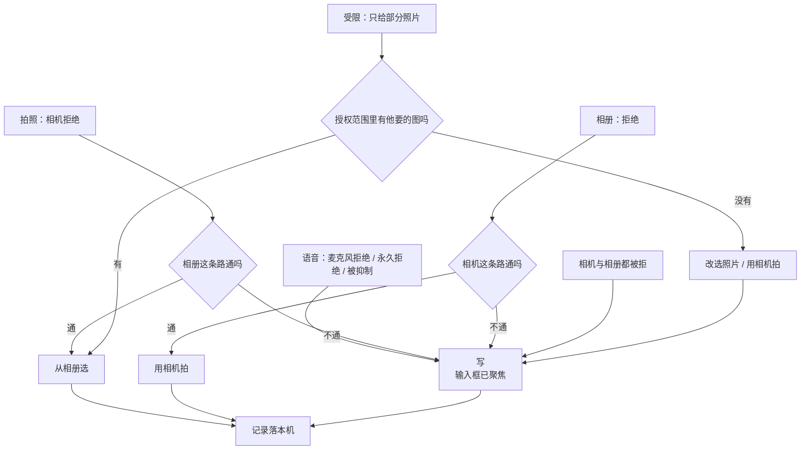
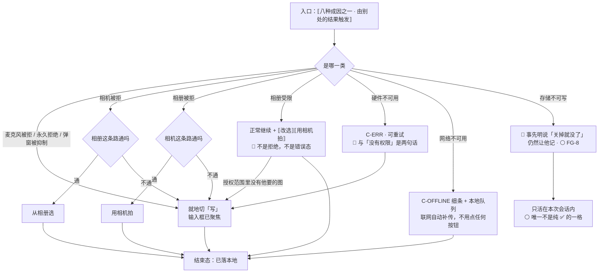

# U0.3 · 权限被拒后的降级路径

> **基线**：`origin/v1` @ `73041df`，fetch 于 2026-09-02。
> **状态：活跃。** 采集入口增删一个、某个拒绝态的落点变化、`FG-8` 有结论，本文同一次改动内更新。
> **上一层**：[M0 · 首次使用与权限](INDEX.md)

---

## 一、这个子能力是什么、不是什么

**是**：权限没拿到之后，用户还能不能记下这一笔——以及他被接到哪里。

**这一单元只有一条主张，其余全是它的展开：**

🔴 **四个采集入口（语音记 / 拍照记 / 粘一段 / 记做题）里，「粘一段」不需要任何系统权限**，
它在界面上就是那个「写」。**它是全部降级路径的共同终点**，也是「记录动作永不失败」在这一域的落点（`I-1`）。

**为什么点名的是它，不是「记做题」**：记做题同样不需要系统权限，但它需要骨架树就绪——
树没建好时它给的是空态、主按钮禁用（`记一次学习` §4.4）。**它是模型全挂时的保底，不是权限全挂时的保底。**
「粘一段」不依赖权限、不依赖骨架、不依赖网络、不依赖模型，四个都不依赖的只有它一个。

**不是**：不是权限什么时候申请（分工见域索引 §四）；不是各端的授权 API 差异（在 `多端选型与端矩阵`）；
不是采集本身的规格（在 `记一次学习` §四）。

---

## 二、详细产品逻辑

### 2.1 降级链：每一条都在两跳之内落到「写」



**三条读法：**

1. **每条链的终点都是同一个入口**，而那个入口在同一屏上永远可达（`FT-R2-07`）。
2. **降级不是把功能关掉，是换一条路。** 被拒的那个入口仍然显示、仍然可点。
3. **链最长两跳。** 相机 → 相册 → 写。没有第三跳，因为第三跳意味着用户在解决产品的问题。

### 2.2 逐个拒绝态：落哪、功能还能不能用、记录留没留住

| 拒绝态 | 拒绝后落哪 | 永久拒绝后 | 记录留住了吗 |
|---|---|---|---|
| **麦克风** | 就地切「写」，输入框已聚焦；录音入口保留，点了先出说明卡片 | 说明卡片换成去设置引导，**每次点仍然能重新看到，不禁用按钮** | ✅ |
| **相机** | 降到「从相册选」，相册也不行就切「写」 | 同上 + 去设置引导 | ✅ |
| **相册读取** | 降到「用相机拍」，相机也不行就切「写」 | 同上 + 去设置引导 | ✅ |
| **相册受限** | **不视为拒绝**，正常继续；要挑别的给「改选」入口 | —— | ✅ |
| **文件系统写失败** | 文字记录照落，图不存，顶部给一行提示 | 同左 | ✅ |
| **剪贴板写失败** | 页内提示，文本仍在预览框里可手动选中 | 同左 | 不涉及 |
| **网络不可用** | 进本地队列，顶部常驻细条 | 同左 | ✅ |
| **通知 / 定位 / 通讯录 / 日历 / 设备标识 / 蓝牙** | **不存在这一格** —— 没有申请就没有拒绝 | —— | —— |

🔴 **这张表里没有任何一格是「功能不可用，请去开启权限」。** 每一格都先给一条不需要权限的路，
**去系统设置永远排在最后一个**，它前面是这一格全部不需要权限的路（`M0-G2` 裁定，2026-09-02；真源 `首次使用与权限申请` §2.3）。

### 2.3 六种「看起来像拒绝但不是拒绝」的情况

**这一节存在的理由：把它们当成同一件事处理，用户就会收到一句解释不了他遭遇的话。**

| 情况 | 产品怎么处理 | 界面必须能与「被拒」区分吗 |
|---|---|---|
| **系统弹窗被抑制**（申请太频繁 / 系统策略） | 系统请求立刻返回拒绝，看起来像用户拒了。**按永久拒绝处理**，但话要说清是「弹不出来」不是「你拒过」 | ✅ 要 |
| **权限已允许但设备没有摄像头** | 入口不隐藏，点了给页内提示，落到相册或「写」 | 🔴 **必须区分**：「没有相机权限」和「这台设备的相机现在用不了」是两句话 |
| **权限已允许但麦克风被别的应用占着** | 页内提示 + 切「写」 | 🔴 同上 |
| **录音进行中用户去系统设置关掉权限** | 录音立刻停止，**已录的部分照样落成一条记录** | ✅ 要说清「已经录到的这一段给你记下来了」 |
| **权限长期未使用被系统回收** | 下次点击时按「未申请」走一遍完整流程，**不提示「权限被回收了」** | ❌ 不提示 —— 用户没做过任何事，没有需要他理解的东西 |
| **用户在系统设置里把「全部照片」改成「部分」** | 下次使用按受限档走，**不提示「权限降级了」** | ❌ 不提示 |

**判断规则**：只有当用户**下一步动作会因此不同**时，才告诉他区别。回收与降级不改变他的下一步，所以不说。

### 2.4 唯一一格不是纯 ✅ 的地方

**存储不可写时**（隐私模式 / 浏览器策略 / 磁盘满），记录只活在本次会话内，关掉就没了。
处置是**界面上明说**——「记的东西关掉就没了」——而不是悄悄丢。这一格登记为 `FG-8`，见 §五。

它不与「记录动作永不失败」冲突的理由要写清：失败的是**留存**不是**记录动作**，
而且用户在按下之前就被告知了。**一旦改成不告知，这条就变成红线命中。**

---

## 三、前端行为意图 × 后端契约意图

| 场景 | 前端行为意图 | 后端契约意图 |
|---|---|---|
| 被拒之后的落点 | 就地切到「写」，输入框已聚焦、键盘已起；不跳屏、不弹层、不让用户自己找 | 无端点。**服务端不需要知道用户拒了什么**，也不为降级路径改变写入语义 |
| 降级后落下的记录 | 与正常路径完全同一条主干：先写本机，再谈上行 | 同一个记录写入契约（`I-1`）。**没有「降级记录」这种类型** —— 端上的降级不进数据模型 |
| 录音中途被撤权 | 已录部分照样成一条记录 | 服务端按普通语音记录接收，不需要「不完整」标记 |
| 硬件不可用 vs 权限被拒 | 两种情况给两句不同的话 | 无契约面 —— 两者都不产生服务端交互 |
| 存储不可写 | 明说「关掉就没了」，仍允许记 | 这一格的补救需要一条不依赖本机存储的落点，**目前未定义**（`FG-8`），不许悄悄改成静默丢弃 |
| 离线 | 进本地队列，顶部常驻细条，联网自动补传，不需要点任何按钮 | 上行契约在 `记一次学习` 的离线队列一节；本域只要求：**队列存在与否不改变「已记下」这一刻的成立** |

---

## 四、边界与红线在这里的具体形态

| 红线 | 在这一单元的形态 |
|---|---|
| **记录动作永不失败** | 每条降级链的终点都能落一条记录；异常全集的「记录留住了吗」一列除存储不可写那一格外全 ✅ |
| **入口永不禁用** | 任何权限状态下入口都能点，点下去永远有一条走得通的路（`FT-P13`） |
| **不把用户堵死** | 「去系统设置」永远排在最后一个（`M0-G2`，2026-09-02）；没有一个不给出路的弹窗 |
| **受限不是错误** | 不许出现「权限不完整」「请授予完整访问」这类说法 —— 用户只给几张是他的决定 |
| **不做提醒** | 降级发生之后不再追着提醒用户去开权限；下一次他自己点了才再说一次 |
| **原图不上云** | 降级到相册路径拿到的图与拍照拿到的图去向完全一致：只在这台设备上（`I-5`） |

---

## 五、缺口登记

| # | 缺口 | 缺的是哪一半 | 该谁定 |
|---|---|---|---|
| `FG-8` | **存储不可写时那条记录只活在内存里，能不能变成 ✅** | 缺一条不依赖这台设备存储的落点。账号在新形态下一定已经有了，所以卡住的收窄成「离线 + 存储不可写」这一格。现状是界面已明说，不是悄悄丢 | 技术。它挡住的是「记录动作永不失败」在极端端上的完整成立 |
| `FG-2` | **去系统设置该跳哪一页**，以及桌面壳上「弹窗被抑制」怎么判定 | 缺实测：壳的两层授权谁先谁后、拒绝后网页层拿到什么错误没人验过 | 技术 |
| `FG-1` | **移动端的降级链一次都没在真机上走通过** | 缺实测。链本身已定，但媒体能力在 Tauri 移动端还没有代码，链落不落得下来未知 | 技术。复现同域索引 §七 |

---

## 六、线框

> 记号与屏宽照 `线框与交互规格约定` §三，组件只引锚不抄规格。
> **本单元没有自己的屏**，画的是 `S-REC` 在降级发生之后长什么样（共享结构见 `记一次学习` §四）。
> 🔴 **降级不是把功能关掉，是换一条路** —— 所以下面每一张里，被拒的那个入口都还在、还可点。

### 6.1 常态整屏 —— 麦克风被拒之后就地切「写」

```
┌────────────────────────────────────────┐
│ ‹ 返回 › ⟦模式段控⟧ 当前 = 写      ※1  │
│ ⟦离线 / 同步中细条⟧  ← C-OFFLINE       │
├────────────────────────────────────────┤
│ 中 · 采集区 = 输入框                   │
│  ▢ ⟦输入框 · 🔴 光标已在里面⟧      ※2  │
│  ⟦一句话 → 首次使用 §2.2⟧  ← C-INLINE  │  ※3
├────────────────────────────────────────┤
│ 底 · ▢ ⟦来源框 · 选填⟧                 │
│ (         记下         ) ← C-BTN 主    │  ※4
└────────────────────────────────────────┘
```

※1 🔴 **被拒的那个模式仍然在段控里、仍然可点**，不灰、不隐藏、不加角标（§2.2 / `FT-P13`）。再点一次照常出说明卡片或去设置引导 —— **每次点仍然能重新看到**
※2 🔴 **不跳屏、不弹层、不让用户自己找。** 「就地」的判据是：从系统弹窗消失到光标可以打字，用户**一次点击都不用做**
※3 用 `C-INLINE` 不用 `C-ERR`：`C-ERR` 用于一次失败的往返，而这里没有往返 —— 用户没做错任何事，产品也没坏
※4 主按钮位置与禁用条件照 `S-REC` 原规则，**降级不改变它** —— 降级路径与正常路径落的是同一条记录（`I-1`）

🔴 **这张框里没有的东西**：没有「功能不可用」、没有整屏拦截、没有「请先开启权限」的空插画、没有把「去设置」做成唯一出路的弹窗。

### 6.2 三种成因、三句必须彼此不同的话；两种成因、一个字都不说

**这一节是本单元最容易被实现成一句通用文案的地方。** 判断规则只有一条：
**只有当用户的下一步动作会因此不同时，才告诉他区别。**

| 成因 | 下一步会不会不同 | 界面 |
|---|---|---|
| **权限被拒** | ✅ 会 | `C-INLINE` 一句 + 就地切「写」 |
| **权限已允许但硬件不可用**（没有摄像头 / 被别的应用占着） | ✅ 会 | 🔴 **必须是另一句话**（`FP-09` / `FP-10`）—— 说成「没有权限」，用户会去改一个改了也没用的开关 |
| **系统弹窗被抑制** | ✅ 会 | 按永久拒绝处理，但话要说清是「**弹不出来**」不是「你拒过」 |
| **权限被系统长期未使用回收** | ❌ 不会 | 🔴 **一个字都不说**，按未申请走一遍完整流程 —— 用户没做过任何事，没有需要他理解的东西 |
| **全部照片被改成部分照片** | ❌ 不会 | 🔴 **一个字都不说**，下次使用按受限档走 |

⚠️ **录音进行中被撤权是第六种，它不属于上面任何一档**：录音立刻停止，**已录的部分照样落成一条记录**，
界面要说清「已经录到的这一段给你记下来了」——这一句的作用是让用户知道**没白说**，不是解释权限。

### 6.3 受限访问：采集区顶部一行 + 两个入口

```
│ 中 · 采集区 · 顶部多一行               │
│  ⟦你只给了几张，要挑别的可以改选⟧ ※5  │
│  [ ⟦改选照片⟧ ] [ ⟦用相机拍⟧ ] ← 次   │
│  ⟦已授权那几张的缩略图⟧                │
│  顶 / 底 ⟦同常态⟧                      │
```

※5 🔴 **受限不是错误态，也不是拒绝**：不用告警色、不用 `C-ERR`、不许出现「权限不完整」「请授予完整访问」（§2.2）。授权范围里没有他要的那张时，出路是「改选 / 用相机拍」两个入口，**不是劝他给全部**

### 6.4 唯一一格不是纯 ✅ 的：存储不可写

```
│ 顶 · 采集区之上，常驻一行          ※6  │
│  ⟦记的东西关掉就没了 → 记一次学习 §四⟧ │
│    ← C-INLINE · 🔴 在按「记下」之前    │
│  中 / 底 ⟦同常态⟧ · 主按钮不禁用   ※7  │
```

※6 🔴 **这一行必须在按下「记下」之前就在屏上。** 一旦改成事后告知或不告知，这一格就从「用户已知的代价」变成红线命中（§2.4）——失败的是**留存**不是**记录动作**，而这个区别只有在用户事先被告知时才成立
※7 仍然让他记：一条只活在本次会话里的记录，也比一个点不动的按钮有用

⚪ `FG-8` 挡的是这一格**能不能变成 ✅**，不是它现在要不要说。🔴 **不许因为 `FG-8` 没结论就把这一行去掉。**

### 6.5 红线自查十条，逐张数过

| # | 数这一样 | 本单元 |
|---|---|---|
| 1–2 | 正确率 / 讲解 / 学习建议 | **0**：降级文案只说「还能怎么记」，不评价用户的选择，也不解释他该怎么学 |
| 3–4 | 提醒 / 推送 / 打卡 / 徽章 | **0**：🔴 降级发生之后**不再追着提醒用户去开权限**（§四）—— 下一次他自己点了才再说一次。产品里没有第二次主动提起 |
| 5–6 | 进度环 / 百分比 / 倒计时紧迫感 | **0**：这几格没有任何数字 |
| 7 | 能装下题干的格子 | **0**：降级终点是 `S-REC` 的输入框，它属 `S-REC` 共享结构，装的是用户随手写的一句，不是题目；本单元不新增任何输入框、示例或占位（`FT-E10`） |
| 8 | 置信度 / 匹配分 | **0**：本单元不产生标签 |
| 9 | 原图的分享 / 导出 / 同步入口 | **0**：降级到相册路径拿到的图与拍照拿到的图**去向完全一致**——只在这台设备上（`I-5`）。这几格里没有「保存到相册」「分享」 |
| 10 | 三处必须出现的东西 | 本单元不承载这三处，也**不弱化**它们：降级不改变原图去向，同意点、到期倒计时、立即删除入口的画法在 `模块地图` §三登记的 `U8.3` / `U8.4` |

---

## 七、交互规格

### 7.1 必答五项

| # | 必答 | 本单元的答案 |
|---|---|---|
| 1 | **入口** | 🔴 **用户永远不会主动进入这一格**，它由别处的结果触发。八处，逐条列全：麦克风 / 相机 / 相册各自的拒绝与永久拒绝，相册受限，文件系统写失败，剪贴板写失败，网络不可用，存储不可写。⚠️ **通知 / 定位 / 通讯录 / 日历 / 设备标识 / 蓝牙不在这张表上**——没有申请就没有拒绝，那一格不存在 |
| 2 | **结束状态** | 主轨「**已落本地**」，一条不少；标签轨从 `TS-00` 照常起步（`模块地图` §四）。🔴 **降级路径与正常路径落的是同一条记录**，数据模型里**没有「降级记录」这种类型**——端上的降级不进数据模型 |
| 3 | **失败落点** | 每条链**两跳之内**落到不需要任何权限的那个入口，🔴 **没有第三跳**——第三跳意味着用户在替产品解决问题（§2.1）。落点永远是 `S-REC` 本屏，输入框已聚焦、键盘已起。唯一不是纯 ✅ 的一格是存储不可写，处置见 §6.4 |
| 4 | **空态** | **不涉及。** 这一格不是一次查询，没有「零结果」这种可能 |
| 5 | **错误态** | 🔴 **权限被拒不是错误态**，用 `C-INLINE`（§6.1 ※3）。真正可重试的错误只有硬件不可用与剪贴板写失败；不可重试的只有存储不可写，它的出路是「照样记，但关掉就没了」而不是拦住用户。**没有陈旧数据态**——这几格不读服务端数据 |

**受限态**：不涉及额度（`I-4`）；「相册受限」是一种**正常授权**，不是 `C-LIMIT`。
**离线态**：`C-OFFLINE` 常驻细条 + 本地队列，联网自动补传，🔴 **不需要用户点任何按钮**。

### 7.2 交互流程



🔴 **每一条边都落到一个能落下记录的节点**，包括最后那一条——它落下的记录活得短，但它不是一个「知道了」。
⚠️ **本单元没有一个运行期端点，`[契约缺]` 为 0。** 服务端**不需要知道用户拒了什么**，也不为降级路径改变写入语义。唯一未定义的是 `FG-8` 那条不依赖本机存储的落点，它是缺一条**技术**结论，不是缺一行契约 —— 🔴 在它定下来之前，不许悄悄改成静默丢弃。
