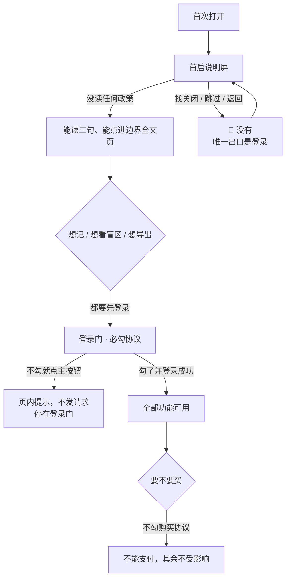

# U0.4 · 隐私与合规的用户可见部分

> **基线**：`origin/v1` @ `73041df`，fetch 于 2026-09-02。
> **状态：活跃。** `FG-4` 拿到法务口径、`FG-5` 有结论、同意点增删一处，本文同一次改动内更新。
> **上一层**：[M0 · 首次使用与权限](INDEX.md)

---

## 一、这个子能力是什么、不是什么

**是**：合规这件事里**用户读得到、点得到的那一部分** —— 在哪一步告诉他什么、哪一步要他勾一次、
不勾会怎样，以及各端商店要产品填的那些声明分别依赖什么。

**不是**：

- **不是隐私政策与用户协议的正文** —— 那是律师稿，产品不写、不改、不代拟。
- **不是合规轨本身**（主体认证、备案、软著、类目）—— 那些「谁负责」写着合规轨的格子，产品既不裁定也不估时点。
- **不是法务判断** —— 本单元最重要的一条 🚧 `FG-4` 就是产品定不了的那种问题，只登记。

一句话立场：**产品负责把「什么时候说、说清哪件事、要不要勾」定下来；说什么由律师稿定，能不能这么做由法务定。**

---

## 二、详细产品逻辑

### 2.1 四个说明点，各说各的一件事

| 场景 | 在哪说 | 必须说清哪件事 | 要不要勾选 |
|---|---|---|---|
| **首次打开（还没登录）** | 首启说明屏 + 它上面通向边界全文页的入口 | 三件用户会担心的事：不判断对错、不存题目内容、原图只在这台设备上 | ❌ **不勾选、不拦截**；勾选发生在下一步的登录门上 |
| **首次登录** | 登录屏的协议勾选行 | 已阅读并同意用户协议与隐私政策 | ✅ **必勾，默认不勾**（`登录与账号` §2.2） |
| **首次购买** | 购买确认页 | 购买相关协议 | ✅ 必勾（`额度与购买` §3.2） |
| **首次用到某个权限** | 该权限的产品自有说明卡片 | 这一个权限要来干什么、拿到的东西去哪 | ❌ 不勾选，点按钮即表示继续 |

**这张表的第一行正是 `FG-4` 卡住的那一格**，见 §五。

### 2.2 不同意会怎样

**两条要写清的后果：**

1. **不勾协议 = 停在登录门**，而不是「降级使用」。🔴 **没有绕过登录的第二条路**（2026-09-02 裁定）。
2. ⚠️ 原先挂在这里的一条红线「不许把『不同意就不能用』当作解法」**已随该裁定作废** ——
   它保护的是本机模式，而不登录已经什么都不能做，这条约束没有保护对象了。
   **不改写成别的红线。** 剩下的规矩仍然是：拿不准就停下来问，不自行放宽。

### 2.3 商店要产品填的那些格子，分别依赖什么

**这一节只做分层，不裁定任何一格能不能过。**

| 谁负责 | 有哪些 | 依赖什么 |
|---|---|---|
| **产品填** | App Store 隐私营养标签、Google Play Data Safety、国内商店的个人信息收集清单、小程序的用户隐私保护指引 | 全部取自权限全表。本产品的答案接近全空：不收集设备标识、不收集位置、不收集通讯录，`scope` 只有录音一项 |
| **产品给文案、壳侧注入** | iOS 各权限用途描述、Android 权限声明 | 逐条来自产品自有说明那一节；**缺一条即被自动打回**，多一条即违反最小权限 |
| **产品 + 主体** | 账号删除入口（已有）、若提供第三方登录则必须提供 Apple 登录 | `登录与账号` §七 / `L-1` |
| **技术** | 目标 API 版本、`wx.requirePrivacyAuthorize` 接入、SDK 清单（本产品无第三方 SDK，壳侧有构建期黑名单拦截） | 端能力 |
| **合规轨** | 主体认证四者同一、服务类目、ICP 备案、软著 | 产品不裁定、不估时点 |
| 🚧 **未定** | 未成年人分级问卷 / 家庭政策目标年龄段 | 依赖 `FG-5`，而 `FG-5` 依赖 `FG-4` |

**一条产品判断值得留在这里**：本产品在这些表格里的答案之所以接近全空，不是因为「还没做数据分析」，
而是因为不申请的权限一开始就不申请、埋点只有四个。**合规成本低是边界的副产品，不是单独做出来的东西。**

### 2.4 年龄门槛的现状

| 问题 | 现状 |
|---|---|
| 产品面向谁 | 公考与考研考生，绝大多数是成年人 |
| 会不会有未成年用户 | 可能有；产品**不主动识别年龄** |
| 现在有没有门槛 | ❌ 没有。首次打开不问年龄、不问身份、不问任何东西 |
| 需不需要 | 🚧 **产品不裁定**，见 `FG-5` |
| 如果需要，放哪一步 | 两种可能，**都不是首次打开**：① 首次登录时（已有一次协议勾选，可以合并）；② 首次购买时。首次打开加年龄门槛等于把注册式表单摆回门口 |

🔴 **在这一条定下来之前，界面上不出现任何年龄相关的输入、选择或声明。**
有入口而没有流程比没有入口更糟。

---

## 三、前端行为意图 × 后端契约意图

| 场景 | 前端行为意图 | 后端契约意图 |
|---|---|---|
| 首次打开的告知 | 登录之前只有一屏静态说明与一道登录门，**不收集、不上传、不产生处理行为** | **零端点。** 这一状态下服务端不接收任何请求，也不许要求端上先上报什么才能渲染 |
| 边界全文页 | 无登录要求，离线可读，页上无可点元素 | 文案是构建期打进包里的静态串，🔴 **不许接口下发** —— 下发意味着边界能被服务端悄悄改（`设置与原图` §3.1） |
| 协议勾选 | 默认不勾；未勾就点主按钮时给页内提示并**不发请求** | 同意这件事发生在登录动作里，契约在 `登录与账号` §二 |
| 协议版本 | 按版本号判断要不要重新勾一次；**拉不到正文时不许当作已同意** | 服务端给当前版本号与正文地址，端点 🚧 待技术定稿（`登录与账号` §十四） |
| 商店声明 | 界面上不出现任何未申请权限的字眼 | 声明内容取自权限全表，产品填、壳侧构建期注入；无运行期契约 |
| 年龄 | 界面上一个年龄相关元素都没有 | **不定义任何与年龄有关的字段或参数** —— 定了就会有人往里写 |

---

## 四、边界与红线在这里的具体形态

| 红线 | 在这一单元的形态 |
|---|---|
| **边界只有一种说法** | 用户可读的边界全文只有一份，本单元只是它的消费者；不因为合规文本需要而另写一版 |
| **不存题干** | 首次可见的全部文案（说明屏、登录门、权限说明、协议入口）没有一处能容纳题目内容，也没有示例或占位（`FT-E10`） |
| **不判断对错** | 合规文案同样受禁用词表约束，通读一遍不许命中任何一个（`FT-E09`） |
| **不做提醒** | 协议更新时的再次勾选发生在用户下一次登录时，不靠通知推给他 —— 通知权限根本不申请 |
| **原图不上云** | 隐私声明里关于原图的表述与边界全文页第三条同源，不另写、不缩写 |
| **不申请的权限不出现** | 商店声明填「不收集」，但界面上不因此写一句「我们不收集你的位置」自夸 |

---

## 五、缺口登记

### ⚠️ `FG-4` —— 需法务口径，产品定不了

**问题**：「首次运行必须明示同意」这条要求，能不能由登录门上的必勾协议满足。

**背景**：2026-09-02 裁定「没有本地模式」之后，原问法（本机模式下不做任何同意动作合规上成不成立）的前提没了，
**但合规问题本身没消失，只是主体换成了登录之前的那一屏产品说明**。

**产品的理解（写在这里是为了让法务有一个可否定的对象，不是结论）**：登录之前只有一屏静态说明与一道登录门，
不收集、不上传、不产生个人信息处理行为，一切处理行为都发生在必勾协议的登录之后，因此明示同意发生在登录门上就够了。

🚧 **这是产品的理解，不是法务结论。** 如果境内口径要求同意必须发生在**首次运行的第一屏**，
那就得在首启说明屏上再加一次同意动作，§2.1 那张表的第一行要改。

**它挡住什么**：§2.1 表第一行那一格能不能是「不勾选、不拦截」；以及 `FG-5`。

**复现**：读 §2.1 表第一行，问法务这一格能不能是「不勾选、不拦截」。

⚠️ 原先挂在这条上的红线「不许把『不同意就不能用』当作解法」**已随裁定作废**（它保护的是本机模式），
**不改写成别的红线**。

### 其余两条

| # | 缺口 | 缺的是哪一半 | 该谁定 |
|---|---|---|---|
| `FG-5` | **要不要年龄门槛，以及放在哪一步** | 依赖 `FG-4` 的合规结论与商店未成年人问卷口径。产品面向成年考生，但产品不能自己裁定未成年人保护的适用性 | 合规 + 人裁定。它挡住两家商店的分级问卷，而问卷不填不能提交 |
| `FG-7` 残留 | **2026-09-02 之前已装旧版本、这台设备上已有数据的用户，登录时这批数据怎么办** | `FG-7` 主体已随裁定作废（登录前不产生数据），残留这一格没人接 | 已上报待拍板 |
