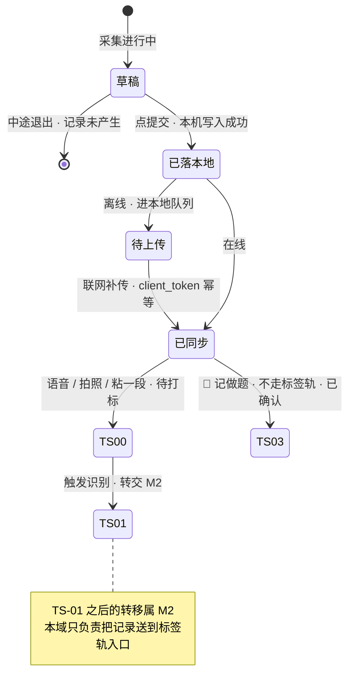

# M1 · 记录

> **基线**：`origin/v1` @ `73041df`，fetch 于 2026-09-02。
> **状态：活跃。** 采集入口增删、主轨状态名变化、`记一次学习` §1.2 那张允许失败清单增删一行，本文同一次改动内更新。
> **上一层**：[模块地图](../INDEX.md)

---

## 一、这一域在减法的哪一端

**收减数。** 但要说准：M1 交出的多数不是减数本身，是**减数的原料**。

`盲区 = 考点全集 − 你实际碰过的`。右边那一项由「碰过某个考点」的集合构成，
而 M1 只保证「碰过某件事」这条记录存在；它身上挂没挂考点由 M2 决定 —— 未分类不进行为层（`I-2`）。

**唯一的例外是 `U1.5` 记做题**：考点由用户自己从树里选出，它交出的直接就是减数，不经打标。
这条例外的价值不在效率，在于它是**模型全挂时减数仍能增长的唯一通道**。

**这一端的成本压力全部落在一处**：`用户价值与主流程` §1.3 把用户的卡点定为「不是不想记，是记一次太贵」。
所以本域不做「记得更准」，只做「记得更便宜、且永远记得上」。

---

## 二、它服务于主流程的哪一步

**`J2` 记一笔。** 只此一个节点，`记一次学习` 覆盖的 `S-HOME` `S-REC` `S-TL` 三屏都落在它上面。

三处与相邻节点的分界要说死：

| 分界 | 归属 | 依据 |
|---|---|---|
| 落本地 → 识别 | **落本地属 `J2`，识别属 `J3`**。`J2` 完成于 `J3` 之前，中间没有等待 | `用户价值与主流程` §2.2 第 1 条 |
| 没对上之后自己挑一个 | 属 `J4`，不属本域。本域只负责把「没对上」这个状态摆到用户面前 | `用户价值与主流程` §二 |
| `S-TL` 时间线 | **不在主旅程上**。它是 `J2` 之后的回看入口，产品价值是**信任**不是流程 | `用户价值与主流程` §三 |

`J2` 失败的代价在 `用户价值与主流程` §2.1 写着：**整个产品作废**。这是七个节点里唯一被这样标注的一个。

---

## 三、它服务于哪一个关卡

**阶段 0 关卡：自己用两周，每天记两个数。**

那两个数 —— `record_created` 与 `record_skipped` —— **只从这三屏产生**（`记一次学习` 导语、§十四）。
别的域再怎么写，都不产生这个关卡的输入；本域是它唯一的生产者。这是本域在度量上的位置，不是一种功能归属。

关卡由人判定，`pass` / `fail`，**不是可调目标**。数据卡在临界线上时不要微调产品再试一轮 ——
同一关卡失败三次就是失败。本域文档一个关卡数字都不产生，它只保证「数能被产生出来」。

⚠️ 埋点来源枚举与四个采集入口对不上（`记一次学习` `G-12`），这会直接影响 `record_created` 的口径唯一性。
登记在 §七，本域不裁定。

---

## 四、能力单元清单与下钻

| 单元 | 管什么 | 这一份文档独有的决策 |
|---|---|---|
| [`U1.1` 记录动作永不失败](U1.1-记录动作永不失败.md) | 整域命门，`I-1` 的落点 | 允许失败的清单是**穷举**的；不在表上的都不许失败；14 个失败注入点各验哪一条 |
| [`U1.2` 语音记一笔](U1.2-语音记一笔.md) | 说一句 | 时长上限自动切断是正常路径；静音判无有效语音；录到一半退出 |
| [`U1.3` 拍照记一笔](U1.3-拍照记一笔.md) | 拍张图 | 单次张数上限；HEIC 本端转码；尺寸格式不合格的那张不落 |
| [`U1.4` 粘一段](U1.4-粘一段.md) | 打字或粘贴 | 长度上限截断不是失败；剪贴板永不主动读；来源名称怎么填 |
| [`U1.5` 记做题](U1.5-记做题.md) | 用户已自选考点 | 🔴 **不走标签轨**，`已同步` 之后直接 `TS-03`；模型全挂时的保底路径 |
| [`U1.6` 离线队列与自动补传](U1.6-离线队列与自动补传.md) | 没网的时候 | 队列条数可见；`client_token` 幂等；联网自动补传不需要点任何按钮 |
| [`U1.7` 时间线回看与删记录](U1.7-时间线回看与删记录.md) | 记完之后 | 为什么没有筛选与搜索；删除的完整路径与可逆性 |

**域内共享、单元文档不各自复述的三件事：**

1. **三屏**：`S-HOME`（让「再记一条」的距离最短）、`S-REC`（四种采集共用一屏，靠模式段控切换）、`S-TL`（回看）。
2. **四个采集入口**：语音记、拍照记、粘一段、记做题。真源 `记一次学习` §四 —— 它同时写死了
   **没有第五种入口**：系统分享入口不接（它绕过「用户同意留存的那一刻」），批量导入不是采集方式（那是 `U1.6` 的补传）。
3. **共同骨架**：`选方式 → 采集 → 落本地 → 反馈 → 附加能力异步跑 → 卡片状态更新`。
   四种方式**只在「采集」这一段不同**（`记一次学习` §4.6）。模式段控切换不打断已落本地的记录 ——
   每次落本地都独立成立一条，段控换的是采集形态，不是「当前这一条」。

---

## 五、域级状态机

**状态名全部取自 `模块地图` §四，本域不自造。** 本域只走到 `已同步` 与标签轨的入口；
`TS-01` 之后的转移属 M2，这里只画本域看得见的那几条边。

**分界在 `已落本地`**：这一态之前，一切失败都不影响「这条记录在不在」；这一态之后，
失败只发生在附加能力与补传上，不回滚记录（`I-1`）。

**`草稿` 不是一条记录。** 用户中途退出时记录「还没产生」，这与「记录丢了」是两件事 ——
前者是用户没完成采集动作，后者是违规（`记一次学习` §4.5）。

**计覆盖度的只有标签轨。** 主轨四态一个都不计；`已同步` 之后由标签轨决定（`模块地图` §4.2）。

---

## 六、前端行为意图 × 后端契约意图

**域级的六条。** 单元级的成对表在各自文档 §三，这里只放四种方式共用的那部分。

| 动作 | 前端行为意图 | 后端契约意图 |
|---|---|---|
| **落本地** | 提交那一刻先写本机存储，写入成功即给反馈；**不发起任何网络请求，不出现等待遮罩，提交按钮不因等待而禁用** | **不涉及后端。** 这一步没有契约，是它的性质：有契约就意味着有一次往返可以失败 |
| **创建一条记录** | 本机写入成功之后才发 `POST /records`；失败不回滚本机那一条，改进队列 | 返回记录标识即成功；**失败不改变「记录已在本机」这一事实**；请求体里没有任何指向已上传文件的引用（`后端系统设计与组件接入` §1.2） |
| **附加能力** | 三条独立通道：音频转写、图片识别、闭集打标。任何一条失败只改卡片上的状态，不改记录的存在 | `/records/{id}/audio` 与 `/records/{id}/image` 各自**必须能区分四档**：成功 / 无有效内容（`NO_MATCH`） / 服务不可用 / 额度不足 —— 三档界面表现完全不同，混成一档界面就只能说一句含糊的话（`后端系统设计与组件接入` §1.5） |
| **闭集打标** | 只把候选里的节点标识发回，**永不提交标签文本**；收到候选集之外的标识或文本，整条当无匹配丢弃 | `/records/{id}/tags/suggest` 只返回节点标识或 `NO_MATCH`，不接受调用方指定标签文本（`I-3`） |
| **离线补传** | 联网即自动开始，队列条数在三屏顶条可见，**没有任何手动同步按钮** | `POST /records/batch` **幂等**：重试、重发、跨设备重放都不产生第二条，静默去重（`I-1` 的补传侧） |
| **删除一条记录** | 不可逆动作走浮层确认；确认前必须说清它**不影响原图** | `DELETE /records/{id}` 级联删标签、触发覆盖层重算（`I-6` 的同一套重算） |

🔴 **额度在这张表里只出现一次，且不出现在前两行。** 额度耗尽时记录照常落库，只是不打标、降级为手动 ——
这是 `I-4` 在本域的全部形态。任何让额度检查前置到记录写入之前的实现，都同时违反 `I-1` 与 `I-4`。

---

## 七、这一域碰到的边界 + 缺口登记

### 7.1 红线在本域的形态

| 红线 | 在本域长什么样 |
|---|---|
| **不判断对错** | 三屏上的数字只有条数、次数、时间点。没有任何一处对「记了什么」作评价；`record_skipped` 的入口既不做负面反馈也不做正面反馈 —— 两个方向都是替用户判断（`记一次学习` §3.4） |
| **不存题干与机构内容** | 落本地写的是「碰过什么、来源是什么、什么时候」。来源框只收**名称**，`Touch` 里没有能装下转写文本或题干的字段 —— 「不碰内容」不是靠不填，是靠**没有位置**（`后端系统设计与组件接入` §1.2） |
| **闭集打标** | 本域只负责把候选与字节交出去，不生成任何标签文本；`U1.5` 的树选择器同样只输出节点标识，**不能新建标签** |
| **原图不上云** | 识别时内联一次即弃，服务端不落盘、不入日志、不经厂商暂存（`I-5`）。原图的存放、到期、归档全部不在本域，指针见 `模块地图` §三登记的 `U8.3` |
| **没有第四种反馈形态** | 补传全程不播报、不弹浮层、不给小红点与未读计数；顶条是状态显示不是提醒（`记一次学习` §9.3） |

### 7.2 缺口登记 —— 只登记，不裁定

| 缺口 | 缺的是哪一半 | 该谁定 |
|---|---|---|
| `G-1` 本地队列长度上限 | 后端/客户端两半都缺：上限值未定，现状按「不设上限」实现，离线两周攒下的量会不会拖垮补传**没有实测过** | 由人拍板，需要一次实测 |
| `G-2` 离线补传的时间归属偏移 | 产品口径缺：时间取落本地时刻、由服务端打戳，补传整体后移算到哪一天没定（`R-79` 已登记未决） | 由人拍板 |
| `G-3` 「一天从哪儿开始」 | 文档侧全缺：配置里有值，但那是**代码替文档做的决定**（`R-81`） | 由人拍板，待 `R-81` 落笔 |
| `G-4` 删除后覆盖度怎么回退 | 前端缺：级联与重算有契约，重算完成前盲区屏显示什么、有没有过渡态没定 | 由人拍板 |
| `G-5` 删除能不能撤销、窗口多长 | 中间那一半缺：前端有删除动作、后端有级联契约，**可逆性从没有人定过** | 由人拍板 |
| `G-6` 批量补传接受什么格式、有没有用户侧导入入口 | 后端缺：`记一次学习` §四已写死没有面向用户的导入入口，但批次格式仍悬空 | 由人拍板 |
| `G-7` 原图归档后记录卡片上的图标记怎么处理 | 两域之间的联动缺 | 由人拍板 |
| `G-8` `record_skipped` 误点没有撤回路径 | 产品口径缺 | 由人拍板 |
| `G-9` 语音最短时长 | 数值缺：真源里这一段没有量化 | 由人拍板，以真源为准 |
| `G-11` HEIC 转码的目标格式与失败降级 | 技术缺 | 🚧 待技术定稿 |
| `G-12` 埋点来源枚举里的「批量」与四个入口对不上 | 口径缺：两处说法冲突，直接影响关卡的那个数 | 由人拍板 |
| `G-13` 多语言做不做 | 产品缺：现状「界面仍为中文」是默认值不是决定 | 由人拍板 |
| `G-14` `record_skipped` 的撤回与去重 | 口径缺 | 由人拍板 |
| `G-15` 队列满降级的实测口径 | 跟着 `G-1` 走 | 由人拍板 |

**全部编号取自 `记一次学习` §十七，本域不新开编号、不改写、不合并。**
`G-10` 已在真源里裁定作废（不存在本机模式），编号保留不复用。
