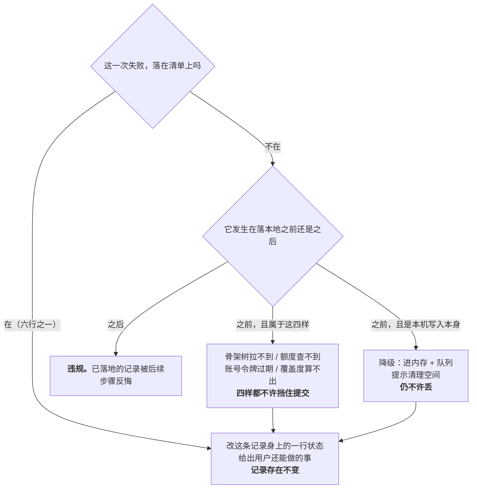

# U1.1 · 记录动作永不失败

> **基线**：`origin/v1` @ `73041df`，fetch 于 2026-09-02。
> **状态：活跃。** `记一次学习` §1.2 那张允许失败清单增删一行、四条推论任一条变化、§16.1 的失败注入点增删，本文同一次改动内更新。
> **上一层**：[M1 · 记录](INDEX.md)

---

## 一、这个子能力是什么、不是什么

**它是 `I-1` 在本域的落点，是整个 M1 的命门。**

`I-1`：记录先落地，识别在后。断网、模型超时、密钥没配、额度用尽，都不许让「记一笔」失败。
违反它的后果 `模块地图` §五 写着：**整个产品作废**。

**它不是「错误处理章节」，也不是「重试机制」。** 它规定的不是「怎么少失败」，而是**失败允许落在哪里**：

- 它**不消除失败**。转写会挂、识别会超时、额度会耗尽 —— 这些照常发生。
- 它规定这些失败**只能改变一条记录身上的一行状态，不能改变这条记录是否存在**。
- 它给出一张**穷举**的清单：清单上的能失败，清单外的一律不许失败。

**它也不管「记得准不准」。** 准不准是 M2 的事，而且本产品结构上不判断对错。
本单元只回答一件事：**用户按下之后，那一条记录还在不在。**

---

## 二、详细产品逻辑

### 2.1 一条硬规则

> **记录动作永不失败。**

离线、识别服务挂了、额度用完了、骨架还没建好、登录态失效了、麦克风没权限、相册只授权了三张、
本机磁盘写满了、进程刚才被系统杀掉 —— 这一条记录都必须落下来（`记一次学习` §一）。

可以失败的只有它的**附加能力**，失败时记录本身照样在，只是少了那一样。

### 2.2 四条推论 —— 每一条都能单独证伪一个实现

| # | 推论 | 反面判据（踩上就是违规） | 为什么这条推论必须单独存在 |
|---|---|---|---|
| 1 | **本地落盘即反馈。** 提交后的那次反馈由本机写入触发，不等任何一次网络往返 | 界面上出现过一次「正在保存」的转圈遮罩 | 没有它，「永不失败」就退化成「失败了会重试」—— 用户仍然要等，等待里仍然有一个可以失败的点 |
| 2 | **识别是第二次往返，不是第一次的后半段。** 落地与识别之间没有等待 | 提交按钮在识别返回之前保持禁用 | 没有它，识别的可用性就变成记录的前置条件，`I-1` 全线倒塌 |
| 3 | **附加能力的失败只改卡片上的一行状态，不改记录的存在** | 任何一条失败路径把已落地的记录回滚掉 | 没有它，「记录已落地」会被后续步骤反悔 —— 而用户已经收到过成功反馈了 |
| 4 | **每一条失败路径都要指向一个「用户此刻还能做的事」** | 出现没有下一步的死路 | 没有它，前三条只保住了数据，没保住用户会不会记第二次 —— 而卡点本来就是「记一次太贵」 |

**这四条不是设计原则，是可执行的检查。** 每一条都在 `记一次学习` §十六 有对应用例：
推论 1 → `A-43`（要求抓包确认反馈发生在任何请求之前）；推论 2 → `A-02` `A-03`；
推论 3 → `A-03`–`A-14`；推论 4 → §十五 全表的「用户下一步」列**不许有空格**。

### 2.3 允许失败的清单 —— 穷举，不在这张表上的都不许失败

| 能失败的 | 失败之后记录变成什么 | 用户还能做的事 |
|---|---|---|
| 语音转写 | 记录在，内容为空，标为语音来源 | 重试 / 自己补一句文字 / 自己从树里挑考点 |
| 图片识别 | 记录在，原图在本机，没有考点 | 重试 / 手动挂载 |
| 闭集打标 | 记录在，落 `TS-05` 没对上 或 `TS-06` 待补 | 手动挂载 / 就这样留着 |
| 原图本机留存 | 记录在，这条记录没有图 | 去清理本机空间 / 什么都不做 |
| 补传到服务端 | 记录在本机队列里，条数可见 | 什么都不用做，联网自动补 |
| 挂载到某个考点 | 记录在，没挂上 | 换一个考点再挂 |

**这六行之外的任何一样东西失败，都不允许影响「这一条记录存在」这件事。**

真源点名了四样**最容易被误当作前置条件**的东西，它们四样都不在表上、四样都不许挡住记录：

### 2.4 唯一一处真正的裂缝，以及它为什么不算违规

`后端系统设计与组件接入` §1.5 写着一句和本单元表面冲突的话：**数据库不可用是唯一会让写入失败的一环。**

两者的调和是本单元最重要的一次澄清：**那说的是服务端写入，不是本机落地。**

| 环节 | 能不能失败 | 失败之后 |
|---|---|---|
| 本机落地 | 🔴 **不能。** 存储写满、不可写、本地库损坏时降级到内存 + 队列 | 记录仍在，仍计数，仍等联网补传 |
| 服务端写入 | 可以。它是清单第 5 行「补传到服务端」 | 记录留在本机队列，条数可见，联网自动补 |

同一份技术文档也把这条钉死了：**采集端必须本地保留，不得丢弃。**
所以「唯一会让写入失败的一环」在用户那里的表现是「这条还没同步」，不是「这条没了」。
**降级方向是「少功能」，不是「少记录」**（`后端系统设计与组件接入` §1.5）。

### 2.5 十四个失败注入点，各自验的是哪一条

`记一次学习` §16.1 的 `A-01`–`A-14` 全部是 `P0`。它们不是十四条互相重复的冒烟用例 ——
**每一条注入的是不同的一环，验的是上面不同的一条规则。**

| 注入点 | 注入什么 | 验的是哪一条 |
|---|---|---|
| `A-01` | 全程断网，四种方式各记一条 | 清单第 5 行（补传可失败）+ **推论 1**：落地不等网络，四条全落 |
| `A-02` | 转写服务 5xx | 清单第 1 行 + **推论 3**：反馈先于失败发生，失败只改一行状态 |
| `A-03` | 识别请求超时 | 清单第 2 行 + **推论 4**：给得出「重试 / 手动挂」两条下一步 |
| `A-04` | 额度耗尽后语音、拍照各记一条 | **`I-4`**：额度只碰外部模型调用，不阻断记录；清单第 1、2 行同时兑现 |
| `A-05` | 本机磁盘写满 | **§2.4 的裂缝**：本机写入这一环失败时降级到内存 + 队列，记录仍不许消失 |
| `A-06` | 提交后立即杀进程 | **推论 1 的反证**：反馈由本机写入触发，所以进程死了记录已经在盘上；假如反馈来自网络，这一条必挂 |
| `A-07` | 麦克风 / 相机权限被拒 | **推论 4** + 四个入口里至少有一个不需要任何权限（`模块地图` §三登记的 `U0.3`） |
| `A-08` | 骨架未建好 | **表外四样之一**：骨架树拉不到不许挡住记录，换一种方式仍能记 |
| `A-09` | 令牌过期 | **表外四样之一**：账号令牌过期不许挡住记录，续期是静默的，用户无感 |
| `A-10` | 覆盖度算不出（打开盲区屏） | **表外四样之一**，且是唯一一条跨域注入：**别的域出错不许回头抹掉本域已有的记录** |
| `A-11` | 待传队列满 | 清单第 5 行 + `G-1`：队列上限**未定**，所以这一条现在验的是「照落」，降级形态跟着上限走 |
| `A-12` | 设备时钟被改 | **不在清单上，也不属四样**：它验的是「时间归属可以偏（`G-2` `G-3`），记录存在不许受影响」 |
| `A-13` | HEIC 转码失败 | 清单第 2、4 行的交叉：识别跳过、原图仍在本机、记录仍在，可手动挂 |
| `A-14` | 补传时服务端已有同一条 | 清单第 5 行的**反向**：幂等不许被实现成「把这条抹掉」；去重的结果是一条，不是零条 |

**为什么要逐条点名。** 这十四条如果被当成一组同义的「断网也能记」用例，
被删掉的一定是 `A-10` `A-12` `A-14` 这三条 —— 它们看起来最不像记录路径，
而它们各自守着「跨域失败不回头」「时间偏但记录在」「幂等不等于丢弃」三条谁都不会主动想到的边。

---

## 三、前端行为意图 × 后端契约意图

| 场景 | 前端行为意图 | 后端契约意图 |
|---|---|---|
| 提交那一刻 | 先写本机存储，写入成功立刻给反馈；**此刻不发起任何网络请求**；提交按钮不因等待被禁用 | **无契约，且这正是它的性质。** 有契约就有一次能失败的往返 |
| 本机写入失败 | 降级到内存 + 队列，提示用户清理空间；记录仍计入当日计数 | 不涉及；补传时按普通队列条目处理 |
| 服务端创建失败 | 不回滚本机那一条，改标记为待上传进队列 | 失败响应**不得被理解为「这条记录不存在」**；重试由客户端按队列节奏发起 |
| 附加能力失败 | 只更新这条记录的标签轨状态与「还能做什么」，不触碰主轨 | 三档必须可区分：服务不可用 / 额度不足 / 没对上（`后端系统设计与组件接入` §1.5 用两种返回形态钉死了前者与后者的区别） |
| 表外四样出错 | 骨架树拉不到、额度查不到、令牌过期、覆盖度算不出，**四样都不进入提交路径的判断** | 这四样的接口失败不得成为 `POST /records` 的前置校验；额度耗尽时记录照常落库，只是不打标（`后端系统设计与组件接入` §6.7.2） |
| 幂等 | 每条带 `client_token`，重试与重发用同一个 | 静默去重、无提示、不产生第二条、**也不抹掉已有那条** |

**这张表没有「这块后端看着办」的格子。** 第一行的「无契约」是一个结论，不是一个待填项 ——
它是推论 1 在契约层的形态。

---

## 四、边界与红线在这里的具体形态

| 红线 | 在本单元的形态 |
|---|---|
| **不判断对错** | 「永不失败」保的是记录存在，不是记录质量。失败路径给的是「还能做什么」，**不给评价、不给建议、不给提醒** |
| **不存题干** | 落本地写的是「碰过什么、来源是什么、什么时候」。降级到内存队列时同样没有多出任何能装内容的位置 —— 降级不新开字段 |
| **原图不上云** | 转写失败即弃、识别内联一次即弃。**「为了能重试所以先存一份」是本单元最危险的诱惑**：它能让 `A-02` `A-03` 变好看，代价是 `I-5` 直接失守 |
| **没有第四种反馈** | 队列有多少条是**状态显示**，不是提醒。不许长成小红点、未读计数或「你还有几条没传」的催促 |
| **额度隔离** | `I-4`：额度检查永远在附加能力那一侧，不许前置到记录写入。前置一次，关卡数字就被付费墙污染 |

---

## 五、缺口登记

| 缺口 | 缺的是哪一半 | 该谁定 |
|---|---|---|
| `G-1` 本地队列长度上限 | **两半都缺**：上限值未定，现状按「不设上限」实现；离线两周攒下的量会不会拖垮补传没有实测过。它直接决定 `A-11` 现在到底验了什么 | 由人拍板，需要一次实测 |
| `G-15` 队列满降级的实测口径 | 降级行为跟着 `G-1` 走，先后关系未定 | 由人拍板 |
| `G-12` 埋点来源枚举里的「批量」与四个采集入口对不上 | 口径缺。它落在关卡那两个数上，是本域唯一一处**会直接影响验收输入**的冲突 | 由人拍板 |

⚠️ **一处需要点名的张力，不是缺口，但读者会撞上**：
`记一次学习` §一 说「记录动作永不失败」，`后端系统设计与组件接入` §1.5 说「数据库不可用是唯一会让写入失败的一环」。
两句话不矛盾（§2.4 已拆开：一句说本机落地，一句说服务端写入），但**两份文档都没有把这层区分写在自己那一句旁边**。
本单元 §2.4 是这处区分目前唯一的落笔处。
