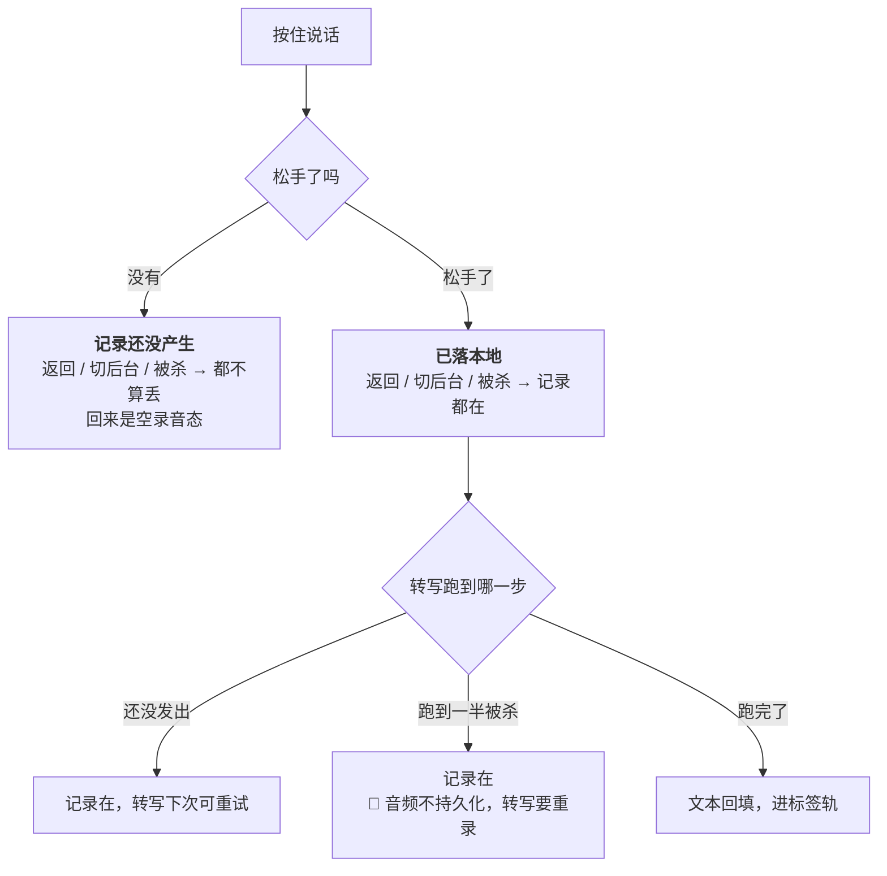
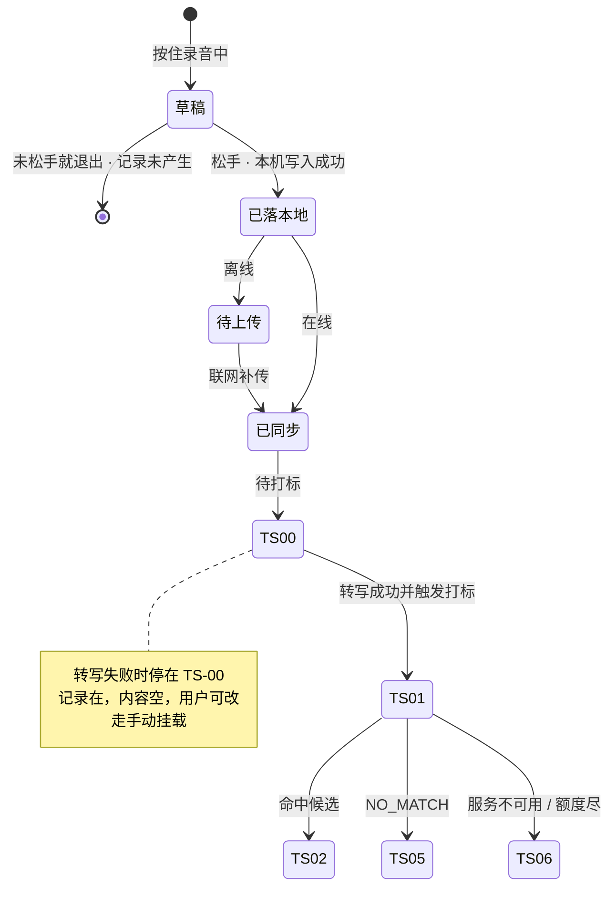
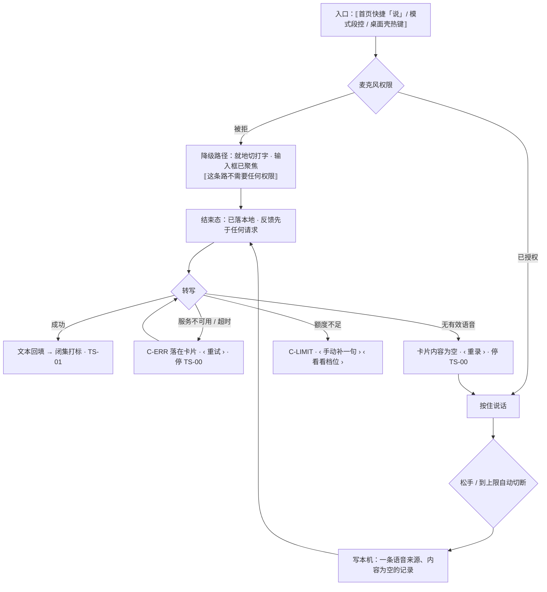

# U1.2 · 语音记一笔

> **基线**：`origin/v1` @ `73041df`，fetch 于 2026-09-02。
> **状态：活跃。** 时长上限口径、静音判定口径、录音中途退出矩阵任一格变化，本文同一次改动内更新。
> **上一层**：[M1 · 记录](INDEX.md)

---

## 一、这个子能力是什么、不是什么

**它是四个采集入口里最快的一个**：按住、说一句、松手，记录就成立了。

- **它不是语音笔记。** 音频不是要留下来的东西 —— 转写完即弃，本机不落盘、服务端不落盘。
  用户留下的是「碰过一件事」这条记录，不是那段声音。
- **它不是听写。** 转写文本的用途只有一个：喂给闭集打标，让它从候选里选一个考点。
  转写得像不像、断句准不准，产品不评价、也不给用户校对入口。
- **它不是「语音优先」的入口。** 它与拍照、粘一段并列，谁都不是默认。
  默认模式是粘一段（`记一次学习` §4.3），因为那一条不需要任何权限。

**它独有的三个决策**：时长上限怎么处理、静音怎么判、录到一半退出算不算记录。三条都在 §二。

---

## 二、详细产品逻辑

### 2.1 落本地的时点：松手那一刻

**松手 → 写本机存储 → 给反馈。** 这三步之间没有网络，也没有转写。

写下去的是一条语音来源的记录：**内容为空**，标着它是语音来的。
「内容为空」不是缺陷态，是这一入口的正常初值 —— 转写成功才回填，失败就一直空着。

🔴 **松手先于任何请求，这是不可打乱的次序**（`U1.1` 推论 1、2）。
判据在 `记一次学习` `A-43`：抓包确认反馈发生在任何一次网络往返之前。

### 2.2 时长上限：自动切断是正常路径，不是异常

| 情况 | 行为 | 它属于什么 |
|---|---|---|
| 录到超过上限 | **自动切断，切出来的这一段照样落本地** | 正常路径。不是失败，不进异常表的「记录留住了吗」讨论 |
| 上限的具体值 | 一律给指针，不写字面量 | 真源见 `记一次学习` §7.2 指向的那两处 |

**为什么切断而不是拒绝。** 拒绝意味着用户说了很长一段、按下之后什么都没有 ——
那正是 `U1.1` 清单外的失败。切断保住了「按下就有」，代价是后半段没了，而后半段本来也只是给打标当输入。

### 2.3 静音与太短：判「无有效语音」，不判「你没说清楚」

- 全程静音、或短到没有可识别语音时，记录**照落**，状态与转写失败同档：内容为空、标语音来源。
- 用户拿到的是三条并列的下一步：重录 / 自己补一句文字 / 自己从树里挑考点。
- 🔴 **界面不评价录音质量。** 「没听清」是对识别结果的陈述，不是对用户的判断 —— 这条线上没有「你说得不清楚」这种说法。
- ⚠️ **最短时长的具体值是 `G-9`，真源里没有量化。** 本单元不替它拍一个数。

### 2.4 录到一半退出：分界在「松手」



**上半区与下半区是两件事，不许混成一句「丢了」**：
「记录还没产生」是用户没完成采集动作；「记录丢了」是违规。整张中途退出矩阵里没有任何一格允许出现后者
（`记一次学习` §4.5）。

**杀进程后转写要重录，这是音频不持久化的直接代价，且这个代价是主动选的**：
留一份音频在盘上能让重试变好看，但那是在 `I-5` 同一条线上开口子。记录本身不受影响，所以这个代价可接受。

### 2.5 状态与转移

**状态名取自 `模块地图` §四。**



🔴 **转写失败不推进标签轨。** 没有文本就没有输入，停在 `TS-00` 待打标；用户可以自己补一句文字重走，
也可以直接手动挂载走到 `TS-07`。**不允许拿空文本去调模型** —— 那是在制造一次必然的错配。

### 2.6 权限被拒不是失败路径的终点

麦克风权限按「点开始录那一次」申请，不在进屏时、也不在点入口时。被拒时**就地切到打字**，输入框已聚焦；
永久拒绝时录音按钮**不灰掉**，点了先给说明，仍能切走。

判据：录音按钮灰掉就等于把「记不成」摆在用户面前，而 `U1.1` 推论 4 要求每条路径都有下一步。

---

## 三、前端行为意图 × 后端契约意图

| 场景 | 前端行为意图 | 后端契约意图 |
|---|---|---|
| 松手落本地 | 写一条语音来源、内容为空的记录，立刻反馈 | 无契约（`U1.1` §三 第一行） |
| 创建记录 | 本机写入之后才发 `POST /records` | 返回记录标识即成功；失败不改变「已在本机」 |
| 提交音频 | 落地之后单独一次往返，音频**内联**发出；不先上传再传引用 | `POST /records/{id}/audio` 请求体里**没有指向已上传文件的引用**（`后端系统设计与组件接入` §1.2）；必须能区分**转写成功 / 无有效语音 / 服务不可用 / 额度不足**四档 |
| 四档的界面分工 | 成功 → 回填并打标；无有效语音 → 给重录；服务不可用 → 给重试；额度不足 → 给手动补 + 档位入口 | 四档必须是四个可判别的响应形态，不能合并成一个「失败」 |
| 时长超上限 | 本端自动切断，切出的这段照常走完整链路 | 不涉及；后端不承担截断责任 |
| 静音 / 太短 | 本端可先判，判不掉的由转写侧回「无有效语音」档 | 「无有效语音」必须与「服务不可用」是两档 —— 前者给重录，后者给重试 |
| 音频生命周期 | 转写完成前只在本机内存；完成或失败后即弃 | 服务端全程不落盘、不入日志、不经厂商暂存 |

---

## 四、边界与红线在这里的具体形态

| 红线 | 在本单元的形态 |
|---|---|
| **不判断对错** | 不评价录音质量、不评价说话内容、不给「再说一遍会更好」这类建议。失败时只给三条并列的下一步 |
| **不存题干** | 转写文本的去向只有一个：作为打标输入。它不进入任何长期存放的位置，记录里没有装得下它的字段 |
| **原图 / 原始字节不上云** | 音频与原图同一条线：内联一次即弃，服务端不落盘、不入日志、不经厂商文件暂存接口 |
| **闭集打标** | 转写文本只用于从候选里选一个节点标识；**永不由转写结果生成标签文本** |
| **额度隔离** | 额度耗尽时记录照落，只是不转写。额度检查不得前置到松手那一步（`I-4`） |

---

## 五、缺口登记

| 缺口 | 缺的是哪一半 | 该谁定 |
|---|---|---|
| `G-9` 语音最短时长 | **数值缺**：太短判「无有效语音」这条规则已定，但阈值在真源里没有量化的部分 | 由人拍板，以真源为准 |
| `G-13` 多语言做不做 | 产品缺。它对本单元格外要紧：转写是语言相关的，非中文语音走哪一条路现在没有结论 | 由人拍板 |

⚠️ **一处本单元观察到、真源未登记的空白**：转写成功但**内容与考点无关**（说了一句和学习无关的话）时，
链路会走到 `TS-05` 没对上，与「模型看了说不匹配」同一个终态。
这符合宁缺毋滥，但用户拿到的说法与真正的识别失败是同一句 ——
`模块地图` §三登记的 `U2.3` 要求「模型说不匹配」与「模型没看成」必须是两句话，
而**「用户根本没说考点」是不是第三句**，两份真源都没有写。本单元只登记，不裁定。

---

## 六、线框

> 记号表与红线自查十条见 [线框与交互规格约定](../线框与交互规格约定.md)。屏宽 40 个半角字符。
> 顶部与底部是四入口共用的骨架，本节不重画，见 `U1.1` §6.1；这里只画语音模式的采集区与它独有的各态。

### 6.1 常态 · 语音模式未开始录（整屏）

```
┌────────────────────────────────────────┐
│ ⟦顶部共用区·返回 / 模式段控 / 顶条⟧    │  ※1
├────────────────────────────────────────┤
│ 采集区 · 说                            │
│  ⟦首次进来·麦克风说明卡片⟧ ← C-INLINE  │  ※2
│                                        │
│  (       按住说话       ) ← C-BTN 主   │  ※3
│  ⟦波形 + 计时⟧ 未录时不渲染            │  ※4
├────────────────────────────────────────┤
│ ⟦底部共用区·来源框 / 记下⟧             │  ※5
└────────────────────────────────────────┘
```

※1 同 `U1.1` §6.1
※2 页内卡片，不是浮层；权限按**点开始录那一次**申请，不在进屏时、不在点入口时
※3 🔴 永久拒绝时**不灰掉**：点了先给说明，仍能切走（推论 4）
※4 计时只报开始与结束，不逐秒播报；这一格**不评价录音质量**
※5 语音模式落本地的触发点是**松手那一刻**（真源 §4.1 步 2），不是底部那个按钮

### 6.2 录音中（只画变化区）

```
│  (       按住说话       ) ← 按住中     │  ※6
│  ⟦波形⟧ ⟦计时⟧                         │  ※7
```

※6 松手即落本地；未松手退出 = 记录还没产生，不是丢
※7 到上限**自动切断**，切出来的这一段照样落本地 —— 这是正常路径，不是失败。上限值见真源 §7.2 的指针

### 6.3 麦克风被拒 · 就地切打字（只画变化区）

```
│ 采集区 · 就地换成打字                  │
│  ▢ ⟦内容·已聚焦⟧ ← C-INPUT             │  ※8
│  ‹ 去设置 ›                            │  ※9
```

※8 输入框已聚焦，键盘已起；**这条路不需要任何权限**
※9 文本按钮，不做成主按钮 —— 主按钮仍是把这一条记下来

### 6.4 松手之后 · 转写没成（只画变化区）

```
│ ⟦卡片·时间 / 来源名⟧ ← C-CARD          │
│  ⟦语音来源标记⟧ ⟦内容为空是正常初值⟧   │  ※10
│  ‹ 重录 ›  ‹ 补一句文字 ›  ‹ 自己挑考点 › │  ※11
```

※10 停在 `TS-00` 待打标，**不推进标签轨** —— 没有文本就不调模型
※11 三条并列，不排优劣、不给建议

---

## 七、交互规格

### 7.1 必答五项

| # | 项 | 本单元的答案 |
|---|---|---|
| 1 | **入口** | 三处：① 首页快捷「说」→ `S-REC` 语音模式 ② 本屏模式段控切到「说」 ③ 桌面壳全局热键唤起后切「说」。深链与登录后回跳走 `P-NAV` |
| 2 | **结束状态** | 松手 → `已落本地`（终态之一，反馈在这一刻）；在线 `已同步`，离线 `待上传` → `已同步`。标签轨：转写成功 → `TS-01` → `TS-02` / `TS-05` / `TS-06`；**转写失败停在 `TS-00`**，可改走手动挂载到 `TS-07` |
| 3 | **失败落点** | 全部停在那一条记录的卡片上，不回采集屏：转写失败 / 无有效语音 → §6.4 三条下一步；权限被拒 → §6.3 就地切打字；额度尽 → 卡片下方 `‹ 手动补一句 ›` `‹ 看看档位 ›`。**记录在任何一格都已经落下** |
| 4 | **空态** | 两种成因，两张：① 未开始录 → 波形与计时**整块不渲染**，不出空插画（`C-EMPTY` 不用于这一区）；② 转写回「无有效语音」→ 卡片内容为空是正常初值，给 `‹ 重录 ›`。⚪ 最短时长阈值是缺口，见本文 §五 `G-9` |
| 5 | **错误态** | 可重试：转写服务 5xx / 超时 → 停在卡片，`‹ 重试 ›`（`C-ERR`）。不可重试：额度尽 → 走受限态；无有效语音 → 给 `‹ 重录 ›`，**不是错误态也不是评价**。四档必须可判别（本文 §三） |

**受限态**：额度尽时主按钮仍是「记下 / 按住说话」本身，档位入口只能是文本按钮（`C-LIMIT`）。
**离线态**：`C-OFFLINE` 细条落在顶条，见 `U1.1` §6.4；离线时转写不发起，等联网。

### 7.2 交互流程


