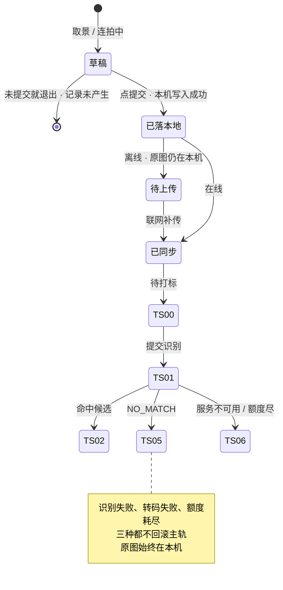

# U1.3 · 拍照记一笔

> **基线**：`origin/v1` @ `73041df`，fetch 于 2026-09-02。
> **状态：活跃。** 单次张数上限口径、HEIC 转码结论、图片尺寸与格式的拦截位置变化，本文同一次改动内更新。
> **上一层**：[M1 · 记录](INDEX.md)

---

## 一、这个子能力是什么、不是什么

**它是四个入口里唯一会产生一份长期留在用户机器上的东西的那个。** 别的三个入口记完就只剩一条记录，
它还多出一张原图。这一点决定了它所有的独特性，也决定了它是 `I-5` 唯一的产生点。

- **它不是拍照存档。** 拍下来的图不是资料库，是一次识别的输入。留在本机是**用户自己的东西**，不是产品的资产。
- **它不是 OCR 工具。** 识别的输出只有一个：从候选里选出的节点标识，或者没对上。
  它不产出题干、不产出文字稿、不给用户一份「识别结果」去校对。
- **它不管原图之后去哪。** 存在哪、什么时候到期、归档之后能不能看、怎么删 —— 全部不在本单元。
  指针：`模块地图` §三登记的 `U8.3` `U8.4`，规格真源 `设置与原图` §六。**本单元只写到「原图落在本机」为止。**

**它独有的三个决策**：单次张数上限、HEIC、尺寸与格式。三条都在 §二。

---

## 二、详细产品逻辑

### 2.1 两次落地，时点不同

**这是四个入口里唯一有两次本地写入的一个，而且两次的时点不同**：

| 落什么 | 什么时候落 | 落不下来会怎样 |
|---|---|---|
| 原图 | **拍下那一刻**，早于记录存在 | 清单第 4 行：记录照落，这条记录没有图 |
| 记录 | **点提交那一刻**，任何网络往返之前 | 不许失败（`U1.1`） |

**原图先于记录存在，这不是实现顺序的巧合，是产品结论**：一张图进本机的时刻常常早于记录产生的时刻，
所以图允许不挂在任何一条记录上 —— **图的生命周期不依赖任何一条记录**，反过来也成立（`设置与原图` §6.9）。

由此得到本单元最容易被搞反的一条：**删记录不删图，删图不删记录，删图不改变任何一个盲区数字。**

### 2.2 单次张数上限：本屏拦下，已拍的照样记

- 连拍单次张数有上限，**由采集屏自己拦**，不是发出去让服务端拒。
- 拦下之后已经拍的那几张**照样能记成一条记录** —— 上限拦的是「再多拍一张」，不是「这次别记了」。
- 上限值一律给指针，不写字面量（`记一次学习` §7.3 指向的真源）。

**为什么在本屏拦。** 让请求发出去再被拒，等于把一次可失败的往返塞进提交路径；
而提交路径上不许有可失败的往返（`U1.1` 推论 1）。

### 2.3 HEIC：本端转码，不是上传后转

| 事实 | 结论 |
|---|---|
| 采集时把**原始字节留本机**，另出一份内联可读格式发给模型 | 模型侧永远只见内联字节，**不存在「先上传再转码」这条路** |
| 转码失败 | 原图仍在本机，识别跳过，记录仍在、可手动挂载（`U1.1` 清单第 2、4 行的交叉） |
| 转成什么格式、失败怎么降级 | 🚧 **未定**，见 §五 `G-11` |

🔴 **「让服务端转一下更省事」是这条线上最典型的红线诱惑**：服务端要转码就要先拿到完整字节并落一次盘，
而 `I-5` 要求全程不落盘。**转码位置不是实现细节，是红线的物理落点**（同 `设置与原图` §6.1 对存放目录的判断）。

### 2.4 尺寸与格式：不合格的那一张不落，记录不受影响

- 过大、格式不支持 → 提示重拍，**那一张不落**。这不是「记录失败」，是那张图还没成为这次采集的一部分。
- 对焦失败、拍糊 → 同上。
- 相机被占用、设备无摄像头、权限被拒 → 全部走降级链：相机 → 相册 → 打字。**链的末端不需要任何权限。**

**判据**：以上任何一格都不产生「点了记录但什么都没留下」的路径。
上半段（未提交）是「记录还没产生」，下半段（已提交）是「记录一定在」。

### 2.5 状态与转移

🔴 **主轨与原图是两条互不影响的线。** 离线时记录进待上传、原图仍在本机；
识别失败时记录仍在、原图仍在本机；转码失败时记录仍在、原图仍在本机。
**没有任何一条路径以「删掉原图」作为失败处理。**

### 2.6 端上的一处不对称

小程序端**不做拍照、不承接原图字节**。这不是能力缺失的降级，是**主动不接**：
接了就等于在一个产品无法保证其存放位置的环境里产生原图，而 `I-5` 是按「只在用户自己的机器上」写的。
该端上这个入口**不渲染，而不是灰掉**（`记一次学习` §十）。

---

## 三、前端行为意图 × 后端契约意图

| 场景 | 前端行为意图 | 后端契约意图 |
|---|---|---|
| 拍下一张 | 原图写本机，出缩略图；可逐张删掉重拍 | 不涉及。**服务端在这一步不存在**，这正是 `I-5` 的形态 |
| 点提交 | 先写本机记录再反馈；一张都没拍时提交不可用 | 无契约（`U1.1` §三 第一行） |
| 创建记录 | 本机写入之后才发 `POST /records` | 返回记录标识即成功；请求体里**没有 `imageUrl` 一类指向已上传文件的引用**（`后端系统设计与组件接入` §1.2） |
| 提交识别 | 原图**内联**发出，逐条发、**不进批量** | `POST /records/{id}/image` 必须能区分**识别成功 / `NO_MATCH` / 服务不可用 / 额度不足**四档；全程不落盘、不入日志、不经厂商文件暂存接口 |
| 张数超限 | 本屏拦下，已拍的照常记 | 上限值由契约层给出，前端读取而非硬编码（真源见 `记一次学习` §7.3） |
| HEIC | 本端转码，原始字节留本机 | 🚧 目标格式与失败降级待技术定稿（`G-11`） |
| 识别失败 | 更新标签轨状态并给「重试 / 手动挂」；不触碰主轨、不触碰原图 | 失败响应不得被理解为「这条记录不存在」，也不得触发任何原图清理 |

🔴 **「图片不走批量补传」是形状决定的，不是偏好**：内联编码下一整批带图会把单次请求体推到不可接受的量级。
所以离线时图片记录的补传路径与文字记录不同 —— 详见 `模块地图` §三登记的 `U1.6`。

---

## 四、边界与红线在这里的具体形态

| 红线 | 在本单元的形态 |
|---|---|
| **原图不上云、不同步、不共享** | 识别时内联一次即弃；**没有上传按钮、没有云备份、没有同步开关**，这三个「没有」必须以肯定形式说给用户听，而不是靠找不到按钮让他自己推断（`设置与原图` §6.3）。它们的界面落点在 `U8.3` `U8.4`，不在本单元 |
| **不存题干** | 识别的输出只有节点标识或没对上。**识别文本不回填给用户、不进任何存放位置** —— 拍到的很可能正是一道题，这是本入口红线压力最大的一处 |
| **闭集打标** | 图像识别同样只能从候选里选，或返回没对上；返回候选集外的标识或返回文本，整条丢弃当无匹配 |
| **不判断对错** | 不给识别结果的置信度、不给「这张拍得不清楚」之外的任何质量评价，更不解读图上的内容 |
| **宁可丢弃率高** | 图像识别是四个入口里最容易「差不多对上」的一个。**没对上是正常终态**，不提供「换一个更接近的」 |

---

## 五、缺口登记

| 缺口 | 缺的是哪一半 | 该谁定 |
|---|---|---|
| `G-11` HEIC 转码的目标格式与失败降级 | **技术那一半缺**：转码在本端已定，转成什么、失败走哪条降级路没定 | 🚧 待技术定稿 |
| `G-7` 原图归档后，记录卡片上的「有图」标记怎么处理 | **两域之间的联动缺**：本单元产出图标记，`U8.3` 管归档，中间没人定过归档后标记还在不在 | 由人拍板 |

⚠️ **一处本单元观察到的表述风险**：`记一次学习` §4.2 的分支表在识别失败时把卡片写为没对上，
而 `后端系统设计与组件接入` §1.5 明确区分「模型看了说不匹配」与「模型压根没看成」是两种返回形态。
识别超时属于后者，落到 `TS-06` 待补更贴切。两份文档的措辞在这一格不完全同源，本单元只登记，不裁定。
