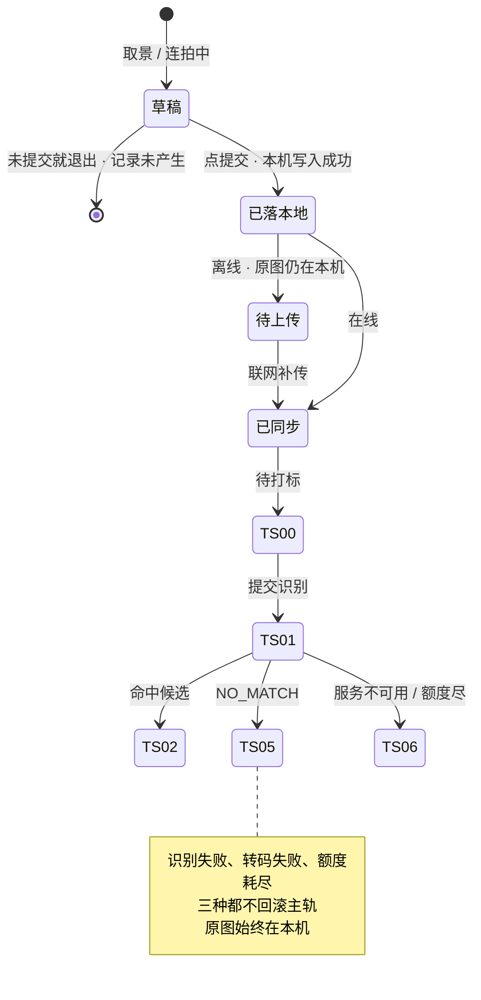
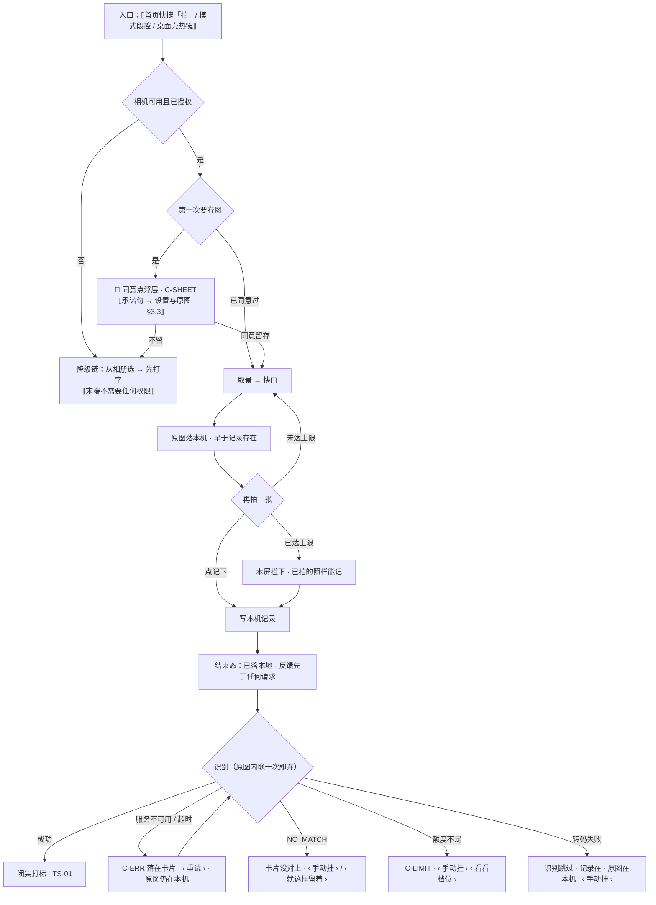

# U1.3 · 拍照记一笔

> **基线**：`origin/v1` @ `73041df`，fetch 于 2026-09-02。
> **状态：活跃。** 单次张数上限口径、HEIC 转码结论、图片尺寸与格式的拦截位置变化，本文同一次改动内更新。
> **上一层**：[M1 · 记录](INDEX.md)

---

## 一、这个子能力是什么、不是什么

**它是四个入口里唯一会产生一份长期留在用户机器上的东西的那个。** 别的三个入口记完就只剩一条记录，
它还多出一张原图。这一点决定了它所有的独特性，也决定了它是 `I-5` 唯一的产生点。

- **它不是拍照存档。** 拍下来的图不是资料库，是一次识别的输入。留在本机是**用户自己的东西**，不是产品的资产。
- **它不是 OCR 工具。** 识别的输出只有一个：从候选里选出的节点标识，或者没对上。
  它不产出题干、不产出文字稿、不给用户一份「识别结果」去校对。
- **它不管原图之后去哪。** 存在哪、什么时候到期、归档之后能不能看、怎么删 —— 全部不在本单元。
  指针：`模块地图` §三登记的 `U8.3` `U8.4`，规格真源 `设置与原图` §六。**本单元只写到「原图落在本机」为止。**

**它独有的三个决策**：单次张数上限、HEIC、尺寸与格式。三条都在 §二。

---

## 二、详细产品逻辑

### 2.1 两次落地，时点不同

**这是四个入口里唯一有两次本地写入的一个，而且两次的时点不同**：

| 落什么 | 什么时候落 | 落不下来会怎样 |
|---|---|---|
| 原图 | **拍下那一刻**，早于记录存在 | 清单第 4 行：记录照落，这条记录没有图 |
| 记录 | **点提交那一刻**，任何网络往返之前 | 不许失败（`U1.1`） |

**原图先于记录存在，这不是实现顺序的巧合，是产品结论**：一张图进本机的时刻常常早于记录产生的时刻，
所以图允许不挂在任何一条记录上 —— **图的生命周期不依赖任何一条记录**，反过来也成立（`设置与原图` §6.9）。

由此得到本单元最容易被搞反的一条：**删记录不删图，删图不删记录，删图不改变任何一个盲区数字。**

### 2.2 单次张数上限：本屏拦下，已拍的照样记

- 连拍单次张数有上限，**由采集屏自己拦**，不是发出去让服务端拒。
- 拦下之后已经拍的那几张**照样能记成一条记录** —— 上限拦的是「再多拍一张」，不是「这次别记了」。
- 上限值一律给指针，不写字面量（`记一次学习` §7.3 指向的真源）。

**为什么在本屏拦。** 让请求发出去再被拒，等于把一次可失败的往返塞进提交路径；
而提交路径上不许有可失败的往返（`U1.1` 推论 1）。

### 2.3 HEIC：本端转码，不是上传后转

| 事实 | 结论 |
|---|---|
| 采集时把**原始字节留本机**，另出一份内联可读格式发给模型 | 模型侧永远只见内联字节，**不存在「先上传再转码」这条路** |
| 转码失败 | 原图仍在本机，识别跳过，记录仍在、可手动挂载（`U1.1` 清单第 2、4 行的交叉） |
| 转成什么格式、失败怎么降级 | 🚧 **未定**，见 §五 `G-11` |

🔴 **「让服务端转一下更省事」是这条线上最典型的红线诱惑**：服务端要转码就要先拿到完整字节并落一次盘，
而 `I-5` 要求全程不落盘。**转码位置不是实现细节，是红线的物理落点**（同 `设置与原图` §6.1 对存放目录的判断）。

### 2.4 尺寸与格式：不合格的那一张不落，记录不受影响

- 过大、格式不支持 → 提示重拍，**那一张不落**。这不是「记录失败」，是那张图还没成为这次采集的一部分。
- 对焦失败、拍糊 → 同上。
- 相机被占用、设备无摄像头、权限被拒 → 全部走降级链：相机 → 相册 → 打字。**链的末端不需要任何权限。**

**判据**：以上任何一格都不产生「点了记录但什么都没留下」的路径。
上半段（未提交）是「记录还没产生」，下半段（已提交）是「记录一定在」。

### 2.5 状态与转移



🔴 **主轨与原图是两条互不影响的线。** 离线时记录进待上传、原图仍在本机；
识别失败时记录仍在、原图仍在本机；转码失败时记录仍在、原图仍在本机。
**没有任何一条路径以「删掉原图」作为失败处理。**

### 2.6 端上的一处不对称

小程序端**不做拍照、不承接原图字节**。这不是能力缺失的降级，是**主动不接**：
接了就等于在一个产品无法保证其存放位置的环境里产生原图，而 `I-5` 是按「只在用户自己的机器上」写的。
该端上这个入口**不渲染，而不是灰掉**（`记一次学习` §十）。

---

## 三、前端行为意图 × 后端契约意图

| 场景 | 前端行为意图 | 后端契约意图 |
|---|---|---|
| 拍下一张 | 原图写本机，出缩略图；可逐张删掉重拍 | 不涉及。**服务端在这一步不存在**，这正是 `I-5` 的形态 |
| 点提交 | 先写本机记录再反馈；一张都没拍时提交不可用 | 无契约（`U1.1` §三 第一行） |
| 创建记录 | 本机写入之后才发 `POST /records` | 返回记录标识即成功；请求体里**没有 `imageUrl` 一类指向已上传文件的引用**（`后端系统设计与组件接入` §1.2） |
| 提交识别 | 原图**内联**发出，逐条发、**不进批量** | `POST /records/{id}/image` 必须能区分**识别成功 / `NO_MATCH` / 服务不可用 / 额度不足**四档；全程不落盘、不入日志、不经厂商文件暂存接口 |
| 张数超限 | 本屏拦下，已拍的照常记 | 上限值由契约层给出，前端读取而非硬编码（真源见 `记一次学习` §7.3） |
| HEIC | 本端转码，原始字节留本机 | 🚧 目标格式与失败降级待技术定稿（`G-11`） |
| 识别失败 | 更新标签轨状态并给「重试 / 手动挂」；不触碰主轨、不触碰原图 | 失败响应不得被理解为「这条记录不存在」，也不得触发任何原图清理 |

🔴 **「图片不走批量补传」是形状决定的，不是偏好**：内联编码下一整批带图会把单次请求体推到不可接受的量级。
所以离线时图片记录的补传路径与文字记录不同 —— 详见 `模块地图` §三登记的 `U1.6`。

---

## 四、边界与红线在这里的具体形态

| 红线 | 在本单元的形态 |
|---|---|
| **原图不上云、不同步、不共享** | 识别时内联一次即弃；**没有上传按钮、没有云备份、没有同步开关**，这三个「没有」必须以肯定形式说给用户听，而不是靠找不到按钮让他自己推断（`设置与原图` §6.3）。它们的界面落点在 `模块地图` §三 登记的 `U8.3` `U8.4`，不在本单元 |
| **不存题干** | 识别的输出只有节点标识或没对上。**识别文本不回填给用户、不进任何存放位置** —— 拍到的很可能正是一道题，这是本入口红线压力最大的一处 |
| **闭集打标** | 图像识别同样只能从候选里选，或返回没对上；返回候选集外的标识或返回文本，整条丢弃当无匹配 |
| **不判断对错** | 不给识别结果的置信度、不给「这张拍得不清楚」之外的任何质量评价，更不解读图上的内容 |
| **宁可丢弃率高** | 图像识别是四个入口里最容易「差不多对上」的一个。**没对上是正常终态**，不提供「换一个更接近的」 |

---

## 五、缺口登记

| 缺口 | 缺的是哪一半 | 该谁定 |
|---|---|---|
| `G-11` HEIC 转码的目标格式与失败降级 | **技术那一半缺**：转码在本端已定，转成什么、失败走哪条降级路没定 | 🚧 待技术定稿 |
| `G-7` 原图归档后，记录卡片上的「有图」标记怎么处理 | **两域之间的联动缺**：本单元产出图标记，`模块地图` §三 登记的 `U8.3` 管归档，中间没人定过归档后标记还在不在 | 由人拍板 |

⚠️ **一处本单元观察到的表述风险**：`记一次学习` §4.2 的分支表在识别失败时把卡片写为没对上，
而 `后端系统设计与组件接入` §1.5 明确区分「模型看了说不匹配」与「模型压根没看成」是两种返回形态。
识别超时属于后者，落到 `TS-06` 待补更贴切。两份文档的措辞在这一格不完全同源，本单元只登记，不裁定。

---

## 六、线框

> 记号表与红线自查十条见 [线框与交互规格约定](../线框与交互规格约定.md)。屏宽 40 个半角字符。
> 顶部与底部是四入口共用的骨架，本节不重画，见 `U1.1` §6.1；这里只画拍照模式的采集区与它独有的各态。
>
> 🔴 **三处不可弱化里，本单元承载第一处：用户同意留存原图的那一刻**（§6.2）。另外两处 —— 原图的到期倒计时、
> 随时可按的立即删除入口 —— 在 `模块地图` §三 登记的 `U8.3` `U8.4`，本单元既不重画，也不因为「这里没画」而弱化它们。

### 6.1 常态 · 拍照模式取景中（整屏）

```
┌────────────────────────────────────────┐
│ ⟦顶部共用区·返回 / 模式段控 / 顶条⟧    │  ※1
├────────────────────────────────────────┤
│ 采集区 · 拍                            │
│  ⟦取景框⟧                              │  ※2
│                                        │
│  (         快门         ) ← C-BTN 主   │  ※3
│  ⟦连拍缩略图 · 已拍 {n} 张⟧            │  ※4
├────────────────────────────────────────┤
│ ⟦底部共用区·来源框 / 记下⟧             │  ※5
└────────────────────────────────────────┘
```

※1 同 `U1.1` §6.1
※2 相机不可用时整区换成 §6.4 的降级链，不留一个点不动的黑框
※3 永久拒绝时**不灰掉**，点了先给说明卡片
※4 一张都没拍时不渲染；每张可点开删掉重拍。**原图在拍下那一刻就落本机，早于记录存在**
※5 一张都没拍时「记下」禁用 —— 这是内容约束，不是在等某个响应

### 6.2 🔴 同意点 · 第一次拍照 / 第一次选图（浮层）

```
│ ⟦浮层⟧ ← C-SHEET                       │  ※6
│  ⟦承诺句 → 设置与原图 §3.3⟧            │  ※7
│  ⟦附加句 → 设置与原图 §6.4⟧            │  ※8
│  ( 同意留存 )   [ 不留 ]               │  ※9
```

※6 它出现在**用户第一次真的要存一张图**的那一刻，不在首启一次性讲完
※7 🔴 **承诺句逐字同源，本文一个字都不抄**。真源 `设置与原图` §3.3 / §6.4；逐字由 `scripts/boundary-copy-check.py` 守着
※8 时长由判据层给，界面不写死数值
※9 拒绝也不挡记录：不留图仍能走文字与语音把这一条记下来

### 6.2b 同意点被拒 · 空态（只画变化区）

```
│ 采集区 · 换成不需要权限的那条路        │
│  ⟦为什么这一格空了·一句⟧ ← C-EMPTY     │  ※9b
│  ▢ ⟦输入框 · 光标已在里面⟧             │
│  ⟦底部⟧ ( 记下 ) 仍可点                │  ※9c
```

※9b 🔴 **成因与「一张都没拍」不共用一句话**：那一档是还没做，这一档是用户已经选过了。`C-EMPTY` 的「一个能立刻做的动作」在这里就是那个已经聚焦的输入框，**不再劝一次同意** —— 同意点问过一次就不再问（`模块地图` §三登记的 `U8.3`）
※9c 🔴 **不留图仍能把这一条记下来**（※9），所以主按钮照常可点；这一格里**没有去设置**，同意点不是系统权限，设置里也关不掉它。2026-09-03 补：§7.1 第 4 项列了这一张，线框里原先没有落点

### 6.3 单次张数达上限（只画变化区）

```
│  ⟦连拍缩略图 · 已达上限⟧ ← C-INLINE    │  ※10
│  ⟦底部⟧ ( 记下 ) 仍可点                │  ※11
```

※10 **由本屏拦下**，不是发出去让服务端拒；上限值给指针，见真源 §7.3
※11 拦的是「再多拍一张」，不是「这次别记了」

### 6.4 相机不可用 · 降级链（只画变化区）

```
│ 采集区 · 相机不可用（三个按钮纵向排）  │
│  [ 从相册选 ]                          │  ※12
│  [ 先打字 ]                            │
│  [ 去设置 ] ← 次·永远最后一个          │  ※12b
```

※12 链的末端不需要任何权限；相册只授权部分时给「改选照片」，**不劝给全部**
※12b 🔴 **去设置是次按钮，与同格里两条不需要权限的路同级，排最后。** 判据是这一格的兜底本身就是按钮，层级要与它对齐、轻重交给顺序承担（`线框与交互规格约定` §3.5）；顺序那一半的真源是 `首次使用与权限申请` §2.3 两条规则，本节不复述。三个按钮按 `C-BTN` 边界值纵向排列，纵向时顺序不变、去设置在最下。⚠️ 2026-09-03 改：原先它画成文本按钮 `‹ ›`，与 `模块地图` §三登记的 `U0.2` §6.3 同一格的画法不一致

### 6.5 识别没成（只画变化区）

```
│ ⟦卡片·时间 / 来源名⟧ ← C-CARD          │
│  ⟦状态徽标⟧ 没对上 / 稍后再认          │  ※13
│  ‹ 重试 ›  ‹ 手动挂 ›  ‹ 就这样留着 ›  │  ※14
│  ⟦有图标记⟧                            │  ※15
```

※13 徽标文字照抄 `模块地图` §4.3 那张表。🔴 **不显示置信度、不显示相似度**
※14 识别失败、转码失败、额度尽三种都不回滚主轨。🔴 **三个出口按可重试与否分开渲染**：可重试那一档（5xx / 超时）出 `‹ 重试 ›`；不可重试那一档（`NO_MATCH`）出 `‹ 手动挂 ›` 与 `‹ 就这样留着 ›`，两个都是**有下一步的落点** —— `‹ 就这样留着 ›` 是「不硬归类」这条红线在界面上的出口，它把这一条留在未分类里，不是一个「知道了」。2026-09-03 补：§7.1 第 5 项列了它，线框里原先没有落点
※15 纯标记，不可点。**没有分享、没有导出、没有同步入口**

---

## 七、交互规格

### 7.1 必答五项

| # | 项 | 本单元的答案 |
|---|---|---|
| 1 | **入口** | 三处：① 首页快捷「拍」→ `S-REC` 拍照模式 ② 本屏模式段控切到「拍」 ③ 桌面壳全局热键唤起后切「拍」。深链与登录后回跳走 `P-NAV`。小程序端这个入口**不渲染，而不是灰掉** |
| 2 | **结束状态** | 两条互不影响的线：原图在**拍下那一刻**落本机；记录在**点记下那一刻**到 `已落本地`，其后 `已同步` / `待上传`。标签轨 `TS-00` → `TS-01` → `TS-02` / `TS-05` / `TS-06` |
| 3 | **失败落点** | 识别失败 / 转码失败 / 额度尽 → §6.5 卡片，`‹ 重试 ›` 或 `‹ 手动挂 ›`，**原图始终在本机**；权限被拒 → §6.4 降级链；张数超限 → §6.3 停在本屏，已拍的照常记；图过大 / 格式不支持 / 拍糊 → 那一张不落，停在取景，**记录还没产生，不算失败** |
| 4 | **空态** | 两种成因，两张：① 一张都没拍 → 缩略图区不渲染，主按钮禁用且说得出缺什么（§6.1 ※4 ※5）② 同意点被拒 → 采集区换成不需要权限的那条路（`C-EMPTY` 给一句成因 + 一个能立刻做的动作，落点 §6.2b） |
| 5 | **错误态** | 可重试：识别服务 5xx / 超时 → 卡片 `‹ 重试 ›`（`C-ERR`）。不可重试：`NO_MATCH` → `‹ 手动挂 ›` / `‹ 就这样留着 ›`（两个都落在 §6.5 那张卡片上）；额度尽 → 受限态。⚪ HEIC 转码目标格式与失败降级是缺口，见本文 §五 `G-11`；⚪ 归档后「有图」标记还在不在，见 `G-7` |

**受限态**：额度尽时主按钮仍是「记下」，档位入口只能是文本按钮（`C-LIMIT`）。
**离线态**：`C-OFFLINE` 细条见 `U1.1` §6.4；离线时识别不发起，**原图仍在本机**。

### 7.2 交互流程


