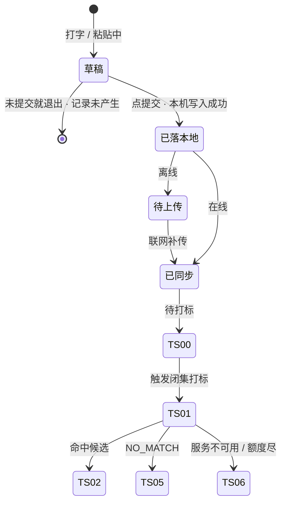
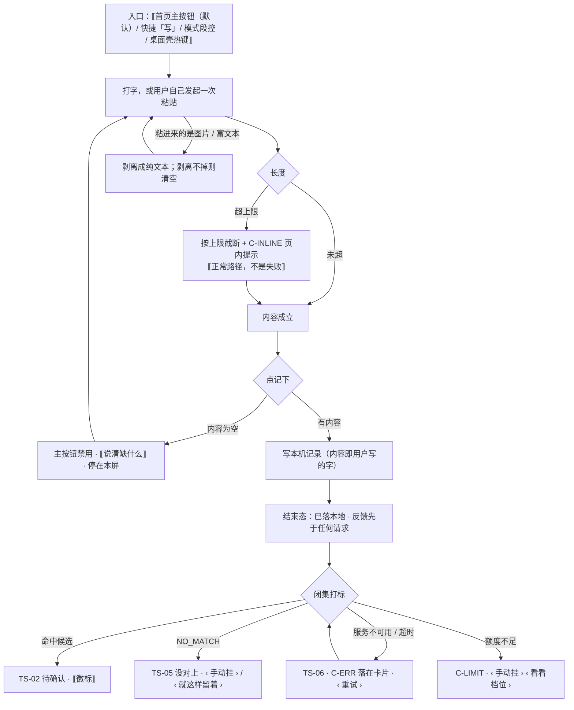

# U1.4 · 粘一段

> **基线**：`origin/v1` @ `73041df`，fetch 于 2026-09-02。
> **状态：活跃。** 文本与来源名的长度上限口径、剪贴板策略、来源字段语义变化，本文同一次改动内更新。
> **上一层**：[M1 · 记录](INDEX.md)

---

## 一、这个子能力是什么、不是什么

**它是四个入口里的默认入口，也是唯一一个不需要任何权限的入口。**

打字与粘贴是同一条路：同一种采集形式、同一个采集屏、同一条链路。真源把「手写文字」并进本入口，
理由是两者只在用户手指怎么动上不同，落下去的东西完全一样（`记一次学习` §四 导语）。

- **它不是笔记本。** 输入框收的是「我刚才碰了什么」这一句，不是内容本身。长度上限就是这条定位的物理形态。
- **它不是导入。** 没有面向用户的「导入文件」入口；「批量」在整份真源里只指离线队列补传（`记一次学习` §7.4）。
- **它不是分享目标。** 系统分享入口**不接**，理由在 §2.5。

**它独有的三个决策**：长度上限、剪贴板、来源名称怎么填。三条都在 §二。

---

## 二、详细产品逻辑

### 2.1 长度上限：截断不是失败，是内容边界

| 情况 | 行为 | 属于什么 |
|---|---|---|
| 粘贴或输入超过上限 | **按上限截断 + 页内提示**，记录照落 | 正常路径。不是失败，不进 `U1.1` 的清单讨论 |
| 粘贴的是图片或富文本 | 剥离成纯文本；剥离不掉则清空 | 正常路径 |
| 输入为空时提交 | 提交本身不可用 | 内容约束，**不是识别等待** |
| 上限的具体值 | 一律给指针，不写字面量 | 真源见 `记一次学习` §7.1 指向的那两处 |

🔴 **空输入时提交不可用，为什么不违反 `U1.1` 推论 2。** 推论 2 禁止的是「提交按钮等着识别返回」——
那是拿一次可失败的往返当前置条件。空输入是**内容还不构成一条记录**，与任何往返无关。
两者的判别方法：禁用条件里出现「等某个响应」就是违规，出现「用户还没输入」就不是。

**为什么截断而不是拒绝。** 拒绝意味着用户粘了一大段、按下之后什么都没有 —— 那就是清单外的失败。
截断保住了「按下就有」，代价是后半段没了，而后半段本来也只是给打标当输入。

### 2.2 剪贴板：永不主动读

- 🔴 **产品永不主动读取剪贴板，只接受用户自己发起的粘贴动作。**
- 剪贴板为空：**不提示、输入框不动**。这是刻意的静默 —— 用户没粘上东西不是一次错误。
- 剪贴板权限被拒：只在用户点了粘贴之后给一次页内提示，改用手打。**这条路径不需要任何权限就能走完。**

**为什么这条规则住在采集层而不是权限层**：主动读剪贴板等于在用户没有表达意图的时刻拿走一段内容，
而那段内容很可能正是一道题。它绕过的是「用户同意留存的那一刻」—— 与 §2.5 拒绝系统分享是同一条边界。

### 2.3 来源名称怎么填

**来源框是整个产品里「只记来源名称与时间」这条红线的主要落点。**

| 事实 | 结论 |
|---|---|
| 它**选填** | 留空是正常状态，不是待办；不催填、不因为空而降级任何能力 |
| 它只收**名称**（机构名 / 书名 / 平台名） | 不收课程内容、不收章节正文、不收题号。产品**不存任何机构的课程内容** |
| 它有长度上限 | 超出按上限截断（`记一次学习` §7.1） |
| 它不进候选、不参与闭集判定 | 来源不是考点。它的用途是让用户回看时认得出这条是哪儿来的 |
| 它不做枚举、不做联想候选 | 做了枚举就等于产品维护一张机构清单，那是另一件事，且离「存机构内容」只差一步 |

**四个入口共用同一个来源框**，语义完全一致 —— 这一条写在这里是因为本入口是默认入口，用户最先在这里遇到它。

### 2.4 状态与转移



**本入口是四条链路里最短的一条**：没有转写、没有识别，落地之后直接进闭集打标。
少一次外部往返，就少一处能失败的地方 —— 这也是它适合当默认入口的原因之一。

**中途退出**：分界在「点提交」。提交前退出是**记录还没产生**（返回时问一次有没有没写完的内容，
切后台内容保留，被杀则内容丢失）；提交后退出，记录一定在。

### 2.5 为什么不接系统分享入口

用户可以从别处「分享」一段内容进来当作一条记录 —— 这条路**不开**。

理由是：那段内容可能正是题干，而分享绕过了「用户同意留存的那一刻」。
记录来源只有四种采集方式，**没有第五种**（`记一次学习` §八）。

⚠️ 这条边界在真源里有一处**自相矛盾**：§八 写死「系统分享入口不提供」，
而 §十五 的异常全集里仍留着两条分享相关的异常（分享传来非法内容、分享内容超长）。
本单元按 §八 为准 —— **入口不存在，那两条异常没有触发路径**。只登记，不裁定，见 §五。

---

## 三、前端行为意图 × 后端契约意图

| 场景 | 前端行为意图 | 后端契约意图 |
|---|---|---|
| 点提交 | 先写本机记录（内容即用户写的字）再反馈；空输入时提交不可用 | 无契约（`U1.1` §三 第一行） |
| 创建记录 | 本机写入之后才发 `POST /records` | 返回记录标识即成功；失败不改变「已在本机」 |
| 文本超长 | **本端按上限截断**并页内提示，截断后照常提交 | 长度上限由契约层给出，前端读取而非硬编码（真源见 `记一次学习` §7.1）；服务端仍需自校验，不依赖前端已截断 |
| 来源名 | 选填，超长截断；不做枚举、不做联想 | 只接受名称字符串，**没有任何位置承接课程内容**；长度上限同上 |
| 触发打标 | 落地之后单独一次往返 | `POST /records/{id}/tags/suggest` 只返回节点标识或 `NO_MATCH`，**不接受调用方指定标签文本**（`I-3`） |
| 打标失败 | 更新标签轨状态并给下一步；不触碰主轨 | 服务不可用 / 额度不足 / 没对上必须可区分 —— 三档的界面表现完全不同 |
| 剪贴板 | 只在用户发起粘贴时读；被拒时给一次页内提示 | 不涉及。**这是纯本机行为，不产生任何请求** |

---

## 四、边界与红线在这里的具体形态

| 红线 | 在本单元的形态 |
|---|---|
| **不存题干与机构内容** | 本入口是唯一一个用户能直接把一大段文字放进来的地方，**红线压力最大**。三道拦截：长度上限、来源框只收名称、**记录正文不进导出**（后一条的落点在 `模块地图` §三登记的 `U4.3`） |
| **只记来源名称与时间** | 来源框的全部语义。不做机构枚举 —— 维护一张机构清单离「存机构内容」只差一步 |
| **不主动取内容** | 剪贴板永不主动读、系统分享入口不接、不接受拖文件进窗口。三条守的是同一件事：**内容进入产品的时刻必须是用户明示的那一刻** |
| **闭集打标** | 文本只用于从候选里选一个节点标识；模型返回文本或候选集外的标识，整条丢弃当无匹配 |
| **不判断对错** | 不校对用户写的字、不提示「写得太简略」、不给内容建议 |

---

## 五、缺口登记

| 缺口 | 缺的是哪一半 | 该谁定 |
|---|---|---|
| `G-6` 批量补传接受什么格式、有没有用户侧导入入口 | 后端那一半缺。它牵连本单元：一旦开出用户侧导入入口，「粘一段」的长度上限就形同虚设 | 由人拍板 |
| `G-12` 埋点来源枚举里的「批量」与四个入口对不上 | 口径缺。本入口在枚举里对应「手动」，而「批量」没有对应的采集方式 | 由人拍板 |

⚠️ **一处真源自相矛盾，本单元只登记**：`记一次学习` §八 写死「系统分享入口不提供」，
§十五 却仍有两条分享相关的异常行（`C-42` `C-43`）。
按 §八，这两行没有触发路径；按 §十五，它们是要实现的异常。**缺的是「哪一份说了算」这个裁定**，
产品不自行删条目，也不自行开入口。

---

## 六、线框

> 记号表与红线自查十条见 [线框与交互规格约定](../线框与交互规格约定.md)。屏宽 40 个半角字符。
> 顶部与底部是四入口共用的骨架，本节不重画，见 `U1.1` §6.1；这里只画本入口的采集区与它独有的各态。
> 本入口是**默认模式** —— 主按钮「记一条」直接落在这一屏。

### 6.1 常态 · 默认模式进来那一刻（整屏）

```
┌────────────────────────────────────────┐
│ ⟦顶部共用区·返回 / 模式段控 / 顶条⟧    │  ※1
├────────────────────────────────────────┤
│ 采集区 · 写                            │
│  ▢ ⟦内容·已聚焦，键盘已起⟧ ← C-INPUT   │  ※2
│  ⟦占位符 → 记一次学习 §4.3⟧            │  ※3
│                                        │
├────────────────────────────────────────┤
│ ▢ ⟦来源名称·选填⟧ ← C-INPUT            │  ※4
│ (         记下         ) ← C-BTN 主    │  ※5
└────────────────────────────────────────┘
```

※1 同 `U1.1` §6.1。**这一屏不需要任何权限**
※2 🔴 产品**永不主动读剪贴板**，只接用户自己发起的粘贴；粘进来的图片 / 富文本剥离成纯文本
※3 占位符原文在真源，这里只给指针。🔴 这一格**不许长得像题目**，示例与占位一律不出现题干形状
※4 只收名称（机构名 / 书名 / 平台名），不收课程内容、不收章节正文、不收题号；不做枚举、不做联想候选
※5 输入为空时禁用 —— **内容约束，不是识别等待**（禁用条件里没有「等某个响应」）

### 6.2 超长 · 按上限截断（只画变化区）

```
│  ▢ ⟦内容·已按上限截断⟧                 │
│  ⟦页内提示·已按上限截断⟧ ← C-INLINE    │  ※6
│  ⟦底部⟧ ( 记下 ) 仍可点                │  ※7
```

※6 上限值给指针，见真源 §7.1；来源名超长同样截断
※7 截断是**正常路径**，不是失败：按下就有，代价是后半段没了

### 6.3 空输入（只画变化区）

```
│  ▢ ⟦内容·空⟧ ⟦占位符⟧                  │
│  (         记下         ) ← 禁用       │  ※8
```

※8 禁用旁必须说得出缺什么（组件库 §1.3）；**不出空插画**，`C-EMPTY` 不用于输入区

### 6.4 剪贴板被拒（只画变化区）

```
│  ▢ ⟦内容⟧                              │
│  ⟦页内提示·改用手打⟧ ← C-INLINE        │  ※9
```

※9 只在用户点了粘贴之后给一次；剪贴板为空则**不提示、输入框不动**，这是刻意的静默

---

## 七、交互规格

### 7.1 必答五项

| # | 项 | 本单元的答案 |
|---|---|---|
| 1 | **入口** | 四处：① 首页主按钮「记一条」→ 本模式（默认） ② 首页快捷「写」 ③ 本屏模式段控切到「写」 ④ 桌面壳全局热键唤起（默认落在本模式）。深链与登录后回跳走 `P-NAV`。🔴 **系统分享入口不接**，没有第五个入口 |
| 2 | **结束状态** | 点记下 → `已落本地`（终态之一，反馈在这一刻）；在线 `已同步`，离线 `待上传` → `已同步`。标签轨 `TS-00` → `TS-01` → `TS-02` / `TS-05` / `TS-06`。**本入口是四条链路里最短的一条**，落地之后直接进闭集打标 |
| 3 | **失败落点** | 打标失败停在那一条记录的卡片上：5xx / 超时 → `稍后再认`，`‹ 重试 ›`；`NO_MATCH` → `没对上`，`‹ 手动挂 ›` / `‹ 就这样留着 ›`；额度尽 → 受限态。**采集屏这一侧没有失败落点** —— 截断与剥离都是正常路径 |
| 4 | **空态** | 两种成因，两张：① 输入为空 → §6.3，主按钮禁用并说清缺什么 ② 剪贴板为空 → §6.4 的静默，**不提示就是那一张**（用户没粘上东西不是一次错误） |
| 5 | **错误态** | 可重试：打标 5xx / 超时 → 卡片 `‹ 重试 ›`（`C-ERR`）。不可重试：`NO_MATCH` → `‹ 手动挂 ›`；额度尽 → `C-LIMIT`。三档在界面上必须是三种表现（本文 §三） |

**受限态**：额度尽时主按钮仍是「记下」，档位入口只能是文本按钮（`C-LIMIT`）。
**离线态**：`C-OFFLINE` 细条见 `U1.1` §6.4；离线时打标不发起，等联网。

### 7.2 交互流程


