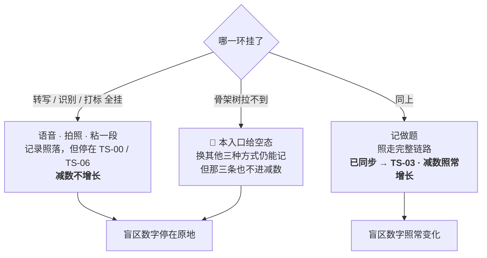
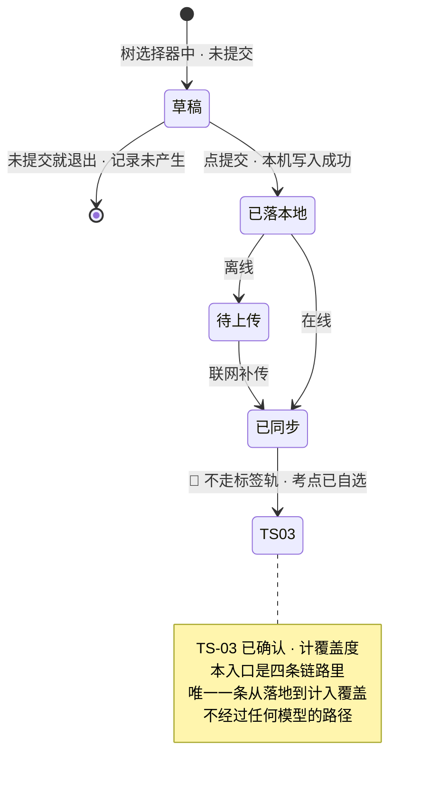

# U1.5 · 记做题

> **基线**：`origin/v1` @ `73041df`，fetch 于 2026-09-02。
> **状态：活跃。** 「不走标签轨」这条结论、树选择器的输出形态、骨架未就绪时的空态语义变化，本文同一次改动内更新。
> **上一层**：[M1 · 记录](INDEX.md)

---

## 一、这个子能力是什么、不是什么

**它是四个采集入口里唯一一条不依赖任何模型的完整路径。** 用户自己从考点树里挑一个，提交，结束。

🔴 **它不走标签轨。** 考点是用户自己选出来的，`已同步` 之后**直接 `TS-03` 已确认**
（`模块地图` §四 结尾那条约定、`记一次学习` §4.4）。没有 `TS-00`、没有 `TS-01`、没有候选、没有阈值、没有自检。

- **它不是「更准的那个入口」。** 它和别的入口没有准确度之争 —— 别的入口在猜，它在照抄用户自己的选择。
- **它不是「高级用户模式」。** 它对用户的要求更高（得知道考点叫什么、在树的哪一层），
  所以**首页三个快捷里没有它**，默认入口也不是它。它是保底，但不抢入口（`记一次学习` §4.4）。
- **它不是打标的替代品。** 它替代的是「模型可用」这个前提，不是打标这一步的产品价值。

**它独有的两个决策**：为什么不走标签轨、以及它作为保底路径的边界在哪。两条都在 §二。

---

## 二、详细产品逻辑

### 2.1 为什么直接落 `TS-03`

标签轨存在的理由是「产品替用户猜了一个考点，需要一条从猜到确认的路」。
本入口里**没有猜这一步** —— 考点是用户从闭集里亲手选的，那正是 `TS-03` 已确认的定义本身。

强行让它走一遍标签轨会同时踩三条线：

| 强行走标签轨会怎样 | 违反什么 |
|---|---|
| 拿用户已经给出的选择再去调一次模型 | 制造一次可以失败的往返，而这条路的全部价值就是**不依赖模型** |
| 让用户确认自己刚刚选的东西 | 一次无信息的确认动作，把「记一次的成本」重新推高 |
| 模型返回了别的考点 | 产品用模型的判断覆盖用户的判断 —— 这是本产品结构上不做的事 |

**代价也说清楚**：这条路径上没有任何一层拦得住用户挂错。产品接受这一点 ——
用户挂错的是他自己的覆盖度，而模型挂错的是产品的准确率，两者不是一回事。

### 2.2 保底路径：它保的到底是什么

**它保的不是「还能记」，是「减数还在长」。**
模型全挂时，别的三个入口保住的是记录存在（`U1.1`），但那些记录停在未分类，
按 `I-2` **不进行为层** —— 盲区数字不动。只有本入口能让 `盲区 = 全集 − 碰过的` 这个减法继续运转。

**这条保底有一个前提，而这个前提是它自己的天花板**：它依赖骨架树。
骨架未就绪时本入口给空态，用户得换别的方式记 —— 那时减数照样不增长。
所以准确地说：**它保的是「模型全挂」，保不了「骨架没建好」。** 这两种故障不能混为一谈。

### 2.3 树选择器：只输出标识，不产生文本

| 规则 | 为什么 |
|---|---|
| 只能从已有的树里**选**一个叶子节点 | `I-3` 闭集：接口只收节点标识，不收标签文本 |
| 🔴 **不能新建考点、不能填文本** | 用户新建一个考点，等于用户在改被减数。被减数是维护出来的，不是用户填出来的 |
| 选中之后仍可改选 | 提交前一切可逆；提交后走删除（见 `模块地图` §三登记的 `U1.7`） |
| 未选考点时提交不可用 | 与空输入同理：**内容还不构成一条记录**，不是在等某个响应（`U1.1` 推论 2 的判别方法） |

### 2.4 骨架未就绪与考点在提交前被归档

| 情况 | 行为 | 记录状态 |
|---|---|---|
| 骨架树拉不到 / 该科目未建好 | 本入口给空态说明理由，**可切其他方式记** | 记录还没产生（不算丢）。这是 `U1.1` 表外四样之一：骨架树拉不到不许挡住记录 |
| 选中的考点在提交前被归档或下线 | 提交时提示考点变了，重新选 | 记录还没落，**不算失败** |

🔴 **第二种情况是 `I-6` 在采集侧的落点**：归档节点同时退分子与分母，且永远可找回。
所以「考点变了」不是错误，是被减数变了；用户重选一个即可，已经挂上去的历史记录不受这次归档影响
（挂载失效的形态是 `TS-09`，归属 M2）。

### 2.5 状态与转移

⚠️ **离线时的一处细节**：本入口离线也照落，进待上传；补传成功后才到 `已同步`，才落 `TS-03`。
在此之前它**不计覆盖度** —— 主轨四态一个都不计（`模块地图` §4.2）。
所以「模型全挂 + 断网」时，减数同样不增长，只是记录都在，联网后一次补齐。

---

## 三、前端行为意图 × 后端契约意图

| 场景 | 前端行为意图 | 后端契约意图 |
|---|---|---|
| 展开树选择器 | 拉取当前考点树；拉不到给空态并让用户切走 | `GET /syllabus/tree` 失败**不得阻断采集屏的其他模式** |
| 选中一个叶子 | 高亮选中，仅记住节点标识；**不能新建、不能填文本** | 不涉及 |
| 点提交 | 先写本机记录（带节点标识）再反馈 | 无契约（`U1.1` §三 第一行） |
| 创建记录 | 本机写入之后才发 `POST /records`，请求里带用户已选的节点标识 | 带节点标识的记录**直接进覆盖层，不进打标管线**（`后端系统设计与组件接入` §1.1 那条分叉）；只接受标识，不接受名称 |
| 考点已归档 / 下线 | 提交时提示重选，记录不落 | 需要能判别「这个标识现在不可用」，且与「服务出错」是两档 —— 前者让用户重选，后者让用户重试 |
| 离线 | 照落进队列，联网自动补传 | 补传后同样走「不进打标管线」这条分叉，不因为走了 `batch` 而改判 |

🔴 **最后一行是本单元唯一一处容易被实现漏掉的契约意图**：补传路径与在线路径必须给出同一个结论。
批量补传若统一走打标，本入口的保底性质当场失效。

---

## 四、边界与红线在这里的具体形态

| 红线 | 在本单元的形态 |
|---|---|
| **不替用户编考点** | 树选择器只选不建。用户能新建考点，就等于被减数可以被用户改写，而覆盖度是拿被减数当分母算的 |
| **闭集打标** | 本入口是闭集最纯粹的形态：候选集就是整棵树，选择者是用户本人，输出只有一个节点标识 |
| **不做学科教研** | 产品不判断用户选得对不对、不提示「这道题更像另一个考点」。学科判断外包给用户自己接的模型 |
| **不存题干** | 本入口连内容输入框都没有，只有一个选择器和一个来源框。它是四个入口里**结构上离题干最远**的一个 |
| **不判断对错** | 记做题记的是「做过这一块」，不是「做对了几道」。**没有题数、没有对错、没有正确率** —— 入口名称容易让人误以为要收题目结果，这里明确它不收 |

---

## 五、缺口登记

**本单元没有独占的缺口。** 它受两条域级缺口影响，登记如下：

| 缺口 | 缺的是哪一半 | 该谁定 |
|---|---|---|
| `G-12` 埋点来源枚举里本入口归「手动」 | 口径缺：本入口在枚举里与「粘一段」共用同一个来源值，**关卡那个数因此分不出保底路径被用了多少次** | 由人拍板 |
| `G-4` 删除后覆盖度怎么回退 | 前端缺。它对本入口格外直接：本入口产生的记录**必然计入覆盖度**，删掉时盲区数字必然要变，中间态却没定 | 由人拍板 |

⚠️ **一处本单元观察到、真源未登记的空白**：用户选中一个**非叶子节点**（中间层章节）时怎么办，
两份真源都只写了「选一个叶子考点」，没有写选择器允不允许选中间层、以及若允许则覆盖度怎么算。
本单元不替它拍板，只指出：这一格牵动的是覆盖度的分子口径，不只是一个交互细节。
