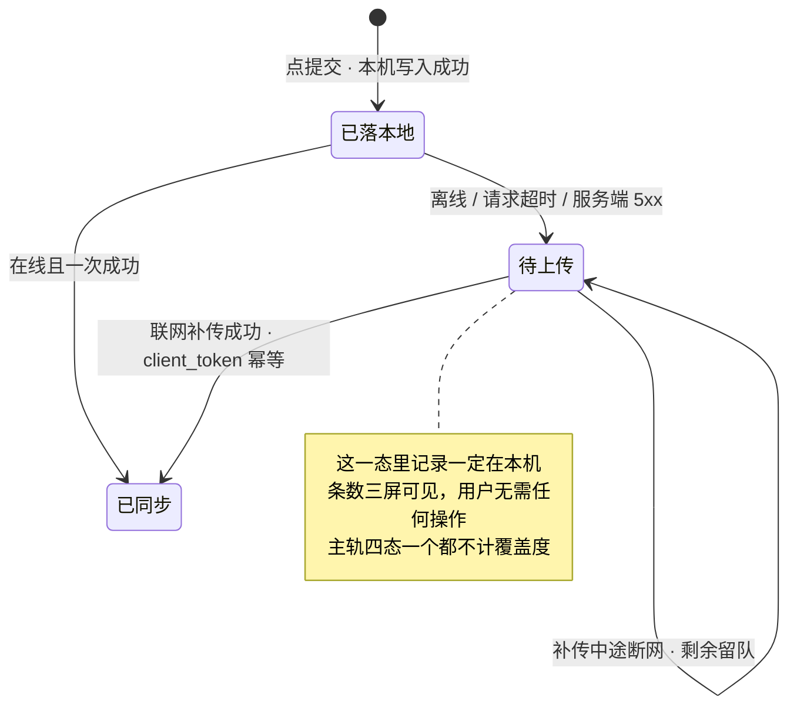
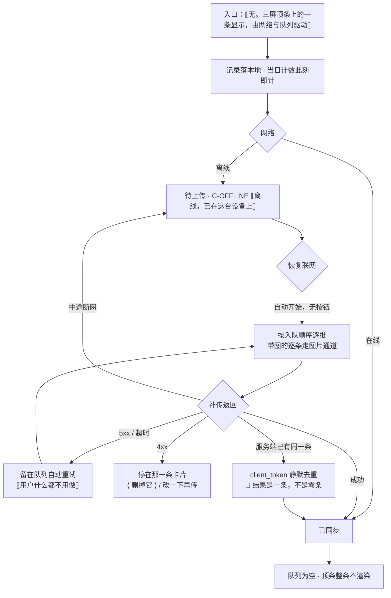

# U1.6 · 离线队列与自动补传

> **基线**：`origin/v1` @ `73041df`，fetch 于 2026-09-02。
> **状态：活跃。** 三条自动补传不变式、幂等口径、单批上限的归属变化，本文同一次改动内更新。
> **上一层**：[M1 · 记录](INDEX.md)

---

## 一、这个子能力是什么、不是什么

**它是 `U1.1` 允许失败清单第 5 行「补传到服务端」的完整展开。**

主轨上有一态是它独占的：`待上传`。这一态存在的全部意义是把「网络不好」翻译成一句用户能接受的话 ——
**东西已经在你这台设备上了，剩下的不用你管。**

- **它不是同步功能。** 用户没有「同步」这个动作可做，**界面上没有任何手动同步按钮**。
  一有按钮，用户就得判断什么时候该点它 —— 而他没有判断依据。
- **它不是导入。** 「批量」在整份真源里只指这条补传路径，**没有面向用户的导入文件入口**（`记一次学习` §7.4）。
- **它不是提醒。** 队列条数是状态显示，不是催促。它不长成小红点、不长成未读计数、不弹浮层。
- **它不管附加能力。** 转写、识别、打标在离线时**不发起**，等联网；那条重试线归 M2
  （`模块地图` §三登记的 `U2.5`）。本单元只管主轨从 `待上传` 走到 `已同步`。

**它独有的三个决策**：队列可见到什么程度、幂等怎么算、单批怎么切。三条都在 §二。

---

## 二、详细产品逻辑

### 2.1 三条不变式，违反任何一条都是缺陷

1. **恢复联网后自动开始补传，没有任何手动同步入口。**
2. **补传进度不播报、不打扰**，只在全部完成时给一次收尾。
3. **补传途中再断网，剩余部分留在队列，下次联网继续 —— 一条不多、一条不少。**

第三条的两半都要成立：「不多」靠幂等（§2.3），「不少」靠队列不清空。
**只做前一半是最常见的实现偏差**：为了不重复而在发出后立刻出队，一断网就少了那一条。

### 2.2 队列可见性：可见到「条数」为止

| 可见的 | 不可见的 | 为什么 |
|---|---|---|
| 队列里有多少条，在三屏顶条上 | **没有「查看队列」入口**，看不到队列内容 | 队列是过程，不是内容。用户要看记录去时间线，那里本机与已同步的记录一起显示 |
| 单条记录上「还没同步」这一标记 | 单条的重试次数、错误码、下一次重试时刻 | 那些是实现状态，用户对它们无法做任何决定 |
| 在线且队列为空时，顶条**整条不占高度** | —— | 不是隐藏内容保留占位，是整条不渲染。否则界面永远少一行，而那一行绝大多数时间是空的 |

🔴 **可见性的目的是信任，不是控制。** 用户看队列条数是为了确认「我记的东西还在」，
不是为了决定要不要干预 —— 他没有任何干预手段，也不需要有。

### 2.3 幂等：`client_token` 的两个方向

每条记录带一个 `client_token`（真源里叫去重键），重试、重发、跨设备重放都用同一个。

| 方向 | 要求 | 不满足会怎样 |
|---|---|---|
| 正向 | 重复提交**不产生第二条**，静默去重、无提示、列表里不出现重复行 | 用户看到两条一样的记录，会以为产品把他的记录复制了 |
| 反向 | 去重的结果是**一条，不是零条** | `U1.1` `A-14` 专打这个方向：把「不产生第二条」实现成「丢弃这一条」，就是清单外的失败 |

**去重还是跨设备的唯一手段**：两台设备记同一件事，靠 `client_token` 收敛成一条，时间以先到为准。
登录是记录的前置，所以不存在「未登录攒下的记录归谁」这个问题（`后端系统设计与组件接入` §1.2 的裁定注）。

**去重键生成失败时**：本地记录仍留、仍进队列 —— 这一环也不在 `U1.1` 的允许失败清单上。

### 2.4 分批与两条形状不同的补传路径

| 项 | 规则 |
|---|---|
| 顺序 | 按入队顺序逐批，每条之间不加人为延迟 |
| 单批条数上限 | 有上限，超了分批；**上限值给指针，不写字面量**（真源见 `记一次学习` §7.4 指向的契约层） |
| 坏请求 | 整批失败重试，**不影响本机已落记录** |
| 🔴 图片 | **不走批量**，逐条走图片通道 |

**图片不走批量是形状决定的，不是偏好**：内联编码下一整批带图会把单次请求体推到不可接受的量级。
由此得到本单元的一条结论：**离线时，一条带图的记录和一条纯文本记录走的是两条不同长度的补传路径**，
但两者在用户那里的表现必须一样 —— 都只是队列里的一条。

### 2.5 状态与转移



**一处必须说死的语义**：`已同步` **不等于「记录完成」**。
用户的动作在 `已落本地` 那一刻就完成了。任何把 `已同步` 当成「记好了」的说法都是错的 ——
它会让还在队列里的那几条看起来像是没记上（`记一次学习` §二）。

**离线时删除**：本机即删，云端待补。删除动作同样不需要联网。

### 2.6 队列满：现在是一个未定的口径，不是一条已定的降级

真源写的是「记录照落 + 计数显示上限值」，但**队列上限本身未定**（`G-1`），
所以这条降级现在描述的是一个没有触发条件的行为。

🔴 **不许在这里替它拍一个数。** 缺的不只是数值，还有一次实测：
离线两周攒下的量会不会拖垮补传，没有人测过。见 §五。

---

## 三、前端行为意图 × 后端契约意图

| 场景 | 前端行为意图 | 后端契约意图 |
|---|---|---|
| 落本地时离线 | 直接进队列，顶条显示条数；**当日计数在落本地时即计**，不等补传 | 不涉及 |
| 恢复联网 | **自动**开始补传，按入队顺序逐批；全程无手动入口、无浮层 | 不涉及触发；服务端不推送、不催促 |
| 批量补传 | 按单批上限切批；坏批整体重试，不动本机记录 | `POST /records/batch` **幂等**，重试不产生第二条；上限值由契约层给出，前端读取而非硬编码 |
| 带图记录 | **不进批量**，逐条走图片通道 | 图片通道保持单条内联，不提供批量形态 |
| 补传返回 4xx | 该条标失败并**保留在本机**，给用户「删掉它」或「改一下再传」两条路 | 拒绝**不回滚本机那一条**；拒绝原因需可区分到「这一条不可接受」而非笼统失败 |
| 补传返回 5xx / 超时 | 留在队列自动重试 | 与 4xx 必须可区分 —— 一个要用户动手，一个用户什么都不用做 |
| 补传中断网 | 剩余留队，下次续传 | 续传靠同一批 `client_token`，服务端对已收到的静默去重 |
| 队列条数上限 | 🚧 上限未定，现状不设上限 | 🚧 未定，见 `G-1` |

🔴 **「补传返回 4xx 与 5xx 必须可区分」是本表唯一一条会直接改变用户动作的契约要求。**
合成一档，界面就只能给一句含糊的话，而 `U1.1` 推论 4 要求每条路径都指向一件用户此刻能做的事。

---

## 四、边界与红线在这里的具体形态

| 红线 | 在本单元的形态 |
|---|---|
| **没有第四种反馈形态** | 队列条数是状态显示。不许长成小红点、未读计数、气泡引导或「你还有几条没传」的催促。补传完成也只是一次收尾，不做任何庆祝 |
| **不判断对错** | 队列相关的所有文字只陈述事实（有几条、在这台设备上、会自动传），**不评价用户的网络、不建议他去连 Wi-Fi** |
| **额度隔离** | 补传只走记录写入，**不经过任何额度检查**。额度只碰外部模型调用（`I-4`） |
| **原图不上云** | 图片逐条内联走识别通道，补传本身不承载原图字节；离线期间原图始终在本机 |
| **不存题干** | 批量补传的请求体与单条一致，**不因为「批量」而多出任何能装内容的位置** |

---

## 五、缺口登记

| 缺口 | 缺的是哪一半 | 该谁定 |
|---|---|---|
| `G-1` 本地队列长度上限 | **两半都缺**：上限值未定，且「离线两周攒下的量会不会拖垮补传」**没有实测过**。这是本单元最大的一个洞 | 由人拍板，需要一次实测 |
| `G-15` 队列满降级的实测口径 | 降级行为跟着 `G-1` 走，两者先后关系未定 | 由人拍板 |
| `G-2` 离线补传的时间归属偏移 | 产品口径缺：时间取落本地时刻、由服务端打戳，补传整体后移算到哪一天没定 | 由人拍板 |
| `G-3` 「一天从哪儿开始」 | 文档侧全缺，配置里有值但那是代码替文档做的决定 | 由人拍板，待真源落笔 |
| `G-6` 批次接受什么格式、有没有用户侧导入入口 | 后端那一半缺 | 由人拍板 |
| ⚪ `M1-G16` 「改一下再传」的入口位置 | 界面缺：补传被拒（4xx）那一条卡片上要给一条改完再传的路，**而真源没有写明这个入口落在哪一屏** —— 卡片内联、进详情、还是回到 `S-REC`，三种落法对应三种不同的记录归属。§6.5 ※9 就是这一条 | 由人拍板。新号带域前缀，见 `模块地图` §一 第 4 条 |

⚠️ **`G-2` 与 `G-3` 叠加在一起会产生一个本单元无法回避的后果**：
跨零点补传的记录归到哪一天没有结论，而**关卡验收的那个数正是按天计的**。
按现有口径（落本地时即计、归落本地那一刻的自然日）不影响关卡判定，
但这两条一旦被改成按补传时刻计，关卡的输入口径当场改变。本单元只登记这层依赖，不裁定。

---

## 六、线框

> 记号表与红线自查十条见 [线框与交互规格约定](../线框与交互规格约定.md)。屏宽 40 个半角字符。
> **本单元没有自己的屏。** 它在界面上只有两个落点：三屏共用的顶条细条，与单条记录上的待传角标。
> 各屏内容区不属于本单元，一律写 ⟦见对应单元⟧。

### 6.1 常态 · 顶条在三屏上的落点（整屏）

```
┌────────────────────────────────────────┐
│ ⟦顶条·离线 / 同步中⟧ ← C-OFFLINE       │  ※1
├────────────────────────────────────────┤
│ ⟦各屏内容区·不属于本单元⟧              │
│  ⟦…⟧                                   │  ※2
│                                        │
│ ⟦记录卡片⟧ ⟦待传角标⟧ ← C-CARD         │  ※3
├────────────────────────────────────────┤
│ ⟦各屏底部·见对应单元⟧                  │  ※4
└────────────────────────────────────────┘
```

※1 三屏（首页 / 记一次 / 时间线）同一条细条，同一套取值
※2 内容区在本域另几份单元与 `模块地图` §三 登记的对应单元里，本节不画
※3 角标只表示「这一条还没同步」，已同步时不渲染；不显示重试次数、错误码、下一次重试时刻
※4 🔴 **这一屏上没有「同步」这个动作**：没有手动同步按钮、没有立即同步、没有查看队列入口

### 6.2 离线（只画变化区）

```
│ ⟦顶条·离线 → 记一次学习 §3.3⟧ ← C-OFFLINE │  ※5
```

※5 只陈述事实，**不评价用户的网络、不建议他去连 Wi-Fi**

### 6.3 补传中（只画变化区）

```
│ ⟦顶条·正在同步 {n} 条⟧ ← C-OFFLINE     │  ※6
```

※6 🔴 只有条数，**没有进度条、没有百分比、没有完成度**；补传进度不播报、不打扰，全部完成时给一次收尾

### 6.4 在线且队列为空（只画变化区）

```
├────────────────────────────────────────┤  ※7
│ ⟦各屏内容区⟧ 直接从这里开始            │
```

※7 **整条不渲染，不是隐藏后留占位** —— 否则界面永远少一行，而那一行绝大多数时间是空的

### 6.5 补传被拒的那一条（只画变化区）

```
│ ⟦卡片·时间 / 来源名⟧ ← C-CARD          │
│  ⟦这一条没被接受⟧                      │  ※8
│  ⟨ 删掉它 ⟩   ‹ 改一下再传 ›           │  ※9
```

※8 只在 4xx 这一档出现；5xx 与超时留在队列自动重试，**用户什么都不用做**
※9 ⚠️ 危险动作走 `C-DANGER`；「改一下再传」的入口位置真源没有写明 —— ⚪ `M1-G16`，已登记在 §五，本节不裁定

---

## 七、交互规格

### 7.1 必答五项

| # | 项 | 本单元的答案 |
|---|---|---|
| 1 | **入口** | 🔴 **没有用户入口，这是本单元的产品结论**。它出现在首页 / 记一次 / 时间线三屏的顶条上，由设备网络状态与本地队列长度驱动；用户点不进去，也没有可点的元素。恢复联网即自动开始，深链与登录后回跳都不经过它 |
| 2 | **结束状态** | 主轨 `待上传` → `已同步`。补传中途断网则**留在 `待上传`**，下次联网继续，一条不多一条不少。🔴 `已同步` 不等于「记录完成」—— 用户的动作在 `已落本地` 那一刻就完成了 |
| 3 | **失败落点** | 5xx / 超时 → 停在 `待上传`，顶条照常显条数，**用户没有任何下一步，也不需要有**。4xx → 停在时间线那一条卡片上，§6.5 两条路：`⟨ 删掉它 ⟩` 或改一下再传。两档必须可区分，合成一档界面就只能给一句含糊的话 |
| 4 | **空态** | 队列为空且在线 → §6.4，**整条不渲染**。这是本单元唯一的空态，且它的正确形态是「这一行不存在」，不是 `C-EMPTY`：队列是过程不是内容，没有可以给出的「立刻能做的动作」 |
| 5 | **错误态** | 可重试：5xx / 超时 → 自动重试，界面不变，不出 `C-ERR`（用户无需干预）。不可重试：4xx → §6.5。⚪ 队列上限与队列满降级是缺口，见本文 §五 `G-1` `G-15`；上限未定，所以现在这条降级没有触发条件 |

**受限态**：不涉及 —— 补传只走记录写入，**不经过任何额度检查**（`I-4`）。
**离线态**：本单元本身就是离线态的落点，见 §6.2。带图记录逐条走图片通道，但在用户那里的表现与纯文本记录**完全一样**：都只是队列里的一条。

### 7.2 交互流程


