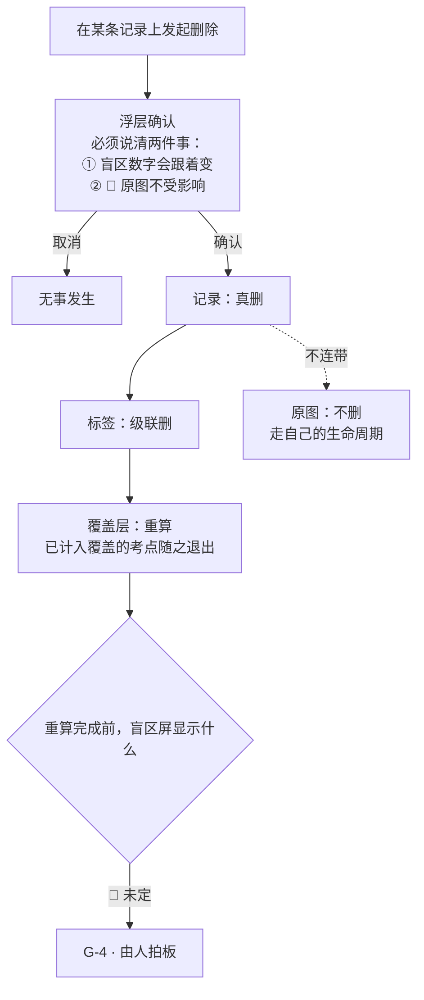
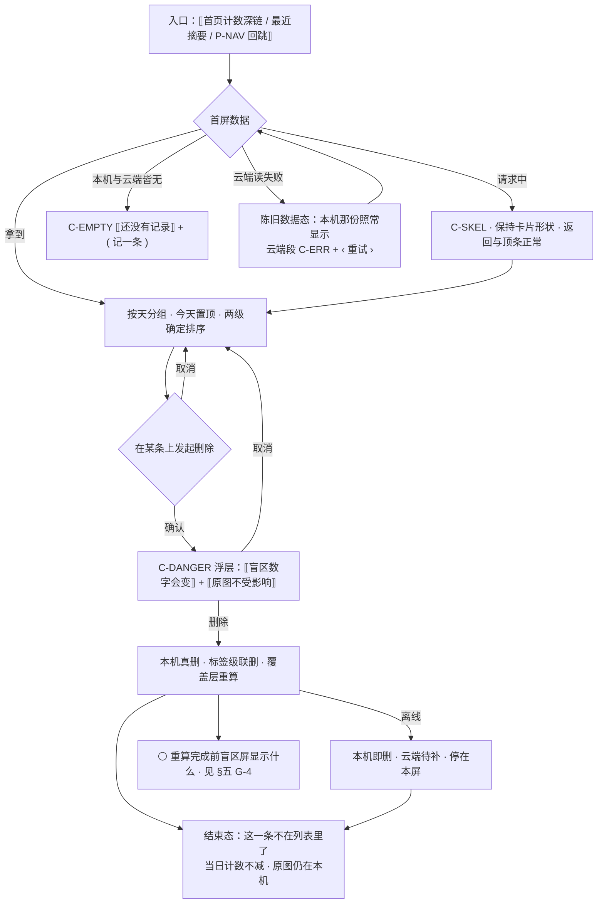

# U1.7 · 时间线回看与删记录

> **基线**：`origin/v1` @ `73041df`，fetch 于 2026-09-02。
> **状态：活跃。** 「没有筛选与搜索」这条结论、删除的三样去向、排序口径变化，本文同一次改动内更新。
> **上一层**：[M1 · 记录](INDEX.md)

---

## 一、这个子能力是什么、不是什么

**时间线是「这一条记录存在」的用户可见证明。** 它的产品价值是**信任**，不是流程 ——
它不在主旅程上（`用户价值与主流程` §三）。用户翻它是为了确认「我记的东西还在」，不是为了完成某一步。

- **它不是仪表盘。** 不排序出优劣、不评分、不总结、不给周报。它只把已经落下的记录按天摊开。
- **它不是内容库。** 卡片上不出现内容全文；它只回答三件事：**有没有、几次、多久前**。
- **它不是打标屏。** 手动挂载、确认、丢弃这些动作归 M2，本单元只负责把状态摆出来、把入口露出来。
- **它不是回收站。** 删除真删，没有回收站这一层 —— 而「能不能撤销」至今没有人定过（见 §五）。

**它独有的两个决策**：为什么没有筛选与搜索、删除的完整路径与可逆性。两条都在 §二。

---

## 二、详细产品逻辑

### 2.1 没有筛选、没有搜索 —— 三条理由，任一条单独成立

| # | 理由 | 它单独成立吗 |
|---|---|---|
| 1 | **规模不存在。** 关卡阶段是自己用两周，时间线一屏就装得下。筛选是在为一个还不存在的规模买单 | 成立，但它是**会过期的**理由 —— 用户量上来它就不成立了 |
| 2 | 🔴 **检索会诱使产品去存内容。** 搜索的天然对象是「这条记了什么」，而本产品结构上不承载题干。一旦做了搜索，「把能装题干的东西当索引」就只差一步 | 成立，且**永不过期**。它是红线的直接推论 |
| 3 | **这一屏的职责边界。** 按考点筛选属于盲区屏，按标签状态处理属于打标屏。时间线只回答有没有、几次、多久前 | 成立，且**永不过期** |

**三条里第 2 条是真正的那一条。** 第 1 条会随规模失效，第 3 条可以靠拆屏绕开，
只有第 2 条说的是：**做搜索这个动作本身，会把产品推向存内容。**

搜索需要索引，索引需要一份可检索的正文，可检索的正文就是一个能装下题干的位置 ——
而红线写的是「数据库里不存在能装下题干的字段，连预留位都不留」。
理由是「留了早晚有人往里写」，而搜索恰恰是那个让人不得不写的功能。

⚠️ 所以「将来数据多了再加搜索」这条路**不是自然延伸**，它是一次要重新过红线的决策。
真源的处理是：将来确实需要就登记成缺口，**不在这一屏直接加**。

### 2.2 按天分组与排序：为什么顺序必须是确定性的

- 分组键是**设备本地自然日**，不是「最近 24 小时」；跨零点后新的一天另起一个分组。
- 「今天」置顶，往下按时间倒序。**分组头右侧不放条数** —— 那条线不引入「连续」这个概念。
- 排序是两级确定链：**记录时间降序 → 记录标识字典序升序**。禁止随机、禁止按「最近更新时间」兜底。
- 补传回来的记录按**原始落本地时间**排，不用补传时刻。

🔴 **为什么排序稳定性写在产品层而不是实现层**：用户会用「昨天第三条」来定位一条记录。
顺序一变，他的结论是「数据变了」，而不是「排序规则变了」。
这与「不评价」是同一条纪律的两面 —— **产品不能让用户对自己的记录产生怀疑。**

### 2.3 云端读失败与离线：本机那份永远看得见

| 状态 | 屏幕上发生什么 |
|---|---|
| 云端读超时 / 出错 | 本机记录**照常显示**，云端那段给错误态与重试 |
| 离线 | 只显示本机记录，顶条给离线状态 |

🔴 **两种情况都不许把本机已有的记录藏起来。**
「记录存在」不依赖云端读数 —— 一次读失败就让列表变空，等于用一次网络故障向用户宣布他的记录没了。
这是 `U1.1` 推论 3 在回看侧的形态：**已经落地的东西，不能被后来的一次失败反悔。**

### 2.4 删除的完整路径



**删掉之后三样东西各自的去向**：

| 被删掉的 | 去向 |
|---|---|
| 记录本身 | **真删。** 没有回收站这一层 |
| 标签与覆盖度 | 级联删标签、覆盖层重算。**盲区数字会跟着变** —— 这一句必须在确认前说给用户听 |
| 🔴 原图 | **不删。** 原图有独立的生命周期，只在原图管理屏由用户手动删（真源 `设置与原图` §6.9） |

**为什么删记录不连带删图**：删记录是一次「我记错了」的更正，不是一次「我要清空间」的动作。
顺手把图删了 = 用一个动作做了两件事，而其中一件用户没同意（`设置与原图` §6.9）。
被留下的那张图变成「没挂到任何记录上」，照常走自己的到期与归档，用户随时能在原图管理屏手动删。

**删除不减计数**：当日的 `record_created` 是「发生过」的累计，删记录是另一个动作，历史计数不变。
这一条同时保护关卡输入的口径 —— 那个数记的是「记了几次」，不是「现在还剩几条」。

**离线时删除**：本机即删，云端待补。删除不需要联网。

### 2.5 可逆性：这是一处公开的空白，不是一个已经想清楚的设计

🚧 **能不能撤销、撤销窗口多长 —— 没有人定过。**
前端有删除动作，后端有级联契约，中间这一段是空的。真源两处都把它登记成缺口。

**本单元不替它拍板**，但要把两侧的约束摆出来，方便拍板的人看清代价：

| 一侧 | 另一侧 |
|---|---|
| 记录侧目前**没有**「真删就是真删」这样的红线承诺，所以软删除在这一侧是可讨论的 | 原图侧**有**：「用户手按的删就是真删」，五秒可撤销也算打折（`设置与原图` §6.8） |
| 记录有云端副本，可逆的实现代价相对低 | 两侧若给出不同的可逆性，用户在同一个产品里会遇到两种删除语义 |

**这一格的真正问题不是「要不要撤销」，是「记录与原图能不能有不同的删除语义」。** 这个问题目前无人回答。

---

## 三、前端行为意图 × 后端契约意图

| 场景 | 前端行为意图 | 后端契约意图 |
|---|---|---|
| 打开时间线 | 本机与已同步的记录一起显示，按天分组 | `GET /records` 游标分页；**排序在契约层就是确定的**，不由前端二次排序补救 |
| 云端读失败 | 本机那份照常显示，云端段给错误态 + 重试 | 读失败**不得被理解为「没有记录」** |
| 单条状态显示 | 显示时间、来源、标签轨状态、待传标记、有图标记 | 状态取值与 `模块地图` §四 的十态一一对应，**不新增第十一态** |
| 发起删除 | 不可逆动作走浮层确认；确认文案必须说清「盲区数字会变」与「原图不受影响」 | 不涉及 |
| 执行删除 | 确认后即删本机；离线时云端待补 | `DELETE /records/{id}` **级联删标签并触发覆盖层重算**；重复删除应幂等 |
| 删除后的计数 | 当日计数**不减** | 计数口径与记录条数是两件事，删除不回写计数 |
| 删除中间态 | 🚧 重算完成前盲区屏显示什么，未定 | 🚧 未定（`G-4`） |
| 撤销 | 🚧 形态未定，当前没有撤销入口 | 🚧 未定（`G-5`）。**不要默认实现成软删除** —— 那等于替产品做了这个裁定 |

🔴 **最后一行是本表里唯一一条「请不要顺手做掉」的要求。** 软删除是最省事的实现，
而它一旦落地，「记录能撤销、原图不能撤销」这个语义分裂就是既成事实，再讨论就变成改实现而不是做决定。

---

## 四、边界与红线在这里的具体形态

| 红线 | 在本单元的形态 |
|---|---|
| **不判断对错** | 时间线不总结、不评价、不排优劣。分组头不放条数计数，因为那条线会引出「连续」这个概念 |
| **不做提醒** | 没有小红点、没有未读计数、没有「你昨天没记」的提示。**漏记这件事只有一个入口，是用户自己按的那个计数**（`记一次学习` §3.4） |
| **不存题干** | 卡片上不出现内容全文；摘要长度由契约层的字段上限管住。**没有筛选、没有搜索**是同一条红线的第二道防线（§2.1 理由 2） |
| **原图不上云、删记录不删图** | 删除确认里必须出现「原图不受影响」这半句。少了它，用户会为了保住图而不敢删错记 |
| **归档节点永远可找回** | 挂载失效（`TS-09`）的记录仍在时间线上可见，不因为考点归档而消失（`I-6`） |

---

## 五、缺口登记

| 缺口 | 缺的是哪一半 | 该谁定 |
|---|---|---|
| `G-5` 删除能不能撤销、撤销窗口多长 | **中间那一半缺**：前端有动作、后端有契约，可逆性无人定。真正的问题是「记录与原图能不能有不同的删除语义」（§2.5） | 由人拍板 |
| `G-4` 删除后覆盖度怎么回退 | 前端缺：级联与重算有契约，**重算完成前盲区屏显示什么、有没有过渡态**没定 | 由人拍板 |
| `G-7` 原图归档后记录卡片上的「有图」标记怎么处理 | 两域之间的联动缺 | 由人拍板 |
| `G-3` 「一天从哪儿开始」 | 文档侧全缺，而本单元**整屏按天分组**，它是这条缺口最直接的消费者 | 由人拍板，待真源落笔 |
| `G-8` `record_skipped` 误点没有撤回路径 | 产品口径缺。它与 `G-5` 是同一类问题的两个实例：**这个产品到底给不给「撤回」这个动作** | 由人拍板 |

⚠️ **一处真源已写明、但值得在这里重述的限制**：**不能补记。**
界面上没有时间选择器，记录时间取落本地那一刻、由服务端打戳，客户端不自报时间。
这是刻意不让「多久前」变成一个可被随手改掉的状态 —— 而「多久前」正是这个产品只回答的三件事之一。
所以时间线上没有「改时间」这个动作，**也不该有**。

---

## 六、线框

> 记号表与红线自查十条见 [线框与交互规格约定](../线框与交互规格约定.md)。屏宽 40 个半角字符。
> 这一屏需要网络，按约定 §3.2 出：常态整屏 + 骨架 + 空态 + 错误态 + 陈旧数据态 + 离线细条；常态之外只画变化区。

### 6.1 常态（整屏）

```
┌────────────────────────────────────────┐
│ ‹ 返回 ›              ← P-NAV          │  ※1
│ ⟦顶条·离线 / 同步中⟧ ← C-OFFLINE       │  ※2
├────────────────────────────────────────┤
│ ⟦分组头·今天⟧                          │  ※3
│  ⟦卡片·时间 / 来源名 / 摘要⟧ ← C-CARD  │  ※4
│   ⟦状态徽标⟧ 已对上 没对上 稍后再认    │  ※5
│   ⟦待传角标⟧ ⟦有图标记⟧                │  ※6
│   ⟨ 删除 ⟩              ← C-DANGER     │  ※7
│  ⟦…⟧                                   │
│ ⟦分组头·昨天⟧                          │
│  ⟦…⟧                                   │
│ ⟦分组头·更早⟧                          │
│  ⟦…⟧                                   │
│ ⟦到底⟧ / ⟦加载中一行⟧                  │  ※8
└────────────────────────────────────────┘
```

※1 永不禁用
※2 在线且队列为空时整条不渲染
※3 🔴 **分组头右侧不放条数** —— 那条线会引出「连续」这个概念。分组键是设备本地自然日
※4 排序是两级确定链：记录时间降序 → 记录标识字典序升序。**卡片上不出现内容全文**
※5 徽标文字照抄 `模块地图` §4.3 那张表。🔴 不显示置信度
※6 两个都是纯标记，不可点；已同步 / 无原图时不渲染。**这一屏上没有原图的分享、导出、同步入口**
※7 各端入口形态不同（行内按钮 / 左滑 / 长按），动作同一个，一律走浮层确认
※8 上拉加载的一行不盖住已有卡片；到底就不显示「加载中」

🔴 **这张线框里没有的东西**：没有筛选器、没有搜索框、没有横向多栏、没有周报、没有总结、没有排名、没有「你昨天没记」、没有任何百分比或进度条。整个滚动区只有一种结构：分组头 + 卡片。

### 6.2 空态（只画变化区）

```
│ ⟦空态·一条记录都没有⟧ ← C-EMPTY        │  ※9
│ (        记一条        ) ← C-BTN 主    │  ※10
```

※9 一句话说清为什么空
※10 空态必须给一个能立刻做的动作，这里就是回到采集

### 6.3 首屏加载 · 骨架（只画变化区）

```
│ ⟦分组头⟧ ···                           │
│  ··· ··· ···  ← C-SKEL                 │  ※11
│  ··· ···                               │
```

※11 骨架保持卡片最终形状；返回与顶条正常渲染。**已经有内容的区域不换骨架**

### 6.4 云端读失败 · 陈旧数据态（只画变化区）

```
│ ⟦本机那份·照常显示⟧                    │  ※12
│ ⟦云端段·读不到⟧ ‹ 重试 › ← C-ERR       │  ※13
```

※12 🔴 **不许把本机已有的记录藏起来。** 一次读失败就让列表变空，等于用一次网络故障向用户宣布他的记录没了
※13 有本机数据时这是陈旧数据态，不是整屏错误态

### 6.5 删除确认（浮层）

```
│ ⟦浮层⟧ ← C-SHEET · C-DANGER            │  ※14
│  ⟦要说清的前提·这一条是真删⟧           │
│  ⟦要说清的第一件事·盲区数字⟧           │  ※15
│  ⟦要说清的第二件事·🔴 原图⟧            │  ※16
│  ⟨ 删除 ⟩   [ 取消 ]                   │  ※17
```

※14 不可逆动作走浮层，原文见真源 `记一次学习` §5.7，本节不抄
※15 这一句必须在确认**之前**说给用户听
※16 少了它，用户会为了保住图而不敢删错记；原图走自己的生命周期，删记录不连带删图
※17 危险动作是次序上的主动作，取消是次按钮

---

## 七、交互规格

### 7.1 必答五项

| # | 项 | 本单元的答案 |
|---|---|---|
| 1 | **入口** | 三处：① 首页「今天记了 {n} 条」这个计数 → 深链定位到当天分组头并滚到视口顶部 ② 首页最近摘要区任意一条 ③ 从别处返回时的 `P-NAV` 回跳。登录后回跳同样落回这一屏。**没有筛选入口、没有搜索入口**（理由见 §2.1） |
| 2 | **结束状态** | 回看本身不改变任何状态。删除这一条动作的结束状态是：本机即删 → 在线时云端级联删并重算覆盖层；离线时本机即删、云端待补。**当日计数不减** —— 计数记的是「记了几次」，不是「现在还剩几条」 |
| 3 | **失败落点** | 云端读失败 → §6.4，停在本屏，本机那份照常显示，云端段给 `‹ 重试 ›`。删除请求失败 → 停在本屏，本机已删不回滚，云端待补，用户不需要动手。⚪ 重算完成前盲区屏显示什么是缺口，见本文 §五 `G-4`；⚪ 能不能撤销见 `G-5`，**当前没有撤销入口，也不许顺手实现成软删除** |
| 4 | **空态** | 两种成因，两张：① 本机与云端都没有记录 → §6.2，`C-EMPTY` + `( 记一条 )` ② 某一天没有记录 → **那一天的分组头整个不渲染**，不出一行「今天没有记录」——那会变成一次提醒 |
| 5 | **错误态** | 可重试：云端读 5xx / 超时、上拉加载失败（上一页仍在）→ `‹ 重试 ›`（`C-ERR`）。不可重试：这一屏没有不可重试的读失败。**有本机数据时一律是陈旧数据态**，见 §6.4 |

**受限态**：不涉及 —— 回看与删除都不调外部模型，额度不锁这一屏（`I-4`）。
**离线态**：`C-OFFLINE` 细条落在顶条；离线时只显示本机记录，删除照样能做，不需要联网。

### 7.2 交互流程


