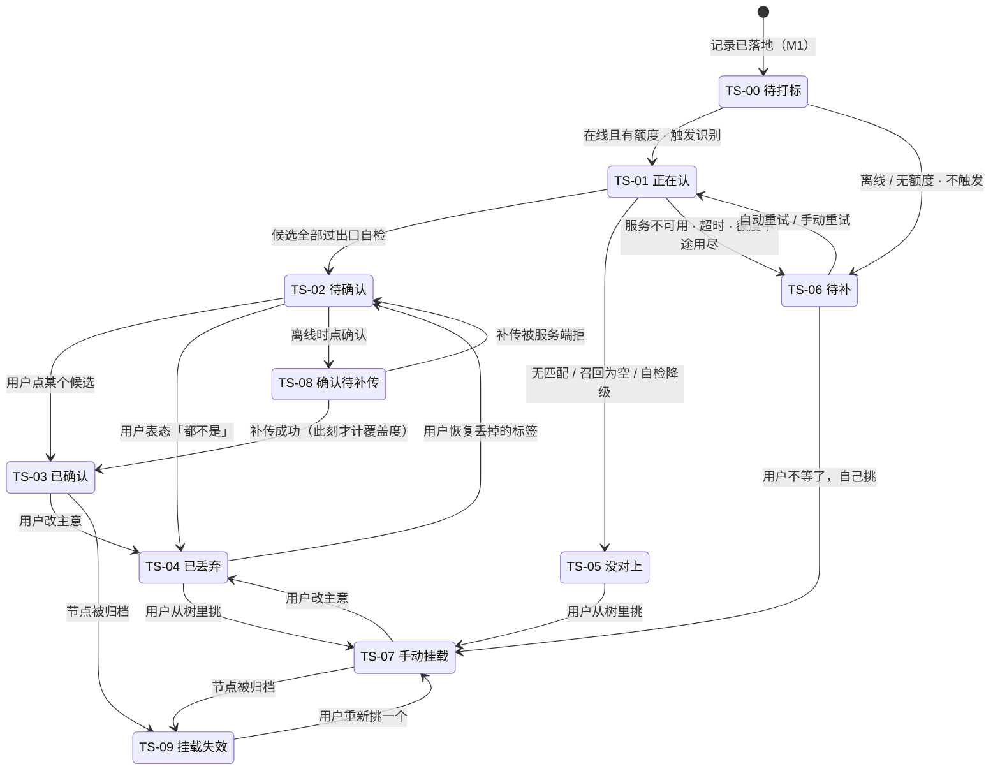

# M2 · 打标与未分类

> **基线**：`origin/v1` @ `73041df`，fetch 于 2026-09-02。
> **状态：活跃。** 能力单元增删、状态名与 `模块地图` §四 不再一致、或 §七 登记的六项边界值被定掉任意一项，本文同一次改动内更新。
> **上一层**：[模块地图](../INDEX.md)

---

## 一、这一域在减法的哪一端

**减数成形。** M1 交过来的是「用户碰了点什么」，这一域决定它**算不算「碰过某个考点」**，
以及在哪几种情况下它**故意不算**。

这一域唯一的产出是覆盖度，所以**归错比漏掉贵得多** —— 漏掉只是这一条不计，归错会让覆盖度失真，
而覆盖度失真之后这个产品就没有指标了（`产品总纲` §四 第 4 条）。整域的每一条设计都从这句话推出来：
四段管线里有三段的作用是丢掉（`U2.1`），十个状态里只有三个计覆盖度（`U2.2`），
四种未分类成因一句都不许合并（`U2.3`），人工出口只能从树里挑（`U2.4`）。

受三条不变量约束，本域不复述它们的内容，只指名：`I-1`（记录先落地）、`I-2`（未分类不进行为层）、
`I-3`（闭集打标）、`I-6`（归档节点同时退分子分母）。

---

## 二、它服务于主流程的哪一步

**`J3` 与 `J4`**（`用户价值与主流程` §四）。

| 节点 | 本域承担的部分 | 这一步失败的落点 |
|---|---|---|
| `J3` 它替你对到考点上 | 全自动，不挡用户记下一条；结果异步回填到卡片 | **退化成 `J4`** —— 用户自己挂，慢，但一条记录都不丢 |
| `J4` 处理没对上的 | 人工出口：从考点树里挑，或者就这样留着 | 记录停在未分类，**可见但不计覆盖度** |

两条不能动的约束落在本域的形态：`J2` 完成于 `J3` 之前 —— 断网、模型超时、额度用尽都不许让记录动作失败（`I-1`）；
`J4` 没走完的记录不进 `J5` 的减数（`I-2`）。

---

## 三、它服务于哪一个关卡

**阶段 1 的验收：「差集结果符合你的自我认知，误判可接受」**（`实施路径` §阶段 1 的验收）。

**这一关最容易失守的地方就是本域。** 反向判据写得很明确：频繁把学过的判成「未触达」，
说明打标准确率或采集完整度不够，**回阶段 0 重想** —— 不是调阈值，不是放宽出口自检。
关卡由人判定，pass/fail，不是可调目标。

阶段 0 的两个数（每天记了几条 / 几次懒得记）**不经过本域**：记录动作不依赖打标（`I-1`）。
本域做得好不好，在阶段 0 的判据上看不出来，也不该被拿去解释阶段 0 的结果。

---

## 四、能力单元清单与下钻

| 单元 | 管什么 | 它单独可以被推翻的那条决策 |
|---|---|---|
| [`U2.1` 四段管线](U2.1-四段管线.md) | 召回 → 闭集分类 → 阈值裁决 → 出口自检 | 三段的作用是丢掉；召回为空直接未分类，不调模型 |
| [`U2.2` 标签状态机](U2.2-标签状态机.md) | `TS-00`–`TS-09` 的转移条件与失败落点 | 没有任何一条系统触发的转移会让覆盖度上升 |
| [`U2.3` 未分类的四种成因](U2.3-未分类的四种成因.md) | 四种成因各说各的话 | 「模型说不匹配」与「模型没看成」必须是两句不同的话 |
| [`U2.4` 手动挂载](U2.4-手动挂载.md) | 唯一的人工出口 | 从树里挑，不能新建；接口只收节点 id |
| [`U2.5` 待补队列与重试](U2.5-待补队列与重试.md) | 服务恢复之后 | 自动重试，用户不需要知道它存在 |

### 4.1 域内共享输入（放在这一层，五个单元向下引用，不互相引用）

| # | 共享的东西 | 内容 |
|---|---|---|
| **S-1** | **状态名全集** | 十态取自 `模块地图` §4.3，本域一个都不自造、不加同义变体。徽标文字同样以那张表为准 |
| **S-2** | **段编号有两套** | `后端系统设计与组件接入` §1.3 把「闭集分类」算作模型调用而不编号，于是编到 ③；`打标与未分类` §5.1 编到 ④。**本域一律按四段口径**，编号差异登记在 §七 |
| **S-3** | **拒绝粒度的分界** | 契约违规（`T-13`/`T-14`/`T-15`）拒绝**整条响应**；骨架与打标结果之间的正常时间差（`T-17`/`T-18`）只过滤**单个候选**。这条分界 `U2.1` 定义，`U2.2` 的失败落点与 `U2.4` 的挂载拒绝都落在它上面 |
| **S-4** | **本域不产生埋点** | 打标一个事件都不加（`打标与未分类` §十四）。契约违规上报不是埋点，它不进任何用户维度的统计 |

---

## 五、域级状态机

**状态名取自 `模块地图` §4.3。** 主轨（草稿 / 已落本地 / 待上传 / 已同步）不在本域，本域只画标签轨。

**计覆盖度的只有 `TS-03` `TS-07` `TS-08`（补传成功之后）三态**，其余七态一律不计（`I-2`）。
`TS-09` 不计，因为节点已经同时退出分子与分母（`I-6`）。

---

## 六、前端行为意图 × 后端契约意图

| 能力 | 前端行为意图 | 后端契约意图 | 真源 |
|---|---|---|---|
| 触发自动打标 | 不阻塞用户，结果异步回填；「正在认」是状态指示不是加载遮罩 | 请求体不接受调用方指定的标签文本；候选由服务端召回 | `技术架构与接口契约` §6.3 |
| 出口自检 | 前端**再**核一遍返回的 id 在不在本次候选集内，不在就整条当无匹配 | 响应必须同时带**本次候选集全集**与被选中的 id，前端才有集合可比 | `打标与未分类` §13.1 |
| 两种失败 | 「模型说不匹配」与「模型没看成」是两句不同的话、两个不同状态 | 两种返回形态，**不合并成一个值**；「无匹配」必须是明确形态，不是空数组、不是空体 | `后端系统设计与组件接入` §1.5 |
| 手动挂载 | 从树里挑，界面上没有「新建」入口 —— 不是禁用，是不画 | 只收节点 id，不收标签文本；非叶子 / 已归档 / 不存在的 id 一律拒绝 | `I-3` · `技术架构与接口契约` §6.3 |
| 确认 / 丢弃 | 确认走乐观更新，失败必须把界面上的覆盖度一起退回去 | 幂等；丢弃只置标志位，标签仍可读；**都不改「来源」** | `打标与未分类` §十三 |
| 未分类的呈现 | 可见、常驻、可挑；不显示置信度、不显示丢弃率 | 不计入行为层 | `后端系统设计与组件接入` §1.4 |
| 待补与重试 | 只有条数可见，没有「查看队列」入口；不弹浮层 | 恢复后自动重试；重试复用触发端点，**不新增重试端点** | `后端系统设计与组件接入` §1.3 |
| 考点名的来源 | 名字一律从骨架树现取，**不从打标响应取** | 响应里不得存在任何能装下标签文本的字段，连可选的都不行 | `I-3` · `打标与未分类` §13.1 |
| 契约违规上报 | 触发时上报一次，内容只有违规类型与记录标识 | 走现有错误上报通道，不新建 | `打标与未分类` §14.3 |

---

## 七、这一域碰到的边界 + 缺口登记

### 7.1 五条边界在本域的形态

| 边界 | 落在本域是什么 |
|---|---|
| **不判断对错** | 打标只回答「这条记录碰的是哪个考点」，不回答答得对不对；界面上没有任何形式的置信度、相似度、分档 |
| **不做学科教研** | 模型在这里只做归类，不做讲解、不做难度评估 |
| **不存题干与机构内容** | 全域唯一能输入文本的地方是树搜索框，它的输出只有一个节点 id；记录内容在本域全程只读 |
| **不生成标签文本** | 模型只能从候选里选一个 id 或返回无匹配；接口不收标签文本；响应里出现标签文本字段时整条丢弃并按最高级别上报 |
| **匹配不上就丢弃** | 阈值裁决与出口自检两道都往「丢」的方向降级；没有「最接近的一个」兜底，没有「换一个更近的」入口 |
| **原图不上云** | 图片在实现类内部内联一次即弃（`I-5`）；跨端打开时不请求任何远端图片 |

### 7.2 缺口登记 —— 只登记，不裁定，不代填数字

🔴 **`打标与未分类` §七 的六项边界值全部是 🚧 未定**，其中候选硬上限那一项的真源自述
「这个数是本文拍的，不是真源」（`打标与未分类` §十六 `T-10`）。**本域一个数都不补。**

| 缺口 | 缺的是哪一半 | 该谁定 |
|---|---|---|
| `T-10` **候选个数的硬上限** | 服务端召回量有真源（`后端系统设计与组件接入` §1.3），「多到什么程度算响应异常」没有。前端现在按 20 实现，**这个 20 是规格自己拍的，不是真源** | 技术，在 `后端系统设计与组件接入` §1.3 补值 |
| `T-6` **搜索结果条数上限** | 端点本身就是 🚧 待技术定稿，条数上限随契约一起悬着；前端现按截断 + 提示实现 | 技术，与 `GET /syllabus/search` 契约同批定 |
| `T-4` **待补队列长度上限** | 队列无上限时长期离线攒下的量会不会把补传拖垮，没有实测数 | 技术定值，产品定「满了之后用户看到什么」 |
| `T-5` **自动重试次数** | 真源只写了「恢复后自动重试」，没给次数 | 技术，在 `后端系统设计与组件接入` §1.3 补值 |
| `T-5` **重试退避曲线** | 同上。界面按「会自己再试」表述，不受它影响 | 同上 |
| `T-2` **单条记录最多挂几个考点** | 上限是**产品口径**（不设上限时批量挂载会变成刷覆盖度的入口），拒绝形态是**接口层**的事 —— 两半都缺 | 产品定语义、技术定拒绝形态 |

| 缺口 | 缺的是哪一半 | 该谁定 |
|---|---|---|
| `C-1` **未分类率高的两种成因分不开** | 「纪律生效」与「召回太窄」在数据上长得一样。这不是待办，是判据本身的一个已知盲点；分开它需要一次抽样人工复核，那是维护侧动作 | 登记，不裁定 |
| `C-2` **未分类记录的老化** | 一条未分类记录挂很久没人挑算什么，没定过；现在它永远停在那里 | 产品 |
| `T-1` **丢弃率要不要给用户看** | 倾向不给（会被读成产品能力评分）；不挡开发 | 产品 |
| `T-3` **自动确认的门槛** | 倾向不做。一旦定成「做」，`U2.2` 那条「没有系统触发的转移能让覆盖度上升」就要重写 | 产品 |
| `T-9` **搜不到考点时要不要收集反馈** | 收集它的任何形态都长得像「用户提交标签文本」，而那条路在接口层不存在；形态界限没划过 | 产品 |
| `T-11` **骨架树缓存的过期策略** | 「树不常变」的「不常」是多久没定，与骨架侧的频次统计更新周期相关 | 技术 |
| `T-12` **`TS-09` 要不要催用户重挂** | 倾向永远不做 —— 催促就是提醒机制的变体 | 产品 |
| **段编号两套** | `后端系统设计与组件接入` §1.3 与 `打标与未分类` §5.1 对同一条管线编号不同（三段 vs 四段），不是逻辑分歧，是编号分歧 | 技术，两处对齐一次即可 |
