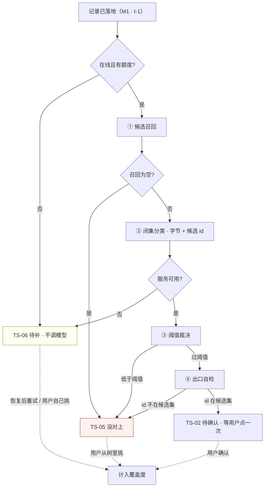

# U2.1 · 四段管线

> **基线**：`origin/v1` @ `73041df`，fetch 于 2026-09-02。
> **状态：活跃。** 管线段数增删、任何一段的丢弃条件变化、或「无匹配」的返回形态被改动，本文同一次改动内更新。
> **上一层**：[M2 · 打标与未分类](INDEX.md)

---

## 一、这个子能力是什么、不是什么

**是**：一条**已经落地**的记录，怎么变成「一个候选节点 id」或者「未分类」的那条判定链。
它从记录落地之后开始，到写下结果为止，全程不与用户交互。

**不是**：

| 不是 | 在哪 |
|---|---|
| 模型选型、价格、为什么是多模态一步到位 | `识别链路选型` §一 §二 |
| 召回数量、阈值取值、这两段写在哪一层代码 | `后端系统设计与组件接入` §1.3 |
| 返回结构与端点契约 | `技术架构与接口契约` §6.3 |
| 用户看到什么、说哪句话 | `打标与未分类` §六 |

**这一段的产品判断只有一句**：管线的默认方向是**丢**，不是**凑**。
四段里只有一段在产出，其余三段的作用都是丢掉（`后端系统设计与组件接入` §1.3）。

---

## 二、详细产品逻辑

### 2.1 四段，三段在丢

| 段 | 做什么 | 丢在哪 | 为什么这一段必须存在 |
|---|---|---|---|
| ① **候选召回** | 关键词 / 规则，把整棵树缩到一小组候选（数量见 `后端系统设计与组件接入` §1.3，本层不复述、前端不硬编码） | **召回为空 → 直接未分类，不调模型** | 便宜手段先做，但这不是省钱技巧 —— **没有候选就没有「集」可闭**。`I-3` 的前提在这一段生成 |
| ② **闭集分类** | 把字节与候选 id 交给模型，要回其中一个 | —— | 全管线**唯一在产出**的一段。模型只能**选**，不能**写** |
| ③ **阈值裁决** | 低于阈值判为不匹配 | **丢** | 不硬凑最接近的考点。宁可这条未分类，不可采信一个勉强的结果 |
| ④ **出口自检** | 返回的 id 不在候选集里 → 一律降级为无匹配 | **丢** | 不是靠 prompt 写一句就算数，**是在输出侧检**。红线要有一道机器执行的闸，不是一句叮嘱 |

**①③④ 都在丢东西，只有 ② 在产出。** 三段丢弃合起来是「宁可丢弃率高，不可准确率低」的可执行形态：
每一段都可以让一条记录停在未分类，**没有任何一段可以让一条记录被强行归类**。

⚠️ **③④ 写在接口层，不写在实现类里**（`后端系统设计与组件接入` §1.3）。
产品侧要知道这件事的理由只有一个：**换厂商换的是实现类，换不掉这条线** ——
所以「换个更准的模型就能放宽阈值」这个提案在结构上就不成立，不需要逐次讨论。

### 2.2 三段丢弃各自丢掉的是什么

| 段 | 丢掉的是哪一类 | 如果不丢会怎样 |
|---|---|---|
| ① 召回为空 | **无从判断的**：这条记录在当前骨架里没有任何相近节点 | 把整棵树交给模型让它自己找 —— 那就是开集，`I-3` 当场失效，且模型只能瞎猜 |
| ③ 低于阈值 | **勉强的**：模型选了一个，但它自己也不确定 | 覆盖度里混进「差不多是这个」的标签，而覆盖度失真之后这个产品没有指标 |
| ④ 不在候选集 | **来路不明的**：返回的 id 根本不是这次给它的那些 | 幻觉考点直接进库；同时说明闭集约束已经失效，此时更不能采信同一条响应里的其他部分 |

### 2.3 管线走向

🔴 **管线的出口不是「已确认」，是「待确认」。** 自动打标最多把一条记录送到 `TS-02`，
**它自己不会让任何一个考点从「没碰过」变成「碰过」** —— 那一步永远要用户点一次（`I-2`；十态与转移见域索引 §五）。

### 2.4 出口自检为什么在客户端还有第二道

后端在管线第 ④ 段已经检过一遍，前端拿到响应后**再逐个核对一次**：id 不在本次候选集里，就当无匹配。

**这道冗余是有意的**：闭集打标这条红线不该只有一处实现 —— 一道锁失效不该导致整条线失守。
代价是前端多一次比对，收益是这条线从「后端保证」变成「两边各自能独立判定」。

由此推出一条接口层的硬要求：**响应必须让前端能自行判定「返回的 id 是否在本次候选集内」**，
即同时带候选集全集与被选中的 id（`打标与未分类` §13.1）。
拿不到候选集全集时，前端的正确行为是**整条当无匹配**，而不是「没有集合就相信服务端」。

### 2.5 拒绝的粒度：整条 vs 单条

**这条分界是本域共享输入 `S-3`**（见域索引 §4.1），本域其余单元的失败落点都落在它上面。

| 情况 | 拒绝粒度 | 为什么 |
|---|---|---|
| 返回的 id 不在候选集 / 响应里出现标签文本字段 / 候选数异常多 | 🔴 **整条响应丢弃**，一个候选都不渲染 | 这三条是**契约违规**。过滤会让一个可疑响应留下一部分被采信，而这一部分正好也可能是幻觉 |
| 候选指向非叶子节点 / 已归档节点 | 只过滤**这一个候选**，其余照常 | 这不是违规，是骨架树与打标结果之间的**正常时间差**（节点刚归档、层级刚调整） |

**契约违规整条丢，时间差过滤单条。** 其中「响应里出现了标签文本字段」是最高级别：
它是闭集红线失守的唯一信号，正确行为是整条丢弃并上报，**而不是忽略这个字段** ——
忽略等于默许它存在，而它存在的下一步就是有人渲染它。

### 2.6 这一段的失败落点

| 失败 | 落到哪个状态 | 记录本身 |
|---|---|---|
| 召回为空 | `TS-05` | ✅ 完好 |
| 模型说不匹配 / 低于阈值 | `TS-05` | ✅ 完好 |
| 出口自检降级、契约违规整条拒绝 | `TS-05` | ✅ 完好 |
| 服务不可用、超时、额度中途用尽 | `TS-06` | ✅ 完好 |
| 骨架该科目未建好 | `TS-05` | ✅ 完好 |

🔴 **全表最后一列没有例外**：打标的任何失败都不许波及记录本身（`I-1`）。
这一列一旦出现一个非 ✅，破的不是本单元，是整个产品唯一不许失败的那一步。

---

## 三、前端行为意图 × 后端契约意图

| 关口 | 前端行为意图 | 后端契约意图 |
|---|---|---|
| 触发 | 记录落地后再触发，触发失败不回滚记录；「正在认」不阻塞任何操作 | 触发与写入是两件事，打标失败不影响记录写入结果 |
| 召回为空 | 与「模型说不匹配」在界面上表现一致，用户看不出区别（成因分辨见域索引 §四） | 不调模型，直接给无匹配形态 |
| 闭集 | 全屏不存在能装下标签文本的变量；考点名一律从骨架树现取 | 请求只带字节与候选 id；响应不得存在任何能装标签文本的字段，连注释成调试用的都不行 |
| 出口自检 | 拿到响应先自检、后取名 —— 不在候选集里的 id 根本不该去查名字 | 响应必须同时给出**本次候选集全集**与被选中的 id |
| 无匹配 | 「无匹配」与「没看成」走两条不同的界面路径 | 「无匹配」必须是明确的返回形态，**不是空数组、不是空体** |
| 异常响应 | 契约违规整条拒绝并上报；时间差只过滤单条 | 上报走现有错误通道，不新建；上报内容不含任何记录文本 |
| 置信度 | **不读、不存、不传给任何渲染层** | 响应里可以有（阈值裁决要用），但它不是给前端的 |

---

## 四、边界与红线在这里的具体形态

| 红线 | 在本单元的形态 | 它被绕过时的样子 |
|---|---|---|
| **闭集打标**（`I-3`） | ① 生成集合、② 只能选、④ 在输出侧检；接口不收标签文本 | 响应里出现标签文本字段，或前端跳过自检直接渲染 |
| **匹配不上就丢弃** | ③ 与 ④ 两道都往「丢」的方向降级；没有「最接近的一个」兜底 id | 响应里出现兜底 id 字段，或阈值被调低以「提升命中率」 |
| **不判断对错** | 管线只回答「碰的是哪个考点」，不回答对不对 | 出现难度、点评、讲解类字段 |
| **原图不上云**（`I-5`） | 图片在实现类内部内联一次即弃，不落盘、不进对象存储、不打进任何级别的日志 | 使用厂商的文件暂存接口把图存到平台上 |
| **记录永不失败**（`I-1`） | §2.6 那张表最后一列全 ✅ | 任何一种打标失败让记录写入回滚 |

⚠️ **不显示置信度不是界面偏好，是这条链的性质决定的**：阈值裁决已经用它做过一次裁决了，
再把它显示给用户，等于请用户对一个他没有判断依据的数字再裁决一次。

---

## 五、缺口登记

| 缺口 | 缺的是哪一半 | 该谁定 |
|---|---|---|
| `T-10` **候选个数的硬上限** | 召回量有真源，「多到什么程度算响应异常」没有。前端现按 20 实现，**规格自述这个数是它自己拍的，不是真源** | 技术，在 `后端系统设计与组件接入` §1.3 补值 |
| `C-1` **未分类率高的两种成因分不开** | 「纪律生效（该丢就丢）」与「召回太窄（本该命中却没召回）」在数据上长得一样。分开它需要一次抽样人工复核 | 登记，不裁定 |
| `T-1` **丢弃率要不要给用户看** | 倾向不给。它会被读成产品能力评分 | 产品 |
| **段编号两套** | `后端系统设计与组件接入` §1.3 编到 ③（不给模型调用编号），`打标与未分类` §5.1 编到 ④。逻辑一致，编号不一致 | 技术，两处对齐一次 |
