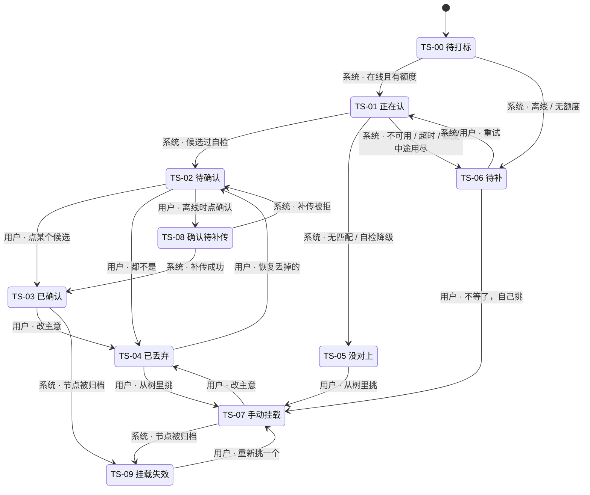
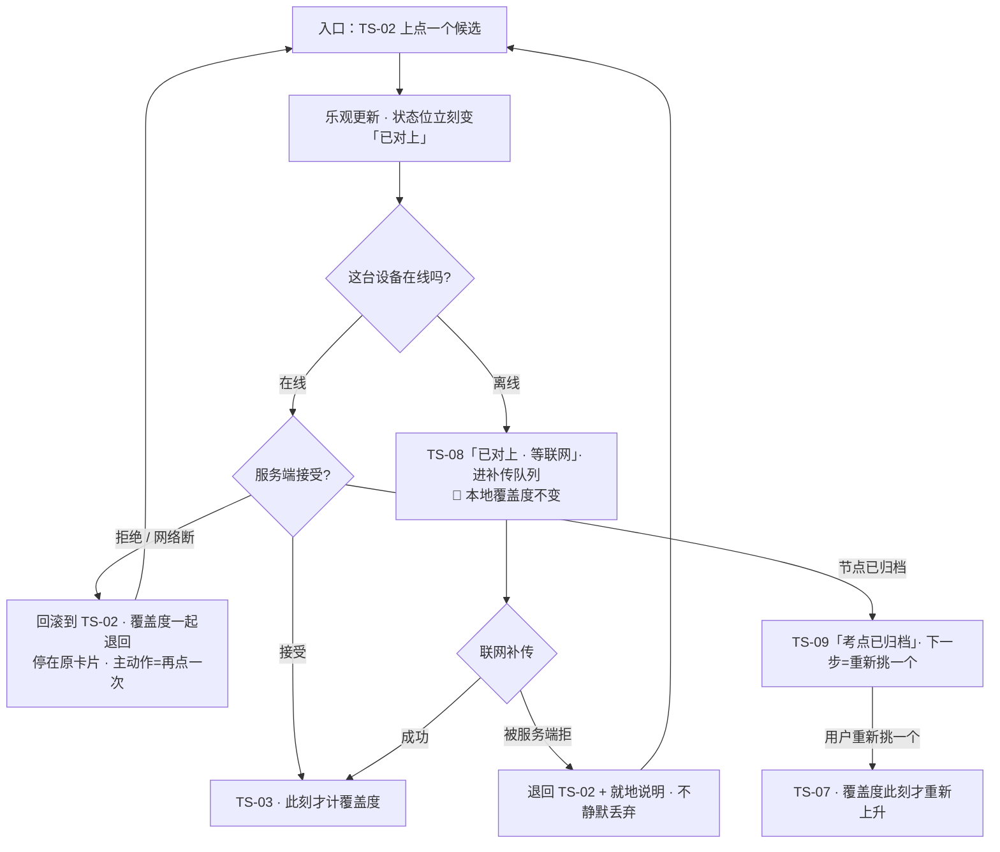

# U2.2 · 标签状态机

> **基线**：`origin/v1` @ `73041df`，fetch 于 2026-09-02。
> **状态：活跃。** 状态增删一个、任一转移的触发者从系统改成用户（或反过来）、计覆盖度的态集合变化，本文同一次改动内更新。
> **上一层**：[M2 · 打标与未分类](INDEX.md)

---

## 一、这个子能力是什么、不是什么

**是**：一条记录身上「挂没挂考点」这条轨的十个状态、它们之间的转移条件、每一次失败落在哪个态，
以及**哪几个态计覆盖度**。

**不是**：

| 不是 | 在哪 |
|---|---|
| 状态名与徽标文字的定义（本单元只使用，不定义） | `模块地图` §4.3 |
| 主轨四态（草稿 / 已落本地 / 待上传 / 已同步） | `模块地图` §4.2 |
| 每个状态在屏幕上长什么样、说哪句话 | `打标与未分类` §四 §六 |
| 覆盖度的分子分母怎么算 | `后端系统设计与组件接入` §1.4 |

🔴 **状态名一个都不许自造，也不许起同义变体。** 十态取自 `模块地图` §4.3，
本单元只负责说清「怎么进来、怎么出去、进来之后计不计数」。

---

## 二、详细产品逻辑

### 2.1 记录级状态是推出来的，不是独立存的

一条记录可以挂多个标签，**每个标签自己只有三种态**：候选（自动打标返回、用户还没表态）、
已确认（用户点过确认，或用户自己挂的）、已丢弃（用户点过丢弃）。
记录级的 `TS-nn` 是这些标签的**汇总结果**，按固定优先级取先命中的那一条（`打标与未分类` §2.3）。

🔴 **确认与丢弃都不改「来源」。** 来源（自动 / 手动）是**来源**，不是**状态**。
这就是 `TS-03` 与 `TS-07` 唯一的区别所在，也是下面 §2.4 那条约定的根。

### 2.2 十态：怎么进来，进来之后计不计

| 码 | 状态 | 怎么进来 | 计覆盖度 | 它是不是终点 |
|---|---|---|---|---|
| `TS-00` | 待打标 | 记录已落地，识别还没触发（离线记的、批量补录的） | 否 | 否 —— 等触发 |
| `TS-01` | 正在认 | 已触发，结果未回 | 否 | 否 —— 过程态，不可逆回退 |
| `TS-02` | 待确认 | 返回了候选且全部过出口自检 | **否** | 否 —— 等用户点一次 |
| `TS-03` | 已确认 | 用户点了某个候选 | ✅ | 可再丢弃 |
| `TS-04` | 已丢弃 | 用户表态「都不是」，或丢掉一个已确认标签 | 否（**记录仍可见**） | 可恢复、可改挂 |
| `TS-05` | 没对上 | 无匹配、召回为空、自检降级、骨架未建好 | 否 | 是（自动侧的终点），人工侧可挂 |
| `TS-06` | 待补 | 服务不可用 / 额度不足 / 超时 / 离线未触发 | 否 | 否 —— 见域索引 §四 的待补队列单元 |
| `TS-07` | 手动挂载 | 用户自己从树里挑了一个 | ✅ | 可再丢弃 |
| `TS-08` | 确认待补传 | 离线时点了确认，进本地队列 | **否，直到补传成功** | 否 |
| `TS-09` | 挂载失效 | 已确认 / 手动挂载指向的节点被归档 | 否 | 否 —— 可重新挑 |

### 2.3 转移全景



### 2.4 🔴 哪几态计覆盖度，以及为什么只有这几态

**计的只有三个**：`TS-03`、`TS-07`、`TS-08` 补传成功之后（那一刻它已经变成 `TS-03`）。
其余七态一律不计，这是 `I-2` 在状态机层的落点。

由此得到一条可以逐条对照检查的形式化表述：

> 🔴 **没有任何一条系统触发的转移会让覆盖度上升。**

能让覆盖度上升的转移只有五类，**每一类的起点都是用户的一次显式点击**：
点某个候选、从「没对上」挑、从「已丢弃」改挂、从「待补」不等了自己挑、从「挂载失效」重新挑。
唯一看起来是系统触发的那条（补传成功）是「离线时用户点确认」的**延迟兑现**，起点仍是那次点击。

改动状态机时先对着这一句检查：**新增一条系统触发的转移，如果它的终点是计覆盖度的态，就是在拆 `I-2`。**

### 2.5 `TS-08` 为什么不提前计

界面上 `TS-08` 长得像已确认（用户体感连续），**但覆盖度的分子里没有它**。这个不一致是刻意的：

本地队列里的确认**没有经过服务端的闭集校验**。把它提前计进去，等于让离线状态成为绕过 `I-3` 的通道 ——
一个红线只要存在一条「在某种网络状态下不生效」的路径，它就不再是红线。
代价是用户离线确认后覆盖度暂时不动，收益是覆盖度这个数在任何网络状态下含义相同。

补传被服务端拒时（节点已失效），状态退回 `TS-02` 并就地说明，**不静默丢弃** ——
静默丢弃会让用户以为自己确认过的东西还在。

### 2.6 `TS-03` 与 `TS-07` 的徽标为什么完全一样

**因为来源不是状态。** 两态的徽标文字逐字相同（文字见 `模块地图` §4.3 的徽标列），这不是偷懒：

1. 用户不需要知道这个考点是谁挂的 —— 他要的答案是「碰过没有」，而两态给的是同一个答案；
2. 区分了会诱导比较（「自动挂的准不准」），而产品不为自动打标的排序与命中背书；
3. 两态在覆盖度上完全等价，界面上做出区别就是**制造一个不影响任何后续动作的差异**。

来源只在导出文件里出现 —— 那是给带得走的数据用的，不是给用户在屏幕上做判断用的。

### 2.7 `TS-09` 挂载失效与归档的关系

节点被归档时，挂在它上面的已确认 / 手动挂载标签变成 `TS-09`。**这一态不计覆盖度**，
但理由与其他不计的态都不同：不是「这条记录没对上」，而是**这个考点已经同时退出分子与分母**（`I-6`）。

| 问题 | 结论 |
|---|---|
| 标签删了吗 | 没有。它还挂着，只是不参与减法 |
| 覆盖度会因为归档虚涨吗 | 不会 —— 分子分母同时退，这正是 `I-6` 存在的理由 |
| 用户还找得到这个考点吗 | 找得到。归档节点永远可找回，归档计数常驻可见（`I-6`） |
| 会催用户重新挂吗 | **不催**（缺口 `T-12`，倾向永远不做）—— 催促是提醒机制的变体，没有第四种反馈形态 |

用户可以从 `TS-09` 重新挑一个节点，回到 `TS-07`，此刻覆盖度才重新上升。

### 2.8 失败落点一览

| 失败发生在 | 落点 | 可逆吗 | 记录本身 |
|---|---|---|---|
| 识别未触发（离线 / 无额度） | `TS-06` | 是，恢复后自动重试 | ✅ |
| 模型说不匹配 / 召回为空 / 出口自检降级 | `TS-05` | 是，可手动挂 | ✅ |
| 服务不可用 / 超时 | `TS-06` | 是 | ✅ |
| 确认请求失败（在线） | 回滚到 `TS-02`，**界面上的覆盖度一起退回去** | 是 | ✅ |
| 离线确认后补传被拒 | 退回 `TS-02` + 就地说明 | 是 | ✅ |
| 节点归档 | `TS-09` | 是，重新挑 | ✅ |
| 记录被用户自己删掉 | 无落点，标签级联删 | 否 | 记录是用户自己删的 |

🔴 **除最后一行外，没有任何一种失败让记录消失**（`I-1`）。

---

## 三、前端行为意图 × 后端契约意图

| 关口 | 前端行为意图 | 后端契约意图 |
|---|---|---|
| 状态推导 | 记录级徽标由标签集合按固定优先级推出，前端不另存一份记录级状态 | 标签的三态是权威；不提供第二份「记录级状态」字段供前端直接取用 |
| 确认 | 乐观更新，100ms 内给反馈；失败必须回滚，**并把覆盖度一起退回去** | 幂等（重复确认返回成功）；成功后该标签必须计入覆盖度；**不改来源** |
| 丢弃 | 丢已确认的 → 覆盖度立刻回落；丢候选的 → 覆盖度不变 | 只置丢弃标志位，标签仍可读；幂等；**不改来源** |
| 恢复 | 恢复到「待确认」，**不自动确认** —— 恢复表达的是「我想再看看」 | 标志位置回；不触发重新分类 |
| 离线确认 | 进本地队列，徽标显示等联网；**本地覆盖度不变** | 按队列项的幂等标识去重重放；补传被拒要给出明确拒绝，不静默成功 |
| 并发改同一标签 | 后到的胜出；先到端刷新后就地说明它在别处被改过 | 后写胜出，不做合并 |
| 归档 | `TS-09` 只显示状态，**不催促** | 归档节点退出分子与分母；归档计数常驻可见（`I-6`） |
| 覆盖度上升的入口 | 每一个都需要用户的一次显式点击，不存在批量 / 自动 / 定时路径 | 不提供任何一次调用能确认多个标签的形态 |

---

## 四、边界与红线在这里的具体形态

| 红线 | 在本单元的形态 |
|---|---|
| **未确认不计覆盖度**（`I-2`） | §2.4 那一句：没有系统触发的转移能让覆盖度上升。`TS-02` 与 `TS-08` 都明标不计 |
| **闭集打标**（`I-3`） | `TS-08` 不提前计 —— 不让离线成为绕过闭集校验的通道 |
| **归档同时退分子分母**（`I-6`） | `TS-09` 不计覆盖度，且节点永远可找回 |
| **记录永不失败**（`I-1`） | §2.8 的失败落点全部落在标签轨，一条都不波及记录 |
| **没有第四种反馈形态** | `TS-09` 不催重挂、`TS-02` 不做未处理计数的清零机制、状态变化不推送 |
| **不判断对错** | 十个状态没有一个表达「对 / 错 / 好 / 差」，只表达「对上了没有、谁挂的、还在不在算」 |

⚠️ **`TS-04` 是唯一一个「可见但不计」的用户主动态**。它必须看得见 —— 记录仍可见是产品承诺；
但它不该抢注意力，因为丢弃是一个低风险、随时可逆的动作。

---

## 五、缺口登记

| 缺口 | 缺的是哪一半 | 该谁定 |
|---|---|---|
| `T-3` **自动确认的门槛** | 现在全部候选都要用户点一次。是否允许某种条件下自动确认，没定，**倾向不做**。一旦定成「做」，§2.4 那句形式化表述就要重写 | 产品 |
| `T-12` **`TS-09` 要不要催用户重挂** | 现在只显示状态，不催促。做催促就撞上「没有第四种反馈形态」，**倾向永远不做** | 产品 |
| `C-2` **未分类记录的老化** | 一条 `TS-05` 挂很久没人挑算什么，没定过；现在它永远停在那里，不会自己变成别的态 | 产品 |
| `T-2` **单条记录最多挂几个考点** | 上限影响 `TS-03`/`TS-07` 能不能无限增加。语义那一半是产品的，拒绝形态那一半是接口层的 | 产品 + 技术 |

---

## 六、线框

> 记号见 `线框与交互规格约定` §三。本单元画的是**状态位本身**：同一条记录的十态在
> S 徽标 / M 行内 / L 全屏三种尺寸形态里各显示到哪一步（形态定义 `打标与未分类` §四）。
> 徽标文字照抄 `模块地图` §4.3 那一列，**一个字不改写**；除徽标外，框里全是槽位。

### 6.1 常态 —— S 徽标形态（时间线卡片右上角，整卡）

```
┌────────────────────────────────────────┐
│ ⟦记录摘要·时间/来源⟧         「已对上」│ ※1
│ ⟦记录内容首行·折叠⟧                    │
└────────────────────────────────────────┘
```

※1 一行内的小标签：**只有徽标文字 + 一个图形**，不带考点名、不带候选条数、不带来源
（图形形状不在本层给，见 `打标与未分类` §4.1）

### 6.2 十态 × 三形态：每一格显示到哪一步

| 状态 | S 徽标 | M 行内 | L 全屏 |
|---|---|---|---|
| `TS-00` | **整格不渲染** | 不渲染 | 不进待处理列表 |
| `TS-01` | 「正在认」 | 「正在认」+ ⟦候选区不渲染⟧ | 同 M |
| `TS-02` | 「看一下?」 | 「看一下?」+ ⟦候选 ≤3 行⟧ + ‹都不是›‹自己挑一个›‹看全部› | 全清单 + ‹跳过这条›，区结构见域索引 §四 登记的手动挂载单元 |
| `TS-03` | 「已对上」 | 「已对上」+ ⟦已挂考点名 → 骨架树现取⟧ | 同 M，另有丢掉入口 |
| `TS-04` | 「丢掉了」 | 「丢掉了」+ ‹看看丢掉的› | 同 M，丢掉的收在专区 |
| `TS-05` | 「没对上」 | 「没对上」+ ⟦这一句 → `打标与未分类` §六⟧ + (自己挑一个) | 同 M |
| `TS-06` | 「稍后再认」 | 「稍后再认」+ ‹再试一次› + (自己挑一个) | 同 M |
| `TS-07` | 「已对上」 | **逐格同 `TS-03`** | **逐格同 `TS-03`** |
| `TS-08` | 「已对上 · 等联网」 | 同 S + ⟦离线细条落在宿主屏顶部⟧ | 同 M |
| `TS-09` | 「考点已归档」 | 「考点已归档」+ ‹重新挑一个› | 同 M |

🔴 **`TS-03` 与 `TS-07` 那两行逐格相同 —— 三种形态里都不许把「手动挂的」与「模型挂的」画成两种样子。**
来源不是状态；来源只在导出文件里出现。
🔴 **这三十格里没有一格装置信度 / 匹配分 / 相似度。** L 形态空间最大，也没有。
🔴 **状态名逐字相同**：S 里是「没对上」，L 里也是「没对上」，不做同义变体。

### 6.3 其余各态：只画变化的那一格

**空态 —— `TS-00`**

```
│ ⟦记录摘要·时间/来源⟧          ⟦无徽标⟧│ ※2
```

※2 整格不渲染，**不留占位、不画灰标签**；这一格不用 `C-EMPTY`（那是整块零数据用的）

**离线态 —— `TS-08`**

```
│ ⟦离线细条⟧             ← C-OFFLINE     │ ※3
├────────────────────────────────────────┤
│ ⟦记录摘要·时间/来源⟧ 「已对上 · 等联网」│ ※4
```

※3 落在宿主屏顶部，把内容整体下推，不悬浮盖住
※4 徽标长得像已确认，**但覆盖度的分子里没有它** —— 这个不一致是刻意的（§2.5）

**骨架态 / 错误态 / 陈旧数据态：本单元不出这三张。** 状态位读的是本地已存状态
（`打标与未分类` §9.1 第 1 行），它自己不发请求，也就没有「在请求途中」与「数据陈旧」这两种处境。

### 6.4 红线自查

十条逐条数过，命中 0。特别是第 8 条（三十格零处置信度）、第 3 条（状态变化不推送、
`TS-02` 不产生未读计数与小红点）、第 5 条（待确认条数不做成进度条或待清零目标）、
第 4 条（`TS-03` 不发徽章、不记连续天数）。原图三处必现项不落在本单元
（`模块地图` §三 登记的 `U8.3` `U8.4`）。

---

## 七、交互规格

### 7.1 必答五项

| # | 必答 | 本单元的答案 |
|---|---|---|
| 1 | **入口** | 状态位没有独立入口，它随记录卡片出现在三处：时间线、刚记完那一屏、待处理屏。可点性按状态定：`TS-02` 点开候选、`TS-03`/`TS-07` 点开考点、`TS-04` 点开丢掉的、`TS-09` 点开重挑；`TS-00`/`TS-01` 不可点。深链与登录后回跳落到宿主屏，不落到这一格 |
| 2 | **结束状态** | 计覆盖度的只有 `TS-03` 与 `TS-07`，以及补传成功后已经变成 `TS-03` 的 `TS-08`；其余七态一律不计（`I-2`） |
| 3 | **失败落点** | 在线确认失败 → 回滚到 `TS-02`，**界面上的覆盖度一起退回去**，停在原卡片，主动作是再点一次；离线补传被拒 → 退回 `TS-02` + 就地说明，**不静默丢弃**；节点被归档 → `TS-09`，下一步是「重新挑一个」 |
| 4 | **空态** | 一张：`TS-00`（§6.3）。为什么空 = 识别还没触发；能立刻做的动作 = 「自己挑一个」，它在任何状态下都在 |
| 5 | **错误态** | 可重试：确认 / 丢弃 / 恢复请求失败 → 就地重试，不跳屏、不弹层。不可重试：节点已失效或已归档 → 不给重试，给「重新挑一个」。陈旧数据态不适用 |

**受限态**：本单元不涉及额度 —— 渲染状态位不调用外部模型（`I-4`）。
登录态失效发生在确认那一步，落点是 §7.2 的回滚边。

### 7.2 一次确认的完整流程



### 7.3 契约缺

✅ 「恢复丢掉的标签」的契约**已于 2026-09-03 补齐**：`接口契约：签名与错误码全集` §4.2 `POST /records/{id}/tags/{tagId}/restore`。下面是本层当时提出的语义要求，逐条已落进去：
界面需要后端能区分**两档** —— 标志位置回成功（回到 `TS-02`）与标签已不存在
（就地说明 + 导向重新挑一个）。两档合成一档，`TS-04` 的恢复入口就给不出正确的下一步。
止于此，本层不写端点路径。
