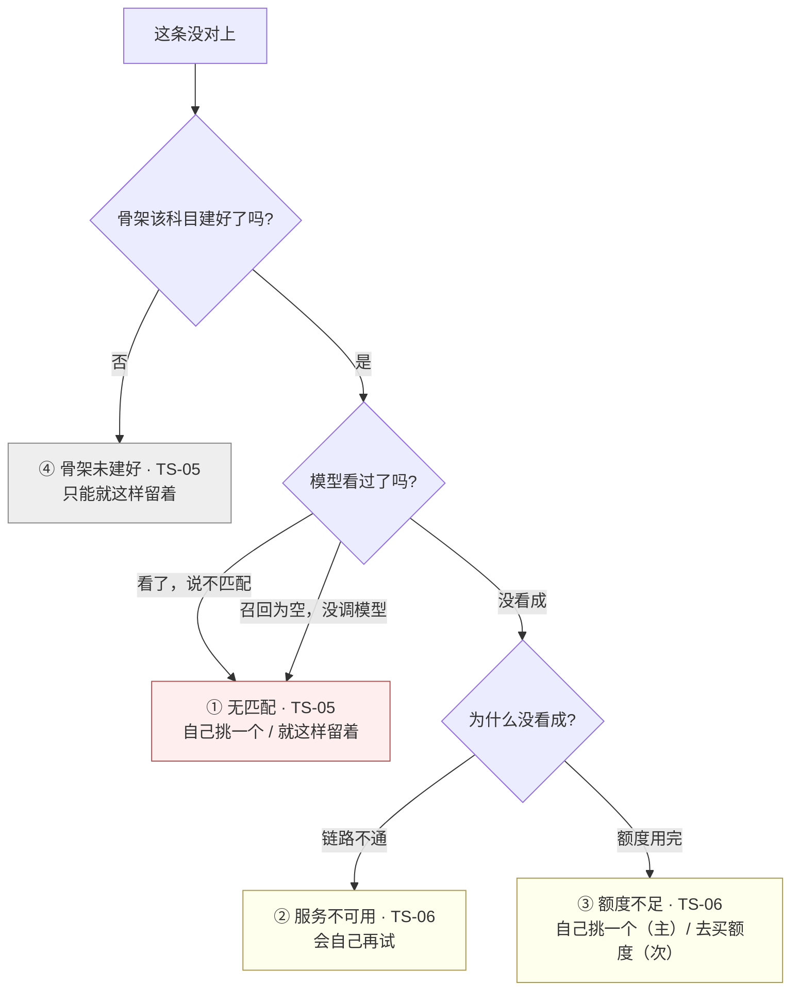

# U2.3 · 未分类的四种成因

> **基线**：`origin/v1` @ `73041df`，fetch 于 2026-09-02。
> **状态：活跃。** 成因增删一种、任意两种成因的用户下一步动作变得相同、或某一种成因的自动重试策略改变，本文同一次改动内更新。
> **上一层**：[M2 · 打标与未分类](INDEX.md)

---

## 一、这个子能力是什么、不是什么

**是**：一条记录没能自动对上考点时，产品要**分几种情况**、每种情况**必须向用户说清哪件事**、
以及每种情况下**用户的下一步动作是什么**。

**不是**：

| 不是 | 在哪 |
|---|---|
| 每一句上屏原文逐字怎么写 | `打标与未分类` §六 |
| 这些成因在管线里是怎么产生的 | `后端系统设计与组件接入` §1.3 · 域索引 §四 |
| 状态名与徽标的定义 | `模块地图` §4.3 |
| 重试与退避怎么跑 | 域索引 §四 的待补队列单元 |

**这一单元只解决一件事：把「没对上」拆成四种，并且不许它们合并。**

---

## 二、详细产品逻辑

### 2.1 🔴 核心决策：「模型说不匹配」与「模型没看成」必须是两句不同的话

这是本单元的全部理由，也是它值得单独成为一个能力单元的原因。

| | 模型看了，说不匹配 | 模型压根没看成 |
|---|---|---|
| 事实 | **认过了**，考点表里确实没有对得上的一条 | **还没认**，链路当时不通 |
| 用户的下一步 | **自己从树里挑一个**，或者就这样留着 | **什么都不用做**，等它自己再试 |
| 再等一会儿会变吗 | **不会。** 召回策略没变，重认结果一样 | **会。** 恢复后自动重试 |
| 用户做错事的代价 | 一直等 → 这条永远不会自己变好，减数少一块 | 立刻手动挂 → 白做一次本来会自动完成的动作 |

**两种情况的正确用户行为完全相反，所以它们不能共用一句话。**
`server/` 已经用两种返回形态把这条钉死了（`后端系统设计与组件接入` §1.5）：
一种是明确的「无匹配」结果，另一种是「服务不可用」的异常路径。

🔴 **混成一个返回值，界面上就只能说一句含糊的话。** 这是产品要求，不是技术偏好 ——
含糊的话会让用户以为是自己记错了，然后不再手动挂，**减数就少了一块**，而减数是这一域的全部产出。

### 2.2 四种成因，四句不同的话

**「说清哪件事」是产品的要求，逐字怎么说在 `打标与未分类` §六。**

| # | 成因 | 状态 | 这一句必须说清的那件事 | 用户能做什么 | 自动重试 | 计覆盖度 |
|---|---|---|---|---|---|---|
| ① | **无匹配** —— 认过了，确实对不上 | `TS-05` | 认过了；**考点表里没有匹配的一条，不是这条记录记错了** | 手动挂载 / 就这样留着 | **不会** | 否 |
| ② | **服务暂时不可用** —— 压根没看成 | `TS-06` | 还没认；它会**自己再试**，用户不用管 | 等 / 手动重试 / 手动挂载 | **会** | 否 |
| ③ | **额度不足** —— 也没看成，但原因在账上 | `TS-06` | 这个月的外部模型次数用完了；**记录已经存下来了**；可以自己挑一个 | **手动挂载（主动作）** / 去买额度（次） | **不会** | 否 |
| ④ | **骨架该科目未建好** —— 没有「集」可闭 | `TS-05` | 这个科目的考点表还没建好；**先记着，建好了这条还在** | **只能就这样留着**，手动挂载入口禁用 | **不会** | 否 |

### 2.3 一条记录没对上时，落到哪一种

**四条出口的用户下一步各不相同**，这就是它们不能合并的判据 ——
两种成因如果导出同一个用户动作，才有资格共用一句话，而这四种没有任何两种做得到。

### 2.4 四种的界面差异，逐格不同

| 差异点 | ① 无匹配 | ② 服务不可用 | ③ 额度不足 | ④ 骨架未建好 |
|---|---|---|---|---|
| 状态码 | `TS-05` | `TS-06` | `TS-06` | `TS-05` |
| 徽标文字 / 图形 | 见 `模块地图` §4.3 `TS-05` 行 | `TS-06` 行 | `TS-06` 行 | `TS-05` 行 + 专属图形 |
| 有「再试一次」吗 | ❌ | ✅ | ✅（补上额度后才可点） | ❌ |
| 「自己挑一个」可点吗 | ✅ | ✅ | ✅ **这是主动作** | ❌ 禁用，并说明原因 |
| 有去别处的入口吗 | 无 | 无 | ✅ 去额度屏 | 无 |
| 语气 | 陈述，**不道歉** | 陈述 + 明说用户不用管 | 陈述 + 给出一条能走的路 | 陈述 + 明说先记着就行 |
| 对应错误码 | `NO_MATCH` | `SERVER_ERROR` / `NETWORK_TIMEOUT` | `QUOTA_EXHAUSTED` | `SYLLABUS_EMPTY` |

⚠️ **② 与 ③ 的状态相同（都是 `TS-06`），但话与动作不同。**
状态是给程序看的，话是给人看的 —— **同一个状态可以有两套话术，反过来不行**：
两个状态不能共用一句话，因为状态不同就意味着用户的下一步不同。

⚠️ **① 与 ④ 的状态也相同（都是 `TS-05`），差别在于 ④ 连人工出口都没有。**
④ 不是「对不上」，是**这个科目还没有可对的集合**；此时把手动挂载入口留成可点，
用户点开会看到一棵空树 —— 那是把一次确定的失败推迟到两次点击之后。

### 2.5 第五种成因：召回为空 —— 它对界面不可见

管线第 ① 段召回为空时直接判未分类、**不调模型**（`后端系统设计与组件接入` §1.3）。
它在接口层返回的也是无匹配，因此**界面上与成因 ① 完全一样，用户看不出区别**。

🔴 **这个不可见是已知的，而且现在没法解决**：「纪律生效（模型该丢就丢）」与
「召回太窄（本该命中却没召回）」**在数据上长得一样**（缺口 `C-1`）。产品侧的裁定是：

- **不在界面上区分。** 区分了也没有一个用户能做的动作不同，只会多一句听不懂的话；
- **不因此给用户「重试」入口。** 召回策略没变，重试结果一样 —— 给了它就变成「摇到满意为止」；
- 分开它需要一次抽样人工复核，那是**维护侧的动作**，不是用户侧的界面。

### 2.6 未分类率高不是故障

未分类率高是「宁可丢弃率高，不可准确率低」这条纪律**正在生效**的直接证据。
它同时也可能是召回太窄 —— 两者分不开（`C-1`）。产品侧因此有两条不做：

1. **不把未分类率显示给用户**（缺口 `T-1`，倾向不给）—— 它会被读成产品能力评分；
2. **不为了让这个数好看而放宽阈值** —— 那是在拿覆盖度的真实性换一个不给任何人看的数字。

### 2.7 任何形态都不显示置信度

🔴 **不是空间不够，是不该显示。** 三种尺寸形态（卡片徽标 / 卡片内行内 / 全屏）都不显示，
**空间够不是显示它的理由**。

| 为什么不显示 | 展开 |
|---|---|
| 它不是学科判断的依据 | 用户没有判断这个数字的依据 —— 显示了就是**请用户替产品做一次它自己都不敢做的判断** |
| 阈值裁决已经用过它了 | 管线第 ③ 段已经拿它裁决过一次。再显示一次，等于把一次已完成的裁决重新打开 |
| 显示它就要为它负责 | 一旦上屏，用户会按数字挑；而排序理由产品不背书，加一个词就是背书 |

同一条推出去的还有：候选行上没有百分比、没有星级、没有「最可能」标记，
响应里的兜底「最接近的一个」是硬归类的接口形态，**明确拒绝**（`打标与未分类` §13.2）。

---

## 三、前端行为意图 × 后端契约意图

| 关口 | 前端行为意图 | 后端契约意图 |
|---|---|---|
| 区分两类失败 | 四种成因走四条界面路径，**一句都不合并** | 「无匹配」与「服务不可用」是两种返回形态，不合并成一个值 |
| 「无匹配」的形态 | 拿到空数组 / 空体时**按无匹配处理，同时按契约不合规上报** | 「无匹配」必须是明确的返回形态，不是空数组、不是空体 |
| 额度不足 | 主动作是手动挂载，购买入口是次动作；**不把购买做成唯一出路** | 不扣额度、不入自动重试队列（`I-4`：额度只碰外部模型调用） |
| 骨架未建好 | 手动挂载入口禁用并说明原因，不放用户进一棵空树 | 用独立的错误形态表达「这个科目还没有集合」，不与无匹配共用 |
| 召回为空 | 与无匹配同一条路径，**不额外提示** | 不调模型，直接给无匹配形态 |
| 置信度 | **不读、不存、不传给任何渲染层** | 响应里可以有（阈值裁决要用），但它不是给前端的 |
| 未分类率 | 不呈现给用户 | 可从库里直接算，**不需要客户端上报**（本域不埋点） |

---

## 四、边界与红线在这里的具体形态

| 红线 | 在本单元的形态 |
|---|---|
| **匹配不上就丢弃** | 「没对上」是**正常结果，不是失败态** —— 界面上不出现「识别失败」这类说法，没有「换一个更接近的」入口 |
| **不判断对错** | 四句话说的都是「有没有对上、为什么没对上」，没有一句评价这条记录本身 |
| **不生成标签文本**（`I-3`） | 四种成因下，用户唯一能走的出口都是「从树里挑一个 id」，没有一种成因会打开「自己写一个」的口子 |
| **未确认不计覆盖度**（`I-2`） | 四种成因全部不计覆盖度，没有例外 |
| **记录永不失败**（`I-1`） | 四种成因下记录都完好；③ 与 ④ 的那句话里必须包含「记录已经存下来了」这个事实 |
| **没有第四种反馈形态** | 未分类不产生未读计数、不产生推送、不做待办清零 |

---

## 五、缺口登记

| 缺口 | 缺的是哪一半 | 该谁定 |
|---|---|---|
| `C-1` **两种成因分不开** | 「纪律生效」与「召回太窄」在数据上同形。**不是功能待办，是判据本身的一个已知盲点**；分开它需要一次抽样人工复核 | 登记，不裁定 |
| `T-1` **丢弃率 / 未分类率要不要给用户看** | 倾向不给。给了要新增一处界面与一处后端聚合 | 产品 |
| `T-9` **搜不到考点时要不要收集反馈** | 「考点表里没有这一条」是真实信号，但收集它的任何形态都长得像「用户提交标签文本」，而那条路在接口层不存在。形态界限没划过 | 产品 |
| `C-2` **未分类记录的老化** | 一条未分类记录长期没人挑算什么，没定过 | 产品 |
