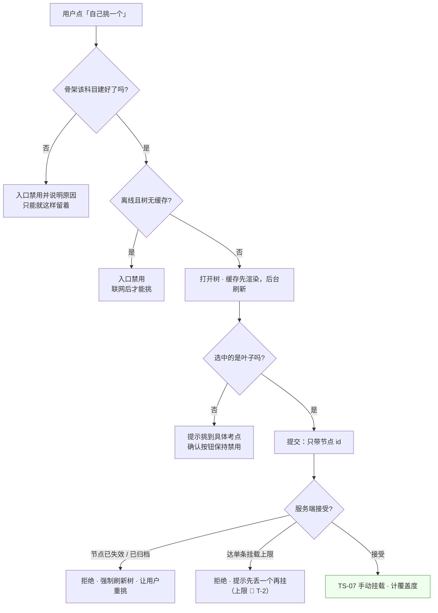

# U2.4 · 手动挂载

> **基线**：`origin/v1` @ `73041df`，fetch 于 2026-09-02。
> **状态：活跃。** 挂载入口增删、树选择器多出任何一个按钮、或挂载接口开始接受节点 id 以外的东西，本文同一次改动内更新。
> **上一层**：[M2 · 打标与未分类](INDEX.md)

---

## 一、这个子能力是什么、不是什么

**是**：自动打标之外**唯一的人工出口** —— 用户自己从考点树里挑一个节点，把这条记录挂上去。
未分类不是终点，是**等用户自己挑**。

**不是**：

| 不是 | 在哪 |
|---|---|
| 屏幕分区、元素清单、无障碍朗读文本 | `打标与未分类` §三 |
| 考点树本身怎么维护、归档口径 | 骨架侧（用户可见的那一条落在 `I-6`） |
| 搜索端点的契约与返回结构 | `技术架构与接口契约` §6.4（搜索端点本身仍是 🚧，见 §五） |
| 挂上去之后算不算覆盖度 | `I-2` · 域索引 §五 |

🔴 **这一单元的全部命门是一句话：从树里挑，不能新建。**

---

## 二、详细产品逻辑

### 2.1 只能选，不能写

`I-3` 在这一单元有三个同时成立的落点，缺一个这条线就漏：

| 落点 | 形态 | 它漏掉会怎样 |
|---|---|---|
| **接口层** | 挂载接口的请求体**只接受节点 id，不接受名称** | 只要 API 上有一条能传自由文本标签的通道，自由生成的考点就进得了库，无论模型输出什么 |
| **界面层** | 树选择器里**没有**「新建」「其他」「以上都不是」；不是禁用，**是不画** | 画一个灰的按钮等于承认这个功能应该存在，只是暂时不给 |
| **前端状态** | 选中态存的是**节点 id**，显示用的名字每次从树里现取 | 前端只要有一个能装标签文本的变量，早晚有人把它提交上去 |

**为什么树里也不放「以上都不是」**：这个语义在挂载屏主体上已经有了。在树里再放一个，
等于给用户**第二条放弃路径**，而这条路径的终点是「随便挑一个最像的」—— 那正是「不硬归类」要挡的行为。

### 2.2 挑的规则

| 规则 | 说明 | 产品意图 |
|---|---|---|
| **只能选叶子** | 选中上层节点时只展开 / 收起，并提示挑到具体考点，**不算选中** | 挂到上层等于把一条记录记在一整片考点上，覆盖度会虚涨一大块 |
| **已挂过的置灰** | 可见但不可选 | 让用户知道「已经挂过了」，而不是让他挂第二次再被服务端拒 |
| **归档节点可见不可选** | 收在归档分组里，可展开可找回（`I-6`） | 归档节点已退出分子与分母，挂上去覆盖度也不动 —— 可选就是给一个无效动作 |
| **一条记录可挂多个** | 允许。真实情况里一次学习可能碰了两个考点 | 上限 🚧 未定，见 §五 `T-2` |
| **重复挂同一个** | 去重，**不报错** | 并发或多端撞上时按幂等处理，界面就地说明即可 |

### 2.3 搜索的产品意图

搜索框是**全屏唯一的文本输入**，而它的输出只有一个节点 id。由此推出几条不能动的行为：

| 规则 | 产品意图 |
|---|---|
| **输入即搜，回车什么都不做**（只收起键盘） | 回车键在这里如果做成「新建」，就是 `I-3` 的正面违反。所以它必须**什么都不做** |
| **只匹配考点名（第 3 层）** | 匹配上层会让结果里出现不可选的行，用户点了没反应 |
| **子串匹配，不做同义词扩展、不做拼音纠错** | 纠错等于**替用户猜**，猜错了就是往「硬归类」滑 |
| **服务端给什么顺序就什么顺序**，前端不重排、不置顶 | 与候选行同一条纪律：产品不为排序背书 |
| **搜索结果必须带完整路径** | 结果脱离了树的上下文，路径是用户判断该不该选它的唯一依据 |
| **离线时在缓存的树上本地过滤**，行为与在线一致 | 树在本地，搜索就是能做的。说「离线搜不了」是把一件能做的事说成不能做 |

### 2.4 搜不到的时候，要说清的是哪件事

🔴 **不是「没找到」。** 「没找到」会让用户以为是自己搜错了，于是换词再搜、再搜，
最后随便挑一个最像的 —— 一句措辞就把用户推到了「硬归类」那一侧。

**必须说清的是：这份考点表里没有这一条，而考点表是维护出来的、不是自动生成的。**
配两个动作：换个词搜、就这样留着。

**没有第三个动作。** 特别是没有「反馈这个考点」「申请添加」——
那会变成一条通向「用户提交标签文本」的路，而这条路在接口层根本不存在。要不要收集这类信号，登记为 `T-9`。

### 2.5 三种打开姿势，意图各不同

| 从哪进来 | 初始状态 | 为什么 |
|---|---|---|
| 挂载屏的「自己挑一个」 | 全树收起，搜索框聚焦但**不唤起键盘** | 大多数人会先搜；但直接弹键盘会挡住树，用户就看不到树长什么样 |
| 考点详情屏反向挂载 | **预选中该节点**，滚动到它并展开父级 | 用户是从考点那一侧来的，他已经知道要挂哪个 |
| 时间线卡片内的轻量入口 | 同第一种 | 保持一致；行内直接开覆盖层，不跳屏 |

⚠️ **「自己挑一个」这个入口在任何状态下都在** —— 待确认、没对上、已丢弃、待补、挂载失效，一律可用。
它是这一域唯一不随状态消失的动作，因为它是**唯一不依赖外部模型的那条路**（`I-1` 的延伸：
模型全挂时，用户仍然能把减数补上）。

### 2.6 入口的位置本身在传达一件事

挂载屏**没有常驻入口**：不在首页，不在底部导航，永远是从别处推进来的一层。

理由不是空间不够：**做成常驻入口会让「处理没对上的」变成一个每天要清的数字**，
而这个产品不做任何形式的待办清空机制（没有第四种反馈形态）。同一条推出去的还有：
不做进度条（进度条会把「处理完」变成一个要清零的目标）、处理时一次一条不做批量确认。

### 2.7 失败落点

**离线时只要树有缓存就能挂**，操作进本地队列，覆盖度等补传成功才动（`打标与未分类` §9.3）。
**上面每一种失败，记录本身都完好**（`I-1`）。

---

## 三、前端行为意图 × 后端契约意图

| 关口 | 前端行为意图 | 后端契约意图 |
|---|---|---|
| 提交挂载 | 请求里**只带节点 id**；前端连一个能装标签文本的变量都不该有 | **只接受节点 id，不接受名称**；非叶子 / 已归档 / 不存在的 id 一律拒绝 |
| 重复挂载 | 树里该行已置灰；真撞上了就地说明，不当错误弹 | 幂等，不新建第二个标签 |
| 读树 | 整棵树缓存到本地，打开时先渲染缓存、后台刷新，不出骨架屏 | 整棵树一次返回，不分页、不懒加载；**必须带归档标记**（`I-6`）；层级恒为三层 |
| 树版本对不上 | 挂载被拒时强制刷新树，让用户重挑，**不静默改挂到别的节点** | 明确拒绝失效 id，不做「就近替换」 |
| 搜索 | 在线走搜索、离线在缓存树上本地过滤，两者**无结果时说同一句话** | 只搜第 3 层节点名；返回必须带完整路径；**返回里没有任何自由文本字段可被当作新考点** |
| 搜不到 | 只给两个动作，没有第三个 | 无写入，不记录关键词（要不要记是 `T-9`，现在不做） |
| 超出三层的树 | 只渲染前三层，其余不渲染，并按契约不合规上报 | 层级恒为三层；出现第四层是契约违规 |
| 挂载上限 | 上限未定之前**不设本地上限**，由服务端拒绝后提示 | 服务端给出明确的拒绝形态（上限值 🚧 见 §五） |

---

## 四、边界与红线在这里的具体形态

| 红线 | 在本单元的形态 |
|---|---|
| **不生成标签文本**（`I-3`） | 界面无「新建」入口（不是禁用是不画）、接口只收 id、前端不留能装文本的变量 —— 三处同时成立 |
| **不存题干与机构内容** | 全屏唯一可输入的地方是搜索框，它的输出只有一个 id；记录内容在这一屏只读 |
| **匹配不上就丢弃** | 搜不到时的正确说法是「表里没有这一条」，不是「再换个词试试」；没有「反馈 / 申请添加」这条路 |
| **归档同时退分子分母**（`I-6`） | 归档节点可见、可找回，但**不可选** |
| **不判断对错** | 挂载只回答「这条记录碰的是哪个考点」，树里没有任何评价性信息 |
| **没有第四种反馈形态** | 挂载屏无常驻入口、无进度条、无未处理计数的清零机制 |
| **记录永不失败**（`I-1`） | §2.7 每一条失败路径下记录都完好；手动挂载本身是模型全挂时的保底路径 |

---

## 五、缺口登记

| 缺口 | 缺的是哪一半 | 该谁定 |
|---|---|---|
| `T-2` **单条记录最多挂几个考点** | 没定。不定的话「批量挂载」会变成刷覆盖度的入口。语义那一半是产品的，拒绝形态那一半是接口层的。前端现按「无上限 + 服务端拒绝」实现 | 产品 + 技术 |
| `T-6` **树内搜索的端点与结果条数上限** | 搜索端点本身是 🚧 待技术定稿，条数上限随契约一起悬着。前端现按截断加提示实现，也可以先只做本地过滤（树本来就全量在本地） | 技术 |
| `T-11` **骨架树缓存的过期策略** | 「树不常变」的「不常」是多久没定，且与骨架侧的频次统计更新周期相关。现按「打开时后台刷、不过期」实现 | 技术 |
| `T-7` **小程序端的树渲染上限** | 包体、首屏时间、单页节点数都没实测过；该端的手风琴方案能不能成立取决于它 | 技术 |
| `T-9` **搜不到考点时要不要收集反馈** | 要做的话形态必须是「记一次搜索词」而不是「提交一个考点」，而这两者的界限没划过 | 产品 |
