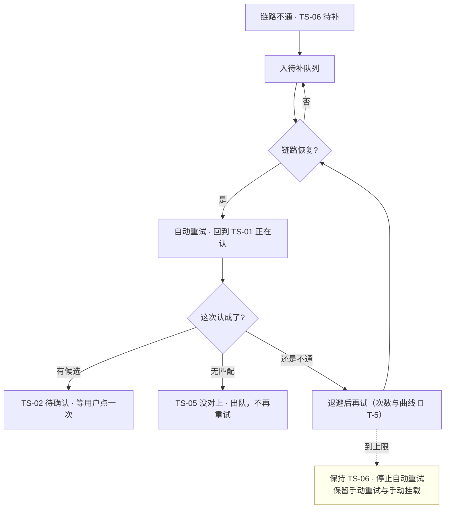

# U2.5 · 待补队列与重试

> **基线**：`origin/v1` @ `73041df`，fetch 于 2026-09-02。
> **状态：活跃。** 进队条件增删、重试从自动改为手动（或反过来）、队列从「只有条数可见」变成可查看，本文同一次改动内更新。
> **上一层**：[M2 · 打标与未分类](INDEX.md)

---

## 一、这个子能力是什么、不是什么

**是**：一条因为**链路不通**而没认成的记录，怎么在**用户不参与**的情况下自己回到管线上。

**不是**：

| 不是 | 在哪 |
|---|---|
| 重试次数与退避曲线的具体值 | 🚧 未定（真源位置：`后端系统设计与组件接入` §1.3），见 §五 |
| 「待补」与「没对上」为什么是两句话 | 域索引 §四 指的那一个单元 |
| 状态码之间怎么转 | 域索引 §五 的域级状态机 |
| 离线时**用户的表态**怎么补传 | 本文 §2.6 只写它与本队列的区别；细则在 `打标与未分类` §9.3 |

**这一单元的设计目标很反直觉：做得越好，用户越不知道它存在。**

---

## 二、详细产品逻辑

### 2.1 队列存在的前提：记录早就落地了

**队列里排的是「还没打上标」，不是「还没记下来」。** 记录在进队之前就已经写好了（`I-1`）。
这句话是整个单元的地基：如果记录本身也可能没落地，那么队列就变成了「可能丢数据的缓冲区」，
用户就必须能看见它、能管它 —— 而下面那条「用户不需要知道它存在」立刻不成立。

### 2.2 什么进队，什么不进队

| 情况 | 进队 | 为什么 |
|---|---|---|
| 服务不可用 / 超时 / 服务端错误 | ✅ | 链路问题，等它自己好 |
| 离线时记的、批量补录的（还没触发过） | ✅ | 联网就能触发，用户不必手动点 |
| **额度不足** | ❌ | 额度是**用户侧状态**，不是链路故障。补上额度前重试多少次都一样，补上之后由用户自己决定要不要认这条 |
| **无匹配（认过了，确实对不上）** | ❌ | 认过了就是认过了。自动重认会变成「摇到满意为止」 |
| **骨架该科目未建好** | ❌ | 没有「集」可闭，骨架建好之前重试的结果完全相同 |

🔴 **只有「压根没看成」才进队。** 这是「模型说不匹配」与「模型没看成」那条分界在队列上的落点：
两者一个能靠等待解决、一个不能，所以一个进队、一个不进。

### 2.3 重试：自动、退避、不打扰

| 规则 | 说明 |
|---|---|
| 触发方式 | **系统自动**，恢复后自己跑 —— 用户不需要点任何按钮 |
| 次数与退避 | 🚧 未定（`T-5`）。**界面按「会自己再试」表述，不受具体值影响** |
| 界面暴露多少 | **不显示第几次重试、不显示下次重试时间、不暴露退避曲线** —— 暴露了用户会盯着它等 |
| 到上限之后 | 状态保持待补，**停止自动重试**，但手动重试与手动挂载两个出口都留着 |
| 手动重试 | 复用触发端点，**不新增重试端点** —— 后端看不出来这次是首次还是重试 |
| 重试成功之后 | 回到正常管线，该无匹配就无匹配 —— **重试不保证认上，只保证认过一次** |

### 2.4 🔴 用户不需要知道它存在

| 做法 | 为什么 |
|---|---|
| **只有条数可见**，没有「查看队列」入口 | 那是一个**用户帮不上忙的界面**：他既不能改重试顺序，也不能加速它 |
| 条数只给量级，超出后折叠显示 | 精确到个位会让它变成一个要清零的数字 |
| **不弹浮层、不推送、不做未读计数** | 重试是系统行为不是用户决定；浮层只用于「必须选一次」的场合 |
| 不做进度条 | 进度条会把「处理完」变成一个要清零的目标 —— 与挂载屏不设常驻入口同一条理由 |
| 队列里的记录照常可见、可挑 | 用户想自己挂一个，随时可以 —— 他不必等队列 |

**判据**：一个用户全程不知道待补队列存在，也应该能正常用完这个产品。
如果某个设计要求用户理解队列才能继续，那个设计就是错的。

### 2.5 重试不改变覆盖度，所以它能批量

| 动作 | 能批量吗 | 理由 |
|---|---|---|
| 批量重试待补 | ✅ | **重试不产生标签，只是再问一次** —— 它不改变任何覆盖度 |
| 自动前进到下一条 | ✅ | 减少的是操作成本，不是判断成本 |
| 批量丢弃 | ⚠️ 不做，但不是红线 | 丢弃在数据上安全；不做是因为它会诱导「先全丢再说」，而丢弃后找回要一条条来 |
| **批量确认 / 一键全部确认** | 🔴 **永不做** | 它让覆盖度上升的成本降到一次点击，而「未确认不计覆盖度」（`I-2`）存在的意义就是**要求每个计入的标签都被人看过一次** |

⚠️ **界面上连禁用态的「全部确认」都不画。** 不是禁用，是不画 —— 与「新建标签」同一处理。

批量重试途中额度用完时：**已成功的不回滚**，剩余的转待补并给出额度受限的说明，
**记录全都还在**（`I-1`、`I-4`）。

### 2.6 两种队列，别混

| | **待补队列**（本单元） | **补传队列**（离线时的表态） |
|---|---|---|
| 里面排的是 | 系统欠用户的：**还没认** | 用户欠服务端的：**表态还没传上去** |
| 谁触发出队 | 链路恢复，系统自己重试 | 联网，按入队顺序逐条重放 |
| 顺序要求 | 无严格要求 | **严格先进先出** —— 同一条记录上的确认、丢弃、恢复必须按用户操作顺序重放，否则最终态是错的 |
| 去重 | —— | 每项带幂等标识；同一标签的**相邻**操作本地合并，只留最后一个 |
| 失败怎么办 | 退避后再试，到上限停 | 网络又断就留在队列里，**不提示、不需要用户点任何按钮**；被服务端拒则出队、退回待确认并就地说明，**不静默丢弃** |
| 对覆盖度的影响 | **无** | 补传成功那一刻才计 |
| 共同点 | **都不弹浮层，都只有条数可见，都不给「查看队列」入口** | 同左 |

### 2.7 队列满了怎么办

🚧 **队列长度上限未定（`T-4`）**，因此「满了」的触发条件也未定。已经定下来的只有降级方向：

- **新的不再入队时，记录照样落地** —— 队列满不许波及记录（`I-1`）；
- 界面上要说清「攒了多少条、它们会自己一条条再试、记录都在」，**不要求用户做任何事**；
- 用户想自己挂几条随时可以，但这是**出路，不是要求**。

具体的降级行为（丢最老的、拒最新的、还是暂停自动重试）**在 `T-4` 定下来之前不裁定**。

---

## 三、前端行为意图 × 后端契约意图

| 关口 | 前端行为意图 | 后端契约意图 |
|---|---|---|
| 进队 | 只有「压根没看成」进队；额度不足、无匹配、骨架未建好都不进 | 用两种返回形态把「不可用」与「无匹配」分开，前端才判得出该不该进队 |
| 自动重试 | 系统自己跑，界面按「会自己再试」表述 | 恢复后自动重试；次数与退避 🚧（`T-5`） |
| 手动重试 | 复用同一个触发端点 | **不新增重试端点** —— 与首次触发同一条路径 |
| 额度受限 | 主动作是手动挂载，购买是次动作 | 不扣额度、不入自动重试队列（`I-4`） |
| 队列可见性 | 只有条数可见；不提供查看入口、不弹浮层、不推送 | 不需要提供「队列内容」查询接口 |
| 补传 | 严格先进先出重放；相邻同标签操作本地合并 | 按幂等标识去重；被拒时给明确拒绝，不静默成功 |
| 补传冲突 | 结果**汇总成一条提示**，不逐条弹 | 后写胜出，不做合并 |
| 队列满 | 记录照样落地；提示只陈述事实，不要求用户处理 | 降级行为 🚧（`T-4`） |
| 批量 | 可以批量重试，**不提供任何批量确认路径** | 不提供一次调用确认多个标签的形态 |

---

## 四、边界与红线在这里的具体形态

| 红线 | 在本单元的形态 |
|---|---|
| **记录永不失败**（`I-1`） | 队列的全部前提是记录已经落地；队列满、重试到上限、补传被拒，记录都完好 |
| **未确认不计覆盖度**（`I-2`） | 重试不产生标签，所以它可以自动；确认会产生覆盖度，所以它永远不能批量 |
| **额度只碰外部模型调用**（`I-4`） | 额度不足不进自动重试队列；额度受限不阻断记录、不阻断手动挂载 |
| **没有第四种反馈形态** | 队列不产生未读计数、不推送、不做待办清零；只有条数可见 |
| **不判断对错** | 重试只是「再问一次」，它不评价这条记录，也不评价上一次的结果 |

---

## 五、缺口登记

| 缺口 | 缺的是哪一半 | 该谁定 |
|---|---|---|
| `T-5` **自动重试次数** | 真源只写了「恢复后自动重试」，**没给次数**。它决定「什么时候停止自动重试」 | 技术，在 `后端系统设计与组件接入` §1.3 补值 |
| `T-5` **重试退避曲线** | 同上，也没给间隔。界面文案已按「会自己再试」写好，不受它影响 | 同上 |
| `T-4` **待补队列长度上限** | 队列无上限时，长期离线攒下的量会不会把补传拖垮，**没实测过**。它同时挡住「队列满」的触发条件与降级行为 | 技术定值，产品定「满了之后用户看到什么」 |

⚠️ **这三项在定下来之前，本层不代填任何数字。** 界面已经按「不显示次数、不显示下次时间、不暴露退避曲线」
写死，正是为了让这三个值定下来时**不需要改任何一句用户看得到的话**。
