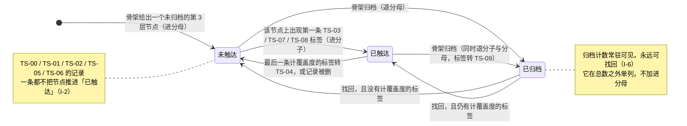

# M3 盲区与覆盖度

> **基线**：`origin/v1` @ `73041df`，fetch 于 2026-09-02。
> **状态：活跃。** 三条计算规则任一变化、断言形态变化、`blindspot_opened` 的口径变化、`S-ASK` 的四个入口增删，本文同一次改动内更新。
> **上一层**：[模块地图](../INDEX.md)

---

## 一、这一域在减法的哪一端

**就是减法本身。**

被减数由骨架侧维护（用户看不见它的过程，真源在 `数据线 · 骨架原料的获取与隔离`）；
减数由 M1 收、M2 成形；**这一域做那一次减，并且是差值第一次变成用户能看见的东西的地方。**

它不产生任何新信息。它唯一的职责是**让那次减是诚实的** ——
任何让覆盖度显得高一点的呈现选择（把未分类并进碰过、把归档藏起来、把断言并进碰过），
在这里都是一次对唯一产出的造假（`看盲区` §1.2）。

🌟 **北极星落点在这一域。** 「主动查看盲区的人数」这个数的全部输入，是这一域打出的一个事件。
这也意味着：**这一域每一处能微调的地方，恰好都是能让北极星变好看的地方** —— 它需要被写死的理由就在这里。

---

## 二、它服务于主流程的哪一步

**`J5` 看见盲区**（`用户价值与主流程` §二）。一个节点，不多不少。

- 上游是 `J3` `J4`：没走完 `J4` 的记录不进这一域的减数（`I-2`）。这条不是这一域可以放宽的。
- 下游是 `J6`：用户在这一域看到差值之后的第一个动作是把它带走。**这一域不承担带走这件事**，
  它只保证被带走的那份清单是准的。
- `J5` 自己不产生记录、不产生标签、不改任何一条已有数据 —— 除了断言（见 `U3.6`），
  而断言按定义不改那三个数。

---

## 三、它服务于哪一个关卡

**阶段 1 的验收：「差集结果符合你的自我认知，误判可接受」**（`实施路径` §阶段1）。

关卡由人判定，**pass / fail，不是可调目标**。数据卡在临界线上时不要回来微调这一域的呈现再试一轮。

北极星在这一域，但**北极星不是关卡**。两者的关系只有一句：
**一份不准的清单被点开，比没被点开更糟**（`看盲区` §十五）。
所以「三个数守恒」（`U3.1`）与「数字口径」（`U3.4`）是那个数可信的前提 ——
它们不成立时，`blindspot_opened` 数出来的只是有多少人看了一份错的清单。

阶段 0 的两个每日数字不在这一域（那在 M1）。

---

## 四、能力单元清单与下钻

| 单元 | 管什么 | 它在这一域的位置 |
|---|---|---|
| [`U3.1` 覆盖度口径](U3.1-覆盖度口径.md) | 分子分母怎么算、三条计算规则、两个平面、三个数守恒 | **减法的定义**。下面五个单元全部建立在它上面 |
| [`U3.2` 盲区总览](U3.2-盲区总览.md) | 🌟 北极星落点。屏的状态全集、三种空态、重算态、埋点口径 | 差值第一次上屏 |
| [`U3.3` 先补这几个](U3.3-先补这几个.md) | Top N 的构成：排序口径、稳定性、筛选、排除已断言 | 差值的**短清单**形态 |
| [`U3.4` 考点详情](U3.4-考点详情.md) | 单个考点只答有没有 / 几次 / 多久前；这一屏上没有的东西 | 差值的**单点**形态 |
| [`U3.5` 按章看全部与归档区](U3.5-按章看全部与归档区.md) | 三层树的折叠、搜索、降级；归档区永远可找回 | 差值的**全集**形态 |
| [`U3.6` 断言](U3.6-断言.md) | 正向断言的完整链路；反向断言的缺席 | 用户对差值的**唯一一次写** |
| [`U3.7` 问一下](U3.7-问一下.md) | `S-ASK` 这一屏：四个带上下文的入口、开屏三条建议问法、回答里的考点可点、额度按会话扣 | 差值的**下一步**形态。🔴 **不是一个通用聊天框** —— 看完清单到下一步之间，产品原来是断的 |
| [`U3.8` 我要考的那一场](U3.8-我要考的那一场.md) | 备考档案两个字段：考哪一场、什么时候考；首启收一次、`S-SET` 可改 | 让差值**贴住用户那一场考试**。⚠️ 今天只服务 `U3.7` 的上下文，**不改排序** |

**这一域内部共享、六个单元都不再各自复述的四条：**

| 共享项 | 内容 | 真源 |
|---|---|---|
| 三个数由服务端给 | 总数 / 碰过 / 没碰过，**前端不做任何一次减法** | `看盲区` §2.2 |
| 两个平面 | 考点平面（个）与记录平面（条）不许跨平面相加 | `看盲区` §2.7.1，展开在 `U3.1` |
| 状态名 | 记录侧状态一律取自 `模块地图` §四；屏幕侧状态真源是 `看盲区` §2.5 与 §3.3 | `模块地图` §四 |
| 不变量 | `I-2` 未分类不进行为层 · `I-4` 额度不锁盲区 · `I-6` 归档同时退分子与分母且永远可找回 | `模块地图` §五 |

---

## 五、域级状态机

**这一域的状态机不是屏幕的状态机，是「一个考点节点在覆盖度里的位置」。**
节点侧三态的真源是 `看盲区` §4.3；转移条件上的状态名全部取自 `模块地图` §4.3，不另起一套。

**屏幕的十三态（`看盲区` §2.5）与详情屏的九态（§3.3）不在这张图里** ——
它们是呈现层的状态，不是记录状态。哪个单元用到就在哪个单元指真源，不在这一层转录。

**这张图里没有「掌握」这一档。** 断言不是节点的第四种状态，它是「未触达」的一个子集标记（`U3.6`）。

---

## 六、前端行为意图 × 后端契约意图

**成对，不留空格。标 🚧 的两行是产品意图、契约未定，它们是缺口不是空白。**

| 能力 | 前端行为意图 | 后端契约意图 | 端点 / 真源 |
|---|---|---|---|
| 覆盖概览 | 三个数同屏、折叠线以上同时看得见「碰过」与「没碰过」；一次减法都不自算 | 三个数**都由服务端返回**；能区分「重算中」与「已是最新」两档；归档计数独立返回、不受重算影响；带统计截止标识 | `GET /coverage/summary`，`技术架构与接口契约` §6.4 |
| 盲区 Top N | 排序口径写在屏幕上且可切；不分页；超出走树 | `orderBy` 默认值服务端给；未知 `orderBy` 可被区分而不是静默按默认返回；排序在服务端满足三级稳定链；统计字段缺失能被区分成「空」而不是「0」 | `GET /coverage/blindspots`，同上 |
| 骨架树 | 三层折叠、不做手风琴、三态靠文字可分；归档区单列在树底 | 单模块整棵树一次返回；每个非叶子节点的两个计数由服务端算；**归档节点单独一组返回**，不混在正常层级里 | `GET /syllabus/tree`，同上 |
| 考点详情 | 骨架事实与我的事实分区呈现，永不混排 | 🔴 **没有讲解字段**；两组事实分成两组返回；「节点不存在」与「节点已归档」区分到两档；来源集合只返回名称 | `GET /syllabus/nodes/{id}`，同上 |
| 正向断言 | 乐观更新、失败回滚、可取消；断言不改概览的三个数 | body 只接受节点标识；「已归档不能断言」可被区分；响应要让前端知道**要不要重取概览** | `POST` / `DELETE /assertions`，同上 |
| **反向断言** | 「我卡住了」的行为意图已登记 | **空 —— 契约不存在** | 缺口 `B-1`，见 §七 |
| 覆盖度下降的成因 | 下降时要能看出是「被减数变大」还是「减数变小」 | **空 —— 没有任何接口返回这个区分** | 缺口 `B-7` |
| 科目列表 | 单科目时整区不渲染；部分科目失败时其余照常可用 | 🚧 返回可见科目及其骨架是否已建好；**逐科目区分成功与失败**，不是整体失败 | 🚧 `GET /subjects` 待技术定稿 |
| 未分类计数 | 独立一行、独立入口、与考点平面之间有分隔 | 🚧 它是**记录平面**的数，不许混进覆盖概览的三个数；「为 0」与「没查到」要能区分 | 🚧 待技术定稿 |
| 北极星埋点 | 首屏内容真正上屏之后才打，按身份 + 本地自然日去重 | 事件上报失败入本地队列、联网补传，**按原始本地日期去重** | `看盲区` §十三，展开在 `U3.2` |

---

## 七、这一域碰到的边界 + 缺口登记

### 7.1 七条红线在这一域的形态

| 红线 | 在这一域是什么 |
|---|---|
| **永不判断对错** | 覆盖度不是成绩。正确率在这一域**算不出来** —— 产品从没记过对错，这不是没做，是没有原料。屏幕上每个字都要能拆成「有没有 / 几次 / 多久前」（`看盲区` §1.1） |
| **不做学科教研** | 不提供任何需要权重或学科判断的排序口径；详情屏没有讲解、解析、例题、相关课程 |
| **不存题干与机构内容** | 这一域两屏没有可输入区；树内搜索只搜名称、搜索词不进 URL；来源只显示名称且不可点 |
| **不生成标签文本** | 树内搜索无结果时**不提供「新建」**（`I-3`） |
| **匹配不上就丢弃** | 未分类不计分子，**即使这让覆盖度显得低**。丢弃率高是设计，把它藏起来才是失真 |
| **原图不上云** | 这一域不碰原图，也不为来源建页面 |
| **没有第四种反馈形态** | 这两屏没有小红点、未读计数、推送。所以 `blindspot_opened` 的入口里**不存在「从通知点进来」** |

### 7.2 缺口登记 —— 只登记，不裁定

| # | 缺的是哪一半 | 该谁定 | 不定它挡住什么 |
|---|---|---|---|
| `B-1` | **反向断言「我卡住了」**：前端行为意图有，**后端契约那一半是空的** | 契约由技术同事定，产品不补 | 「碰过但没通过」在差集里完全不可见。**这是定义的盲点，不是功能待办** —— 展开在 `U3.6` |
| `B-2` | **多科目的概览口径**：分科目还是合并，没定 | 产品 + 技术 | 摘要那句话的**恒等式不一样**，两种写法都写不出来 |
| `B-3` 🔴 | **整棵树一次返回的上限，没有实测数** | 技术侧实测 | `看盲区` §十 的「树展开」「虚拟滚动阈值」两格只能给区间，给不出判据 |
| `B-4` | **「近 N 年」这个窗口谁定的**：它来自骨架数据本身 | 骨架侧 | 文案模板里的年数要不要做成变量。现按变量写 |
| `B-5` 🔴 | **覆盖层重算的时长上限，没有实测数** | 技术侧实测 | 轮询多久转错误态写不出来。`看盲区` §十 只能给一个**标明是占位值**的实现 |
| `B-6` | **骨架统计字段的更新周期** | 骨架侧 | 「统计过期」的判定现在只能用一条自定规则，**它没有真源** |
| `B-7` | **覆盖度下降的成因不可解释**：分母变大与分子变小在界面上长得一样 | 产品 + 技术 | 用户看到数字掉了会一律读成退步，而这一域现在**没有任何一句话能解释它** |
| `B-8` | **节点被删除（不是归档）时，挂在它上面的记录在覆盖度里算什么** | 打标侧 + 这一域 | 现在只能写到「记录仍在时间线」，写不出它计不计分子 |
| `B-10` 🔴 | **`blindspot_opened` 的去重放在客户端还是服务端** | 技术侧 | **这是北极星剩下的唯一漏点。** 不定它，那个数只有一个大概的量级，而关卡要的是能 pass / fail 的数 |
| `B-11` | **骨架会不会超过三层**：「三层」是硬上限还是现状，没说 | 骨架侧 | 超深层级的降级要么多余、要么不够 |
| `B-12` 🔴 | **离线缓存的最长可用期** | 技术侧 + 产品 | 「太旧了，不给看」这条线画不出来。显示一份三个月前的覆盖度，和显示一个错的数区别不大 |

**2026-09-03 新增八条（`U3.7` `U3.8` 落盘时开的），按 `模块地图` §1.1 规则 4 一律带域前缀：**

| # | 缺口 | 该谁定 | 展开在 |
|---|---|---|---|
| 🔴 `M3-G1` | 首启多收一屏备考档案，与「登录之后 2 次点击落下第一条记录」这条承诺相撞 | **产品** | `U3.8` §五 |
| `M3-G2` | 「其他考试」这一档是界面推出来的映射，不是契约里的取值 | 触发时再议 | `U3.8` §五 |
| 🔴 `M3-G3` | `S-ASK` 没有逐屏规格；三条建议问法的模板全集住在契约里，而文案真源该在 `specs/` | **产品** | `U3.7` §五 |
| ✅ `M3-G4` | ~~额度计量单位两边不一致~~ **已闭合**：契约 §12.6.2 采纳按会话计 | —— | `U3.7` §五 |
| ✅ `M3-G5` | ~~建议问法契约里没有这一行~~ **已闭合**：契约 §12.3 | —— | `U3.7` §五 |
| ⚠️ `M3-G9` | 回答下方两个常驻动作**今天没有埋点**，测不了（契约 §12.5.1 已裁定不为 N=1 造） | 阶段 1 之后再议 | `U3.7` §五 |
| 🔴 `M3-G6` | 五个 `/agent/**` 端点服务端不校验令牌，会话读删不校验归属 | **已升级给人** | `U3.7` §五 |
| `M3-G7` | 20 轮与 5 次两个数没有数据支撑 | 产品，等 `1.1.4` | `U3.7` §五 |
| `M3-G8` | `S-ASK` 是不是第十四屏，`specs/` 侧十余处「十三屏」没有跟上 | **产品** | `U3.7` §五 |

**三条标 🔴 的（`B-3` `B-5` `B-12`）缺的是同一样东西：实测数。**
`看盲区` §十 的性能预算与 §八 的缓存标注正是靠这三个数才能写实，现在它们只能给区间和占位值。
**本文原样登记，不替它们拍一个数。**

`B-9`（未登录本机模式下北极星重复计数）**已裁定作废** —— 不存在本机模式，未登录打不开这两屏。
同理，`看盲区` §8.3（本机模式下的这两屏）是已作废章节，**这一域不继承它的任何结论**。
两处的编号都保留不删：它们解释了为什么现在的打点身份只剩账号标识一种。
