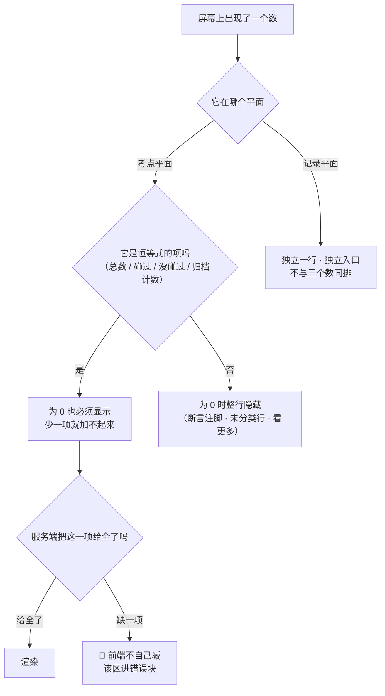

# U3.1 覆盖度口径

> **基线**：`origin/v1` @ `73041df`，fetch 于 2026-09-02。
> **状态：活跃。** 分子或分母的定义变化、三条计算规则任一变化、恒等式的项数变化，本文同一次改动内更新。
> **上一层**：[M3 盲区与覆盖度](INDEX.md)

---

## 一、这个子能力是什么、不是什么

**是什么：** 覆盖度这个数的定义 —— 分母是什么、分子是什么、什么东西进不了它、它什么时候会动。
**这一域其余五个单元全部建立在本单元上**：榜怎么排、单点怎么显示、树怎么汇总、断言怎么不影响它，
都要先有一个不含糊的分子分母。

**不是什么：**

- **不是差集怎么实现**。SQL、派生表、重算任务的形态在 `技术架构与接口契约` §6.4 与
  `后端系统设计与组件接入` §1.4，本文不改一个字，冲突时以被引文档为准。
- **不是骨架怎么维护**。被减数从哪来、谁按归档那一闸，在 `数据线 · 骨架原料的获取与隔离`。
  本单元只用骨架的**口径**（三层树、第 3 层是分母、归档同时退分子与分母），不碰它的采集实现。
- **不是屏幕**。数字摆在哪一区、为空时写什么，由本域索引 §四 划给别的单元；本单元只定义那些数是什么。

---

## 二、详细产品逻辑

### 2.1 分子与分母

| | 定义 | 单位 | 谁给 |
|---|---|---|---|
| **分母（考点总数）** | 该科目**未归档**的**第 3 层**节点数。三层是「模块 → 题型 → 考点」，只数第 3 层 | 个（节点） | 服务端 |
| **分子（碰过）** | 该节点上有 **≥1 条已确认且未丢弃**的标签 | 个（节点） | 服务端 |
| **没碰过** | 分母 − 分子。**由服务端算并返回，不是前端减出来的** | 个（节点） | 服务端 |

「已确认且未丢弃」对应 `模块地图` §4.3 里计覆盖度的三个态：`TS-03`、`TS-07`、`TS-08`。
`TS-04`（已丢弃）与 `TS-09`（挂载失效）不计；**它们仍然可见，只是不计** —— 可见与计数是两件事。

🔴 **三个数一律由服务端给，前端不做任何一次减法。**
前端自算的那一刻，同一个数就有了两个来源，而这两个来源在缓存、分页、筛选之后必然分叉
（`看盲区` §2.2、`B-33`）。这条不是性能取舍，是**唯一产出只许有一个来源**。

### 2.2 三条计算规则

每一条都在挡一种做假，三条的真源都是 `后端系统设计与组件接入` §1.4。

| 规则 | 挡的是什么 | 不变量 |
|---|---|---|
| **未分类不计入分子** | 记了但没对上 ≠ 碰过这个考点。计进去就是**拿记录条数冒充覆盖** | `I-2` |
| **已归档节点同时退分子与分母** | 只退分母会凭空涨，只退分子会凭空跌。同时退，比值才仍然诚实 | `I-6` |
| **归档计数常驻可见** | 归档是**唯一一个不用真学就能让覆盖度上升的操作** —— 把空白全归档，那个数立刻变满 | `I-6`（`R-49`） |

第三条是三条里唯一需要产品动作的一条。它落成三件事，**三件都不做成开关**：
归档计数常驻、导出带完整归档清单、归档区永远可见可找回。

> **为什么不能做成开关：** 一个能关掉的诚实机制等于没有。关掉它的那一刻不会报错，
> 覆盖度会立刻变好看，而且看起来完全合理 —— 这正是它要防的形状。

### 2.3 两个平面，两个恒等式

「碰过 / 没碰过 / 未分类」**不在同一个平面上**，摆成一行三格是错的。

| 平面 | 恒等式 | 单位 |
|---|---|---|
| **考点平面** | `碰过 + 没碰过 = 考点总数` | 个（节点） |
| **记录平面** | `已挂上考点的记录 + 未分类记录 = 我的记录总数` | 条（记录） |

**未分类**指我的记录里没有任何已确认标签的那些（`没对上` / `待确认` / `待补` / `全部被丢弃` 四类，
状态定义在 `打标与未分类` §二）。它不许并进任何一边，理由是三种不同的错：

| 处理方式 | 错在哪 |
|---|---|
| 并进「碰过」 | 拿记录数冒充覆盖。记了 100 条全对不上，覆盖度会显示碰过 100 个考点 |
| 并进「没碰过」 | 把一条不知道属于哪儿的记录算成某个具体考点的盲区。**盲区会凭空多出内容**，而这些内容指不到任何一个节点 |
| 藏起来不显示 | 丢弃率被藏掉，覆盖度看起来比实际可信。**丢弃率高是设计，藏起来才是失真** |

**界面意图**：未分类必须独占一行、有自己的前缀与入口、与考点平面的两个数之间有可见分隔，
且**不与那两个数用同一种字号字重** —— 它要让人一眼看出这是另一个单位。原文在 `看盲区` §2.7.1。

### 2.4 三个数守恒 —— 这一域的主检查

**这一条是防止覆盖度被做假的主检查，专项验收在 `看盲区` §14.1。**
它要求的不是「算对」，而是**屏幕上那几个数在任何一种状态下都还能加起来**。

**守恒在四种情况下都必须成立**，每一种都对应一条已写死的验收：

| 情况 | 三个数怎么变 | 为什么它是个陷阱 |
|---|---|---|
| 有未分类记录 | **一个都不变** | 未分类在另一个平面。让它动三个数，就是把记录条数掺进考点计数 |
| 用户断言了几个「已经会了」 | **一个都不变**，只多一行注脚 | 断言是「没碰过」的子集。把它减出去，覆盖度就能靠打标记做高 |
| 骨架归档了几个节点 | 总数变小，碰过 + 没碰过等于新的总数；归档计数单列，**不加进总数** | 把归档计进总数，归档就成了一次凭空的分母膨胀；藏掉归档，它就成了一次凭空的覆盖上涨 |
| 服务端只返回了两项 | **前端不补第三项**，该区进错误块 | 补一次减法，就是给这个数造了第二个来源 |

**恒等式的项为 0 也要显示，非恒等式的附加行为 0 要整行隐藏。**
这两条不是排版偏好：恒等式少一项，用户会以为产品算错了；附加行显示 0 是噪音。

还有一条容易混掉的区分：**「0」与「空」不是一回事。**
0 是「数过了，是零」；空是「没数过」。混成一个数就是在编数据 ——
所以字段为空时写缺失文案，不写 0；骨架未建好时**一个数都不显示**，连总数 0 都不写。

### 2.5 这个数什么时候会动

| 动作 | 分子 | 分母 | 结果 |
|---|---|---|---|
| 记一笔并打上已确认标签（新节点） | +1 | — | ↑ |
| 记一笔但未分类 | — | — | **不动** |
| 手动挂一条未分类记录 | +1 | — | ↑ |
| 丢弃一个标签（该节点再无计覆盖度的标签） | −1 | — | ↓ |
| 删一条记录（级联删标签） | −1 或 0 | — | ↓ 或不动 |
| 归档一个节点 | −1 或 0 | −1 | **可能任意方向** |
| 骨架新增节点 | — | +1 | ↓ |
| 归档节点被找回 | 恢复 | +1 | 任意方向 |
| 账号合并完成 | 可能 +n | — | ↑ 或不动 |
| 断言 / 取消断言 | — | — | **不动** |

**最后三行是这张表存在的理由**：覆盖度下降经常不是退步，而是被减数变大了。
**产品不解释这件事，用户就会把它读成退步** —— 而现在没有任何接口返回这个区分（缺口 `B-7`）。

上面任何一行发生，都会让服务端进入一次覆盖层重算。重算期间屏幕上一个旧数字都不许出现，
那条规则与它的三种打折写法的真源是 `看盲区` §2.7.5 与 §14.2。

---

## 三、前端行为意图 × 后端契约意图

| 项 | 前端行为意图 | 后端契约意图 | 真源 |
|---|---|---|---|
| 三个数 | 原样渲染，**一次减法都不做**；缺项时该区进错误块而不是补算 | 总数 / 碰过 / 没碰过**三项都返回**；分母 = 未归档的第 3 层节点数，分子 = 未丢弃的已确认触达节点数 | `GET /coverage/summary`，`技术架构与接口契约` §6.4 |
| 归档计数 | 常驻可见、永不禁用、永不隐藏，**为 0 也显示** | **独立返回**，不参与覆盖度重算 | 同上 · `I-6` |
| 断言 | 不从任何一个数里减出去，只加一行注脚 | **单列不并入**概览 | 同上 · `R-100` |
| 未分类计数 | 独立一行、独立入口、不与三个数同排 | 🚧 它是记录平面的数；**「为 0」与「没查到」要能区分** | 🚧 待技术定稿 |
| 重算档位 | 能据此决定是渲染数字还是占位块 | 响应要能区分「重算中」与「已是最新」两档 | `技术架构与接口契约` §6.4 |
| 统计截止 | 据此决定要不要追加「统计还没更新到最近一年」这一层意思 | 响应带统计截止标识 | 同上 |

---

## 四、边界与红线在这里的具体形态

| 边界 | 在本单元是什么形态 |
|---|---|
| 🔴 **永不判断对错** | 覆盖度回答的是「有没有」，不是「会不会」。**正确率在这里算不出来** —— 产品从没记过对错。这不是没做，是没有原料 |
| 🔴 **匹配不上就丢弃** | 未分类不进分子，**即使这让覆盖度显得低**。宁可丢弃率高，不可准确率低：归错会让覆盖度失真，而覆盖度是唯一的产出 |
| **不出现排名与比值** | 不与他人比较、不给分位。用户侧**任何位置都不出现百分比**（`看盲区` §2.9） |
| **额度碰不到这个数** | 覆盖度与盲区**永不上锁**，不因为没付费被删减（`I-4`） |
| **归档三件事不做成开关** | 常驻计数 / 导出带清单 / 归档区可找回，三件都不给开关（`I-6`） |

⚠️ **一处口径差，两边说的不是同一件事，本文两边都不改：**
`后端系统设计与组件接入` §1.4 里有「覆盖率 = 行为层 ÷ 骨架层」这个**内部比值**；
而 `看盲区` §2.9 写死用户侧任何位置都不出现百分比。
两者不冲突 —— 内部算得出一个比值，不等于要把它端给用户。
**用户侧呈现的永远是两个计数，不是一个比值。**

---

## 五、缺口登记

| # | 缺的是哪一半 | 该谁定 | 不定它挡住什么 |
|---|---|---|---|
| `B-2` | **多科目下的概览口径**：分科目算还是合并算，没定 | 产品 + 技术 | 摘要那句话的**恒等式不一样** —— 是「这个科目一共 n 个考点」还是「你一共 n 个考点」，两种写法的守恒对象不同，两种都写不出来 |
| `B-7` | **覆盖度下降的成因不可解释**：分母变大与分子变小在界面上长得一模一样，**没有任何接口返回这个区分** | 产品 + 技术 | §2.5 那张表白写 —— 表上说清了六种不同的成因，屏幕上却只有一个「数字掉了」。用户会一律读成退步 |
| `B-8` | **节点被删除（不是归档）时，挂在它上面的记录在覆盖度里算什么**：打标侧只写了挂载时遇到树更新要重新挑一次，**覆盖度侧没定** | 打标侧 + 这一域 | 那些记录是变成未分类，还是保留一个指不到任何地方的标签 —— 前者分子会掉，后者分子会挂在一个不在分母里的节点上。两种都会让恒等式对不上，而现在没有结论 |
| `B-6` | **骨架统计字段的更新周期** | 骨架侧 | 与本单元相邻：统计什么时候重算、重算之后覆盖度怎么变，没有真源。屏幕侧的落点见 `看盲区` §2.7.4 |

**本单元不替上面任何一条拍一个数，也不给一个「暂行口径」。**
一个看似合理的推断不能关闭一个缺口 —— 尤其在这一域，被推断出来的口径会直接变成一个被端给用户的数。
