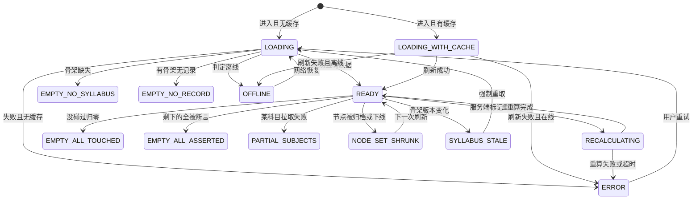
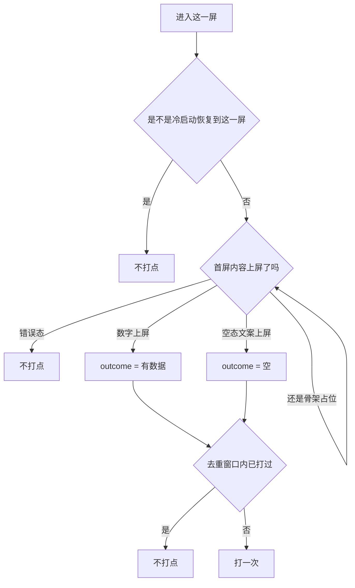

# U3.2 盲区总览

> **基线**：`origin/v1` @ `73041df`，fetch 于 2026-09-02。
> **状态：活跃。** 空态策略变化、重算态呈现规则变化、`blindspot_opened` 的打点时机或去重键变化，本文同一次改动内更新。
> **上一层**：[M3 盲区与覆盖度](INDEX.md)

---

## 一、这个子能力是什么、不是什么

**是什么：** 差值第一次上屏的那一屏。它管三件事 —— **哪些数上屏**、**每一种状态下上屏的是什么**、
**用户到过这里这件事怎么被数一次**。

🌟 **北极星落点在这里。** 「主动查看盲区的人数」的全部输入是这一屏打出的一个事件，
所以这一屏的每一条呈现规则都有第二重身份：它同时是那个数的防伪规则。

**不是什么：**

- **不是那几个数怎么算**。分子分母的定义不在本单元，本单元只管它们在什么状态下允许出现。
- **不是榜怎么排、不是单个考点长什么样、不是树** —— 三者各有自己的单元，清单在本域索引 §四。
- **不是界面稿**。区块划分、原文文案、朗读文本在 `看盲区` §2.1–§2.6。

---

## 二、详细产品逻辑

### 2.1 折叠线以上那条硬要求

**折叠线以上必须同时看得见「碰过多少」和「没碰过多少」。**

只露出其中一个，用户看到的就不是一次减法，而是一个成绩 —— 那正是这个产品不做的东西。
这条约束的连带结果是：摘要区**从不缺席**（骨架缺失时它变成空态，而不是消失），
而榜、出口区可以被滚下去。

同屏的还有两条不进恒等式的行：**归档计数**（`I-6`，永不禁用、永不隐藏，为 0 也显示）
与**未分类行**（记录平面，为 0 时整行隐藏）。两者的排布规则真源是 `看盲区` §2.7.1 与 §2.7.6。

### 2.2 屏幕状态全集

**十三态，真源 `看盲区` §2.5。** 本单元只解释其中四条为什么必须各自成态。



| 态 | 它为什么不能被合并进别的态 |
|---|---|
| `RECALCULATING` | 见 §2.3。**这是这一屏最要紧的一条** |
| `SYLLABUS_STALE` | 缓存里的节点与新骨架对不上。渲染它等于展示一份指不到任何地方的清单，所以刷新前不渲染列表 |
| `PARTIAL_SUBJECTS` | 部分科目失败时整屏报错，会让用户以为全部数据都没了；成功的科目照常可用，失败的单独可重试 |
| `NODE_SET_SHRUNK` | 刷新后节点变少必须**连同归档计数的变化一起可见** —— 只让总数变小而不说归档，就是一次无解释的分母收缩 |

### 2.3 重算态：一个旧数字都不许出现

**`RECALCULATING` 与 `LOADING_WITH_CACHE` 的区别是这一屏最要紧的一条：**

| | 缓存态 | 重算态 |
|---|---|---|
| 那个数是对的吗 | **曾经是对的**，只是旧了 | **已经被用户自己的动作否定了** |
| 数字显示吗 | ✅ 显示，**并标注它有多旧** | ❌ 占位块，**一个数都不显示** |
| 用户能做什么 | 等联网 / 下拉刷新 | 等 |

🔴 **「不显示旧数字」这条不许打折。** 三种常见打折全部违规，专项验收在 `看盲区` §14.2：

| 打折写法 | 为什么它同样违规 |
|---|---|
| 旧值加删除线 | 那个数还在屏幕上，用户读得到它 |
| 旧值调低透明度 | 同上，而且它长得和正确的数一模一样，只是淡一点 |
| 旧值加「可能不准」小字 | 把判断推给用户，而用户没有判断依据 |

**重算中的逐项落法**（真源 `看盲区` §2.7.5）：

| 元素 | 重算中 | 为什么 |
|---|---|---|
| 三个数 | 占位块 | 它们正是被否定的那些 |
| 归档计数 | **照常显示** | 它不参与这次重算（`I-6` 要求常驻） |
| 未分类行 | 照常显示 | 它在记录平面 |
| 榜的骨架统计 | **照常显示** | 骨架字段与我的行为无关 |
| 榜的「我碰过几次」 | 占位 | 它是被重算的那一半 |
| 榜可不可点 | **可点** | 进详情看骨架事实是有意义的 |
| 排序与筛选 | **禁用**，并就地给出禁用理由 | 排序依赖的正是在重算的那些数 |

重算超时或失败一律转错误态，**不回退到旧数字、不显示任何数字**；
列表区的骨架字段不受影响，继续可看可点。轮询上限没有实测数（缺口 `B-5`）。

⚠️ **这是性能预算里唯一一条与正确性冲突的地方：** 不许为了「看起来快」先渲染旧数字再替换。
冲突时正确性赢。

### 2.4 三种空态，它们必须在第一句话里就分开

写成同一句「暂无数据」，用户没办法知道该去记一条、还是等骨架、还是这一屏本来就没东西给他。
**三种空态要说清的是三件不同的事，给的下一步也不同：**

| 情况 | 这一屏必须说清哪件事 | 能显示几个数 | 给什么下一步 |
|---|---|---|---|
| **骨架没建好** | 可减的东西还不存在 —— 缺的是被减数，不是用户的记录 | **一个都不显示**，连总数 0 都不写 | 只给一个通向记录动作的入口。**不给等待提示、不给进度条、不给预计时间** |
| **骨架有，但一条记录都没有** | 减数是空的，所以整张表现在都是没碰过 | 显示总数与「碰过 0」 | 记一条（主）· 先看看有哪些考点（次） |
| **全部碰过** | 减出来的结果确实是空的 —— 这是一个正常结果，不是异常 | 三个数全显示 | 换一个排序口径再看一遍 |

**第一种为什么不给进度条与预计时间：** 骨架什么时候建好取决于骨架侧的工作量，
产品给不出这个数；给了就是承诺一个自己不掌握的时点。
**第一种为什么一个数都不显示：** 骨架没建好时「一共 0 个考点」是假的 ——
真实情况是这个科目的考点表还不存在，而 0 会被读成「这个科目考点为零」。

**第四种情况不是空态：** 没碰过 > 0 但全部被断言 —— 摘要区的数字全都在，空的只有榜。
它的落点在榜与断言两侧，真源 `看盲区` §2.8.4 与 `B-09`。

### 2.5 埋点 `blindspot_opened`：北极星的全部输入

**一个有歧义的定义，做出来的数没法 pass / fail。** 所以这三件事都写死：

#### 什么时候打



🔴 **首屏内容真正上屏之后才打，不是路由进入时打。** 路由进入只说明他点了，不说明他看到了。
缓存先渲染时**缓存上屏那一刻就打** —— 他确实看到了盲区，虽然是旧的。
空态也打，但必须可区分：否则骨架建好之前的北极星会被读成产品已经有人在用。

#### 什么算「主动」

| 入口 | 算不算 | 理由 |
|---|---|---|
| 从首页点进来 | ✅ | 标准的主动 |
| **从外部深链打开这一屏**（书签 / 扫码 / 桌面壳 scheme） | ✅ **而且是最强的主动信号** | 用户绕过了产品的导航，直接来看这一屏 |
| 深链直接进考点详情 | ❌ | 北极星只数这一屏。详情有多个来源，算进来这个数就不再可比。**一个数只能有一个定义** |
| 从详情 / 打标 / 出口 / 树 返回 | ❌ | 同一次查看的一部分 |
| 切科目 / 切排序 / 切筛选 / 下拉刷新 | ❌ | 否则切一下就能刷 |
| **冷启动恢复到这一屏** | 🔴 ❌ | 这不是这一次的主动选择，是上一次的残留 |
| 从通知点进来 | —— | **不存在。** 产品没有通知机制（红线七） |
| 把这一屏设成默认落地页 | —— | 🔴 **这个设置项不存在。** 有了它，改一次默认首页就能让北极星凭空翻倍而产品没有任何改进 —— **这是自欺的最短路径，所以入口不存在** |

最后两行是这张表的重点：**它们不是「暂时没做」，是被写死的负空间。**

#### 怎么去重、北极星怎么算

| 项 | 规则 |
|---|---|
| 去重键 | **（身份，设备本地自然日）** |
| 身份 | **账号标识**。事件只在已登录时产生，**不含任何设备指纹** |
| 科目 / 端 | 都不参与去重 —— 同一账号跨端当一次 |
| 跨零点 | 换了自然日就是第二次 |
| 补传 | 事件入本地队列，联网后补传，**按原始本地日期去重，不按补传时刻** |

```
主动查看盲区的人数（某日） = 该日事件的去重身份数
```

🔴 **四条不许：** 改成打开次数、改成人均打开次数、加分母做成率、把空态混进来不做区分。
前两条能靠一个人反复进出做高；第三条一旦有分母，分母小了这个数就好看；第四条会把「产品还没准备好」
读成「已经有人在用」。

**这个事件带的属性只用于让这一个数可被解释，不用于漏斗、留存曲线、停留时长、点击热图。**
不带科目、排序、筛选、停留时长、滚动深度、点了几个考点 —— 带上任何一个，
它就从「一个人来看了」变成一份行为画像，而产品不做行为分析。

### 2.6 离线与缓存

| 情况 | 这一屏怎么办 |
|---|---|
| 离线 + 有缓存 | 渲染缓存 + **一条常驻细条说清这是多旧的数据**；每个数字旁不再单独标注（细条已经说了，逐个标注是噪音）。**打点照打** |
| 离线 + 无缓存 | 空态，必须说清两件事：这一屏要联网才能看，以及**他记的东西都还在这台设备上**。**不打点** —— 他没看到盲区 |
| 离线中下拉刷新 | 不发请求、不清屏 |
| 恢复联网 | 自动重取一次，不需要用户点任何按钮 |

**缓存标注与重算标注写法必须不同**（§2.3 那张表就是这条的理由）。
缓存多旧才算太旧、旧到什么程度就不该再显示 —— **没定**（缺口 `B-12`）。

⚠️ `看盲区` §8.3（未登录本机模式下的这两屏）是**已作废章节**，本单元不继承它的任何结论：
不存在本机模式，未登录打不开这一屏。已登录之后的离线行为完全不变。

---

## 三、前端行为意图 × 后端契约意图

| 项 | 前端行为意图 | 后端契约意图 | 真源 |
|---|---|---|---|
| 摘要区 | 折叠线以上同时呈现碰过与没碰过；不自算 | 三个数都返回；归档计数独立返回 | `GET /coverage/summary` |
| 重算态 | 数字位换占位块，**屏幕上找不到旧值** | 响应能区分「重算中」与「已是最新」两档 | 同上 |
| 摘要与榜并发 | 两个请求并发，谁先回谁先渲染；只有一个失败时局部出错误块，**不整屏报错** | 两个接口各自独立可用，不互为前置 | `GET /coverage/summary` · `GET /coverage/blindspots` |
| 两边对不上 | 🔴 **以概览为准渲染数字，榜照常渲染**，榜顶说清这是两次查询的差异；**不做任何一边的前端修正** | 两接口各自返回，不互相校正 | `看盲区` `B-33` |
| 空态分档 | 三种空态走三套文案与入口 | 「骨架缺失」要能被区分成一档独立结果，不是空数组 | `技术架构与接口契约` §6.4 |
| 科目 | 单科目整区不渲染；切换失败时停在新科目上，不自动跳回 | 🚧 返回可见科目及骨架是否已建好；**逐科目区分成功与失败** | 🚧 `GET /subjects` 待定稿 |
| 埋点 | 首屏上屏后打、按身份 + 本地自然日去重、**上报不阻塞渲染** | 上报失败入本地队列、联网补传，**按原始本地日期去重** | `看盲区` §十三 |

---

## 四、边界与红线在这里的具体形态

| 边界 | 在本单元是什么形态 |
|---|---|
| 🔴 **永不判断对错** | 这一屏上每一句话都要能拆成「主语 + 谓语 + 数」，谓语只能是有没有 / 几次 / 多久前。拆不出来就不能上屏。**最容易破的一条是：一句合法的陈述后面接半句关心，整句就变成了建议** —— 产品的语气到句号为止，不接下一句 |
| 🔴 **没有第四种反馈形态** | 这一屏没有小红点、未读计数、推送、气泡引导。这条直接决定了埋点入口里**不存在「从通知点进来」** |
| **不出现百分比与进度条** | 任何位置都不出现 |
| **额度永不锁这一屏** | 盲区不因为没付费被删减（`I-4`） |
| **归档常驻** | 归档计数永不禁用、永不隐藏、重算中照常显示（`I-6`） |
| **不做行为分析** | 埋点属性只服务于「这一个数可被解释」，不做漏斗、留存、时长、热图 |

---

## 五、缺口登记

| # | 缺的是哪一半 | 该谁定 | 不定它挡住什么 |
|---|---|---|---|
| `B-10` 🔴 | **去重放客户端还是服务端**：现在写的是客户端按身份 + 本地自然日。放服务端能跨端去重，但要服务端认「本地自然日」这个概念，而用户时区在服务端不可靠 | 技术侧 | **这是北极星剩下的唯一漏点。** 不定它，那个数只有一个大概的量级，而关卡要的是能 pass / fail 的数 |
| `B-5` 🔴 | **覆盖层重算的时长上限没有实测数**：重算时长取决于记录量与骨架规模，两者都还没有真实分布 | 技术侧实测 | 「轮询多久转错误态」写不出来。`看盲区` §十 只能给一个**标明是占位值**的实现，而这个占位值决定了用户多久会看到一屏没有数字的错误态 |
| `B-12` 🔴 | **离线缓存的最长可用期**：缓存超过多久就不该再显示，没定 | 技术侧 + 产品 | §2.6 的标注只能写「这是多久以前的数据」，写不出「太旧了，不给看」这条线。**显示一份三个月前的覆盖度，和显示一个错的数区别不大** |
| `B-2` | **多科目下概览是分科目还是合并** | 产品 + 技术 | 摘要那句话写不出来，两种写法的恒等式不一样 |

`B-9`（本机模式下北极星重复计数）**已裁定作废**，ID 保留不删 ——
它解释了 §2.5 里打点身份为什么只剩账号标识一种。

**本单元不替上面任何一条给暂行数值。** `看盲区` §十 里那个「超过 60s 转错误态」是技术侧的占位实现，
**它在代码里标着是占位值，不是产品定过的口径**，本文不把它转录成结论。
