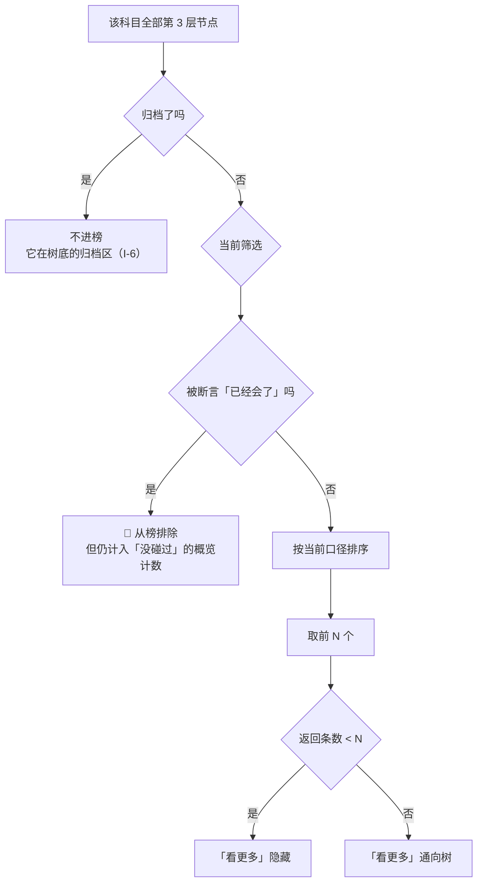
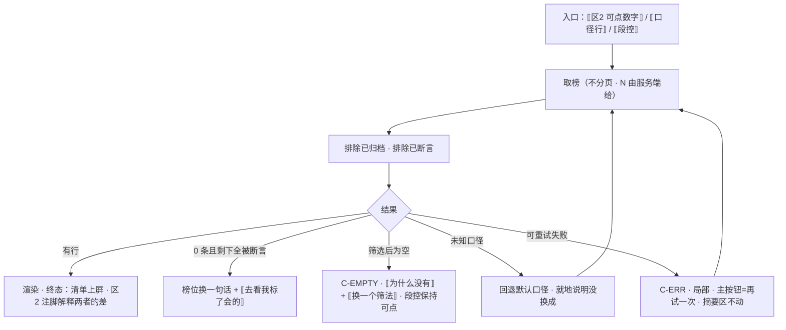

# U3.3 先补这几个

> **基线**：`origin/v1` @ `73041df`，fetch 于 2026-09-02。
> **状态：活跃。** 排序口径增删、默认口径的来源变化、筛选项变化、榜的构成规则变化，本文同一次改动内更新。
> **上一层**：[M3 盲区与覆盖度](INDEX.md)

---

## 一、这个子能力是什么、不是什么

**是什么：** 差值的**短清单**形态 —— 从全部未归档叶子里，按一个说得出计算方式的口径，取前若干个上屏。
它管四件事：**榜里放哪些节点**、**按什么排**、**同值时怎么排**、**筛选怎么切**。

**不是什么：**

- **不是推荐。** 榜的顺序只由客观计数与时间戳决定，产品不参与选谁排前面。
- **不是无限榜。** 它不分页；超出的部分一律走树。
- **不是那几个数怎么算，也不是空态与埋点** —— 两者各有自己的单元，清单在本域索引 §四。

⚠️ **本单元的文件名不是屏幕上的标题。** 屏幕标题在 `看盲区` §2.11 已经逐个候选判过，
判据与结论见本文 §2.6 —— 那一节是红线「不给学习建议」在文案上的落点。

---

## 二、详细产品逻辑

### 2.1 榜里放哪些节点



**「排除已断言节点」与「概览不减断言」是两条各自都对的契约，合起来会打架：**
声明 3 个已会之后，概览仍说没碰过 10 个，而榜里只列得出 7 个（`R-100`）。

🔴 **裁定已经做过：接受两个数各说各话，并在屏幕上解释这一句。**
概览数字下方必须有一行注脚，说清**有多少个节点被标了「已经会了」、因此没有列进下面这份清单**。
**不解释就是产品在自相矛盾** —— 用户会以为其中一个数算错了，而两个都没错。

### 2.2 四个排序口径

**每一个口径都必须是可解释的客观计数或时间戳。一个说不出计算方式的排序，就是产品在做学科判断。**

| 口径 | 定义 | 为什么它是客观的 |
|---|---|---|
| 按近 N 年出现次数 | 骨架统计字段降序 | 它数的是真题里出现过几次，**与用户无关、与模型无关** |
| 按最久没碰 | 我的最近触达时间升序，**没碰过的排在最前** | 时间戳比较，没有权重 |
| 按我碰得最少 | 我的触达次数升序 | 计数比较 |
| 按考点表的顺序 | 骨架树里的自然序 | 完全不排序的排序，原样呈现骨架 |

🚫 **不提供的口径：** 推荐、智能排序、重要度、优先级、按提分效率。
它们要么需要一个产品算不出来的权重，要么需要一次学科判断。**列表里也不出现「推荐」两个字。**

**默认口径由服务端返回，前端不硬编码。** 服务端没返回时才退到本地默认，
**并且这次退让本身要被登记成一次偏离** —— 否则前端默认值会悄悄变成第二个真源。

⚠️ **排序口径必须写在屏幕上，而且可切换。** 一个不说明排序依据的清单会被读成产品在做判断。
展开口径选择时，每个口径下面要给出它的定义 —— 让用户自己看得出它是一次计数还是一次判断。

### 2.3 排序稳定性

**同值时的次级排序是写死的三级链，任何端、任何一次请求都必须给出同一个顺序：**

| 级 | 键 | 方向 |
|---|---|---|
| 1 | 当前口径 | 口径定义的方向 |
| 2 | 节点在骨架树里的自然序 | 升序 |
| 3 | 节点标识 | 字典序升序 |

🔴 **禁止随机、禁止「每次打散」、禁止按最近更新时间兜底。**
理由不是美观：**用户会用「昨天在第 3 位的那个」来定位一个考点**，顺序一变他会以为数据变了。
**可复现是这一屏正确性的一部分**，所以三级链在服务端就要满足，不能靠前端二次排序补。

「按最久没碰」口径下，没碰过的节点没有触达时间，**统一排在最前，并且单独成组**。
两组各有各的标题，**不合成一段连续列表** ——
合起来会让人以为「没碰过」等于「碰过但很久没碰」，而这两件事在这个产品里是两个平面上的事。

统计字段缺失的节点**在出现次数口径下沉到末尾的独立分组，不当作 0 参与排序**。
0 是「数过了，是零」，空是「没数过」（`看盲区` §2.7.6）。

### 2.4 筛选

**单选段控，四选一，不做多选：** 全部 / 没碰过 / 碰过 / 我标了已经会了。

**为什么不做多选：**「碰过 + 没碰过」= 全部，「没碰过 + 已经会了」= 没碰过。
**任何两项的并集要么等于第三项、要么等于全部** —— 多选控件在这里只能生产冗余状态。

**独立于段控的一个开关：** 只看有出现次数记录的。它切掉的是统计字段缺失的那些节点，
**默认关** —— 默认如实呈现全部。

**未分类不是筛选项。** 它在记录平面，入口在摘要区、落点在打标屏。
把它做成第五个段，就等于把它并进了考点平面（`I-2`）。

| 行为 | 规则 | 理由 |
|---|---|---|
| 筛选与排序的关系 | 正交，互不重置 | —— |
| 排序口径 | **按科目记忆在本机** | 它是一次表达偏好的选择 |
| 筛选 | **不记忆** | 它是一次查看动作。记住了，用户下次进来看到一份被筛过的清单却不知道 |
| 筛选后为空 | 空态卡片替换列表，**段控保持可见可点** | 段控消失就出不去了 |
| 切排序失败 | 保留原列表，口径**回退到切换前那一个**，并把回退这件事说出来 | 静默回退会让用户以为换成了 |

筛选后为空有五种组合，每一种要说清的事都不同（`看盲区` §2.8.4）：
碰过为空 = 还没开始记；没碰过为空 = 都碰过至少一次；断言集合为空 = 还没标过；
没碰过全被断言 = 去掉几个标记就能看回来；开了统计开关后为空 = 这个科目还没有出现次数记录。
**五种给的下一步各不相同，写成同一句就等于让用户自己猜。**

### 2.5 榜的长度与它为什么不分页

| 项 | 规则 | 理由 |
|---|---|---|
| N 的取值 | **服务端定，前端不硬编码** | 同一个数只许有一个来源 |
| 分页 | **不分页** | 分页会让这份短清单变成一份无限榜，而它的语义就是「短」 |
| 超出 N 的部分 | 一律走树，并带上当前筛选 | 全集有它自己的形态 |
| 返回条数 < N | 「看更多」隐藏 | 没有更多可看时留着入口是骗人 |
| 返回 0 条但概览说有没碰过的 | 榜位换一句话，说清剩下的全被断言了 | 这不是错误，是断言的正常结果 |

### 2.6 这个标题为什么不叫别的

**这一节是红线「不给学习建议」在文案上的落点。** 候选逐个判过（`看盲区` §2.11）：

| 候选 | 结论 |
|---|---|
| **「先看这些」** | ✅ 采用。它说的是**位置**（这份清单在前面），不是**判断**（这些更重要） |
| 「推荐考点」 | ❌ 推荐是判断 |
| 「重点考点」 | ❌ 学科判断 |
| 「盲区 Top N」 | ❌ 榜单语气，而且把 N 写死在文案里，而 N 由服务端定 |
| 「你还没碰过的」 | ⚠️ 语义对，但筛「碰过」之后这个标题就错了 —— **标题不随筛选变，所以不能用状态做标题** |

**判据只有一条：标题描述的是清单的位置，不是清单里内容的价值。**
一旦标题里出现了价值判断，用户会读成产品在告诉他该学什么 ——
而产品给的是差集，**要不要学、先学哪个，是用户自己的事**。

同一条判据往下推还有两个结果：
排序口径的名字里不许出现「推荐」「智能」「重要度」（§2.2）；
一句合法的陈述后面不接半句关心 —— 「最近一次 30 天前」是事实，后面接上「要不要看看」就成了建议。

---

## 三、前端行为意图 × 后端契约意图

| 项 | 前端行为意图 | 后端契约意图 | 真源 |
|---|---|---|---|
| 取榜 | 不分页；不做二次排序；不硬编码 N | `top` 与 `orderBy` 由参数带；**排序在服务端就满足三级稳定链** | `GET /coverage/blindspots`，`技术架构与接口契约` §6.4 |
| 默认口径 | 服务端没返回时才退本地默认，**并登记为一次偏离** | `orderBy` 的**默认值由服务端给** | 同上 |
| 未知口径 | 忽略并回退默认，同时把「没换成」说出来 | 未知 `orderBy` 要能**被区分出来**，不能静默按默认返回 | 同上，`看盲区` `B-31` |
| 统计缺失 | 沉到末尾独立分组，不当 0 排 | 统计字段缺失要能被区分成「空」而不是「0」 | 同上 |
| 断言 | 榜里排除已断言节点；概览注脚就地解释这个差 | **榜排除已断言，概览单列不并入** —— 两条都保留，不为了对齐改任何一条 | 同上，`R-100` |
| 归档 | 归档节点不出现在榜里 | 归档节点退出分子与分母，单独成组返回 | `I-6` |
| 筛选 | 数据已在内存时本地筛，不发请求 | 需要请求时按筛选返回，摘要区不受影响 | `看盲区` §2.10.4 |

---

## 四、边界与红线在这里的具体形态

| 边界 | 在本单元是什么形态 |
|---|---|
| 🔴 **永不判断对错 / 不给学习建议** | 标题、口径名、空态文案三处都过 §2.6 那条判据。**排序口径可见**本身就是这条红线的执行手段：口径写在屏幕上，用户能自己看出它是一次计数 |
| 🔴 **不做学科教研** | 不提供任何需要权重的口径。相似度、重要度、提分效率都要一次学科判断，**它们不是没做，是不能做** |
| **一行里不许出现第五种信息** | 考点名 · 骨架统计 · 我的状态 · 进入箭头。不许出现百分比、进度条、任何相对他人的位置 |
| **不出现排名语气** | 榜不叫榜，不写名次数字，不做「Top N」这种把 N 写进文案的写法 |
| **归档不进榜但永远找得到** | 榜里没有它，树底的归档区里必须有（`I-6`） |

---

## 五、缺口登记

| # | 缺的是哪一半 | 该谁定 | 不定它挡住什么 |
|---|---|---|---|
| `B-4` | **「近 N 年」这个窗口谁定**：屏幕上写着一个年数，但这个窗口来自骨架数据本身 | 骨架侧 | 文案模板要不要把年数做成变量。现在按变量写；如果窗口永远固定，这就是多余的一层。**两种都有代价，本文不替它选** |
| `B-2` | **多科目下榜是分科目还是合并** | 产品 + 技术 | 榜的取数范围与概览的恒等式绑在一起，概览口径没定，榜的范围也定不了 |

**默认口径退到本地默认时的「偏离登记」是一条约束，不是一个缺口** ——
它要求的是：一旦发生这次退让，就要有地方记下来它发生过。记在哪由技术侧定。

---

## 六、线框

**记号、必答项、红线自查照 `线框与交互规格约定` §三 §四 §五。**
**槽位写的是这一格装什么，不是上屏原文 —— 原文一律去 `看盲区` 对应节拿。**
本单元的落点是 `S-BLIND` 的**区 3**。常态画整屏（区 3 展开，其余给槽位），其余各态**只画区 3**。

### 6.1 常态整屏 · `S-BLIND`

```
┌────────────────────────────────────────┐
│ ⟦区0 状态条⟧             ← C-OFFLINE   │
│ ⟦区1 科目切换器⟧         ← C-PICK      │
├────────────────────────────────────────┤
│ ⟦区2 摘要 → U3.1 §6.1⟧                 │
│  ⟦断言注脚 · {n} 个没列进下面⟧          │ ※1
├╌╌╌╌╌╌╌╌╌ 折叠线 ╌╌╌╌╌╌╌╌╌╌╌╌╌╌╌╌╌╌╌╌╌┤
│ 区3 · 本单元的全部落点                  │
│  ⟦标题 → 看盲区 §2.11⟧                 │ ※2
│  ‹ 按{口径名}排 ▸ ›        ← C-DISC    │ ※3
│  [全部][没碰过][碰过][我标了已经会了]   │ ※4
│                           ← C-PICK 段控│
│  ⟦分组标题 · 仅「按最久没碰」口径下⟧    │ ※5
│  ┌────────────────────────────────┐    │
│  │⟦考点名·两行截断⟧ ⟦近{y}年{n}次⟧│    │ ※6
│  │⟦我的状态·四选一⟧             →│    │
│  └────────────────────────────────┘    │
│  ⟦…共 N 行，不分页…⟧       ← C-LIST    │
│  ⟦统计字段缺失的独立分组，沉在末尾⟧     │ ※7
│  ‹ 看更多 ›     ← 进树，带当前筛选      │ ※8
└────────────────────────────────────────┘
```

※1 概览不减断言、榜排除已断言，**这一行注脚是两者差的就地解释**（`R-100` · §2.1）
※2 标题描述的是清单的**位置**，不是内容的**价值** —— 候选逐个判过（§2.6）
※3 🔴 口径名必须写在屏幕上且可切；展开时每个口径下方给出它的定义（§2.2）
※4 单选段控四选一，不做多选；**筛选不记忆，排序按科目记忆**
※5 「没碰过的」与「碰过的」两组**不合成一段连续列表**（§2.3）
※6 一行只有四格：考点名 · 骨架统计 · 我的状态 · 进入箭头。**不许出现第五种信息**
※7 空 ≠ 0，缺失的不当 0 参与排序（§2.3）
※8 返回条数 < N 时**整个入口不渲染**

🔴 **这一屏上没有：推荐理由、「建议先补因为…」这类句子、名次数字、Top N 字样、百分比、进度条。**
排序按真题频次 —— **排序不是建议**。屏幕上**不出现任何一句解释某一行为什么排在前面**：
口径名本身已经说清了顺序是怎么来的，再加一句理由，那句理由就是判断。

### 6.2 其余各态 · 只画区 3，其余 `⟦同常态⟧`

```
骨架屏 C-SKEL  5 行列表形状占位,不转圈
│ 口径行与段控同时禁用,形状与到手后一致   │

空态① 筛选后为空 C-EMPTY（五种组合五句话）
│ ⟦按现在这个筛法为什么没有⟧              │
│ [ 换一个筛法 ]   段控保持可见可点        │

空态② 没碰过的全被断言 —— 不是空态,只换榜位
│ ⟦去掉几个标记就能看回来⟧                │
│ [ 去看我标了会的 ]                      │

空态③ 骨架没建好 C-EMPTY
│ 🔴 整个区 3 不渲染,排序行/段控/‹看更多›  │
│ 一起消失 —— 没有可排的东西时不留空控件   │

错误态 C-ERR  局部,摘要区不动
│ ⟦哪一步没成⟧      ( 再试一次 )          │
│ 切口径失败:保留原列表 + C-INLINE 页内提示│
│ 口径回退到切换前那一个,并把回退说出来    │

陈旧数据态  ⟦区0 细条说清多旧⟧,列表照常可点
🔵 重算态   ⟦近{y}年{n}次⟧照常 · ⟦我碰过⟧···
│ 排序与筛选禁用,就地写出禁用理由,行仍可点 │
```

---

## 七、交互规格

| # | 必答 | 本单元的答 |
|---|---|---|
| 1 | **入口** | 区 3 随 `S-BLIND` 出现，入口同该屏（首页入口 / `/coverage` 深链 / 桌面壳 scheme，`P-NAV`）。区 3 内部还有三个就地入口：口径行、段控、区 2 的三个可点数字就地筛到这里 |
| 2 | **结束状态** | 榜的终态四个：有行渲染 / 筛选后为空 / 返回 0 条且剩下全被断言 / 区 3 不渲染（骨架缺失）。行内节点侧的状态取自 `模块地图` §4.3：只有 `TS-03` `TS-07` `TS-08` 让「我的状态」显示成碰过 |
| 3 | **失败落点** | **停在 `S-BLIND`，摘要区不动**，只有区 3 出局部错误块 + 局部重试。切口径失败时保留原列表、口径回退到切换前那一个，**并把回退这件事写在提示里**（静默回退会让用户以为换成了） |
| 4 | **空态** | 三张：筛选后为空（五种组合五句话，`看盲区` §2.8.4）· 全被断言（不是空态，只换榜位）· 骨架没建好（整区不渲染）。**成因不同就是不同的稿，不许合并成一句** |
| 5 | **错误态** | 可重试：取榜失败 / 切口径失败 → 一句话 + 重试。不可重试：服务端返回未知口径 → 忽略并回退默认，就地说明。**有缓存时是陈旧数据态**（`C-ERR`）。不涉及登录门与额度，**不出受限态**（`I-4`） |

### 7.1 交互流程



`[契约缺]` **默认口径退到本地默认时的偏离登记**：界面这一侧只要求这次退让**发生过就要留下痕迹**，
落在哪由技术侧定。**本文不写端点，也不指定记录形态。**
