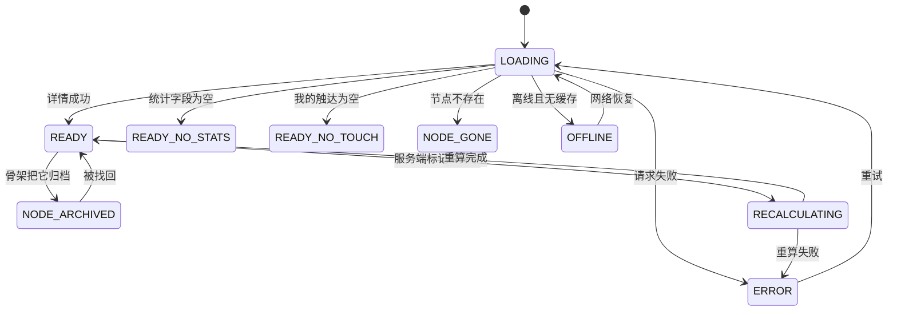

# U3.4 考点详情

> **基线**：`origin/v1` @ `73041df`，fetch 于 2026-09-02。
> **状态：活跃。** 「碰过几次」或「多久前」的计数口径变化、这一屏的动作增删、§2.6 那张「没有什么」的表被动，本文同一次改动内更新。
> **上一层**：[M3 盲区与覆盖度](INDEX.md)

---

## 一、这个子能力是什么、不是什么

**是什么：** 差值的**单点**形态。一个考点被点开之后，产品只回答三件事：
**有没有碰过 · 碰过几次 · 最近一次多久前。** 一格都不能多。

屏幕上的每一个字要么来自骨架的统计字段，要么来自用户自己的行为记录。**没有第三种来源。**

**不是什么：**

- **不是讲解页。** 这一屏没有讲解字段 —— 不是「暂时没有」，是接口里就没有（`R-05`）。
- **不是学习入口。** 它不给计划、不给相似考点、不给资料。为什么，在 §2.6。
- **不是覆盖度的定义**，也**不是断言的完整链路** —— 两者各有自己的单元（本域索引 §四），这一屏只是断言的发起处。

---

## 二、详细产品逻辑

### 2.1 两组事实必须分区，不许混排

这一屏的内容分成两组，**它们之间没有任何可比较的关系**：

| 组 | 内容 | 关于谁 |
|---|---|---|
| **骨架事实** | 近 N 年出现次数 · 最近出现在哪一年 · 统计截至哪一年 | 关于**真题** |
| **我的事实** | 碰过几次 · 最近一次多久前 · 来源集合 | 关于**用户** |

🔴 **分区是硬性的。** 混排成一段话，用户会把两个数放在一起做比较；
一旦让人以为它们可比，下一步就有人问「7 次里我碰了 3 次，那我覆盖了多少」——
**那是一个不存在的比值**，而这个产品任何位置都不出现百分比。

### 2.2 「碰过 {n} 次」怎么计数

| 问题 | 口径 | 理由 |
|---|---|---|
| n 数的是什么 | **命中该考点的记录条数**，去重到记录 | 一条记录不可能对同一考点挂两次（打标侧就地拦住） |
| 同一天记了 3 条都挂到这个考点 | **算 3 次** | 按天折叠就是产品在替用户判断「一天之内的重复不算数」，**那是学科判断** |
| 未确认的标签 | **不算** | 未确认不计覆盖度（`I-2`） |
| 已丢弃的标签 | **不算**，但记录本身仍在时间线上可见 | 可见与计数是两件事 |
| 手动挂载的 | **算** | 手动挂载写的是已确认标签 |
| 记录被删了 | **不算** | 删记录级联删标签并触发重算 |
| 归档节点上的触达 | **不算进任何数** | 归档同时退出分子与分母（`I-6`） |

**n = 0 时不写「碰过 0 次」，写「你没碰过」。**
这两句话在中文里的信息量不一样：前者暗示有一个计数器在跑，后者是一个事实。

超过一个上界之后不再报精确数（`看盲区` §2.9 给了那个上界）——
**一个四位数的触达次数不会让用户多知道任何事，只会让人以为这是个分数。**

### 2.3 「最近一次多久前」的时间口径

| 项 | 口径 |
|---|---|
| 天数怎么算 | **按设备当前时区，取两个日历日之差**，不是 24 小时之差 |
| 今天 / 昨天 | 用「今天」「昨天」，**不写「0 天前」「1 天前」** |
| 一年以上 | 不继续报天数 |
| 用户飞了一个时区 | **用新时区重算**，数字可能变一天。不锁定记录时的时区 —— 用户对「今天」的感知跟着他的所在地走 |
| 设备时钟早于记录时间（差为负） | 显示成「今天」，**不向用户报告任何异常** |

最后一行是有意的：时钟异常是设备的事，不是用户的事。
报告它只会让用户怀疑自己的记录出了问题，而记录并没有问题。

🔴 **不出现「已经 {n} 天没碰了」这种写法。**
「没碰了」带着一个期待值（你本该碰），而**产品没有期待值**。写「最近一次 {n} 天前」，句号。

### 2.4 屏幕状态

**九态，真源 `看盲区` §3.3。** 其中三条是这个产品特有的。

| 态 | 它要说清什么 |
|---|---|
| `READY_NO_STATS` | **这个考点没有出现次数记录** —— 是「没数过」，不是「数过了是零」 |
| `READY_NO_TOUCH` | 我没碰过。相关记录列表也是空的，两处要一致 |
| `RECALCULATING` | **我的事实变占位块，骨架事实照常显示** —— 被否定的只有我这一半 |
| `NODE_ARCHIVED` | 顶部说清它已归档，**内容照常展示**（归档不是删除）；断言与挂载入口禁用 |
| `NODE_GONE` | 节点在当前骨架版本里不存在。整屏空态，并说清挂在旧节点上的记录仍在时间线 |

**「不存在」与「已归档」必须能区分到两档。** 归档是可看、可找回的一种存在；
不存在是这个标识指不到任何地方。合成一档，用户会以为自己的记录被删了。

深链可以直接打开这一屏。**深链进这一屏不打 `blindspot_opened`** ——
北极星只数总览屏，理由见 `看盲区` §13.3。

### 2.5 一处两边都不改的不一致

时间线里看得到挂在这个考点上的记录，覆盖度却说没碰过（重算未完成或失败时会发生）。

🔴 **两边数据都在，不做任何一边的静默修正。**
这一屏要就地说清「有几条记录挂在这里，覆盖度还没算进去」，并给一次刷新的机会。

**静默修正比不一致更糟：** 前端把它改成「碰过」，那个数就有了第二个来源；
把记录藏起来，用户会以为自己记的东西丢了 —— 而这个产品全部的信任都建立在「记了就还在」上。

### 2.6 这一屏上没有的东西，以及为什么

**这一节是本单元最重要的一节。** 这一屏的价值有一半来自它没有的东西 ——
每一条都有人问过为什么不加，每一条的答案都不是「以后再说」。

| 没有 | 为什么它不能加 |
|---|---|
| **「我卡住了」** | 反向断言**没有后端契约**（缺口 `B-1`）。**在它定下来之前，这一屏上不放这个按钮** —— 放了就是一个点下去没有去处的动作 |
| **「加入学习计划」** | **计划是建议的另一个名字。** 产品给差集，不给顺序 |
| **「相似考点」** | 相似度是模型算的。把它上屏就是产品在替用户做**学科关联**，而学科判断一律外包 |
| **「这个考点的题」** | 库里没有能装题干的字段，连预留位都不留。**这个入口不该存在** —— 它一旦存在，就会有人去把那个字段加上 |
| **任何比值** | 骨架事实与我的事实之间没有可比关系（§2.1）。**产品一旦让人以为它们可比，就有人会去算一个不存在的数** |
| **分享这个考点** | 分享出去的是一个考点名加一个出现次数，对别人没有意义；真要带走走出口（`J6`） |
| **讲解 / 解析 / 例题 / 推荐资料 / 相关课程** | 加任何一个都是越过「不做学科教研」这条边界。接口里**没有讲解字段**（`R-05`），这是结构上的拦截，不是约定 |

还有两条同源的小约束：

- **记录摘要只能是用户自己写下的那条记录的前若干字，不做任何改写、不做任何生成。**
  它是用户自己的字，**概括就是产品在读内容**。
- **来源只显示名称，且不可点。** 产品不为来源建页面 —— 建了就要装内容，而产品不存机构内容。
  长按考点名只复制名称，**不复制任何统计数字**。

---

## 三、前端行为意图 × 后端契约意图

| 项 | 前端行为意图 | 后端契约意图 | 真源 |
|---|---|---|---|
| 拉详情 | 骨架事实与我的事实分区渲染，永不混排 | 🔴 **没有讲解字段**；两组事实**分成两组返回** | `GET /syllabus/nodes/{id}`，`技术架构与接口契约` §6.4 |
| 节点状态 | 归档可看、不存在给空态，两者文案与入口都不同 | 「节点不存在」与「节点已归档」**区分到两档** | 同上 |
| 来源集合 | 只显示名称，**不可点** | 只返回名称，**不返回任何课程内容** | 同上 |
| 统计缺失 | 显示缺失文案，不显示 0 | 字段为「空」要能与「0」区分 | 同上 |
| 统计截止 | 落后当前年两年以上时就地追加一层意思，**不弹窗、不拦路、不影响排序** | 响应带统计截止标识 | 同上，判定规则见 §五 `B-6` |
| 重算中 | 我的事实变占位，骨架事实照常；**断言开关不禁用**（断言是写，不依赖那个数） | 响应能区分「重算中」 | `GET /coverage/summary` |
| 相关记录 | 点一条进时间线该条详情；摘要不改写 | 返回挂在该节点上的记录时间与原文摘要 | `技术架构与接口契约` §6.4 |
| 底部三个动作 | **通向记录动作的那个入口永不禁用**（记录动作永不失败，`I-1`）；其余按节点状态禁用并就地给理由 | 无 | `I-1` |

---

## 四、边界与红线在这里的具体形态

| 边界 | 在本单元是什么形态 |
|---|---|
| 🔴 **永不判断对错** | 这一屏只有三件事的答案。**没有掌握度、没有正确率、没有「你不会」** —— 它们在这里算不出来，因为产品从没记过对错 |
| 🔴 **不做学科教研** | §2.6 那张表的前六行全部是这条边界的落点。**每一行都是一个被主动拒绝的入口，不是一个待办** |
| 🔴 **不存题干与机构内容** | 这一屏没有可输入区；记录摘要是用户原文且产品不改写；来源不可点，产品不为它建页面 |
| **产品的语气到句号为止** | 「最近一次 30 天前」是事实；后面接「要不要看看」就成了建议。**不接下一句** |
| **归档不是删除** | 归档节点的内容照常展示，只是不能再断言、不能再挂载 |
| **额度碰不到这一屏** | 看一个考点不计额度（`I-4`）。带去问 AI 的免费路径也永不移除（那在 M4） |

---

## 五、缺口登记

| # | 缺的是哪一半 | 该谁定 | 不定它挡住什么 |
|---|---|---|---|
| `B-6` | **骨架统计字段的更新周期**：统计什么时候重算、重算之后覆盖度怎么变，没定 | 骨架侧 | 「统计过期」现在只能用一条自定规则（落后当前年两年以上就追加一句），**这条规则没有真源** —— 它是本单元自己划的一条线，随时可能与骨架侧的真实周期对不上 |
| `B-4` | **「近 N 年」这个窗口谁定** | 骨架侧 | 屏幕上的年数按响应变，但窗口本身的归属没定 |
| `B-1` | **反向断言无契约** | 契约由技术同事定 | §2.6 第一行的直接原因：这一屏上少一个动作。完整登记形态见本域索引 §七 |
| `B-8` | **节点被删除（不是归档）时，挂在它上面的记录去哪** | 打标侧 + 这一域 | `NODE_GONE` 的空态现在只能说到「记录仍在时间线」，说不出它在覆盖度里还算不算 |

**本单元不替 `B-6` 那条自定规则找一个真源，也不把它升格成结论。**
它现在的身份就是「一条没有真源的自定规则」，这件事本身要写在这里，而不是被抹平。
