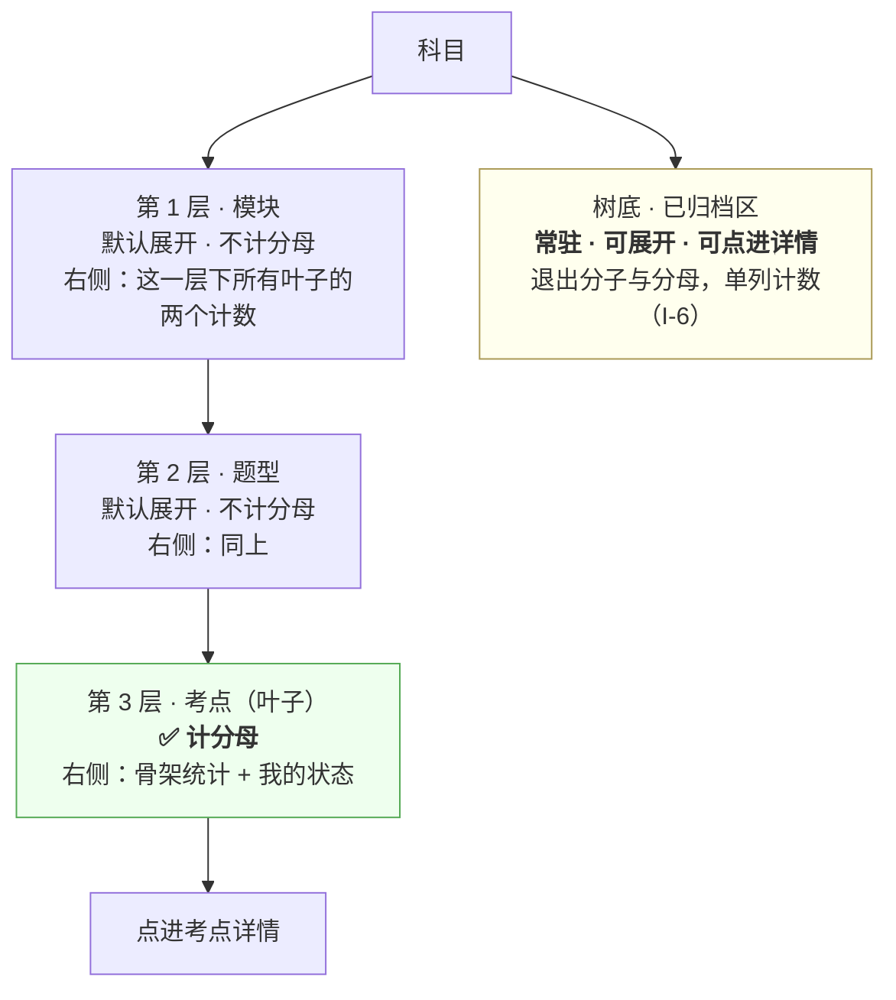

# U3.5 按章看全部与归档区

> **基线**：`origin/v1` @ `73041df`，fetch 于 2026-09-02。
> **状态：活跃。** 树的层级数变化、折叠规则变化、归档区的可达性变化、树内搜索的范围变化，本文同一次改动内更新。
> **上一层**：[M3 盲区与覆盖度](INDEX.md)

---

## 一、这个子能力是什么、不是什么

**是什么：** 差值的**全集**形态。短清单只给前若干个，
树给的是这个科目的全部考点，按骨架自己的层级摆着，**外加一个永远找得回来的归档区**。

它是这一域里唯一一处「用户能看到被减数的原样结构」的地方。

**不是什么：**

- **不是骨架怎么维护。** 谁按归档那一闸、节点怎么增删、统计怎么来，全部在 `数据线 · 骨架原料的获取与隔离`。
  **本单元只写用户侧看得到的那一半**，一个采集环节都不写。
- **不是搜索引擎。** 树内搜索只搜名称，理由在 §2.5。
- **不是另一个榜。** 树不排序、不取前 N，它原样呈现骨架的自然序。

---

## 二、详细产品逻辑

### 2.1 三层，只有第 3 层计分母

**非叶子节点右侧只有两个计数，没有百分比、没有进度条。**

⚠️ **不做进度条的理由不是审美：** 进度条会把「覆盖度」读成「学习进度」，
而覆盖度只回答碰过没碰过，**它不衡量掌握**。一根走到 80% 的进度条，会让人以为自己学会了八成。

分母只数第 3 层这条口径来自骨架侧，**前端在任何情况下都不自己汇总分母** ——
非叶子节点的两个计数也由服务端算（`看盲区` §2.2 那条「前端不做任何一次减法」在树上的同一形态）。

### 2.2 折叠规则

| 规则 | 说明 | 理由 |
|---|---|---|
| 默认展开 | 展开到第 2 层 | 第 3 层是叶子，全展开会让首屏变成一份没有结构的长列表 |
| 折叠一层 | 只折叠自己，**不影响兄弟节点** | —— |
| 展开一层 | **不自动折叠别的，不做手风琴** | 用户会需要**同时对比两个题型** |
| 全部折叠 / 全部展开 | 树顶一个二态按钮 | 大树里唯一能一次回到全貌的动作 |
| 记忆 | 展开态**按科目**记在本机，换科目各记各的 | 两个科目的树形状不同，共用一份展开态没有意义 |
| 从详情返回 | 恢复展开态，并**把那个叶子滚进视野**，加一次短暂高亮 | 用户是从这里点出去的，回来找不到出发点就等于重新开始 |

### 2.3 三态可分，靠文字不靠颜色

| 态 | 树里怎么表示 |
|---|---|
| 已触达 | 文字说清碰过几次 + 实心标记 |
| 未触达 | 文字说清没碰过 + 空心标记 |
| 已归档 | **不混在正常树里**，单列在树底的归档区 |

🔴 **三态必须有文字，形状与颜色都只是辅助。**
颜色不作为唯一信息载体，这条在深浅两种模式下都成立 —— 两种模式下文字不变。

### 2.4 归档区：永远可找回

**归档是唯一一个不用真学就能让覆盖度上升的操作**（`后端系统设计与组件接入` §1.4）。
它在用户侧的对冲落成三件事，`I-6` 要求**三件都不做成开关**：

| 落点 | 具体形态 |
|---|---|
| 归档计数常驻 | 在总览的摘要区，**永不禁用、永不隐藏、为 0 也显示、重算中照常显示** |
| 归档区常驻 | 在树底单列一区，**可展开、可点进详情** |
| 导出带清单 | 导出文件里带完整归档清单（落点在 M4） |

🔴 **归档区不做成开关，也不做成「高级设置里的显示归档」。**
一个能关掉的诚实机制等于没有 —— 关掉它的那一刻不会报错，覆盖度会立刻变好看，而且看起来完全合理。

**归档不是删除。** 归档节点上原来挂的记录仍然在，进它的详情能看到；节点被找回之后，
下一次刷新它就重新出现在树与榜里，并重新计入分子与分母。

### 2.5 树内搜索

| 规则 | 说明 |
|---|---|
| 搜什么 | **只搜考点名与章节名** |
| 不搜什么 | 记录正文、来源名、任何用户输入的原文 |
| 搜索词进不进 URL | 🔴 **不进** |
| 结果形态 | 命中项所在路径自动展开，命中段落高亮 |
| 无结果 | 说清没有这个名字的考点 + 一次清空。**不提供「新建」** |
| 搜索时的筛选 | 沿用进入树时带过来的那个 |

**两条红线各占一行：**

- **搜索词不进 URL** —— 用户完全可能往搜索框里粘一整道题。URL 会进历史、进日志、被分享出去；
  一个字段只要能承载题干，早晚会承载题干。这是「不存题干」这条红线在 URL 上的落点。
- **无结果时不给「新建」** —— 打标是闭集的，接口只收节点标识不收标签文本（`I-3`）。
  给一个「新建」入口，就等于在树上开了一个生成标签文本的口子。

### 2.6 超深层级与超大树的降级

| 情况 | 降级 | 不做什么 |
|---|---|---|
| 服务端返回第 4 层及以下 | **第 4 层当叶子渲染，不再往下展开**；**分母仍以概览为准，前端永不自算** | 不新增可展开层级 |
| 单科目叶子数超过阈值 | 逐层虚拟化：只渲染展开路径上的可见窗口 | —— |
| 整棵树体积让首屏不可接受 | 骨架占位 + 分批上屏（先第 1 层，再第 2 层） | **不改成懒加载** —— 契约说一次返回 |
| 树返回为空但科目存在 | 与「骨架没建好」同一种空态 | —— |
| 服务端说骨架为空但本地有旧树缓存 | 🔴 **以服务端为准，清掉旧树** | **不留一份对不上的骨架** |

**「多大的树会让首屏不可接受」没有实测数**（缺口 `B-3`）。
上面给的是降级形态，**不是阈值** —— 阈值那一格现在只能给区间，那个区间不是判据。

最后一行值得单说：一份对不上的骨架比没有骨架更糟。
它看起来完整、点得进去，但它指向的节点在服务端已经不存在，用户会照着它去补一份并不存在的盲区。

---

## 三、前端行为意图 × 后端契约意图

| 项 | 前端行为意图 | 后端契约意图 | 真源 |
|---|---|---|---|
| 拉树 | **不做懒加载**；分批上屏是渲染策略，不是分次请求 | **单模块整棵树一次返回** | `GET /syllabus/tree`，`技术架构与接口契约` §6.4 |
| 非叶子计数 | 原样渲染，**不自己汇总** | 每个非叶子节点带两个计数，**都由服务端算** | 同上 |
| 归档节点 | 单列在树底，可展开可点进 | **归档节点单独一组返回**，不混在正常层级里 | 同上 · `I-6` |
| 超三层 | 第 4 层当叶子渲染 | 契约是三层，**超出属异常**；分母仍以概览为准 | 同上，缺口 `B-11` |
| 搜索 | 只搜名称；搜索词不进 URL | **搜索在端内做**，不需要一个把用户输入送上服务端的接口 | `看盲区` §4.4 |
| 空树 | 与骨架缺失同一种空态，并清掉旧树缓存 | 「树为空」与「骨架缺失」可以是同一档结果 | `技术架构与接口契约` §6.4 |
| 进入路径 | 从总览的「看更多」或「按章看全部」进来时**带上当前科目与当前筛选** | 无 | `看盲区` §2.12 |

---

## 四、边界与红线在这里的具体形态

| 边界 | 在本单元是什么形态 |
|---|---|
| 🔴 **不存题干与机构内容** | **搜索词不进 URL**；搜索范围里没有任何用户输入的原文；树上只有名称与计数 |
| 🔴 **不生成标签文本** | 搜索无结果时**不提供「新建」**（`I-3`） |
| 🔴 **归档同时退分子分母且永远可找回** | 归档区常驻、不做开关、可点进；归档计数在总览常驻（`I-6`） |
| **不出现百分比与进度条** | 非叶子右侧只有两个计数 |
| **永不判断对错** | 树上不出现「重点章节」「必考题型」这类标记 —— 它们都要一次学科判断 |
| **无障碍不是可选项** | 三态靠文字区分；层级不靠缩进单独表达，读屏要能说出这是第几层、共几个、第几个 |

---

## 五、缺口登记

| # | 缺的是哪一半 | 该谁定 | 不定它挡住什么 |
|---|---|---|---|
| `B-3` 🔴 | **整棵树一次返回的上限，没有实测数**：契约说不做懒加载，但多大的树会让首屏不可接受，没人量过 | 技术侧实测 | 「树展开」与「虚拟滚动阈值」两格**只能给区间，不能给判据**。区间不是阈值 —— 按区间实现意味着上线之后才知道它对不对 |
| `B-11` | **骨架会不会超过三层**：骨架侧说的是三层，但没说这是**硬上限**还是**现在是三层** | 骨架侧 | §2.6 第一行的降级要么多余、要么不够。三层若是硬上限，那段降级是白写的；若不是，那段降级只挡住了第 4 层，第 5 层照样没规则 |
| `B-8` | **节点被删除（不是归档）时，挂在它上面的记录去哪** | 打标侧 + 这一域 | 树上没有「已删除」这一档 —— 归档有区、删除没有。用户找不回来，也看不出发生过什么 |

**本单元不替 `B-3` 拍一个树规模阈值。**
一个拍出来的阈值会立刻被写进实现，然后再也没人回来量真实的那个数 ——
而这三条缺口全部指向同一件事：`看盲区` §十 的性能预算现在靠的是估计，不是实测。
