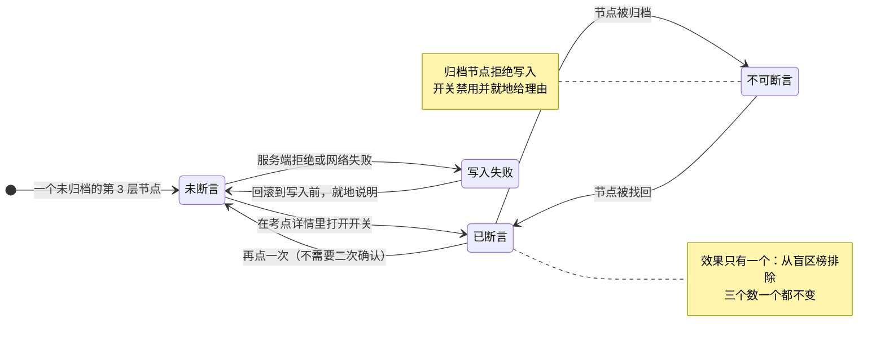

# U3.6 断言

> **基线**：`origin/v1` @ `73041df`，fetch 于 2026-09-02。
> **状态：活跃。** 正向断言的效果范围变化、断言与三个数的关系变化、反向断言被定义，本文同一次改动内更新。
> **上一层**：[M3 盲区与覆盖度](INDEX.md)

---

## 一、这个子能力是什么、不是什么

**是什么：** 用户对差值的**唯一一次写**。整个这一域里，用户能改变的只有这一件事 ——
声明某个考点他不用再看了。

**不是什么：**

- **不是覆盖度的第三格。** 断言是「没碰过」的一个子集标记，**它没有自己的恒等式项**（§2.2）。
- **不是掌握度。** 产品不校验他会不会，也不给这个声明打任何分。**它是用户的声明，不是产品的判断。**
- **不是完整的一对。** 正向断言有契约，**反向断言没有** —— §2.4 是本单元存在的主要理由。

---

## 二、详细产品逻辑

### 2.1 正向断言的完整链路

| 环节 | 规则 |
|---|---|
| 从哪发起 | **只在考点详情里**。列表长按菜单里不放这个动作 —— **断言是一次声明，应当发生在看过详情之后** |
| 写入方式 | 乐观更新：该行立刻置灰。失败则**回滚并说明**，不留一个假的成功 |
| 取消 | 再点一次即可，**不需要二次确认**。它可逆，加确认只是增加摩擦 |
| 归档节点 | 拒绝写入，开关禁用并**就地给出理由**，不是静默变灰 |
| 重算中 | **开关不禁用** —— 断言是写，它不依赖正在重算的那个数 |
| 断言之后 | 榜里该行消失，注脚计数加一；**摘要的三个数不变** |

### 2.2 为什么断言不是第三格

**断言是「没碰过」的子集，不是与「碰过 / 没碰过」并列的第三类。**

做成第三格会让用户读成「我有三类考点」，而他实际只有两类，
**其中一类里有一部分他自己打了个记号**。三格一摆，恒等式就从两项加起来变成三项，
而第三项跟前两项不是同一种东西 —— 它是一个标记，不是一次触达。

所以断言在屏幕上只有一行注脚，**没有自己的恒等式项**：

| 断言之后 | 变不变 |
|---|---|
| 考点总数 | **不变** |
| 碰过 | **不变** |
| 没碰过 | **不变**（被断言的节点仍算在里面） |
| 盲区榜 | 变 —— 该节点被排除 |
| 注脚计数 | +1 |

**这条约束的真正作用是防做假：** 如果断言能从「没碰过」里减出去，
**用户就能靠打标记把覆盖度做满，而他一个考点都没多碰。**
那正好是这个产品唯一的产出被做假的最短路径。

### 2.3 一处必须就地解释的不一致

「概览不减断言」与「榜排除已断言」是两条各自都对的契约，合起来会打架（`R-100`）：
声明 3 个已会之后，概览仍说没碰过 10 个，而榜里只列得出 7 个。

🔴 **裁定已经做过：接受两个数各说各话，并在屏幕上解释这一句。**
概览数字下方要有一行注脚，说清**有多少个节点被标了「已经会了」、因此没有列进下面的清单**。

**不解释就是产品在自相矛盾。** 用户会以为其中一个数算错了，而两个都没错 ——
它们数的是两件事：概览数的是「他没碰过的节点」，榜数的是「他没碰过、也没说不用看的节点」。

当没碰过的全部被断言时，榜会空，但那**不是空态** —— 摘要区的数字全都在，空的只有榜。
这一屏要说清两件事：没碰过的都被标成会了，以及去掉几个标记就能把它们看回来。同时给一个通向断言集合的入口。

### 2.4 反向断言缺席 —— 差集定义本身的一个盲点

**「我卡住了」没有后端契约。** 前端行为意图已经登记，**契约那一半是空的**（缺口 `B-1`）。

**它缺席的后果不是少一个功能，是差集定义里有一类东西根本不可见：**

> **「碰过但没通过」这一类，在 `盲区 = 骨架层 − 行为层` 里完全不可见 —— 因为碰过就算覆盖。**

一个用户把某个考点做了五遍、五遍都错，在当前定义下，
**他的覆盖度和做对一遍的人完全一样**。产品看不出这两个人的区别，
因为产品从没记过对错 —— 而「没记过对错」正是这个产品所有其他优势的来源。

所以这不是一个漏了的功能，**它是定义的盲点**：
差集这个形状能回答「碰没碰过」，结构上就回答不了「碰过之后怎么样」。

**本单元只做三件事，一件都不多：**

1. **登记它** —— 缺的是后端契约那一半，该技术同事定，不是产品补。
2. **说清它的后果** —— 上面那一段。
3. **在它定下来之前，考点详情上不放这个按钮** —— 放了就是一个点下去没有去处的动作。

🔴 **不裁定，也不提议怎么补。**
任何一个「暂行方案」都会绕回同一个位置：要么让产品去判断对错（红线一），
要么在覆盖度上再加一个不属于差集的维度（覆盖度的恒等式就不成立了，`看盲区` §2.7.1）。
两条路都不是产品能自己走的，所以这里停在登记。

---

## 三、前端行为意图 × 后端契约意图

| 项 | 前端行为意图 | 后端契约意图 | 真源 |
|---|---|---|---|
| 写入断言 | 乐观更新、失败回滚、就地说明 | body **只接受节点标识**，不接受任何文本 | `POST /assertions`，`技术架构与接口契约` §6.4 |
| 取消断言 | 再点一次，不做二次确认；失败回滚 | 同上 | `DELETE /assertions` |
| 归档节点 | 开关禁用并就地给理由 | **「节点已归档不能断言」要能被区分出来**，不是一个泛化的失败 | 同上 |
| 写入之后 | 榜里该行消失、注脚 +1、**三个数不动** | 成功响应要能让前端知道**要不要重取概览** | 同上 |
| 概览与榜 | 就地解释两者的差，不做任何一边的修正 | **概览单列不并入，榜排除已断言** —— 两条都保留，不为了对齐改任何一条 | 同上 · `R-100` |
| 断言集合 | 有一个入口能看到全部被断言的节点 | 断言集合可被单独取出 | `技术架构与接口契约` §6.4 |
| **反向断言** | 「我卡住了」的行为意图已登记；**在契约出现之前不放入口** | **空 —— 契约不存在** | 缺口 `B-1` |

---

## 四、边界与红线在这里的具体形态

| 边界 | 在本单元是什么形态 |
|---|---|
| 🔴 **永不判断对错** | 断言是**用户自己的声明**，产品不校验、不打分、不给掌握度。屏幕上也不出现「已掌握 n 个」这种带评价的写法 |
| 🔴 **不生成标签文本** | 断言接口只收节点标识（`I-3`）。断言不能创造一个不在骨架里的节点 |
| **唯一产出不许被做假** | 断言不从任何一个数里减出去（§2.2）。**能靠打标记做满的覆盖度不是覆盖度** |
| **归档优先于断言** | 归档节点拒绝断言 —— 它已经退出分子与分母（`I-6`），再给它一个标记没有意义 |
| **没有第四种反馈形态** | 断言不产生提醒、不产生打卡、不累计成就。它只影响一份清单里有没有这一行 |
| **不接下一句** | 断言之后不出现任何鼓励、进度、庆祝。**产品的语气到句号为止** |

---

## 五、缺口登记

| # | 缺的是哪一半 | 该谁定 | 不定它挡住什么 |
|---|---|---|---|
| `B-1` 🔴 | **反向断言「我卡住了」**：前端行为意图有，**后端契约那一半是空的** | **契约由技术同事定，产品不补** | 「碰过但没通过」这一类在差集里完全不可见 —— 做了五遍全错的人，覆盖度和做对一遍的人一样。**这是定义的盲点，不是功能待办** |

**登记的理由只有一条：它是差集定义的盲点。**
写在这里不是为了推动它被做，而是为了让下一个读到覆盖度定义的人知道 ——
**这个数覆盖不到的那一类，是已知的，不是被忽略的。**

⚠️ 本单元**不给它排期、不给它形态、不给它一个折中版本**。
一个看似合理的推断不能关闭一个缺口，在这条上尤其如此：
任何折中都会碰到红线一，或者碰到覆盖度那两个恒等式，而这两样都不是产品能自己放宽的。
