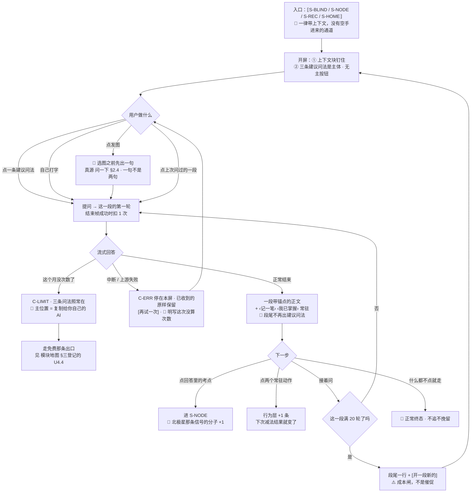

# U3.7 · 问一下（`S-ASK`）

> **基线**：`origin/v1` @ `44320c9`，契约 `KUBI-76-S-ASK契约` @ `b11d1b3`、文案真源 `KUBI-76-S-ASK规格` @ `60f4234`，fetch 于 2026-09-03。
> ✅ **上一版「裁定领先于契约」的两处已经追平**：`S-BLIND` 上下文不带 `province`、`EXAM_TYPE_UNSUPPORTED` 挪出现役码表，都已落在 `8855bec`（`M3-G10` / `M3-G2b` 随之闭合，§五）。
> 🔴 **这一屏用户可见文案的真源是 `specs/问一下.md` §二**（十五条建议问法 + 五条上下文摘要 + 额度 / 发图 / 备考档案那几句）。**本文只给槽位与条数，一个字都不抄** —— 两边不一致时以那一份为准。
> **状态：活跃。** 四个入口增删、开屏三区结构变化、额度的计量单位变化、发图那一格的留存承诺变化，本文同一次改动内更新。
> **上一层**：[M3 盲区与覆盖度 · 域索引](INDEX.md)

---

## 一、这个子能力是什么、不是什么

**是**：`S-ASK` 这一屏 —— 用户看完差值之后那个「先看哪个 / 这个到底是啥 / 我刚记的算不算数」的落点，
以及**问完之后回到产品里的那两条路**（回考点详情、回记录动作）。

**不是**：
- **不是一个通用聊天框。** 它没有空手进来的通道（§2.2），没有会话侧栏（§2.8）
- **不是 AI 代发提问**（见 `模块地图` §三登记的 `U4.6`）—— 那一条是**出口**：把一段文本递给用户自己接的模型，产品不查库。
  这一屏是反过来的：在产品里问，工具去查这个产品自己的两份事实。🔴 **两屏不合并**，理由在 §三 末行
- 不是学科答疑。它答不了「这道题怎么做」，而且答不了这件事有物理判据（§四）

**它要回答的只有两个问题**：用户**带着什么**进来；回答完之后他**往哪去**。

---

## 二、详细产品逻辑

### 2.1 骨架裁定：这一屏为什么不长成一个聊天软件 🔴

**做这一屏最容易掉进去的骨架是「消息流 + 底部输入框 + 会话侧栏」。** 它不是丑，是它**把这一屏的主语搞错了**：
消息流的骨架假设「对话本身是资产」，于是要收藏、要管理、要回看；
而在这个产品里对话不是资产，**记录才是**。四条裁定，逐条给判据：

| # | 裁定 | 判据（怎么算违反了） |
|---|---|---|
| 1 | **上下文块钉在最上面，不随滚动消失** | 用户任何时刻都答得出「我现在在问什么的事」。它被滚走一次，这一屏就退化成通用聊天框 |
| 2 | **开屏的主体是三条建议问法，不是输入框** | 开屏这一态**没有主按钮**（§6.1 ※8）。把发送做成空输入时的主按钮，等于告诉用户「这一屏最该做的是对着空框想一句话」 |
| 3 | **回答不是气泡，是一段带锚点的正文** | 没有左右对齐、没有头像、没有「对方正在输入」。提问以一行回显出现在正文上方 —— 🔴 **提问与回答不等价**：回答带可点考点、带两个动作，提问只是它的标题 |
| 4 | **每一段回答的下方常驻两条回产品的路** | 一个只会吐文字的对话框对北极星零贡献。**能把人送回考点详情、送回记录动作的对话框，才是在做减法的两端** |

⚠️ **换配色、换圆角、把气泡改成卡片，一条都不满足上面四行。** 骨架没换就不算换。

### 2.2 四个入口，没有空手进来的通道 🔴

| 从哪进 | 带进去的上下文 | 用户此刻心里的问题 |
|---|---|---|
| `S-BLIND` 盲区总览 | **这一份清单** —— 三个锚点 `orderBy` / `subject` / `filter`，🔴 **不带 `province`** | 「这么多先看哪个」 |
| `S-NODE` 考点详情 | **这一个考点** | 「这个到底是啥、常考吗、我碰过几次」 |
| `S-REC` 刚记完一笔 | **刚记的这一条** | 「我刚记的这个，算补上了吗」 |
| `S-HOME` 首页 | **我的全局状态** | 「我现在整体什么情况」 |

🔴 **`S-BLIND` 那一行为什么少一个锚点**（2026-09-03 产品裁定，契约 `8855bec` 已改齐）：`province` 的统计口径本身是错的
（按省份计数把同年同省的 3 张卷算成 1 次），而 `context` **只在首轮绑、中途改直接 `409`** ——
**一个口径已知算错的锚点，一旦绑上会话就再也改不掉。** 它在查询参数那一侧已经被挡掉，这一侧是它的第二扇门。

🔴 **没有第五个入口，尤其没有一个全局悬浮的「问 AI」按钮。** 悬浮入口就是空手进来的通道，
而空手进来的第一句话大概率是「这道题怎么做」——**第一次体验就是被拒绝，然后不会有第二次。**

### 2.3 三条建议问法是这一屏的主体，不是占位提示 🔴

**它们随上下文变，由服务端给**（它知道数据长什么样），前端不写死、不做本地模板。
理由与「引导在前、拒绝在后」是同一条（§2.7）：**用引导把问题带到产品答得好的地方，比用拒绝话术挡住答不了的地方要好。**

🔴 **三条不过模型**（契约 §12.3.1）：它们是**闭集模板 + 服务端填数**，模板全集写死在服务端。
让模型生成三条问法等于凭空多一个**直接产出用户可见文案、又不经过任何工具池**的注入点 ——
界面这一侧的推论是硬的：**三条问法永远是可数的那几种，不会因人而异地"更聪明"，这是它换来的东西，不是它的缺陷。**

🔴 **空态不返回空数组**（§12.3.2）：没有盲区 / 没有记录时换成适配空态的模板 —— **一个空数组会让开屏退化成一个空白输入框**，那正是这一屏要防的。

✅ **界面原文不在这一层，而它现在有家了**（`M3-G3` 已闭合）：真源是 `specs/问一下.md` §2.2 ——
🔴 **全集是十五条，不是三条**：四个入口各三条 + 空态一组。契约 §12.3 只持有 `id` 与结构，正文回指那一节。
**「三条」是一次开屏取几条，不是模板全集有几条**，两个数不要读混。

### 2.4 回答的形状：锚点 + 两个常驻动作

| 位置 | 是什么 | 为什么不能少 |
|---|---|---|
| 正文里的考点名 | **可点，进 `S-NODE`** | 🌟 它直接生产北极星那条信号的分子（`实施路径:126`「看到缺口清单后点进去的比例」）。🔴 **前端按 `node-ref` 帧给的字符偏移量渲染可点区域，一个字都不做名字匹配**（契约 §12.4）—— 名字匹配会把「名字对上了」当成「是同一个考点」 |
| 正文下方 | `‹ 记一笔 ›` `‹ 我已掌握 ›`，**常驻** | 用户在对话里纠正减法结果，说明他信这份数据（阶段 1 的验收）。两个动作**复用已有路径**，不新造写入 |

🔴 **一条从契约推出来的界面事实，必须写下来**（§12.4.1）：`node-ref` 的候选集**只能是本轮工具实际查过的节点**。
于是**正文里某个考点名不可点，不是漏做，是它这一轮没被查过** —— 可点与否成了「查没查过」的可见信号。
🔴 **不可点的那个名字就是纯正文，不加任何标记**（2026-09-03 产品裁定）：不加灰、不加问号、不加「未收录」、不加下划虚线。
加了就是**产品在对模型的行为做评价**，而用户不需要知道我们的实现。用户读到的区别只该是「这个能点进去看」，
**不是「那个有问题」**。同理 🔴 **不许为了"看起来一致"给它补一个跳转** —— 补上去的那一下就是名字反查。

🔴 **产品不对回答评分、不排序、不加工。** 回答区与产品自身的输出必须在视觉上可区分（同 `模块地图` §三登记的 `U4.6` §6.1 ※6）。

### 2.5 额度：按会话扣，不按轮扣 🔴

**2026-09-03 产品裁定，契约 §12.6.2 已采纳并定死（`M3-G4` 已闭合）：**

| 项 | 界面上是什么 |
|---|---|
| 扣减单位 | **一段对话 = 1 次**，在这一段第一轮的结束帧扣。会话内轮次不限，上限 20 轮 |
| 🔴 会话内**不显示余量** | 逐轮递减会把多轮对话变成**让人数着说话**。开屏那一格说一次「这一段会用掉 1 次」，进了对话就不再出现。⚠️ `done.remaining` 在会话内恒定，**拿得到不等于该显示** |
| 20 轮到顶 | 服务端回 `409 SESSION_TURN_LIMIT`；界面是一行陈述 + 一个「开一段新的」。⚠️ **它是成本闸不是产品判断**，也不是催促 —— 不倒计时、不预警、不在第 18 轮提醒 |
| 额度为 0 | 受限态见 §6.3。🔴 **主位置上的永远是免费兜底那一条**，付费入口只能是文本按钮（`C-LIMIT`） |

⚠️ **5 次与 20 轮都是没有数据支撑的占位**（产品自己登记的）。界面照这个口径画不会返工：变的只有那个数。

### 2.6 发图这一格：它与 `S-REC` 那条路是两条不同的留存承诺 🔴

**这是本单元最容易出事的一格，而它今天在任何一份文档里都没有落点。**

| | `S-REC` 拍照记一笔 | `S-ASK` 发图问一下 |
|---|---|---|
| 图去哪 | **留在这台设备上**，进原图管理，有到期倒计时，有立即删除入口 | 🔴 **哪儿都不去。** 字节只活到发给模型为止，不落盘、不进原图管理、不进这一段的回放 |
| 三处承诺 | 同意留存那一刻 / 到期倒计时 / 立即删除入口，三处齐全（见 `模块地图` §三登记的 `U8.3` `U8.4`） | **三处一处都不出现，而这不是弱化** —— 没有留存就没有到期，没有到期就没有倒计时可显示 |

🔴 **正因为三处不出现，这一格必须自己说清「这一张哪儿都不留」。** 原文真源 `specs/问一下.md` §2.4，本文不抄。
用户在同一个 App 里刚学会「拍了的图会留在本机」，如果这一格什么都不说，他会按那个心智以为这张也留了 ——
**一个用户以为存在、而产品并不打算兑现的承诺，比没有承诺更糟。**

⚠️ `R-89` 那条断裂（下一次问的时候这张图已经不在了）**也要说得出来，但它不另起第二句**（`M3-G11` 裁定，2026-09-03）：
🔴 **「不留存」与「下一句就看不到」是同一件事的两面** —— 因为哪儿都没留，所以下一句没有。
**拆成两句，用户读到的是两笔代价**，而第一句那个承诺被稀释成其中一笔。落法见 §6.3 ※15。
🔴 **不要为了「体验连贯」把图存下来。**

### 2.7 越界问题：引导在前，拒绝在后 —— 而界面拿不到「拒绝」这个信号

**模型拒答「这道题怎么做」产出的就是一段正常正文**（契约 §12.2.3：不新增 `refused` 帧）。于是：

🔴 **界面不许给拒绝做特殊样式** —— 前端拿不到那个信号，**也不该拿**。想给它做样式的唯一办法是让前端去猜正文写了什么，
那等于在客户端做一次内容裁决，而「判断哪一句越界」本身就是一次学科判断。

🔴 **而引导只有开屏那一次**（2026-09-03 产品裁定，**推翻本文上一版的「每段回答之后再出现一次」**）：

| 上一版（作废） | 现在 |
|---|---|
| 开屏一次 + 每段回答之后再出三条（换成基于这一轮的） | **只有开屏那一次** |

两条理由，第二条是硬的：

① **回答下方已经有两条回产品的路**（记一笔 / 我已掌握），正文里还有可点的考点 ——
再摆三条「接着问」的路，是**在跟自己的北极星抢用户**。§2.1 第 4 条把那两个动作定成这一段的重心，这一条是它的直接推论。
② 🔴 **「基于这一轮的三条」这个东西拿不到**：`GET /agent/suggestions` 的查询参数只有四个入口锚点（契约 §12.3），
**没有任何一条路能按轮取建议**。⚠️ 技术侧**不为它加参数**，并把「不做」这件事**正面登记在契约 §12.3.3** —— 这是产品裁定不做，不是契约漏了；上一版那句话是三件没齐里的界面那一件。

**开屏那一次要解决的问题是「别对着空框发呆」，而那个问题只在开屏存在。**
回答之后用户不缺话题，缺的是一条走回产品的路，**那条路已经在了**。

### 2.8 会话历史：不做侧栏

四个会话端点（列表 / 详情 / 改名 / 删除）契约齐备，但**界面上不给它一个常驻侧栏**。
侧栏会把「管理对话」变成一个常驻任务，而这个产品里对话不是资产。落法：
开屏第三区列**最近 3 段**，可点续上；`‹ 全部对话 ›` 进一个子页 —— 🔴 **子页不给屏号**，同 `模块地图` §三登记的 `U8.1` 的先例。

---

## 三、前端行为意图 × 后端契约意图

| 事项 | 前端行为意图 | 后端契约意图 |
|---|---|---|
| 开屏 | 按入口渲染上下文块 + 三条建议问法；三条**随上下文变** | `GET /agent/suggestions`，参数与 `context` 同构、返回 3 条、**不计费**（契约 §12.3、§12.6）。🔴 闭集模板填数，**不过模型** |
| 提问 | 多轮、流式；上一轮不用用户重述 | `context` **只在首轮传**，服务端绑在会话上；后续只传 `sessionId`（契约 §12.2.2）。中途改上下文 → `409 CONTEXT_ALREADY_BOUND`。🔴 `S-BLIND` 只带三个锚点，**不带 `province`**（契约 `8855bec` 已改齐，`M3-G10` 闭合） |
| 回答里的考点 | 按偏移量渲染可点区域，点了带 id 跳转，并打 `from=S-ASK` 的埋点 | `node-ref` 帧带 `nodeId` + `start` / `end`；候选集 = 本轮工具查过的节点（契约 §12.4） |
| 发图 | 图不落盘、不进原图管理；界面自己说清这一句 | 字节只在内存里活到发给模型为止（`I-5`）；落盘的只有「附了 N 张图」这个事实 |
| 两个常驻动作 | 复用已有的记录与断言入口 | 🔴 **两个端点一个字段都不加**：不加「来源」、不加 `sessionId`（契约 §12.5）—— 加 `sessionId` 就是依赖图上「`domain` 不认识 agent」那条边的第一个缺口 |
| 额度 | 会话内不显示余量；开屏说一次 | 🔴 **按会话扣**，首轮 `done{ok}` 扣 1（契约 §12.6.2，与本文同源） |
| 越界 | 不做特殊样式；🔴 **引导只有开屏那一次**（§2.7） | 拒绝在服务端判；🔴 **不加 `refused` 帧**（契约 §12.2.3） |
| 会话历史 | 开屏最近 3 段 + 子页 | 游标分页（契约 §12.7）。⚠️ 改名端上用 `POST`、服务端 `PATCH` → 405，已由技术侧登记 |
| 与 `U4.6` 的关系 | 两个入口都在，**不合并** | 🔴 `/ai/ask` 的请求体只有那段文本，服务端不附加任何库里的字段；这一屏的端点带工具池、会去查库。**两个端点语义不同不是冗余，是那条红线的形状** |

---

## 四、边界与红线在这一屏的形态

| 边界 | 在这一屏是什么 |
|---|---|
| **永不判断对错** | 🔴 物理判据不在这一屏，在工具池：`tool/impl/` 每个工具类的构造器参数类型必须在白名单里（契约 §12.8.1）。**界面这一层守不住这条，也不假装自己守得住** |
| 不做学科教研 | 专业性来自**考情密度**（这个考点近 N 年考了几次、你碰过几次、同章节还剩几个），不来自讲题 |
| 不存题干 | 输入框上限是红线的形状不是排版：它把「问一句话」和「贴一段材料」分在两边。🔴 **不静默截断**，超了就明说 |
| 闭集打标 | 回答里的考点只能是**带 id 的既有节点**，不许出现产品自己造的考点名 |
| 原图不上云 | §2.6 整节。🔴 **这一屏的图连本机都不落** |
| 没有第四种反馈形态 | 没有小红点、没有未读、没有「AI 有新回答」的角标；20 轮到顶是陈述不是提醒 |
| 额度只碰外部模型调用 | 额度为 0 时这一屏受限，但 `S-BLIND` `S-NODE` `S-REC` 一格不变（`I-4`） |

---

## 五、缺口登记 —— 只登记，不裁定

| # | 缺口 | 缺的是哪一半 | 该谁定 |
|---|---|---|---|
| ✅ `M3-G3` | ~~`S-ASK` 没有逐屏规格；用户可见文案的真源落在了契约里~~ | **已闭合**：`specs/问一下.md` §二落盘（`KUBI-76-S-ASK规格` @ `60f4234`），**十五条建议问法 + 五条上下文摘要**全文有真源；契约 `b11d1b3` §12.3 已改成只留 `id` 与结构、正文回指 §2.1 / §2.2。本层照旧只给槽位 | —— |
| ✅ `M3-G4` | ~~额度的计量单位两边不一致~~ | **已闭合**（契约 §12.6.2 采纳按会话计，2026-09-03） | —— |
| ✅ `M3-G5` | ~~建议问法契约里没有这一行~~ | **已闭合**（契约 §12.3 + `GET /agent/suggestions`） | —— |
| ⚠️ `M3-G9` | **回答下方那两个常驻动作今天测不了** | 契约 §12.5.1：主信号（点进 `S-NODE`）有埋点，次信号（一次会话里发生记一笔 / 标记已掌握的比例）**没有，且裁定不为 N=1 造埋点**。界面照做，🔴 **但别把它当成到时候能拿数字说话的东西** | 已裁定，阶段 1 之后再议 |
| 🔴 `M3-G6` | **五个 `/agent/**` 端点服务端不校验令牌**，会话读删不校验归属 | 与已冻结口径 1「不登录不能记」直接冲突。**界面这一侧无能为力** —— 前端已经在发 `Bearer`，服务端不读 | 已升级给人，技术侧修 |
| ✅ `M3-G10` | ~~契约 `:1568` 的 `S-BLIND` 上下文里还有 `province?`~~ | **已闭合**：技术侧已删，契约 `8855bec` §12.2.2 的锚点只剩三个。两边一致 | —— |
| `M3-G7` | **20 轮与 5 次两个数没有数据支撑** | 缺的是「一次会话平均几轮」，而那个数要自用两周才有 | 产品，等 `1.1.4` |
| ✅ `M3-G11` | ~~发图那一格的第二句没有真源~~ | **已闭合，而且不是按「补一行」闭的**：产品 2026-09-03 裁定 `R-89` 那条上屏但**并进留存那一句**，`specs/问一下.md` §2.4 的原文已经含着它。**两句变一句，界面这一格少一行**（§6.3 ※15） | —— |
| ✅ `M3-G8` | ~~`S-ASK` 是不是第十四屏，`specs/` 侧没有跟上~~ | **已闭合**：`specs/` 与 `modules/` 侧 34 处屏数断言一次扫齐（规格 `6cb5490`）。⚠️ 余下三处都是**有主人的**：技术侧两处（`技术 INDEX:816` / `接口契约:1478`）归技术经理；`无障碍与多端适配` §8.2 逐屏焦点链按用户 2026-09-02 裁定不加厚（`Q-2`）；`端到端验收用例集` §5.1 已按十四屏改、`S-ASK` 那行标 ❌ —— **分母动了分子没动，是明着欠的**（`Q-4`）。🔴 **其中三处不是改数字，是换判据**：`U0.1` / `U8.1` / `设置与原图` 原先都拿「十三屏，一屏不多」论证自己不拿屏号，而屏数当天就从十三变成十四 —— 支点换成「有没有第二个入口 / 是不是别的屏的子页」，屏数再变都不用改 | —— |

---

## 六、线框

> 记号与屏宽照 [线框与交互规格约定](../线框与交互规格约定.md) §三（40 个半角字符），组件只引锚不抄规格。
> 🔴 **三条建议问法一个字都不进这张框** —— 不再是因为没有真源（`M3-G3` 已闭），而是因为**真源在 `specs/问一下.md` §2.2**，抄进来就是第二处说法。

### 6.1 开屏常态（整屏）

```
┌────────────────────────────────────────┐
│ ‹ 返回 › ⟦回到带我来的那一屏⟧ ← P-NAV  │  ※1
├────────────────────────────────────────┤
│ ① 上下文块 · 钉住，不随滚动        ※2  │
│  ⟦带进来的是什么·四选一 / 空态⟧ ←可点回去│
├────────────────────────────────────────┤
│ ② 三条建议问法 · 这一屏的主体      ※3  │
│  [ ⟦问法一⟧ ]        ← C-BTN 次        │
│  [ ⟦问法二⟧ ]                          │
│  [ ⟦问法三⟧ ]                          │
│                                        │
│ ③ ⟦上次问过的·最多 3 段⟧ ←可点续上 ※4  │
│  ‹ 全部对话 ›  → 子页，不给屏号    ※5  │
├╌╌╌╌╌╌╌╌╌╌ 折叠线 ╌╌╌╌╌╌╌╌╌╌╌╌╌╌╌╌╌╌╌╌┤
│ ④ 输入区 · 贴底固定                    │
│  ▢ ⟦自己打字⟧  📷 ⟦发图⟧ ←C-INPUT  ※6 │
│  ⟦这一段会用掉 1 次·本月还有 {k}⟧  ※7  │
│  ‹ 问一下 ›  ← 文本按钮，未打字时  ※8  │
└────────────────────────────────────────┘
```

※1 返回落回**带他来的那一屏**，不是首页；这一屏不压栈成一条独立的历史
※2 🔴 **钉住是骨架不是样式**：它被滚走一次，这一屏就退化成通用聊天框（§2.1 第 1 条）。四种上下文各是一种渲染，**不合并成一句「已带上下文」**；空态是第五种（`specs/问一下.md` §2.1 的 `ctx.empty`），**摘要与问法一起换，不是只换问法**
※3 折叠线以上必须完整看得见 ① 与 ② 两区 —— **这两区就是这一屏与聊天框的全部区别**
※4 ⟦最近 3 段⟧无数据时**整区隐藏**，不出空插画　※5 子页只有列表、改名、删除三件事，🔴 **不做常驻侧栏**（§2.8）
※6 📷 那一格在**不开原图通道的端上不渲染**（不是灰掉）；点它之后、选图之前必须先出 §6.3 ※15 那一句
※7 🔴 **这一行整屏只出现在这里，进了对话就不再出现**（§2.5）。原文见 `specs/问一下.md` §2.3。拿不到余量时**整句省略**，不写 0、不写「—」
※8 🔴 **开屏这一态没有主按钮。** 输入框有内容或选了图之后，这一个槽位升为 `( 问一下 )` 主按钮 —— 同一个槽位换层级，不是新增第二个主按钮（约定 §3.4）

🔴 **这张框里没有的东西**：没有会话侧栏、没有对话气泡、没有头像、没有「对方正在输入」、没有悬浮的问 AI 按钮、
没有小红点与未读计数、没有余量进度条、没有「本月已用 3/5」这类分数、没有任何倒计时。

### 6.2 回答态：只画变化的两区

```
│ ① ⟦同常态·仍然钉住⟧                    │
├────────────────────────────────────────┤
│ ② 换成这一段的正文（问法下移到段尾）※9 │
│  ⟦我问的那句·一行回显·不是气泡⟧        │
│  ⟦回答正文·流式⟧                       │
│    ⟦考点名⟧ ← 可点 → S-NODE       ※10  │
│  ‹ 记一笔 › ‹ 我已掌握 › ←常驻     ※11  │
│  🔴 这里没有第二组建议问法        ※12  │
│ ④ ▢ ⟦接着问⟧  🔴 这里没有余量行   ※13  │
```

※9 🔴 提问与回答**不等价**：提问是一行回显（§2.1 第 3 条），回答带锚点带动作
※10 🔴 按 `node-ref` 的字符偏移量渲染，**不做名字匹配**；某个考点名不可点 = 这一轮没查过它（§2.4），**不许补跳转**　※11 两个动作复用已有路径，不新造写入；🔴 **它们是这一段的重心不是装饰**
※12 🔴 **建议问法只在开屏出现一次**（§2.7 裁定）：回答之后**一条都不出**，拒绝那一段下面同样不出。⚠️ 这一格的空**是设计不是缺件** —— 段尾能通向下一步的东西只有 ※10 的可点考点与 ※11 那两个动作，它们全都通回产品
※13 会话内**不显示余量**，也不显示「还剩 N 轮」

### 6.3 其余各态：只画变化区

```
│ 骨架 C-SKEL：等首帧 · ① ② 区不变  ※14 │
├────────────────────────────────────────┤
│ 发图前 · 一句就地说明             ※15  │
│  ⟦留存声明·一句·真源 问一下 §2.4⟧      │
├────────────────────────────────────────┤
│ 错误态 C-ERR · 五档，每档一句     ※16  │
│  ⟦哪一步没成⟧ [ 再试一次 ] ⟦没算次数⟧  │
│  已收到一半：⟦原样保留 + 只收到一半⟧   │
├────────────────────────────────────────┤
│ 🔴 受限态 C-LIMIT · 这个月没次数了     │
│  ② 区 ⟦同常态·三条问法照常在⟧     ※17  │
│  [ 复制这份清单给你自己的 AI ] ← 次    │
│  ‹ 次数怎么加 › →模块地图§三U7.3   ※18 │
├────────────────────────────────────────┤
│ 20 轮到顶 · 段尾一行              ※19  │
│  ⟦这一段到这里⟧ [ 开一段新的 ]         │
├────────────────────────────────────────┤
│ 离线 C-OFFLINE · ④ 区一行         ※20  │
│ 空态 C-EMPTY：⟦不存在⟧            ※21  │
```

※14 首帧之前 ① ② 两区照常可见 —— 🔴 **不整屏骨架**，那会让上下文块闪一下不见
※15 🔴 **这一格是 §2.6 的落点，不是提示语，不可关闭、不可「不再提示」**。原文真源 `specs/问一下.md` §2.4，本文不抄。
🔴 **它是一句，不是两句**（`M3-G11` 裁定）：留存与「下一次问就没有了」并在同一句里说完 —— 拆开就是两笔代价。
🔴 **这一格里不出现「模型」「轮」这两个词**：这一屏对用户说的是「认出图里的考点」、说的是「段」与「次」，
为解释一个机制引进两个用户没被教过的词，就是在这一格做技术说明。⚠️ **它说在选图之前，不是发完之后** —— 知道下一次问就没有了，用户会把要问的一次问完；发完再说只剩解释，没有动作可做
※16 五档取自结束帧的取值域（`ok` / 上游超时 / 上游错误 / 上游拦截 / 返回空）；🔴 **失败一律不扣次数且明写这句话**。另有三个码**界面上不该出现**（`409 CONTEXT_ALREADY_BOUND` / `422 UNKNOWN_CONTEXT_SOURCE` / `409 SESSION_TURN_LIMIT` 之外的上下文类）—— 前两个出现即端上有 bug，不为它们设计文案
※17 🔴 受限态**不折叠 ② 区、不做全屏遮罩、不做弹窗**；这一区里位置最高的是免费兜底那一条，不是「去买次数」
※18 付费入口只能是文本按钮（`C-LIMIT`）。⚠️ 免费兜底指向免费复制那条路（`模块地图` §三登记的 `U4.4`），它永不移除
※19 陈述句，🔴 **不预警、不在第 18 轮提醒**（提醒就是第四种反馈形态）
※20 离线时输入区不禁用，点了才出一行「这一步必须联网」　※21 **成因为零**：没有上下文就没有入口（§2.2），这一屏进不来 —— 不是留空，是这一屏没有那种往返

### 6.4 红线自查十条，逐张数过

| # | 数这一样 | 本单元 |
|---|---|---|
| 1–2 | 正确率 / 得分 / 排名 / 讲解 / 学习建议 | 🔴 产品不对回答评分、不排序、不加工＝0。⚠️ 回答里可能有学科内容 —— 那是模型说的，**产品只保证它查不到题干**（§四第一行） |
| 3 | 提醒 / 推送 / 小红点 / 未读 / 气泡引导 | **0**：20 轮到顶是陈述；三条建议问法是**内容不是气泡引导**（它们就在版面里，不覆盖任何东西） |
| 4 | 打卡 / 连续 N 天 / 徽章 | **0**：这一屏不记录用户问了几天 |
| 5 | 进度环 / 百分比 / 完成度 | **0**：余量只在开屏出现一次且是整数次数，🔴 **不做成 3/5 这种分数** |
| 6 | 倒计时式紧迫感 | **0**：不显示考试倒计时（见 `U3.8` §2.4）、不倒数剩余轮次、额度不促销 |
| 7 | 能装下题干的格子 | ⚠️ 输入框是自由文本，**上限就是这条红线的形状**（§四）；🔴 不给示例、不给长得像题目的占位符 |
| 8 | 置信度 / 匹配分 | **0** |
| 9 | 原图的分享 / 导出 / 同步入口 | **0**，且这一屏的图**连本机都不落**（§2.6） |
| 10 | 三处必须出现且不可弱化的东西 | 🔴 三处落在 `模块地图` §三登记的 `U8.3` `U8.4`，本单元不重画也不弱化；**这一屏因为没有留存所以三处都不出现，而它必须把这件事说出来**（§2.6、§6.3 ※15）—— 沉默会让用户按 `S-REC` 那条路的心智以为图留下了 |

---

## 七、交互规格

### 7.1 必答五项

| # | 项 | 本单元的答案 |
|---|---|---|
| 1 | **入口** | 四个，全部带上下文：`S-BLIND` `S-NODE` `S-REC` 记完那一刻 `S-HOME`（§2.2）。🔴 **没有第五个，没有全局悬浮入口。** 深链与登录后回跳**必须带得回上下文**，带不回就落回 `S-BLIND`，不渲染一个空上下文块的 `S-ASK` |
| 2 | **结束状态** | 这一屏**不拥有记录状态**。三个终态：① 点了回答里的考点 → 进 `S-NODE`（🌟 北极星那条信号的分子）；② 点了两个常驻动作之一 → 行为层多一条，下次减法结果就变了（状态名取 `模块地图` §四，本层不新造）；③ 什么都没点就离开 —— 🔴 **这也是一个正常终态，不追、不挽留、不弹「确定离开吗」** |
| 3 | **失败落点** | ① 流中断 → 停在本屏，已收到的部分**原样保留且不伪装成完整回答**，`[ 再试一次 ]` 是次按钮，明写这次没算次数；② 额度为 0 → 受限态，主位置是免费兜底那条路（§6.3 ※17）；③ 20 轮到顶 → 段尾一行 + 开一段新的；④ 令牌失效 → 🔴 **整屏离开回登录门**，不留一个未登录形态的对话屏 |
| 4 | **空态** | **一个成因**：从 `S-HOME` 进来而这个账号还没有任何记录。落点是三条建议问法**换成适配空态的那一组模板**（契约 §12.3.2，原文 `specs/问一下.md` §2.2 空态组 + §2.1 `ctx.empty`），🔴 **不是空数组、不是空白输入框、不出 `C-EMPTY` 插画**。另一格「从 `S-BLIND` 进来但清单为 0」到不了这里 —— 那一屏自己就是空态，入口在那一态下不渲染 |
| 5 | **错误态** | 可重试五档，每档一句不共用；有缓存的历史对话是**陈旧数据态不是错误态**。🔴 **拒绝不是错误态** —— 界面拿不到那个信号，也不该拿（§2.7） |

**受限态**：额度为 0。🔴 主位置永远是免费兜底那一条，付费入口只能是文本按钮（`C-LIMIT`）。
**离线态**：`C-OFFLINE` 细条照常在；输入区不禁用，点了才出一行（§6.3 ※20）。

### 7.2 交互流程



🔴 **每一条失败边都落到一个有下一步的节点**，包括「什么都不点就走」那一条 —— 它落回带他来的那一屏。
