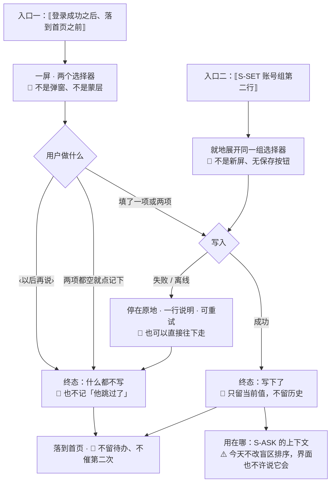

# U3.8 · 我要考的那一场（备考档案）

> **基线**：`origin/v1` @ `44320c9`，分支基线 `KUBI-76-S-ASK契约` @ `955c55e`，fetch 于 2026-09-03。
> **状态：活跃。** 字段增删、收集时点变化、`examType` 取值域变化、「只显示日期不显示天数」这条被推翻，本文同一次改动内更新。
> **上一层**：[M3 盲区与覆盖度 · 域索引](INDEX.md)

---

## 一、这个子能力是什么、不是什么

**是**：两个字段 —— **你考哪一场**、**什么时候考**；以及它们被收集的那一次、被改的那一格。

**不是**：
- 不是用户资料。**没有昵称、头像、学历、目标岗位、每日目标**，将来也不许从这里长出来
- 不是学习计划。🔴 **它不产生任何提醒、不产生倒计时、不产生「距考试还有 N 天该做什么」**
- 不是账号字段。它进减法的公式，不进身份（存哪由技术侧定，见契约 §12.6.1）

**它为什么在 M3**：它存在的唯一理由是**让减法的结果贴住用户那一场考试** —— 全国平均的频次对一个只考某一场的人是噪音。
⚠️ **这条理由今天兑现不了**（§2.6），本文如实写着这一格。

---

## 二、详细产品逻辑

### 2.1 两个字段，都可以空

| 字段 | 形态 | 空值 |
|---|---|---|
| 考哪一场 | **闭集选择器**，两项（§2.5） | 没设过就是没有这一项，🔴 **不显示「未设置」「未知」这类占位** |
| 什么时候考 | **日期选择器**，只到日 | 同上 |

🔴 **两个字段互不依赖**：只填日期不选场次是合法的，反过来也是。**不做「必须两个都填」的表单校验** ——
一个只知道自己十一月要考、还没定考哪一场的人，是这个产品最典型的用户。

### 2.2 收集时点：登录成功之后一次，可跳过

| 项 | 裁定 |
|---|---|
| 什么时候 | **登录成功之后、落到首页之前，一次。** 不在首启说明屏上（那一屏 🔴 零个可输入元素） |
| 形态 | **一屏，不是弹窗、不是蒙层引导、不是首页上的一条提示** |
| 可不可跳过 | 🔴 **可以。** `‹ 以后再说 ›` 是文本按钮，跳过之后不再自动出现第二次，改在 `S-SET`（§2.3） |
| 跳过了会怎样 | 什么都不会怎样。🔴 **不降级任何功能、不在首页留一条待办、不在别处催第二次** |

**为什么必须可跳过**：这一屏站在「登录成功」与「记下第一条」之间，而这个产品对那一段路有一条数字承诺 ——
**登录之后 2 次点击、0 个系统弹窗落下第一条记录**（`首次使用与权限申请` §1.2）。
🔴 **这一屏把 2 变成了 3，这是一次真实的代价，不许含糊过去**（`M3-G1`，§五）。可跳过是把这次代价压到最小的做法，
不是它的正当性来源 —— 正当性要由产品对着那条承诺重新拍一次板。

### 2.3 改在 `S-SET` 一格

考试日期会变（延考、改报），**不能改的字段等于一次填错就永久错**。落法：`S-SET` **账号组第二行**，就地展开同一组选择器。

- 🔴 **不新开一个「个人资料」分组**：一个新分组会给这一屏立一个「资料越填越全」的暗示，而这里永远只有两个字段
- 闭集选择器 + 日期选择器**不撞** `设置与原图` §109「这一屏没有任何开关类型的条目」与 §131-133「没有任何一格能让用户输入自由文本」——
  它们既不是开关，也收不下一个字的自由文本

### 2.4 🔴 只显示日期，不显示倒计时

| 允许 | 不允许 |
|---|---|
| 显示那个**绝对日期** | 显示「还有 N 天」「倒计时」「距考试还剩」，或任何由日期派生的天数 |

**两道防线都要有，不许只留一道**：
① 契约不返回天数（`接口契约:签名与错误码全集` §12.6.3，服务端只给绝对日期）；
② **界面自己不算天数** —— 前端拿到一个绝对日期，`Date` 一减就有了，契约那一道拦不住它。

**为什么这条比看上去重**：一个天数一旦上了屏，它会自己去找一句话搭配 ——
而在这个产品里，能和「还有 82 天」搭上的那句话，只可能是复习提醒或紧迫感文案，两样都是红线。
🔴 **天数与盲区数不许出现在同一句话里**，`capability-boundary-scan.mjs` 扫这一条。

### 2.5 闭集只有两项，界面永不发出一个会被拒的请求

契约 `examType` 只接受 `national`，省级代码一律 `422 EXAM_TYPE_UNSUPPORTED`（§12.6.2）。**界面据此只给两项：**

| 选项 | 提交什么 |
|---|---|
| ⟦国考⟧ | `examType = national` |
| ⟦其他·我们还没有这一场的考情⟧ | 🔴 **不提交 `examType`**（这一项整个不出现），日期照收 |

⚠️ 契约的取值域写的是 `national` | 省级行政区代码，**但今天只有 `national` 被接受**（§12.9.3：解锁条件是数据侧把统计单位改成三元组）。
🔴 **界面按今天的事实给两项，不按将来的取值域给二十几项。** 解锁那天加省份，是一次界面改动，不是一次今天就要预留的坑。

🔴 **不做一个有二十几个省的下拉，让用户挑完再被拒。** 让用户撞一次墙再告诉他这一场没有数据，和一开始就说清楚，
成本差一个来回，而诚实度一样 —— 那就取便宜的那个。**`422` 不是给用户的，是给端的**：
端上不该发出这样的请求，万一发了它是最后一道。

⚠️ 一处映射要写明，它是界面推出来的、不是契约里的一档：**`examType` 缺而 `examDate` 有 → 渲染成「其他」；两个都缺 → 渲染成没设过。**
两种情况可判别，所以不需要为「其他」新开一个取值。要区分「选了其他」与「没选过但填了日期」时才需要动契约，**今天不动**（`M3-G2`）。

### 2.6 今天它不改盲区排序，界面不许暗示它会 ⚠️

骨架侧没有按场次区分的统计（契约 §12.7 三条实测）。所以：

🔴 **收集这一屏与 `S-BLIND` 的排序之间今天没有连线，界面上一个字都不许说「填了它清单会更准」。**
说了就是一句**今天不成立的承诺**，而它兑现不了的时候没有任何东西会报错。

**它今天服务的是**：`S-ASK` 的上下文（agent 知道你考哪一场、还有多久，回答会不一样）。仅此一条。

---

## 三、前端行为意图 × 后端契约意图

| 事项 | 前端行为意图 | 后端契约意图 |
|---|---|---|
| 读 | 进 `S-SET` 与 `S-ASK` 时读；读不到就当没设过，**不拦任何操作** | `GET /profile/exam`；没设过时**整个 key 不出现**，不返回 `null` / `"unknown"` |
| 写 | 全量覆盖；两个字段都可清空 | `PUT /profile/exam`，全量覆盖 |
| 天数 | 🔴 **前端不算天数**（§2.4 第二道防线） | 🔴 **服务端不返回任何派生天数**（§12.6.3） |
| 省级考试 | 界面只给两项，永不提交省级代码 | `422 EXAM_TYPE_UNSUPPORTED`，🔴 **不静默降级成全国平均**。⚠️ 它与「这一场暂无考情数据」是两件事：后者不是错误，将来走 `statScope` 回显（契约 §12.9.3） |
| 留不留历史 | 界面上没有「以前填过什么」的入口 | 🔴 **不留历史** —— 留了就长出「你的备考轨迹」，那是学习分析 |
| 首启那一次 | 跳过不写任何东西，**也不记「他跳过了」** | 无端点：跳过就是一次没有发生的写 |

---

## 四、边界与红线在这一格的形态

| 边界 | 在这里是什么 |
|---|---|
| 永不判断对错 | 这两个字段与「学得怎么样」无关，🔴 **不许由它推出任何进度、建议、剩余任务量** |
| 不做提醒 | §2.4 整节。没有考前提醒、没有日历写入、没有通知权限申请 |
| 不做教研 | 不问「你目标岗位」「你想考多少分」；产品不知道也不需要知道 |
| 不存题干 | 这一格没有任何自由文本输入位 |
| 宁缺毋滥 | §2.5：没有考情数据的那一场，**如实说没有**，不拿全国平均冒充 |
| 三处必须出现的东西 | 与这一格无关，落在 `模块地图` §三登记的 `U8.3` `U8.4`，本单元不重画也不弱化 |

---

## 五、缺口登记 —— 只登记，不裁定

| # | 缺口 | 缺的是哪一半 | 该谁定 |
|---|---|---|---|
| 🔴 `M3-G1` | **首启多这一屏，与「登录之后 2 次点击落下第一条记录」这条承诺相撞** | 缺的是产品对那条承诺的重新拍板：是接受 3 次点击，还是把这一屏挪到别处。**本文按「收，且可跳过」画**，因为收集时点是用户明确要求的 | **产品**。真源 `首次使用与权限申请` §1.2 需同向改齐或明确保留 |
| `M3-G2` | **「其他」这一档是界面推出来的映射，不是契约里的取值** | 今天可判别（§2.5 末段），不需要动契约；将来要区分「选了其他」与「没选过但填了日期」时才需要 | 触发时再议 |
| ⚠️ 承接 | **按场次排序今天做不了**（骨架侧没有这一半数据，前置是采购真题书，撞范围红线） | 缺的是数据，不是界面 | 已登记为**待人与数据侧共同拍板** |

---

## 六、线框

> 记号与屏宽照 [线框与交互规格约定](../线框与交互规格约定.md) §三（40 个半角字符），组件只引锚不抄规格。
> 🔴 **一句界面原文都不进这张框** —— 这一格的文案真源今天不存在（同 `U3.7` 的 `M3-G3`）。

### 6.1 首启那一次（整屏）

```
┌────────────────────────────────────────┐
│ 🔴 不是弹窗 · 不是蒙层 · 没有返回  ※1  │
├────────────────────────────────────────┤
│ ① ⟦一句·为什么问这两件事⟧          ※2  │
│                                        │
│ ② ◉ ⟦国考⟧                         ※3  │
│    ○ ⟦其他·还没有这一场的考情⟧         │
│                                        │
│ ③ ⟦什么时候考⟧ ← 日期选择器        ※4  │
│    🔴 这一格不显示还有几天         ※5  │
├────────────────────────────────────────┤
│ ‹ 以后再说 ›      (  记下  ) ←C-BTN主※6│
└────────────────────────────────────────┘
```

※1 它出现在**登录成功之后、落到首页之前**，一次；杀进程重开不再出现（跳过与填过一样，都算「问过了」）
※2 这一句只说**为什么问**，🔴 **不许说「填了盲区清单会更准」**（§2.6：今天不成立）
※3 两项，**没有第三项，没有省份下拉**（§2.5）；两项都不选是合法的
※4 只到日；🔴 **不预填、不给「距今最近的一场」这类默认值** —— 那是替用户猜他考哪一场。可选区间按契约（`EXAM_DATE_OUT_OF_RANGE` 的边界）限死，**界面永不发出一个会被这个码拒的日期**
※5 🔴 §2.4 的落点。这一格与 `S-SET` 那一格、`S-ASK` 的上下文块，三处都只出现绝对日期
※6 `‹ 以后再说 ›` 是文本按钮，**永不禁用**；`( 记下 )` 是这一屏唯一的主按钮，两项都空时点它等同于跳过（🔴 **不弹「你还没填」**）

🔴 **这张框里没有的东西**：没有进度点（「第 1 步 / 共 2 步」）、没有跳过倒数、没有「完善资料得额度」、
没有昵称与头像、没有目标分数、没有任何天数。

### 6.2 `S-SET` 上那一格：只画变化区

```
│ ⟦组头·账号⟧                            │
│  ⟦状态行·手机号尾号⟧ ← 可点 → S-ACC    │
│  ⟦我要考的·{场次} · {日期}⟧ ← 可点 ※7  │
│    展开即 §6.1 的 ② ③ 两区         ※8  │
│  ⟦没设过时·这一行仍在，值位为空⟧   ※9  │
```

※7 落在**账号组第二行**，🔴 **不新开分组**（§2.3）；它在折叠线以上，与账号状态行同组
※8 就地展开，**不是新屏、不是浮层**；改完即存，🔴 **没有「保存」按钮，也没有二次确认**（这不是危险动作）
※9 🔴 值位为空时**整个值位省略**，不写「未设置」；条目本身**永不禁用**

### 6.3 红线自查十条，逐张数过

| # | 数这一样 | 本单元 |
|---|---|---|
| 1–2 | 正确率 / 讲解 / 学习建议 | **0**：这两个字段推不出任何评价，也不许被用来推 |
| 3 | 提醒 / 推送 / 小红点 | **0**：🔴 不写日历、不申请通知权限、跳过之后不催第二次 |
| 4 | 打卡 / 徽章 / 完成度激励 | **0**：没有「资料完成度」，那正是这一格最容易长出来的东西 |
| 5 | 进度环 / 百分比 | **0**：连「第 1 步 / 共 2 步」都不给 |
| 6 | **倒计时式紧迫感** | 🔴 **本单元的重心。** §2.4 两道防线：契约不返回天数、界面不自己算天数 |
| 7 | 能装下题干的格子 | **0**：两个选择器，一个自由文本位都没有 |
| 8 | 置信度 | **0** |
| 9 | 原图入口 | **0** |
| 10 | 三处必须出现的东西 | 与这一格无关；🔴 **本单元不重画也不弱化**（§四末行） |

---

## 七、交互规格

### 7.1 必答五项

| # | 项 | 本单元的答案 |
|---|---|---|
| 1 | **入口** | 两处，**只有两处**：① 登录成功之后那一次（每台设备每个账号一次，跳过也算问过）；② `S-SET` 账号组第二行，随时可改。🔴 **没有第三处** —— 不在首页催、不在 `S-BLIND` 上挂一条「填了更准」 |
| 2 | **结束状态** | 三个终态，都正常：**填了**（写入成功）／**跳过**（什么都不写，也不记「他跳过了」）／**改了**（全量覆盖）。🔴 这一格**不产生任何记录状态**，主轨与标签轨一格不动 |
| 3 | **失败落点** | 写入失败 → 停在原地，一行说明 + 可重试；🔴 **首启那一次失败也照样能往下走**（它不是记录，丢了就丢了，`I-1` 保护的不是它）。⚠️ 省级代码被 `422` 拒 → 界面上**不该出现这一格**（§2.5），真出现了就按「这一场我们还没有考情数据」如实说，🔴 **不静默改成国考** |
| 4 | **空态** | 成因只有一个：没设过。落点是 `S-SET` 那一行值位省略、条目仍可点（§6.2 ※9）。🔴 **不是 `C-EMPTY`** —— 一行设置项的空值不是一屏空态 |
| 5 | **错误态** | 可重试：写入失败。不可重试：无。读不到时**当作没设过**，🔴 **不出错误态、不拦任何操作** —— 这两个字段拿不到，产品的任何一件事都照常 |

**受限态**：不涉及（不调外部模型，额度不锁它，`I-4`）。**离线态**：首启那一次离线 → 允许跳过、允许填，填的写入进队列；`S-SET` 那一格离线时可点可改，改动进队列。

### 7.2 交互流程



🔴 **每一条边都落到一个有下一步的节点**，包括写入失败那一条 —— 它落到「照样往下走」，
因为**这两个字段没有一个值得挡住用户去记第一笔**。
